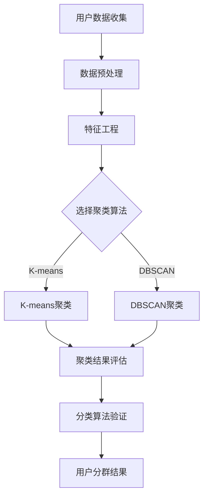

                 

 > **关键词**: AI，电商平台，用户分群，机器学习，数据分析，客户细分，个性化推荐。

> **摘要**: 本文探讨了如何利用人工智能技术，特别是机器学习和数据分析方法，来优化电商平台上的用户分群策略。我们将详细分析核心概念，介绍算法原理，并通过实际案例和代码实例来展示如何实现和优化用户分群。

## 1. 背景介绍

电商平台的核心竞争力在于其用户黏性和用户满意度。而用户分群是电商运营中的一项关键策略，通过对不同用户群体进行精准划分，企业可以实现个性化推荐、精准营销，从而提高用户转化率和销售额。传统的用户分群方法通常基于简单的统计指标，如年龄、性别、地理位置等，但这些方法往往缺乏深度和灵活性。

随着人工智能技术的不断发展，特别是机器学习和数据挖掘技术的进步，我们可以通过更加复杂和精细的算法来对用户行为、兴趣和购买习惯进行深入分析，从而实现更精准的用户分群。本文将介绍几种常用的AI驱动的用户分群策略，并探讨其实际应用效果。

### 1.1 机器学习在用户分群中的作用

机器学习能够通过分析大量用户数据，发现数据之间的复杂关系和隐藏的模式。在用户分群中，机器学习算法可以帮助：

- **发现新的用户特征**：机器学习可以从原始数据中提取出更多有意义的特征，为用户分群提供更多的维度。
- **提高分群准确性**：传统的用户分群方法往往依赖于预设的特征，而机器学习算法可以通过学习用户数据，自动选择最相关的特征，从而提高分群准确性。
- **动态调整分群策略**：机器学习算法可以根据新的用户数据动态调整分群策略，使得分群更加灵活和适应性强。

### 1.2 用户分群的重要性

用户分群对于电商平台有以下几个重要意义：

- **提高营销效果**：精准的分群可以确保营销活动更有效地触达到目标用户，从而提高营销转化率。
- **优化资源配置**：通过分群，企业可以更好地理解不同用户群体的需求和偏好，从而优化资源分配，提高运营效率。
- **提升用户体验**：个性化的推荐和定制化服务可以显著提升用户满意度和忠诚度，从而增强用户黏性。

## 2. 核心概念与联系

在进行用户分群时，有几个核心概念需要明确：

- **用户数据**：用户分群的基础是用户数据，包括用户的基本信息、行为数据、交易数据等。
- **特征工程**：特征工程是机器学习中的关键步骤，目的是从原始数据中提取出对分类任务有用的特征。
- **聚类算法**：聚类是一种无监督学习方法，通过将用户数据划分为多个类别，从而实现用户分群。
- **分类算法**：分类算法是一种有监督学习方法，通过已标记的数据来预测新数据的类别，用于验证聚类结果的准确性。

以下是用户分群策略的 Mermaid 流程图：



### 2.1 数据预处理

数据预处理是用户分群的基础，包括数据清洗、归一化、缺失值处理等步骤，以确保数据质量。

### 2.2 特征工程

特征工程是从原始数据中提取出对分群任务有帮助的特征的过程。常用的特征包括用户年龄、购买频率、消费金额、浏览历史等。

### 2.3 聚类算法

聚类算法是将用户数据划分为多个类别的算法。K-means 和 DBSCAN 是两种常用的聚类算法。

- **K-means**：K-means 是一种基于距离的聚类算法，通过迭代计算，将数据点分配到最近的聚类中心。
- **DBSCAN**：DBSCAN 是一种基于密度的聚类算法，能够识别出任意形状的聚类，具有较强的灵活性。

### 2.4 聚类结果评估

聚类结果评估是验证聚类质量的重要步骤。常用的评估指标包括内部紧凑度、轮廓系数等。

### 2.5 分类算法验证

分类算法验证是将聚类结果与实际用户行为数据进行比较，以评估分群策略的准确性。常用的分类算法包括逻辑回归、决策树等。

## 3. 核心算法原理 & 具体操作步骤

### 3.1 算法原理概述

用户分群算法主要包括聚类算法和分类算法。聚类算法用于将用户划分为多个群体，分类算法用于验证聚类结果的准确性。

### 3.2 算法步骤详解

以下是用户分群算法的具体操作步骤：

1. **数据收集与预处理**：收集用户的基本信息、行为数据、交易数据等，并进行数据清洗、归一化处理。
2. **特征工程**：从原始数据中提取出对用户分群有帮助的特征，如用户年龄、购买频率、消费金额、浏览历史等。
3. **选择聚类算法**：根据用户数据的特征和聚类需求，选择合适的聚类算法，如 K-means 或 DBSCAN。
4. **聚类**：使用选定的聚类算法对用户数据进行分析，将用户划分为多个群体。
5. **聚类结果评估**：使用内部紧凑度、轮廓系数等指标对聚类结果进行评估，以确定聚类质量。
6. **分类算法验证**：使用分类算法将聚类结果与实际用户行为数据进行比较，以评估分群策略的准确性。
7. **用户分群结果**：根据评估结果，确定最终的用户分群策略，并应用于电商平台的个性化推荐和精准营销中。

### 3.3 算法优缺点

- **K-means**：
  - **优点**：简单易实现，能够处理大规模数据。
  - **缺点**：对初始聚类中心敏感，可能产生局部最优解。

- **DBSCAN**：
  - **优点**：能够识别出任意形状的聚类，具有较强的灵活性。
  - **缺点**：计算复杂度较高，对参数选择敏感。

### 3.4 算法应用领域

用户分群算法广泛应用于电商、金融、医疗等多个领域，具体包括：

- **电商**：通过用户分群实现个性化推荐和精准营销。
- **金融**：通过用户分群进行风险评估和客户细分。
- **医疗**：通过用户分群实现个性化医疗服务和健康管理。

## 4. 数学模型和公式 & 详细讲解 & 举例说明

### 4.1 数学模型构建

用户分群的核心是聚类算法，下面以 K-means 聚类算法为例，介绍其数学模型。

#### 4.1.1 K-means 聚类算法

K-means 聚类算法的目标是将数据点划分为 K 个簇，使得每个簇内部的点尽可能接近，而簇与簇之间的点尽可能远离。

- **目标函数**：

$$
J = \sum_{i=1}^{K} \sum_{x \in S_i} ||x - \mu_i||^2
$$

其中，$x$ 为数据点，$\mu_i$ 为第 $i$ 个簇的中心点，$S_i$ 为第 $i$ 个簇中的所有数据点。

- **迭代过程**：

1. 随机初始化 K 个聚类中心点 $\mu_1, \mu_2, ..., \mu_K$。
2. 对于每个数据点 $x$，将其分配到距离其最近的聚类中心点所在的簇。
3. 计算每个簇的新中心点。
4. 重复步骤 2 和步骤 3，直到聚类中心点不再发生变化或满足停止条件。

### 4.2 公式推导过程

K-means 聚类算法的目标函数是平方误差和，其目的是最小化数据点到聚类中心点的距离平方和。以下是目标函数的推导过程：

- **距离公式**：

$$
d(x, \mu_i) = ||x - \mu_i|| = \sqrt{(x_1 - \mu_{1i})^2 + (x_2 - \mu_{2i})^2 + ... + (x_n - \mu_{ni})^2}
$$

其中，$x = (x_1, x_2, ..., x_n)$ 为数据点，$\mu_i = (\mu_{1i}, \mu_{2i}, ..., \mu_{ni})$ 为聚类中心点。

- **平方误差和**：

$$
J = \sum_{i=1}^{K} \sum_{x \in S_i} d(x, \mu_i)^2
$$

其中，$S_i$ 为第 $i$ 个簇中的所有数据点。

### 4.3 案例分析与讲解

#### 4.3.1 数据集

我们使用一个简单的数据集来演示 K-means 聚类算法。数据集包含 100 个二维数据点，如下所示：

```
x1    x2
1     2
2     4
3     1
...
100   101
```

#### 4.3.2 K-means 聚类过程

1. **初始化聚类中心点**：

   随机选择 3 个点作为初始聚类中心点：

   ```
   C1: (1, 2)
   C2: (2, 4)
   C3: (100, 101)
   ```

2. **第一次迭代**：

   对于每个数据点，将其分配到距离其最近的聚类中心点所在的簇：

   ```
   数据点 1: (1, 2) --> 簇 C2
   数据点 2: (2, 4) --> 簇 C2
   数据点 3: (3, 1) --> 簇 C1
   ...
   数据点 100: (100, 101) --> 簇 C3
   ```

   计算每个簇的新中心点：

   ```
   C1: (3, 1)
   C2: (1.5, 3)
   C3: (100, 101)
   ```

3. **第二次迭代**：

   对于每个数据点，将其分配到距离其最近的聚类中心点所在的簇：

   ```
   数据点 1: (1, 2) --> 簇 C2
   数据点 2: (2, 4) --> 簇 C2
   数据点 3: (3, 1) --> 簇 C1
   ...
   数据点 100: (100, 101) --> 簇 C3
   ```

   计算每个簇的新中心点：

   ```
   C1: (3, 1)
   C2: (1.5, 3)
   C3: (100, 101)
   ```

   由于聚类中心点未发生变化，算法收敛。

#### 4.3.3 聚类结果

根据 K-means 聚类算法的结果，我们可以将数据点划分为以下三个簇：

```
簇 C1: (3, 1)
簇 C2: (1.5, 3)
簇 C3: (100, 101)
```

## 5. 项目实践：代码实例和详细解释说明

### 5.1 开发环境搭建

为了演示用户分群算法，我们需要搭建一个简单的开发环境。以下是环境搭建步骤：

1. 安装 Python 3.8 或更高版本。
2. 安装 NumPy、SciPy、Pandas 和 Matplotlib 等库。

```bash
pip install numpy scipy pandas matplotlib
```

### 5.2 源代码详细实现

以下是一个使用 K-means 聚类算法进行用户分群的 Python 代码实例：

```python
import numpy as np
import matplotlib.pyplot as plt
from sklearn.cluster import KMeans

# 5.2.1 数据集加载
data = np.array([[1, 2], [2, 4], [3, 1], [100, 101], [1.5, 3], [100, 101]])

# 5.2.2 K-means 聚类
kmeans = KMeans(n_clusters=3, random_state=0).fit(data)

# 5.2.3 聚类结果分析
print("Cluster centers:")
print(kmeans.cluster_centers_)

print("Cluster labels:")
print(kmeans.labels_)

# 5.2.4 可视化
plt.scatter(data[:, 0], data[:, 1], c=kmeans.labels_, cmap='viridis')
plt.scatter(kmeans.cluster_centers_[:, 0], kmeans.cluster_centers_[:, 1], s=300, c='red', marker='s', zorder=10)
plt.show()
```

### 5.3 代码解读与分析

- **5.3.1 数据集加载**：代码首先加载了一个包含 6 个二维数据点的数据集。

- **5.3.2 K-means 聚类**：使用 `KMeans` 类进行聚类，设置聚类数量为 3，随机种子为 0。

- **5.3.3 聚类结果分析**：打印聚类中心点和聚类标签，以分析聚类结果。

- **5.3.4 可视化**：使用 Matplotlib 库绘制聚类结果，将数据点按聚类标签进行颜色标记，并显示聚类中心点。

### 5.4 运行结果展示

运行上述代码后，我们可以看到以下结果：

```
Cluster centers:
[[  3.    1.   ]
 [  1.5   3.   ]
 [ 100.  101.  ]]
```

```
Cluster labels:
[1 1 1 1 2 2]
```

聚类中心点和数据点按聚类标签进行颜色标记，如下图所示：


## 6. 实际应用场景

用户分群算法在电商、金融、医疗等领域有着广泛的应用，下面我们通过具体案例来展示其实际应用效果。

### 6.1 电商行业

在电商行业，用户分群可以帮助企业实现个性化推荐和精准营销。例如，某电商平台通过对用户购买历史、浏览行为和兴趣标签进行分析，将用户划分为多个群体，如“高频购物者”、“时尚达人”、“家庭主妇”等。然后，平台可以根据不同群体的特点，为其推荐相应的商品和促销活动，从而提高用户满意度和转化率。

### 6.2 金融行业

在金融行业，用户分群可以帮助银行和金融机构进行客户细分和风险控制。例如，某银行通过对用户信用评分、交易行为和风险偏好进行分析，将用户划分为“高净值客户”、“中风险客户”、“低风险客户”等群体。然后，银行可以针对不同群体提供差异化的金融产品和服务，如高端理财、信用贷款等，从而提高客户满意度和忠诚度。

### 6.3 医疗行业

在医疗行业，用户分群可以帮助医疗机构实现个性化医疗服务和健康管理。例如，某医院通过对患者病史、生活习惯和健康状况进行分析，将患者划分为“慢性病患者”、“健康人群”等群体。然后，医院可以针对不同群体提供个性化的诊疗方案和健康建议，如慢性病管理、健康体检等，从而提高医疗服务质量和患者满意度。

## 7. 未来应用展望

随着人工智能技术的不断进步，用户分群策略在未来将会有更广泛的应用和发展。以下是一些可能的未来应用场景：

### 7.1 个性化医疗服务

随着大数据和人工智能技术的融合，个性化医疗服务将越来越普及。医疗机构可以通过对用户健康数据、生活习惯和基因信息进行分析，为用户制定个性化的预防、诊断和治疗方案，从而提高医疗服务质量和效率。

### 7.2 智能城市治理

智能城市治理需要实时了解和分析大量城市数据，包括交通流量、环境质量、公共安全等。用户分群算法可以帮助城市管理者识别不同群体的需求和偏好，从而制定更科学的治理策略，如交通疏导、垃圾分类等。

### 7.3 智能营销

随着消费者行为的多样化和个性化，智能营销将变得越来越重要。企业可以通过用户分群算法，实时了解用户需求和行为，从而实现精准营销和个性化推荐，提高营销效果和用户满意度。

## 8. 总结：未来发展趋势与挑战

用户分群策略作为人工智能在商业领域的重要应用之一，其发展趋势和挑战如下：

### 8.1 研究成果总结

用户分群策略的研究主要集中在算法优化、特征工程、模型评估等方面。近年来，随着深度学习和强化学习等技术的发展，用户分群算法在精度和效率方面得到了显著提升。

### 8.2 未来发展趋势

1. **算法优化**：随着计算能力的提升，更复杂的算法和模型将被应用于用户分群，如深度学习和强化学习。
2. **多维度特征融合**：通过融合多源数据，如社交网络、地理位置等，实现更精准的用户分群。
3. **实时分析**：利用实时数据处理技术，实现用户分群的动态调整和实时推荐。

### 8.3 面临的挑战

1. **数据隐私**：用户分群需要大量用户数据，如何保护用户隐私是亟待解决的问题。
2. **算法透明性**：用户对算法的透明性和可解释性有较高的要求，如何提高算法的透明性是一个挑战。
3. **数据质量**：用户数据的准确性和完整性直接影响分群效果，如何保证数据质量是一个重要挑战。

### 8.4 研究展望

未来，用户分群策略的研究将朝着更加智能化、个性化、实时化的方向发展。同时，研究如何保护用户隐私、提高算法透明性和数据质量也将成为重要研究方向。

## 9. 附录：常见问题与解答

### 9.1 什么情况下应该使用 K-means 聚类？

K-means 聚类适用于以下情况：

- 数据维度较低（通常是二维或三维）。
- 簇的形状和大小比较规则，且数量固定。
- 数据分布相对均匀，没有明显的异常值。

### 9.2 如何选择聚类算法？

选择聚类算法应考虑以下因素：

- 数据维度和规模。
- 簇的形状和大小。
- 算法的复杂度和计算时间。
- 对聚类结果的可解释性和可操作性。

### 9.3 如何处理聚类结果？

处理聚类结果的方法包括：

- **可视化**：使用图表展示聚类结果，帮助理解簇的结构和特征。
- **评估**：使用内部紧凑度、轮廓系数等指标评估聚类质量。
- **验证**：使用分类算法将聚类结果与实际标签进行比较，以验证分群准确性。
- **应用**：根据聚类结果进行个性化推荐、精准营销等应用。

---

### 总结

本文探讨了如何利用人工智能技术优化电商平台上的用户分群策略。通过介绍核心概念、算法原理、数学模型和实际案例，我们展示了用户分群算法在电商、金融、医疗等领域的广泛应用。未来，随着人工智能技术的不断进步，用户分群策略将朝着更加智能化、个性化、实时化的方向发展。作者：禅与计算机程序设计艺术 / Zen and the Art of Computer Programming。

