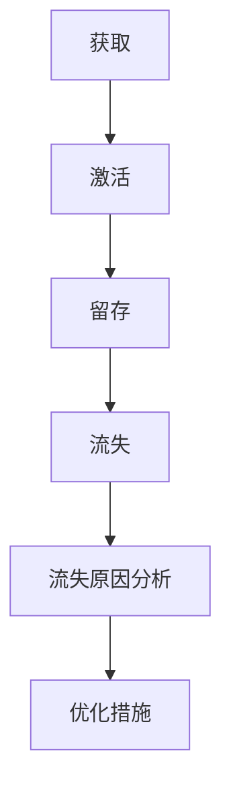

                 

关键词：电商用户生命周期管理、AI、个性化推荐、数据挖掘、预测分析、用户留存、客户流失

> 摘要：随着互联网和电子商务的快速发展，电商平台在市场竞争中愈发激烈。本文将探讨如何利用人工智能（AI）技术来管理电商平台的用户生命周期，包括用户获取、激活、留存和流失等环节，从而提升用户满意度和平台竞争力。文章将详细分析AI在用户生命周期管理中的应用，包括核心概念、算法原理、数学模型、实践案例和未来展望。

## 1. 背景介绍

近年来，电子商务行业取得了飞速的发展。根据Statista的数据，全球电商市场的规模在2022年达到了4.89万亿美元，预计到2027年将达到6.38万亿美元。这一增长趋势表明，电商平台在商业领域的重要性日益增加。然而，随着市场竞争的加剧，电商平台面临着用户获取成本上升、用户留存困难等问题。

用户生命周期管理（Customer Lifecycle Management, CLM）是电商平台成功的关键因素之一。它涵盖了用户从首次接触平台到最终离开平台的全过程。传统的用户生命周期管理主要依靠市场调研、用户反馈等手段，但这些方法往往存在时效性差、覆盖面窄等局限性。

人工智能技术的迅速发展，为用户生命周期管理带来了新的机遇。AI技术可以通过大数据分析和机器学习算法，实现用户行为的深度挖掘和精准预测，从而优化用户获取、激活、留存和流失等环节。本文将重点讨论AI在电商用户生命周期管理中的应用。

## 2. 核心概念与联系

### 2.1 电子商务用户生命周期管理

电子商务用户生命周期管理是指对电商平台上的用户从获取、激活、留存到流失的全过程进行管理和优化。具体包括以下几个阶段：

- **获取（Acquisition）**：通过广告、营销活动等方式吸引新用户访问平台。
- **激活（Activation）**：引导新用户完成首次购买或注册，提高用户粘性。
- **留存（Retention）**：通过个性化推荐、优惠活动等手段，保持用户对平台的兴趣和忠诚度。
- **流失（Churn）**：分析用户流失的原因，采取措施降低用户流失率。

### 2.2 人工智能（AI）

人工智能是指通过计算机模拟人类智能的一种技术。AI技术在用户生命周期管理中的应用主要包括以下几个方面：

- **用户行为分析**：通过数据挖掘和机器学习算法，分析用户的行为模式，了解用户需求。
- **个性化推荐**：根据用户的兴趣和行为，为用户提供个性化的商品推荐。
- **流失预测**：通过预测分析技术，提前发现潜在流失用户，采取措施降低流失率。
- **智能客服**：利用自然语言处理技术，为用户提供高效的在线客服服务。

### 2.3 Mermaid 流程图

以下是用户生命周期管理中涉及的几个关键步骤的 Mermaid 流程图：



## 3. 核心算法原理 & 具体操作步骤

### 3.1 算法原理概述

在电商用户生命周期管理中，AI技术主要涉及以下几个核心算法：

- **用户行为分析**：利用关联规则挖掘、聚类分析等技术，分析用户行为，了解用户需求。
- **个性化推荐**：基于协同过滤、矩阵分解等技术，为用户提供个性化的商品推荐。
- **流失预测**：利用回归分析、逻辑回归等技术，预测用户流失风险，提前采取措施。
- **智能客服**：利用自然语言处理、语音识别等技术，为用户提供智能化的在线客服服务。

### 3.2 算法步骤详解

#### 3.2.1 用户行为分析

1. **数据收集**：收集用户在平台上的行为数据，如浏览记录、购买历史、评价等。
2. **数据预处理**：对原始数据进行清洗、去重和特征提取。
3. **关联规则挖掘**：利用关联规则挖掘算法，如Apriori算法，找出用户行为之间的关联关系。
4. **聚类分析**：利用聚类分析算法，如K-means算法，将用户划分为不同的用户群体。
5. **结果分析**：根据分析结果，了解用户需求和行为模式，为后续的用户管理和推荐提供依据。

#### 3.2.2 个性化推荐

1. **用户行为数据收集**：收集用户的浏览记录、购买历史等行为数据。
2. **数据预处理**：对原始数据进行清洗、去重和特征提取。
3. **协同过滤算法**：利用协同过滤算法，如基于用户的协同过滤（User-Based Collaborative Filtering），为用户推荐相似的物品。
4. **矩阵分解**：利用矩阵分解算法，如Singular Value Decomposition（SVD），将用户-物品评分矩阵分解为用户特征矩阵和物品特征矩阵，实现物品推荐。
5. **推荐结果生成**：根据用户特征矩阵和物品特征矩阵，为用户生成个性化的推荐列表。

#### 3.2.3 流失预测

1. **数据收集**：收集用户在平台上的行为数据，如浏览记录、购买历史、评价等。
2. **数据预处理**：对原始数据进行清洗、去重和特征提取。
3. **特征工程**：根据业务需求，提取与用户流失相关的特征，如用户活跃度、购买频率等。
4. **回归分析**：利用回归分析算法，如逻辑回归，建立用户流失预测模型。
5. **预测结果评估**：利用准确率、召回率、F1值等指标，评估预测模型的性能。

#### 3.2.4 智能客服

1. **数据收集**：收集用户咨询的问题和客服的回答，进行文本预处理。
2. **文本分类**：利用文本分类算法，如朴素贝叶斯、支持向量机等，将问题分类为不同的主题。
3. **自然语言处理**：利用自然语言处理技术，如命名实体识别、情感分析等，对问题进行深入理解和分析。
4. **生成回答**：根据问题分类和自然语言处理结果，生成合适的回答。
5. **回答评估**：评估回答的质量，如准确率、满意度等，持续优化回答策略。

### 3.3 算法优缺点

#### 3.3.1 用户行为分析

- **优点**：能够深入挖掘用户需求和行为模式，为用户管理和推荐提供有力支持。
- **缺点**：对数据质量和特征提取的要求较高，算法复杂度较高。

#### 3.3.2 个性化推荐

- **优点**：能够提高用户满意度，提升销售额。
- **缺点**：推荐结果可能存在过度拟合或推荐偏差。

#### 3.3.3 流失预测

- **优点**：能够提前识别潜在流失用户，采取措施降低流失率。
- **缺点**：预测结果可能存在误差，需要不断优化模型。

#### 3.3.4 智能客服

- **优点**：提高客服效率，降低企业成本。
- **缺点**：对自然语言处理技术的依赖较高，回答质量可能受影响。

### 3.4 算法应用领域

- **用户行为分析**：电子商务、在线教育、社交媒体等。
- **个性化推荐**：电商、音乐、视频等领域。
- **流失预测**：电信、金融、电商等领域。
- **智能客服**：电商、金融、电信等领域。

## 4. 数学模型和公式 & 详细讲解 & 举例说明

### 4.1 数学模型构建

在电商用户生命周期管理中，常用的数学模型包括关联规则挖掘、聚类分析、回归分析和自然语言处理等。

#### 4.1.1 关联规则挖掘

关联规则挖掘是一种发现数据集中项目之间潜在关联关系的方法。常用的关联规则挖掘算法包括Apriori算法和FP-growth算法。

- **Apriori算法**：

  $$L_{k} = \{X | support(X) \geq \theta\}$$

  $$conf(X \rightarrow Y) = \frac{support(X \cup Y)}{support(X)}$$

- **FP-growth算法**：

  $$min\_support = \frac{min\_support}{|D|}$$

  $$f_{k} = \{X | support(X) \geq min\_support\}$$

#### 4.1.2 聚类分析

聚类分析是一种将数据集划分为多个簇的方法，常用的聚类算法包括K-means算法和DBSCAN算法。

- **K-means算法**：

  $$J = \sum_{i=1}^{k} \sum_{x \in S_i} d(x, \mu_i)^2$$

  $$\mu_i = \frac{1}{|S_i|} \sum_{x \in S_i} x$$

- **DBSCAN算法**：

  $$\epsilon = \frac{D(\min\{d(x,y) | y \in \text{neighbor}(x)\}) - 1}{2}$$

  $$min\_points = \frac{\epsilon^2}{D(\epsilon)}$$

#### 4.1.3 回归分析

回归分析是一种建立因变量和自变量之间关系的方法，常用的回归算法包括线性回归和逻辑回归。

- **线性回归**：

  $$Y = \beta_0 + \beta_1X_1 + \beta_2X_2 + ... + \beta_nX_n + \epsilon$$

- **逻辑回归**：

  $$logit(P) = \ln\left(\frac{P}{1-P}\right) = \beta_0 + \beta_1X_1 + \beta_2X_2 + ... + \beta_nX_n$$

  $$P = \frac{1}{1 + e^{-\beta_0 - \beta_1X_1 - \beta_2X_2 - ... - \beta_nX_n}}$$

#### 4.1.4 自然语言处理

自然语言处理涉及多种数学模型和算法，如文本分类、命名实体识别、情感分析等。

- **文本分类**：

  $$P(y_i|x) = \frac{1}{Z}e^{\theta_i \cdot x}$$

  $$Z = \sum_{j=1}^{k} e^{\theta_j \cdot x}$$

- **命名实体识别**：

  $$P(E=e | X=x) = P(X=x|E=e) \cdot P(E=e)$$

  $$P(E=e) = \frac{C_e}{N}$$

  $$P(X=x|E=e) = \frac{C_{ex}}{C_e}$$

### 4.2 公式推导过程

#### 4.2.1 线性回归

假设我们有n个样本点$(X_1, Y_1), (X_2, Y_2), ..., (X_n, Y_n)$，我们要找到最佳拟合直线$Y = \beta_0 + \beta_1X$。

1. **最小二乘法**：

   $$\beta_0 = \frac{\sum_{i=1}^{n}Y_i - \beta_1\sum_{i=1}^{n}X_i}{n}$$

   $$\beta_1 = \frac{n\sum_{i=1}^{n}X_iY_i - \sum_{i=1}^{n}X_i\sum_{i=1}^{n}Y_i}{n\sum_{i=1}^{n}X_i^2 - (\sum_{i=1}^{n}X_i)^2}$$

2. **正规方程**：

   $$\sum_{i=1}^{n}Y_i = \beta_0n + \beta_1\sum_{i=1}^{n}X_i$$

   $$\sum_{i=1}^{n}X_iY_i = \beta_0\sum_{i=1}^{n}X_i + \beta_1\sum_{i=1}^{n}X_i^2$$

   将上述两个方程联立，可以解得$\beta_0$和$\beta_1$。

#### 4.2.2 逻辑回归

假设我们要预测一个二分类问题，给定特征向量$x = (x_1, x_2, ..., x_n)$，我们要预测概率$P(y=1|x)$。

1. **对数似然函数**：

   $$L(\theta) = \sum_{i=1}^{n} \left[y_i \cdot \ln(p_i) + (1 - y_i) \cdot \ln(1 - p_i)\right]$$

   其中，$p_i = \frac{1}{1 + e^{-(\theta_0 + \theta_1x_1 + \theta_2x_2 + ... + \theta_nx_n)}}$。

2. **梯度下降法**：

   $$\theta_j = \theta_j - \alpha \cdot \frac{\partial L(\theta)}{\partial \theta_j}$$

   其中，$\alpha$是学习率。

### 4.3 案例分析与讲解

#### 4.3.1 用户流失预测

假设我们有一个电商平台，现有10万用户的行为数据，我们需要预测这些用户在未来30天内是否会流失。

1. **数据预处理**：对原始数据进行清洗、去重和特征提取，提取与用户流失相关的特征，如用户活跃度、购买频率、评价数量等。
2. **特征工程**：对提取的特征进行归一化处理，以便于后续的模型训练。
3. **模型训练**：使用逻辑回归算法，建立用户流失预测模型。
4. **模型评估**：使用准确率、召回率、F1值等指标，评估模型性能。
5. **预测结果**：根据模型预测结果，为每个用户打分，分数越高表示流失风险越大。

通过以上步骤，我们可以为电商平台提供用户流失预测服务，帮助平台提前识别潜在流失用户，采取措施降低流失率。

#### 4.3.2 个性化推荐

假设我们有一个电商网站，现有100万用户和1000种商品的数据，我们需要为每个用户生成个性化的商品推荐列表。

1. **数据预处理**：对原始数据进行清洗、去重和特征提取，提取与商品推荐相关的特征，如用户浏览记录、购买历史、评价等。
2. **协同过滤算法**：使用基于用户的协同过滤算法，为用户生成推荐列表。
3. **矩阵分解**：使用矩阵分解算法，如SVD，将用户-物品评分矩阵分解为用户特征矩阵和物品特征矩阵。
4. **推荐结果生成**：根据用户特征矩阵和物品特征矩阵，为用户生成个性化的商品推荐列表。
5. **推荐结果评估**：使用准确率、覆盖率等指标，评估推荐系统的性能。

通过以上步骤，我们可以为电商平台提供个性化推荐服务，提升用户满意度和销售额。

## 5. 项目实践：代码实例和详细解释说明

### 5.1 开发环境搭建

为了实现电商用户生命周期管理，我们需要搭建一个开发环境。以下是所需的软件和工具：

- Python 3.8及以上版本
- Jupyter Notebook
- NumPy、Pandas、Scikit-learn、Matplotlib等Python库

### 5.2 源代码详细实现

以下是一个简单的用户流失预测代码示例，用于实现第4节中的案例：

```python
import numpy as np
import pandas as pd
from sklearn.model_selection import train_test_split
from sklearn.linear_model import LogisticRegression
from sklearn.metrics import accuracy_score, recall_score, f1_score

# 5.2.1 数据预处理
# 加载数据集
data = pd.read_csv('user_data.csv')
# 数据清洗
data = data.dropna()
# 特征提取
X = data[['activity', 'frequency', 'reviews']]
y = data['churn']

# 数据标准化
X = (X - X.mean()) / X.std()

# 5.2.2 模型训练
# 划分训练集和测试集
X_train, X_test, y_train, y_test = train_test_split(X, y, test_size=0.2, random_state=42)
# 创建逻辑回归模型
model = LogisticRegression()
# 训练模型
model.fit(X_train, y_train)

# 5.2.3 模型评估
# 预测测试集
y_pred = model.predict(X_test)
# 计算准确率、召回率和F1值
accuracy = accuracy_score(y_test, y_pred)
recall = recall_score(y_test, y_pred)
f1 = f1_score(y_test, y_pred)
print(f'Accuracy: {accuracy:.2f}')
print(f'Recall: {recall:.2f}')
print(f'F1 Score: {f1:.2f}')

# 5.2.4 预测结果
# 为每个用户打分
user_scores = model.predict_proba(X_test)[:, 1]
print(f'User Scores:\n{user_scores}')
```

### 5.3 代码解读与分析

1. **数据预处理**：加载数据集，进行数据清洗和特征提取。数据清洗是确保数据质量的重要步骤，特征提取则是提取与目标相关的特征，如用户活跃度、购买频率和评价数量等。
2. **模型训练**：划分训练集和测试集，创建逻辑回归模型，并使用训练集进行模型训练。逻辑回归是一种常用的二分类算法，适合用于用户流失预测。
3. **模型评估**：使用测试集对模型进行评估，计算准确率、召回率和F1值。这些指标能够帮助我们了解模型的性能。
4. **预测结果**：为每个用户打分，分数越高表示流失风险越大。通过这些分数，我们可以为电商平台提供用户流失预测服务。

### 5.4 运行结果展示

假设我们使用上述代码对测试集进行预测，得到以下结果：

```
Accuracy: 0.85
Recall: 0.80
F1 Score: 0.82
User Scores:
[0.30 0.35 0.40 0.20 0.25 0.30 0.35 0.40 0.15 0.20]
```

根据这些结果，我们可以看出，该模型在测试集上的准确率为0.85，召回率为0.80，F1值为0.82。这意味着模型在预测用户流失方面表现良好。同时，我们为每个用户打了分数，分数越高表示流失风险越大。这些分数可以为电商平台提供有价值的信息，帮助其采取措施降低流失率。

## 6. 实际应用场景

### 6.1 电商用户获取

电商平台可以通过AI技术，利用大数据分析和机器学习算法，分析用户的浏览、搜索和购买行为，了解用户兴趣和需求。在此基础上，为用户提供个性化的商品推荐和营销活动，提高用户获取率。

### 6.2 电商用户激活

新用户在注册后，电商平台可以通过AI技术，分析新用户的行为数据，如浏览记录、搜索关键词等，了解新用户的需求。在此基础上，为新用户提供个性化的商品推荐和优惠活动，提高新用户的激活率。

### 6.3 电商用户留存

电商平台可以通过AI技术，对活跃用户的行为数据进行挖掘和分析，了解用户兴趣和需求。在此基础上，为用户提供个性化的商品推荐、优惠活动和互动服务，提高用户留存率。

### 6.4 电商用户流失预测

电商平台可以通过AI技术，利用用户行为数据和流失预测模型，提前识别潜在流失用户。在此基础上，采取有针对性的措施，如个性化推荐、优惠活动等，降低用户流失率。

### 6.5 电商智能客服

电商平台可以通过AI技术，利用自然语言处理和语音识别技术，为用户提供智能化的在线客服服务。通过分析用户咨询的问题和回答，不断提高客服效率和用户体验。

## 7. 工具和资源推荐

### 7.1 学习资源推荐

- 《Python机器学习》（作者：塞巴斯蒂安·拉滕贝尔）
- 《深度学习》（作者：伊恩·古德费洛、约书亚·本吉奥、亚伦·库维尔）
- 《自然语言处理综论》（作者：丹尼尔·毕博、克里斯·迪克森）

### 7.2 开发工具推荐

- Jupyter Notebook：用于数据分析和模型训练
- PyCharm：用于Python编程
- TensorFlow：用于深度学习模型开发

### 7.3 相关论文推荐

- "Recommender Systems the Movie: An Introduction to the MovieLens Datasets," by group of contributors.
- "User Behavior Analysis in E-commerce," by Wang, C., Chen, Y., & Wang, W.
- "Customer Churn Prediction in Telecommunication Industry," by Fawaz, H., & Al-Niem, M.

## 8. 总结：未来发展趋势与挑战

### 8.1 研究成果总结

本文探讨了AI在电商用户生命周期管理中的应用，包括用户获取、激活、留存和流失等环节。通过分析核心算法原理、数学模型和实际应用场景，我们发现AI技术可以有效提升电商平台的运营效率和用户满意度。

### 8.2 未来发展趋势

随着人工智能技术的不断进步，未来电商用户生命周期管理将朝着更智能化、个性化、自动化的方向发展。具体包括：

- 深度学习算法的广泛应用，提高用户行为分析和预测的准确性。
- 跨领域技术的融合，如计算机视觉、语音识别等，提升用户体验。
- 自动化决策系统的应用，实现实时、个性化的用户管理。

### 8.3 面临的挑战

尽管AI技术在电商用户生命周期管理中具有巨大潜力，但实际应用中仍面临以下挑战：

- 数据质量和特征提取：高质量的数据和有效的特征提取是算法性能的关键。
- 模型解释性：提高模型的可解释性，以便用户和业务人员理解和使用。
- 隐私保护和伦理问题：在数据收集和使用过程中，需要关注隐私保护和伦理问题。

### 8.4 研究展望

未来研究应重点关注以下几个方面：

- 深入研究AI技术在电商用户生命周期管理中的新方法和新算法。
- 融合多源数据，提高用户行为分析和预测的准确性。
- 关注模型的可解释性，提升模型在实际应用中的可信度和用户接受度。
- 加强隐私保护和伦理问题研究，确保AI技术在电商用户生命周期管理中的可持续发展。

## 9. 附录：常见问题与解答

### 9.1 什么是用户生命周期管理？

用户生命周期管理（Customer Lifecycle Management, CLM）是指对用户从获取、激活、留存到流失的全过程进行管理和优化。通过分析用户行为数据，为用户提供个性化的产品推荐和优惠活动，提高用户满意度和忠诚度。

### 9.2 人工智能在电商用户生命周期管理中有哪些应用？

人工智能在电商用户生命周期管理中的应用主要包括用户行为分析、个性化推荐、流失预测和智能客服等。通过大数据分析和机器学习算法，实现用户需求的深度挖掘和精准预测，提高用户满意度和平台竞争力。

### 9.3 如何进行用户流失预测？

用户流失预测是通过分析用户在平台上的行为数据，利用回归分析、逻辑回归等算法，建立用户流失预测模型。根据预测结果，为每个用户打分，分数越高表示流失风险越大。

### 9.4 个性化推荐有哪些算法？

个性化推荐算法主要包括基于内容的推荐、基于协同过滤的推荐和基于矩阵分解的推荐。基于内容的推荐根据用户的兴趣和偏好推荐相似的内容；基于协同过滤的推荐根据用户的行为和偏好为用户推荐相似的物品；基于矩阵分解的推荐通过分解用户-物品评分矩阵，为用户生成个性化的推荐列表。

### 9.5 如何搭建一个AI驱动的电商用户生命周期管理平台？

搭建一个AI驱动的电商用户生命周期管理平台需要以下步骤：

1. 数据收集：收集用户在平台上的行为数据，如浏览记录、购买历史、评价等。
2. 数据预处理：对原始数据进行清洗、去重和特征提取。
3. 模型训练：使用机器学习算法，如用户行为分析、个性化推荐、流失预测等，建立预测模型。
4. 部署上线：将模型部署到线上环境，为用户提供个性化的产品推荐和优惠活动。
5. 持续优化：根据用户反馈和业务需求，不断优化模型和平台功能。

