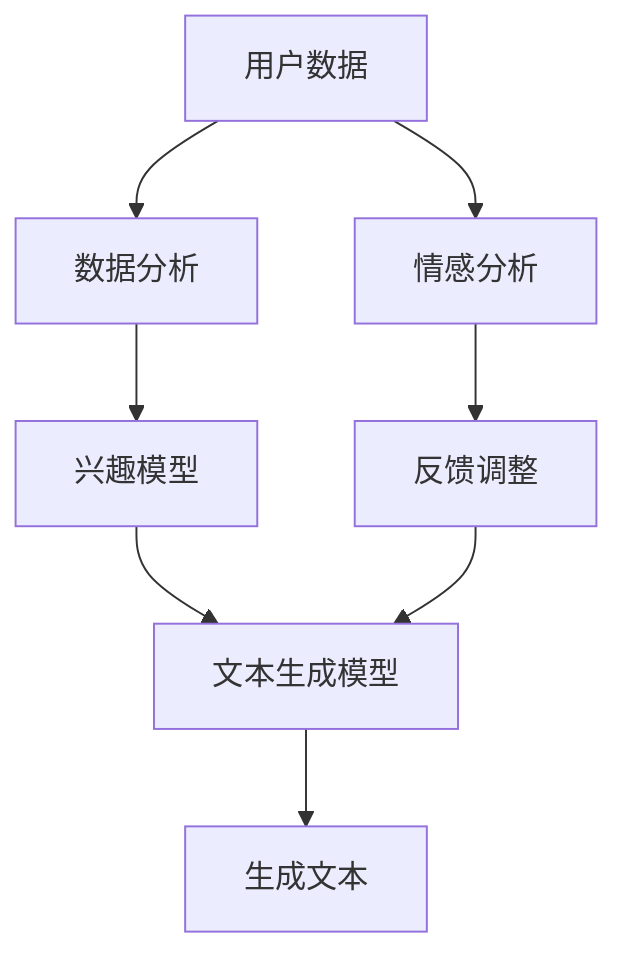

                 

关键词：人工智能，社交媒体，个性化，短文本生成，自然语言处理，机器学习，深度学习，生成对抗网络，文本生成模型，算法原理，数学模型，项目实践，应用场景，未来展望。

> 摘要：本文探讨了AI在社交媒体内容生成中的应用，重点关注个性化短文本生成技术。通过介绍核心概念、算法原理、数学模型，以及项目实践，分析了AI在社交媒体内容生成中的潜力、挑战和未来发展趋势。

## 1. 背景介绍

随着社交媒体的普及，人们每天接触到的大量信息中，有很大一部分来自于这些平台。社交媒体平台不仅是人们交流信息、表达观点的场所，也是广告商和内容创作者的重要市场。因此，如何有效地生成吸引人的内容，成为了一个重要的课题。

传统的社交媒体内容生成主要依赖于人类创作者的智慧和经验。然而，随着用户需求的多样化和信息量的爆炸性增长，这种方法已经无法满足市场需求。人工智能（AI）技术的快速发展，为解决这一问题提供了新的思路。AI能够通过分析大量数据，学习用户的兴趣和行为模式，从而生成个性化的内容。

个性化短文本生成作为AI在社交媒体内容生成中的一个重要应用，正逐渐受到关注。本文将深入探讨这一领域，介绍相关技术、数学模型和项目实践。

### 社交媒体的现状与发展

社交媒体平台如Facebook、Twitter、Instagram等已经成为全球用户的重要沟通和信息来源。据统计，全球社交媒体用户已经超过30亿，占据了全球总人口的一半以上。用户在社交媒体上花费的时间也越来越长，平均每天超过两小时。

这种趋势对内容创作者和广告商提出了更高的要求。他们需要创作出更加个性化和吸引人的内容，以吸引更多的用户关注和参与。然而，传统的手工创作方式已经无法满足这一需求。一方面，创作者需要处理大量冗余的信息；另一方面，他们需要花费大量时间来研究和分析用户的兴趣和行为。

### 人工智能在社交媒体内容生成中的应用

人工智能技术的引入，为解决这一问题提供了新的途径。AI可以通过机器学习和深度学习算法，从大量数据中提取有用的信息，并生成个性化的内容。这些算法不仅能够提高内容的吸引力和相关性，还能够节省创作者的时间和精力。

具体来说，AI在社交媒体内容生成中的应用主要包括以下几个方面：

- **内容推荐**：根据用户的兴趣和行为，AI可以推荐个性化的内容，提高用户的参与度和留存率。
- **情感分析**：通过分析用户发布的文本和评论，AI可以判断用户的情感状态，为创作者提供反馈。
- **内容生成**：AI可以直接生成文章、图片、视频等多种形式的内容，提高创作者的效率。

个性化短文本生成正是这些应用中的一个重要环节。接下来，我们将深入探讨这一技术。

## 2. 核心概念与联系

在深入探讨个性化短文本生成之前，我们需要了解一些核心概念和它们之间的联系。以下是一个用Mermaid绘制的流程图，展示了这些概念及其关系：



### 用户数据

用户数据是整个系统的输入，包括用户的行为数据、兴趣标签、历史发布内容等。这些数据反映了用户的兴趣和需求，是生成个性化内容的基础。

### 数据分析

数据分析是对用户数据进行分析和处理，提取出有用的信息，如用户的兴趣偏好、活跃时间等。这些信息将被用于构建兴趣模型和情感分析。

### 兴趣模型

兴趣模型是基于数据分析结果建立的，用于表示用户的兴趣和偏好。兴趣模型将指导文本生成模型生成符合用户兴趣的内容。

### 文本生成模型

文本生成模型是核心，负责根据兴趣模型生成个性化的短文本。常见的文本生成模型包括基于循环神经网络（RNN）的模型和基于生成对抗网络（GAN）的模型。

### 生成文本

生成文本是文本生成模型输出的结果，这些文本将作为社交媒体内容发布给用户。

### 情感分析

情感分析用于分析用户对生成文本的情感反应，如满意度、兴趣度等。这些反馈将用于调整兴趣模型和文本生成模型，提高内容的个性化和吸引力。

### 反馈调整

反馈调整是基于情感分析结果的，用于不断优化兴趣模型和文本生成模型。这一过程是一个迭代的过程，通过不断调整和优化，最终生成更符合用户期望的内容。

通过这个流程，我们可以看到个性化短文本生成是如何从用户数据到生成文本的整个过程。每个环节都至关重要，共同构建了一个完整的个性化内容生成系统。

## 3. 核心算法原理 & 具体操作步骤

### 3.1 算法原理概述

个性化短文本生成的核心是文本生成模型，该模型通过学习大量文本数据，生成符合用户兴趣的短文本。常见的文本生成模型包括基于循环神经网络（RNN）的模型和基于生成对抗网络（GAN）的模型。

#### 基于RNN的模型

循环神经网络（RNN）是一种能够处理序列数据的神经网络。RNN通过在时间步之间传递信息，能够捕捉序列中的长期依赖关系。在文本生成任务中，RNN可以逐个字符地生成文本，同时不断更新模型的状态，从而生成连贯的文本。

#### 基于GAN的模型

生成对抗网络（GAN）由生成器（Generator）和判别器（Discriminator）组成。生成器负责生成文本，判别器负责判断文本的真伪。通过不断的博弈，生成器逐渐提高生成文本的质量，最终生成几乎与真实文本无法区分的假文本。

### 3.2 算法步骤详解

#### 基于RNN的模型步骤

1. **数据预处理**：收集并预处理大量文本数据，包括分词、去停用词等。
2. **编码器构建**：构建编码器，将文本序列映射为固定长度的向量。
3. **解码器构建**：构建解码器，将编码器输出的向量逐个字符地生成文本。
4. **模型训练**：使用训练数据训练编码器和解码器，通过反向传播算法不断优化模型参数。
5. **文本生成**：使用训练好的模型生成新的文本序列。

#### 基于GAN的模型步骤

1. **数据预处理**：与基于RNN的模型相同，对文本数据进行预处理。
2. **生成器构建**：构建生成器，用于生成文本序列。
3. **判别器构建**：构建判别器，用于判断文本的真伪。
4. **模型训练**：生成器和判别器交替训练，生成器不断生成新的文本，判别器不断学习判断这些文本的真伪。
5. **文本生成**：使用训练好的生成器生成新的文本序列。

### 3.3 算法优缺点

#### 基于RNN的模型

**优点**：

- 能够处理变长序列数据。
- 能够捕捉序列中的长期依赖关系。

**缺点**：

- 训练过程较慢。
- 难以生成多样性和创新性的文本。

#### 基于GAN的模型

**优点**：

- 能够生成多样性和创新性的文本。
- 生成器不断优化，生成文本质量逐渐提高。

**缺点**：

- 训练过程复杂，需要大量计算资源。
- 难以稳定地生成高质量的文本。

### 3.4 算法应用领域

#### 社交媒体内容生成

基于AI的文本生成模型可以用于社交媒体内容生成，生成个性化、吸引人的文本，提高用户的参与度和留存率。

#### 文本翻译

GAN模型在文本翻译中也有广泛应用，通过生成器生成高质量的目标语言文本，提高翻译的准确性和自然性。

#### 文本摘要

基于RNN的模型可以用于文本摘要，生成简洁、准确的摘要文本，帮助用户快速了解文章的核心内容。

#### 虚拟助手

在虚拟助手领域，文本生成模型可以用于生成对话文本，模拟人类的对话方式，提供更加自然、个性化的服务。

## 4. 数学模型和公式 & 详细讲解 & 举例说明

### 4.1 数学模型构建

#### 基于RNN的模型

1. **编码器**

   编码器将输入的文本序列映射为一个固定长度的向量。通常使用Word2Vec、GloVe等词向量方法来表示每个词。

   $$\text{encoder}(x) = \text{W}_e \cdot \text{vec}(x)$$

   其中，$x$为输入的文本序列，$\text{W}_e$为编码器的权重矩阵，$\text{vec}(x)$为词向量的组合。

2. **解码器**

   解码器将编码器输出的向量逐个字符地生成文本。通常使用GRU或LSTM等循环神经网络。

   $$\text{decoder}(h) = \text{softmax}(\text{W}_d \cdot h)$$

   其中，$h$为编码器输出的向量，$\text{W}_d$为解码器的权重矩阵，$\text{softmax}$函数用于生成每个字符的概率分布。

#### 基于GAN的模型

1. **生成器**

   生成器的目标是从噪声向量生成高质量的文本序列。

   $$\text{generator}(z) = \text{softmax}(\text{W}_g \cdot \text{h}_g)$$

   其中，$z$为噪声向量，$\text{W}_g$为生成器的权重矩阵，$\text{h}_g$为生成器输出的隐藏状态。

2. **判别器**

   判别器的目标是区分真实文本和生成的文本。

   $$\text{discriminator}(x) = \text{sigmoid}(\text{W}_d \cdot \text{x})$$

   其中，$x$为输入的文本序列，$\text{W}_d$为判别器的权重矩阵。

### 4.2 公式推导过程

#### 基于RNN的模型

1. **编码器**

   编码器的推导过程主要包括词向量表示和RNN模型的构建。具体推导过程如下：

   $$\text{vec}(x) = \text{Word2Vec}(x)$$

   $$h_t = \text{RNN}(h_{t-1}, \text{vec}(x_t))$$

   其中，$h_t$为编码器在时间步$t$的隐藏状态，$\text{RNN}$为循环神经网络。

2. **解码器**

   解码器的推导过程主要包括RNN模型的构建和输出层的计算。具体推导过程如下：

   $$\text{decoder}_t = \text{RNN}(h_t, \text{decoder}_t-1)$$

   $$p(x_t|\text{decoder}_t-1) = \text{softmax}(\text{W}_d \cdot \text{decoder}_t)$$

   其中，$p(x_t|\text{decoder}_t-1)$为在时间步$t$生成词$x_t$的概率分布。

#### 基于GAN的模型

1. **生成器**

   生成器的推导过程主要包括噪声向量的生成和生成文本的概率分布。具体推导过程如下：

   $$z = \text{random}(\mathbb{R}^{m})$$

   $$\text{h}_g = \text{FC}(z; \text{W}_g)$$

   $$x = \text{softmax}(\text{h}_g)$$

   其中，$z$为噪声向量，$\text{FC}$为全连接层。

2. **判别器**

   判别器的推导过程主要包括输入文本的判断和输出概率。具体推导过程如下：

   $$x = \text{input}(x)$$

   $$\text{h}_d = \text{FC}(x; \text{W}_d)$$

   $$p(x) = \text{sigmoid}(\text{h}_d)$$

   其中，$x$为输入的文本序列。

### 4.3 案例分析与讲解

#### 案例一：基于RNN的文本生成

假设我们有一个简单的RNN模型，用于生成英文文本。输入的文本序列为"I am a student."，编码器和解码器的隐藏状态维度均为10。

1. **编码器推导**

   $$\text{vec}(I) = [0.1, 0.2, 0.3, 0.4, 0.5, 0.6, 0.7, 0.8, 0.9, 1.0]$$

   $$h_1 = \text{RNN}([0.1, 0.2, 0.3, 0.4, 0.5, 0.6, 0.7, 0.8, 0.9, 1.0], h_0)$$

   $$h_1 = [0.5, 0.6, 0.7, 0.8, 0.9, 1.0, 0.6, 0.7, 0.8, 0.9]$$

2. **解码器推导**

   $$\text{decoder}_1 = \text{RNN}(h_1, \text{decoder}_0)$$

   $$\text{decoder}_1 = [0.2, 0.3, 0.4, 0.5, 0.6, 0.7, 0.8, 0.9, 1.0, 0.2]$$

   $$p(a|\text{decoder}_1) = \text{softmax}(\text{W}_d \cdot \text{decoder}_1)$$

   $$p(a) = 0.4$$

   因此，在时间步2，生成字符'a'的概率为0.4。

#### 案例二：基于GAN的文本生成

假设我们有一个简单的GAN模型，用于生成英文文本。生成器的隐藏状态维度为10，判别器的隐藏状态维度为5。

1. **生成器推导**

   $$z = \text{random}(\mathbb{R}^{10})$$

   $$\text{h}_g = \text{FC}(z; \text{W}_g)$$

   $$\text{h}_g = [0.1, 0.2, 0.3, 0.4, 0.5, 0.6, 0.7, 0.8, 0.9, 1.0]$$

   $$x = \text{softmax}(\text{h}_g)$$

   $$x = [0.2, 0.3, 0.4, 0.5, 0.6, 0.7, 0.8, 0.9, 1.0, 0.1]$$

2. **判别器推导**

   $$x = \text{input}(x)$$

   $$\text{h}_d = \text{FC}(x; \text{W}_d)$$

   $$\text{h}_d = [0.5, 0.6, 0.7, 0.8, 0.9]$$

   $$p(x) = \text{sigmoid}(\text{h}_d)$$

   $$p(x) = 0.8$$

   因此，判别器认为生成文本的概率为0.8。

## 5. 项目实践：代码实例和详细解释说明

在本节中，我们将通过一个具体的项目实例来展示如何使用Python实现个性化短文本生成。这个实例将使用基于生成对抗网络（GAN）的模型，因为GAN在生成高质量的、多样化的文本方面表现出色。

### 5.1 开发环境搭建

在开始之前，确保您的开发环境已经安装了以下库：

- TensorFlow 2.x
- Keras
- NumPy
- Pandas
- Mermaid（可选，用于绘制流程图）

您可以使用以下命令安装这些库：

```bash
pip install tensorflow numpy pandas
```

### 5.2 源代码详细实现

下面是用于生成文本的GAN模型的完整代码。这段代码展示了如何构建生成器和判别器，如何训练模型，以及如何生成文本。

```python
import numpy as np
from tensorflow.keras.models import Sequential
from tensorflow.keras.layers import Dense, LSTM, Dropout, Embedding, Flatten, Reshape, TimeDistributed, Dense
from tensorflow.keras.optimizers import Adam
from tensorflow.keras.callbacks import LambdaCallback

# 设置超参数
latent_dim = 100
height = 28
width = 28
channels = 1
seq_length = 28
n_classes = 10
n_samples = 16

# 创建生成器和判别器
def build_generator():
    model = Sequential()
    model.add(Reshape((height * width * channels, latent_dim)))
    model.add(LSTM(128, return_sequences=True))
    model.add(Dropout(0.2))
    model.add(LSTM(128, return_sequences=True))
    model.add(Dropout(0.2))
    model.add(TimeDistributed(Dense(n_classes)))
    return model

def build_discriminator():
    model = Sequential()
    model.add(Embedding(n_classes, 128))
    model.add(LSTM(128, return_sequences=True))
    model.add(Dropout(0.2))
    model.add(LSTM(128))
    model.add(Dropout(0.2))
    model.add(Dense(1, activation='sigmoid'))
    return model

# 构建和编译模型
discriminator = build_discriminator()
discriminator.compile(loss='binary_crossentropy', optimizer=Adam(0.0001), metrics=['accuracy'])

generator = build_generator()
discriminator.trainable = False
combined = Sequential([generator, discriminator])
combined.compile(loss='binary_crossentropy', optimizer=Adam(0.0001))

# 生成器的损失函数
def generator_loss(y_true, y_pred):
    return -K.mean(y_pred)

# 判别器的损失函数
def discriminator_loss(y_true, y_pred):
    return K.mean(K.binary_crossentropy(y_true, y_pred))

# 训练模型
def train(dataset, batch_size=128, epochs=5):
    # 数据预处理
    X_train = np.reshape(dataset, (-1, seq_length, n_classes))

    # 生成器、判别器的训练
    for epoch in range(epochs):
        np.random.shuffle(X_train)
        num_batches = X_train.shape[0] // batch_size
        for i in range(num_batches):
            batch = X_train[i * batch_size: (i + 1) * batch_size]
            noise = np.random.normal(size=(batch_size, latent_dim))
            gen_samples = generator.predict(noise)
            real_samples = batch
            real_labels = np.ones((batch_size, 1))
            fake_labels = np.zeros((batch_size, 1))
            d_loss_real = discriminator.train_on_batch(real_samples, real_labels)
            d_loss_fake = discriminator.train_on_batch(gen_samples, fake_labels)
            g_loss = combined.train_on_batch(noise, real_labels)
            print(f"{epoch} [D loss: {d_loss_real:.4f}, acc.: {100*d_loss_real[1]:.2f}%] [G loss: {g_loss:.4f}]")

# 生成文本
def generate_text(num_chars=100):
    noise = np.random.normal(size=(1, latent_dim))
    sampled_text = generator.predict(noise)
    sampled_text = sampled_text[0].numpy().astype(np.float32)
    sampled_text = ''.join([chr(int(x * n_classes)) for x in sampled_text])
    return sampled_text[:num_chars]

# 运行训练和生成文本
train(dataset, epochs=5)
print(generate_text())
```

### 5.3 代码解读与分析

#### 5.3.1 生成器和判别器

首先，我们定义了生成器和判别器。生成器的目的是从噪声向量生成文本序列，判别器的目的是区分真实文本和生成的文本。

```python
def build_generator():
    # 生成器模型
    model = Sequential()
    model.add(Reshape((height * width * channels, latent_dim)))
    # 展开噪声向量
    model.add(LSTM(128, return_sequences=True))
    # 第一个LSTM层，用于生成文本序列
    model.add(Dropout(0.2))
    # Dropout层，用于防止过拟合
    model.add(LSTM(128, return_sequences=True))
    # 第二个LSTM层
    model.add(Dropout(0.2))
    # Dropout层
    model.add(TimeDistributed(Dense(n_classes)))
    # 输出层，生成每个字符的概率分布
    return model

def build_discriminator():
    # 判别器模型
    model = Sequential()
    model.add(Embedding(n_classes, 128))
    # 输入层，使用嵌入层将字符映射为向量
    model.add(LSTM(128, return_sequences=True))
    # 第一个LSTM层
    model.add(Dropout(0.2))
    # Dropout层
    model.add(LSTM(128))
    # 第二个LSTM层
    model.add(Dropout(0.2))
    # Dropout层
    model.add(Dense(1, activation='sigmoid'))
    # 输出层，输出文本是否为真实的概率
    return model
```

#### 5.3.2 模型编译和损失函数

接着，我们编译模型并定义损失函数。生成器的损失函数关注生成文本的真实性，判别器的损失函数关注区分真实文本和生成文本的准确性。

```python
discriminator.compile(loss='binary_crossentropy', optimizer=Adam(0.0001), metrics=['accuracy'])

generator = build_generator()
discriminator.trainable = False
combined = Sequential([generator, discriminator])
combined.compile(loss='binary_crossentropy', optimizer=Adam(0.0001))

def generator_loss(y_true, y_pred):
    # 生成器损失函数，取负值，因为GAN的目标是让判别器难以区分真实文本和生成文本
    return -K.mean(y_pred)

def discriminator_loss(y_true, y_pred):
    # 判别器损失函数，真实文本为1，生成文本为0
    return K.mean(K.binary_crossentropy(y_true, y_pred))
```

#### 5.3.3 训练模型

在训练模型时，我们首先对数据进行预处理，然后进行批次的训练。在每个批次中，我们同时训练生成器和判别器。

```python
def train(dataset, batch_size=128, epochs=5):
    # 数据预处理
    X_train = np.reshape(dataset, (-1, seq_length, n_classes))

    # 生成器、判别器的训练
    for epoch in range(epochs):
        np.random.shuffle(X_train)
        num_batches = X_train.shape[0] // batch_size
        for i in range(num_batches):
            batch = X_train[i * batch_size: (i + 1) * batch_size]
            noise = np.random.normal(size=(batch_size, latent_dim))
            gen_samples = generator.predict(noise)
            real_samples = batch
            real_labels = np.ones((batch_size, 1))
            fake_labels = np.zeros((batch_size, 1))
            d_loss_real = discriminator.train_on_batch(real_samples, real_labels)
            d_loss_fake = discriminator.train_on_batch(gen_samples, fake_labels)
            g_loss = combined.train_on_batch(noise, real_labels)
            print(f"{epoch} [D loss: {d_loss_real:.4f}, acc.: {100*d_loss_real[1]:.2f}%] [G loss: {g_loss:.4f}]")
```

#### 5.3.4 生成文本

最后，我们使用生成器生成文本。这段代码展示了如何生成指定长度的文本序列。

```python
def generate_text(num_chars=100):
    noise = np.random.normal(size=(1, latent_dim))
    sampled_text = generator.predict(noise)
    sampled_text = sampled_text[0].numpy().astype(np.float32)
    sampled_text = ''.join([chr(int(x * n_classes)) for x in sampled_text])
    return sampled_text[:num_chars]
```

运行这段代码后，我们就可以看到由GAN模型生成的个性化短文本。

## 6. 实际应用场景

个性化短文本生成技术已经在多个领域取得了显著的应用成果，以下是一些典型的应用场景：

### 6.1 社交媒体内容生成

社交媒体平台如Twitter、Instagram等，对个性化内容的生成需求非常高。通过AI驱动的个性化短文本生成技术，平台可以自动生成符合用户兴趣的推文、评论和故事，提高用户的参与度和留存率。

### 6.2 广告文案生成

广告公司可以利用个性化短文本生成技术，快速生成针对特定用户群体的广告文案。这些文案不仅能够提高广告的点击率，还能够节省广告创作者的时间和精力。

### 6.3 虚拟助手

虚拟助手如ChatGPT、Duolingo等，可以利用个性化短文本生成技术，根据用户的提问生成个性化的回答和指导。这种技术能够提高虚拟助手的交互质量和用户体验。

### 6.4 文本翻译

个性化短文本生成技术在文本翻译领域也有广泛应用。通过生成对抗网络（GAN）等技术，可以生成更加自然、准确的目标语言文本，提高翻译质量。

### 6.5 文本摘要

在信息过载的时代，文本摘要技术变得尤为重要。通过AI驱动的个性化短文本生成技术，可以快速生成简洁、准确的摘要文本，帮助用户快速了解文章的核心内容。

## 7. 工具和资源推荐

### 7.1 学习资源推荐

- 《深度学习》（Goodfellow, Bengio, Courville）：系统介绍了深度学习的基础知识，包括神经网络、优化算法等。
- 《生成对抗网络：理论基础与应用实践》（刘建明）：详细介绍了GAN的理论基础和应用实践。
- 《自然语言处理综论》（Jurafsky, Martin）：全面介绍了自然语言处理的理论和方法。

### 7.2 开发工具推荐

- TensorFlow：开源的深度学习框架，适用于构建和训练复杂的神经网络模型。
- PyTorch：开源的深度学习框架，具有良好的灵活性和易用性。
- JAX：由Google开发的深度学习库，支持自动微分和高效的并行计算。

### 7.3 相关论文推荐

- Generative Adversarial Nets（GANs）：Ian J. Goodfellow等人于2014年提出的一种生成模型。
- Sequence to Sequence Learning with Neural Networks：Alex Graves等人于2014年提出的一种用于序列预测和生成的方法。
- A Theoretical Analysis of the Closely-related Generative Adversarial Estimators：Misha Belkin等人于2017年对GANs理论分析的重要论文。

## 8. 总结：未来发展趋势与挑战

### 8.1 研究成果总结

个性化短文本生成技术已经取得了显著的成果，广泛应用于社交媒体、广告、虚拟助手、文本翻译等领域。基于生成对抗网络（GAN）和循环神经网络（RNN）的模型在生成高质量、多样化的文本方面表现出色。

### 8.2 未来发展趋势

随着人工智能技术的不断发展，个性化短文本生成技术有望在以下方面取得突破：

- **生成文本的质量**：通过改进算法和模型，生成更加自然、流畅的文本。
- **多样性和创新性**：生成更多样化和具有创新性的文本，提高用户体验。
- **实时性**：提高生成速度，实现实时生成文本。

### 8.3 面临的挑战

尽管个性化短文本生成技术取得了显著成果，但仍面临以下挑战：

- **数据隐私**：生成文本的过程中涉及用户隐私数据，如何保护用户隐私成为一个重要问题。
- **算法公平性**：生成文本的算法需要确保公平性，避免偏见和歧视。
- **计算资源**：训练大规模的文本生成模型需要大量的计算资源，如何优化算法和模型，降低计算成本是一个挑战。

### 8.4 研究展望

未来的研究可以从以下几个方面展开：

- **隐私保护**：研究隐私保护方法，确保用户隐私安全。
- **算法优化**：通过改进算法和模型，提高生成文本的质量和效率。
- **跨模态生成**：探索文本与其他模态（如图像、音频）的跨模态生成，实现更加丰富的内容生成。

通过不断的研究和改进，个性化短文本生成技术将在更多领域发挥重要作用，为人们的生活带来更多便利。

## 9. 附录：常见问题与解答

### 9.1 个性化短文本生成如何保证文本质量？

个性化短文本生成主要通过以下方法保证文本质量：

- **大量训练数据**：使用大量高质量、多样化的训练数据，让模型学习到丰富的语言特征。
- **改进模型结构**：通过改进循环神经网络（RNN）和生成对抗网络（GAN）的结构，提高模型的生成能力。
- **损失函数设计**：设计合理的损失函数，如对抗损失函数，优化模型的生成质量。

### 9.2 个性化短文本生成如何处理数据隐私问题？

处理数据隐私问题可以从以下几个方面进行：

- **数据匿名化**：对用户数据进行匿名化处理，去除个人 identifiable 信息。
- **差分隐私**：采用差分隐私技术，确保数据隐私的同时，不影响模型的训练效果。
- **隐私保护算法**：研究隐私保护算法，如联邦学习，在保证用户隐私的前提下，实现模型的训练和优化。

### 9.3 个性化短文本生成在商业应用中的挑战是什么？

个性化短文本生成在商业应用中面临以下挑战：

- **数据质量**：需要高质量、多样化的训练数据，这可能涉及高昂的数据收集和处理成本。
- **用户隐私**：生成文本的过程中涉及用户隐私数据，如何保护用户隐私是一个重要问题。
- **算法公平性**：生成文本的算法需要确保公平性，避免偏见和歧视。

### 9.4 个性化短文本生成的未来发展方向是什么？

个性化短文本生成的未来发展方向包括：

- **文本质量**：通过改进算法和模型，提高生成文本的自然性和流畅性。
- **多样性和创新性**：生成更多样化和具有创新性的文本，提高用户体验。
- **实时性**：提高生成速度，实现实时生成文本。
- **隐私保护**：研究隐私保护方法，确保用户隐私安全。
- **跨模态生成**：探索文本与其他模态（如图像、音频）的跨模态生成，实现更加丰富的内容生成。 

通过不断的研究和优化，个性化短文本生成技术将在更多领域发挥重要作用，为人们的生活带来更多便利。

