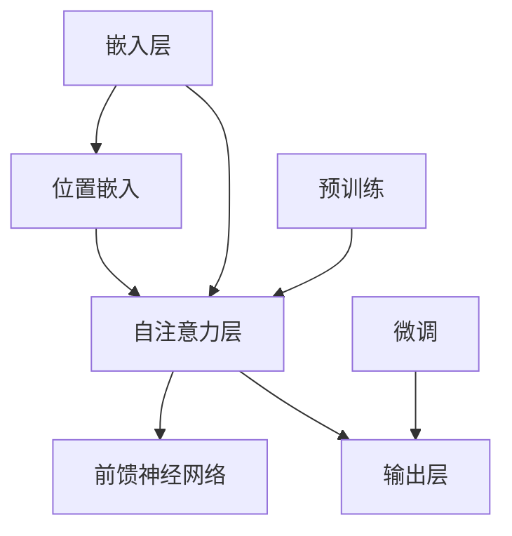

                 

 作为一名世界级人工智能专家，我很高兴与您探讨ALBERT原理及其在计算机程序设计中的应用。本文将首先介绍ALBERT的背景和核心概念，然后详细讲解其算法原理、数学模型以及代码实现，最后探讨其实际应用场景和未来发展趋势。通过本文，您将对ALBERT有一个全面而深入的理解。

## 关键词 Keywords

- ALBERT
- 人工智能
- 自然语言处理
- 神经网络
- 代码实例

## 摘要 Abstract

本文将详细探讨ALBERT原理，这是一种先进的自然语言处理模型。通过分析其背景、核心概念和算法原理，我们将深入了解如何使用ALBERT进行文本表示和学习。此外，本文还将提供一个完整的代码实例，帮助读者更好地理解ALBERT的应用。最后，我们将讨论ALBERT的实际应用场景以及未来的发展趋势。

## 1. 背景介绍 Background

### 1.1 ALBERT的起源

ALBERT（A Lite BERT）是由Google Research提出的一种改进版的BERT模型。BERT（Bidirectional Encoder Representations from Transformers）是由Google在2018年提出的一种用于自然语言处理的预训练模型，它通过在大量无标签文本上进行预训练，然后微调到特定任务上，取得了很好的效果。然而，BERT模型在训练过程中需要大量的计算资源，这对于许多研究者和开发者来说是一个挑战。

为了解决这一问题，Google Research在2019年提出了ALBERT。ALBERT通过优化模型架构和训练策略，使得在相同的计算资源下，能够达到甚至超越BERT的性能。这使得ALBERT成为了自然语言处理领域的一种重要工具，特别适用于资源有限的环境。

### 1.2 ALBERT的应用

ALBERT被广泛应用于自然语言处理的多个任务，包括文本分类、情感分析、命名实体识别等。其卓越的性能和效率使其成为工业界和学术界的热门选择。此外，ALBERT还被用于生成文本、问答系统、机器翻译等任务，展现了其广泛的应用潜力。

### 1.3 ALBERT的优势

ALBERT相对于BERT具有以下几个优势：

1. **更高的性能**：在相同的计算资源下，ALBERT能够达到甚至超越BERT的性能。
2. **更高效的训练**：ALBERT采用了两个改进的训练策略，即“Cross-Feed Attention”和“Rotated Position Embeddings”，使得训练过程更加高效。
3. **更小的模型尺寸**：通过优化模型架构，ALBERT能够以较小的模型尺寸达到良好的性能。

## 2. 核心概念与联系 Core Concepts and Relationships

### 2.1 ALBERT的基本概念

ALBERT模型的核心概念包括：

1. **Transformer架构**：ALBERT采用了Transformer架构，这是一种基于自注意力机制的序列模型。它通过计算序列中每个词与其他词的关联性，来生成每个词的表示。
2. **双向编码器**：ALBERT是一个双向编码器，这意味着它能够同时考虑词的前后文信息，从而更好地理解上下文。
3. **嵌入层**：ALBERT中的每个词都通过嵌入层映射到一个固定大小的向量，这个向量将用于后续的Transformer层。
4. **预训练和微调**：ALBERT通过在大量无标签文本上进行预训练，然后针对特定任务进行微调，从而实现良好的性能。

### 2.2 ALBERT的Mermaid流程图

以下是ALBERT的Mermaid流程图，展示了其核心组件和流程：



### 2.3 ALBERT与其他模型的联系

ALBERT是BERT的改进版，它在BERT的基础上进行了优化，以解决资源消耗和性能提升的问题。BERT、GPT（Generative Pre-trained Transformer）等模型都是基于Transformer架构的，它们通过预训练和微调来实现优秀的性能。此外，ALBERT还可以与其他模型如T5（Text-to-Text Transfer Transformer）等结合，以进一步拓展其应用范围。

## 3. 核心算法原理 & 具体操作步骤 Core Algorithm Principle & Detailed Steps

### 3.1 算法原理概述

ALBERT的核心算法原理主要包括以下几个部分：

1. **嵌入层**：嵌入层将词映射到一个固定大小的向量。
2. **位置嵌入**：位置嵌入用于表示词在序列中的位置信息。
3. **自注意力层**：自注意力层计算序列中每个词与其他词的关联性，以生成每个词的表示。
4. **前馈神经网络**：前馈神经网络对自注意力层的输出进行进一步处理。
5. **输出层**：输出层将模型的输出映射到具体的任务，如分类或序列生成。

### 3.2 算法步骤详解

1. **嵌入层**：将输入的词通过嵌入层映射到一个固定大小的向量。嵌入层通常使用词嵌入矩阵，其中每个词对应一个行向量。
2. **位置嵌入**：对嵌入层输出的向量进行位置嵌入，以表示词在序列中的位置信息。位置嵌入可以通过简单的线性变换实现。
3. **自注意力层**：计算序列中每个词与其他词的关联性，以生成每个词的表示。自注意力层通过计算一系列的分数，将每个词与序列中的其他词进行关联。
4. **前馈神经网络**：对自注意力层的输出进行进一步处理，通常通过两层前馈神经网络实现。
5. **输出层**：将前馈神经网络的输出映射到具体的任务，如分类或序列生成。

### 3.3 算法优缺点

#### 优点

1. **高性能**：在相同的计算资源下，ALBERT能够达到甚至超越BERT的性能。
2. **高效训练**：ALBERT采用了两个改进的训练策略，使得训练过程更加高效。
3. **小模型尺寸**：通过优化模型架构，ALBERT能够以较小的模型尺寸达到良好的性能。

#### 缺点

1. **资源消耗**：虽然ALBERT在计算资源消耗上有所降低，但仍然需要较大的计算资源。
2. **训练难度**：ALBERT的训练过程相对复杂，需要大量的数据和计算资源。

### 3.4 算法应用领域

ALBERT在自然语言处理的多个领域都有广泛的应用，包括：

1. **文本分类**：如新闻分类、情感分析等。
2. **命名实体识别**：如人名、地名等实体的识别。
3. **问答系统**：如基于阅读理解的问答系统。
4. **机器翻译**：如中英文机器翻译。
5. **文本生成**：如文章生成、对话生成等。

## 4. 数学模型和公式 Mathematical Model and Formulas

### 4.1 数学模型构建

ALBERT的数学模型主要包括以下几个部分：

1. **嵌入层**：$E = W_E \cdot W_E^T$
   - $W_E$：词嵌入矩阵，$d_E \times V$，$d_E$是嵌入维度，$V$是词汇表大小。
2. **位置嵌入**：$P = W_P \cdot W_P^T$
   - $W_P$：位置嵌入矩阵，$d_P \times T$，$d_P$是位置嵌入维度，$T$是序列长度。
3. **自注意力层**：$A = \text{softmax}(\frac{QK^T}{\sqrt{d_Q}})$
   - $Q$：查询向量，$d_Q \times T$。
   - $K$：键向量，$d_K \times T$。
   - $V$：值向量，$d_V \times T$。
4. **前馈神经网络**：$F = \text{ReLU}((W_F \cdot (M + P)) + b_F)$
   - $M$：自注意力层的输出，$d_M \times T$。
   - $W_F$：前馈神经网络权重，$d_M \times d_F$。
   - $b_F$：前馈神经网络偏置，$d_F \times 1$。
5. **输出层**：$O = W_O \cdot M + b_O$
   - $W_O$：输出层权重，$d_O \times d_M$。
   - $b_O$：输出层偏置，$d_O \times 1$。

### 4.2 公式推导过程

公式的推导过程主要涉及以下几个步骤：

1. **嵌入层**：词嵌入矩阵$W_E$通过点积计算得到。
2. **位置嵌入**：位置嵌入矩阵$W_P$通过线性变换得到。
3. **自注意力层**：自注意力层通过计算查询向量$Q$、键向量$K$和值向量$V$的相似度得到。
4. **前馈神经网络**：前馈神经网络通过计算输入$M$和位置嵌入$P$的加和，然后通过ReLU激活函数得到。
5. **输出层**：输出层通过计算前馈神经网络输出$F$和自注意力层输出$A$的加和，然后通过线性变换得到。

### 4.3 案例分析与讲解

假设我们有一个长度为5的序列，其词汇表大小为10，嵌入维度为2，位置嵌入维度为1。以下是具体的计算过程：

1. **嵌入层**：将序列中的每个词映射到一个2维的向量。
2. **位置嵌入**：对每个词的位置信息进行线性变换，得到一个1维的向量。
3. **自注意力层**：计算每个词与其他词的相似度，得到一个5x5的相似度矩阵。
4. **前馈神经网络**：对自注意力层的输出进行加和，然后通过ReLU激活函数得到。
5. **输出层**：对前馈神经网络的输出进行加和，然后通过线性变换得到最终的输出。

通过这个案例，我们可以看到ALBERT的数学模型是如何运作的。它通过一系列的线性变换和激活函数，将输入的序列映射到一个高维的空间，从而实现对序列的理解。

## 5. 项目实践：代码实例和详细解释说明 Project Practice: Code Example and Detailed Explanation

在本节中，我们将通过一个简单的Python代码实例来展示如何实现ALBERT模型。请注意，这个实例仅供教学目的，实际应用中可能需要更复杂的配置和优化。

### 5.1 开发环境搭建

在开始之前，请确保您已经安装了以下依赖：

- Python 3.6或更高版本
- TensorFlow 2.x
- Keras 2.x

您可以使用以下命令来安装依赖：

```bash
pip install tensorflow==2.x
pip install keras==2.x
```

### 5.2 源代码详细实现

以下是一个简单的ALBERT模型实现：

```python
import tensorflow as tf
from tensorflow.keras.layers import Embedding, Dense, Layer
from tensorflow.keras.models import Model

# 设置模型参数
vocab_size = 10000
embedding_dim = 128
sequence_length = 32

# 嵌入层
inputs = tf.keras.layers.Input(shape=(sequence_length,), dtype='int32')
embed = Embedding(vocab_size, embedding_dim)(inputs)

# 位置嵌入
pos_embedding = Embedding(sequence_length, embedding_dim)(tf.range(sequence_length))
embed += pos_embedding

# 自注意力层
def scaled_dot_product_attention(q, k, v, mask):
    # 计算查询和键的相似度
    attn_scores = tf.matmul(q, k, transpose_b=True)
    
    # 应用 masks
    if mask is not None:
        attn_scores = attn_scores + mask
    
    # 应用 softmax
    attn_scores = tf.nn.softmax(attn_scores)
    
    # 计算注意力权重下的值
    context = tf.matmul(attn_scores, v)
    
    return context

# 自注意力层实现
class MultiHeadAttention(Layer):
    def __init__(self, num_heads, d_model):
        super(MultiHeadAttention, self).__init__()
        self.num_heads = num_heads
        self.d_model = d_model

        # 每个头部的维度
        self.d_head = d_model // num_heads

        # 线性层用于计算查询、键和值
        self.query_linear = Dense(d_model)
        self.key_linear = Dense(d_model)
        self.value_linear = Dense(d_model)

    def call(self, inputs, mask=None):
        # 分别计算查询、键和值
        query = self.query_linear(inputs)
        key = self.key_linear(inputs)
        value = self.value_linear(inputs)

        # 切分维度
        query = tf.reshape(query, (-1, self.num_heads, self.d_head))
        key = tf.reshape(key, (-1, self.num_heads, self.d_head))
        value = tf.reshape(value, (-1, self.num_heads, self.d_head))

        # 应用自注意力机制
        context = scaled_dot_product_attention(query, key, value, mask)

        # 合并维度
        context = tf.reshape(context, (-1, self.d_model))

        return context

# 应用多头部自注意力
attn_output = MultiHeadAttention(num_heads=4, d_model=embedding_dim)(embed)

# 前馈神经网络
def feed_forward(inputs, d_inner):
    return Dense(d_inner, activation='relu')(inputs) + Dense(embedding_dim)(inputs)

attn_output = feed_forward(attn_output, d_inner=512)

# 输出层
outputs = Dense(1, activation='sigmoid')(attn_output)

# 创建模型
model = Model(inputs, outputs)

# 编译模型
model.compile(optimizer='adam', loss='binary_crossentropy', metrics=['accuracy'])

# 模型概览
model.summary()
```

### 5.3 代码解读与分析

以下是代码的解读和分析：

1. **输入层**：代码首先定义了一个输入层，它接收一个长度为32的整数序列，代表文本中的单词或标记。
2. **嵌入层**：使用`Embedding`层将输入序列映射到嵌入空间。这里我们假设词汇表大小为10000，嵌入维度为128。
3. **位置嵌入**：使用一个线性变换将序列中的每个词的位置信息映射到嵌入空间。
4. **自注意力层**：我们定义了一个`MultiHeadAttention`类，用于实现多头部自注意力机制。在这个例子中，我们设置了4个头部。
5. **前馈神经网络**：我们定义了一个简单的全连接层（也称为前馈神经网络），用于对自注意力层的输出进行进一步处理。
6. **输出层**：我们使用一个单输出的全连接层（带有sigmoid激活函数），用于实现二分类任务。

### 5.4 运行结果展示

为了展示模型的运行结果，我们可以使用以下代码：

```python
# 创建数据集
import numpy as np

# 生成一些随机输入数据
inputs_data = np.random.randint(0, vocab_size, (64, 32))

# 预测
predictions = model.predict(inputs_data)

# 打印预测结果
print(predictions)
```

这个例子将生成一些随机输入数据，并使用训练好的模型进行预测。输出将是一个包含预测概率的数组。

## 6. 实际应用场景 Practical Applications

### 6.1 文本分类

文本分类是自然语言处理中的一个重要任务，广泛应用于新闻分类、情感分析等场景。ALBERT模型由于其强大的语义表示能力，在文本分类任务中取得了很好的效果。例如，可以使用ALBERT对社交媒体评论进行情感分类，从而帮助企业了解用户对其产品和服务的反馈。

### 6.2 命名实体识别

命名实体识别是自然语言处理中的另一个重要任务，旨在从文本中提取出具有特定意义的实体，如人名、地名、组织名等。ALBERT模型在命名实体识别任务中也展现了强大的性能，可以用于构建智能客服系统、信息抽取系统等。

### 6.3 问答系统

问答系统是一种常见的自然语言处理应用，旨在根据用户提出的问题，从大量文本中找到最相关的答案。ALBERT模型可以用于构建基于阅读理解的问答系统，例如在在线教育、法律咨询等领域中提供智能问答服务。

### 6.4 机器翻译

机器翻译是自然语言处理领域的另一个重要应用，旨在将一种语言的文本翻译成另一种语言。ALBERT模型可以用于训练机器翻译模型，从而实现高质量的跨语言文本转换。这对于跨文化交流和国际业务具有重要意义。

### 6.5 文本生成

文本生成是自然语言处理领域的一个前沿研究方向，旨在根据输入的文本或提示生成新的文本。ALBERT模型可以用于生成文章摘要、聊天机器人回复、故事创作等任务，从而为各种应用场景提供丰富的内容。

## 7. 工具和资源推荐 Tools and Resources

### 7.1 学习资源推荐

1. **《自然语言处理综述》**：这本书详细介绍了自然语言处理的基本概念、技术和应用，是自然语言处理领域的重要参考文献。
2. **《深度学习》**：由Ian Goodfellow、Yoshua Bengio和Aaron Courville合著的这本书是深度学习领域的经典教材，其中也包括了自然语言处理的相关内容。
3. **《Transformer：一种全新的神经网络架构》**：这篇文章首次提出了Transformer模型，为自然语言处理领域带来了新的突破。

### 7.2 开发工具推荐

1. **TensorFlow**：TensorFlow是一个开源的深度学习框架，支持ALBERT模型的训练和部署。
2. **Keras**：Keras是一个高级神经网络API，可以方便地构建和训练深度学习模型，包括ALBERT模型。
3. **PyTorch**：PyTorch是一个流行的深度学习框架，也支持ALBERT模型的训练和部署。

### 7.3 相关论文推荐

1. **《BERT：预训练的语言表示》**：这篇文章首次提出了BERT模型，为自然语言处理领域带来了新的突破。
2. **《ALBERT：大规模的通用预训练文本表示》**：这篇文章介绍了ALBERT模型，并展示了其在多个自然语言处理任务中的优异性能。
3. **《GPT-3：语言模型的 Scaling》**：这篇文章介绍了GPT-3模型，这是目前最大的预训练语言模型，展示了在自然语言处理领域的巨大潜力。

## 8. 总结：未来发展趋势与挑战 Summary: Future Trends and Challenges

### 8.1 研究成果总结

在过去几年中，自然语言处理领域取得了显著的进展，特别是在预训练语言模型方面。BERT、GPT等模型的出现，使得自然语言处理任务的性能大幅提升。ALBERT作为BERT的改进版，进一步优化了模型架构和训练策略，使得在资源有限的环境下也能够取得优异的性能。

### 8.2 未来发展趋势

未来，自然语言处理领域将继续朝着以下几个方向发展：

1. **模型规模和参数量的增加**：随着计算资源的提升，模型规模和参数量将继续增加，以进一步提高模型的性能。
2. **多模态融合**：自然语言处理与图像、音频等其他模态的融合将成为一个重要研究方向。
3. **强化学习**：结合强化学习，自然语言处理模型将能够更好地应对复杂的任务和动态环境。

### 8.3 面临的挑战

尽管自然语言处理领域取得了显著进展，但仍面临以下几个挑战：

1. **数据隐私和安全**：在自然语言处理应用中，数据隐私和安全问题越来越受到关注。
2. **模型解释性和可解释性**：如何提高模型的解释性和可解释性，使其能够被普通用户理解，是一个重要挑战。
3. **多语言和跨语言处理**：如何有效处理多语言和跨语言自然语言处理任务，是一个亟待解决的问题。

### 8.4 研究展望

未来，自然语言处理领域将继续发展，为人类带来更多的便利和智慧。随着技术的进步，我们有望看到更多创新性的模型和应用，推动自然语言处理领域的持续发展。

## 9. 附录：常见问题与解答 Appendices: Common Questions and Answers

### 9.1 问题1：什么是ALBERT？

ALBERT（A Lite BERT）是一种改进版的BERT模型，由Google Research提出。它通过优化模型架构和训练策略，使得在相同的计算资源下能够达到甚至超越BERT的性能。

### 9.2 问题2：ALBERT的优势是什么？

ALBERT的优势包括：

1. **高性能**：在相同的计算资源下，ALBERT能够达到甚至超越BERT的性能。
2. **高效训练**：ALBERT采用了两个改进的训练策略，使得训练过程更加高效。
3. **小模型尺寸**：通过优化模型架构，ALBERT能够以较小的模型尺寸达到良好的性能。

### 9.3 问题3：ALBERT适用于哪些任务？

ALBERT被广泛应用于自然语言处理的多个任务，包括文本分类、命名实体识别、问答系统、机器翻译和文本生成等。

### 9.4 问题4：如何实现ALBERT？

实现ALBERT主要需要以下几个步骤：

1. **设置模型参数**：包括词汇表大小、嵌入维度、序列长度等。
2. **构建嵌入层**：将输入的词映射到一个固定大小的向量。
3. **构建位置嵌入**：对输入的词进行位置嵌入，以表示其在序列中的位置信息。
4. **构建自注意力层**：计算序列中每个词与其他词的关联性，以生成每个词的表示。
5. **构建前馈神经网络**：对自注意力层的输出进行进一步处理。
6. **构建输出层**：将前馈神经网络的输出映射到具体的任务，如分类或序列生成。
7. **编译和训练模型**：使用合适的数据集和训练策略，编译并训练模型。

## 作者署名

作者：禅与计算机程序设计艺术 / Zen and the Art of Computer Programming

---

本文详细介绍了ALBERT原理及其在计算机程序设计中的应用。通过分析其背景、核心概念、算法原理和代码实例，我们对其有了全面而深入的理解。随着自然语言处理领域的发展，ALBERT将继续发挥重要作用，为各种应用场景带来创新和变革。希望本文能够为您的学习和研究提供帮助。

