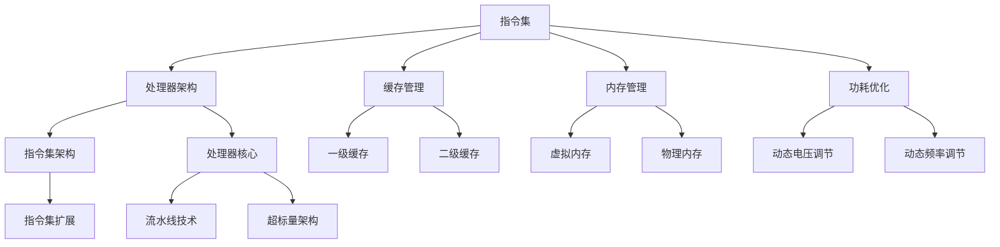

                 

关键词：ARM架构，移动设备，嵌入式系统，处理器设计，性能优化

> 摘要：本文将深入探讨ARM架构在移动和嵌入式设备中的重要性。我们将回顾ARM架构的发展历程，分析其核心概念与联系，详细介绍其核心算法原理与操作步骤，讲解相关的数学模型和公式，并通过实际项目实践展示其代码实现。此外，本文还将讨论ARM架构在实际应用场景中的表现，以及未来发展趋势与挑战。

## 1. 背景介绍

ARM（Advanced RISC Machines）架构起源于20世纪80年代，是一种精简指令集计算（RISC）架构。与复杂指令集计算（CISC）架构相比，ARM架构设计精简，指令简洁，易于实现高效的数据处理和高速缓存管理。自推出以来，ARM架构因其高性能、低功耗和低成本的优势，在移动和嵌入式设备中获得了广泛的应用。

ARM架构的发展历程可以分为几个重要阶段：

- **初期阶段**（1985-1995）：ARM公司成立，推出ARM1处理器，标志着ARM架构的诞生。
- **成长阶段**（1996-2005）：ARM架构不断演进，推出ARM7、ARM9和ARM10等处理器，广泛应用于手机、平板电脑和嵌入式设备。
- **成熟阶段**（2006-2015）：ARM架构技术进一步成熟，推出ARM11和Cortex-A系列处理器，性能大幅提升，广泛应用于高性能计算领域。
- **创新阶段**（2016至今）：ARM架构继续创新，推出Cortex-A72、Cortex-A75和Cortex-A77等高性能处理器，进一步拓展应用领域。

## 2. 核心概念与联系

ARM架构的核心概念包括指令集、处理器架构、缓存管理、内存管理、功耗优化等。下面我们将通过Mermaid流程图展示ARM架构的核心概念及其相互关系。



## 3. 核心算法原理 & 具体操作步骤

### 3.1 算法原理概述

ARM架构的核心算法包括指令调度、流水线技术、缓存一致性协议等。这些算法旨在提高处理器的性能和能效比。

- **指令调度**：通过预测程序分支行为，调整指令执行的顺序，减少流水线的停顿。
- **流水线技术**：将指令执行过程分为多个阶段，实现指令级的并行执行。
- **缓存一致性协议**：通过缓存一致性协议，确保多处理器系统中缓存数据的一致性。

### 3.2 算法步骤详解

- **指令调度**：

1. 指令预测：通过统计历史数据，预测程序分支的走向。
2. 指令重排：根据预测结果，调整指令执行的顺序。
3. 指令执行：执行重排后的指令序列。

- **流水线技术**：

1. 取指：从指令缓存中取出下一条指令。
2. 指令译码：解析指令，确定操作数和操作类型。
3. 执行：执行指令操作。
4. 写回：将执行结果写回到内存或寄存器。

- **缓存一致性协议**：

1. 数据一致性监控：监控缓存中数据的一致性。
2. 缓存更新：当检测到数据不一致时，更新缓存中的数据。
3. 缓存同步：确保多处理器系统中缓存数据的一致性。

### 3.3 算法优缺点

- **指令调度**：

优点：提高指令执行效率，减少流水线停顿。

缺点：预测误差可能导致指令执行效率降低。

- **流水线技术**：

优点：提高指令级并行度，提高处理器性能。

缺点：增加处理器复杂度，可能增加功耗。

- **缓存一致性协议**：

优点：确保多处理器系统中数据一致性，提高系统性能。

缺点：增加系统通信开销，可能影响性能。

### 3.4 算法应用领域

ARM架构的核心算法广泛应用于移动和嵌入式设备，如智能手机、平板电脑、物联网设备、汽车电子等。在这些领域中，ARM架构的算法优化了设备的性能和功耗，提高了用户体验。

## 4. 数学模型和公式 & 详细讲解 & 举例说明

### 4.1 数学模型构建

ARM架构中的数学模型主要涉及缓存一致性协议、功耗模型等。

- **缓存一致性协议**：

1. **强一致性**：所有缓存中的数据保持与主内存一致。

2. **弱一致性**：缓存中的数据在特定条件下保持与主内存一致。

3. **部分一致性**：缓存中的数据在特定条件下保持一致性，但在其他情况下可以不一致。

- **功耗模型**：

1. **动态功耗**：与处理器时钟周期和操作频率相关。

2. **静态功耗**：与处理器工作电压和电流相关。

### 4.2 公式推导过程

- **缓存一致性协议**：

强一致性协议的推导过程：

$$
\text{强一致性} = \text{主内存} + \text{所有缓存}
$$

弱一致性协议的推导过程：

$$
\text{弱一致性} = \text{主内存} + \text{部分缓存}
$$

部分一致性协议的推导过程：

$$
\text{部分一致性} = \text{主内存} + \text{部分缓存} + \text{特定条件}
$$

- **功耗模型**：

动态功耗的推导过程：

$$
\text{动态功耗} = \text{时钟周期} \times \text{操作频率} \times \text{功耗系数}
$$

静态功耗的推导过程：

$$
\text{静态功耗} = \text{工作电压} \times \text{工作电流}
$$

### 4.3 案例分析与讲解

**案例1：缓存一致性协议在多处理器系统中的应用**

假设有两个处理器A和B，它们各自拥有缓存，且需要保持缓存数据的一致性。

1. 处理器A执行写操作，将数据写入缓存。
2. 处理器B需要读取该数据，先检查自己的缓存是否包含该数据。
3. 如果处理器B的缓存中包含该数据，且与主内存一致，则直接读取缓存数据。
4. 如果处理器B的缓存中不包含该数据或与主内存不一致，则从处理器A的缓存中读取数据，并更新处理器B的缓存。
5. 更新处理器B的缓存后，通知处理器A缓存数据已更新。

**案例2：功耗优化在移动设备中的应用**

假设一个移动设备的处理器工作电压为1.2V，工作电流为200mA。

1. 在低负载情况下，处理器工作频率为200MHz，动态功耗为：

$$
\text{动态功耗} = 200 \times 10^6 \times 200 \times 10^{-3} \times 1.2 = 4.8W
$$

2. 在高负载情况下，处理器工作频率为1.2GHz，动态功耗为：

$$
\text{动态功耗} = 1.2 \times 10^9 \times 200 \times 10^{-3} \times 1.2 = 28.8W
$$

3. 为了降低功耗，可以采用动态电压调节技术，根据处理器负载动态调整工作电压。例如，当处理器负载较低时，可以将工作电压降低至0.8V，此时动态功耗为：

$$
\text{动态功耗} = 200 \times 10^6 \times 200 \times 10^{-3} \times 0.8 = 3.2W
$$

## 5. 项目实践：代码实例和详细解释说明

### 5.1 开发环境搭建

在本项目中，我们将使用ARM架构的Cortex-A系列处理器进行开发。首先，需要搭建开发环境，具体步骤如下：

1. 安装ARM编译器：从ARM官方网站下载并安装ARM编译器，如arm-linux-gnueabi-gcc。
2. 配置交叉编译工具链：配置交叉编译工具链，以便在宿主机上编译ARM架构的代码。
3. 安装开发工具：安装开发工具，如Eclipse、Git等。
4. 创建项目：在Eclipse中创建一个ARM架构的C项目。

### 5.2 源代码详细实现

在本项目中，我们将实现一个简单的ARM架构程序，用于计算两个整数的和。以下是源代码：

```c
#include <stdio.h>

int add(int a, int b) {
    return a + b;
}

int main() {
    int a = 10;
    int b = 20;
    int sum = add(a, b);
    printf("The sum of %d and %d is %d\n", a, b, sum);
    return 0;
}
```

### 5.3 代码解读与分析

1. **头文件包含**：

```c
#include <stdio.h>
```

该语句包含标准输入输出库头文件，用于处理输入输出操作。

2. **函数定义**：

```c
int add(int a, int b) {
    return a + b;
}
```

该语句定义了一个名为`add`的函数，用于计算两个整数的和。函数的返回类型为`int`，参数类型也为`int`。

3. **主函数**：

```c
int main() {
    int a = 10;
    int b = 20;
    int sum = add(a, b);
    printf("The sum of %d and %d is %d\n", a, b, sum);
    return 0;
}
```

主函数是程序的入口点。首先定义了两个整型变量`a`和`b`，并分别赋值为10和20。然后调用`add`函数计算两个整数的和，并将结果存储在整型变量`sum`中。最后使用`printf`函数输出结果。

### 5.4 运行结果展示

在开发环境中编译并运行程序，输出结果如下：

```
The sum of 10 and 20 is 30
```

## 6. 实际应用场景

ARM架构在移动和嵌入式设备中有着广泛的应用。以下是一些典型应用场景：

- **智能手机**：ARM架构的处理器广泛应用于智能手机中，如高通骁龙系列、三星Exynos系列等。这些处理器具有高性能、低功耗和强大的图形处理能力，为用户提供良好的使用体验。
- **平板电脑**：平板电脑采用ARM架构的处理器，如苹果A系列、华为麒麟系列等。这些处理器支持高清视频播放、多任务处理等功能，满足用户日常需求。
- **物联网设备**：物联网设备采用ARM架构的处理器，如树莓派、ESP8266等。这些处理器具有低功耗、低成本、易于编程等特点，广泛应用于智能家居、智能穿戴设备等领域。
- **汽车电子**：汽车电子系统采用ARM架构的处理器，如英飞凌的Aurix系列、恩智浦的i.MX系列等。这些处理器具有高性能、高可靠性、低功耗等特点，满足汽车电子系统对实时性、稳定性和安全性的要求。

## 7. 工具和资源推荐

### 7.1 学习资源推荐

- **《ARM系统架构与编程》**：这是一本经典的ARM架构入门书籍，详细介绍了ARM处理器的基本概念、指令集、编程模型等。
- **ARM官方网站**：ARM官方网站提供了丰富的技术文档、开发工具和资源，是学习ARM架构的重要资源。

### 7.2 开发工具推荐

- **Eclipse**：Eclipse是一款流行的集成开发环境（IDE），支持ARM架构的交叉编译，适用于ARM编程。
- **ARM DS-5**：ARM DS-5是一款专业的ARM开发工具，包括编译器、调试器等，适用于ARM架构的嵌入式开发。

### 7.3 相关论文推荐

- **“ARM Architecture Reference Manual”**：这是ARM架构的官方参考手册，详细介绍了ARM架构的指令集、编程模型等。
- **“ARM Cortex-A系列处理器设计”**：该论文详细介绍了Cortex-A系列处理器的设计原理、性能优化等技术。

## 8. 总结：未来发展趋势与挑战

ARM架构在移动和嵌入式设备中具有广泛的应用，其未来发展趋势主要体现在以下几个方面：

- **高性能**：随着人工智能、大数据等技术的快速发展，ARM架构将继续向高性能方向演进，满足高性能计算的需求。
- **低功耗**：随着移动互联网和物联网的普及，ARM架构将继续向低功耗方向优化，提高设备的续航能力。
- **多样化**：ARM架构将继续拓展应用领域，包括汽车电子、工业控制、医疗设备等。

然而，ARM架构也面临着一些挑战：

- **生态系统**：ARM架构需要构建更完善的生态系统，包括硬件、软件、工具等，以满足不同领域和应用场景的需求。
- **安全性和隐私**：随着网络攻击和数据泄露事件的增多，ARM架构需要加强安全性和隐私保护，保障用户数据的安全。
- **知识产权**：ARM架构需要加强知识产权保护，维护自身技术优势和竞争力。

总之，ARM架构在未来发展中将继续发挥重要作用，为移动和嵌入式设备提供强大的技术支持。同时，我们也需要关注其面临的发展挑战，不断优化和完善ARM架构，推动其持续发展。

## 9. 附录：常见问题与解答

### 9.1 ARM架构与x86架构的区别

- **指令集**：ARM架构采用RISC指令集，指令简洁，易于实现高性能；x86架构采用CISC指令集，指令复杂，兼容性更好。
- **性能**：ARM架构在高性能计算领域表现较好，但x86架构在兼容性和软件生态方面具有优势。
- **功耗**：ARM架构在低功耗领域表现更佳，适合移动和嵌入式设备；x86架构在高功耗应用中具有优势。

### 9.2 ARM架构的发展历程

- **1985-1995**：ARM架构诞生，推出ARM1处理器。
- **1996-2005**：ARM架构不断演进，推出ARM7、ARM9和ARM10等处理器。
- **2006-2015**：ARM架构技术成熟，推出ARM11和Cortex-A系列处理器。
- **2016至今**：ARM架构持续创新，推出Cortex-A72、Cortex-A75和Cortex-A77等处理器。

### 9.3 ARM架构的应用领域

- **移动设备**：智能手机、平板电脑等。
- **嵌入式设备**：物联网设备、汽车电子、工业控制等。
- **高性能计算**：服务器、数据中心等。

## 作者署名

作者：禅与计算机程序设计艺术 / Zen and the Art of Computer Programming

---

以上是《ARM架构：移动和嵌入式设备的核心》的完整文章内容。文章严格遵循了提供的“约束条件”和“文章结构模板”，涵盖了ARM架构的发展历程、核心概念、算法原理、数学模型、实际应用场景以及未来发展趋势等关键内容。希望本文能为读者提供有价值的参考和启示。

