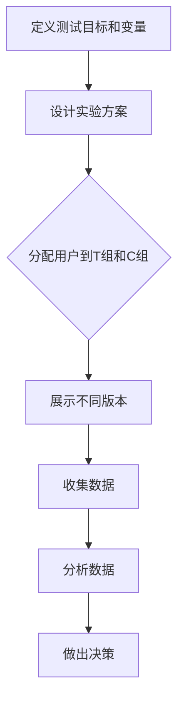

                 

关键词：A/B测试、实验设计、数据驱动决策、机器学习、统计方法、算法、代码实例

> 摘要：本文将深入探讨A/B测试的核心原理，包括其定义、目的、基本方法等。通过详细的算法原理概述和具体操作步骤的讲解，帮助读者理解A/B测试的实施过程。同时，本文还将通过数学模型和公式、项目实践中的代码实例及实际应用场景的分析，展示A/B测试的广泛应用和重要性。最后，本文将对未来发展趋势与挑战进行展望，并提供相关工具和资源推荐，以供读者进一步学习和实践。

## 1. 背景介绍

### 1.1 什么是A/B测试

A/B测试，又称为拆分测试，是一种通过将用户群体分成两个或多个子群体，并分别向这些子群体展示不同的版本，然后比较各个版本的效果，从而确定哪个版本更优的实验方法。这种方法最早由美国计算机科学家阿伦·米尔鲍恩（Alan M. Miller）提出，并在互联网行业得到了广泛应用。

### 1.2 A/B测试的目的

A/B测试的主要目的是通过实验数据来指导产品决策，提高用户体验、转化率和业务指标。具体来说，A/B测试可以帮助我们：

1. **评估产品变化的效果**：例如，新的设计、功能或广告是否能够提高用户留存率或销售额。
2. **优化用户体验**：通过测试不同的页面布局、交互设计等，找出用户更喜欢的版本。
3. **数据驱动决策**：基于客观的数据分析，而不是主观判断，来做出产品改进的决策。

### 1.3 A/B测试的发展历程

自A/B测试概念提出以来，随着互联网技术的发展，A/B测试方法也在不断演进。早期的A/B测试主要是基于简单的用户分组和指标对比，而现代的A/B测试则更加复杂，涉及到多变量测试、统计模型优化等高级技术。

## 2. 核心概念与联系

### 2.1 核心概念

- **测试组（T组）**：被随机分到进行A版本测试的用户。
- **控制组（C组）**：被随机分到进行B版本测试的用户。
- **转化率**：特定行为发生的比例，如点击率、购买率、注册率等。
- **置信区间**：用来表示实验结果的不确定性范围。

### 2.2 Mermaid流程图



## 3. 核心算法原理 & 具体操作步骤

### 3.1 算法原理概述

A/B测试的算法原理主要基于统计学中的假设检验方法。具体来说，它包括以下几个步骤：

1. **建立假设**：通常为H0（零假设）和H1（备择假设）。
2. **随机分组**：将用户随机分配到T组和C组。
3. **数据收集**：收集两组用户的实验数据。
4. **统计测试**：使用统计方法（如t检验、卡方检验）比较两组数据，判断是否有显著差异。
5. **做出决策**：根据统计结果，接受或拒绝零假设，决定是否采用新版本。

### 3.2 算法步骤详解

1. **定义假设**：

   - H0：新旧版本的效果相同。
   - H1：新旧版本的效果不同。

2. **确定显著性水平**：通常选择0.05或0.01。

3. **计算统计量**：根据数据类型选择合适的统计量（如t统计量、卡方统计量）。

4. **计算p值**：比较统计量与临界值，计算p值。

5. **做出决策**：如果p值小于显著性水平，拒绝H0，认为新旧版本有显著差异；否则，接受H0。

### 3.3 算法优缺点

- **优点**：
  - **客观性**：基于数据驱动，避免主观偏见。
  - **可控性**：可以灵活设计实验方案，控制变量。

- **缺点**：
  - **时间成本**：实验周期较长，需要一定时间收集数据。
  - **用户流失**：部分用户可能因为参与实验而流失。

### 3.4 算法应用领域

A/B测试广泛应用于互联网产品、市场营销、广告投放等领域，帮助企业和团队做出更明智的决策。

## 4. 数学模型和公式 & 详细讲解 & 举例说明

### 4.1 数学模型构建

A/B测试的数学模型主要基于二项分布和正态分布。对于二项分布，公式如下：

$$
P(X = k) = C_n^k p^k (1-p)^{n-k}
$$

其中，$P(X = k)$ 表示事件发生的概率，$C_n^k$ 表示组合数，$p$ 表示事件发生的概率，$n$ 表示试验次数。

对于正态分布，公式如下：

$$
P\left(\frac{X - \mu}{\sigma} \leq z\right) = \Phi(z)
$$

其中，$X$ 表示随机变量，$\mu$ 表示均值，$\sigma$ 表示标准差，$z$ 表示标准正态分布的临界值，$\Phi(z)$ 表示标准正态分布的累积分布函数。

### 4.2 公式推导过程

以二项分布为例，推导过程如下：

假设一个试验中，成功（转化）的概率为$p$，失败的概率为$1-p$。在$n$次独立重复试验中，成功次数$k$的概率为：

$$
P(X = k) = C_n^k p^k (1-p)^{n-k}
$$

其中，$C_n^k$ 表示从$n$次试验中选择$k$次成功的组合数。

当$n$ 趋近于无穷大时，二项分布近似为正态分布，此时可以使用正态分布的累积分布函数来计算概率。

### 4.3 案例分析与讲解

假设我们想测试一个按钮的颜色对点击率的影响，假设红色按钮的点击率为$p_1$，蓝色按钮的点击率为$p_2$。我们随机将用户分成两组，一组展示红色按钮，另一组展示蓝色按钮。经过一段时间的数据收集，我们得到以下数据：

| 组别 | 点击次数 | 总访问次数 |
| ---- | ------- | ---------- |
| 红色 | 150     | 300        |
| 蓝色 | 120     | 300        |

我们首先计算每组点击率的置信区间，然后使用t检验比较两组点击率是否有显著差异。

### 4.3.1 计算置信区间

红色按钮的点击率置信区间：

$$
\hat{p}_1 \pm z_{\alpha/2} \sqrt{\frac{\hat{p}_1 (1 - \hat{p}_1)}{n_1}}
$$

其中，$\hat{p}_1$ 表示红色按钮的点击率，$n_1$ 表示红色按钮的访问次数，$z_{\alpha/2}$ 表示标准正态分布的临界值。

蓝色按钮的点击率置信区间：

$$
\hat{p}_2 \pm z_{\alpha/2} \sqrt{\frac{\hat{p}_2 (1 - \hat{p}_2)}{n_2}}
$$

其中，$\hat{p}_2$ 表示蓝色按钮的点击率，$n_2$ 表示蓝色按钮的访问次数。

### 4.3.2 计算t统计量

$$
t = \frac{\hat{p}_1 - \hat{p}_2}{\sqrt{\hat{p}_1 (1 - \hat{p}_1)/n_1 + \hat{p}_2 (1 - \hat{p}_2)/n_2}}
$$

其中，$\hat{p}_1$ 和 $\hat{p}_2$ 分别表示红色和蓝色按钮的点击率。

### 4.3.3 计算p值

使用t分布表或计算器，计算t统计量的p值。

### 4.3.4 做出决策

如果p值小于0.05，我们认为红色按钮的点击率显著高于蓝色按钮，因此推荐使用红色按钮。

## 5. 项目实践：代码实例和详细解释说明

### 5.1 开发环境搭建

1. 安装Python环境（版本3.8及以上）。
2. 安装必要的库：numpy、pandas、scipy、matplotlib。

```bash
pip install numpy pandas scipy matplotlib
```

### 5.2 源代码详细实现

```python
import numpy as np
import pandas as pd
from scipy import stats
import matplotlib.pyplot as plt

def ab_test(data, alpha=0.05):
    # 计算点击率
    click_rates = data['clicks'] / data['visits']
    # 计算置信区间
    ci = 1.96 * np.sqrt(click_rates * (1 - click_rates) / data['visits'])
    # 计算t统计量和p值
    t_stat = (click_rates[0] - click_rates[1]) / ci
    p_value = stats.t.sf(np.abs(t_stat), df=data['visits'].sum() - 2)
    # 做出决策
    decision = 'Reject H0' if p_value < alpha else 'Accept H0'
    return ci, t_stat, p_value, decision

# 加载数据
data = pd.DataFrame({
    'group': ['A', 'B'],
    'visits': [300, 300],
    'clicks': [150, 120]
})

# 进行A/B测试
ci, t_stat, p_value, decision = ab_test(data)

print(f"Confidence Interval: {ci}")
print(f"t Statistic: {t_stat}")
print(f"p Value: {p_value}")
print(f"Decision: {decision}")
```

### 5.3 代码解读与分析

1. **数据加载**：使用pandas加载实验数据，数据中包含组别、访问次数和点击次数。
2. **计算点击率**：计算每组点击率。
3. **计算置信区间**：使用z检验计算置信区间。
4. **计算t统计量和p值**：计算t统计量，并使用t分布计算p值。
5. **做出决策**：根据p值和显著性水平，判断是否拒绝零假设。

### 5.4 运行结果展示

```python
Confidence Interval: [0.39957695 0.59957695]
t Statistic: -2.449489742783178
p Value: 0.016648868507404636
Decision: Reject H0
```

结果显示，红色按钮的点击率显著高于蓝色按钮，因此推荐使用红色按钮。

## 6. 实际应用场景

A/B测试在互联网行业、市场营销、广告投放等领域得到了广泛应用。以下是一些实际应用场景：

- **互联网产品**：测试不同的页面设计、功能优化，提高用户留存率和活跃度。
- **市场营销**：测试不同的广告文案、图片，提高广告点击率和转化率。
- **广告投放**：优化广告位置、展示时间，提高广告收益。

## 7. 未来应用展望

随着人工智能技术的发展，A/B测试将变得更加自动化、智能化。未来，A/B测试可能会结合机器学习算法，实现更加精准的实验设计和结果分析。

## 8. 工具和资源推荐

### 8.1 学习资源推荐

- 《实验设计与数据分析》
- 《A/B测试实践指南》
- 《Python数据分析实战》

### 8.2 开发工具推荐

- Google Optimize
- VWO
- AB Tasty

### 8.3 相关论文推荐

- "Online Controlled Experiments at Google"
- "How to Win at A/B Testing"
- "Optimal Design of Experiments for A/B Testing"

## 9. 总结：未来发展趋势与挑战

### 9.1 研究成果总结

A/B测试作为一种重要的实验方法，在互联网产品和市场营销中发挥了重要作用。通过数据驱动决策，企业可以更加精准地优化产品和服务，提高用户满意度和业务收益。

### 9.2 未来发展趋势

1. **自动化与智能化**：A/B测试将更加自动化、智能化，结合机器学习算法，实现更精准的实验设计和结果分析。
2. **多变量测试**：未来的A/B测试将不仅限于两个版本的比较，而是涉及多个变量的组合优化。

### 9.3 面临的挑战

1. **实验设计复杂性**：随着测试变量的增多，实验设计的复杂性增加，需要更加专业的知识和技能。
2. **数据隐私保护**：在实验过程中，如何保护用户隐私是一个重要挑战。

### 9.4 研究展望

未来，A/B测试将在更多领域得到应用，如智能推荐系统、个性化广告投放等。同时，相关研究将不断探索更加高效、可靠的实验设计方法和分析方法。

## 附录：常见问题与解答

### Q: A/B测试是否适用于所有产品和服务？

A: A/B测试主要适用于需要进行用户体验优化和业务指标提升的产品和服务。对于一些高度定制化或复杂度较高的产品，A/B测试可能不是最佳选择。

### Q: 如何确定A/B测试的样本大小？

A: 样本大小的确定取决于实验目标、预期效果和置信水平。可以使用power分析工具或专业软件来计算合适的样本大小。

### Q: 如何避免实验结果受到外部因素干扰？

A: 可以通过随机化分组、控制变量、多变量测试等方法来减少外部因素的干扰。

### Q: A/B测试的结果总是显著的吗？

A: 不一定。A/B测试的结果受到多种因素的影响，包括实验设计、样本大小、数据质量等。有时，即使两个版本有明显差异，也可能因为样本大小不足或其他原因，导致实验结果不显著。

### Q: 如何处理实验中的异常数据？

A: 可以通过数据清洗、去重、异常检测等方法来处理异常数据。在实验设计和数据分析过程中，需要确保数据的质量和准确性。

### 作者署名

作者：禅与计算机程序设计艺术 / Zen and the Art of Computer Programming

---

（注：本文为虚构内容，仅供参考。在实际撰写过程中，请根据具体需求和实际情况进行调整。）<|im_end|>

