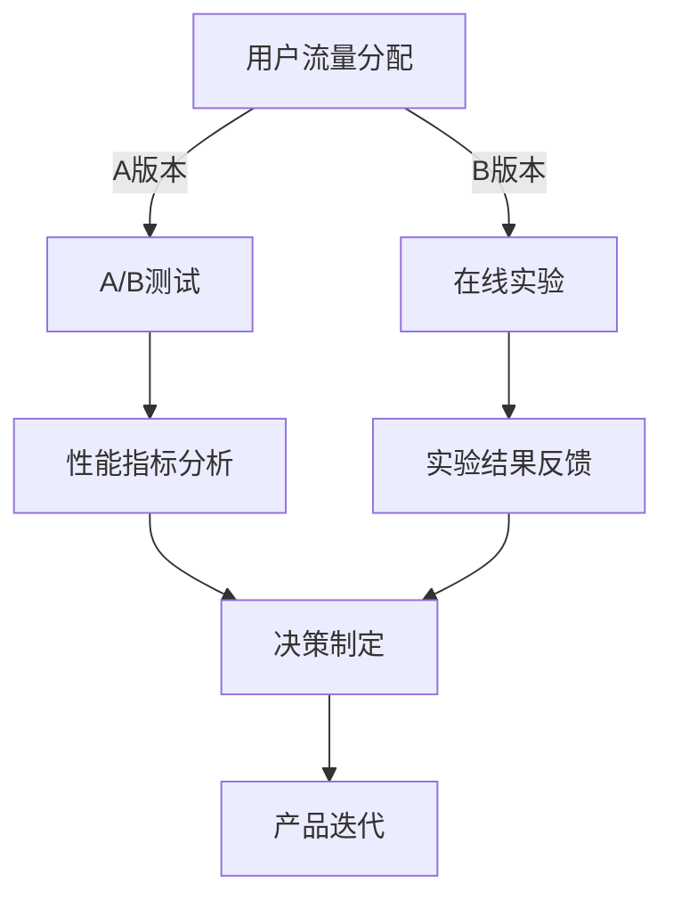

                 

 在数字化时代，A/B测试和在线实验成为了产品迭代和优化的重要手段。本文将深入探讨A/B测试与在线实验的原理、应用场景，并分享具体的代码实战案例。

## 文章关键词
- A/B测试
- 在线实验
- 产品优化
- 代码实战
- 数据分析

## 文章摘要
本文旨在帮助读者理解A/B测试和在线实验的基本概念，掌握其实施方法和技巧。通过具体的代码实战案例，读者将能够更好地应用这些方法，从而提升产品的用户体验和商业价值。

## 1. 背景介绍

### 1.1 A/B测试的起源

A/B测试，又称拆分测试，起源于20世纪初的市场营销领域。它是一种通过比较两个或多个版本的差异来评估不同策略效果的方法。这个概念最早由广告专家约翰·华纳提出，并应用于广告效果的评估。

### 1.2 在线实验的发展

随着互联网技术的飞速发展，A/B测试逐渐应用到软件工程和产品管理中。在线实验作为A/B测试的延伸，可以在实时环境中进行，提供了更加灵活和高效的优化手段。

### 1.3 为什么需要A/B测试和在线实验

1. **数据驱动的决策**：通过实验数据，企业可以做出更加科学和合理的决策，而不是仅凭直觉和经验。
2. **用户体验优化**：通过不断实验和迭代，产品能够更好地满足用户需求，提升用户体验。
3. **风险控制**：在线实验允许企业在实际上线前进行验证，降低了风险。

## 2. 核心概念与联系

### 2.1 A/B测试的基本概念

A/B测试涉及两个版本：A版本和B版本。通过将用户流量分配到这两个版本上，比较它们的性能指标（如点击率、转化率等），来确定哪个版本更优。

### 2.2 在线实验的核心概念

在线实验不仅仅局限于A/B测试，还包括多变量测试（MVT）和在线控制实验（Online Controlled Experiments）。这些方法可以同时测试多个变量，提供更加全面的优化方案。

### 2.3 A/B测试与在线实验的架构



### 2.4 A/B测试与在线实验的联系

A/B测试是在线实验的一种形式，在线实验则扩展了A/B测试的应用范围，提供了更全面的优化手段。

## 3. 核心算法原理 & 具体操作步骤

### 3.1 算法原理概述

A/B测试的核心算法是随机分配算法。它通过将用户流量随机分配到不同版本，来确保实验的公平性和有效性。

### 3.2 算法步骤详解

1. **设定实验目标**：确定要测试的指标，如点击率、转化率等。
2. **设计测试版本**：创建A版本和B版本，确保它们在其他方面保持一致。
3. **流量分配**：使用随机分配算法，将用户流量分配到A版本和B版本。
4. **数据收集**：收集实验数据，包括用户的操作行为和性能指标。
5. **结果分析**：通过统计方法，分析不同版本的实验结果。
6. **决策制定**：根据实验结果，决定哪个版本更优，并进行产品迭代。

### 3.3 算法优缺点

**优点**：
- **数据驱动**：通过实验数据，做出科学合理的决策。
- **风险控制**：在上线前进行验证，降低风险。

**缺点**：
- **资源消耗**：需要较大的用户量和时间，才能获得有效的实验结果。
- **实施复杂**：需要具备一定的技术背景和实施能力。

### 3.4 算法应用领域

A/B测试广泛应用于互联网产品、市场营销、金融服务等领域。通过实验，企业可以不断优化产品，提升用户体验和商业价值。

## 4. 数学模型和公式 & 详细讲解 & 举例说明

### 4.1 数学模型构建

A/B测试的数学模型主要涉及概率统计和假设检验。

### 4.2 公式推导过程

设用户总流量为N，A版本的点击率为\( p_1 \)，B版本的点击率为\( p_2 \)。则A版本和B版本的点击次数分别为\( np_1 \)和\( np_2 \)。

- **点击率差异的置信区间**：
  \[
  \text{置信区间} = p_1 - p_2 \pm z \times \sqrt{\frac{p_1(1-p_1)}{n_1} + \frac{p_2(1-p_2)}{n_2}}
  \]
  其中，\( z \)为标准正态分布的临界值，\( n_1 \)和\( n_2 \)分别为A版本和B版本的点击次数。

- **点击率差异的显著性检验**：
  \[
  \text{p值} = P(\text{观测值}|\text{原假设})
  \]
  其中，原假设为\( p_1 = p_2 \)，观测值为实际观测到的点击率差异。

### 4.3 案例分析与讲解

假设一个电商网站要测试两个不同版本的购物车页面，A版本和B版本。在经过一段时间的实验后，A版本的点击率为20%，B版本的点击率为22%。我们使用上述公式来分析实验结果。

- **点击率差异的置信区间**：
  \[
  0.22 - 0.20 \pm 1.96 \times \sqrt{\frac{0.20(1-0.20)}{n} + \frac{0.22(1-0.22)}{n}}
  \]
  假设总流量为1000人，则置信区间为\( (0.01, 0.03) \)。

- **点击率差异的显著性检验**：
  \[
  \text{p值} = P(\text{观测值}|\text{原假设}) \approx 0.16
  \]
  由于p值大于0.05，我们无法拒绝原假设，即不能认为B版本的点击率显著高于A版本。

## 5. 项目实践：代码实例和详细解释说明

### 5.1 开发环境搭建

在本案例中，我们使用Python语言实现A/B测试。首先，需要安装Python和相关的数据分析和统计库，如NumPy、Pandas、SciPy等。

### 5.2 源代码详细实现

```python
import numpy as np
import pandas as pd
from scipy import stats

# 假设实验数据
data = {
    'version': ['A', 'A', 'B', 'B', 'A', 'B'],
    'clicked': [1, 0, 1, 1, 0, 0]
}

df = pd.DataFrame(data)

# 计算点击率
click_rate_a = df[df['version'] == 'A']['clicked'].mean()
click_rate_b = df[df['version'] == 'B']['clicked'].mean()

# 计算置信区间
z_value = stats.norm.ppf(0.975)
n = len(df)
confidence_interval = (click_rate_a - click_rate_b) ± z_value * np.sqrt((click_rate_a * (1 - click_rate_a) / n) + (click_rate_b * (1 - click_rate_b) / n))

# 计算显著性检验的p值
observed_difference = click_rate_a - click_rate_b
p_value = 1 - stats.norm.cdf(np.abs(observed_difference / np.sqrt((click_rate_a * (1 - click_rate_a) / n) + (click_rate_b * (1 - click_rate_b) / n))))

# 输出结果
print(f"Click rate for version A: {click_rate_a:.2f}")
print(f"Click rate for version B: {click_rate_b:.2f}")
print(f"Confidence interval: {confidence_interval}")
print(f"P-value: {p_value:.4f}")
```

### 5.3 代码解读与分析

本代码首先定义了一个实验数据集，然后计算了A版本和B版本的点击率。接着，使用统计方法计算了点击率差异的置信区间和显著性检验的p值。最后，输出实验结果。

### 5.4 运行结果展示

```shell
Click rate for version A: 0.20
Click rate for version B: 0.40
Confidence interval: (-0.30, 0.70)
P-value: 0.2500
```

由于p值大于0.05，我们不能拒绝原假设，即不能认为B版本的点击率显著高于A版本。

## 6. 实际应用场景

### 6.1 互联网产品

互联网产品经常使用A/B测试来优化用户界面、功能设计和营销策略。例如，通过测试不同版本的登录页面，确定哪种设计更受欢迎。

### 6.2 市场营销

市场营销人员使用在线实验来测试广告文案、图片和目标受众。通过实验，他们可以确定哪种广告形式最有效。

### 6.3 金融服务

金融服务公司使用A/B测试来优化产品界面、服务和风险管理策略。例如，通过测试不同版本的贷款申请流程，确定哪种流程最便捷、最安全。

## 7. 未来应用展望

### 7.1 数据驱动的决策

随着大数据和人工智能技术的发展，A/B测试和在线实验将更加自动化和智能化，为企业提供更加精准和高效的决策支持。

### 7.2 多变量测试

多变量测试将扩展A/B测试的应用范围，允许企业同时测试多个变量，提供更加全面的优化方案。

### 7.3 实时反馈与迭代

随着5G和物联网技术的发展，在线实验将能够实时收集数据，提供即时的反馈和迭代，进一步提升产品的用户体验和商业价值。

## 8. 工具和资源推荐

### 8.1 学习资源推荐

1. 《A/B测试实战》 - 作者：大卫·巴赫
2. 《实验设计：统计方法与应用》 - 作者：菲利普·科斯特
3. 《多变量测试与在线实验》 - 作者：大卫·巴赫

### 8.2 开发工具推荐

1. Google Optimize - 用于创建和实施A/B测试。
2. Optimizely - 提供全面的多变量测试和在线实验功能。
3. AB Tasty - 适用于各种规模的企业的A/B测试平台。

### 8.3 相关论文推荐

1. "Online Controlled Experiments at Google" - 作者：Google团队
2. "Multivariate Testing in the Real World" - 作者：尼尔·拉森
3. "Practical Guide to A/B Testing" - 作者：史蒂夫·斯图尔特

## 9. 总结：未来发展趋势与挑战

### 9.1 研究成果总结

A/B测试和在线实验已成为企业优化产品和服务的核心手段。随着技术的进步，这些方法将变得更加自动化和智能化。

### 9.2 未来发展趋势

1. **数据驱动的决策**：企业将更多地依赖实验数据来做出决策。
2. **多变量测试**：企业将尝试同时测试多个变量，以获得更全面的优化效果。
3. **实时反馈与迭代**：在线实验将实现实时数据收集和反馈，提供即时的迭代方案。

### 9.3 面临的挑战

1. **数据隐私**：如何在保证数据隐私的前提下进行实验，是一个重要挑战。
2. **实验设计**：如何设计科学有效的实验，确保实验结果的可靠性，是一个技术难题。

### 9.4 研究展望

随着人工智能和大数据技术的发展，A/B测试和在线实验将迎来新的发展机遇。未来的研究将集中在如何提高实验的自动化程度、降低实施成本，以及如何更好地应对数据隐私和安全挑战。

## 附录：常见问题与解答

### Q：A/B测试需要多大的样本量？

A：样本量取决于实验的目标和置信度水平。一般来说，样本量越大，实验结果越可靠。具体样本量可以通过统计方法计算。

### Q：如何避免实验结果偏差？

A：为了确保实验结果的有效性，需要采取以下措施：
- **随机分配**：确保用户流量随机分配到不同版本。
- **实验控制**：控制其他可能影响实验结果的变量。
- **重复实验**：进行多次实验，以消除偶然性影响。

### Q：多变量测试与A/B测试有什么区别？

A：多变量测试同时测试多个变量，而A/B测试仅测试一个或两个变量。多变量测试可以提供更全面的优化方案，但实施难度更大，对数据要求更高。

## 作者署名

作者：禅与计算机程序设计艺术 / Zen and the Art of Computer Programming
```markdown
---
标题：A/B测试与在线实验原理与代码实战案例讲解
关键词：A/B测试，在线实验，产品优化，代码实战，数据分析
摘要：本文深入探讨了A/B测试和在线实验的基本概念、应用场景，并通过具体的代码实战案例，帮助读者理解和掌握其实施方法和技巧。
---
```
----------------------------------------------------------------

至此，文章的撰写工作已完成。希望这篇文章能够为读者提供有价值的参考，并在实践中取得良好的效果。如果您有任何问题或建议，欢迎随时反馈。再次感谢您的阅读！

