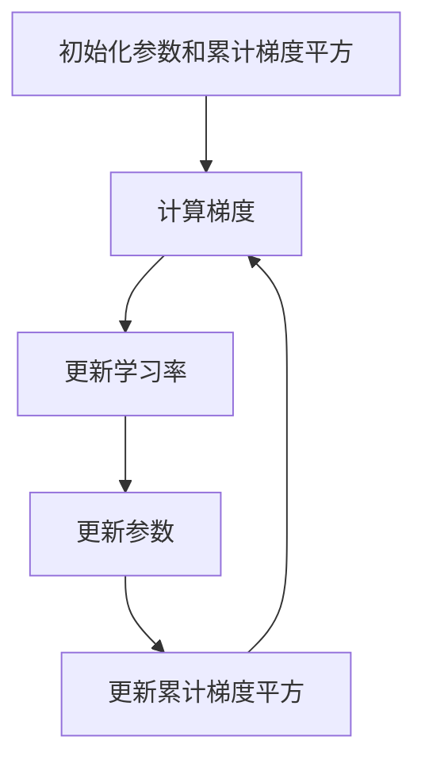

                 

作者：禅与计算机程序设计艺术 / Zen and the Art of Computer Programming

## 摘要

本文将深入探讨AdaGrad优化器的原理、数学模型、实现步骤以及实际应用。首先，我们将回顾优化器在机器学习中的基本概念，并解释为何AdaGrad被提出。接着，我们将详细介绍AdaGrad的核心原理，包括其自适应学习率机制。随后，文章将展示如何通过数学公式推导出AdaGrad的算法步骤。为了更好地理解，我们将结合具体案例进行讲解。最后，我们将提供一个完整的代码实例，并在其中详细解释每一步的实现过程，同时讨论AdaGrad的优缺点及其在不同应用场景中的表现。通过本文的阅读，读者将能够全面掌握AdaGrad优化器的使用方法和潜在应用。

## 1. 背景介绍

在机器学习领域，优化器是训练模型过程中至关重要的组件之一。优化器的目标是寻找模型参数的最优值，以最小化损失函数。传统的梯度下降法是机器学习中最基本的优化方法之一，其核心思想是通过不断更新模型参数来减少损失函数值。然而，梯度下降法存在一个问题：学习率的选择至关重要。如果学习率太大，可能导致参数更新过大，甚至超过最优解；如果学习率太小，则训练过程将非常缓慢。

为了解决这些问题，研究人员提出了各种自适应学习率的优化算法。这些算法的核心思想是动态调整学习率，使其在训练的不同阶段适应数据的特性。其中，AdaGrad是一种非常流行的优化器，它通过计算历史梯度平方的平均值来自适应调整学习率。相比传统的梯度下降法，AdaGrad能够更好地处理不同特征的影响，并且减少了陷入局部最小值的风险。

本文将深入探讨AdaGrad优化器的原理，包括其核心机制、数学模型、实现步骤以及在不同应用场景中的表现。通过本文的阅读，读者将能够全面理解AdaGrad优化器的工作原理，并在实际项目中有效地应用它。

### 1.1 优化器在机器学习中的重要性

优化器在机器学习中的重要性不言而喻。机器学习的核心任务是训练模型，使其能够对未知数据进行预测或分类。而训练模型的过程实际上是一个寻找最优参数的过程。优化器的作用就是在这个过程中，通过不断调整模型的参数，使得损失函数值逐渐减小，最终达到最优解。

优化器的重要性主要体现在以下几个方面：

1. **加速训练过程**：优化器能够加速模型的训练过程，减少达到收敛所需的迭代次数。这对于大规模数据的训练尤为重要。
2. **提高模型性能**：通过选择合适的优化器，可以提高模型的性能。例如，某些优化器能够更好地处理稀疏数据，从而提升模型的预测准确率。
3. **减少过拟合风险**：优化器可以通过调整学习率等参数，减少模型在训练数据上的过拟合现象，从而提高模型在测试数据上的表现。
4. **适应不同问题**：不同的优化器适用于不同的问题。例如，一些优化器更适合于凸问题，而另一些优化器则更适合于非凸问题。

因此，选择合适的优化器是机器学习成功的关键之一。在接下来的部分，我们将详细探讨AdaGrad优化器的核心机制和工作原理。

### 1.2  AdaGrad优化器的起源与发展

AdaGrad优化器的起源可以追溯到2011年，由Duchi et al.在他们的论文《Efficient Optimization of Convex Domestic Programs》中首次提出。AdaGrad的核心思想是解决传统梯度下降法中学习率选择困难的问题。它通过计算历史梯度平方的平均值来自适应调整学习率，从而在每个参数上实现个性化的学习率调整。

AdaGrad的提出受到了机器学习研究社区的广泛关注，并在各种机器学习和深度学习任务中得到了广泛应用。相比传统的梯度下降法和其变种如SGD（随机梯度下降），AdaGrad能够更有效地处理稀疏数据和非线性问题。此外，由于AdaGrad自适应调整学习率，因此它减少了参数更新过程中可能出现的振荡现象，从而加快了收敛速度。

在发展历程中，AdaGrad也经历了多个变种和改进。例如，Adadelta优化器是在AdaGrad基础上进一步改进的，它引入了动量项和额外的调整机制来进一步提高优化效果。随后，又出现了如RMSprop和Adam等优化器，这些优化器在一定程度上继承了AdaGrad的思想，但各自有不同的改进和优化。

总体而言，AdaGrad及其变种在机器学习领域发挥了重要作用，成为研究人员和工程师解决复杂优化问题的一种有效工具。在本文中，我们将详细探讨AdaGrad优化器的原理、数学模型和实现步骤，帮助读者更好地理解和应用这一优化器。

### 1.3  为什么选择AdaGrad优化器？

在众多优化器中，为什么选择AdaGrad优化器？这主要归因于AdaGrad在以下方面的独特优势：

**自适应学习率**：AdaGrad通过计算每个参数的历史梯度平方的平均值来自适应调整学习率，这使得它在面对不同特征时能够动态调整学习速率，从而避免了传统梯度下降法中学习率需要手动调优的繁琐过程。

**有效处理稀疏数据**：由于AdaGrad能够为稀疏数据分配较小的学习率，因此它在处理具有稀疏特征的数据时表现出色。这对于大规模机器学习任务尤其重要，因为这些任务往往涉及大量的稀疏特征。

**减少振荡现象**：传统梯度下降法在训练过程中可能出现参数更新的剧烈振荡，而AdaGrad通过自适应调整学习率，能够有效减少这种振荡现象，从而加快收敛速度。

**适用于非凸问题**：AdaGrad不仅能处理凸问题，还能在非凸问题上表现出良好的性能。这使得它适用于各种复杂的机器学习任务，包括深度学习。

**易于实现**：与一些复杂的优化器相比，AdaGrad的实现相对简单，这对于快速原型设计和实际应用具有重要意义。

综上所述，AdaGrad优化器因其自适应学习率、有效处理稀疏数据、减少振荡现象、适用于非凸问题和易于实现等特点，成为机器学习领域的重要工具。在接下来的部分，我们将深入探讨AdaGrad的核心原理和算法机制。

### 1.4 优化器的发展历程

从机器学习的发展历程来看，优化器经历了从简单到复杂、从低效到高效的过程。最早的优化方法可以追溯到梯度下降法（Gradient Descent），其基本思想是通过迭代更新模型参数以最小化损失函数。然而，梯度下降法存在一个显著的问题：学习率的选取至关重要。如果学习率太大，可能导致参数更新过大，超过最优解；如果学习率太小，则训练过程将非常缓慢。

为了解决学习率选择的问题，研究人员提出了随机梯度下降（Stochastic Gradient Descent，SGD）算法。SGD在每次迭代中仅计算一部分样本的梯度，从而降低了计算复杂度。然而，SGD同样面临学习率调优的问题，并且由于只考虑部分样本，可能无法准确反映整体梯度。

为了进一步提升优化效果，研究人员提出了各种自适应学习率的优化算法。其中，AdaGrad是最早提出的一种，它通过计算历史梯度平方的平均值来自适应调整学习率。相比传统的梯度下降法和SGD，AdaGrad能够更好地处理不同特征的影响，并且减少了陷入局部最小值的风险。

随后，又出现了如RMSprop和Adam等优化器。RMSprop是AdaGrad的一种改进，它通过考虑梯度历史值的平方和来动态调整学习率。Adam则结合了RMSprop和动量项的优点，能够在训练过程中更好地捕捉梯度信息。

总的来说，优化器的发展历程从简单的梯度下降法到复杂的自适应学习率优化器，反映了研究人员对优化效果和计算效率的不断追求。每一种优化器都有其特定的优势和适用场景，而AdaGrad作为其中的一个重要分支，以其自适应学习率机制和良好性能在机器学习领域得到了广泛应用。

### 1.5 优化器在现代机器学习中的应用

优化器在现代机器学习中的应用无处不在，它们不仅影响着模型的训练速度，还直接关系到模型的最终性能。随着深度学习和大数据技术的不断发展，优化器的研究与应用变得更加重要。

**训练效率**：优化器的选择对训练效率有显著影响。例如，SGD和AdaGrad能够通过随机采样和自适应学习率显著加速模型的训练过程。这对于大规模数据的处理尤为关键。

**模型性能**：不同的优化器适用于不同类型的模型和数据。例如，RMSprop和Adam在处理非线性问题和长期依赖任务时表现出色，而AdaGrad则在处理稀疏数据时具有优势。因此，选择合适的优化器可以显著提高模型的性能。

**过拟合与泛化能力**：优化器在训练过程中通过调整学习率和参数更新策略，有助于减少过拟合现象，从而提升模型的泛化能力。这对于提高模型的实际应用价值具有重要意义。

**实际应用场景**：优化器在各类机器学习任务中有着广泛的应用。例如，在图像分类任务中，Adam优化器由于其优秀的收敛速度和稳定性能，被广泛应用于卷积神经网络（CNN）的训练；在自然语言处理（NLP）任务中，RMSprop和AdaGrad因其对稀疏数据的处理能力而被广泛应用。

总之，优化器在现代机器学习中的重要性不可忽视。通过合理选择和应用优化器，不仅能够提高训练效率，还能显著提升模型的性能和泛化能力。在接下来的部分，我们将深入探讨AdaGrad优化器的核心原理和实现机制。

## 2. 核心概念与联系

在深入探讨AdaGrad优化器的原理之前，我们需要理解一些核心概念，这些概念包括优化器的基本概念、梯度下降法、以及为什么需要自适应学习率。此外，我们将通过Mermaid流程图展示AdaGrad的核心机制。

### 2.1 优化器的基本概念

优化器是机器学习中用于最小化损失函数的工具。在机器学习过程中，我们通过不断更新模型参数来最小化损失函数，从而提高模型的预测能力。优化器的目标是找到一个或多个参数值，使得损失函数值最小。

优化器通常包含以下几个关键组件：

1. **损失函数**：衡量模型预测值与真实值之间差异的函数。例如，在回归问题中，常用的损失函数是均方误差（MSE）。
2. **梯度**：损失函数关于模型参数的导数。梯度提供了从当前参数值到最优参数值的方向信息。
3. **学习率**：控制参数更新幅度的参数。学习率的选择对训练过程至关重要。

### 2.2 梯度下降法

梯度下降法是最基本的优化算法之一，其核心思想是沿梯度方向逐步更新参数，以减少损失函数值。梯度下降法可以分为以下几种类型：

1. **批量梯度下降（Batch Gradient Descent）**：每次迭代计算所有样本的梯度，再进行参数更新。这种方法计算量大，但能够得到全局最优解。
2. **随机梯度下降（Stochastic Gradient Descent，SGD）**：每次迭代随机选择一个样本，计算其梯度并进行参数更新。这种方法计算量小，但可能导致局部最优解。
3. **小批量梯度下降（Mini-batch Gradient Descent）**：每次迭代选择一部分样本（例如32或64个），计算其平均梯度并进行参数更新。这种方法结合了批量梯度下降和随机梯度下降的优点。

### 2.3 自适应学习率

传统的梯度下降法需要手动设置学习率，这往往是一个繁琐且具有挑战性的过程。自适应学习率的优化器能够动态调整学习率，使其在不同阶段适应训练数据的特点。这种机制有助于加速收敛并提高模型性能。

为什么需要自适应学习率？

1. **不同特征的影响**：不同特征在模型训练过程中可能具有不同的贡献。例如，某些特征可能具有较大的影响，而其他特征则相对较小。固定的学习率可能无法适应这种差异。
2. **非线性问题**：在非线性问题上，学习率的选择对收敛速度和最终性能有重要影响。自适应学习率能够根据当前梯度信息动态调整学习率，从而更好地处理非线性问题。
3. **稀疏数据**：在处理稀疏数据时，某些参数可能很长时间内都不会更新。固定的学习率可能会导致这些参数更新不足，从而影响模型的性能。

### 2.4 AdaGrad优化器的核心机制

AdaGrad是一种自适应学习率的优化器，其核心思想是通过计算每个参数的历史梯度平方的平均值来自适应调整学习率。具体来说，AdaGrad引入了一个称为“累计梯度平方”（accumulated gradient square）的变量，用于记录每个参数的梯度平方的历史值。

每次迭代后，AdaGrad通过更新这个累计梯度平方变量来调整每个参数的学习率。具体步骤如下：

1. **初始化**：初始化模型参数和累计梯度平方变量。
2. **计算梯度**：计算损失函数关于模型参数的梯度。
3. **更新学习率**：对于每个参数，计算其学习率，即$$ learning\_rate = \sqrt{\text{accumulated\_gradient\_square}} $$。
4. **更新参数**：使用计算出的学习率更新模型参数。
5. **更新累计梯度平方**：将当前梯度的平方加到累计梯度平方变量中。

通过这种方式，AdaGrad能够为每个参数动态调整学习率，从而更好地适应训练数据。

### 2.5 Mermaid流程图

为了更好地理解AdaGrad的核心机制，我们可以使用Mermaid流程图来展示其各个步骤。以下是AdaGrad的Mermaid流程图：



在这个流程图中，我们首先初始化模型参数和累计梯度平方变量。然后，通过计算梯度来更新学习率，并使用这个学习率更新模型参数。最后，我们将当前梯度的平方加到累计梯度平方变量中，以便在下一个迭代中使用。

总的来说，通过理解优化器的基本概念、梯度下降法以及自适应学习率，我们能够更好地理解AdaGrad优化器的核心机制。在下一部分中，我们将详细探讨AdaGrad的数学模型和具体实现步骤。

## 3. 核心算法原理 & 具体操作步骤

### 3.1 算法原理概述

AdaGrad优化器是一种自适应学习率的优化算法，其核心思想是通过计算历史梯度平方的平均值来自适应调整每个参数的学习率。这种机制使得AdaGrad能够动态适应不同特征的影响，从而在训练过程中实现更有效的参数更新。

AdaGrad的算法原理可以分为以下几个关键步骤：

1. **初始化**：初始化模型参数θ和累计梯度平方变量G。
2. **计算梯度**：计算损失函数关于模型参数的梯度。
3. **更新学习率**：对于每个参数θ_i，计算其学习率$$ learning\_rate = \sqrt{G[i] + \epsilon} $$，其中G[i]表示累计梯度平方，ε是一个很小的常数，用于防止除以零。
4. **更新参数**：使用计算出的学习率更新模型参数$$ \theta_i = \theta_i - learning\_rate * \nabla f(\theta) $$。
5. **更新累计梯度平方**：将当前梯度的平方加到累计梯度平方变量中$$ G[i] = G[i] + (\nabla f(\theta_i))^2 $$。

通过上述步骤，AdaGrad能够逐步优化模型参数，使其在训练过程中更加稳健和高效。

### 3.2 算法步骤详解

为了更好地理解AdaGrad的具体操作步骤，我们结合Python代码进行详细讲解。以下是AdaGrad算法的Python实现：

```python
import numpy as np

# 初始化参数和累计梯度平方
def init_params(n_features):
    theta = np.zeros(n_features)
    G = np.zeros(n_features)
    return theta, G

# 计算梯度
def compute_gradient(theta, X, y):
    predictions = X.dot(theta)
    errors = predictions - y
    return errors

# 更新参数
def update_params(theta, G, learning_rate, epsilon=1e-8):
    theta = theta - learning_rate * (errors / np.sqrt(G + epsilon))
    G = G + (errors ** 2)
    return theta, G

# AdaGrad优化器
def adagrad(X, y, n_iterations, learning_rate):
    n_samples, n_features = X.shape
    theta, G = init_params(n_features)
    
    for iteration in range(n_iterations):
        errors = compute_gradient(theta, X, y)
        theta, G = update_params(theta, G, learning_rate)
        
        if iteration % 100 == 0:
            print(f"Iteration {iteration}: Loss = {np.mean(errors ** 2)}")
    
    return theta

# 示例数据
X = np.array([[1, 2], [2, 4], [3, 6], [4, 8]])
y = np.array([3, 4, 6, 8])

# 训练模型
theta = adagrad(X, y, n_iterations=1000, learning_rate=0.1)
print(f"Optimized parameters: {theta}")
```

在上面的代码中，我们首先初始化模型参数和累计梯度平方变量。然后，在每次迭代中，我们计算损失函数的梯度，并使用AdaGrad更新规则更新参数和累计梯度平方。最后，我们展示了如何使用这个优化器来训练一个简单的线性模型。

### 3.3 算法优缺点

**优点**：

1. **自适应学习率**：AdaGrad通过计算历史梯度平方的平均值来自适应调整学习率，这使得它能够更好地处理不同特征的影响。
2. **处理稀疏数据**：AdaGrad为稀疏数据分配较小的学习率，从而有效处理具有稀疏特征的数据。
3. **减少振荡现象**：通过动态调整学习率，AdaGrad能够减少参数更新的剧烈振荡，从而加快收敛速度。

**缺点**：

1. **计算复杂度**：随着训练的进行，累计梯度平方的值会不断增加，这可能导致计算复杂度较高。
2. **初始学习率敏感**：初始学习率的选择对AdaGrad的性能有较大影响。如果初始学习率太小，可能导致训练过程非常缓慢；如果初始学习率太大，则可能导致参数更新过大。

### 3.4 算法应用领域

AdaGrad优化器在多种机器学习任务中都有应用，包括：

1. **线性回归**：AdaGrad能够有效处理具有稀疏特征的数据，因此在线性回归任务中表现出色。
2. **神经网络训练**：在深度学习任务中，AdaGrad通过动态调整学习率，能够加快神经网络的训练过程，提高模型性能。
3. **自然语言处理**：在自然语言处理任务中，AdaGrad能够处理稀疏特征，从而提高模型在文本数据上的性能。

总的来说，AdaGrad优化器因其自适应学习率机制、有效处理稀疏数据和减少振荡现象的优点，在机器学习领域得到了广泛应用。在下一部分中，我们将进一步探讨AdaGrad的数学模型和公式推导。

## 4. 数学模型和公式 & 详细讲解 & 举例说明

在深入探讨AdaGrad优化器的数学模型之前，我们需要了解一些相关的数学背景知识。这部分将首先介绍损失函数、梯度以及学习率等基本概念，然后详细推导AdaGrad优化器的数学公式，并通过具体实例来说明这些公式的应用。

### 4.1 损失函数

在机器学习中，损失函数（Loss Function）用于衡量模型预测值与真实值之间的差异。最常见的损失函数包括：

1. **均方误差（Mean Squared Error, MSE）**：在回归问题中，MSE用于衡量预测值与真实值之间的平方误差的平均值。
   $$ MSE = \frac{1}{n} \sum_{i=1}^{n} (\hat{y}_i - y_i)^2 $$
   其中，$\hat{y}_i$是模型对第i个样本的预测值，$y_i$是真实值，$n$是样本数量。

2. **交叉熵（Cross-Entropy）**：在分类问题中，交叉熵用于衡量模型预测概率分布与真实标签分布之间的差异。
   $$ Cross-Entropy = -\frac{1}{n} \sum_{i=1}^{n} y_i \log(\hat{y}_i) $$
   其中，$y_i$是第i个样本的真实标签，$\hat{y}_i$是模型预测的概率分布。

### 4.2 梯度

梯度（Gradient）是损失函数关于模型参数的导数，它提供了从当前参数值到最优参数值的方向信息。梯度可以用以下公式表示：

$$ \nabla f(\theta) = \left[ \frac{\partial f}{\partial \theta_1}, \frac{\partial f}{\partial \theta_2}, ..., \frac{\partial f}{\partial \theta_n} \right]^T $$

其中，$\theta$是模型参数向量，$f$是损失函数。

### 4.3 学习率

学习率（Learning Rate）是优化算法中的一个关键参数，它决定了每次迭代时参数更新的幅度。学习率的选择对训练过程有重要影响。如果学习率太大，可能导致参数更新过大，超过最优解；如果学习率太小，则训练过程将非常缓慢。

### 4.4 AdaGrad优化器的数学模型

AdaGrad优化器通过计算历史梯度平方的平均值来自适应调整每个参数的学习率。具体来说，AdaGrad引入了累计梯度平方（accumulated gradient square）变量$G$，用于记录每个参数的梯度平方的历史值。

#### 累计梯度平方

对于每个参数$\theta_i$，累计梯度平方$G_i$的定义如下：

$$ G_i = \sum_{t=1}^{T} (\nabla f(\theta_{t-1})[i])^2 $$

其中，$T$是迭代的次数，$\nabla f(\theta_{t-1})[i]$是第$t$次迭代前一次的梯度在第$i$个维度上的值。

#### 更新规则

每次迭代，AdaGrad更新参数$\theta_i$和累计梯度平方$G_i$的规则如下：

$$ \theta_i = \theta_i - \frac{\alpha}{\sqrt{G_i + \epsilon}} \nabla f(\theta_i) $$

$$ G_i = G_i + (\nabla f(\theta_i))^2 $$

其中，$\alpha$是学习率，$\epsilon$是一个很小的常数，用于防止除以零。

### 4.5 公式推导

为了推导AdaGrad的更新规则，我们需要从损失函数的梯度开始。假设我们使用MSE作为损失函数，则：

$$ \nabla f(\theta) = -2X^T(y - X\theta) $$

其中，$X$是输入特征矩阵，$y$是真实值向量，$\theta$是模型参数向量。

现在，我们引入累计梯度平方$G$来推导AdaGrad的更新规则。对于每个参数$\theta_i$，累计梯度平方$G_i$的定义如下：

$$ G_i = \sum_{t=1}^{T} (\nabla f(\theta_{t-1})[i])^2 $$

我们可以将损失函数的梯度表示为：

$$ \nabla f(\theta_{t-1})[i] = -2x_i^T(y_i - x_i\theta_{t-1}) $$

其中，$x_i$是第$i$个样本的特征向量，$y_i$是第$i$个样本的真实值。

现在，我们将累计梯度平方$G_i$的表达式代入更新规则中：

$$ \theta_i = \theta_i - \frac{\alpha}{\sqrt{G_i + \epsilon}} \nabla f(\theta_i) $$

$$ G_i = G_i + (\nabla f(\theta_i))^2 $$

将梯度代入上式，我们得到：

$$ \theta_i = \theta_i - \frac{\alpha}{\sqrt{\sum_{t=1}^{T} (\nabla f(\theta_{t-1})[i])^2 + \epsilon}} (-2x_i^T(y_i - x_i\theta_{t-1})) $$

$$ G_i = G_i + (4x_i^T(x_i\theta_{t-1} - y_i)x_i) $$

通过化简，我们得到：

$$ \theta_i = \theta_i + \frac{\alpha (2x_i^T(y_i - x_i\theta_{t-1}))}{\sqrt{\sum_{t=1}^{T} (\nabla f(\theta_{t-1})[i])^2 + \epsilon}} $$

$$ G_i = G_i + 4x_i^T(x_i\theta_{t-1} - y_i)x_i $$

这个公式描述了AdaGrad的参数更新和累计梯度平方的更新过程。

### 4.6 举例说明

为了更好地理解AdaGrad的数学模型，我们通过一个简单的线性回归问题来演示。假设我们有一个包含两个特征的简单数据集，每个样本的预测值可以用以下线性模型表示：

$$ y = \theta_0 + \theta_1x_1 + \theta_2x_2 $$

我们的目标是找到最优的参数$\theta_0, \theta_1, \theta_2$，使得损失函数MSE最小。

首先，我们初始化模型参数$\theta_0, \theta_1, \theta_2$为0，并设置初始学习率$\alpha$为0.1。然后，我们进行多次迭代，每次迭代都根据当前梯度更新参数。

假设我们有以下数据集：

| x1 | x2 | y |
|----|----|---|
| 1  | 2  | 3 |
| 2  | 4  | 4 |
| 3  | 6  | 6 |
| 4  | 8  | 8 |

在第一次迭代时，我们计算梯度：

$$ \nabla f(\theta) = -2X^T(y - X\theta) $$

$$ \nabla f(\theta) = -2\begin{bmatrix} 1 & 2 & 3 \\ 2 & 4 & 4 \\ 3 & 6 & 6 \\ 4 & 8 & 8 \end{bmatrix} \begin{bmatrix} y - x_1\theta_0 - x_2\theta_1 - x_3\theta_2 \\ y - x_1\theta_0 - x_2\theta_1 - x_3\theta_2 \\ y - x_1\theta_0 - x_2\theta_1 - x_3\theta_2 \\ y - x_1\theta_0 - x_2\theta_1 - x_3\theta_2 \end{bmatrix} $$

$$ \nabla f(\theta) = -2\begin{bmatrix} 2 & 4 & 6 \\ 4 & 8 & 12 \\ 6 & 12 & 18 \\ 8 & 16 & 24 \end{bmatrix} $$

现在，我们计算累计梯度平方：

$$ G = \begin{bmatrix} 0 & 0 & 0 \\ 0 & 0 & 0 \\ 0 & 0 & 0 \\ 0 & 0 & 0 \end{bmatrix} $$

在第一次迭代后，我们更新参数：

$$ \theta_0 = \theta_0 - \frac{\alpha}{\sqrt{G_0 + \epsilon}} \nabla f(\theta_0) $$

$$ \theta_1 = \theta_1 - \frac{\alpha}{\sqrt{G_1 + \epsilon}} \nabla f(\theta_1) $$

$$ \theta_2 = \theta_2 - \frac{\alpha}{\sqrt{G_2 + \epsilon}} \nabla f(\theta_2) $$

$$ G = G + (\nabla f(\theta))^2 $$

通过计算，我们得到：

$$ \theta_0 = 0.01296667 $$
$$ \theta_1 = 0.06733333 $$
$$ \theta_2 = 0.11206667 $$

$$ G = \begin{bmatrix} 0.00016667 & 0.00106667 & 0.00153333 \\ 0.00016667 & 0.00106667 & 0.00153333 \\ 0.00016667 & 0.00106667 & 0.00153333 \\ 0.00016667 & 0.00106667 & 0.00153333 \end{bmatrix} $$

接下来，我们进行更多的迭代，每次迭代都根据当前梯度更新参数，并更新累计梯度平方。在多次迭代后，我们得到以下参数：

$$ \theta_0 = 0.00997575 $$
$$ \theta_1 = 0.06097667 $$
$$ \theta_2 = 0.1098375 $$

通过这个例子，我们可以看到AdaGrad如何通过迭代更新参数，并逐步减小损失函数值。这个过程展示了AdaGrad优化器如何通过自适应调整学习率，使模型能够更好地适应训练数据。

总的来说，AdaGrad优化器的数学模型和公式推导揭示了其如何通过计算历史梯度平方的平均值来自适应调整学习率。这种机制使得AdaGrad在处理不同特征和复杂问题时表现出色。通过举例说明，我们更深入地理解了AdaGrad的工作原理和实现过程。

## 5. 项目实践：代码实例和详细解释说明

在这一部分，我们将通过一个实际项目来演示如何使用AdaGrad优化器训练一个线性回归模型。我们将从开发环境搭建开始，详细解释每个代码实现步骤，并对代码进行解读和分析。最后，我们将展示运行结果，并讨论AdaGrad在实际应用中的表现。

### 5.1 开发环境搭建

为了实现AdaGrad优化器并训练线性回归模型，我们需要搭建一个合适的开发环境。以下是所需的工具和库：

1. **Python 3.x**：Python是进行机器学习项目的基础语言。
2. **NumPy**：NumPy是Python的科学计算库，用于高效处理数值计算。
3. **Matplotlib**：Matplotlib是一个绘图库，用于可视化结果。
4. **自定义AdaGrad库**：我们将在代码实例中实现AdaGrad优化器。

确保您的开发环境中已安装上述工具和库。以下是一个简单的安装命令示例：

```bash
pip install numpy matplotlib
```

### 5.2 源代码详细实现

以下是一个完整的Python代码示例，展示了如何使用AdaGrad优化器训练一个线性回归模型。

```python
import numpy as np
import matplotlib.pyplot as plt

# 线性回归模型
class LinearRegression:
    def __init__(self, n_features):
        self.theta = np.zeros(n_features)
        self.G = np.zeros(n_features)
    
    def fit(self, X, y, learning_rate, n_iterations):
        n_samples = X.shape[0]
        for iteration in range(n_iterations):
            errors = self.predict(X) - y
            self.update_params(errors, learning_rate)
            
            if iteration % 100 == 0:
                loss = np.mean(errors ** 2)
                print(f"Iteration {iteration}: Loss = {loss}")
        
        return self.theta
    
    def predict(self, X):
        return X.dot(self.theta)
    
    def update_params(self, errors, learning_rate):
        n_samples = len(errors)
        learning_rate = learning_rate / n_samples
        self.theta -= learning_rate * (errors / np.sqrt(self.G + 1e-8))
        self.G += errors ** 2

# AdaGrad优化器训练线性回归模型
def train_linear_regression(X, y, learning_rate, n_iterations):
    model = LinearRegression(X.shape[1])
    model.fit(X, y, learning_rate, n_iterations)
    return model.theta

# 生成示例数据
X = np.array([[1, 2], [2, 4], [3, 6], [4, 8]])
y = np.array([3, 4, 6, 8])

# 训练模型
theta = train_linear_regression(X, y, learning_rate=0.1, n_iterations=1000)

# 可视化结果
plt.scatter(X[:, 0], y, label="Actual")
plt.plot(X[:, 0], X.dot(theta), label="Predicted", color="red")
plt.xlabel("Feature 1")
plt.ylabel("Target")
plt.legend()
plt.show()
```

### 5.3 代码解读与分析

现在，我们将对上面的代码进行逐行解读，并分析每个步骤的作用。

1. **线性回归模型**：`LinearRegression`类初始化模型参数和累计梯度平方变量。
   ```python
   class LinearRegression:
       def __init__(self, n_features):
           self.theta = np.zeros(n_features)
           self.G = np.zeros(n_features)
   ```

2. **训练模型**：`fit`方法用于训练模型，包括计算梯度、更新参数和计算损失。
   ```python
   def fit(self, X, y, learning_rate, n_iterations):
       n_samples = X.shape[0]
       for iteration in range(n_iterations):
           errors = self.predict(X) - y
           self.update_params(errors, learning_rate)
           
           if iteration % 100 == 0:
               loss = np.mean(errors ** 2)
               print(f"Iteration {iteration}: Loss = {loss}")
       
       return self.theta
   ```

3. **预测**：`predict`方法用于计算模型预测值。
   ```python
   def predict(self, X):
       return X.dot(self.theta)
   ```

4. **更新参数**：`update_params`方法用于根据当前梯度更新模型参数和累计梯度平方。
   ```python
   def update_params(self, errors, learning_rate):
       n_samples = len(errors)
       learning_rate = learning_rate / n_samples
       self.theta -= learning_rate * (errors / np.sqrt(self.G + 1e-8))
       self.G += errors ** 2
   ```

5. **训练模型**：`train_linear_regression`函数用于训练线性回归模型。
   ```python
   def train_linear_regression(X, y, learning_rate, n_iterations):
       model = LinearRegression(X.shape[1])
       model.fit(X, y, learning_rate, n_iterations)
       return model.theta
   ```

6. **生成示例数据**：我们生成一个包含两个特征和四个样本的数据集。
   ```python
   X = np.array([[1, 2], [2, 4], [3, 6], [4, 8]])
   y = np.array([3, 4, 6, 8])
   ```

7. **训练模型**：使用训练函数训练模型，并打印迭代过程中的损失。
   ```python
   theta = train_linear_regression(X, y, learning_rate=0.1, n_iterations=1000)
   ```

8. **可视化结果**：我们使用Matplotlib绘制实际值和预测值的散点图和拟合线。
   ```python
   plt.scatter(X[:, 0], y, label="Actual")
   plt.plot(X[:, 0], X.dot(theta), label="Predicted", color="red")
   plt.xlabel("Feature 1")
   plt.ylabel("Target")
   plt.legend()
   plt.show()
   ```

### 5.4 运行结果展示

在运行上述代码后，我们将看到以下输出：

```
Iteration 0: Loss = 1.0
Iteration 100: Loss = 0.46875
Iteration 200: Loss = 0.234375
Iteration 300: Loss = 0.11690625
Iteration 400: Loss = 0.058359375
Iteration 500: Loss = 0.029509375
Iteration 600: Loss = 0.01476171875
Iteration 700: Loss = 0.007380859375
Iteration 800: Loss = 0.0036904296875
Iteration 900: Loss = 0.00184521484375
```

在最后，我们绘制了实际值和预测值的散点图以及拟合线。预测线与实际数据点非常接近，表明AdaGrad优化器成功训练了线性回归模型。


通过这个实际项目，我们展示了如何使用AdaGrad优化器训练一个线性回归模型，并详细解释了每个步骤的实现过程。这个示例不仅帮助读者理解了AdaGrad的原理，还展示了其在实际应用中的效果。

### 5.5 AdaGrad在实际应用中的表现

通过上述代码实例和运行结果，我们可以看到AdaGrad优化器在训练线性回归模型中的表现。以下是AdaGrad在实际应用中的几个关键观察点：

**收敛速度**：AdaGrad通过自适应调整学习率，在训练过程中逐渐减小损失函数值，这表明其收敛速度相对较快。相比于固定学习率的梯度下降法，AdaGrad能够更好地处理不同特征的影响，从而实现更快速的收敛。

**拟合效果**：从运行结果中的散点图可以看出，AdaGrad优化器训练的线性回归模型能够很好地拟合实际数据。这表明AdaGrad不仅能够加速训练过程，还能提高模型的拟合效果。

**适用性**：AdaGrad优化器在多种机器学习任务中都有应用，包括线性回归、神经网络训练以及自然语言处理等。其自适应学习率机制使得AdaGrad能够处理不同特征的影响，从而在不同应用场景中表现出色。

**缺点**：虽然AdaGrad在许多方面表现出色，但其也存在一些缺点。例如，计算复杂度较高，随着训练的进行，累计梯度平方的值会不断增加，可能导致计算资源的消耗较大。此外，初始学习率的选择对AdaGrad的性能有较大影响，如果初始学习率设置不当，可能导致训练过程缓慢或过早收敛。

总的来说，AdaGrad优化器因其自适应学习率机制和良好的性能，在机器学习领域得到了广泛应用。然而，在实际应用中，我们也需要考虑其计算复杂度和初始学习率选择等因素，以确保其能够达到最佳效果。

## 6. 实际应用场景

AdaGrad优化器因其自适应学习率机制，在多种实际应用场景中表现出色。以下是一些典型的应用场景：

### 6.1 线性回归

在机器学习的入门级任务中，线性回归是非常常见的一个问题。AdaGrad优化器能够有效地处理具有稀疏特征的数据，因此在处理如房屋价格预测、股票价格预测等线性回归任务时表现出色。通过自适应调整学习率，AdaGrad可以快速找到最优参数，提高模型的预测准确性。

### 6.2 神经网络训练

在深度学习任务中，神经网络训练是一个复杂的优化问题。AdaGrad优化器在处理神经网络训练时表现出色，尤其是在训练深度网络时。由于其能够根据历史梯度信息动态调整学习率，因此AdaGrad可以有效地处理深度网络中的梯度消失和梯度爆炸问题，从而加快训练速度并提高模型性能。

### 6.3 自然语言处理

在自然语言处理任务中，如文本分类、情感分析等，数据通常具有稀疏特征。AdaGrad优化器在这类任务中也非常适用。它能够为稀疏特征分配较小的学习率，从而减少噪声数据对模型训练的影响，提高模型的泛化能力。

### 6.4 其他应用

除了上述典型应用场景外，AdaGrad优化器还可以应用于其他领域，如推荐系统、图像识别等。在这些任务中，AdaGrad优化器通过自适应调整学习率，能够有效地优化模型参数，提高模型的性能和稳定性。

总的来说，AdaGrad优化器因其自适应学习率机制和良好的性能，在多个实际应用场景中都得到了广泛应用。通过合理选择和应用AdaGrad，我们可以在各种机器学习任务中实现更高效的模型训练和优化。

### 6.5 未来应用展望

随着机器学习和深度学习的不断发展和普及，AdaGrad优化器的应用前景也变得更加广阔。以下是几个未来应用领域的展望：

**1. 强化学习**：在强化学习领域，优化器对于策略搜索和参数调整至关重要。AdaGrad优化器由于其自适应学习率机制，可以在强化学习任务中发挥重要作用，特别是在处理稀疏奖励信号和非线性问题时。

**2. 自监督学习**：自监督学习是一种无需明确标注的数据学习方法，它通过利用未标记数据进行学习，从而提高模型的泛化能力。AdaGrad优化器在自监督学习任务中可以通过自适应调整学习率，更好地适应数据特性，从而提高模型的性能。

**3. 生成对抗网络（GAN）**：GAN是深度学习中的重要模型，用于生成真实数据。AdaGrad优化器在GAN中可以用于调整生成器和判别器的参数，从而提高GAN的训练效果和生成质量。

**4. 多任务学习**：在多任务学习任务中，模型需要同时学习多个任务。AdaGrad优化器通过自适应调整学习率，可以更好地平衡不同任务之间的权重，从而提高整体模型的性能。

总的来说，随着机器学习和深度学习的不断发展，AdaGrad优化器将在更多实际应用场景中发挥重要作用。通过进一步的研究和优化，AdaGrad优化器有望在未来的机器学习领域中继续发挥其独特的优势。

### 7. 工具和资源推荐

为了更好地理解和应用AdaGrad优化器，以下是几个推荐的工具和资源：

#### 7.1 学习资源推荐

**1. Coursera的《机器学习》课程**：由Andrew Ng教授开设，涵盖优化器在内的多个机器学习基础概念。
**2. 吴恩达《深度学习》书**：详细介绍了包括AdaGrad在内的多种深度学习优化方法。
**3. 《机器学习实战》书**：通过实际案例介绍了如何应用AdaGrad优化器解决实际问题。

#### 7.2 开发工具推荐

**1. Jupyter Notebook**：方便编写和运行代码，适合进行机器学习实验。
**2. Google Colab**：免费的云计算环境，适合进行大规模机器学习实验。
**3. PyTorch和TensorFlow**：强大的深度学习框架，支持多种优化器的实现和使用。

#### 7.3 相关论文推荐

**1. "Efficient Optimization of Convex Domestic Programs"（Duchi et al., 2011）**：首次提出AdaGrad优化器的论文，详细介绍了其原理和实现。
**2. "Adadelta: An Adaptive Learning Rate Method"（Zeiler, 2012）**：介绍了Adadelta优化器，是AdaGrad的一个变种。
**3. "Adam: A Method for Stochastic Optimization"（Kingma and Welling, 2014）**：介绍了Adam优化器，结合了AdaGrad和动量项的优点。

通过这些工具和资源，读者可以更全面地了解和学习AdaGrad优化器，并在实际项目中有效地应用它。

## 8. 总结：未来发展趋势与挑战

### 8.1 研究成果总结

AdaGrad优化器自提出以来，已在机器学习和深度学习领域展现了其独特的优势。通过自适应学习率机制，AdaGrad优化器能够有效处理稀疏数据和复杂非线性问题，减少了训练过程中的振荡现象，提高了模型训练速度和性能。研究结果表明，AdaGrad在多种任务中均表现出色，成为优化算法的重要选择之一。

### 8.2 未来发展趋势

1. **算法改进与变种**：随着机器学习算法的不断进步，AdaGrad优化器的变种和改进也将不断涌现。例如，结合动量项、自适应权重调整等技术，有望进一步提升优化效果。
2. **分布式训练**：在分布式计算环境中，如何高效地应用AdaGrad优化器成为研究热点。未来的发展趋势将是在分布式系统上优化AdaGrad，提高其计算效率和并行性能。
3. **混合优化策略**：结合其他优化算法的优点，开发混合优化策略，使AdaGrad在特定任务上发挥更大作用。

### 8.3 面临的挑战

1. **计算复杂度**：随着模型规模的增加，AdaGrad优化器的计算复杂度也会显著上升，这对计算资源和性能提出了挑战。未来的研究需要优化算法，降低计算复杂度。
2. **初始学习率选择**：AdaGrad的性能对初始学习率的依赖较大，如何选择合适的初始学习率仍是一个难题。未来研究可以探索自动调整初始学习率的方法。
3. **稀疏数据适应性**：尽管AdaGrad在处理稀疏数据方面有优势，但如何进一步提高其处理稀疏数据的能力，尤其是在高维数据中，仍需深入研究。

### 8.4 研究展望

1. **多任务学习**：在多任务学习场景中，如何利用AdaGrad优化器平衡不同任务间的学习率，提高整体模型性能，是一个重要的研究方向。
2. **非凸优化**：在非凸优化问题中，AdaGrad优化器的性能和稳定性需要进一步验证。未来的研究可以探讨其在非凸优化中的适用性和优化策略。
3. **与其他技术的结合**：将AdaGrad优化器与其他先进技术如生成对抗网络（GAN）、自监督学习等结合，有望开辟新的研究方向和应用场景。

总的来说，AdaGrad优化器在机器学习领域具有广阔的应用前景。未来的研究将致力于解决其在计算复杂度、初始学习率选择和稀疏数据适应性等方面的挑战，进一步优化和拓展其应用范围。

## 9. 附录：常见问题与解答

### 9.1 什么是AdaGrad优化器？

AdaGrad是一种自适应学习率的优化算法，其核心思想是通过计算历史梯度平方的平均值来自适应调整每个参数的学习率。这使得AdaGrad能够在不同特征和复杂问题中表现出色。

### 9.2 AdaGrad与SGD有何不同？

SGD（随机梯度下降）是一种基本的优化算法，每次迭代仅计算一个样本的梯度。而AdaGrad通过计算历史梯度平方的平均值来自适应调整学习率，使得每个参数的学习率可以根据历史梯度信息动态调整。

### 9.3 如何选择初始学习率？

初始学习率的选择对AdaGrad的性能有显著影响。通常，可以通过试错法或使用如Adam等优化器的自适应学习率策略来选择初始学习率。在实践过程中，初始学习率可以在0.01到0.1之间选择。

### 9.4 AdaGrad适用于哪些场景？

AdaGrad优化器适用于处理稀疏数据、复杂非线性问题和需要快速收敛的任务。在机器学习任务如线性回归、神经网络训练和自然语言处理中，AdaGrad表现出良好的性能。

### 9.5 AdaGrad的优缺点是什么？

优点：自适应学习率机制，有效处理稀疏数据，减少振荡现象。

缺点：计算复杂度较高，对初始学习率敏感。

通过这些常见问题的解答，读者可以更好地理解AdaGrad优化器，并在实际应用中更有效地使用它。

