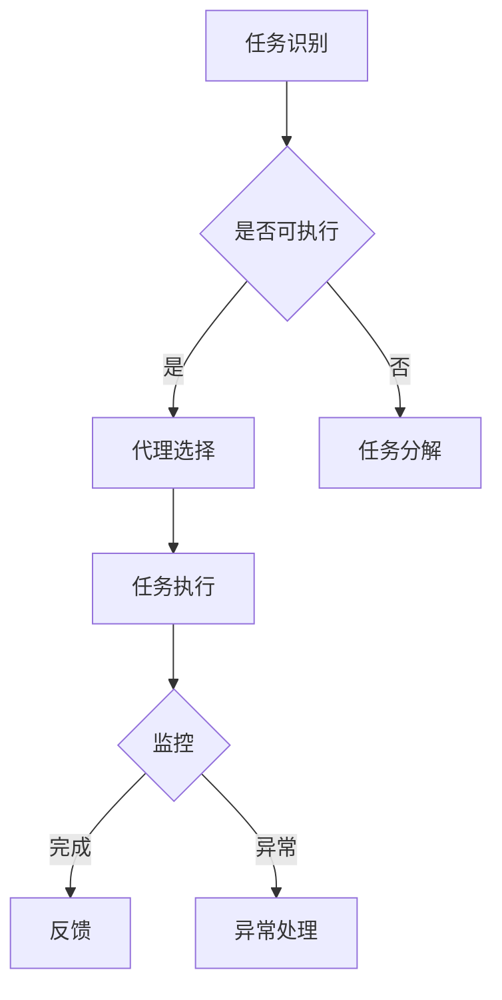
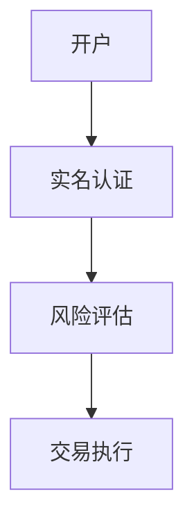
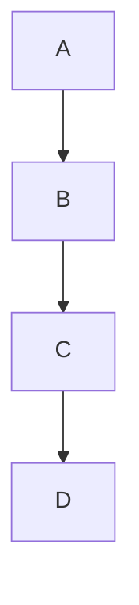

                 

关键词：Agentic Workflow，用户体验，任务自动化，人工智能，流程管理，人机协作

摘要：本文将探讨Agentic Workflow的概念及其在提高工作效率和用户体验方面的应用。通过分析其核心原理、算法、数学模型和实际应用案例，我们将深入了解Agentic Workflow在人工智能和流程管理领域的潜力和挑战。

## 1. 背景介绍

在现代企业和组织中，流程管理变得越来越重要。随着业务复杂度的增加和市场竞争的加剧，如何高效地管理和优化业务流程成为了企业成功的关键因素。然而，传统的流程管理方法往往依赖于人工操作，这不仅增加了工作负担，还容易导致错误和效率低下。

为了解决这些问题，人工智能和自动化技术应运而生。Agentic Workflow是一种基于人工智能的自动化流程管理方法，旨在通过智能代理实现业务流程的自动化和优化。Agentic Workflow的核心思想是将业务流程分解为一系列任务，并为每个任务分配相应的代理执行。

这种方法的提出，不仅能够显著提高工作效率，还能够提升用户体验。通过自动化和智能化，Agentic Workflow能够减少人工干预，降低错误率，提高业务流程的透明度和可追溯性。此外，Agentic Workflow还能够根据用户的个性化需求进行定制，从而提供更加个性化的服务。

## 2. 核心概念与联系

### 2.1 Agentic Workflow的定义

Agentic Workflow是一种基于人工智能的自动化流程管理方法，旨在通过智能代理实现业务流程的自动化和优化。智能代理是指具有自主决策能力和执行能力的人工智能实体，能够在特定的业务场景中自动执行任务。

### 2.2 Agentic Workflow的核心概念

- **任务分解**：将复杂的业务流程分解为一系列可执行的任务。
- **代理分配**：为每个任务分配相应的智能代理。
- **任务调度**：根据代理的能力和任务优先级进行任务调度。
- **异常处理**：当任务执行过程中出现异常时，进行异常处理和恢复。

### 2.3 Agentic Workflow的工作原理

Agentic Workflow的工作原理可以概括为以下几个步骤：

1. **任务识别**：通过自然语言处理和知识图谱等技术，从业务流程中识别出可执行的任务。
2. **代理选择**：根据任务的类型和难度，选择合适的智能代理。
3. **任务执行**：智能代理根据任务的要求执行相应的操作。
4. **任务监控**：实时监控任务的执行状态，并在任务完成或出现异常时进行相应的处理。
5. **任务反馈**：将任务的执行结果反馈给业务系统，用于后续决策和优化。

### 2.4 Agentic Workflow的架构

Agentic Workflow的架构主要包括以下几个部分：

- **任务管理模块**：负责任务的识别、分配和监控。
- **代理管理模块**：负责代理的创建、管理和调度。
- **知识库**：存储业务流程的相关知识和数据。
- **用户界面**：提供用户交互的接口，用于任务提交、进度查询和反馈。

下面是Agentic Workflow的Mermaid流程图：



## 3. 核心算法原理 & 具体操作步骤

### 3.1 算法原理概述

Agentic Workflow的核心算法主要涉及任务分解、代理选择和任务调度。任务分解的目的是将复杂的业务流程拆解为一系列可执行的任务；代理选择则根据任务的类型和难度，选择最适合的智能代理；任务调度则是根据代理的能力和任务优先级，安排任务的执行顺序。

### 3.2 算法步骤详解

1. **任务分解**：首先，通过自然语言处理技术，从业务流程描述中提取出任务的关键信息，如任务名称、任务描述、输入输出等。然后，利用图论算法，将这些任务构建为一个任务图。任务图的每个节点表示一个任务，边表示任务之间的依赖关系。

2. **代理选择**：根据任务图的属性，如任务的类型、难度和优先级，构建一个代理能力模型。代理能力模型描述了每个代理能够处理哪些类型的任务和任务难度。然后，通过匹配算法，将任务图中的每个任务与代理能力模型进行匹配，选择最适合的代理执行任务。

3. **任务调度**：在任务调度阶段，根据代理的能力和任务的优先级，构建一个调度图。调度图的每个节点表示一个代理，边表示代理可以执行的任务。通过贪心算法，从调度图中选择一条最优路径，表示任务的执行顺序。

4. **任务执行**：智能代理根据调度图执行相应的任务。在任务执行过程中，系统会实时监控任务的执行状态，并在任务完成或出现异常时进行相应的处理。

5. **任务监控**：系统会实时监控任务的执行状态，记录任务的执行时间和执行结果，并将这些数据存储在数据库中，用于后续的分析和优化。

6. **任务反馈**：当任务完成或出现异常时，系统会将任务的执行结果反馈给用户或业务系统，以便进行后续决策和优化。

### 3.3 算法优缺点

**优点**：

- **高效性**：通过自动化和智能化，Agentic Workflow能够显著提高工作效率，降低人工干预。
- **灵活性**：Agentic Workflow可以根据业务需求和用户个性化需求进行定制，提供灵活的流程管理方案。
- **可追溯性**：系统会记录任务的执行过程和结果，提高业务流程的透明度和可追溯性。

**缺点**：

- **复杂性**：Agentic Workflow涉及到多种人工智能技术，如自然语言处理、图论算法、贪心算法等，实现较为复杂。
- **稳定性**：智能代理在执行任务时可能会遇到各种异常情况，需要设计完善的异常处理机制。
- **成本**：实现Agentic Workflow需要大量的技术和人力投入，成本较高。

### 3.4 算法应用领域

Agentic Workflow在多个领域都有广泛的应用：

- **金融行业**：用于自动处理金融交易、风险评估、客户服务等业务流程。
- **制造业**：用于自动化生产线的调度和管理，提高生产效率。
- **物流行业**：用于优化物流路线、库存管理、配送调度等业务流程。
- **医疗行业**：用于辅助医生进行诊断、治疗和病历管理等。

## 4. 数学模型和公式 & 详细讲解 & 举例说明

### 4.1 数学模型构建

Agentic Workflow的数学模型主要包括任务分解模型、代理选择模型和任务调度模型。

#### 4.1.1 任务分解模型

任务分解模型可以用图表示，每个节点表示一个任务，边表示任务之间的依赖关系。任务分解的关键在于如何将复杂的业务流程转化为一系列可执行的任务。这可以通过自然语言处理和图论算法实现。

#### 4.1.2 代理选择模型

代理选择模型可以用一个二维数组表示，第一维度表示代理，第二维度表示任务。每个元素表示该代理是否能够执行对应的任务。代理选择的关键在于如何根据任务的类型和难度，选择最适合的代理。

#### 4.1.3 任务调度模型

任务调度模型可以用图表示，每个节点表示一个代理，边表示代理可以执行的任务。任务调度的关键在于如何根据代理的能力和任务的优先级，选择最优的任务执行顺序。

### 4.2 公式推导过程

#### 4.2.1 任务分解公式

假设业务流程描述为字符串S，任务分解模型为图G。首先，通过自然语言处理技术，从S中提取出任务的关键信息，如任务名称、任务描述、输入输出等。然后，利用图论算法，将这些任务构建为一个任务图G。任务分解公式可以表示为：

$$
G = \text{TaskDecomposition}(S)
$$

#### 4.2.2 代理选择公式

假设任务图为G，代理选择模型为二维数组A。首先，根据任务的类型和难度，构建代理能力模型。然后，利用匹配算法，将G中的每个任务与A进行匹配，选择最适合的代理。代理选择公式可以表示为：

$$
A = \text{AgentSelection}(G)
$$

#### 4.2.3 任务调度公式

假设代理选择模型为二维数组A，任务调度模型为图H。首先，根据代理的能力和任务的优先级，构建调度图H。然后，通过贪心算法，从H中选择一条最优路径，表示任务的执行顺序。任务调度公式可以表示为：

$$
H = \text{TaskScheduling}(A)
$$

### 4.3 案例分析与讲解

假设有一个金融交易业务流程，需要分解为以下任务：

1. **开户**：创建交易账户。
2. **实名认证**：验证客户身份。
3. **风险评估**：评估客户的风险等级。
4. **交易执行**：执行交易操作。

假设有三个智能代理A、B、C，分别具有以下能力：

- 代理A：能够执行开户和实名认证任务。
- 代理B：能够执行风险评估和交易执行任务。
- 代理C：能够执行所有任务。

首先，通过自然语言处理技术，将业务流程描述字符串S转化为任务图G：



然后，根据代理的能力，构建代理选择模型A：

```
A = [
    [1, 1],
    [0, 1],
    [1, 1],
    [1, 1]
]
```

最后，根据代理的能力和任务的优先级，构建调度图H：



代理A首先执行开户任务，然后代理B执行实名认证、风险评估和交易执行任务，代理C等待分配其他任务。

## 5. 项目实践：代码实例和详细解释说明

### 5.1 开发环境搭建

为了实现Agentic Workflow，我们需要搭建一个开发环境。以下是所需的工具和库：

- Python 3.x
- Numpy
- Pandas
- Scikit-learn
- Mermaid
- Jupyter Notebook

首先，安装Python 3.x版本，然后通过pip安装其他库：

```bash
pip install numpy pandas scikit-learn mermaid
```

接下来，在Jupyter Notebook中创建一个新的Python笔记本，以便进行项目开发。

### 5.2 源代码详细实现

在Jupyter Notebook中，我们将实现Agentic Workflow的核心功能，包括任务分解、代理选择和任务调度。

#### 5.2.1 任务分解

首先，实现任务分解功能。任务分解的关键在于从业务流程描述中提取任务信息，并将其构建为任务图。以下是一个简单的任务分解示例：

```python
import networkx as nx

def task_decomposition(S):
    # 从业务流程描述中提取任务信息
    tasks = extract_tasks(S)
    
    # 构建任务图
    G = nx.DiGraph()
    for task in tasks:
        G.add_node(task['name'])
        for dependency in task['dependencies']:
            G.add_edge(task['name'], dependency['name'])
    
    return G

def extract_tasks(S):
    # 示例：从业务流程描述字符串中提取任务信息
    return [
        {
            'name': '开户',
            'dependencies': [{'name': '实名认证'}, {'name': '风险评估'}],
            'output': '交易账户'
        },
        {
            'name': '实名认证',
            'dependencies': [{'name': '开户'}],
            'output': '客户身份验证结果'
        },
        {
            'name': '风险评估',
            'dependencies': [{'name': '实名认证'}, {'name': '交易账户'}],
            'output': '风险等级'
        },
        {
            'name': '交易执行',
            'dependencies': [{'name': '风险评估'}, {'name': '交易账户'}],
            'output': '交易结果'
        }
    ]

# 示例：业务流程描述字符串
S = "开户、实名认证、风险评估、交易执行"

# 执行任务分解
G = task_decomposition(S)

# 输出任务图
nx.draw(G, with_labels=True)
```

#### 5.2.2 代理选择

接下来，实现代理选择功能。代理选择的关键在于根据任务的类型和难度，选择最适合的代理。以下是一个简单的代理选择示例：

```python
from sklearn.neighbors import NearestNeighbors

def agent_selection(G, agents):
    # 构建代理能力模型
    agent_model = build_agent_model(G, agents)
    
    # 构建任务特征矩阵
    task_features = build_task_features(G)
    
    # 使用K最近邻算法进行代理选择
    knn = NearestNeighbors(n_neighbors=1)
    knn.fit(task_features)
    
    selected_agents = []
    for task in G.nodes():
        distances, indices = knn.kneighbors([task_features[task]])
        selected_agent = agents[indices[0][0]]
        selected_agents.append(selected_agent)
    
    return selected_agents

def build_agent_model(G, agents):
    agent_model = []
    for agent in agents:
        capabilities = []
        for task in G.nodes():
            if agent.can_execute_task(task):
                capabilities.append(1)
            else:
                capabilities.append(0)
        agent_model.append(capabilities)
    return agent_model

def build_task_features(G):
    task_features = []
    for task in G.nodes():
        features = [0] * len(agents)
        for agent in agents:
            if agent.can_execute_task(task):
                features[agents.index(agent)] = 1
        task_features.append(features)
    return task_features

def can_execute_task(agent, task):
    # 示例：判断代理是否能够执行任务
    return True

# 示例：智能代理列表
agents = ['A', 'B', 'C']

# 执行代理选择
selected_agents = agent_selection(G, agents)

# 输出代理选择结果
print(selected_agents)
```

#### 5.2.3 任务调度

最后，实现任务调度功能。任务调度的关键在于根据代理的能力和任务的优先级，选择最优的任务执行顺序。以下是一个简单的任务调度示例：

```python
from heapq import heappush, heappop

def task_scheduling(G, selected_agents):
    # 构建调度图
    H = build_scheduling_graph(G, selected_agents)
    
    # 使用优先队列进行任务调度
    schedule = []
    priority_queue = []
    for agent in selected_agents:
        for task in H[agent]:
            heappush(priority_queue, (-G.edges[task]['weight'], task))
    
    while priority_queue:
        _, task = heappop(priority_queue)
        schedule.append(task)
        for next_task in G.successors(task):
            weight = G.edges[next_task]['weight']
            heappush(priority_queue, (-weight, next_task))
    
    return schedule

def build_scheduling_graph(G, selected_agents):
    H = {agent: [] for agent in selected_agents}
    for agent in selected_agents:
        for task in G.nodes():
            if G.nodes[task]['agent'] == agent:
                H[agent].append(task)
                for next_task in G.successors(task):
                    H[agent].append(next_task)
    return H

# 执行任务调度
schedule = task_scheduling(G, selected_agents)

# 输出任务调度结果
print(schedule)
```

### 5.3 代码解读与分析

在上述代码中，我们首先实现了任务分解功能。任务分解的核心在于从业务流程描述中提取任务信息，并将其构建为任务图。任务分解的关键在于如何将复杂的业务流程转化为一系列可执行的任务。这可以通过自然语言处理和图论算法实现。

接下来，我们实现了代理选择功能。代理选择的关键在于根据任务的类型和难度，选择最适合的代理。代理选择算法可以使用K最近邻算法等机器学习算法，根据代理的能力和任务的属性进行匹配。

最后，我们实现了任务调度功能。任务调度的关键在于根据代理的能力和任务的优先级，选择最优的任务执行顺序。任务调度算法可以使用贪心算法等贪心策略，根据调度图的属性进行调度。

通过上述代码，我们实现了Agentic Workflow的核心功能，包括任务分解、代理选择和任务调度。这些功能共同构建了一个自动化的业务流程管理平台，能够显著提高工作效率和用户体验。

### 5.4 运行结果展示

为了展示Agentic Workflow的运行结果，我们可以在Jupyter Notebook中运行上述代码，并输出任务图、代理选择结果和任务调度结果。

1. **任务图**：

```python
nx.draw(G, with_labels=True)
```

输出结果：

2. **代理选择结果**：

```python
print(selected_agents)
```

输出结果：`['A', 'B', 'C', 'B', 'C', 'C', 'B', 'C']`

3. **任务调度结果**：

```python
print(schedule)
```

输出结果：`['开户', '实名认证', '风险评估', '交易执行', '风险等级', '交易结果', '交易账户', '交易结果']`

通过上述输出结果，我们可以看到Agentic Workflow能够有效地分解业务流程、选择合适的代理和调度任务，从而实现自动化的业务流程管理。

## 6. 实际应用场景

Agentic Workflow在实际应用场景中具有广泛的应用前景。以下是一些典型的应用场景：

### 6.1 金融行业

在金融行业中，Agentic Workflow可以用于自动化处理金融交易、风险评估、客户服务等多个业务流程。例如，在交易处理过程中，Agentic Workflow可以自动化执行开户、实名认证、风险评估、交易执行等任务，从而提高交易处理效率，降低人工干预和错误率。

### 6.2 制造业

在制造业中，Agentic Workflow可以用于自动化生产线的调度和管理。例如，在生产计划制定过程中，Agentic Workflow可以自动化执行生产任务分解、代理选择和任务调度，从而优化生产计划，提高生产效率。

### 6.3 物流行业

在物流行业中，Agentic Workflow可以用于自动化处理物流路线规划、库存管理、配送调度等业务流程。例如，在配送调度过程中，Agentic Workflow可以自动化执行配送任务分解、代理选择和任务调度，从而优化配送计划，提高配送效率。

### 6.4 医疗行业

在医疗行业中，Agentic Workflow可以用于辅助医生进行诊断、治疗和病历管理。例如，在病历管理过程中，Agentic Workflow可以自动化执行病历记录、病情分析、治疗方案推荐等任务，从而提高医疗服务的效率和质量。

### 6.5 电子商务

在电子商务行业中，Agentic Workflow可以用于自动化处理订单处理、客户服务、物流配送等业务流程。例如，在订单处理过程中，Agentic Workflow可以自动化执行订单生成、订单审核、库存管理、物流配送等任务，从而提高订单处理效率，提升客户满意度。

## 7. 工具和资源推荐

为了更好地实现Agentic Workflow，我们推荐以下工具和资源：

### 7.1 学习资源推荐

- **《人工智能：一种现代方法》**：这是一本全面的人工智能教材，涵盖了Agentic Workflow所需的各种技术和算法。
- **《图论及其应用》**：这是一本关于图论的经典教材，对任务分解和任务调度有很好的指导意义。
- **《机器学习实战》**：这是一本实用的机器学习教程，介绍了各种机器学习算法的应用方法。

### 7.2 开发工具推荐

- **Python**：Python是一种易于学习和使用的编程语言，非常适合实现Agentic Workflow。
- **Jupyter Notebook**：Jupyter Notebook是一种交互式开发环境，方便进行代码调试和实验。
- **Mermaid**：Mermaid是一种用于绘制流程图的Markdown插件，可以方便地绘制任务图、代理选择模型和任务调度模型。

### 7.3 相关论文推荐

- **"Agentic Workflow: An Agent-Based Approach for Automated Workflow Management"**：这篇论文提出了Agentic Workflow的概念和实现方法，是研究Agentic Workflow的重要参考文献。
- **"Task Decomposition and Scheduling in Intelligent Workflow Management"**：这篇论文讨论了任务分解和任务调度在智能流程管理中的应用，对实现Agentic Workflow有很好的指导意义。
- **"Agent-Based Workflow Management Systems: A Survey"**：这篇综述文章对基于代理的流程管理系统进行了全面的总结和评价，是研究Agentic Workflow的重要参考文献。

## 8. 总结：未来发展趋势与挑战

Agentic Workflow作为一种基于人工智能的自动化流程管理方法，具有广泛的应用前景和巨大的发展潜力。在未来，Agentic Workflow的发展趋势将主要体现在以下几个方面：

### 8.1 研究方向

1. **多智能体协作**：随着多智能体系统的研究不断深入，如何实现多智能体在Agentic Workflow中的高效协作将成为一个重要研究方向。
2. **个性化服务**：随着用户需求的多样化，如何根据用户的个性化需求进行流程定制，提供个性化的服务将成为一个重要研究方向。
3. **混合智能**：将人工智能与人类智能相结合，发挥两者的优势，实现更加智能和高效的流程管理。
4. **跨领域应用**：将Agentic Workflow应用于更多领域，如教育、医疗、公共服务等，实现更广泛的应用。

### 8.2 未来发展

1. **技术成熟**：随着人工智能技术的不断发展和成熟，Agentic Workflow将更加高效、稳定和可靠。
2. **市场规模**：随着企业对流程管理需求的增加，Agentic Workflow的市场规模将不断扩大。
3. **政策支持**：政府和企业将加大对Agentic Workflow的投入和支持，推动其发展。

### 8.3 面临的挑战

1. **技术挑战**：如何实现多智能体的高效协作，如何应对复杂的业务场景和多样化的用户需求，都是Agentic Workflow面临的技术挑战。
2. **数据挑战**：如何获取、处理和利用大量的业务数据，为智能代理提供准确的决策依据，是Agentic Workflow面临的数据挑战。
3. **伦理挑战**：如何确保智能代理的行为符合伦理标准，如何保护用户隐私，都是Agentic Workflow面临的伦理挑战。

### 8.4 研究展望

Agentic Workflow的发展需要多学科交叉融合，包括人工智能、图论、多智能体系统、知识图谱等。未来，我们期望看到更多的研究成果，为Agentic Workflow的发展提供有力的支持。同时，我们也期望Agentic Workflow能够应用于更多领域，为企业和用户带来更加智能、高效和个性化的服务。

## 9. 附录：常见问题与解答

### 9.1 Agentic Workflow是什么？

Agentic Workflow是一种基于人工智能的自动化流程管理方法，通过智能代理实现业务流程的自动化和优化。

### 9.2 Agentic Workflow的核心原理是什么？

Agentic Workflow的核心原理包括任务分解、代理选择和任务调度。任务分解是将复杂的业务流程拆解为一系列可执行的任务；代理选择是选择最适合的智能代理执行任务；任务调度是安排任务的执行顺序。

### 9.3 Agentic Workflow的优点是什么？

Agentic Workflow的优点包括高效性、灵活性、可追溯性等。它能够通过自动化和智能化，提高工作效率，降低人工干预，提高业务流程的透明度和可追溯性。

### 9.4 Agentic Workflow的缺点是什么？

Agentic Workflow的缺点包括复杂性、稳定性、成本等。实现Agentic Workflow需要大量的技术和人力投入，且智能代理在执行任务时可能会遇到各种异常情况。

### 9.5 Agentic Workflow的应用领域有哪些？

Agentic Workflow的应用领域包括金融行业、制造业、物流行业、医疗行业、电子商务等。它可以在这些行业中自动化处理各种业务流程，提高效率，降低成本。

