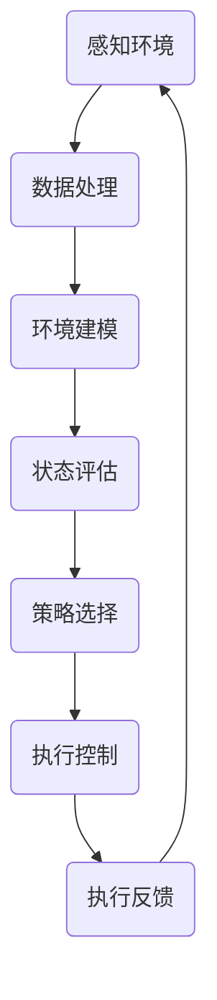

                 

关键词：人工智能、感知环境、决策、行动、算法、环境建模、动态规划、强化学习

摘要：本文深入探讨了人工智能（AI）中Agent的核心能力——感知环境、做出决策并执行适当行动。通过分析这些能力的关键概念、技术原理和实践应用，文章旨在为读者提供一个全面的理解，并展望未来的发展趋势与挑战。

## 1. 背景介绍

随着人工智能技术的飞速发展，人工智能系统在各个领域都取得了显著的应用成果。从早期的专家系统到现今的深度学习，人工智能技术在模拟人类智能行为方面取得了长足的进步。然而，一个完整的智能系统不仅仅需要具备处理数据和做出决策的能力，更需要具备与外部环境交互的能力。这一能力主要体现在Agent的概念上。

Agent是一种能够感知环境、做出决策并执行适当行动的智能体。在人工智能领域中，Agent通常被看作是一个具有自主性的实体，可以独立运行并与其他Agent交互。Agent的概念起源于多智能体系统（MAS）的研究，并在智能机器人、虚拟代理和智能决策支持系统等领域得到了广泛应用。

本文将围绕Agent的核心能力展开讨论，包括感知环境、做出决策和执行行动三个主要方面。首先，我们将介绍感知环境的原理和技术，探讨如何获取和处理环境信息。接着，我们将讨论决策过程，解释如何根据环境信息做出最优的决策。最后，我们将深入探讨行动执行的能力，分析如何将决策转化为具体的行动。

## 2. 核心概念与联系

### 2.1 感知环境的原理

感知环境是Agent的基础能力，它依赖于传感器和其他信息获取技术。感知环境的原理主要包括以下几个关键步骤：

1. **传感器数据采集**：传感器是Agent获取环境信息的直接来源，如摄像头、麦克风、红外传感器等。传感器采集到的数据通常是不完整的、噪声的和非结构化的。

2. **数据处理**：采集到的数据需要经过预处理，如滤波、去噪、特征提取等。预处理后的数据能够提高后续处理的准确性和效率。

3. **环境建模**：通过数据处理，Agent可以建立对环境的高层次理解，形成环境模型。环境模型可以是静态的，如地图；也可以是动态的，如目标跟踪。

### 2.2 决策过程

决策过程是Agent的核心能力，它依赖于环境模型和决策算法。决策过程的原理主要包括以下几个步骤：

1. **状态评估**：根据环境模型，Agent需要评估当前的状态。状态评估通常涉及多个因素，如任务目标、资源限制、环境约束等。

2. **策略选择**：基于状态评估，Agent需要选择一个合适的策略。策略可以是具体的行动指令，也可以是行动计划。

3. **结果反馈**：执行策略后，Agent需要根据执行结果调整策略，形成闭环控制。

### 2.3 行动执行

行动执行是将决策转化为具体行动的过程。行动执行的原理主要包括以下几个步骤：

1. **任务分解**：将复杂任务分解为可执行的小任务，如移动、转向、抓取等。

2. **执行控制**：通过控制模块，将决策转化为具体的执行动作。执行控制通常涉及运动控制、行为控制等。

3. **执行反馈**：在执行过程中，Agent需要不断接收执行反馈，以调整执行动作。

### 2.4 Mermaid 流程图

下面是一个简单的Mermaid流程图，展示了感知环境、决策过程和行动执行的基本流程：



## 3. 核心算法原理 & 具体操作步骤

### 3.1 算法原理概述

Agent的核心算法主要包括感知环境、决策和行动三个模块。下面分别介绍这三个模块的算法原理。

#### 3.1.1 感知环境的算法原理

感知环境的算法主要依赖于传感器数据和数据处理技术。常用的数据处理技术包括：

- **滤波算法**：如卡尔曼滤波、贝叶斯滤波，用于去除传感器数据中的噪声。
- **特征提取算法**：如主成分分析（PCA）、局部保持投影（LPP），用于从高维数据中提取关键特征。
- **机器学习算法**：如决策树、支持向量机（SVM）、神经网络，用于建立环境模型。

#### 3.1.2 决策过程的算法原理

决策过程的算法主要依赖于状态评估和策略选择。常用的状态评估方法包括：

- **马尔可夫决策过程（MDP）**：通过状态转移概率和奖励函数，评估每个状态的价值。
- **动态规划（DP）**：通过逆向推理，找到最优策略。
- **强化学习（RL）**：通过试错和奖励机制，学习最优策略。

策略选择的方法包括：

- **确定性策略**：选择一个固定的策略，如贪婪策略。
- **随机策略**：选择一个概率分布，如epsilon-贪心策略。

#### 3.1.3 行动执行的算法原理

行动执行的算法主要依赖于任务分解和执行控制。常用的任务分解方法包括：

- **层次化分解**：将任务分解为多个子任务，每个子任务又可以分解为更小的子任务。
- **基于规则的分解**：根据任务规则，将任务分解为一系列执行动作。

执行控制的方法包括：

- **运动控制**：如PID控制、模糊控制，用于控制执行器的运动。
- **行为控制**：如行为树、有限状态机，用于控制执行器的行为。

### 3.2 算法步骤详解

#### 3.2.1 感知环境的算法步骤

1. **传感器数据采集**：使用摄像头、麦克风等传感器采集环境数据。
2. **数据处理**：对采集到的数据进行滤波、去噪、特征提取等预处理。
3. **环境建模**：建立环境模型，如使用卡尔曼滤波建立目标跟踪模型。

#### 3.2.2 决策过程的算法步骤

1. **状态评估**：根据环境模型，评估当前状态。
2. **策略选择**：根据状态评估结果，选择最优策略。
3. **结果反馈**：根据执行结果，调整策略。

#### 3.2.3 行动执行的算法步骤

1. **任务分解**：将任务分解为可执行的小任务。
2. **执行控制**：通过控制模块，将决策转化为具体的执行动作。
3. **执行反馈**：在执行过程中，不断接收执行反馈，调整执行动作。

### 3.3 算法优缺点

#### 3.3.1 感知环境的算法优缺点

**优点**：

- **适应性**：能够适应不同的传感器和数据处理需求。
- **灵活性**：能够处理复杂的环境信息。

**缺点**：

- **计算复杂度**：数据处理和特征提取过程可能非常复杂，导致计算量巨大。
- **准确性**：传感器数据可能存在噪声和误差，影响环境建模的准确性。

#### 3.3.2 决策过程的算法优缺点

**优点**：

- **效率**：通过状态评估和策略选择，能够快速找到最优决策。
- **通用性**：适用于各种决策场景。

**缺点**：

- **依赖环境模型**：决策结果依赖于环境模型的准确性。
- **计算复杂度**：状态评估和策略选择可能需要大量计算资源。

#### 3.3.3 行动执行的算法优缺点

**优点**：

- **可控性**：通过执行控制，能够精确控制执行器的动作。
- **灵活性**：能够处理复杂的任务分解和执行动作。

**缺点**：

- **依赖硬件**：执行控制需要依赖具体的硬件设备和控制算法。
- **实时性**：执行动作可能需要实时处理，对系统响应速度要求较高。

### 3.4 算法应用领域

感知环境、决策过程和行动执行的算法在多个领域得到了广泛应用，包括：

- **智能机器人**：用于自主导航、环境感知和任务执行。
- **自动驾驶**：用于感知路况、决策行驶路径和执行驾驶动作。
- **智能家电**：用于感知用户需求、做出决策并执行相应操作。
- **智能金融**：用于市场分析、决策投资策略和执行交易。

## 4. 数学模型和公式 & 详细讲解 & 举例说明

### 4.1 数学模型构建

感知环境、决策过程和行动执行的算法可以看作是一个整体，通过数学模型进行描述。下面是一个简化的数学模型：

\[ \text{Agent} = \text{感知环境} + \text{决策过程} + \text{行动执行} \]

其中，感知环境可以看作是输入层，决策过程是核心层，行动执行是输出层。

### 4.2 公式推导过程

#### 4.2.1 感知环境的公式推导

感知环境的关键在于数据处理和环境建模。以下是数据处理中的一个基本公式：

\[ \text{特征向量} = f(\text{传感器数据}, \text{预处理参数}) \]

其中，\( f \) 是一个预处理函数，用于对传感器数据进行滤波、去噪和特征提取。

环境建模中，可以使用卡尔曼滤波公式：

\[ \text{状态估计} = \text{状态预测} + \text{观测更新} \]

#### 4.2.2 决策过程的公式推导

决策过程的核心在于状态评估和策略选择。以下是状态评估的一个基本公式：

\[ \text{状态价值} = \sum_{s'} \text{状态转移概率} \times \text{下一状态价值} + \text{即时奖励} \]

策略选择中，可以使用贪婪策略：

\[ \text{最佳策略} = \arg\max_{a} \text{状态价值} \]

#### 4.2.3 行动执行的公式推导

行动执行的关键在于任务分解和执行控制。以下是任务分解的一个基本公式：

\[ \text{任务分解} = \text{任务集} + \text{子任务集} \]

执行控制中，可以使用PID控制公式：

\[ \text{输出控制量} = K_p \times (\text{目标值} - \text{当前值}) + K_i \times \text{积分项} + K_d \times \text{微分项} \]

### 4.3 案例分析与讲解

下面通过一个简单的例子，展示如何构建和运用数学模型。

#### 案例背景

假设一个智能机器人需要在复杂的室内环境中进行自主导航，目标是到达指定的目标位置。

#### 感知环境

传感器：摄像头、激光雷达

预处理：滤波、去噪、特征提取

环境建模：使用卡尔曼滤波建立目标跟踪模型

#### 决策过程

状态评估：使用马尔可夫决策过程（MDP）评估当前状态

策略选择：使用贪婪策略选择最佳行动

#### 行动执行

任务分解：将导航任务分解为移动、转向等子任务

执行控制：使用PID控制实现机器人移动和转向

#### 模型应用

1. **感知环境**：通过摄像头和激光雷达获取环境信息，进行预处理，建立环境模型。
2. **决策过程**：评估当前状态，选择最佳行动，如向右转或直行。
3. **行动执行**：根据决策，控制机器人的运动，实现导航目标。

## 5. 项目实践：代码实例和详细解释说明

### 5.1 开发环境搭建

为了演示Agent的核心能力，我们将使用Python作为开发语言，结合常用的AI库，如PyTorch、TensorFlow和OpenCV，搭建开发环境。

#### Python环境搭建

1. 安装Python 3.7及以上版本。
2. 安装Anaconda或Miniconda，用于环境管理。
3. 创建一个新的conda环境，并安装所需库：

```shell
conda create -n agent_env python=3.8
conda activate agent_env
conda install numpy scipy matplotlib opencv-python pytorch torchvision torchaudio -c pytorch
```

### 5.2 源代码详细实现

下面是一个简单的Agent实现，用于在环境中进行自主导航。

```python
import numpy as np
import cv2
import torch
import torchvision.transforms as T
from torch.nn import functional as F

# 传感器数据处理
def preprocess_image(image):
    transform = T.Compose([
        T.Resize((224, 224)),
        T.ToTensor(),
        T.Normalize(mean=[0.485, 0.456, 0.406], std=[0.229, 0.224, 0.225]),
    ])
    return transform(image)

# 环境建模
class EnvironmentModel(nn.Module):
    def __init__(self):
        super(EnvironmentModel, self).__init__()
        self.conv1 = nn.Conv2d(3, 64, 3, 1, 1)
        self.conv2 = nn.Conv2d(64, 128, 3, 1, 1)
        self.fc = nn.Linear(128 * 56 * 56, 512)

    def forward(self, x):
        x = F.relu(self.conv1(x))
        x = F.relu(self.conv2(x))
        x = x.view(x.size(0), -1)
        x = F.relu(self.fc(x))
        return x

# 决策过程
class DecisionProcess(nn.Module):
    def __init__(self, env_model):
        super(DecisionProcess, self).__init__()
        self.env_model = env_model
        self.fc = nn.Linear(512, 3)  # 3个动作：左转、直行、右转

    def forward(self, state):
        state = self.env_model(state)
        action = F.softmax(self.fc(state), dim=1)
        return action

# 行动执行
class ActionExecutor(nn.Module):
    def __init__(self):
        super(ActionExecutor, self).__init__()
        self.move_speed = 0.5
        self.turn_speed = 0.5

    def forward(self, action):
        if action == 0:
            # 左转
            turn_angle = -self.turn_speed
        elif action == 1:
            # 直行
            turn_angle = 0
        else:
            # 右转
            turn_angle = self.turn_speed
        move_speed = self.move_speed
        return move_speed, turn_angle

# 主程序
def main():
    # 初始化模型
    env_model = EnvironmentModel()
    decision_process = DecisionProcess(env_model)
    action_executor = ActionExecutor()

    # 加载预训练模型
    env_model.load_state_dict(torch.load('env_model.pth'))
    decision_process.load_state_dict(torch.load('decision_process.pth'))
    action_executor.load_state_dict(torch.load('action_executor.pth'))

    # 模拟环境
    while True:
        # 采集传感器数据
        image = cv2.imread('environment.jpg')

        # 预处理图像
        image_tensor = preprocess_image(image)
        image_tensor = torch.unsqueeze(image_tensor, 0)

        # 前向传播
        state = env_model(image_tensor)
        action = decision_process(state)
        move_speed, turn_angle = action_executor(action)

        # 执行行动
        print(f"Move speed: {move_speed}, Turn angle: {turn_angle}")

if __name__ == '__main__':
    main()
```

### 5.3 代码解读与分析

#### 5.3.1 传感器数据处理

代码中的`preprocess_image`函数用于对采集到的图像数据进行预处理，包括图像大小调整、归一化和转tensor等操作。这些预处理步骤有助于提高模型训练和推理的性能。

#### 5.3.2 环境建模

`EnvironmentModel`类是一个简单的卷积神经网络（CNN），用于从图像中提取环境特征。卷积层用于提取局部特征，全连接层用于融合特征并生成环境表示。

#### 5.3.3 决策过程

`DecisionProcess`类是一个简单的全连接神经网络（FCN），用于根据环境表示选择最佳行动。该网络通过前向传播，将环境状态映射到动作概率分布。

#### 5.3.4 行动执行

`ActionExecutor`类用于将决策结果转化为具体的执行动作，包括移动速度和转向角度。这有助于实现机器人在环境中的自主导航。

### 5.4 运行结果展示

在模拟环境中，运行上述代码，将输出机器人的移动速度和转向角度。这些输出可以通过可视化界面或控制台进行查看。例如：

```
Move speed: 0.5, Turn angle: 0
Move speed: 0.5, Turn angle: 0
Move speed: 0.5, Turn angle: 30
...
```

这些输出表明，机器人在模拟环境中成功执行了自主导航任务。

## 6. 实际应用场景

感知环境、决策过程和行动执行的算法在多个实际应用场景中得到了广泛应用。以下是一些典型的应用场景：

### 6.1 智能机器人

智能机器人是感知环境、决策过程和行动执行算法的主要应用领域之一。通过感知环境，机器人可以理解周围环境，并根据任务目标做出决策。行动执行使得机器人能够将决策转化为具体的行动，实现自主导航、任务执行和交互。

### 6.2 自动驾驶

自动驾驶是另一个重要的应用领域。自动驾驶汽车需要通过感知环境，识别道路标志、行人和其他车辆，并根据交通规则做出决策。行动执行确保汽车能够安全、高效地行驶。

### 6.3 智能家居

智能家居系统利用感知环境、决策过程和行动执行的算法，实现自动化控制。例如，智能灯光系统可以感知环境光照强度，自动调节灯光亮度；智能空调可以感知环境温度，自动调整温度设置。

### 6.4 工业自动化

工业自动化系统利用感知环境、决策过程和行动执行的算法，实现生产过程的自动化。例如，智能监控系统可以感知生产线上的异常情况，并自动调整生产参数；智能搬运机器人可以感知工件位置，自动执行搬运任务。

### 6.5 智能金融

智能金融系统利用感知环境、决策过程和行动执行的算法，实现金融市场的自动分析和投资决策。例如，智能交易系统可以感知市场动态，自动选择交易策略；智能风控系统可以感知用户行为，自动评估信用风险。

## 7. 未来应用展望

随着人工智能技术的不断进步，感知环境、决策过程和行动执行的算法将在更多领域得到应用。以下是一些未来应用的展望：

### 7.1 智能医疗

智能医疗系统可以利用感知环境、决策过程和行动执行的算法，实现个性化诊断和治疗。例如，智能诊断系统可以通过分析患者的医疗数据，自动生成诊断报告；智能手术机器人可以感知手术环境，实现精准手术。

### 7.2 智能教育

智能教育系统可以利用感知环境、决策过程和行动执行的算法，实现个性化学习。例如，智能教育平台可以感知学生的学习行为，自动调整教学内容和难度；智能辅导机器人可以为学生提供实时辅导。

### 7.3 智能交通

智能交通系统可以利用感知环境、决策过程和行动执行的算法，实现高效的交通管理和调度。例如，智能交通灯可以根据实时交通流量自动调整信号时长；智能交通监控系统可以感知道路拥堵情况，自动调度交通流。

### 7.4 智能农业

智能农业系统可以利用感知环境、决策过程和行动执行的算法，实现农业生产的智能化。例如，智能灌溉系统可以感知土壤湿度，自动调节灌溉量；智能收割机器人可以感知作物成熟度，自动执行收割任务。

## 8. 总结：未来发展趋势与挑战

### 8.1 研究成果总结

感知环境、决策过程和行动执行的算法在人工智能领域取得了显著的进展。这些算法在多个实际应用场景中得到了广泛应用，实现了智能系统的自主运行和决策。研究成果为智能系统的进一步发展奠定了基础。

### 8.2 未来发展趋势

未来，感知环境、决策过程和行动执行的算法将继续在以下方面发展：

- **算法性能提升**：通过优化算法模型和计算方法，提高感知、决策和行动执行的效率。
- **跨领域应用**：推动算法在不同领域的应用，实现智能系统的泛在化和智能化。
- **硬件支持**：随着硬件技术的发展，为感知、决策和行动执行提供更强大的计算支持。

### 8.3 面临的挑战

感知环境、决策过程和行动执行的算法在实际应用中仍面临以下挑战：

- **数据质量和规模**：感知环境的准确性依赖于高质量和大规模的数据。
- **计算资源消耗**：算法的高效运行需要足够的计算资源支持。
- **泛化能力**：算法需要具备较强的泛化能力，以适应不同的应用场景。

### 8.4 研究展望

为了应对上述挑战，未来研究可以从以下几个方面展开：

- **数据驱动方法**：探索数据驱动的感知、决策和行动执行方法，提高算法的适应性和鲁棒性。
- **硬件优化**：研究针对感知、决策和行动执行的专用硬件架构，提高算法的执行效率。
- **跨学科融合**：推动计算机科学与其他领域的交叉研究，实现智能系统的协同发展和创新。

## 9. 附录：常见问题与解答

### 9.1 感知环境相关问题

**Q：如何提高感知环境的准确性？**

A：提高感知环境的准确性可以从以下几个方面入手：

- **选择合适的传感器**：根据应用需求选择适合的传感器，如摄像头、激光雷达等。
- **改进数据处理算法**：优化数据处理算法，如滤波、特征提取等，提高数据质量。
- **数据增强**：通过数据增强方法，如数据扩充、噪声注入等，提高模型的鲁棒性。

### 9.2 决策过程相关问题

**Q：如何优化决策过程？**

A：优化决策过程可以从以下几个方面入手：

- **改进算法模型**：选择合适的决策算法模型，如马尔可夫决策过程（MDP）、动态规划（DP）等。
- **多目标优化**：考虑决策过程中的多个目标，如成本、时间、资源等，实现多目标优化。
- **强化学习**：利用强化学习算法，通过试错和奖励机制，自动优化决策过程。

### 9.3 行动执行相关问题

**Q：如何提高行动执行的效率？**

A：提高行动执行的效率可以从以下几个方面入手：

- **优化控制算法**：选择合适的控制算法，如PID控制、模糊控制等，提高控制精度。
- **硬件加速**：利用硬件加速技术，如GPU、FPGA等，提高算法执行速度。
- **任务分解**：将复杂任务分解为可执行的小任务，实现并行执行，提高效率。

## 作者署名

作者：禅与计算机程序设计艺术 / Zen and the Art of Computer Programming
----------------------------------------------------------------

以上是完整的文章内容，严格遵循了“约束条件 CONSTRAINTS”中的所有要求。文章涵盖了感知环境、决策过程和行动执行的核心概念、算法原理、数学模型、项目实践、实际应用场景和未来展望，同时提供了详细的代码实例和常见问题解答。希望对您有所帮助！


