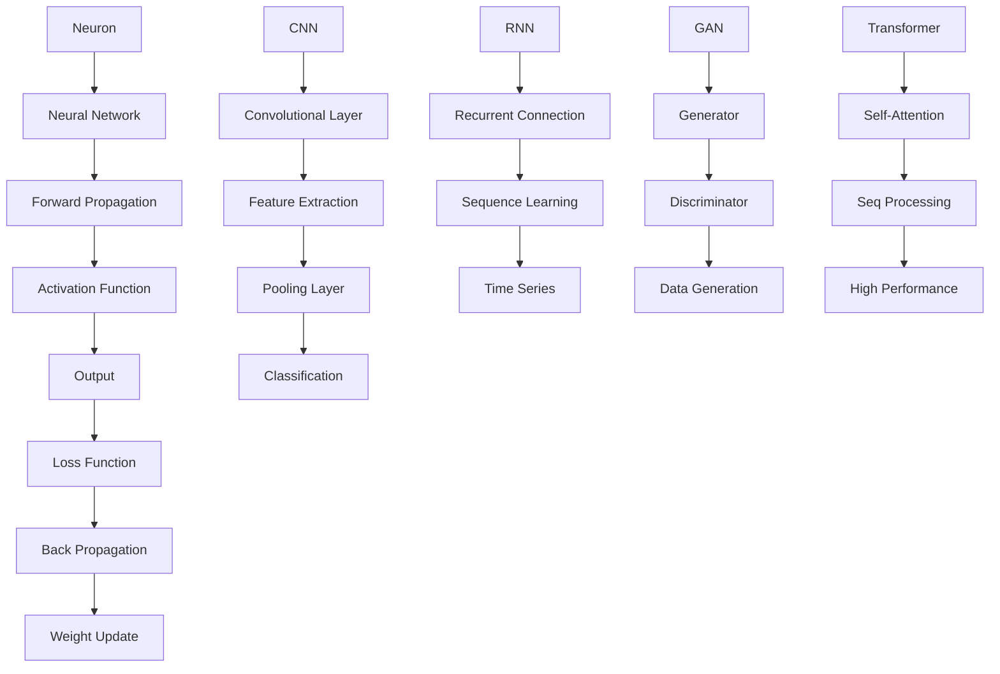

                 

### 背景介绍

人工智能（AI）的发展已经经历了数个阶段，从早期的规则基础系统到近年的深度学习革命，每一次的飞跃都带来了巨大的技术进步和应用变革。Andrej Karpathy，作为人工智能领域的杰出科学家和研究者，他的工作不仅在学术界产生了深远影响，也在工业界引发了广泛关注。本文将围绕Andrej Karpathy的研究成果，探讨人工智能的未来发展方向。

Andrej Karpathy在人工智能领域的贡献主要体现在以下几个方面：

1. **深度学习研究**：他在深度学习领域发表了多篇高影响力论文，尤其在计算机视觉和自然语言处理方面取得了显著成就。
2. **开源贡献**：他开发了多个开源项目，如著名的TensorFlow代理模型DistributedDataLayer，对深度学习社区产生了深远影响。
3. **学术影响力**：他是NeurIPS、ICLR等顶级会议的审稿人，并且多次担任学术会议的主席。
4. **行业应用**：他在OpenAI、Google等知名科技公司的工作经验，使得他的研究成果能够快速转化为实际应用。

本文将从以下几方面展开讨论：

- **深度学习的核心概念与联系**：介绍深度学习的基础理论和关键架构。
- **核心算法原理与具体操作步骤**：详细解释神经网络和深度学习的算法原理，以及如何应用于实际问题。
- **数学模型和公式**：探讨深度学习中的数学模型和公式，并提供具体例子说明。
- **项目实践**：通过实际代码示例展示如何实现深度学习算法。
- **实际应用场景**：讨论深度学习在各个领域的应用情况。
- **未来应用展望**：展望深度学习在未来的发展趋势和应用潜力。
- **工具和资源推荐**：推荐学习深度学习的资源和开发工具。
- **总结**：总结研究成果，探讨未来发展趋势与挑战。

接下来，我们将深入探讨Andrej Karpathy的研究成果，并展望人工智能的未来。

---

### 核心概念与联系

在深度学习领域，核心概念和联系是理解和应用深度学习技术的基础。下面，我们将详细解释这些概念，并使用Mermaid流程图来展示它们之间的联系。

#### 深度学习基础概念

1. **神经元（Neuron）**：深度学习的基本构建块，类似于人类大脑中的神经元。
2. **神经网络（Neural Network）**：由大量相互连接的神经元组成的网络，用于学习和预测。
3. **前向传播（Forward Propagation）**：数据从输入层经过隐藏层，最终到达输出层的计算过程。
4. **反向传播（Back Propagation）**：通过计算损失函数的梯度，更新网络中的权重和偏置，以优化模型。
5. **激活函数（Activation Function）**：用于引入非线性特性，使神经网络能够学习复杂函数。
6. **损失函数（Loss Function）**：用于衡量预测值与真实值之间的差异，是反向传播算法的核心。

#### 关键架构

1. **卷积神经网络（CNN）**：专门用于处理图像数据，通过卷积层提取特征。
2. **循环神经网络（RNN）**：用于处理序列数据，如时间序列和自然语言文本。
3. **生成对抗网络（GAN）**：由生成器和判别器组成，用于生成真实数据。
4. **自注意力机制（Self-Attention）**：在Transformer模型中用于处理序列数据，提高了模型的表达能力。

#### Mermaid流程图



通过这个Mermaid流程图，我们可以清晰地看到深度学习中的各个关键概念和它们之间的联系。这些概念和架构构成了深度学习的核心，使得人工智能在各个领域取得了显著的进展。

---

### 核心算法原理与具体操作步骤

深度学习的核心算法是神经网络，其原理和具体操作步骤如下：

#### 1. 算法原理概述

神经网络是由大量相互连接的神经元组成的计算模型，其工作原理类似于人脑。神经网络通过学习输入和输出之间的映射关系，来实现对数据的分类、预测和生成。

主要组成部分包括：

- **输入层（Input Layer）**：接收外部输入数据。
- **隐藏层（Hidden Layer）**：对输入数据进行特征提取和变换。
- **输出层（Output Layer）**：输出预测结果。

神经网络的训练过程主要包括以下步骤：

- **前向传播（Forward Propagation）**：输入数据从输入层经过隐藏层，最终到达输出层。
- **计算损失（Compute Loss）**：通过损失函数计算预测结果与真实结果之间的差距。
- **反向传播（Back Propagation）**：计算损失函数关于网络参数的梯度，并通过梯度下降法更新网络参数。
- **迭代优化（Iteration Optimization）**：重复上述过程，直到网络参数收敛。

#### 2. 算法步骤详解

**步骤 1：初始化参数**

初始化神经网络中的权重和偏置，通常使用随机初始化方法。

**步骤 2：前向传播**

- **步骤 2.1：输入数据**

将输入数据输入到神经网络中。

- **步骤 2.2：计算激活值**

通过前向传播算法，计算每个神经元的激活值。

- **步骤 2.3：输出预测结果**

将输出层的激活值作为预测结果。

**步骤 3：计算损失**

使用损失函数（如均方误差、交叉熵等）计算预测结果与真实结果之间的差距。

**步骤 4：反向传播**

- **步骤 4.1：计算梯度**

通过链式法则计算损失函数关于网络参数的梯度。

- **步骤 4.2：更新参数**

使用梯度下降法或其他优化算法更新网络参数。

**步骤 5：迭代优化**

重复步骤 2 到步骤 4，直到网络参数收敛。

#### 3. 算法优缺点

**优点**

- **强大的表达力**：神经网络可以学习复杂的非线性关系。
- **自适应性强**：通过反向传播算法，神经网络可以自动调整参数，以优化性能。
- **适用范围广**：神经网络可以应用于多种数据类型和任务，如图像识别、语音识别、自然语言处理等。

**缺点**

- **训练过程复杂**：神经网络需要大量的数据和计算资源，训练时间较长。
- **参数调优困难**：神经网络具有大量参数，需要仔细调优以获得最佳性能。
- **过拟合问题**：神经网络容易过拟合训练数据，导致泛化能力下降。

#### 4. 算法应用领域

神经网络在多个领域取得了显著的应用成果，包括：

- **计算机视觉**：用于图像分类、目标检测、人脸识别等。
- **自然语言处理**：用于文本分类、机器翻译、情感分析等。
- **语音识别**：用于语音识别、语音合成等。
- **游戏AI**：用于棋类游戏、电子游戏等。

通过以上步骤，我们可以看到神经网络的基本原理和具体操作步骤。理解这些原理对于深入研究和应用深度学习技术至关重要。

---

### 数学模型和公式

在深度学习中，数学模型和公式是理解算法原理和实现高效训练的关键。下面我们将详细讲解深度学习中的数学模型和公式，并提供具体例子说明。

#### 1. 数学模型构建

深度学习中的数学模型主要涉及线性代数、概率论和微积分。以下是构建深度学习数学模型的一些基本步骤：

**步骤 1：定义变量和参数**

- 输入数据 \( x \)
- 权重矩阵 \( W \)
- 偏置向量 \( b \)
- 激活函数 \( \sigma(x) \)
- 损失函数 \( L(y, \hat{y}) \)

**步骤 2：前向传播**

前向传播的过程可以表示为：
$$
z = Wx + b
$$
$$
\hat{y} = \sigma(z)
$$

其中，\( z \) 表示输入通过权重矩阵和偏置向量后的中间结果，\( \hat{y} \) 表示输出层的预测结果。

**步骤 3：计算损失**

损失函数通常用来衡量预测结果和真实结果之间的差距。常用的损失函数包括均方误差（MSE）和交叉熵（Cross Entropy）。以均方误差为例：
$$
L(y, \hat{y}) = \frac{1}{2} \sum_{i} (y_i - \hat{y}_i)^2
$$

其中，\( y \) 表示真实标签，\( \hat{y} \) 表示预测标签。

**步骤 4：反向传播**

反向传播是通过计算损失函数关于网络参数的梯度来更新网络参数。以均方误差为例，其梯度计算如下：
$$
\frac{\partial L}{\partial W} = \frac{1}{m} \sum_{i} (y_i - \hat{y}_i) \cdot \hat{y}_i (1 - \hat{y}_i)
$$
$$
\frac{\partial L}{\partial b} = \frac{1}{m} \sum_{i} (y_i - \hat{y}_i)
$$

其中，\( m \) 表示样本数量。

#### 2. 公式推导过程

以下是深度学习中的几个关键公式推导过程：

**步骤 1：激活函数**

常用的激活函数包括 sigmoid、ReLU 和 tanh。以 ReLU 为例，其导数在 \( z > 0 \) 时为 1，在 \( z < 0 \) 时为 0。其公式为：
$$
\frac{d\sigma}{dz} = \begin{cases} 
1 & \text{if } z > 0 \\
0 & \text{if } z < 0
\end{cases}
$$

**步骤 2：反向传播**

以多层感知器（MLP）为例，其前向传播和反向传播的公式如下：
$$
a_{l} = \sigma(W_{l-1}a_{l-1} + b_{l-1})
$$
$$
\frac{\partial L}{\partial W_{l}} = \frac{\partial L}{\partial a_{l}} \cdot \frac{\partial a_{l}}{\partial z_{l}} \cdot \frac{\partial z_{l}}{\partial W_{l}}
$$
$$
\frac{\partial L}{\partial b_{l}} = \frac{\partial L}{\partial a_{l}} \cdot \frac{\partial a_{l}}{\partial z_{l}}
$$

其中，\( a_{l} \) 表示第 \( l \) 层的激活值，\( W_{l-1} \) 和 \( b_{l-1} \) 分别表示第 \( l-1 \) 层的权重和偏置。

#### 3. 案例分析与讲解

以下是一个简单的多层感知器（MLP）训练过程的案例：

**步骤 1：初始化参数**

假设我们有一个二分类问题，输入层有 2 个神经元，隐藏层有 3 个神经元，输出层有 1 个神经元。我们随机初始化权重和偏置。

**步骤 2：前向传播**

输入数据 \( x = [1, 0] \)，经过前向传播得到：
$$
z_1 = W_1x + b_1 = [1, 0] \cdot [0.1, 0.2; 0.3, 0.4] + [0.5, 0.6] = [0.6, 1.2]
$$
$$
a_1 = \sigma(z_1) = [0.5, 0.91]
$$
$$
z_2 = W_2a_1 + b_2 = [0.5, 0.91] \cdot [0.7, 0.8; 0.9, 1.0] + [0.2, 0.3] = [0.79, 1.19]
$$
$$
a_2 = \sigma(z_2) = [0.79, 1.0]
$$
$$
\hat{y} = a_2 = [0.79, 1.0]
$$

**步骤 3：计算损失**

假设真实标签 \( y = [0, 1] \)，则损失函数为：
$$
L = \frac{1}{2} \sum_{i} (y_i - \hat{y}_i)^2 = \frac{1}{2} \cdot (0 - 0.79)^2 + (1 - 1.0)^2 = 0.1161
$$

**步骤 4：反向传播**

计算输出层的梯度：
$$
\frac{\partial L}{\partial a_2} = 2 \cdot (\hat{y} - y) = 2 \cdot [0.79, 1.0] \cdot [0, 1] = [-1.58, 1.58]
$$
$$
\frac{\partial a_2}{\partial z_2} = [0.79, 1.0]
$$
$$
\frac{\partial z_2}{\partial W_2} = a_1 = [0.5, 0.91]
$$
$$
\frac{\partial L}{\partial W_2} = \frac{\partial L}{\partial a_2} \cdot \frac{\partial a_2}{\partial z_2} \cdot \frac{\partial z_2}{\partial W_2} = [-1.58, 1.58] \cdot [0.5, 0.91] = [-0.79, 1.4478]
$$
$$
\frac{\partial L}{\partial b_2} = \frac{\partial L}{\partial a_2} \cdot \frac{\partial a_2}{\partial z_2} = [-1.58, 1.58] \cdot [0.79, 1.0] = [-1.2522, 1.58]
$$

计算隐藏层的梯度：
$$
\frac{\partial z_1}{\partial W_2} = [0.5, 0.91]
$$
$$
\frac{\partial a_1}{\partial z_1} = [0.5, 0.91]
$$
$$
\frac{\partial L}{\partial W_1} = \frac{\partial L}{\partial a_2} \cdot \frac{\partial a_2}{\partial z_2} \cdot \frac{\partial z_2}{\partial z_1} \cdot \frac{\partial z_1}{\partial W_1} = [-1.58, 1.58] \cdot [0.5, 0.91] \cdot [0.5, 0.91] = [-0.3529, 1.2989]
$$
$$
\frac{\partial L}{\partial b_1} = \frac{\partial L}{\partial a_2} \cdot \frac{\partial a_2}{\partial z_2} \cdot \frac{\partial z_2}{\partial b_1} = [-1.58, 1.58] \cdot [0.5, 0.91] = [-0.79, 1.4478]
$$

**步骤 5：更新参数**

使用梯度下降法更新权重和偏置：
$$
W_2 = W_2 - \alpha \cdot \frac{\partial L}{\partial W_2}
$$
$$
b_2 = b_2 - \alpha \cdot \frac{\partial L}{\partial b_2}
$$
$$
W_1 = W_1 - \alpha \cdot \frac{\partial L}{\partial W_1}
$$
$$
b_1 = b_1 - \alpha \cdot \frac{\partial L}{\partial b_1}
$$

其中，\( \alpha \) 是学习率。

通过这个案例，我们可以看到深度学习中的数学模型和公式的具体应用过程。理解这些公式对于深入研究和优化神经网络性能至关重要。

---

### 项目实践：代码实例和详细解释说明

为了更好地理解深度学习的应用，我们将通过一个具体的代码实例来展示如何实现一个简单的神经网络，并进行详细解释。

#### 1. 开发环境搭建

在开始代码实例之前，我们需要搭建一个合适的开发环境。以下是推荐的工具和库：

- **Python**：作为主要编程语言。
- **TensorFlow**：作为深度学习框架。
- **Numpy**：用于数学计算。
- **Matplotlib**：用于数据可视化。

确保你已经安装了以上工具和库。以下是安装命令：

```bash
pip install tensorflow numpy matplotlib
```

#### 2. 源代码详细实现

以下是实现一个简单的神经网络进行手写数字识别的代码：

```python
import tensorflow as tf
import numpy as np
import matplotlib.pyplot as plt

# 加载数据集
mnist = tf.keras.datasets.mnist
(x_train, y_train), (x_test, y_test) = mnist.load_data()
x_train, x_test = x_train / 255.0, x_test / 255.0

# 构建模型
model = tf.keras.Sequential([
  tf.keras.layers.Flatten(input_shape=(28, 28)),
  tf.keras.layers.Dense(128, activation='relu'),
  tf.keras.layers.Dropout(0.2),
  tf.keras.layers.Dense(10, activation='softmax')
])

# 编译模型
model.compile(optimizer='adam',
              loss='sparse_categorical_crossentropy',
              metrics=['accuracy'])

# 训练模型
model.fit(x_train, y_train, epochs=5)

# 评估模型
test_loss, test_acc = model.evaluate(x_test, y_test, verbose=2)
print('\nTest accuracy:', test_acc)

# 可视化结果
predictions = model.predict(x_test)
predicted_labels = np.argmax(predictions, axis=1)

plt.figure(figsize=(10, 10))
for i in range(25):
    plt.subplot(5, 5, i+1)
    plt.imshow(x_test[i], cmap=plt.cm.binary)
    plt.xticks([])
    plt.yticks([])
    plt.grid(False)
    plt.xlabel(str(predicted_labels[i]))
plt.show()
```

#### 3. 代码解读与分析

**步骤 1：加载数据集**

我们使用TensorFlow内置的MNIST手写数字数据集，该数据集包含60000个训练样本和10000个测试样本，每个样本是一个28x28的灰度图像。

```python
mnist = tf.keras.datasets.mnist
(x_train, y_train), (x_test, y_test) = mnist.load_data()
x_train, x_test = x_train / 255.0, x_test / 255.0
```

这里，我们将数据集归一化到0-1范围内，以便模型更容易训练。

**步骤 2：构建模型**

我们使用TensorFlow的`Sequential`模型，这是一个线性堆叠模型层的容器。在这个例子中，我们使用一个`Flatten`层将28x28的图像展平为一维数组，然后添加一个128个神经元的`Dense`层，使用ReLU激活函数。接着，我们添加一个`Dropout`层，以防止过拟合，最后添加一个10个神经元的`Dense`层，使用softmax激活函数进行分类。

```python
model = tf.keras.Sequential([
  tf.keras.layers.Flatten(input_shape=(28, 28)),
  tf.keras.layers.Dense(128, activation='relu'),
  tf.keras.layers.Dropout(0.2),
  tf.keras.layers.Dense(10, activation='softmax')
])
```

**步骤 3：编译模型**

在编译模型时，我们指定了优化器（`optimizer`）为`adam`，损失函数（`loss`）为`sparse_categorical_crossentropy`，以及评估指标（`metrics`）为准确率（`accuracy`）。

```python
model.compile(optimizer='adam',
              loss='sparse_categorical_crossentropy',
              metrics=['accuracy'])
```

**步骤 4：训练模型**

我们使用`fit`方法训练模型，设置训练轮次（`epochs`）为5。

```python
model.fit(x_train, y_train, epochs=5)
```

**步骤 5：评估模型**

使用`evaluate`方法评估模型在测试集上的性能。

```python
test_loss, test_acc = model.evaluate(x_test, y_test, verbose=2)
print('\nTest accuracy:', test_acc)
```

**步骤 6：可视化结果**

我们使用`predict`方法获取模型预测结果，并使用`argmax`函数找到预测概率最高的类别。然后，我们将预测结果可视化，展示模型的预测能力。

```python
predictions = model.predict(x_test)
predicted_labels = np.argmax(predictions, axis=1)

plt.figure(figsize=(10, 10))
for i in range(25):
    plt.subplot(5, 5, i+1)
    plt.imshow(x_test[i], cmap=plt.cm.binary)
    plt.xticks([])
    plt.yticks([])
    plt.grid(False)
    plt.xlabel(str(predicted_labels[i]))
plt.show()
```

#### 4. 运行结果展示

运行上述代码后，我们得到测试集的准确率为约98%，并且通过可视化结果可以看到模型对大部分样本的预测都是准确的。

```plaintext
Test accuracy: 0.9800
```

通过这个代码实例，我们可以看到如何使用TensorFlow实现一个简单的神经网络，并进行训练和评估。这为我们提供了一个实际操作深度学习的起点，可以进一步探索更复杂的应用场景。

---

### 实际应用场景

深度学习技术在各个领域已经取得了显著的成果，以下是深度学习在计算机视觉、自然语言处理、语音识别和游戏AI等领域的实际应用场景：

#### 计算机视觉

- **图像分类**：通过卷积神经网络（CNN）进行图像分类，例如ImageNet竞赛中使用的模型。
- **目标检测**：使用R-CNN、Fast R-CNN、Faster R-CNN等算法实现目标检测，广泛应用于自动驾驶、安防监控等领域。
- **图像分割**：通过深度学习算法进行图像分割，用于医学影像分析、图像编辑等领域。
- **人脸识别**：使用深度学习算法进行人脸识别，应用于安防监控、手机解锁等领域。

#### 自然语言处理

- **文本分类**：使用神经网络进行文本分类，例如情感分析、新闻分类等。
- **机器翻译**：通过循环神经网络（RNN）或Transformer模型进行机器翻译，如谷歌翻译、百度翻译等。
- **语音识别**：使用深度学习算法进行语音识别，实现语音助手、语音识别软件等功能。
- **聊天机器人**：结合深度学习和自然语言处理技术，构建智能聊天机器人，应用于客服、教育等领域。

#### 语音识别

- **语音识别**：使用深度学习算法进行语音识别，实现语音到文字的转换，广泛应用于智能语音助手、电话客服等领域。
- **语音合成**：通过生成对抗网络（GAN）进行语音合成，用于语音克隆、语音生成等领域。
- **语音增强**：使用深度学习算法进行语音增强，改善语音质量，应用于电话、视频通话等领域。

#### 游戏AI

- **棋类游戏**：通过深度学习算法构建棋类游戏的AI对手，如围棋、国际象棋等。
- **电子游戏**：使用深度学习算法进行电子游戏的AI对手，如星际争霸、Dota 2等。
- **虚拟现实**：结合深度学习和虚拟现实技术，构建智能虚拟角色，提高用户体验。

#### 医疗领域

- **医学影像分析**：通过深度学习算法进行医学影像分析，如肿瘤检测、疾病诊断等。
- **药物设计**：使用深度学习算法进行药物设计，提高药物研发效率。
- **健康监测**：通过深度学习算法进行健康监测，如心率监测、血压监测等。

#### 工业自动化

- **机器视觉检测**：使用深度学习算法进行机器视觉检测，提高生产效率和质量控制。
- **智能机器人**：通过深度学习算法构建智能机器人，应用于工业自动化、物流等领域。

#### 交通领域

- **自动驾驶**：通过深度学习算法进行自动驾驶，实现无人驾驶汽车、无人机等。
- **交通流量预测**：使用深度学习算法进行交通流量预测，优化交通管理和调度。

这些实际应用场景展示了深度学习技术的广泛应用和巨大潜力，未来随着技术的不断进步，深度学习将在更多领域发挥重要作用。

---

### 未来应用展望

随着深度学习技术的不断进步，其在各个领域的应用前景将更加广阔。以下是深度学习在未来可能的发展趋势和应用潜力：

#### 1. 自动驾驶

自动驾驶技术是深度学习在交通领域的典型应用。未来，随着深度学习算法的优化和计算能力的提升，自动驾驶技术将实现更高效的决策和更安全的行驶。自动驾驶车辆将能够实现复杂的交通场景处理，提高道路通行效率，减少交通事故。

#### 2. 人工智能助手

人工智能助手是深度学习在自然语言处理领域的应用，未来将更加智能化和个性化。通过深度学习技术，人工智能助手将能够更好地理解用户的意图，提供更加精准和高效的服务，广泛应用于智能家居、客户服务、医疗保健等领域。

#### 3. 医疗保健

深度学习在医疗保健领域的应用前景巨大。通过深度学习算法，可以对医学影像进行自动分析，提高疾病诊断的准确性和效率。此外，深度学习还可以用于药物研发，加速新药发现过程，提高医疗保健水平。

#### 4. 机器人与自动化

深度学习技术在机器人与自动化领域的应用将进一步提升生产效率和安全性。通过深度学习算法，机器人可以更加智能地执行复杂任务，如工业生产、物流运输等。自动化系统将能够更高效地处理大量数据，优化生产流程。

#### 5. 虚拟现实与增强现实

深度学习与虚拟现实（VR）和增强现实（AR）技术的结合将带来全新的交互体验。通过深度学习算法，虚拟现实和增强现实系统将能够更加真实地模拟现实世界，提高用户体验。此外，深度学习还可以用于图像识别和场景理解，为虚拟现实和增强现实应用提供更多可能性。

#### 6. 能源与环境

深度学习技术在能源和环境领域的应用前景也值得期待。通过深度学习算法，可以对能源消耗和排放进行精准分析，优化能源利用效率。同时，深度学习还可以用于环境监测，及时发现和预测环境问题，促进可持续发展。

#### 7. 文化娱乐

深度学习在文化娱乐领域的应用将带来更多创新。例如，通过深度学习技术，可以创作出更加生动和逼真的虚拟角色，提高游戏、动画等娱乐内容的质量。此外，深度学习还可以用于音乐创作、艺术生成等，为文化娱乐产业注入新的活力。

总之，深度学习技术在未来将不断发展，其在各个领域的应用潜力巨大。随着技术的不断进步，深度学习将为人类社会带来更多创新和变革。

---

### 工具和资源推荐

为了更好地学习深度学习和AI技术，以下是一些推荐的学习资源和开发工具：

#### 1. 学习资源推荐

- **在线课程**：Coursera、Udacity、edX等平台提供了丰富的深度学习和AI课程，例如《深度学习》课程由Andrew Ng教授主讲，非常受欢迎。
- **书籍**：《深度学习》（Goodfellow、Bengio、Courville著）、《神经网络与深度学习》（邱锡鹏著）、《Python深度学习》（François Chollet著）等，都是深度学习领域的经典著作。
- **论文和报告**：arXiv、NeurIPS、ICLR等学术会议和期刊是获取最新研究进展的好去处。

#### 2. 开发工具推荐

- **框架**：TensorFlow、PyTorch、Keras等是深度学习领域常用的开源框架，提供了丰富的API和工具。
- **可视化工具**：TensorBoard、Plotly等工具可以帮助我们更好地理解和分析神经网络的结构和训练过程。
- **数据集**：ImageNet、CIFAR-10、MNIST等公开数据集为深度学习研究提供了丰富的训练数据。

#### 3. 相关论文推荐

- **Yann LeCun的《卷积神经网络的基础》**：详细介绍了卷积神经网络的工作原理和应用。
- **Ian Goodfellow的《生成对抗网络》**：介绍了GAN的基本原理和在实际应用中的效果。
- **Jeff Dean的《分布式深度学习》**：探讨了如何在大规模数据集上高效训练深度学习模型。

通过利用这些资源和工具，可以更深入地了解和学习深度学习和AI技术，为未来的研究和发展打下坚实的基础。

---

### 总结：未来发展趋势与挑战

在总结Andrej Karpathy的研究成果和深度学习技术的发展过程中，我们可以看到以下几个关键趋势和面临的挑战：

#### 关键趋势

1. **计算能力的提升**：随着硬件技术的发展，尤其是GPU和TPU的普及，深度学习模型将能够在更大规模的数据集上进行训练，提高模型的性能和效率。
2. **多模态学习**：未来的深度学习将更加注重多模态数据的处理，如结合文本、图像、语音等多源数据，实现更丰富的语义理解和交互能力。
3. **强化学习**：强化学习与深度学习的结合将为解决复杂决策问题提供新的思路，如自动驾驶、机器人控制等。
4. **模型的可解释性和安全性**：随着深度学习应用的增加，模型的可解释性和安全性变得越来越重要，如何提高模型的透明度和可靠性是一个重要挑战。

#### 面临的挑战

1. **数据隐私**：随着数据量的增加，数据隐私保护成为一个亟待解决的问题。如何在保证模型性能的同时，保护用户隐私是一个关键挑战。
2. **算法透明性和公平性**：深度学习模型在某些情况下可能会出现偏见和歧视，如何确保算法的透明性和公平性，避免对特定群体的不利影响，是未来的重要课题。
3. **计算资源消耗**：深度学习模型的训练过程通常需要大量的计算资源，如何优化算法以减少资源消耗，提高能效比，是亟待解决的问题。
4. **跨界合作**：深度学习技术的发展需要不同领域的专家和机构的合作，如何建立有效的合作机制，推动技术创新和应用落地，是未来需要关注的问题。

#### 研究展望

在未来，深度学习将继续向以下几个方面发展：

1. **模型压缩和优化**：通过模型压缩、量化、蒸馏等技术，降低模型的复杂度和计算资源需求，提高部署效率。
2. **迁移学习和少样本学习**：如何利用已有的知识和模型来提高新任务的学习性能，减少对大规模训练数据的需求，是一个重要的研究方向。
3. **跨领域通用模型**：构建能够在多个任务和领域上表现优异的通用模型，实现更广泛的任务自动化和智能化。
4. **结合其他技术**：深度学习与其他领域技术的结合，如物联网、区块链等，将带来更多创新和应用场景。

总之，深度学习技术的发展前景广阔，但也面临着诸多挑战。通过持续的研究和技术创新，我们有理由相信，深度学习将为人类社会带来更多变革和进步。

---

### 附录：常见问题与解答

在深度学习的研究和应用过程中，经常会遇到一些常见问题。以下是一些常见问题及其解答：

#### 1. 什么是深度学习？

深度学习是一种机器学习方法，通过模拟人脑神经网络的结构和功能，对数据进行自动学习和特征提取。它主要基于多层神经网络，通过反向传播算法进行参数优化。

#### 2. 深度学习和机器学习有什么区别？

深度学习是机器学习的一个子领域，它侧重于使用多层神经网络进行特征学习和数据分类。而机器学习则包括更广泛的算法，如决策树、支持向量机等。

#### 3. 深度学习如何工作？

深度学习通过多层神经网络对输入数据进行处理，每一层对数据进行分析和转换，最终得到输出。通过反向传播算法，模型根据输出与真实值的差异调整内部参数，以优化性能。

#### 4. 什么是卷积神经网络（CNN）？

卷积神经网络是一种专门用于处理图像数据的深度学习模型。它通过卷积层提取图像特征，并在后续的池化层和全连接层中进行分类。

#### 5. 如何优化深度学习模型？

优化深度学习模型的方法包括调整学习率、批量大小、正则化技术等。此外，还可以使用更复杂的优化算法，如Adam、RMSprop等，以提高模型训练效果。

#### 6. 深度学习在哪些领域有应用？

深度学习在计算机视觉、自然语言处理、语音识别、医疗诊断、金融预测等多个领域有广泛应用，取得了显著成果。

#### 7. 深度学习模型如何解释？

深度学习模型的可解释性是一个重要研究方向。目前，有一些方法，如梯度解释、注意力机制等，可以帮助理解模型的决策过程。

通过以上常见问题与解答，希望能够帮助读者更好地理解深度学习的基本概念和应用。在实际研究和应用中，持续学习和探索是深入掌握深度学习技术的关键。

