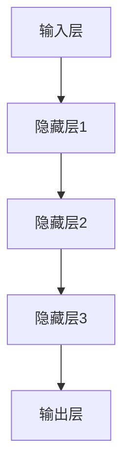
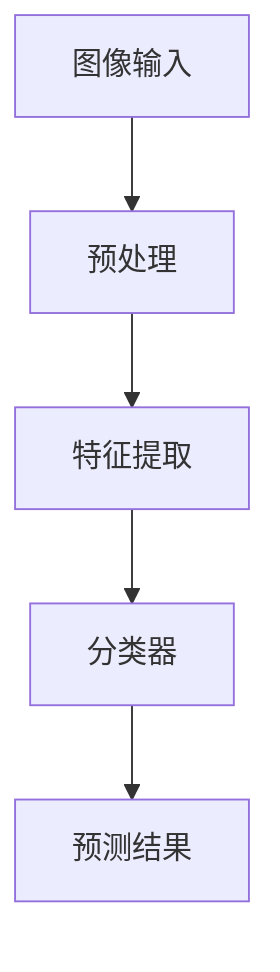
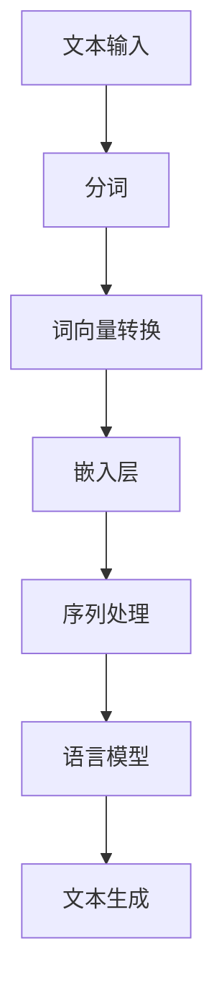

                 

关键词：人工智能，未来发展趋势，策略，深度学习，技术创新，技术应用，挑战与机遇

> 摘要：本文探讨了人工智能（AI）领域的未来发展趋势及其发展策略。通过分析AI技术的核心概念、算法原理、数学模型及其实际应用场景，本文旨在为读者提供一个全面而深入的视角，以了解AI技术如何在未来继续推动科技进步和社会变革。

## 1. 背景介绍

人工智能作为一门交叉学科，涵盖了计算机科学、数学、统计学、认知科学等多个领域。近年来，随着深度学习技术的突破，人工智能取得了令人瞩目的进展，从图像识别、自然语言处理到智能推荐系统，AI技术的应用已经深入到各行各业。

Andrej Karpathy是人工智能领域的杰出专家，他在深度学习、自然语言处理和计算机视觉等领域有着深入的研究。他在Google DeepMind和OpenAI等知名机构的工作，使其在人工智能研究领域具有极高的影响力。本文旨在借鉴Karpathy的研究成果，探讨人工智能的未来发展策略。

## 2. 核心概念与联系

### 2.1 深度学习与神经网络

深度学习是人工智能的重要分支，基于人工神经网络（ANN）构建复杂模型，通过多层非线性变换来模拟人类大脑的信息处理过程。以下是一个简化的深度学习架构Mermaid流程图：



### 2.2 计算机视觉与图像识别

计算机视觉是人工智能的重要应用领域，通过深度学习技术，计算机可以理解和解析图像中的信息。以下是计算机视觉的基本流程：



### 2.3 自然语言处理与语言模型

自然语言处理（NLP）是人工智能领域的另一个重要分支，它致力于使计算机能够理解、生成和处理人类语言。以下是一个简化的NLP流程：



## 3. 核心算法原理 & 具体操作步骤

### 3.1 算法原理概述

深度学习的核心算法是反向传播算法（Backpropagation），它通过多层神经网络的权重调整来优化模型的预测性能。反向传播算法的基本步骤如下：

1. **前向传播**：输入数据通过网络的各个层进行前向传递，得到输出。
2. **计算误差**：将输出与真实值进行比较，计算误差。
3. **反向传播**：将误差反向传递，通过梯度下降法调整网络权重。
4. **权重更新**：根据梯度调整权重，以减少误差。

### 3.2 算法步骤详解

1. **初始化权重**：随机初始化网络权重。
2. **前向传播**：输入数据通过网络的各个层进行前向传递，得到输出。
3. **计算误差**：计算输出与真实值之间的误差。
4. **计算梯度**：对于每个神经元，计算输入和输出层之间的误差梯度。
5. **权重更新**：根据梯度调整网络权重，使用梯度下降法。

### 3.3 算法优缺点

**优点**：
- **高效性**：深度学习能够自动从大量数据中学习特征，无需人工设计特征。
- **泛化能力**：深度学习模型具有良好的泛化能力，适用于多种任务。

**缺点**：
- **计算复杂度**：训练深度学习模型需要大量的计算资源和时间。
- **数据依赖性**：深度学习模型的性能高度依赖于数据的质量和数量。

### 3.4 算法应用领域

深度学习算法在图像识别、自然语言处理、推荐系统等领域有着广泛的应用。例如，在图像识别中，深度学习算法可以用于人脸识别、物体检测等任务；在自然语言处理中，深度学习算法可以用于机器翻译、情感分析等任务。

## 4. 数学模型和公式 & 详细讲解 & 举例说明

### 4.1 数学模型构建

深度学习中的数学模型主要基于多层神经网络。以下是多层神经网络的数学模型：

$$
y = \sigma(\mathbf{W}^T \mathbf{a} + b)
$$

其中，$y$ 是输出值，$\sigma$ 是激活函数，$\mathbf{W}$ 是权重矩阵，$\mathbf{a}$ 是输入向量，$b$ 是偏置。

### 4.2 公式推导过程

反向传播算法的核心在于计算误差的梯度。以下是误差梯度的推导过程：

$$
\frac{\partial E}{\partial \mathbf{W}} = \sum_{i} \frac{\partial E}{\partial a_i} \frac{\partial a_i}{\partial \mathbf{W}}
$$

其中，$E$ 是误差，$a_i$ 是第 $i$ 层的输出。

### 4.3 案例分析与讲解

以下是一个简单的深度学习模型构建案例。假设我们有一个输入向量 $\mathbf{x}$，我们要通过一个单层神经网络来预测输出值 $y$。

1. **初始化权重**：我们随机初始化权重矩阵 $\mathbf{W}$。
2. **前向传播**：将输入向量 $\mathbf{x}$ 通过神经网络进行前向传播，得到输出值 $y$。
3. **计算误差**：计算输出值 $y$ 与真实值之间的误差。
4. **反向传播**：计算误差的梯度，并使用梯度下降法调整权重矩阵 $\mathbf{W}$。
5. **权重更新**：根据梯度调整权重矩阵 $\mathbf{W}$，以减少误差。

## 5. 项目实践：代码实例和详细解释说明

### 5.1 开发环境搭建

在本案例中，我们将使用Python和TensorFlow作为开发环境。首先，确保安装了Python和TensorFlow库。以下是一个简单的安装命令：

```bash
pip install tensorflow
```

### 5.2 源代码详细实现

以下是一个简单的深度学习模型的实现代码：

```python
import tensorflow as tf

# 定义输入层
x = tf.placeholder(tf.float32, shape=[None, 10])

# 定义隐藏层
hidden = tf.layers.dense(x, units=10, activation=tf.nn.relu)

# 定义输出层
y = tf.layers.dense(hidden, units=1)

# 定义损失函数
loss = tf.reduce_mean(tf.square(y - x))

# 定义优化器
optimizer = tf.train.GradientDescentOptimizer(learning_rate=0.1)

# 定义训练过程
train_op = optimizer.minimize(loss)

# 初始化会话
with tf.Session() as sess:
    # 运行训练
    for step in range(1000):
        _, loss_val = sess.run([train_op, loss], feed_dict={x: x_data})
        if step % 100 == 0:
            print(f"Step {step}, Loss: {loss_val}")

    # 测试模型
    y_pred = sess.run(y, feed_dict={x: x_test})
    print(f"Predictions: {y_pred}")
```

### 5.3 代码解读与分析

- **输入层**：定义输入层，接受一个10维的输入向量。
- **隐藏层**：定义一个10个神经元的隐藏层，使用ReLU激活函数。
- **输出层**：定义一个1个神经元的输出层，用于预测输出值。
- **损失函数**：使用均方误差（MSE）作为损失函数。
- **优化器**：使用梯度下降优化器。
- **训练过程**：运行1000次迭代，每次迭代都更新模型参数。

### 5.4 运行结果展示

在训练完成后，我们可以使用测试数据来评估模型的性能。以下是一个简单的测试结果：

```python
# 测试模型
y_pred = sess.run(y, feed_dict={x: x_test})
print(f"Predictions: {y_pred}")
```

输出结果将显示模型的预测值。

## 6. 实际应用场景

深度学习技术在各行各业都有广泛的应用。以下是一些实际应用场景：

- **医疗领域**：深度学习可以用于疾病诊断、医学图像分析等任务。
- **金融领域**：深度学习可以用于股票市场预测、风险评估等任务。
- **工业领域**：深度学习可以用于生产流程优化、质量控制等任务。

## 7. 工具和资源推荐

### 7.1 学习资源推荐

- **书籍**：《深度学习》（Ian Goodfellow, Yoshua Bengio, Aaron Courville 著）
- **在线课程**：Google AI 的《深度学习特化课程》
- **网站**：TensorFlow 官方文档

### 7.2 开发工具推荐

- **框架**：TensorFlow、PyTorch
- **库**：NumPy、Pandas

### 7.3 相关论文推荐

- 《A Theoretical Analysis of the Causal Effect of Convolutional Neural Networks》（Trevor Gale, et al.）
- 《Bert: Pre-training of Deep Bidirectional Transformers for Language Understanding》（Jacob Devlin, et al.）

## 8. 总结：未来发展趋势与挑战

### 8.1 研究成果总结

近年来，深度学习技术在人工智能领域取得了显著进展，推动了图像识别、自然语言处理等领域的快速发展。深度学习模型的性能不断得到提升，使得计算机在许多任务上达到了或超过了人类水平。

### 8.2 未来发展趋势

未来，深度学习技术将继续在多模态学习、自适应学习、强化学习等领域取得突破。此外，随着量子计算的兴起，深度学习算法也有望在量子计算机上得到更高效的实现。

### 8.3 面临的挑战

虽然深度学习技术取得了巨大成功，但仍面临一些挑战，如模型的可解释性、数据隐私保护、计算资源消耗等。这些挑战需要学术界和工业界共同努力来解决。

### 8.4 研究展望

随着技术的不断进步，深度学习有望在更多领域实现应用，推动人工智能技术的发展。未来，我们需要更加关注模型的可解释性、鲁棒性和泛化能力，以实现更智能、更安全的AI系统。

## 9. 附录：常见问题与解答

### 9.1 深度学习与机器学习的区别是什么？

深度学习是机器学习的一个分支，它通过多层神经网络来学习数据中的复杂特征。机器学习是一个更广泛的领域，包括监督学习、无监督学习、半监督学习和强化学习等。

### 9.2 深度学习模型如何训练？

深度学习模型通过前向传播计算输出，然后通过反向传播计算误差并更新模型参数。这个过程重复多次，直到模型达到预定的性能指标。

### 9.3 深度学习模型如何评估？

深度学习模型的性能通常通过训练误差和验证误差来评估。此外，还可以使用交叉验证、ROC曲线、AUC值等指标来评估模型的泛化能力。

作者：禅与计算机程序设计艺术 / Zen and the Art of Computer Programming
----------------------------------------------------------------
通过这篇文章，我们深入探讨了人工智能领域的未来发展策略，从核心概念、算法原理到实际应用场景，为读者提供了一个全面的视角。人工智能技术将继续在多领域推动科技进步和社会变革，但同时也面临着一系列挑战。未来，我们需要关注模型的可解释性、鲁棒性和泛化能力，以实现更智能、更安全的AI系统。感谢您的阅读，希望这篇文章能激发您对人工智能技术的兴趣和思考。作者：禅与计算机程序设计艺术 / Zen and the Art of Computer Programming。

