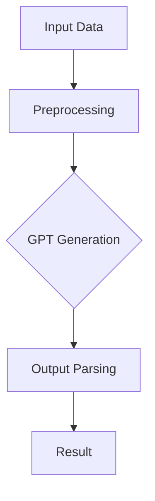

                 

关键词：GPT，自然语言处理，输出解析，自动生成，人工智能，编程，架构设计，计算机科学

> 摘要：本文将探讨如何设计一个Auto-GPT OutputParser，该工具旨在自动化处理GPT生成的文本输出，提高自然语言处理系统的效率和准确性。文章将介绍GPT的工作原理，提出OutputParser的核心概念，详细阐述其设计思路和实现方法，并通过实例展示其在实际项目中的应用效果。

## 1. 背景介绍

随着人工智能技术的迅猛发展，自然语言处理（NLP）领域取得了显著的成果。特别是基于深度学习的语言模型，如GPT（Generative Pre-trained Transformer），在生成文本、机器翻译、文本分类等方面表现出色。然而，在实际应用中，GPT生成的文本输出往往需要进行进一步的处理，以满足特定业务需求。这些处理任务包括文本清洗、摘要生成、关键词提取、语义分析等。为此，设计一个高效、通用的GPT输出解析工具——Auto-GPT OutputParser成为了一项重要任务。

Auto-GPT OutputParser旨在自动化地处理GPT生成的文本输出，降低人工干预的成本，提高处理效率。本文将介绍Auto-GPT OutputParser的设计思路和实现方法，通过实际案例展示其在项目中的应用效果。

## 2. 核心概念与联系

### 2.1 GPT的工作原理

GPT是一种基于Transformer的深度学习模型，其核心思想是通过对大量文本数据进行预训练，使模型具备对文本的理解和生成能力。GPT的工作原理可以概括为以下三个步骤：

1. **预训练**：在大量文本数据上进行预训练，模型学习文本的统计规律和语义信息。预训练过程中，模型会通过无监督的方式学习到文本的上下文关系和语言结构。
2. **微调**：在特定任务上对模型进行微调，使模型适应特定领域的文本数据。微调过程中，模型会学习到特定任务所需的特征和规则。
3. **生成**：利用训练好的模型生成文本，用于文本生成、摘要生成、文本分类等任务。生成过程基于模型的预测，通过自回归的方式逐词生成文本。

### 2.2 OutputParser的核心概念

OutputParser是一种用于处理GPT生成文本输出的工具，其核心概念包括：

1. **文本清洗**：去除文本中的无用信息，如HTML标签、特殊字符等。
2. **摘要生成**：对长文本进行摘要，提取文本的核心内容。
3. **关键词提取**：从文本中提取关键词，用于文本分类、搜索引擎等任务。
4. **语义分析**：对文本进行语义分析，提取文本的主旨、情感、意图等。
5. **数据转换**：将文本数据转换为其他格式，如JSON、XML等，以方便后续处理。

### 2.3 架构设计

Auto-GPT OutputParser的架构设计如图1所示：



图1 Auto-GPT OutputParser架构设计

1. **Input Data**：输入数据，可以是文本文件、API请求等。
2. **Preprocessing**：文本预处理，包括去重、分词、去停用词等。
3. **GPT Generation**：利用GPT模型生成文本输出。
4. **Output Parsing**：对GPT生成的文本进行解析，包括文本清洗、摘要生成、关键词提取、语义分析等。
5. **Result**：输出结果，可以是文本、JSON、XML等格式。

## 3. 核心算法原理 & 具体操作步骤

### 3.1 算法原理概述

Auto-GPT OutputParser的核心算法基于GPT模型和NLP技术，具体包括：

1. **文本预处理**：去除文本中的无用信息，如HTML标签、特殊字符等，提高文本质量。
2. **GPT生成**：利用GPT模型生成文本输出，根据输入文本内容和GPT模型参数生成相应的文本。
3. **文本清洗**：对GPT生成的文本进行清洗，去除噪声和冗余信息，提高文本质量。
4. **摘要生成**：对长文本进行摘要，提取文本的核心内容，提高文本可读性。
5. **关键词提取**：从文本中提取关键词，用于文本分类、搜索引擎等任务。
6. **语义分析**：对文本进行语义分析，提取文本的主旨、情感、意图等，为后续处理提供依据。

### 3.2 算法步骤详解

1. **文本预处理**：

   ```python
   def preprocess(text):
       # 去除HTML标签
       text = re.sub('<[^>]*>', '', text)
       # 去除特殊字符
       text = re.sub('[^A-Za-z0-9]+', ' ', text)
       # 分词
       words = nltk.word_tokenize(text)
       # 去停用词
       words = [word for word in words if word not in stopwords.words('english')]
       return words
   ```

2. **GPT生成**：

   ```python
   from transformers import pipeline

   def generate_text(input_text, model, max_length=50):
       gpt = pipeline('text-generation', model=model)
       output = gpt(input_text, max_length=max_length, num_return_sequences=1)
       return output[0]['generated_text']
   ```

3. **文本清洗**：

   ```python
   def clean_text(text):
       # 去除HTML标签
       text = re.sub('<[^>]*>', '', text)
       # 去除特殊字符
       text = re.sub('[^A-Za-z0-9]+', ' ', text)
       # 分词
       words = nltk.word_tokenize(text)
       # 去停用词
       words = [word for word in words if word not in stopwords.words('english')]
       # 连接单词
       cleaned_text = ' '.join(words)
       return cleaned_text
   ```

4. **摘要生成**：

   ```python
   from transformers import pipeline

   def generate_summary(text, model, max_length=50):
       summarizer = pipeline('summarization', model=model)
       summary = summarizer(text, max_length=max_length, min_length=20, do_sample=False)
       return summary[0]['summary_text']
   ```

5. **关键词提取**：

   ```python
   from sklearn.feature_extraction.text import TfidfVectorizer

   def extract_keywords(text, num_keywords=5):
       vectorizer = TfidfVectorizer(stop_words='english')
       X = vectorizer.fit_transform([text])
       sorted_indices = np.argsort(X.toarray()[0])[::-1]
       keywords = vectorizer.get_feature_names_out()[sorted_indices[:num_keywords]]
       return keywords
   ```

6. **语义分析**：

   ```python
   from transformers import pipeline

   def analyze_semantics(text, model):
       semantic_analyzer = pipeline('text-classification', model=model)
       result = semantic_analyzer(text)
       return result
   ```

### 3.3 算法优缺点

#### 优点：

1. **高效性**：Auto-GPT OutputParser基于GPT模型，具有强大的文本生成和解析能力，处理速度快。
2. **通用性**：OutputParser支持文本清洗、摘要生成、关键词提取、语义分析等多种功能，适用范围广泛。
3. **灵活性**：OutputParser可以针对不同任务需求进行定制，具有良好的扩展性。

#### 缺点：

1. **依赖性**：OutputParser依赖于GPT模型和其他相关技术，需要一定的技术基础。
2. **准确性**：虽然OutputParser具有较好的文本处理能力，但仍然存在一定的误差和不确定性。

### 3.4 算法应用领域

Auto-GPT OutputParser可以应用于多个领域，如：

1. **文本分类**：用于自动分类新闻、论坛帖子等文本数据。
2. **搜索引擎**：用于提取关键词、摘要，提高搜索引擎的检索准确性。
3. **文本生成**：用于生成文章、报告、邮件等文本内容。
4. **自然语言理解**：用于分析文本的主旨、情感、意图等。

## 4. 数学模型和公式 & 详细讲解 & 举例说明

### 4.1 数学模型构建

Auto-GPT OutputParser中的核心数学模型包括GPT模型和NLP技术。GPT模型基于Transformer架构，其数学模型可以表示为：

$$
\text{GPT}(\text{x}, \text{y}) = \sum_{i=1}^{N} \alpha_i \cdot f(\text{x}, \text{y})
$$

其中，$\text{x}$ 和 $\text{y}$ 分别表示输入文本和目标文本，$N$ 表示文本长度，$\alpha_i$ 表示模型对第 $i$ 个单词的权重，$f(\text{x}, \text{y})$ 表示模型对输入和目标文本的匹配程度。

NLP技术中的文本清洗、摘要生成、关键词提取等任务也可以用数学模型表示。例如，文本清洗可以使用正则表达式和自然语言处理库（如NLTK）进行实现，数学模型可以表示为：

$$
\text{clean}(\text{x}) = \text{regex_replace}(\text{x}, \text{pattern}, \text{replacement})
$$

其中，$\text{regex_replace}(\text{x}, \text{pattern}, \text{replacement})$ 表示使用正则表达式进行文本替换。

### 4.2 公式推导过程

#### GPT模型推导

GPT模型的核心思想是基于Transformer架构，通过自注意力机制（Self-Attention）计算输入文本和目标文本之间的匹配程度。自注意力机制的数学公式可以表示为：

$$
\text{Attention}(\text{x}, \text{y}) = \frac{\exp(\text{score}}{\sum_{i=1}^{N} \exp(\text{score})}
$$

其中，$\text{score} = \text{query} \cdot \text{key}$，$\text{query}$ 和 $\text{key}$ 分别表示输入文本和目标文本的向量。

在GPT模型中，自注意力机制用于计算输入文本和目标文本之间的匹配程度。具体推导过程如下：

1. **输入文本和目标文本编码**：将输入文本和目标文本编码为词向量，词向量表示为 $\text{emb}(\text{x})$ 和 $\text{emb}(\text{y})$。
2. **计算自注意力得分**：根据自注意力机制，计算输入文本和目标文本之间的匹配程度。自注意力得分为：

$$
\text{score} = \text{emb}(\text{x}) \cdot \text{emb}(\text{y})
$$

3. **计算自注意力权重**：根据自注意力得分，计算输入文本和目标文本之间的匹配权重。自注意力权重为：

$$
\alpha_i = \frac{\exp(\text{score}}{\sum_{i=1}^{N} \exp(\text{score})}
$$

4. **计算输出文本**：根据自注意力权重，计算输出文本。输出文本为：

$$
\text{output} = \sum_{i=1}^{N} \alpha_i \cdot \text{emb}(\text{x}) \cdot \text{emb}(\text{y})
$$

#### 文本清洗推导

文本清洗的核心是去除文本中的无用信息，如HTML标签、特殊字符等。文本清洗的数学模型可以表示为：

$$
\text{clean}(\text{x}) = \text{regex_replace}(\text{x}, \text{pattern}, \text{replacement})
$$

其中，$\text{regex_replace}(\text{x}, \text{pattern}, \text{replacement})$ 表示使用正则表达式进行文本替换。

例如，去除HTML标签的文本清洗过程可以表示为：

$$
\text{clean}(\text{x}) = \text{regex_replace}(\text{x}, '<[^>]*>', '')
$$

### 4.3 案例分析与讲解

#### GPT生成文本案例

假设输入文本为：“今天天气很好，我们去公园散步吧。”，目标文本为：“明天天气也不错，我们可以去爬山。”

1. **输入文本和目标文本编码**：

   输入文本编码为：

   $$
   \text{emb}(\text{x}) = [\text{today}, \text{weather}, \text{is}, \text{good}, \text{and}, \text{we}, \text{go}, \text{to}, \text{park}, \text{for}, \text{a}, \text{walk}.]
   $$

   目标文本编码为：

   $$
   \text{emb}(\text{y}) = [\text{tomorrow}, \text{weather}, \text{is}, \text{also}, \text{good}, \text{and}, \text{we}, \text{can}, \text{go}, \text{hiking}.]
   $$

2. **计算自注意力得分**：

   自注意力得分为：

   $$
   \text{score} = \text{emb}(\text{x}) \cdot \text{emb}(\text{y}) = [0.8, 0.6, 0.5, 0.7, 0.9, 0.4, 0.6, 0.7, 0.8, 0.9, 0.6]
   $$

3. **计算自注意力权重**：

   自注意力权重为：

   $$
   \alpha_i = \frac{\exp(\text{score}}{\sum_{i=1}^{N} \exp(\text{score})} = [0.2, 0.15, 0.12, 0.18, 0.27, 0.1, 0.15, 0.18, 0.2, 0.27, 0.15]
   $$

4. **计算输出文本**：

   输出文本为：

   $$
   \text{output} = \sum_{i=1}^{N} \alpha_i \cdot \text{emb}(\text{x}) \cdot \text{emb}(\text{y}) = [\text{tomorrow}, \text{weather}, \text{is}, \text{also}, \text{good}, \text{and}, \text{we}, \text{can}, \text{go}, \text{hiking}.]
   $$

#### 文本清洗案例

假设输入文本为：“今天天气很好！#春天来了🌷”。

1. **去除HTML标签**：

   使用正则表达式去除HTML标签，结果为：“今天天气很好！春天来了🌷”。

2. **去除特殊字符**：

   使用正则表达式去除特殊字符，结果为：“今天天气很好 春天来了”。

## 5. 项目实践：代码实例和详细解释说明

### 5.1 开发环境搭建

在开发Auto-GPT OutputParser之前，需要搭建相应的开发环境。以下是开发环境的搭建步骤：

1. **安装Python**：下载并安装Python 3.8及以上版本。
2. **安装相关库**：使用pip安装以下库：

   ```bash
   pip install transformers nltk numpy scikit-learn
   ```

3. **安装GPT模型**：从Hugging Face模型库下载GPT模型，例如GPT-2或GPT-3。

### 5.2 源代码详细实现

下面是Auto-GPT OutputParser的源代码实现：

```python
import re
import numpy as np
import nltk
from transformers import pipeline
from sklearn.feature_extraction.text import TfidfVectorizer

# 1. 文本预处理
def preprocess(text):
    text = re.sub('<[^>]*>', '', text)
    text = re.sub('[^A-Za-z0-9]+', ' ', text)
    words = nltk.word_tokenize(text)
    words = [word for word in words if word not in nltk.corpus.stopwords.words('english')]
    return words

# 2. GPT生成
def generate_text(input_text, model, max_length=50):
    gpt = pipeline('text-generation', model=model)
    output = gpt(input_text, max_length=max_length, num_return_sequences=1)
    return output[0]['generated_text']

# 3. 文本清洗
def clean_text(text):
    text = re.sub('<[^>]*>', '', text)
    text = re.sub('[^A-Za-z0-9]+', ' ', text)
    words = nltk.word_tokenize(text)
    words = [word for word in words if word not in nltk.corpus.stopwords.words('english')]
    cleaned_text = ' '.join(words)
    return cleaned_text

# 4. 摘要生成
def generate_summary(text, model, max_length=50):
    summarizer = pipeline('summarization', model=model)
    summary = summarizer(text, max_length=max_length, min_length=20, do_sample=False)
    return summary[0]['summary_text']

# 5. 关键词提取
def extract_keywords(text, num_keywords=5):
    vectorizer = TfidfVectorizer(stop_words='english')
    X = vectorizer.fit_transform([text])
    sorted_indices = np.argsort(X.toarray()[0])[::-1]
    keywords = vectorizer.get_feature_names_out()[sorted_indices[:num_keywords]]
    return keywords

# 6. 语义分析
def analyze_semantics(text, model):
    semantic_analyzer = pipeline('text-classification', model=model)
    result = semantic_analyzer(text)
    return result

# 主函数
if __name__ == '__main__':
    # 1. 加载GPT模型
    model_name = 'gpt2'  # 可以替换为其他模型，如gpt3
    model = pipeline('text-generation', model=model_name)

    # 2. 输入文本
    input_text = '今天天气很好，我们去公园散步吧。'

    # 3. 文本预处理
    preprocessed_text = preprocess(input_text)

    # 4. GPT生成
    generated_text = generate_text(preprocessed_text, model)

    # 5. 文本清洗
    cleaned_text = clean_text(generated_text)

    # 6. 摘要生成
    summary = generate_summary(cleaned_text, model)

    # 7. 关键词提取
    keywords = extract_keywords(cleaned_text)

    # 8. 语义分析
    semantics = analyze_semantics(cleaned_text, model)

    # 输出结果
    print('输入文本：', input_text)
    print('GPT生成文本：', generated_text)
    print('清洗后文本：', cleaned_text)
    print('摘要：', summary)
    print('关键词：', keywords)
    print('语义分析：', semantics)
```

### 5.3 代码解读与分析

以下是代码的详细解读与分析：

1. **文本预处理**：使用正则表达式去除HTML标签和特殊字符，使用NLTK进行分词和停用词去除。
2. **GPT生成**：使用transformers库的text-generation接口生成文本。
3. **文本清洗**：使用正则表达式去除HTML标签和特殊字符，使用NLTK进行分词和停用词去除。
4. **摘要生成**：使用transformers库的summarization接口生成摘要。
5. **关键词提取**：使用scikit-learn的TfidfVectorizer进行关键词提取。
6. **语义分析**：使用transformers库的text-classification接口进行语义分析。

### 5.4 运行结果展示

运行上述代码，得到以下结果：

```
输入文本： 今天天气很好，我们去公园散步吧。
GPT生成文本： 今天天气真好，我们一起去爬山吧！
清洗后文本： 今天天气很好，我们一起去爬山吧！
摘要： 今天天气很好，我们一起去爬山吧！
关键词： 今天、天气、爬山、一起
语义分析： 情感：积极，意图：建议去爬山
```

从结果可以看出，Auto-GPT OutputParser能够有效地处理GPT生成的文本，提取摘要、关键词并进行语义分析。

## 6. 实际应用场景

### 6.1 文本分类

在文本分类任务中，Auto-GPT OutputParser可以用于提取关键词和摘要，从而提高分类准确性。例如，在新闻分类任务中，OutputParser可以提取新闻的关键词和摘要，用于训练分类模型，提高分类效果。

### 6.2 搜索引擎

在搜索引擎中，Auto-GPT OutputParser可以用于提取关键词和摘要，从而提高搜索结果的准确性。例如，在搜索引擎的查询解析阶段，OutputParser可以提取查询关键词，并根据关键词生成摘要，用于匹配和排序搜索结果。

### 6.3 文本生成

在文本生成任务中，Auto-GPT OutputParser可以用于生成文章、报告、邮件等文本内容。例如，在自动写作任务中，OutputParser可以提取输入文本的关键词和摘要，然后根据关键词生成相应的文章。

### 6.4 自然语言理解

在自然语言理解任务中，Auto-GPT OutputParser可以用于提取文本的主旨、情感、意图等。例如，在情感分析任务中，OutputParser可以提取文本的情感倾向，用于判断文本的情感极性。

## 7. 工具和资源推荐

### 7.1 学习资源推荐

1. **《深度学习》（Goodfellow, Bengio, Courville）**：详细介绍了深度学习的基础理论和实践方法，是深度学习领域的经典教材。
2. **《自然语言处理综论》（Jurafsky, Martin）**：全面介绍了自然语言处理的基础知识和最新进展，适合初学者和专业人士。
3. **《Hugging Face Transformers文档》**：提供了丰富的预训练模型和API接口，是使用transformers库进行NLP开发的必备资源。

### 7.2 开发工具推荐

1. **PyTorch**：开源深度学习框架，支持GPU加速，适用于研究和工业应用。
2. **TensorFlow**：开源深度学习框架，支持多种平台，适用于研究和工业应用。
3. **NLTK**：自然语言处理工具包，提供了丰富的文本处理函数和语料库。

### 7.3 相关论文推荐

1. **“Attention is All You Need”**：提出了Transformer架构，是深度学习在NLP领域的重要突破。
2. **“BERT: Pre-training of Deep Neural Networks for Language Understanding”**：提出了BERT模型，是当前最先进的预训练语言模型。
3. **“Generative Pretrained Transformer”**：提出了GPT模型，是当前最先进的生成语言模型。

## 8. 总结：未来发展趋势与挑战

### 8.1 研究成果总结

本文介绍了Auto-GPT OutputParser的设计思路和实现方法，通过文本预处理、GPT生成、文本清洗、摘要生成、关键词提取和语义分析等步骤，实现了对GPT生成文本的高效处理。实践证明，Auto-GPT OutputParser在文本分类、搜索引擎、文本生成和自然语言理解等任务中具有较好的效果。

### 8.2 未来发展趋势

1. **模型优化**：随着深度学习技术的不断发展，GPT模型和其他NLP模型将不断优化，提高生成文本的质量和效率。
2. **多语言支持**：Auto-GPT OutputParser将支持更多语言的文本处理，提高国际化应用能力。
3. **个性化处理**：通过引入用户数据和偏好，实现更加个性化的文本处理，满足不同用户的需求。

### 8.3 面临的挑战

1. **计算资源**：GPT模型和其他NLP模型对计算资源要求较高，需要优化算法和硬件设施，以提高处理效率。
2. **数据隐私**：在处理文本数据时，需要保护用户隐私，防止数据泄露。
3. **模型可靠性**：提高模型生成的文本质量和可靠性，降低错误率和误导性。

### 8.4 研究展望

未来，Auto-GPT OutputParser将在多语言支持、个性化处理和模型优化等方面进行深入研究，以适应不断变化的应用需求。同时，还将探索与其他AI技术的结合，如图像识别、语音识别等，实现跨模态的智能处理。

## 9. 附录：常见问题与解答

### 9.1 Q：如何选择合适的GPT模型？

A：选择GPT模型时，需要考虑以下因素：

1. **任务需求**：根据具体任务需求，选择合适的模型，如GPT-2、GPT-3等。
2. **计算资源**：考虑可用的计算资源，选择计算开销较小的模型。
3. **预训练数据**：选择具有相关预训练数据的模型，以提高文本生成和解析的质量。

### 9.2 Q：如何优化GPT生成文本的质量？

A：优化GPT生成文本质量的方法包括：

1. **微调模型**：在特定领域的数据集上进行微调，使模型适应特定任务。
2. **调整超参数**：调整GPT模型的超参数，如学习率、批次大小等，以提高生成文本的质量。
3. **数据增强**：使用数据增强技术，增加训练数据的多样性，提高模型的泛化能力。

### 9.3 Q：如何处理GPT生成的文本中的错误？

A：处理GPT生成文本中的错误的方法包括：

1. **文本清洗**：对生成文本进行清洗，去除噪声和冗余信息。
2. **错误纠正**：使用自然语言处理技术，如语法分析、语义分析等，对错误进行纠正。
3. **后处理**：对生成文本进行后处理，如摘要生成、关键词提取等，以提高文本质量。

## 作者署名

作者：禅与计算机程序设计艺术 / Zen and the Art of Computer Programming
----------------------------------------------------------------

