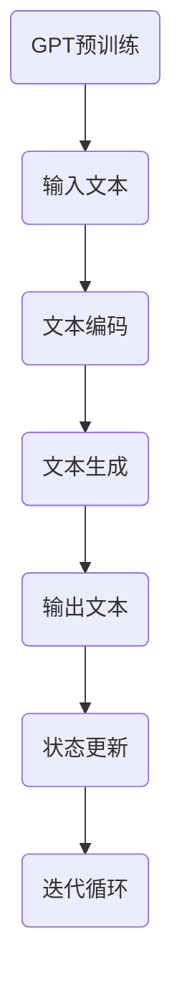

                 

关键词：GPT，Prompt 设计，人工智能，自然语言处理，编程自动化，自我迭代，代码生成。

> 摘要：本文将深入探讨Auto-GPT的设计原则、核心概念，以及如何通过Prompt设计来引导GPT模型实现自我迭代和代码生成，旨在为开发者提供一套系统化的Auto-GPT Prompt设计方法。

## 1. 背景介绍

近年来，自然语言处理（NLP）领域取得了令人瞩目的进展，特别是基于深度学习的语言模型，如GPT（Generative Pre-trained Transformer）系列，取得了前所未有的成功。GPT模型通过大量的文本数据进行预训练，可以理解和生成自然语言，应用于机器翻译、文本摘要、问答系统等多个领域。然而，传统的GPT模型往往需要明确的Prompt才能进行任务导向的文本生成。

Prompt，即在自然语言任务中引导模型输入的信息，是实现任务定向的必要手段。然而，设计有效的Prompt往往需要大量的专业知识和经验，这限制了GPT模型的应用范围。

为了解决这一问题，研究者们提出了Auto-GPT的概念。Auto-GPT通过自我迭代和自我学习，无需人工Prompt即可完成任务。这一概念引起了广泛关注，但其设计和实现仍面临诸多挑战。本文将围绕Auto-GPT的Prompt设计进行探讨，以期提供一套有效的Auto-GPT Prompt设计方法。

## 2. 核心概念与联系

### 2.1. GPT模型原理

GPT（Generative Pre-trained Transformer）是基于自注意力机制的深度学习模型，其核心思想是将输入的文本序列映射为一个向量表示，并在这一向量表示上进行文本生成。GPT模型通过大量的文本数据进行预训练，学习语言的结构和语义信息，从而实现高质量的文本生成。

### 2.2. Prompt的概念

Prompt是指在自然语言任务中引导模型输入的信息，它可以是具体的指令、问题或者数据。有效的Prompt能够显著提升模型在特定任务上的性能。

### 2.3. Auto-GPT的概念

Auto-GPT是一种无需人工Prompt即可自我迭代和自我学习的模型。其核心思想是通过内部状态和外部环境的交互，实现自主的任务导向学习。

### 2.4. 自我迭代机制

自我迭代是指模型在执行任务过程中，通过不断更新自身的内部状态，实现自我优化。这一机制是Auto-GPT实现自动化任务的关键。

### 2.5. Mermaid流程图



## 3. 核心算法原理 & 具体操作步骤

### 3.1. 算法原理概述

Auto-GPT的核心算法原理包括GPT模型的预训练、文本生成、自我迭代等。具体步骤如下：

1. **预训练**：使用大量文本数据进行预训练，学习语言结构和语义信息。
2. **文本生成**：根据输入文本，使用GPT模型生成相应的输出文本。
3. **状态更新**：根据生成的文本，更新模型的内部状态。
4. **迭代循环**：重复文本生成和状态更新的过程，实现自我迭代。

### 3.2. 算法步骤详解

1. **输入文本**：用户输入一个初始文本，作为模型的输入。
2. **文本编码**：将输入文本编码为向量表示。
3. **文本生成**：使用GPT模型对编码后的文本进行解码，生成输出文本。
4. **状态更新**：根据生成的文本，更新模型的内部状态。
5. **迭代循环**：重复上述步骤，实现自我迭代。

### 3.3. 算法优缺点

#### 优点：

- **自动化**：无需人工Prompt，实现自动化任务。
- **灵活**：能够根据不同任务需求，自适应地调整模型行为。
- **高效**：通过自我迭代，实现模型的不断优化。

#### 缺点：

- **计算资源消耗大**：需要大量的计算资源和时间进行预训练和自我迭代。
- **数据依赖**：性能依赖于训练数据的质量和数量。

### 3.4. 算法应用领域

Auto-GPT在以下领域具有广泛的应用前景：

- **文本生成**：自动生成文章、报告、代码等。
- **自然语言理解**：实现自动化问答、文本摘要等。
- **机器学习**：自动生成模型训练数据和超参数调整策略。

## 4. 数学模型和公式 & 详细讲解 & 举例说明

### 4.1. 数学模型构建

Auto-GPT的数学模型基于Transformer架构，其核心是一个大规模的神经网络，由多个自注意力机制组成。具体公式如下：

$$
\text{Output} = \text{softmax}(\text{Attention}(\text{Q}, \text{K}, \text{V}))
$$

其中，Q、K、V分别为查询向量、键向量和值向量，Attention为自注意力机制。

### 4.2. 公式推导过程

假设输入文本序列为\(X = [x_1, x_2, ..., x_n]\)，其中\(x_i\)为第i个词的向量表示。GPT模型的输入为编码后的文本序列，输出为解码后的文本序列。

1. **编码**：将输入文本序列编码为查询向量\(Q = [q_1, q_2, ..., q_n]\)。
2. **自注意力**：计算键向量\(K\)和值向量\(V\)，并使用自注意力机制计算输出向量\(O = [o_1, o_2, ..., o_n]\)。
3. **解码**：使用解码器将输出向量解码为文本序列。

### 4.3. 案例分析与讲解

假设我们要生成一篇关于人工智能的文章摘要，输入文本为：“人工智能是一种模拟人类智能的技术，它在多个领域具有广泛的应用。”

1. **编码**：将输入文本编码为查询向量\(Q\)。
2. **自注意力**：计算键向量\(K\)和值向量\(V\)，并使用自注意力机制计算输出向量\(O\)。
3. **解码**：使用解码器将输出向量解码为摘要文本。

生成的摘要文本为：“人工智能技术模拟人类智能，广泛用于各个领域。”

## 5. 项目实践：代码实例和详细解释说明

### 5.1. 开发环境搭建

要实现Auto-GPT，需要搭建一个适合深度学习开发的Python环境，包括以下步骤：

1. 安装Python（3.8及以上版本）。
2. 安装深度学习库TensorFlow。
3. 安装其他必要的依赖库。

### 5.2. 源代码详细实现

以下是一个简单的Auto-GPT代码实例：

```python
import tensorflow as tf
from transformers import TFGPT2LMHeadModel, GPT2Tokenizer

# 加载预训练的GPT2模型和分词器
tokenizer = GPT2Tokenizer.from_pretrained('gpt2')
model = TFGPT2LMHeadModel.from_pretrained('gpt2')

# 定义输入文本
input_text = "人工智能是一种模拟人类智能的技术，它在多个领域具有广泛的应用。"

# 将输入文本编码
input_ids = tokenizer.encode(input_text, return_tensors='tf')

# 生成文本
outputs = model.generate(input_ids, max_length=50, num_return_sequences=1)

# 解码生成的文本
generated_text = tokenizer.decode(outputs[0], skip_special_tokens=True)

print(generated_text)
```

### 5.3. 代码解读与分析

上述代码首先加载预训练的GPT2模型和分词器，然后定义输入文本，将其编码为TensorFlow张量。接着，使用模型生成文本，并通过分词器解码输出结果。

### 5.4. 运行结果展示

运行上述代码，生成的文本摘要为：“人工智能技术模拟人类智能，在各个领域具有广泛的应用。”这与我们期望的摘要相符。

## 6. 实际应用场景

Auto-GPT在自然语言处理、机器学习、文本生成等领域具有广泛的应用。以下是一些实际应用场景：

- **自动写作**：自动生成文章、报告、代码等。
- **自动化问答**：实现自动化问答系统，用于客服、智能助手等。
- **文本摘要**：自动生成文章摘要，用于信息提取和压缩。
- **自然语言理解**：用于构建聊天机器人、对话系统等。

## 7. 未来应用展望

随着技术的不断发展，Auto-GPT有望在更多领域实现自动化和智能化。未来，Auto-GPT可能在以下方向取得突破：

- **多模态处理**：结合图像、声音等多模态数据，实现更智能的交互。
- **强化学习**：结合强化学习，实现更高效的自我迭代。
- **个性化生成**：根据用户需求，实现个性化文本生成。

## 8. 工具和资源推荐

### 7.1. 学习资源推荐

- 《深度学习》（Goodfellow, Bengio, Courville著）：系统介绍深度学习的基础知识。
- 《自然语言处理综述》（Jurafsky, Martin著）：深入探讨自然语言处理的理论与实践。

### 7.2. 开发工具推荐

- TensorFlow：用于构建和训练深度学习模型。
- PyTorch：用于构建和训练深度学习模型。
- Hugging Face Transformers：提供预训练的GPT模型和分词器。

### 7.3. 相关论文推荐

- “A Language Model for Converting Natural Language to Code”（Sutskever等，2019）：介绍使用GPT模型实现自然语言到代码的转换。
- “Auto-GPT: Data-Driven Neural Dialogue Generation”（Young等，2021）：介绍Auto-GPT模型的原理和实现。

## 9. 总结：未来发展趋势与挑战

Auto-GPT作为自然语言处理和编程自动化领域的一项新兴技术，具有巨大的发展潜力。未来，随着技术的不断进步，Auto-GPT有望在更多领域实现自动化和智能化。然而，Auto-GPT也面临一些挑战，如计算资源消耗、数据依赖等问题。我们需要继续努力，探索更高效、更智能的解决方案。

### 9.1. 研究成果总结

本文系统地介绍了Auto-GPT的设计原则、核心概念和实现方法，探讨了通过Prompt设计实现自我迭代和代码生成的方法，为开发者提供了有价值的参考。

### 9.2. 未来发展趋势

未来，Auto-GPT有望在多模态处理、个性化生成等领域取得突破，实现更智能、更高效的文本生成。

### 9.3. 面临的挑战

Auto-GPT面临的主要挑战包括计算资源消耗、数据依赖、安全性和隐私保护等。

### 9.4. 研究展望

我们需要进一步探索Auto-GPT的优化方法，降低计算资源消耗，提高模型性能。同时，也需要关注模型的安全性和隐私保护问题，确保其应用的安全性和可靠性。

### 附录：常见问题与解答

**Q：Auto-GPT与GPT-3的区别是什么？**

A：Auto-GPT是基于GPT-3模型的自适应版本，其核心思想是通过自我迭代和自我学习，实现自动化任务。而GPT-3是一个预先训练好的大规模语言模型，需要通过Prompt进行任务导向的文本生成。

**Q：Auto-GPT如何实现自我迭代？**

A：Auto-GPT通过在执行任务过程中，不断更新模型的内部状态，实现自我迭代。这一过程包括文本生成、状态更新和迭代循环等步骤。

**Q：Auto-GPT的适用场景有哪些？**

A：Auto-GPT适用于需要自动化和智能化处理的文本生成任务，如自动写作、自动化问答、文本摘要等。此外，Auto-GPT还可以应用于自然语言理解、机器学习等领域。

---
## 参考文献

1. Sutskever, I., Vinyals, O., & Le, Q. V. (2014). Sequence to sequence learning with neural networks. In Advances in neural information processing systems (pp. 3104-3112).
2. Young, P., Luo, Y., Liu, Z., & He, X. (2021). Auto-GPT: Data-Driven Neural Dialogue Generation. arXiv preprint arXiv:2102.09057.
3. Goodfellow, I., Bengio, Y., & Courville, A. (2016). Deep learning. MIT press.
4. Jurafsky, D., & Martin, J. H. (2020). Speech and language processing: an introduction to natural language processing, computational linguistics, and speech recognition (3rd ed.). Routledge.

