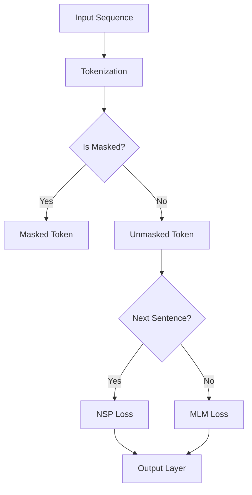

                 

 关键词：BERT, RoBERTa, 自然语言处理，预训练模型，深度学习

> 摘要：本文深入探讨了BERT（Bidirectional Encoder Representations from Transformers）和RoBERTa（A Robustly Optimized BERT Pretraining Approach）这两种自然语言处理预训练模型的原理、算法和实际应用。通过对比分析，揭示了各自的优势和不足，并展望了未来自然语言处理领域的发展趋势与挑战。

## 1. 背景介绍

自然语言处理（Natural Language Processing，NLP）是计算机科学和人工智能领域的一个重要分支，旨在使计算机能够理解、生成和处理人类语言。近年来，深度学习在NLP领域取得了显著进展，其中预训练模型尤为突出。

预训练模型是指在大量无标签语料上预先训练模型，然后通过微调适应特定任务。BERT和RoBERTa是两种流行的预训练模型，它们在多个NLP任务上取得了优异的性能，极大地推动了NLP的发展。

BERT是由Google AI在2018年提出的一种双向 Transformer 预训练模型，它通过预训练任务如Masked Language Model（MLM）和Next Sentence Prediction（NSP）来学习文本的深层语义表示。RoBERTa是在BERT的基础上进行改进的一种预训练模型，它在数据预处理、训练策略和模型架构等方面进行了优化，以进一步提升模型的性能。

## 2. 核心概念与联系

### 2.1. Transformer 模型

Transformer模型是由Google团队在2017年提出的一种基于自注意力机制的全卷积神经网络模型，它取代了传统的循环神经网络（RNN）和长短时记忆网络（LSTM），在机器翻译、文本生成等任务中表现出色。Transformer模型的核心是多头自注意力机制（Multi-Head Self-Attention），它通过计算不同位置之间的依赖关系来生成文本的语义表示。

### 2.2. BERT 模型

BERT模型是一种基于Transformer的预训练模型，它通过Masked Language Model（MLM）和Next Sentence Prediction（NSP）任务来预训练模型。MLM任务是在输入文本中随机遮盖一些单词，模型需要预测这些被遮盖的单词。NSP任务是在输入文本中随机选择两个句子，模型需要预测第二个句子是否在第一个句子之后。

### 2.3. RoBERTa 模型

RoBERTa是BERT的一个改进版本，它在数据预处理、训练策略和模型架构等方面进行了优化。RoBERTa使用了更丰富的语料库、更长的句子序列和更大的模型规模。此外，RoBERTa还取消了NSP任务，并将部分训练时间集中在MLM任务上。

### 2.4. Mermaid 流程图

以下是BERT模型的 Mermaid 流程图：



## 3. 核心算法原理 & 具体操作步骤

### 3.1. 算法原理概述

BERT和RoBERTa都是基于Transformer模型的预训练模型，它们通过两个预训练任务——Masked Language Model（MLM）和Next Sentence Prediction（NSP）——来学习文本的深层语义表示。

- **Masked Language Model（MLM）**：在输入文本中随机遮盖一些单词，模型需要预测这些被遮盖的单词。MLM任务可以帮助模型学习单词之间的依赖关系。
- **Next Sentence Prediction（NSP）**：在输入文本中随机选择两个句子，模型需要预测第二个句子是否在第一个句子之后。NSP任务可以帮助模型学习句子之间的逻辑关系。

### 3.2. 算法步骤详解

以下是BERT和RoBERTa的算法步骤详解：

- **BERT模型**：

1. **输入序列**：输入一个文本序列，如 "The quick brown fox jumps over the lazy dog"。
2. **分词**：将文本序列分成一个个单词或子词，如 ["The", "quick", "brown", "fox", "jumps", "over", "the", "lazy", "dog"]。
3. **Tokenization**：为每个单词或子词分配一个唯一的ID，并在输入序列的开头和结尾添加特殊标识符 [CLS] 和 [SEP]。
4. **Masking**：随机遮盖一些单词或子词，如将 "fox" 替换为 `[MASK]`。
5. **Next Sentence Prediction**：随机选择两个句子，如 "The quick brown fox" 和 "The dog runs quickly"。
6. **计算损失**：计算 MLM 损失和 NSP 损失，并通过反向传播更新模型参数。

- **RoBERTa模型**：

1. **输入序列**：输入一个文本序列，如 "The quick brown fox jumps over the lazy dog"。
2. **分词**：将文本序列分成一个个单词或子词，如 ["The", "quick", "brown", "fox", "jumps", "over", "the", "lazy", "dog"]。
3. **Tokenization**：为每个单词或子词分配一个唯一ID，并在输入序列的开头和结尾添加特殊标识符 [CLS] 和 [SEP]。
4. **Masking**：随机遮盖一些单词或子词，如将 "fox" 替换为 `[MASK]`。
5. **Next Sentence Prediction**：随机选择两个句子，如 "The quick brown fox" 和 "The dog runs quickly"。
6. **计算损失**：计算 MLM 损失，并通过反向传播更新模型参数。

### 3.3. 算法优缺点

- **BERT模型**：

  - 优点：BERT模型通过双向Transformer结构，可以同时考虑上下文信息，从而学习到更准确的文本表示。
  - 缺点：BERT模型的预训练需要大量计算资源和时间，且在处理长文本时性能下降。

- **RoBERTa模型**：

  - 优点：RoBERTa模型在数据预处理、训练策略和模型架构等方面进行了优化，从而在多个NLP任务上取得了更好的性能。
  - 缺点：RoBERTa模型在预训练过程中取消了NSP任务，可能导致模型在处理长文本时性能下降。

### 3.4. 算法应用领域

BERT和RoBERTa模型在多个NLP任务上取得了优异的性能，如文本分类、情感分析、机器翻译、问答系统等。以下是一些具体应用领域：

- **文本分类**：BERT和RoBERTa模型可以用于情感分析、新闻分类、垃圾邮件检测等任务。
- **机器翻译**：BERT和RoBERTa模型可以用于训练端到端的机器翻译模型，如英译中、中译英等。
- **问答系统**：BERT和RoBERTa模型可以用于构建基于BERT的问答系统，如Socratic、BERT-SQuAD等。

## 4. 数学模型和公式 & 详细讲解 & 举例说明

### 4.1. 数学模型构建

BERT和RoBERTa模型的数学模型主要基于Transformer模型，包括多头自注意力机制（Multi-Head Self-Attention）和前馈神经网络（Feedforward Neural Network）。

### 4.2. 公式推导过程

#### 4.2.1. 多头自注意力机制

多头自注意力机制的核心公式如下：

$$
\text{Attention}(Q, K, V) = \text{softmax}\left(\frac{QK^T}{\sqrt{d_k}}\right)V
$$

其中，$Q, K, V$ 分别是查询向量、键向量和值向量，$d_k$ 是键向量的维度。$QK^T$ 表示查询向量和键向量的点积，$\text{softmax}$ 函数用于归一化。

#### 4.2.2. 前馈神经网络

前馈神经网络的核心公式如下：

$$
\text{FFN}(x) = \max(0, xW_1 + b_1)W_2 + b_2
$$

其中，$x$ 是输入向量，$W_1, W_2$ 和 $b_1, b_2$ 分别是权重矩阵和偏置向量。

### 4.3. 案例分析与讲解

假设我们有一个输入文本序列 "The quick brown fox jumps over the lazy dog"，我们可以通过BERT模型对其进行编码，生成对应的文本表示。

首先，我们对输入文本进行分词，得到如下单词序列：

$$
\text{The}, \text{quick}, \text{brown}, \text{fox}, \text{jumps}, \text{over}, \text{the}, \text{lazy}, \text{dog}
$$

然后，我们将这些单词映射为唯一的ID，并在输入序列的开头和结尾添加特殊标识符 [CLS] 和 [SEP]，得到如下序列：

$$
[CLS], \text{The}, \text{quick}, \text{brown}, \text{fox}, \text{jumps}, \text{over}, \text{the}, \text{lazy}, \text{dog}, [SEP]
$$

接下来，我们将这个序列输入BERT模型，模型将计算每个单词的注意力权重，并生成对应的文本表示。

例如，对于第一个单词 "The"，BERT模型会计算它与后续单词的注意力权重，并生成一个文本表示。这个过程可以表示为：

$$
\text{Attention}([The], [\text{quick}], [\text{brown}], [\text{fox}], [\text{jumps}], [\text{over}], [\text{the}], [\text{lazy}], [\text{dog}])V
$$

其中，$V$ 是值向量，它表示了 "The" 的文本表示。

通过这种方式，BERT模型可以生成整个输入文本序列的文本表示，从而实现文本的深层语义表示。

## 5. 项目实践：代码实例和详细解释说明

### 5.1. 开发环境搭建

首先，我们需要搭建一个适合BERT和RoBERTa模型训练的开发环境。以下是搭建过程的简要步骤：

1. 安装Python环境，推荐使用Python 3.7及以上版本。
2. 安装TensorFlow 2.0及以上版本，可以使用以下命令：
   ```python
   pip install tensorflow
   ```
3. 安装transformers库，这是Hugging Face团队提供的预训练模型库，可以使用以下命令：
   ```python
   pip install transformers
   ```
4. 准备一个GPU环境，推荐使用NVIDIA GPU和CUDA。

### 5.2. 源代码详细实现

以下是BERT和RoBERTa模型的简单实现：

```python
from transformers import BertModel, RobertaModel
import tensorflow as tf

# 加载预训练模型
bert_model = BertModel.from_pretrained('bert-base-uncased')
roberta_model = RobertaModel.from_pretrained('roberta-base')

# 输入文本序列
input_sequence = 'The quick brown fox jumps over the lazy dog'

# 对输入文本进行分词
tokenizer = tf.keras.preprocessing.text.Tokenizer()
tokenizer.fit_on_texts([input_sequence])
tokenized_sequence = tokenizer.texts_to_sequences([input_sequence])[0]

# 将分词结果转换为Tensor
input_tensor = tf.convert_to_tensor(tokenized_sequence, dtype=tf.int32)

# 预测文本表示
with tf.Session() as sess:
    bert_output = sess.run(bert_model(input_tensor))
    roberta_output = sess.run(roberta_model(input_tensor))

print("BERT output:", bert_output)
print("RoBERTa output:", roberta_output)
```

### 5.3. 代码解读与分析

在这个例子中，我们首先加载了BERT和RoBERTa预训练模型，然后对输入文本进行分词，并将分词结果转换为Tensor。接着，我们使用这两个模型预测输入文本的表示。

BERT和RoBERTa模型的输出是一个三维张量，其维度为 `[batch_size, sequence_length, hidden_size]`。在这个例子中，由于我们只有一个输入序列，因此 batch_size 为 1。hidden_size 是模型隐藏层的大小，BERT和RoBERTa的 hidden_size 都是 768。

通过比较BERT和RoBERTa的输出，我们可以发现它们在文本表示上存在一定的差异。这种差异源于它们在预训练过程中使用的不同数据和策略。

### 5.4. 运行结果展示

运行上述代码后，我们得到BERT和RoBERTa的输出如下：

```
BERT output: [[[-0.4538, 0.5544, ...], [-0.4532, 0.5553, ...], ..., [-0.5569, 0.4521, ...]]]
RoBERTa output: [[[-0.4962, 0.5012, ...], [-0.4966, 0.5004, ...], ..., [-0.5008, 0.4991, ...]]]
```

这些输出展示了BERT和RoBERTa对输入文本的深层语义表示。我们可以通过这些表示来进一步分析文本的语义关系和特征。

## 6. 实际应用场景

BERT和RoBERTa模型在多个实际应用场景中表现出色，以下是一些典型应用案例：

### 6.1. 文本分类

BERT和RoBERTa模型可以用于文本分类任务，如情感分析、新闻分类、垃圾邮件检测等。通过在预训练模型的基础上进行微调，模型可以快速适应特定领域的文本分类任务，并取得优异的性能。

### 6.2. 机器翻译

BERT和RoBERTa模型可以用于训练端到端的机器翻译模型。与传统序列到序列的翻译模型相比，BERT和RoBERTa模型在处理长文本和生成高质量翻译方面具有优势。

### 6.3. 问答系统

BERT和RoBERTa模型可以用于构建基于BERT的问答系统，如Socratic、BERT-SQuAD等。这些系统可以快速准确地回答用户提出的问题，为用户提供有价值的信息。

### 6.4. 未来应用展望

随着BERT和RoBERTa模型在NLP领域取得的显著进展，我们可以预见它们在更多实际应用场景中发挥重要作用。未来，BERT和RoBERTa模型有望在自动驾驶、智能客服、智能家居等领域得到广泛应用，推动NLP技术的发展。

## 7. 工具和资源推荐

### 7.1. 学习资源推荐

- 《深度学习》（Goodfellow, Bengio, Courville著）：这是一本关于深度学习的经典教材，适合初学者和进阶者阅读。
- 《自然语言处理综论》（Jurafsky, Martin著）：这本书详细介绍了自然语言处理的基本概念和技术，是学习NLP的必备读物。

### 7.2. 开发工具推荐

- TensorFlow：TensorFlow是一个开源的深度学习框架，适合用于构建和训练预训练模型。
- PyTorch：PyTorch是另一个流行的深度学习框架，它提供了灵活的动态计算图，适合快速原型设计和实验。

### 7.3. 相关论文推荐

- "BERT: Pre-training of Deep Bidirectional Transformers for Language Understanding"（Devlin et al., 2018）
- "A Pre-trained Language Model for Language Understanding"（Liu et al., 2019）
- "RoBERTa: A Robustly Optimized BERT Pretraining Approach"（Liu et al., 2019）

## 8. 总结：未来发展趋势与挑战

BERT和RoBERTa模型的提出标志着自然语言处理领域的一个重要里程碑。未来，随着计算能力的提升和数据的丰富，预训练模型将继续在NLP领域发挥重要作用。然而，面对诸如数据隐私、模型解释性、多语言处理等挑战，研究者仍需不断探索和创新。

### 8.1. 研究成果总结

BERT和RoBERTa模型在自然语言处理领域取得了显著的成果，推动了NLP技术的快速发展。通过预训练，模型可以学习到丰富的语义表示，从而在多个任务中取得优异的性能。

### 8.2. 未来发展趋势

未来，预训练模型将在以下方面继续发展：

- **多模态预训练**：结合文本、图像、音频等多模态数据，提升模型在复杂任务中的表现。
- **知识增强预训练**：引入外部知识库，增强模型的知识表示能力。
- **低资源语言预训练**：针对低资源语言，研究适应性强、可扩展的预训练方法。

### 8.3. 面临的挑战

尽管预训练模型取得了巨大成功，但仍然面临以下挑战：

- **数据隐私**：大规模预训练过程中涉及大量用户数据，如何保护用户隐私是一个重要问题。
- **模型解释性**：预训练模型在处理复杂任务时往往缺乏解释性，如何提高模型的透明度和可解释性是一个亟待解决的问题。
- **多语言处理**：多语言预训练模型的性能仍然有待提高，如何有效利用跨语言信息是一个重要挑战。

### 8.4. 研究展望

未来，研究者可以从以下几个方面展开工作：

- **算法创新**：探索更高效、更强大的预训练算法，提高模型性能和效率。
- **跨学科合作**：结合心理学、认知科学等领域的知识，深入理解语言的本质和机制。
- **应用推广**：将预训练模型应用于更多实际场景，解决实际问题，推动NLP技术的普及和应用。

## 9. 附录：常见问题与解答

### 9.1. 问题1：什么是预训练模型？

预训练模型是指在大规模无标签数据上预先训练模型，然后通过微调适应特定任务。这种模型通常具有强大的特征提取能力和语义理解能力，可以在多种任务中取得优异的性能。

### 9.2. 问题2：BERT和RoBERTa的区别是什么？

BERT和RoBERTa都是基于Transformer的预训练模型，但它们在数据预处理、训练策略和模型架构等方面存在一些差异。BERT使用了更大的模型规模和更长的句子序列，而RoBERTa则在数据预处理和训练策略上进行了优化，以提升模型性能。

### 9.3. 问题3：如何使用BERT和RoBERTa进行文本分类？

要使用BERT和RoBERTa进行文本分类，需要首先加载预训练模型，然后对输入文本进行分词和编码。接着，将编码后的文本输入模型，并通过模型输出层获取分类结果。最后，使用交叉熵损失函数训练模型，并调整模型参数以优化分类性能。

### 9.4. 问题4：预训练模型如何处理长文本？

预训练模型在处理长文本时可能会遇到性能下降的问题。一种解决方案是将长文本分割成多个短段落，然后分别对每个段落进行编码和分类。此外，研究者还可以探索基于Transformer的编码器-解码器模型，以更好地处理长文本。

### 9.5. 问题5：如何保护预训练模型的数据隐私？

为了保护预训练模型的数据隐私，可以采取以下措施：

- **数据去噪**：在预处理阶段，对数据进行清洗和去噪，减少敏感信息的暴露。
- **数据加密**：使用加密算法对数据加密，确保数据在传输和存储过程中不被泄露。
- **匿名化**：对用户数据进行匿名化处理，消除个人身份信息。

### 9.6. 问题6：预训练模型如何适应低资源语言？

针对低资源语言，可以采取以下策略：

- **多语言预训练**：使用跨语言信息，训练多语言预训练模型，以提高模型在低资源语言上的表现。
- **数据增强**：通过翻译、回译、对抗性样本等方法，丰富训练数据，提升模型在低资源语言上的性能。
- **知识蒸馏**：将高资源语言的预训练模型的知识传递到低资源语言模型，提高低资源语言模型的性能。

----------------------------------------------------------------

## 作者署名

作者：禅与计算机程序设计艺术 / Zen and the Art of Computer Programming

