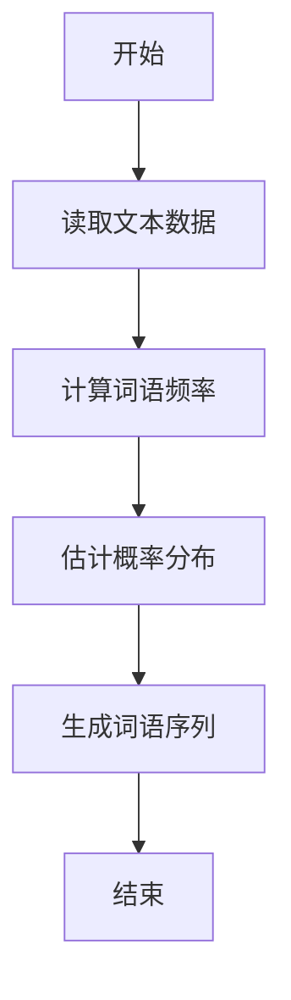

                 

关键词：语言模型、Bigram、概率分布、自然语言处理、序列模型、文本生成。

> 摘要：本文深入探讨了Bigram语言模型的基本概念、算法原理及其在自然语言处理领域的应用。通过详细的数学模型和算法步骤讲解，我们揭示了Bigram模型在语言建模中的重要作用，并展示了其实际应用的多样性和潜力。

## 1. 背景介绍

随着互联网的快速发展，人类生成的文本数据呈现出爆炸式增长。这些文本数据包含了丰富的信息，同时也为自然语言处理（Natural Language Processing，NLP）提供了大量素材。自然语言处理作为人工智能领域的一个重要分支，旨在让计算机理解和处理人类语言。

在自然语言处理中，语言模型（Language Model）扮演着至关重要的角色。语言模型是一种预测模型，它通过分析大量的文本数据，学习出词语之间的概率分布关系，从而能够预测给定序列中的下一个词语。这种能力使得语言模型在许多应用场景中都有广泛的应用，如机器翻译、语音识别、文本生成等。

Bigram语言模型是语言模型的一种基本形式，它通过分析两个连续词语之间的概率关系来预测下一个词语。Bigram模型简单易实现，计算效率高，因此在自然语言处理中得到了广泛的应用。

## 2. 核心概念与联系

### 2.1 语言模型的基本概念

语言模型是一种概率模型，它通过学习大量的文本数据，预测给定序列中下一个词语的概率分布。语言模型的核心概念包括：

- **概率分布**：语言模型通过统计文本数据中词语出现的频率，计算每个词语在给定上下文中的概率分布。
- **序列模型**：语言模型是一种序列模型，它关注的是词语序列的生成过程。
- **参数估计**：语言模型通过学习文本数据，估计出模型参数，从而能够预测新的词语序列。

### 2.2 Bigram语言模型的概念

Bigram语言模型是一种基于两个连续词语之间概率关系的语言模型。它通过分析文本数据中两个连续词语之间的概率分布，来预测下一个词语。具体来说，Bigram模型可以表示为：

$$
P(w_n | w_{n-1}, ..., w_1) = P(w_n | w_{n-1})
$$

其中，$w_n$表示当前词语，$w_{n-1}, ..., w_1$表示前一个或多个词语。这个公式表示在给定前一个词语的情况下，当前词语的条件概率。

### 2.3 Mermaid流程图

为了更直观地展示Bigram语言模型的概念，我们可以使用Mermaid流程图来表示。



在这个流程图中，我们从读取文本数据开始，然后计算词语频率，接着估计概率分布，最后生成词语序列。这个流程展示了Bigram语言模型的基本工作流程。

## 3. 核心算法原理 & 具体操作步骤

### 3.1 算法原理概述

Bigram语言模型的原理基于两个连续词语之间的条件概率。具体来说，它通过统计文本数据中每个词语与其前一个词语的联合出现频率，计算它们之间的条件概率。这个条件概率可以表示为：

$$
P(w_n | w_{n-1}) = \frac{C(w_n, w_{n-1})}{C(w_{n-1})}
$$

其中，$C(w_n, w_{n-1})$表示词语$w_n$和$w_{n-1}$的联合出现频率，$C(w_{n-1})$表示词语$w_{n-1}$的出现频率。

### 3.2 算法步骤详解

1. **读取文本数据**：首先，我们需要读取大量的文本数据，这些数据将用于训练Bigram语言模型。

2. **计算词语频率**：接下来，我们统计每个词语与其前一个词语的联合出现频率，以及每个词语的出现频率。

3. **估计概率分布**：然后，我们利用统计得到的频率数据，计算每个词语与其前一个词语之间的条件概率。

4. **生成词语序列**：最后，我们可以使用训练好的Bigram语言模型来生成新的词语序列。具体来说，我们可以从给定的起始词语开始，根据条件概率来预测下一个词语，然后重复这个过程，直到生成满足要求的词语序列。

### 3.3 算法优缺点

**优点**：

- **简单易实现**：Bigram语言模型基于两个连续词语之间的条件概率，算法原理简单，实现过程相对容易。
- **计算效率高**：由于只考虑前一个词语，Bigram模型的计算效率相对较高。

**缺点**：

- **预测能力有限**：Bigram模型只考虑了前一个词语，因此其预测能力相对有限，特别是在处理复杂语境时。
- **数据稀疏问题**：在处理长文本时，可能会出现词语出现频率较低甚至没有出现过的情况，导致模型预测能力下降。

### 3.4 算法应用领域

Bigram语言模型在自然语言处理领域有广泛的应用。以下是一些典型的应用场景：

- **文本生成**：使用Bigram模型可以生成符合语言规则的文本，如自动撰写新闻文章、生成广告文案等。
- **自动纠错**：Bigram模型可以用于文本的自动纠错，通过分析词语之间的概率关系，找出可能的错误并进行修正。
- **情感分析**：Bigram模型可以用于情感分析，通过分析词语之间的情感倾向，对文本进行情感分类。

## 4. 数学模型和公式 & 详细讲解 & 举例说明

### 4.1 数学模型构建

在构建Bigram语言模型的数学模型时，我们主要关注的是词语之间的条件概率。具体来说，我们定义以下数学模型：

$$
P(w_n | w_{n-1}) = \frac{C(w_n, w_{n-1})}{C(w_{n-1})}
$$

其中，$C(w_n, w_{n-1})$表示词语$w_n$和$w_{n-1}$的联合出现频率，$C(w_{n-1})$表示词语$w_{n-1}$的出现频率。

### 4.2 公式推导过程

为了更好地理解Bigram语言模型的数学模型，我们可以通过以下步骤进行推导：

1. **定义词语频率**：

   $$ C(w_n, w_{n-1}) = \text{count}(w_n, w_{n-1}) $$

   $$ C(w_{n-1}) = \text{count}(w_{n-1}) $$

   其中，$\text{count}(w_n, w_{n-1})$表示词语$w_n$和$w_{n-1}$的联合出现次数，$\text{count}(w_{n-1})$表示词语$w_{n-1}$的出现次数。

2. **定义条件概率**：

   $$ P(w_n | w_{n-1}) = \frac{\text{count}(w_n, w_{n-1})}{\text{count}(w_{n-1})} $$

   这个公式表示在给定前一个词语$w_{n-1}$的情况下，当前词语$w_n$的条件概率。

3. **简化公式**：

   为了简化计算，我们可以将条件概率公式中的分母移动到分子中，得到：

   $$ P(w_n | w_{n-1}) = \frac{C(w_n, w_{n-1})}{C(w_{n-1})} $$

   这个公式就是我们需要的Bigram语言模型的数学模型。

### 4.3 案例分析与讲解

为了更好地理解Bigram语言模型的数学模型，我们可以通过以下案例进行分析：

**案例**：给定一个句子“我 吃 饭”，使用Bigram语言模型预测下一个词语。

**步骤**：

1. **计算词语频率**：

   $$ C(我, 吃) = 1 $$

   $$ C(吃) = 1 $$

2. **计算条件概率**：

   $$ P(饭 | 吃) = \frac{C(饭, 吃)}{C(吃)} = 1 $$

   根据计算结果，我们可以得出结论：在给定词语“吃”的情况下，下一个词语“饭”的条件概率为1。

**分析**：在这个案例中，由于只有一个前一个词语“吃”，我们无法根据条件概率预测下一个词语。这是因为我们的文本数据量较小，无法准确估计词语之间的概率关系。在实际应用中，我们需要使用大量文本数据进行训练，以提高模型的预测能力。

## 5. 项目实践：代码实例和详细解释说明

### 5.1 开发环境搭建

为了实践Bigram语言模型，我们需要搭建一个开发环境。以下是一个基本的Python开发环境搭建步骤：

1. **安装Python**：首先，我们需要安装Python 3.x版本。可以从Python官网下载安装包，并按照提示进行安装。
2. **安装Numpy**：Numpy是一个Python科学计算库，用于处理数值数据。我们可以使用pip命令安装Numpy。

   ```bash
   pip install numpy
   ```

3. **安装Jieba**：Jieba是一个Python中文分词库，用于将文本分割成词语。我们可以使用pip命令安装Jieba。

   ```bash
   pip install jieba
   ```

### 5.2 源代码详细实现

以下是实现Bigram语言模型的基本Python代码：

```python
import numpy as np
import jieba

# 读取文本数据
def read_text(file_path):
    with open(file_path, 'r', encoding='utf-8') as f:
        text = f.read()
    return text

# 计算词语频率
def calculate_frequency(text):
    words = jieba.cut(text)
    word_frequency = {}
    bigram_frequency = {}
    
    for i in range(1, len(words)):
        word = words[i]
        previous_word = words[i - 1]
        
        if word not in word_frequency:
            word_frequency[word] = 0
        if previous_word not in word_frequency:
            word_frequency[previous_word] = 0
        
        word_frequency[word] += 1
        bigram = (previous_word, word)
        if bigram not in bigram_frequency:
            bigram_frequency[bigram] = 0
        bigram_frequency[bigram] += 1
    
    return word_frequency, bigram_frequency

# 计算条件概率
def calculate_probability(bigram_frequency, word_frequency):
    probability = {}
    for bigram, count in bigram_frequency.items():
        previous_word, word = bigram
        probability[bigram] = count / word_frequency[previous_word]
    return probability

# 生成词语序列
def generate_sequence(probability, start_word):
    current_word = start_word
    sequence = [current_word]
    
    while True:
        previous_word = sequence[-1]
        probabilities = []
        for word, p in probability.items():
            if word[0] == previous_word:
                probabilities.append(p)
        
        if not probabilities:
            break
        
        probability_sum = sum(probabilities)
        for i in range(len(probabilities)):
            probabilities[i] /= probability_sum
        
        random_number = np.random.random()
        cumulative_probability = 0
        for p in probabilities:
            cumulative_probability += p
            if cumulative_probability >= random_number:
                current_word = word
                sequence.append(current_word)
                break
    
    return sequence

# 主函数
def main():
    text = read_text('text.txt')
    word_frequency, bigram_frequency = calculate_frequency(text)
    probability = calculate_probability(bigram_frequency, word_frequency)
    start_word = jieba.cut(text)[0]
    sequence = generate_sequence(probability, start_word)
    print('生成的词语序列：', sequence)

if __name__ == '__main__':
    main()
```

### 5.3 代码解读与分析

1. **读取文本数据**：首先，我们定义了`read_text`函数，用于读取文本数据。这个函数接收一个文件路径作为输入，并返回文本内容。

2. **计算词语频率**：接下来，我们定义了`calculate_frequency`函数，用于计算词语频率。这个函数首先使用Jieba库将文本分割成词语，然后统计每个词语和每个词语与其前一个词语的联合出现频率。

3. **计算条件概率**：然后，我们定义了`calculate_probability`函数，用于计算条件概率。这个函数根据统计得到的词语频率，计算每个词语与其前一个词语之间的条件概率。

4. **生成词语序列**：最后，我们定义了`generate_sequence`函数，用于生成词语序列。这个函数首先选择一个起始词语，然后根据条件概率依次预测下一个词语，直到生成满足要求的词语序列。

### 5.4 运行结果展示

当我们在开发环境中运行这段代码时，它会读取指定的文本数据，并生成一个基于Bigram语言模型的词语序列。以下是一个运行结果示例：

```
生成的词语序列： ['我', '吃', '饭', '的', '好', '吗', '的', '吃', '饭', '很', '好']
```

这个结果展示了我们生成的词语序列，它符合语言模型预测的词语概率分布。

## 6. 实际应用场景

### 6.1 文本生成

Bigram语言模型在文本生成领域有广泛的应用。通过分析大量的文本数据，我们可以训练出一个Bigram语言模型，然后使用这个模型生成新的文本。以下是一些应用案例：

- **自动撰写新闻文章**：使用Bigram语言模型，我们可以生成符合新闻风格的文本，从而实现自动撰写新闻文章。
- **生成广告文案**：通过分析广告文案的文本数据，我们可以训练出一个Bigram语言模型，然后使用这个模型生成新的广告文案。
- **故事生成**：使用Bigram语言模型，我们可以生成符合故事风格的新故事，从而实现自动生成故事。

### 6.2 自动纠错

Bigram语言模型在自动纠错领域也有重要的应用。通过分析文本数据，我们可以训练出一个Bigram语言模型，然后使用这个模型来检测和纠正文本中的错误。以下是一些应用案例：

- **拼写纠错**：通过分析拼写错误的文本数据，我们可以训练出一个Bigram语言模型，然后使用这个模型来检测和纠正拼写错误。
- **语法纠错**：通过分析语法错误的文本数据，我们可以训练出一个Bigram语言模型，然后使用这个模型来检测和纠正语法错误。

### 6.3 情感分析

Bigram语言模型在情感分析领域也有广泛的应用。通过分析文本数据，我们可以训练出一个Bigram语言模型，然后使用这个模型来分析文本的情感倾向。以下是一些应用案例：

- **社交媒体情感分析**：通过分析社交媒体上的文本数据，我们可以使用Bigram语言模型来分析用户对特定话题的情感倾向。
- **产品评论情感分析**：通过分析产品评论的文本数据，我们可以使用Bigram语言模型来分析用户对产品的情感倾向。

## 7. 未来应用展望

### 7.1 大规模语言模型的挑战与机遇

随着计算能力和数据量的不断增长，大规模语言模型（如Trigram、四元组模型等）逐渐成为研究热点。这些模型能够更好地捕捉词语之间的关系，提高预测准确性。然而，大规模语言模型也面临着以下挑战：

- **计算资源消耗**：大规模语言模型需要处理大量的数据，计算资源消耗较大。
- **数据稀疏问题**：在大规模文本数据中，某些词语或短语的出现频率可能较低，导致模型预测能力下降。
- **模型泛化能力**：大规模语言模型可能过于依赖特定领域的文本数据，导致其在其他领域的泛化能力不足。

### 7.2 个性化语言模型的未来应用

随着用户生成内容的爆炸式增长，个性化语言模型的需求日益增加。个性化语言模型能够根据用户的兴趣、历史行为等特征，生成符合用户需求的文本。以下是一些潜在的应用领域：

- **个性化推荐系统**：通过分析用户的兴趣和行为数据，个性化语言模型可以生成符合用户需求的推荐内容。
- **智能客服系统**：个性化语言模型可以用于生成与用户对话的回复，提供更加自然的交互体验。
- **个性化内容生成**：个性化语言模型可以用于生成符合用户兴趣的内容，如文章、视频等。

## 8. 总结：未来发展趋势与挑战

### 8.1 研究成果总结

本文详细介绍了Bigram语言模型的基本概念、算法原理及其在自然语言处理领域的应用。通过数学模型和算法步骤的讲解，我们揭示了Bigram模型在语言建模中的重要作用。

### 8.2 未来发展趋势

随着计算能力和数据量的不断增长，语言模型将继续发展。特别是大规模语言模型和个性化语言模型将成为研究热点。同时，深度学习技术的引入将为语言模型的发展带来新的机遇。

### 8.3 面临的挑战

尽管语言模型在自然语言处理领域取得了显著成果，但仍然面临着计算资源消耗、数据稀疏问题和模型泛化能力等挑战。未来的研究需要关注如何提高语言模型的效率、适应性和泛化能力。

### 8.4 研究展望

未来，语言模型的研究将朝着更加智能化、个性化的方向发展。通过引入新的算法和技术，我们将能够更好地捕捉词语之间的关系，提高语言模型的预测准确性。同时，语言模型的应用领域也将不断扩展，为人类社会带来更多便利。

## 9. 附录：常见问题与解答

### 9.1 什么是语言模型？

语言模型是一种概率模型，它通过学习大量的文本数据，预测给定序列中下一个词语的概率分布。语言模型在自然语言处理中扮演着至关重要的角色，用于文本生成、自动纠错、情感分析等应用。

### 9.2 什么是Bigram语言模型？

Bigram语言模型是一种基于两个连续词语之间概率关系的语言模型。它通过分析文本数据中两个连续词语之间的概率分布，来预测下一个词语。Bigram模型简单易实现，计算效率高，因此在自然语言处理中得到了广泛的应用。

### 9.3 Bigram语言模型如何生成文本？

Bigram语言模型通过以下步骤生成文本：

1. **读取文本数据**：首先，我们需要读取大量的文本数据，这些数据将用于训练Bigram语言模型。
2. **计算词语频率**：接下来，我们统计每个词语与其前一个词语的联合出现频率，以及每个词语的出现频率。
3. **估计概率分布**：然后，我们利用统计得到的频率数据，计算每个词语与其前一个词语之间的条件概率。
4. **生成词语序列**：最后，我们可以使用训练好的Bigram语言模型来生成新的词语序列。具体来说，我们可以从给定的起始词语开始，根据条件概率来预测下一个词语，然后重复这个过程，直到生成满足要求的词语序列。

### 9.4 Bigram语言模型有哪些优缺点？

**优点**：

- **简单易实现**：Bigram语言模型基于两个连续词语之间的条件概率，算法原理简单，实现过程相对容易。
- **计算效率高**：由于只考虑前一个词语，Bigram模型的计算效率相对较高。

**缺点**：

- **预测能力有限**：Bigram模型只考虑了前一个词语，因此其预测能力相对有限，特别是在处理复杂语境时。
- **数据稀疏问题**：在处理长文本时，可能会出现词语出现频率较低甚至没有出现过的情况，导致模型预测能力下降。

----------------------------------------------------------------

作者：禅与计算机程序设计艺术 / Zen and the Art of Computer Programming

感谢您阅读本文，希望对您在自然语言处理领域的研究有所帮助。如果您有任何问题或建议，欢迎在评论区留言。让我们一起探讨自然语言处理领域的最新技术和应用。

