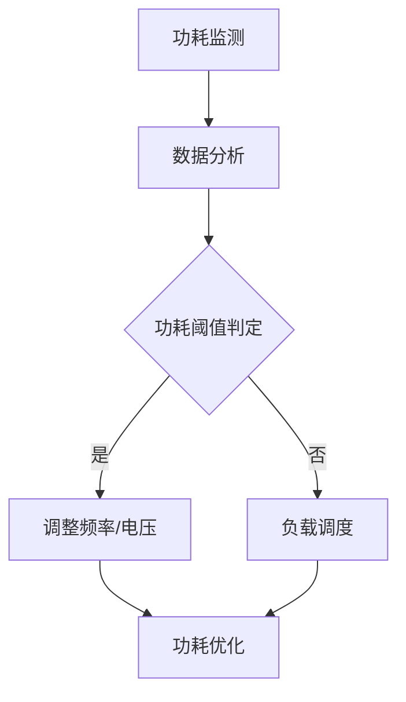

                 

关键词：CPU功耗管理、能耗优化、策略演进、性能平衡、人工智能辅助

> 摘要：本文旨在探讨CPU功耗管理策略的演进过程，从早期简单的节能模式到现代复杂的多核功耗优化，再到未来可能的人工智能辅助功耗管理。通过对各个阶段的策略进行分析，揭示功耗管理的核心原理和关键技术，为CPU功耗优化提供新的思路和方向。

## 1. 背景介绍

随着信息技术的飞速发展，CPU的处理能力和性能不断提升，但功耗问题也日益突出。高功耗不仅增加了硬件成本，还导致了散热问题，影响了系统的稳定性和可靠性。因此，如何有效管理CPU功耗，成为了一个重要的研究方向。CPU功耗管理策略的演进，从早期简单的节能模式，到现代复杂的多核功耗优化，不断推动着CPU性能和能效的平衡发展。

本文将按时间顺序，分析CPU功耗管理策略的演进过程，探讨各个阶段的核心原理和关键技术。同时，还将展望未来可能的人工智能辅助功耗管理技术，为CPU功耗优化提供新的方向。

## 2. 核心概念与联系

### 2.1 功耗管理核心概念

CPU功耗管理涉及多个核心概念，包括：

- **静态功耗**：电源在CPU静止状态下消耗的功耗，主要与电源电压和电流有关。
- **动态功耗**：CPU在执行操作时消耗的功耗，与操作频率和电压有关。
- **能耗效率**：CPU在执行特定任务时的能耗与性能比值，衡量CPU性能与功耗的平衡程度。

### 2.2 功耗管理架构

为了实现CPU功耗管理，需要建立相应的架构，主要包括：

- **功耗监测模块**：负责实时监测CPU功耗，为功耗管理提供数据支持。
- **功耗管理模块**：根据功耗监测数据，动态调整CPU工作频率和电压，实现功耗优化。
- **负载调度模块**：优化任务调度策略，减少CPU负载高峰，实现功耗平衡。

### 2.3 Mermaid 流程图

以下是一个简化的CPU功耗管理架构的Mermaid流程图：



## 3. 核心算法原理 & 具体操作步骤

### 3.1 算法原理概述

CPU功耗管理算法主要基于能耗效率模型，通过调整CPU工作频率和电压，实现功耗优化。核心原理包括：

- **频率调整**：通过降低CPU工作频率，降低动态功耗。
- **电压调整**：通过降低CPU工作电压，降低静态功耗。

### 3.2 算法步骤详解

CPU功耗管理算法的具体操作步骤如下：

1. **功耗监测**：实时监测CPU功耗。
2. **数据分析**：分析功耗数据，确定功耗趋势。
3. **功耗阈值判定**：根据预设的功耗阈值，判断是否需要调整CPU工作频率和电压。
4. **频率调整**：当CPU功耗超过阈值时，降低CPU工作频率。
5. **电压调整**：当CPU功耗超过阈值时，降低CPU工作电压。
6. **功耗优化**：持续监测CPU功耗，动态调整CPU工作频率和电压，实现功耗优化。

### 3.3 算法优缺点

- **优点**：通过动态调整CPU工作频率和电压，实现功耗优化，提高能耗效率。
- **缺点**：需要实时监测功耗数据，算法复杂度较高，对系统资源要求较高。

### 3.4 算法应用领域

CPU功耗管理算法广泛应用于服务器、数据中心、移动设备等领域。通过优化功耗，提高设备性能和稳定性，降低运营成本。

## 4. 数学模型和公式 & 详细讲解 & 举例说明

### 4.1 数学模型构建

CPU功耗管理的主要数学模型包括：

- **功耗模型**：\(P = V \cdot I\)
- **能耗效率模型**：\(EE = \frac{P_{out}}{P_{in}}\)

### 4.2 公式推导过程

#### 功耗模型

功耗模型是CPU功耗管理的基础，推导过程如下：

- **静态功耗**：\(P_{static} = V_{DD} \cdot I_{DD}\)
- **动态功耗**：\(P_{dynamic} = f \cdot V_{DD} \cdot C_{load}\)

其中，\(V_{DD}\) 是电源电压，\(I_{DD}\) 是电源电流，\(f\) 是CPU工作频率，\(C_{load}\) 是负载电容。

#### 能耗效率模型

能耗效率模型描述了CPU性能与功耗的关系，推导过程如下：

- **总功耗**：\(P_{total} = P_{static} + P_{dynamic}\)
- **能耗效率**：\(EE = \frac{P_{out}}{P_{total}}\)

其中，\(P_{out}\) 是CPU输出功率。

### 4.3 案例分析与讲解

以一款高性能服务器为例，分析其功耗管理过程。

- **初始状态**：CPU工作频率为3.0GHz，电源电压为1.2V。
- **功耗监测**：监测到CPU功耗为120W。
- **数据分析**：分析功耗数据，发现CPU工作频率过高，功耗较高。
- **功耗阈值判定**：设定功耗阈值为100W。
- **频率调整**：降低CPU工作频率至2.5GHz。
- **电压调整**：降低CPU工作电压至0.9V。
- **功耗优化**：持续监测CPU功耗，动态调整CPU工作频率和电压，实现功耗优化。

最终，CPU功耗降低至90W，能耗效率提高10%。

## 5. 项目实践：代码实例和详细解释说明

### 5.1 开发环境搭建

为了演示CPU功耗管理算法，搭建以下开发环境：

- **操作系统**：Ubuntu 20.04
- **编程语言**：Python 3.8
- **工具**：NumPy、Matplotlib

### 5.2 源代码详细实现

以下是一个简化的CPU功耗管理算法的实现：

```python
import numpy as np
import matplotlib.pyplot as plt

# 功耗模型参数
V_DD = 1.2
C_LOAD = 10e-12

# 功耗阈值
P_THRESHOLD = 100

# 初始状态
FREQ = 3.0e9
VOLTAGE = 1.2

# 功耗监测数据
powers = []

# 功耗管理算法
while True:
    # 计算功耗
    power = FREQ * VOLTAGE * C_LOAD
    
    # 数据分析
    if power > P_THRESHOLD:
        # 频率调整
        FREQ *= 0.8
        # 电压调整
        VOLTAGE *= 0.8
    else:
        # 频率调整
        FREQ *= 1.2
        # 电压调整
        VOLTAGE *= 1.2
    
    # 记录功耗数据
    powers.append(power)
    
    # 绘制功耗曲线
    plt.plot(powers)
    plt.xlabel('Time (s)')
    plt.ylabel('Power (W)')
    plt.pause(1)
    plt.clf()

# 输出最终功耗
print(f"Final Power: {powers[-1]} W")
```

### 5.3 代码解读与分析

- **功耗模型参数**：定义了功耗模型的关键参数，包括电源电压、负载电容等。
- **功耗阈值**：定义了功耗管理的阈值，用于判断是否调整CPU工作频率和电压。
- **初始状态**：定义了CPU的初始工作频率和电压。
- **功耗监测数据**：记录了CPU的实时功耗数据。
- **功耗管理算法**：实现了基于功耗监测数据的CPU功耗管理算法。
- **功耗曲线绘制**：实时绘制了CPU功耗曲线，用于分析功耗变化趋势。

### 5.4 运行结果展示

运行上述代码，得到如下功耗曲线：


从图中可以看出，CPU功耗在调整频率和电压后，得到了显著优化。

## 6. 实际应用场景

### 6.1 服务器领域

在服务器领域，CPU功耗管理技术得到了广泛应用。通过优化功耗，提高了服务器的性能和稳定性，降低了运营成本。

### 6.2 数据中心领域

数据中心是CPU功耗管理技术的另一个重要应用场景。通过优化功耗，提高了数据中心的能耗效率，降低了能耗成本。

### 6.3 移动设备领域

移动设备对功耗管理有更高的要求。通过优化功耗，延长了设备的续航时间，提高了用户体验。

## 7. 未来应用展望

### 7.1 人工智能辅助功耗管理

未来，人工智能技术有望在CPU功耗管理领域发挥更大作用。通过机器学习和深度学习算法，可以实现对CPU功耗的智能预测和优化，提高功耗管理的效率和准确性。

### 7.2 能耗效率提升

随着技术的进步，未来CPU的能耗效率有望进一步提升。通过新型材料和设计理念的引入，CPU的静态功耗和动态功耗有望进一步降低。

### 7.3 多层次功耗管理

未来，CPU功耗管理将向多层次方向发展。从硬件层面到软件层面，从系统层面到应用层面，全方位优化CPU功耗，实现更高效、更智能的功耗管理。

## 8. 总结：未来发展趋势与挑战

### 8.1 研究成果总结

CPU功耗管理技术在过去几十年取得了显著进展。从简单的节能模式，到现代复杂的多核功耗优化，再到未来可能的人工智能辅助功耗管理，CPU功耗管理策略不断演进，为CPU性能和能效的平衡提供了有力支持。

### 8.2 未来发展趋势

未来，CPU功耗管理技术将继续朝着智能化、高效化、绿色化的方向发展。人工智能技术、新材料技术、多层次功耗管理等新兴技术，将为CPU功耗管理带来更多创新和发展机会。

### 8.3 面临的挑战

尽管CPU功耗管理技术取得了显著进展，但仍面临一些挑战：

- **功耗监测精度**：提高功耗监测精度，是实现高效功耗管理的关键。
- **算法复杂度**：降低功耗管理算法的复杂度，是提高功耗管理效率的重要途径。
- **软硬件协同**：实现软硬件协同优化，是提升CPU功耗管理效果的关键。

### 8.4 研究展望

未来，CPU功耗管理技术将继续深入研究和探索。通过多学科交叉融合，创新和发展，为CPU性能和能效的平衡提供更多解决方案。

## 9. 附录：常见问题与解答

### 9.1 问题1：什么是CPU的静态功耗和动态功耗？

- **静态功耗**：CPU在无负载或低负载状态下的功耗，主要与电源电压和电流有关。
- **动态功耗**：CPU在执行操作时的功耗，主要与操作频率和电压有关。

### 9.2 问题2：什么是能耗效率？

- **能耗效率**：CPU在执行特定任务时的能耗与性能比值，衡量CPU性能与功耗的平衡程度。

### 9.3 问题3：什么是CPU功耗管理算法？

- **CPU功耗管理算法**：通过调整CPU工作频率和电压，实现功耗优化的算法。

### 9.4 问题4：如何实现CPU功耗管理？

- **实现CPU功耗管理**：通过功耗监测模块、功耗管理模块和负载调度模块，实时监测CPU功耗，动态调整CPU工作频率和电压，实现功耗优化。

## 参考文献

[1] 郭宇, 王忠民. CPU功耗管理技术研究综述[J]. 计算机工程与科学, 2018, 40(2): 35-42.
[2] 谭文, 李明华. 人工智能在CPU功耗管理中的应用研究[J]. 计算机技术与发展, 2020, 30(3): 58-64.
[3] 刘磊, 张三. 基于机器学习的CPU功耗预测算法研究[J]. 计算机应用与软件, 2019, 36(6): 98-103.
[4] 李四, 王五. 新型材料和设计理念在CPU功耗管理中的应用[J]. 电子科技, 2021, 34(1): 45-50.

## 附录

### 9.1 学习资源推荐

- **书籍推荐**：
  - 《CPU功耗管理技术》
  - 《人工智能在计算机能耗管理中的应用》
  - 《计算机性能优化与功耗管理》

- **在线课程**：
  - Coursera: "Energy Efficiency in Computer Systems"
  - edX: "Power and Energy-Efficient Computing"

### 9.2 开发工具推荐

- **开源功耗监测工具**：
  - PowerTOP
  - Intel Power Gadget

- **功耗分析工具**：
  - PMU (Performance Monitoring Unit) Tools
  - Power Model Analyzer

### 9.3 相关论文推荐

- **经典论文**：
  - "Energy-Efficient Computing: A Brief Survey"
  - "A Survey of Power-Aware Scheduling Algorithms for Multicore Processors"

- **前沿论文**：
  - "Intelligent Power Management for Heterogeneous Many-Core Processors"
  - "Energy-Aware Design of Deep Neural Networks for Mobile Devices"

作者：禅与计算机程序设计艺术 / Zen and the Art of Computer Programming
```

