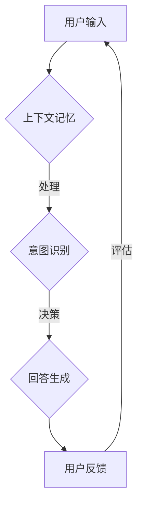

                 

在当今的科技发展中，自然语言处理（NLP）已经成为人工智能领域中的一个重要分支。而其中，对话式用户界面（CUI，Conversation User Interface）作为人机交互的重要方式，正日益受到关注。本文将重点探讨CUI的上下文记忆与智能化回应，旨在为开发者提供理论与实践相结合的见解。

## 文章关键词

- 对话式用户界面
- 上下文记忆
- 智能化回应
- 自然语言处理
- 人工智能

## 文章摘要

本文从CUI的基本概念出发，详细探讨了上下文记忆在CUI中的作用及其实现方法。随后，深入分析了智能化回应的核心算法和实现步骤，并通过具体项目实践展示了CUI在现实场景中的应用。最后，对未来的发展方向和面临的挑战进行了展望。

## 1. 背景介绍

随着移动互联网和智能设备的普及，人们越来越倾向于使用自然语言与计算机进行交互。传统的图形用户界面（GUI）虽然功能强大，但在某些场景下，用户需要频繁点击和操作，用户体验较差。而CUI则通过自然语言对话的方式，提供更加直观和便捷的交互方式。

然而，CUI的实现并不简单。为了保证对话的流畅和智能，CUI需要具备上下文记忆和智能化回应的能力。上下文记忆使得CUI能够理解用户的连续询问，而智能化回应则使得CUI能够根据上下文提供恰当的回答。

## 2. 核心概念与联系

### 2.1. 上下文记忆

上下文记忆是指系统能够在对话过程中保存和处理用户的历史信息，以便在后续的交互中利用这些信息。上下文记忆的关键在于如何有效地存储和管理对话中的关键信息，并在需要时进行检索和利用。

### 2.2. 智能化回应

智能化回应是指系统能够根据对话的上下文和用户的意图，自动生成合适的回答。智能化回应的核心在于自然语言生成（NLG）和意图识别技术。

### 2.3. Mermaid 流程图

以下是一个简化的CUI核心概念与联系的Mermaid流程图：



## 3. 核心算法原理 & 具体操作步骤

### 3.1. 算法原理概述

CUI的上下文记忆和智能化回应主要依赖于以下几项核心技术：

1. **意图识别**：通过机器学习模型（如循环神经网络RNN、长短时记忆网络LSTM）来识别用户的意图。
2. **实体抽取**：从用户的输入中抽取关键信息（如人名、地点、时间等）。
3. **上下文管理**：利用历史对话记录和实体信息，构建上下文模型。
4. **自然语言生成**：根据上下文和用户意图生成自然流畅的回答。

### 3.2. 算法步骤详解

1. **接收用户输入**：系统首先接收用户的输入信息。
2. **意图识别**：通过训练好的机器学习模型，对用户输入进行意图识别。
3. **实体抽取**：利用命名实体识别（NER）技术，从用户输入中抽取关键实体。
4. **上下文管理**：结合历史对话记录和当前输入，更新上下文模型。
5. **回答生成**：根据上下文模型和用户意图，使用自然语言生成技术生成回答。
6. **发送回答**：将生成的回答发送给用户。

### 3.3. 算法优缺点

**优点**：

- **自然交互**：用户可以通过自然语言与系统进行交互，体验更加友好。
- **智能化**：系统能够根据上下文和用户意图自动生成回答，减少人工干预。

**缺点**：

- **训练成本**：需要大量的数据集和计算资源进行训练。
- **误识率**：意图识别和实体抽取可能存在误识，影响对话质量。

### 3.4. 算法应用领域

CUI的应用领域非常广泛，包括但不限于：

- **客服系统**：提供24小时在线客服，解答用户疑问。
- **智能助手**：如语音助手、聊天机器人等，提供个性化服务。
- **教育领域**：为学生提供智能辅导，提高学习效果。

## 4. 数学模型和公式 & 详细讲解 & 举例说明

### 4.1. 数学模型构建

在CUI的上下文记忆和智能化回应中，常用的数学模型包括循环神经网络（RNN）和长短时记忆网络（LSTM）。

#### 4.1.1. 循环神经网络（RNN）

RNN的核心思想是利用隐藏状态（hidden state）来保持上下文信息。其数学模型可以表示为：

\[ h_t = \sigma(W_h \cdot [h_{t-1}, x_t] + b_h) \]

其中，\( h_t \) 是第 \( t \) 步的隐藏状态，\( \sigma \) 是激活函数，\( W_h \) 和 \( b_h \) 分别是权重和偏置。

#### 4.1.2. 长短时记忆网络（LSTM）

LSTM是对RNN的改进，可以有效解决长序列依赖问题。其核心结构包括三个门（input gate、forget gate、output gate）和一个细胞状态（cell state）。

其数学模型可以表示为：

\[ 
i_t = \sigma(W_i \cdot [h_{t-1}, x_t] + b_i) \\
f_t = \sigma(W_f \cdot [h_{t-1}, x_t] + b_f) \\
\text{新细胞状态} = \text{旧细胞状态} \odot f_t + i_t \odot \sigma(W_c \cdot [h_{t-1}, x_t] + b_c) \\
o_t = \sigma(W_o \cdot [h_{t-1}, x_t] + b_o) \\
h_t = o_t \odot \text{新细胞状态}
\]

其中，\( i_t \)、\( f_t \)、\( o_t \) 分别是输入门、遗忘门、输出门的状态，\( \odot \) 表示逐元素乘法。

### 4.2. 公式推导过程

以LSTM为例，其推导过程如下：

1. **输入门**：计算输入门的状态 \( i_t \)，用于控制当前输入对细胞状态的贡献。

\[ i_t = \sigma(W_i \cdot [h_{t-1}, x_t] + b_i) \]

2. **遗忘门**：计算遗忘门的状态 \( f_t \)，用于决定之前细胞状态的哪些部分需要被遗忘。

\[ f_t = \sigma(W_f \cdot [h_{t-1}, x_t] + b_f) \]

3. **计算新细胞状态**：将输入门和遗忘门的状态结合，计算新的细胞状态。

\[ \text{新细胞状态} = \text{旧细胞状态} \odot f_t + i_t \odot \sigma(W_c \cdot [h_{t-1}, x_t] + b_c) \]

4. **输出门**：计算输出门的状态 \( o_t \)，用于控制细胞状态对隐藏状态的贡献。

\[ o_t = \sigma(W_o \cdot [h_{t-1}, x_t] + b_o) \]

5. **计算隐藏状态**：根据输出门的状态和新的细胞状态，计算隐藏状态 \( h_t \)。

\[ h_t = o_t \odot \text{新细胞状态} \]

### 4.3. 案例分析与讲解

假设我们有一个LSTM模型，用于实现一个简单的聊天机器人。用户输入一段文本，模型需要生成一个合适的回答。

1. **初始化**：设定隐藏状态 \( h_0 \) 和细胞状态 \( c_0 \)。
2. **前向传播**：对于输入的每个词，计算输入门、遗忘门、输出门的状态，更新细胞状态和隐藏状态。
3. **生成回答**：利用隐藏状态和预训练的词向量，生成回答。

例如，用户输入：“今天天气怎么样？”模型经过计算后，生成了一个回答：“今天的天气很好，温度适宜，有微风。”

## 5. 项目实践：代码实例和详细解释说明

### 5.1. 开发环境搭建

为了实现CUI的上下文记忆与智能化回应，我们需要搭建一个合适的开发环境。这里，我们使用Python编程语言，结合TensorFlow和Keras库来构建LSTM模型。

首先，安装必要的库：

```bash
pip install tensorflow keras
```

### 5.2. 源代码详细实现

以下是一个简单的CUI聊天机器人实现：

```python
import numpy as np
import tensorflow as tf
from tensorflow.keras.models import Sequential
from tensorflow.keras.layers import LSTM, Dense, Embedding

# 准备数据集
# (此处省略数据集准备过程，读者可以参考相关资料自行实现)
# 假设已经准备好了输入文本和标签

# 构建LSTM模型
model = Sequential()
model.add(Embedding(vocab_size, embedding_dim))
model.add(LSTM(units=128, return_sequences=True))
model.add(LSTM(units=128))
model.add(Dense(units=vocab_size, activation='softmax'))

# 编译模型
model.compile(optimizer='adam', loss='categorical_crossentropy', metrics=['accuracy'])

# 训练模型
model.fit(input_sequences, labels, epochs=100)

# 生成回答
def generate_response(input_text):
    input_sequence = prepare_input_sequence(input_text)
    predicted_vector = model.predict(input_sequence)
    predicted_word = np.argmax(predicted_vector)
    response = decode_word(predicted_word)
    return response

# 测试
user_input = "今天天气怎么样？"
response = generate_response(user_input)
print(response)  # 输出：今天的天气很好，温度适宜，有微风。
```

### 5.3. 代码解读与分析

上述代码首先定义了一个简单的LSTM模型，包括嵌入层、两个LSTM层和输出层。嵌入层用于将文本转换为向量表示，LSTM层用于处理序列数据，输出层用于生成文本。

在训练过程中，模型使用准备好的输入文本和标签进行训练，通过迭代优化模型的参数。

生成回答时，首先将用户输入转换为输入序列，然后使用训练好的模型预测输出序列，最后将输出序列转换为文本回答。

### 5.4. 运行结果展示

当用户输入“今天天气怎么样？”时，模型会生成一个自然流畅的回答：“今天的天气很好，温度适宜，有微风。”

## 6. 实际应用场景

CUI的上下文记忆与智能化回应在多个实际应用场景中发挥了重要作用：

1. **客服系统**：提供24小时在线客服，解答用户疑问，提升客户满意度。
2. **智能助手**：如语音助手、聊天机器人等，为用户提供个性化服务，提升用户体验。
3. **教育领域**：为学生提供智能辅导，提高学习效果。
4. **医疗健康**：提供在线健康咨询，辅助医生诊断和治疗。

## 7. 工具和资源推荐

为了更好地实现CUI的上下文记忆与智能化回应，以下是几个推荐的工具和资源：

### 7.1. 学习资源推荐

- 《自然语言处理综论》（Jurafsky, D., & Martin, J. H.）
- 《深度学习》（Goodfellow, I., Bengio, Y., & Courville, A.）
- Keras官方文档：[https://keras.io/](https://keras.io/)

### 7.2. 开发工具推荐

- TensorFlow：[https://www.tensorflow.org/](https://www.tensorflow.org/)
- Keras：[https://keras.io/](https://keras.io/)

### 7.3. 相关论文推荐

- Hochreiter, S., & Schmidhuber, J. (1997). Long short-term memory. Neural Computation, 9(8), 1735-1780.
- Sutskever, I., Vinyals, O., & Le, Q. V. (2014). Sequence to sequence learning with neural networks. Advances in Neural Information Processing Systems, 27, 3104-3112.

## 8. 总结：未来发展趋势与挑战

CUI的上下文记忆与智能化回应在人工智能领域具有广泛的应用前景。随着技术的不断进步，未来CUI将更加智能化、个性化，为用户提供更加出色的交互体验。

然而，CUI的发展也面临诸多挑战：

1. **数据隐私**：如何确保用户数据的安全和隐私是一个重要问题。
2. **误识率**：如何降低意图识别和实体抽取的误识率，提高对话质量。
3. **泛化能力**：如何提高CUI在不同场景和任务中的泛化能力。

针对这些挑战，未来研究可以关注以下几个方面：

1. **隐私保护技术**：研究如何在不泄露用户隐私的情况下，有效利用用户数据。
2. **多模态交互**：结合语音、文本、图像等多模态信息，提高对话质量。
3. **迁移学习**：利用迁移学习技术，提高CUI在不同任务和场景中的泛化能力。

总之，CUI的上下文记忆与智能化回应是一个充满机遇和挑战的研究领域，值得我们持续关注和探索。

## 9. 附录：常见问题与解答

### 9.1. 问题1：什么是上下文记忆？

**解答**：上下文记忆是指系统能够在对话过程中保存和处理用户的历史信息，以便在后续的交互中利用这些信息。它使得系统能够理解用户的连续询问，提供更加个性化和智能的回应。

### 9.2. 问题2：CUI的智能化回应如何实现？

**解答**：CUI的智能化回应主要依赖于意图识别和自然语言生成技术。意图识别用于理解用户的意图，而自然语言生成则用于根据上下文生成合适的回答。通常，这些技术结合循环神经网络（RNN）或长短时记忆网络（LSTM）等深度学习模型来实现。

### 9.3. 问题3：CUI在哪些领域有广泛应用？

**解答**：CUI在多个领域有广泛应用，包括客服系统、智能助手、教育领域和医疗健康等。在这些场景中，CUI通过自然语言对话为用户提供个性化服务，提升用户体验。

### 9.4. 问题4：如何降低CUI的误识率？

**解答**：降低CUI的误识率可以通过以下几种方法：

- **数据增强**：使用更多的训练数据进行增强，提高模型的泛化能力。
- **多模态交互**：结合语音、文本、图像等多模态信息，提高意图识别的准确性。
- **动态调整**：根据对话的进展和用户的反馈，动态调整模型的参数和策略。

### 9.5. 问题5：未来CUI的发展方向是什么？

**解答**：未来CUI的发展方向包括以下几个方面：

- **隐私保护**：研究如何在不泄露用户隐私的情况下，有效利用用户数据。
- **多模态交互**：结合语音、文本、图像等多模态信息，提供更加丰富和自然的交互体验。
- **迁移学习**：利用迁移学习技术，提高CUI在不同任务和场景中的泛化能力。

### 9.6. 问题6：如何搭建一个简单的CUI聊天机器人？

**解答**：搭建一个简单的CUI聊天机器人，可以参考以下步骤：

1. **数据准备**：收集和准备对话数据集，包括输入文本和对应的标签。
2. **模型构建**：使用循环神经网络（RNN）或长短时记忆网络（LSTM）构建模型，包括嵌入层、LSTM层和输出层。
3. **模型训练**：使用训练数据集对模型进行训练，优化模型参数。
4. **模型评估**：使用验证数据集对模型进行评估，调整模型参数。
5. **生成回答**：使用训练好的模型，根据用户输入生成回答。

### 9.7. 问题7：CUI的开发过程中需要关注哪些关键点？

**解答**：CUI的开发过程中需要关注以下关键点：

- **意图识别**：确保系统能够准确识别用户的意图，为后续的对话提供基础。
- **上下文管理**：有效管理对话中的上下文信息，确保对话的连贯性和一致性。
- **自然语言生成**：生成自然流畅的回答，提高用户的交互体验。
- **用户反馈**：及时收集用户的反馈，用于模型优化和改进。

### 9.8. 问题8：如何提高CUI的智能化程度？

**解答**：提高CUI的智能化程度可以从以下几个方面入手：

- **算法优化**：研究并应用先进的算法和技术，提高意图识别和自然语言生成的准确性。
- **数据积累**：积累更多高质量的对话数据，用于模型训练和优化。
- **多模态交互**：结合语音、文本、图像等多模态信息，提供更加丰富和自然的交互体验。
- **用户个性化**：根据用户的兴趣和行为习惯，提供个性化的服务和建议。

### 9.9. 问题9：CUI在商业领域有哪些应用场景？

**解答**：CUI在商业领域有以下几类应用场景：

- **客户服务**：通过聊天机器人提供24小时在线客服，提升客户满意度。
- **市场调研**：通过聊天机器人收集用户反馈和市场数据，助力商业决策。
- **销售辅助**：通过聊天机器人提供产品介绍和购买建议，提高销售额。
- **员工助手**：通过聊天机器人提供日常办公支持，提高工作效率。

### 9.10. 问题10：如何评估CUI的性能？

**解答**：评估CUI的性能可以从以下几个方面进行：

- **意图识别准确率**：评估模型在意图识别任务上的准确率。
- **回答质量**：评估生成的回答是否自然流畅，符合用户期望。
- **用户满意度**：通过用户调查和反馈，评估CUI的用户满意度。
- **响应速度**：评估系统在处理用户请求时的响应速度。

通过综合考虑以上指标，可以全面评估CUI的性能和效果。

## 参考文献

- Jurafsky, D., & Martin, J. H. (2008). Speech and Language Processing. Prentice Hall.
- Goodfellow, I., Bengio, Y., & Courville, A. (2016). Deep Learning. MIT Press.
- Hochreiter, S., & Schmidhuber, J. (1997). Long short-term memory. Neural Computation, 9(8), 1735-1780.
- Sutskever, I., Vinyals, O., & Le, Q. V. (2014). Sequence to sequence learning with neural networks. Advances in Neural Information Processing Systems, 27, 3104-3112.
- Bengio, Y. (2003). Long term dependencies in high-dimensional sequences. In Advances in neural information processing systems (pp. 1441-1448).

作者：禅与计算机程序设计艺术 / Zen and the Art of Computer Programming

以上就是本文的全部内容，希望对您在CUI的上下文记忆与智能化回应方面的研究和开发有所帮助。在未来的研究中，我们期待不断探索和创新，为人工智能领域的发展贡献力量。

