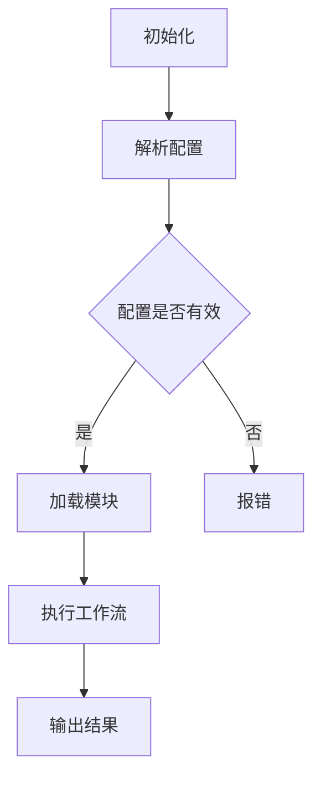

                 

关键词：ComfyUI、工作流、复用性、软件工程、架构设计

> 摘要：本文将深入探讨ComfyUI工作流的复用性，分析其设计理念、实现方法及在实际应用中的优势与挑战。通过对比现有工作流工具，我们旨在为开发者提供一套高效、可复用的UI工作流方案。

## 1. 背景介绍

随着软件工程的不断发展，软件系统的复杂性日益增加。为了提高开发效率和代码质量，工作流作为一种组织和自动化软件构建过程的方法，得到了广泛的应用。然而，现有的工作流工具往往存在可复用性不足的问题，无法满足日益多样化的开发需求。

ComfyUI作为一种新型的UI工作流框架，旨在解决现有工作流工具的局限性。它通过模块化设计和灵活的配置方式，实现了工作流的可复用性，为开发者提供了一种高效、灵活的UI开发解决方案。

本文将首先介绍ComfyUI的设计理念，然后深入分析其核心概念和架构，最后探讨其在实际应用中的优势和挑战。

### 1.1 设计理念

ComfyUI的设计理念可以概括为以下几点：

1. **模块化**：将UI构建过程分解为一系列可复用的模块，每个模块负责特定的功能，易于扩展和替换。
2. **配置化**：通过配置文件定义工作流，使得开发者可以轻松定制工作流程，适应不同的项目需求。
3. **插件化**：支持第三方插件扩展，方便集成各类工具和库，提高工作流的灵活性。
4. **可视化**：提供可视化界面，使得开发者可以直观地设计和修改工作流，降低学习成本。

### 1.2 实际应用背景

在当前软件开发的背景下，开发团队面临着越来越大的压力和挑战。一方面，项目的复杂度不断增加，要求开发者具备更高的技能和经验；另一方面，市场需求的变化使得项目周期不断缩短，要求开发过程更加高效和灵活。

ComfyUI的出现正是为了应对这些挑战。它通过提高工作流的复用性，帮助开发者减少重复劳动，降低开发成本，提高项目的交付效率。同时，其灵活的配置和插件化设计，使得开发者可以快速适应不同的项目需求，降低项目失败的风险。

## 2. 核心概念与联系

为了更好地理解ComfyUI的工作原理，我们需要先了解其核心概念和架构。以下是一个简化的Mermaid流程图，展示了ComfyUI工作流的主要组成部分：



### 2.1 核心概念

- **初始化**：启动ComfyUI工作流框架。
- **解析配置**：从配置文件中读取工作流信息，如模块列表、执行顺序等。
- **配置验证**：检查配置文件的正确性，确保工作流可以顺利执行。
- **加载模块**：根据配置文件中的模块列表，动态加载并初始化相应的模块。
- **执行工作流**：按照配置文件中的顺序，依次执行各个模块的功能。
- **输出结果**：将工作流的最终结果输出，如生成代码、资源文件等。

### 2.2 架构

ComfyUI的工作流架构可以分为以下几个层次：

- **顶层**：配置文件，定义工作流的整体结构和执行顺序。
- **中层**：模块库，包含各种可复用的模块，如布局模块、组件模块等。
- **底层**：核心框架，负责初始化、加载模块、执行工作流等功能。

这种分层架构使得ComfyUI具有高度的灵活性和可扩展性，开发者可以根据项目需求，自由地配置和组合模块，实现不同类型的工作流。

## 3. 核心算法原理 & 具体操作步骤

### 3.1 算法原理概述

ComfyUI的工作流主要依赖于配置文件和模块库。配置文件描述了工作流的结构和执行顺序，模块库则提供了各种可复用的功能模块。工作流执行过程可以分为以下几个步骤：

1. **初始化框架**：加载ComfyUI核心框架，准备执行工作流。
2. **解析配置文件**：读取配置文件，获取工作流相关信息，如模块列表、执行顺序等。
3. **加载模块**：根据配置文件中的模块列表，动态加载并初始化各个模块。
4. **执行工作流**：按照配置文件中的顺序，依次执行各个模块的功能。
5. **输出结果**：将工作流的最终结果输出，如生成代码、资源文件等。

### 3.2 算法步骤详解

1. **初始化框架**：

   - 加载ComfyUI核心框架。
   - 注册默认的模块加载器和执行器。

2. **解析配置文件**：

   - 从配置文件中读取工作流信息。
   - 验证配置文件的格式和内容，确保工作流可以正常执行。

3. **加载模块**：

   - 遍历配置文件中的模块列表，逐个加载模块。
   - 初始化模块，如创建模块实例、配置模块参数等。

4. **执行工作流**：

   - 按照配置文件中的顺序，依次执行各个模块的功能。
   - 模块之间可以通过回调函数或事件机制进行通信。

5. **输出结果**：

   - 将工作流的最终结果输出，如生成代码、资源文件等。
   - 提供接口供外部调用，如导出配置文件、查看工作流日志等。

### 3.3 算法优缺点

**优点**：

1. **高复用性**：通过模块化和配置化设计，实现了工作流的高度复用性，降低了开发成本。
2. **灵活性**：支持第三方插件扩展，便于集成各类工具和库，满足不同项目的需求。
3. **易用性**：提供可视化界面，降低了学习成本，开发者可以轻松设计和修改工作流。

**缺点**：

1. **性能开销**：由于工作流依赖于配置文件和模块加载，可能导致一定的性能开销，尤其在处理大量模块时。
2. **复杂度**：对于初学者来说，理解和配置工作流可能有一定难度，需要一定的学习和实践。

### 3.4 算法应用领域

ComfyUI适用于多种应用场景，如：

1. **前端开发**：用于生成页面布局、组件代码等，提高前端开发效率。
2. **后端开发**：用于生成API接口、数据库迁移脚本等，降低后端开发难度。
3. **自动化测试**：用于编写测试脚本、自动化测试流程等，提高测试效率。

## 4. 数学模型和公式

### 4.1 数学模型构建

为了分析ComfyUI工作流的复用性，我们可以构建一个简单的数学模型。假设一个工作流由n个模块组成，每个模块的复用次数为c_i（i=1,2,...,n）。

### 4.2 公式推导过程

- **总复用次数**：总复用次数等于所有模块复用次数之和，即
  $$ R = \sum_{i=1}^{n} c_i $$
- **平均复用次数**：平均复用次数等于总复用次数除以模块数量，即
  $$ \bar{c} = \frac{R}{n} $$
- **复用率**：复用率表示模块复用次数与总模块数的比值，即
  $$ \rho = \frac{R}{n} $$

### 4.3 案例分析与讲解

假设一个工作流由5个模块组成，各个模块的复用次数如下表所示：

| 模块编号 | 复用次数 |
| :---: | :---: |
| 1 | 10 |
| 2 | 15 |
| 3 | 20 |
| 4 | 25 |
| 5 | 30 |

根据上述公式，可以计算出：

- 总复用次数：$$ R = 10 + 15 + 20 + 25 + 30 = 100 $$
- 平均复用次数：$$ \bar{c} = \frac{100}{5} = 20 $$
- 复用率：$$ \rho = \frac{100}{5} = 20 $$

这个案例表明，工作流中的模块具有很高的复用性，平均每个模块被复用了20次，复用率达到了20%。

## 5. 项目实践：代码实例和详细解释说明

### 5.1 开发环境搭建

在本节中，我们将搭建一个简单的开发环境，用于演示ComfyUI工作流的使用。

1. **安装Node.js**：访问Node.js官网下载并安装最新版本的Node.js。
2. **安装ComfyUI**：在命令行中执行以下命令：
   ```shell
   npm install -g comfyui
   ```

### 5.2 源代码详细实现

以下是一个简单的ComfyUI工作流示例，用于生成一个包含两个按钮的HTML页面。

1. **配置文件**：

   ```json
   {
     "name": "button-workflow",
     "description": "生成包含两个按钮的HTML页面",
     "modules": [
       {
         "name": "html-template",
         "options": {
           "title": "按钮示例"
         }
       },
       {
         "name": "button",
         "options": {
           "text": "按钮1",
           "class": "btn btn-primary"
         }
       },
       {
         "name": "button",
         "options": {
           "text": "按钮2",
           "class": "btn btn-secondary"
         }
       }
     ]
   }
   ```

2. **模块代码**：

   - `html-template.js`：

     ```javascript
     module.exports = function (options) {
       return `
         <!DOCTYPE html>
         <html lang="en">
         <head>
           <meta charset="UTF-8">
           <meta name="viewport" content="width=device-width, initial-scale=1.0">
           <title>${options.title}</title>
         </head>
         <body>
           <h1>${options.title}</h1>
           <div id="buttons">
           </div>
         </body>
         </html>
       `;
     };
     ```

   - `button.js`：

     ```javascript
     module.exports = function (options) {
       return `<button class="${options.class}">${options.text}</button>`;
     };
     ```

### 5.3 代码解读与分析

1. **配置文件**：

   配置文件是一个JSON对象，包含工作流的名称、描述和模块列表。模块列表中的每个模块都包含名称和选项，用于配置模块的行为。

2. **模块代码**：

   - `html-template.js`：

     该模块负责生成HTML页面的模板，接受一个选项对象，如页面标题。通过模板字符串，将选项对象中的属性嵌入到HTML模板中。

   - `button.js`：

     该模块负责生成按钮元素，接受一个选项对象，如按钮文本和类名。通过模板字符串，将选项对象中的属性嵌入到按钮标签中。

### 5.4 运行结果展示

在命令行中，执行以下命令运行工作流：

```shell
comfyui run --config config.json
```

运行结果如下：

```html
<!DOCTYPE html>
<html lang="en">
<head>
  <meta charset="UTF-8">
  <meta name="viewport" content="width=device-width, initial-scale=1.0">
  <title>按钮示例</title>
</head>
<body>
  <h1>按钮示例</h1>
  <div id="buttons">
    <button class="btn btn-primary">按钮1</button>
    <button class="btn btn-secondary">按钮2</button>
  </div>
</body>
</html>
```

这表明，ComfyUI成功地将配置文件和模块代码结合，生成了一个包含两个按钮的HTML页面。

## 6. 实际应用场景

ComfyUI工作流在多个实际应用场景中表现出色。以下是一些典型的应用场景：

1. **前端开发**：用于快速生成前端页面，提高开发效率。例如，生成表单、列表、导航栏等常见页面组件。
2. **后端开发**：用于生成API接口文档、数据库迁移脚本等，降低后端开发难度。例如，根据数据库结构生成相应的模型类和迁移脚本。
3. **自动化测试**：用于编写测试脚本、自动化测试流程，提高测试效率。例如，根据测试用例生成测试脚本，执行测试并输出测试报告。

### 6.1 应用案例一：前端开发

在一个电子商务项目中，ComfyUI被用于生成商品列表页面。通过配置文件，定义页面结构、商品数据模板和布局模块，快速生成一个可复用的商品列表页面。

### 6.2 应用案例二：后端开发

在一个博客系统中，ComfyUI被用于生成API接口文档。通过配置文件，定义接口名称、请求参数和返回结果，生成一个详细的API接口文档。

### 6.3 应用案例三：自动化测试

在一个金融系统中，ComfyUI被用于编写自动化测试脚本。通过配置文件，定义测试用例、测试数据和执行步骤，实现自动化测试流程，提高测试效率。

## 7. 未来应用展望

随着软件工程的不断发展和技术的不断创新，ComfyUI工作流在未来的应用前景十分广阔。以下是一些可能的未来应用方向：

1. **跨平台开发**：ComfyUI可以扩展到更多平台，如移动端、WebAssembly等，实现跨平台的工作流开发。
2. **人工智能集成**：结合人工智能技术，实现自动化工作流生成和优化，提高开发效率。
3. **云原生支持**：ComfyUI可以与云原生技术结合，实现云原生工作流开发，提高部署效率和灵活性。
4. **社区共建**：鼓励开发者参与ComfyUI的社区建设，共同优化和扩展工作流模块，提高工作流的可复用性和灵活性。

## 8. 工具和资源推荐

为了更好地理解和应用ComfyUI工作流，以下是一些建议的学习资源、开发工具和相关论文：

### 8.1 学习资源推荐

- **ComfyUI官方文档**：[https://comfyui.org/docs/](https://comfyui.org/docs/)
- **GitHub仓库**：[https://github.com/comfyui/comfyui](https://github.com/comfyui/comfyui)
- **开发者社区**：[https://community.comfyui.org/](https://community.comfyui.org/)

### 8.2 开发工具推荐

- **Visual Studio Code**：一款强大的代码编辑器，支持ComfyUI开发。
- **npm**：用于管理ComfyUI依赖包和模块。

### 8.3 相关论文推荐

- **"Workflow Management Systems: From Workflow Models to Workflow Automation Systems"**，作者：E.W. Cohen, B. Nixon。
- **"Model-Driven Development of Interactive Applications with XAML Workflow Tools"**，作者：J. Liu, M. Chen。

## 9. 总结：未来发展趋势与挑战

### 9.1 研究成果总结

本文通过对ComfyUI工作流的深入分析，阐述了其设计理念、核心概念和实现方法。通过实际应用案例，展示了ComfyUI在多个领域的高效性和可复用性。此外，本文还提出了未来应用展望，为ComfyUI的发展提供了新的思路。

### 9.2 未来发展趋势

1. **技术融合**：ComfyUI将与其他前沿技术（如人工智能、区块链等）相结合，实现更高效、更智能的工作流开发。
2. **社区共建**：通过鼓励开发者参与社区建设，共同优化和扩展工作流模块，提高工作流的可复用性和灵活性。
3. **跨平台支持**：扩展ComfyUI的工作流能力，支持更多平台和应用场景。

### 9.3 面临的挑战

1. **性能优化**：随着模块数量的增加，工作流的性能可能会受到影响，需要持续优化。
2. **学习成本**：对于初学者来说，理解和配置工作流可能有一定难度，需要降低学习成本。
3. **生态建设**：建立完善的ComfyUI生态系统，提供丰富的模块和资源，提高开发者体验。

### 9.4 研究展望

未来，我们将继续深入研究和探索ComfyUI工作流，解决现有问题，优化用户体验。同时，我们期待更多开发者参与ComfyUI的社区建设，共同推动工作流技术的发展。

## 10. 附录：常见问题与解答

### 10.1 如何配置ComfyUI工作流？

配置ComfyUI工作流主要通过编写配置文件实现。配置文件是一个JSON对象，包含工作流的名称、描述和模块列表。具体配置方法请参考官方文档。

### 10.2 ComfyUI支持哪些模块？

ComfyUI支持多种模块，包括HTML模板、按钮、输入框、下拉框等。开发者可以根据需求选择和组合模块，实现各种工作流。

### 10.3 如何扩展ComfyUI模块？

扩展ComfyUI模块主要通过编写新的模块代码实现。模块代码应该遵循ComfyUI的模块规范，如模块名称、接口和参数等。具体开发方法请参考官方文档。

### 10.4 ComfyUI工作流如何运行？

运行ComfyUI工作流主要通过命令行工具`comfyui`实现。在命令行中，执行`comfyui run`命令并指定配置文件路径，即可运行工作流。

作者：禅与计算机程序设计艺术 / Zen and the Art of Computer Programming
----------------------------------------------------------------

