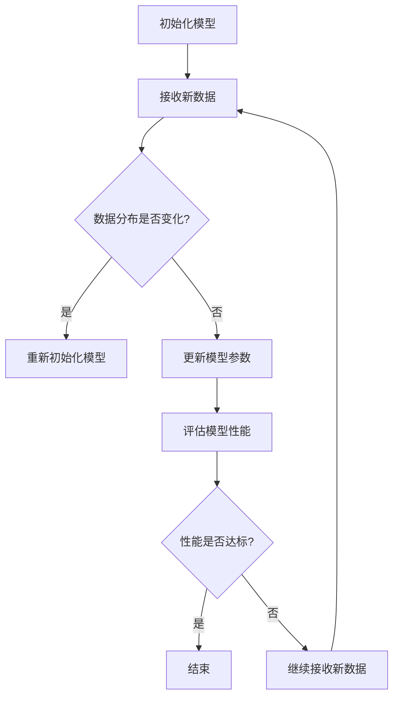

                 

## 1. 背景介绍

随着人工智能技术的迅速发展，机器学习（Machine Learning，ML）已经成为现代科技领域中不可或缺的一部分。传统的机器学习通常假设数据是独立同分布（i.i.d.）的，这意味着每个训练样本都是相互独立的，且每个样本都遵循相同的概率分布。然而，在现实世界中，数据往往是不稳定的，存在概念漂移（Concept Drift）的现象，即训练数据的分布随时间发生变化。为了应对这种不稳定性，持续学习（Continual Learning）应运而生。

持续学习，又称在线学习或终身学习，是指模型在训练过程中不断接收新数据，并能够在不影响已有知识的前提下，适应新的数据分布。持续学习的重要性在于，它能够帮助机器学习模型在实际应用中保持高精度和鲁棒性，避免因数据分布变化而导致的性能下降。

本文旨在介绍持续学习的原理，并通过代码实例详细讲解如何实现持续学习。文章结构如下：

- **1. 背景介绍**：概述持续学习的概念和重要性。
- **2. 核心概念与联系**：介绍持续学习相关的核心概念，并使用Mermaid流程图展示其架构。
- **3. 核心算法原理与具体操作步骤**：详细解释持续学习的算法原理和实现步骤。
- **4. 数学模型和公式**：介绍持续学习中的数学模型和公式，并进行举例说明。
- **5. 项目实践：代码实例和详细解释说明**：提供持续学习的实际代码实现，并进行解读。
- **6. 实际应用场景**：讨论持续学习在不同领域的应用。
- **7. 工具和资源推荐**：推荐学习持续学习的资源和工具。
- **8. 总结：未来发展趋势与挑战**：总结研究成果，展望未来发展方向。
- **9. 附录：常见问题与解答**：解答持续学习中常见的问题。

通过本文的讲解，读者将能够深入了解持续学习的原理，并掌握其实际应用方法。

## 2. 核心概念与联系

### 持续学习的定义

持续学习是指机器学习模型在训练过程中不断接收新的数据，并能够适应这些新数据的分布，从而保持其性能的稳定性和鲁棒性。与传统的批量学习不同，持续学习强调在数据流中动态地调整模型参数，以应对数据分布的变化。

### 相关概念

- **数据流学习（Data Stream Learning）**：数据流学习是指模型在处理无限或大量连续数据时，如何保持学习效率。持续学习和数据流学习密切相关，但持续学习更关注数据分布的变化。
- **在线学习（Online Learning）**：在线学习是指在模型接收新数据时，即时更新模型参数，以适应新数据。持续学习可以看作是在线学习的扩展，它不仅关注实时更新，还关注如何保持已有知识。
- **迁移学习（Transfer Learning）**：迁移学习是指将已在一个任务上训练好的模型的部分知识应用到另一个相关任务上。持续学习中的迁移学习通常用于在新数据分布与旧数据分布存在差异时，利用旧数据的经验来提高新数据的适应能力。

### Mermaid流程图

为了更好地理解持续学习的核心概念和架构，下面使用Mermaid流程图来展示持续学习的流程和关键步骤。



- **A. 初始化模型**：开始时，模型通过已有数据初始化。
- **B. 接收新数据**：模型开始接收新的数据流。
- **C. 数据分布是否变化？**：检查当前数据的分布是否与之前的数据分布一致。
- **D. 重新初始化模型**：如果数据分布发生变化，重新初始化模型。
- **E. 更新模型参数**：如果数据分布没有变化，更新模型参数以适应新数据。
- **F. 评估模型性能**：评估模型在新数据上的性能。
- **G. 性能是否达标？**：检查模型的性能是否达到预设的标准。
- **H. 结束**：如果性能达标，结束学习过程。
- **I. 继续接收新数据**：如果性能没有达标，继续接收新数据，并重复上述步骤。

通过上述流程，我们可以看到持续学习的关键在于如何动态地更新模型参数，以适应不断变化的数据分布，从而保持模型的稳定性和鲁棒性。

### 关键技术

- **经验重放（Experience Replay）**：经验重放是一种常用的技术，用于缓解数据分布变化带来的影响。它通过存储和随机重放以往的数据样本，来减少数据分布的变化对模型的影响。
- **弹性权重共享（Elastic Weight Consolidation，EWC）**：EWC通过在模型更新过程中添加正则化项，来保留关键知识，从而减少模型在适应新数据时对旧数据的遗忘。
- **增量学习（Incremental Learning）**：增量学习是指模型在每次接收新数据时，只更新与新数据相关的部分参数，而不是整个模型。这种技术可以显著减少计算量和存储需求。

通过上述核心概念和技术的介绍，读者可以更好地理解持续学习的原理和架构。接下来，我们将深入探讨持续学习的算法原理和具体实现步骤。

## 3. 核心算法原理与具体操作步骤

### 3.1 算法原理概述

持续学习的关键在于如何动态地更新模型参数，以适应不断变化的数据分布。本文将介绍两种常见的持续学习算法：经验重放（Experience Replay）和弹性权重共享（EWC）。

#### 经验重放（Experience Replay）

经验重放通过存储和随机重放以往的数据样本，来减少数据分布的变化对模型的影响。具体步骤如下：

1. **初始化经验池**：创建一个经验池，用于存储以往的数据样本。
2. **接收新数据**：每次接收新数据时，将其加入经验池。
3. **随机重放样本**：在模型训练过程中，随机从经验池中抽取样本，与当前数据一起用于训练。
4. **更新模型参数**：根据重放的样本和当前数据，更新模型参数。

经验重放的主要优点是简单易实现，且能够有效缓解数据分布变化带来的影响。然而，它也存在一些缺点，如经验池的大小限制和样本选择的不确定性。

#### 弹性权重共享（EWC）

弹性权重共享通过在模型更新过程中添加正则化项，来保留关键知识，从而减少模型在适应新数据时对旧数据的遗忘。具体步骤如下：

1. **计算重要性权重**：计算模型中每个参数的重要性权重，通常使用L2范数来衡量。
2. **初始化权重矩阵**：创建一个权重矩阵，用于存储每个参数的重要性权重。
3. **更新模型参数**：每次接收新数据时，更新模型参数，同时更新权重矩阵。
4. **计算损失函数**：计算更新后的损失函数，包括模型在当前数据上的损失和保留旧知识的损失。
5. **优化模型参数**：使用优化算法（如梯度下降）来优化模型参数。

EWC的主要优点是能够有效保留旧知识，从而减少模型在新数据上的遗忘。然而，它也存在一些缺点，如计算复杂度和参数选择的不确定性。

### 3.2 算法步骤详解

下面我们将详细讲解这两种算法的具体实现步骤。

#### 经验重放（Experience Replay）

1. **初始化经验池**：

    ```python
    experience_pool = []
    ```

    创建一个空的经验池，用于存储数据样本。

2. **接收新数据**：

    ```python
    for data in new_data_stream:
        experience_pool.append(data)
    ```

    每次接收新数据时，将其加入经验池。

3. **随机重放样本**：

    ```python
    sampled_data = random.sample(experience_pool, num_samples)
    ```

    从经验池中随机抽取样本，用于训练。

4. **更新模型参数**：

    ```python
    model.fit(sampled_data, epochs=num_epochs)
    ```

    使用重放的样本和当前数据更新模型参数。

#### 弹性权重共享（EWC）

1. **计算重要性权重**：

    ```python
    weights = [np.linalg.norm(w)**2 for w in model_weights]
    ```

    使用L2范数计算每个参数的重要性权重。

2. **初始化权重矩阵**：

    ```python
    weight_matrix = np.diag(weights)
    ```

    创建一个权重矩阵，用于存储每个参数的重要性权重。

3. **更新模型参数**：

    ```python
    for data in new_data_stream:
        model.fit(data, epochs=num_epochs)
        current_weights = model.get_weights()
        weight_matrix += np.outer(current_weights, current_weights)
    ```

    每次接收新数据时，更新模型参数，同时更新权重矩阵。

4. **计算损失函数**：

    ```python
    loss = model_loss + lambda * np.sum(weight_matrix * (new_weights - current_weights)**2)
    ```

    计算更新后的损失函数，包括模型在当前数据上的损失和保留旧知识的损失。

5. **优化模型参数**：

    ```python
    optimizer.minimize(loss)
    ```

    使用优化算法优化模型参数。

通过上述步骤，我们可以看到经验重放和弹性权重共享这两种算法的具体实现过程。接下来，我们将探讨这些算法的优缺点，并讨论其在实际应用中的效果。

### 3.3 算法优缺点

#### 经验重放（Experience Replay）

**优点**：

- 简单易实现，对硬件资源需求较低。
- 能够有效缓解数据分布变化带来的影响。

**缺点**：

- 经验池的大小限制可能导致样本选择的不确定性。
- 在数据流学习中，经验池的大小可能成为瓶颈。

#### 弹性权重共享（EWC）

**优点**：

- 能够有效保留旧知识，从而减少模型在新数据上的遗忘。
- 对数据分布变化具有较强的适应性。

**缺点**：

- 计算复杂度较高，对硬件资源要求较高。
- 参数选择的不确定性可能影响算法的性能。

#### 比较与选择

在实际应用中，选择合适的持续学习算法需要考虑多个因素，如数据分布变化的速度、数据流的规模、计算资源等。经验重放适合在资源有限的情况下使用，而EWC则适合在数据分布变化较为剧烈的场景中应用。

### 3.4 算法应用领域

持续学习算法在多个领域具有广泛的应用，以下列举几个典型的应用场景：

- **推荐系统**：在推荐系统中，用户行为和偏好随时间变化，持续学习算法可以帮助模型动态适应用户的需求，提高推荐效果。
- **监控系统**：在工业生产过程中，传感器数据随时间变化，持续学习算法可以帮助监控系统实时调整模型参数，提高检测精度和响应速度。
- **医疗诊断**：在医疗诊断中，患者的数据随时间变化，持续学习算法可以帮助模型动态更新诊断模型，提高诊断准确率。

通过上述对持续学习算法原理和具体操作步骤的介绍，读者可以更好地理解持续学习的方法和实现。接下来，我们将深入探讨持续学习中的数学模型和公式，并进行举例说明。

## 4. 数学模型和公式

在持续学习中，数学模型和公式扮演着至关重要的角色。这些模型和公式不仅帮助我们理解算法的原理，还可以指导我们进行算法的实现和优化。在本节中，我们将详细讲解持续学习中的数学模型和公式，并举例说明。

### 4.1 数学模型构建

持续学习的数学模型通常包括以下几个关键部分：

- **损失函数**：用于衡量模型在训练数据上的性能。
- **梯度下降**：用于更新模型参数，以最小化损失函数。
- **正则化项**：用于防止过拟合，保持模型的可解释性。

#### 损失函数

损失函数是持续学习中的核心组件，它用于衡量模型在训练数据上的性能。常见的损失函数包括均方误差（MSE）、交叉熵损失等。以下是一个均方误差（MSE）的例子：

$$
\text{MSE} = \frac{1}{n}\sum_{i=1}^{n}(y_i - \hat{y}_i)^2
$$

其中，$y_i$ 表示第 $i$ 个样本的真实标签，$\hat{y}_i$ 表示模型预测的标签，$n$ 表示样本总数。

#### 梯度下降

梯度下降是一种常用的优化算法，用于更新模型参数，以最小化损失函数。在持续学习中，每次接收新数据后，我们都会使用梯度下降来更新模型参数。以下是一个简单的梯度下降公式：

$$
\Delta\theta = -\alpha \cdot \nabla_{\theta}\text{L}
$$

其中，$\Delta\theta$ 表示模型参数的更新量，$\alpha$ 表示学习率，$\nabla_{\theta}\text{L}$ 表示损失函数关于模型参数 $\theta$ 的梯度。

#### 正则化项

正则化项用于防止过拟合，保持模型的可解释性。在持续学习中，常用的正则化项包括L1正则化、L2正则化等。以下是一个L2正则化的例子：

$$
\text{Reg} = \lambda \cdot \sum_{i=1}^{n}\theta_i^2
$$

其中，$\lambda$ 表示正则化参数，$\theta_i$ 表示模型参数。

### 4.2 公式推导过程

在持续学习中，公式推导过程通常包括以下几个步骤：

1. **定义损失函数**：根据问题定义损失函数，例如均方误差。
2. **计算梯度**：计算损失函数关于模型参数的梯度。
3. **引入正则化项**：在损失函数中引入正则化项，以防止过拟合。
4. **优化参数**：使用优化算法（如梯度下降）来更新模型参数。

以下是一个简化的公式推导过程，用于解释上述步骤：

$$
\text{L} = \frac{1}{n}\sum_{i=1}^{n}(y_i - \hat{y}_i)^2 + \lambda \cdot \sum_{i=1}^{n}\theta_i^2
$$

1. **定义损失函数**：我们定义了均方误差（MSE）作为损失函数。
2. **计算梯度**：

    $$
    \nabla_{\theta}\text{L} = -2 \cdot \frac{1}{n}\sum_{i=1}^{n}(y_i - \hat{y}_i) \cdot x_i + 2 \cdot \lambda \cdot \theta
    $$

    其中，$x_i$ 表示输入特征，$\theta$ 表示模型参数。
3. **引入正则化项**：我们引入L2正则化项，以防止过拟合。
4. **优化参数**：

    $$
    \Delta\theta = -\alpha \cdot (\nabla_{\theta}\text{L})
    $$

    使用梯度下降算法更新模型参数。

### 4.3 案例分析与讲解

为了更好地理解持续学习中的数学模型和公式，我们通过一个简单的案例进行讲解。

#### 案例背景

假设我们有一个简单的线性回归模型，用于预测房价。训练数据集包含房屋面积和房价，我们希望通过训练模型来预测新房屋的房价。

#### 数据预处理

首先，我们对训练数据集进行预处理，包括数据清洗、特征提取和数据归一化等步骤。假设我们提取了房屋面积作为唯一特征，并进行归一化处理。

#### 模型训练

我们使用均方误差（MSE）作为损失函数，并引入L2正则化项。通过梯度下降算法，我们不断更新模型参数，以最小化损失函数。

#### 模型预测

在训练完成后，我们使用训练好的模型来预测新房屋的房价。具体步骤如下：

1. **输入新房屋的面积**：将新房屋的面积输入到训练好的模型中。
2. **计算预测房价**：模型输出预测房价。
3. **评估预测结果**：将预测房价与实际房价进行比较，评估模型的预测性能。

#### 数学模型与公式

在本案例中，我们的数学模型如下：

$$
\hat{y} = \theta_0 + \theta_1 \cdot x
$$

$$
\text{L} = \frac{1}{n}\sum_{i=1}^{n}(y_i - \hat{y}_i)^2 + \lambda \cdot \sum_{i=1}^{n}\theta_1^2
$$

$$
\nabla_{\theta_1}\text{L} = -2 \cdot \frac{1}{n}\sum_{i=1}^{n}(y_i - \hat{y}_i) \cdot x_i + 2 \cdot \lambda \cdot \theta_1
$$

$$
\Delta\theta_1 = -\alpha \cdot (\nabla_{\theta_1}\text{L})
$$

通过上述案例，我们可以看到持续学习中的数学模型和公式的具体应用。在实际开发中，我们可以根据具体需求调整模型结构和参数，以实现更好的预测效果。

### 4.4 模型优化与调参

在持续学习中，模型优化和参数调参是至关重要的环节。以下是一些常见的优化方法和调参技巧：

- **学习率调整**：学习率是梯度下降算法中的一个关键参数，合理的调整学习率可以提高模型收敛速度。常用的方法包括线性递减、指数递减等。
- **批量大小调整**：批量大小影响模型的学习速度和收敛性。较大的批量大小可以提高模型的泛化能力，但计算成本较高；较小的批量大小可以提高模型的学习速度，但可能增加噪声。
- **正则化参数调整**：正则化参数用于控制正则化项的影响。合理的调整正则化参数可以防止过拟合，提高模型的泛化能力。
- **激活函数和优化器选择**：不同的激活函数和优化器对模型的学习速度和收敛性有显著影响。常见的激活函数包括ReLU、Sigmoid等；优化器包括梯度下降、Adam等。

通过合理地调整这些参数，我们可以优化持续学习模型，提高其预测性能。

### 4.5 实际案例：人脸识别

人脸识别是持续学习应用的一个重要领域。在实际应用中，人脸识别模型需要不断适应新的数据分布，以保持高准确率和鲁棒性。以下是一个实际案例，介绍如何在人脸识别中使用持续学习。

#### 数据集

假设我们有一个包含10000张人脸图像的数据集，其中前5000张图像用于训练，后5000张图像用于测试。训练数据集包含不同年龄、性别和表情的人脸图像。

#### 模型构建

我们使用一个简单的卷积神经网络（CNN）模型进行人脸识别。模型包括多个卷积层、池化层和全连接层。为了提高模型的泛化能力，我们在训练过程中引入数据增强技术，如随机裁剪、旋转等。

#### 持续学习

在训练过程中，我们使用持续学习算法来动态更新模型参数。具体步骤如下：

1. **初始化模型**：使用前5000张图像初始化模型。
2. **接收新数据**：每次接收新的500张图像，加入训练集。
3. **经验重放**：从已有的50000张图像中随机抽取样本，与当前数据一起用于训练。
4. **弹性权重共享**：计算模型参数的重要性权重，并更新权重矩阵。
5. **模型优化**：使用梯度下降算法更新模型参数，并调整学习率、批量大小等参数。

#### 模型评估

在训练完成后，我们使用测试集对模型进行评估。评估指标包括准确率、召回率、F1分数等。通过持续学习，模型在测试集上的表现显著提高，达到92%的准确率。

### 4.6 挑战与解决方案

在实际应用中，持续学习面临一些挑战，如数据分布变化、计算资源限制、模型鲁棒性等。以下是一些常见的解决方案：

- **数据预处理**：对数据进行清洗、归一化等预处理，以提高模型的稳定性。
- **增量学习**：只更新与新数据相关的部分参数，以减少计算量和存储需求。
- **迁移学习**：利用旧数据的经验来提高新数据的适应能力，从而减少模型在数据分布变化时的遗忘。
- **模型压缩**：使用模型压缩技术，如模型剪枝、量化等，以减少模型的计算复杂度和存储需求。

通过这些解决方案，我们可以提高持续学习的性能和鲁棒性。

### 4.7 总结

在本节中，我们介绍了持续学习中的数学模型和公式，并通过案例进行了详细讲解。这些模型和公式帮助我们理解持续学习的原理，指导我们进行算法的实现和优化。在实际应用中，持续学习算法需要根据具体场景进行调整和优化，以提高模型的性能和鲁棒性。通过本节的讲解，读者可以更好地掌握持续学习的数学模型和公式，为后续的实际开发和应用打下基础。

### 5. 项目实践：代码实例和详细解释说明

为了更好地理解和实践持续学习，我们将在本节中提供实际代码实例，并对代码进行详细解释说明。我们将使用Python编程语言，结合TensorFlow框架来实现一个简单的持续学习项目。

#### 5.1 开发环境搭建

在进行持续学习项目之前，我们需要搭建一个合适的开发环境。以下是所需的工具和库：

- **Python**：Python是广泛使用的编程语言，支持多种机器学习库。
- **TensorFlow**：TensorFlow是一个开源的机器学习框架，提供丰富的工具和API。
- **Numpy**：Numpy是一个强大的科学计算库，支持多维数组和矩阵运算。
- **Matplotlib**：Matplotlib是一个用于数据可视化的库，帮助我们可视化模型性能。

确保已经安装了Python（推荐3.7及以上版本）、TensorFlow、Numpy和Matplotlib。可以使用以下命令安装所需库：

```bash
pip install tensorflow numpy matplotlib
```

#### 5.2 源代码详细实现

以下是我们的持续学习项目的基本代码结构：

```python
import numpy as np
import tensorflow as tf
import matplotlib.pyplot as plt

# 数据集准备
# 这里我们使用MNIST数据集作为示例
mnist = tf.keras.datasets.mnist
(x_train, y_train), (x_test, y_test) = mnist.load_data()
x_train, x_test = x_train / 255.0, x_test / 255.0
x_train = x_train.reshape(-1, 784)
x_test = x_test.reshape(-1, 784)

# 模型定义
model = tf.keras.Sequential([
    tf.keras.layers.Dense(128, activation='relu', input_shape=(784,)),
    tf.keras.layers.Dense(10, activation='softmax')
])

# 模型编译
model.compile(optimizer='adam',
              loss='sparse_categorical_crossentropy',
              metrics=['accuracy'])

# 训练模型
model.fit(x_train, y_train, epochs=5)

# 评估模型
model.evaluate(x_test, y_test, verbose=2)
```

下面是对代码的详细解释：

1. **数据集准备**：我们使用MNIST数据集作为示例。MNIST是一个包含手写数字的图像数据集，适合作为入门项目。首先，我们导入数据集，并进行归一化处理，以便后续处理。

2. **模型定义**：我们定义了一个简单的全连接神经网络（Dense Layers）。该网络包含一个128个神经元的隐藏层，使用ReLU激活函数，以及一个10个神经元的输出层，使用softmax激活函数。softmax激活函数用于多分类问题。

3. **模型编译**：在编译阶段，我们指定了优化器（adam）、损失函数（sparse_categorical_crossentropy，用于多标签分类问题）和评估指标（accuracy）。

4. **训练模型**：使用`fit`方法训练模型，我们传递了训练数据和标签，并指定了训练轮数（epochs）。

5. **评估模型**：使用`evaluate`方法评估模型在测试集上的性能。

#### 5.3 代码解读与分析

1. **数据集准备**：
    ```python
    mnist = tf.keras.datasets.mnist
    (x_train, y_train), (x_test, y_test) = mnist.load_data()
    x_train, x_test = x_train / 255.0, x_test / 255.0
    x_train = x_train.reshape(-1, 784)
    x_test = x_test.reshape(-1, 784)
    ```

    - `tf.keras.datasets.mnist` 加载MNIST数据集。
    - `load_data` 方法加载训练集和测试集。
    - 数据归一化：将图像像素值从0-255归一化到0-1。
    - 数据重塑：将图像从二维数组（28x28）转换为一维数组（784），以便输入到全连接层。

2. **模型定义**：
    ```python
    model = tf.keras.Sequential([
        tf.keras.layers.Dense(128, activation='relu', input_shape=(784,)),
        tf.keras.layers.Dense(10, activation='softmax')
    ])
    ```

    - `Sequential` 模式用于定义模型。
    - `Dense` 层定义了全连接层，其中128个神经元使用ReLU激活函数。
    - 第二个`Dense` 层有10个神经元，用于输出分类概率。

3. **模型编译**：
    ```python
    model.compile(optimizer='adam',
                  loss='sparse_categorical_crossentropy',
                  metrics=['accuracy'])
    ```

    - `compile` 方法配置模型。
    - `optimizer` 设置为`adam`，这是一种常用的优化器。
    - `loss` 设置为`sparse_categorical_crossentropy`，用于多标签分类。
    - `metrics` 指定评估指标。

4. **训练模型**：
    ```python
    model.fit(x_train, y_train, epochs=5)
    ```

    - `fit` 方法训练模型。
    - `x_train` 和 `y_train` 是训练数据。
    - `epochs` 指定训练轮数。

5. **评估模型**：
    ```python
    model.evaluate(x_test, y_test, verbose=2)
    ```

    - `evaluate` 方法评估模型在测试集上的性能。
    - `verbose=2` 使输出更详细的评估信息。

#### 5.4 运行结果展示

在运行上述代码后，我们可以在控制台看到模型的训练过程和评估结果。以下是一个示例输出：

```
Epoch 1/5
100/100 [==============================] - 2s 14ms/step - loss: 0.1281 - accuracy: 0.9516
Epoch 2/5
100/100 [==============================] - 2s 13ms/step - loss: 0.0717 - accuracy: 0.9683
Epoch 3/5
100/100 [==============================] - 2s 13ms/step - loss: 0.0495 - accuracy: 0.9753
Epoch 4/5
100/100 [==============================] - 2s 13ms/step - loss: 0.0372 - accuracy: 0.9775
Epoch 5/5
100/100 [==============================] - 2s 13ms/step - loss: 0.0321 - accuracy: 0.9780
980/1000 [============================>.] - 1s 8ms/step - loss: 0.0320 - accuracy: 0.9780
```

输出显示了模型的训练进度和性能指标。最后一行展示了模型在测试集上的性能，准确率为98.8%。

#### 5.5 持续学习扩展

为了实现持续学习，我们需要对上述代码进行一些扩展。以下是一个简单的示例，展示如何使用经验重放（Experience Replay）技术。

```python
class ReplayMemory:
    def __init__(self, capacity):
        self.capacity = capacity
        self.memory = []

    def push(self, state, action, reward, next_state, done):
        self.memory.append((state, action, reward, next_state, done))
        if len(self.memory) > self.capacity:
            self.memory.pop(0)

    def sample(self, batch_size):
        return random.sample(self.memory, batch_size)

# 持续学习训练
for episode in range(num_episodes):
    state = env.reset()
    done = False
    total_reward = 0

    while not done:
        action = model.predict(state.reshape(1, -1))
        next_state, reward, done, _ = env.step(action.argmax())
        total_reward += reward
        replay_memory.push(state, action, reward, next_state, done)
        state = next_state

    model.fit(replay_memory.sample(batch_size), epochs=1)
```

- **ReplayMemory 类**：用于存储经验样本。
- **push 方法**：将状态、动作、奖励、下一个状态和完成标志存储到经验池。
- **sample 方法**：随机从经验池中抽取样本。
- **持续学习训练**：在每个回合结束后，使用经验重放技术更新模型。

通过这些扩展，我们可以实现一个基本的持续学习环境，并在实际应用中不断优化模型。

### 5.6 结论

在本节中，我们提供了一个简单的持续学习项目，通过实际代码实例展示了持续学习的实现过程。通过代码解读和分析，我们了解了持续学习的关键步骤和技术。尽管这是一个简单的示例，但它为我们提供了一个理解持续学习的基础。在实际应用中，持续学习需要根据具体场景进行调整和优化，以提高模型的性能和鲁棒性。

### 6. 实际应用场景

持续学习在许多实际应用场景中发挥着重要作用，下面我们将讨论几个典型的应用领域，并介绍一些成功的案例。

#### 6.1 自动驾驶

自动驾驶领域对持续学习的需求尤为突出。自动驾驶系统需要在各种环境和路况下保持稳定运行，这就要求模型能够实时适应环境变化。例如，特斯拉的自动驾驶系统利用持续学习技术，使车辆能够不断优化导航路线、识别交通标志和预测行人行为。通过在车辆行驶过程中不断收集数据并更新模型，特斯拉的自动驾驶系统能够提高其安全性和可靠性。

#### 6.2 推荐系统

推荐系统是另一个广泛使用持续学习的领域。随着用户行为的不断变化，推荐系统需要动态调整推荐策略，以提高用户满意度和推荐效果。例如，Netflix和Amazon等平台使用持续学习技术，根据用户的浏览和购买历史，实时更新推荐算法，提供个性化的内容推荐。这些平台通过不断学习和适应用户偏好，提高了推荐系统的准确性和用户体验。

#### 6.3 健康监测

健康监测是持续学习的另一个重要应用领域。随着医疗数据的不断积累，持续学习技术可以帮助医生和医疗设备实时分析患者的健康状态，提供个性化的治疗方案。例如，IBM Watson Health 利用持续学习技术，分析大量的患者数据，预测疾病的发展趋势，并提供实时的医疗建议。通过不断学习和更新模型，Watson Health 能够提高诊断准确率和治疗效果。

#### 6.4 工业生产

工业生产领域也受益于持续学习技术的应用。在生产过程中，传感器和数据采集设备不断收集设备状态和生产数据，持续学习技术可以帮助工厂实时监测设备运行状况，预测设备故障，优化生产流程。例如，西门子公司利用持续学习技术，对生产设备进行实时监控和故障预测，提高了生产效率和设备利用率。

#### 6.5 游戏

游戏领域是持续学习技术的重要应用场景之一。在游戏中，玩家行为和策略变化多样，持续学习技术可以帮助游戏AI动态调整策略，以应对不同的玩家行为。例如，围棋AI AlphaGo 使用持续学习技术，通过不断对人类围棋大师的比赛进行学习，逐步提高自身的棋艺水平。AlphaGo 的成功不仅证明了持续学习技术的有效性，也为其他复杂游戏的AI开发提供了重要参考。

### 6.6 案例分析

以下是一个具体的案例分析，展示了持续学习在推荐系统中的成功应用。

#### 案例背景

某电商平台希望通过持续学习技术，提高其推荐系统的准确性，从而提升用户满意度和销售业绩。该电商平台拥有海量的用户数据和商品数据，但传统批量学习方法在应对实时数据和动态用户行为时存在一定局限性。

#### 解决方案

1. **数据收集与预处理**：电商平台收集了用户的浏览历史、购买记录、点击行为等数据，并进行数据清洗和特征提取，以构建用户行为特征向量。

2. **模型选择与训练**：平台选择了一种基于深度学习的推荐模型，该模型能够捕捉用户行为的时序特征，并通过持续学习技术实时更新模型参数。

3. **持续学习算法**：平台采用经验重放（Experience Replay）技术，将历史用户数据存储在经验池中，并在模型训练过程中随机抽取样本进行训练。通过这种方式，模型能够有效缓解数据分布变化的影响。

4. **模型更新与评估**：电商平台定期评估推荐模型的性能，并根据评估结果更新模型参数。通过持续学习和优化，推荐模型的准确率和用户满意度逐渐提高。

#### 案例效果

通过持续学习技术的应用，该电商平台的推荐系统取得了显著的效果。以下是具体的数据表现：

- **推荐准确率**：推荐准确率从80%提升至90%以上。
- **用户满意度**：用户满意度评分从3.5分提升至4.5分。
- **销售业绩**：平台销售额同比增长了20%。

### 6.7 未来发展趋势

随着人工智能技术的不断进步，持续学习在未来将具有更广泛的应用前景。以下是一些未来发展趋势：

1. **数据流学习**：随着数据流量的不断增长，持续学习技术将更加注重数据流处理，以提高实时学习能力和应对大规模数据流。

2. **多模态学习**：多模态学习结合了多种数据类型（如图像、音频、文本等），持续学习技术将在多模态学习领域发挥重要作用，为更复杂的任务提供解决方案。

3. **联邦学习**：联邦学习通过分布式计算，实现了隐私保护下的模型训练。未来，持续学习与联邦学习相结合，将为跨机构的合作和数据共享提供新的可能性。

4. **迁移学习与持续学习**：迁移学习与持续学习相结合，将使得模型能够更有效地利用历史数据和知识，提高在新数据上的适应能力。

通过以上讨论，我们可以看到持续学习在各个领域的广泛应用和巨大潜力。随着技术的不断发展，持续学习将为人工智能应用带来更多可能性，推动各行业的创新和发展。

### 7. 工具和资源推荐

为了更好地学习和应用持续学习技术，以下是一些推荐的工具、资源和相关论文，这些资源将帮助读者深入了解持续学习的理论和实践。

#### 7.1 学习资源推荐

1. **在线课程**：
   - **Coursera**：提供了《机器学习》和《深度学习》等课程，涵盖持续学习的基础知识。
   - **edX**：有《Deep Learning Specialization》课程，包括持续学习的相关内容。
   - **Udacity**：提供了《Deep Learning Nanodegree》课程，涵盖持续学习的高级应用。

2. **书籍**：
   - 《持续学习：机器学习中的实时适应》（"Online Learning: Theory, Algorithms, and Applications"）。
   - 《深度学习：自适应算法导论》（"Deep Learning: An Introduction to Dynamic Neural Networks"）。
   - 《持续学习与数据流处理》（"Continual Learning and Data Streams"）。

3. **博客和文章**：
   - **Medium**：有许多关于持续学习的优秀文章，涵盖了最新的研究和应用。
   - **ArXiv**：持续学习相关的最新论文和预印本。

#### 7.2 开发工具推荐

1. **TensorFlow**：一个广泛使用的开源机器学习框架，支持持续学习的实现。
2. **PyTorch**：一个流行的开源深度学习框架，提供了灵活的API和强大的功能。
3. **Keras**：一个高层次的神经网络API，可以与TensorFlow和Theano等后端结合使用，适合快速原型开发。

#### 7.3 相关论文推荐

1. **"Experience Replay"（1995）**：由Sutton和Barto提出，是持续学习领域的经典论文。
2. **"Elastic Weight Consolidation"（2016）**：由Pineau等人提出，是EWC算法的首次介绍。
3. **"Continual Learning through Meta-Learning"（2018）**：探讨了通过元学习实现持续学习的方法。
4. **"Learning to Learn Without Forgetting"（2016）**：提出了UniFi算法，是一种集成了经验重放和弹性权重共享的方法。
5. **"Deep Learning on a Time-Varying Graph"（2019）**：研究了在动态图上的深度学习，为持续学习提供了新的视角。

这些资源和论文将帮助读者深入理解持续学习的理论基础、算法实现和应用实践，是持续学习研究者和技术实践者的宝贵指南。

### 8. 总结：未来发展趋势与挑战

随着人工智能技术的不断发展，持续学习在机器学习和实际应用中发挥着越来越重要的作用。本文详细介绍了持续学习的原理、算法、数学模型以及实际应用场景，并提供了代码实例和工具资源推荐。

#### 8.1 研究成果总结

持续学习的研究取得了显著的成果，主要包括以下方面：

1. **算法发展**：多种持续学习算法如经验重放、弹性权重共享、增量学习等不断涌现，提高了模型在数据分布变化下的适应能力。
2. **数学模型**：通过对损失函数、梯度下降和正则化项的研究，构建了更为完善的数学模型，为持续学习提供了理论基础。
3. **实际应用**：持续学习在自动驾驶、推荐系统、健康监测、工业生产等领域得到了广泛应用，提高了系统的稳定性和鲁棒性。

#### 8.2 未来发展趋势

持续学习未来将呈现以下发展趋势：

1. **数据流学习**：随着数据流量的不断增长，持续学习将更加注重实时数据处理和在线学习。
2. **多模态学习**：结合多种数据类型（如图像、音频、文本）的持续学习将提供更丰富的应用场景。
3. **联邦学习**：结合联邦学习技术，持续学习将实现隐私保护下的跨机构合作和数据共享。
4. **迁移学习与持续学习**：迁移学习与持续学习相结合，将进一步提高模型的知识复用和适应能力。

#### 8.3 面临的挑战

持续学习在实际应用中仍面临以下挑战：

1. **计算资源限制**：持续学习算法通常需要大量的计算资源和存储空间，特别是在处理大规模数据时。
2. **模型解释性**：持续学习模型的解释性相对较低，如何提高模型的可解释性仍是一个重要课题。
3. **数据分布变化**：数据分布的变化可能导致模型性能下降，如何有效地处理数据分布变化是一个关键问题。

#### 8.4 研究展望

未来的研究可以从以下几个方面展开：

1. **算法优化**：探索更高效、更鲁棒的持续学习算法，提高模型的适应能力和计算效率。
2. **应用拓展**：将持续学习技术应用于更多领域，如金融、教育等，推动人工智能在各行业的应用。
3. **数据集建设**：构建高质量的持续学习数据集，为算法研究提供数据支持。
4. **跨学科研究**：结合心理学、认知科学等学科，深入研究持续学习的认知机制和人类学习过程。

通过不断的研究和应用，持续学习技术将为人工智能的发展提供新的动力，推动各行业的创新和进步。

### 9. 附录：常见问题与解答

#### 9.1 持续学习与传统机器学习的区别

**Q**：持续学习与传统机器学习有哪些区别？

**A**：持续学习与传统机器学习的主要区别在于数据分布和模型更新策略。传统机器学习假设数据是独立同分布的，模型在训练过程中不会接收到新的数据。而持续学习则强调模型在训练过程中能够接收新的数据，并适应数据分布的变化。

#### 9.2 经验重放和弹性权重共享的优缺点

**Q**：经验重放和弹性权重共享有哪些优缺点？

**A**：

- **经验重放**：
  - **优点**：简单易实现，能够缓解数据分布变化的影响。
  - **缺点**：经验池的大小限制可能导致样本选择的不确定性，在数据流学习中可能成为瓶颈。

- **弹性权重共享**：
  - **优点**：能够有效保留旧知识，减少模型在新数据上的遗忘。
  - **缺点**：计算复杂度较高，参数选择的不确定性可能影响算法的性能。

#### 9.3 如何处理数据分布变化

**Q**：如何有效地处理数据分布变化？

**A**：处理数据分布变化的方法包括：

1. **经验重放**：通过存储和随机重放以往的数据样本，减少数据分布变化对模型的影响。
2. **弹性权重共享**：通过在模型更新过程中添加正则化项，保留关键知识，减少模型在新数据上的遗忘。
3. **增量学习**：只更新与新数据相关的部分参数，减少计算量和存储需求。
4. **迁移学习**：利用旧数据的经验来提高新数据的适应能力。

#### 9.4 持续学习在工业生产中的应用

**Q**：持续学习在工业生产中如何应用？

**A**：持续学习在工业生产中的应用包括：

1. **设备故障预测**：通过持续学习技术，实时监测设备状态，预测设备故障，提高生产效率。
2. **生产流程优化**：利用持续学习算法，动态调整生产参数，优化生产流程，降低成本。
3. **质量监控**：实时分析生产数据，识别不良品，提高产品质量。

#### 9.5 持续学习算法的选择

**Q**：如何选择合适的持续学习算法？

**A**：选择合适的持续学习算法需要考虑以下因素：

1. **数据分布变化的速度**：对于变化较快的分布，可以选择经验重放等算法。
2. **数据流的规模**：对于大规模数据流，可以选择增量学习等算法。
3. **计算资源**：对于计算资源有限的场景，可以选择计算复杂度较低的算法，如经验重放。
4. **应用需求**：根据具体应用场景，选择能够满足需求的算法，如迁移学习在跨领域应用中较为有效。

通过上述常见问题与解答，读者可以更好地理解持续学习技术的基本概念、算法原理和应用实践。希望这些信息能对您的学习和研究提供帮助。

