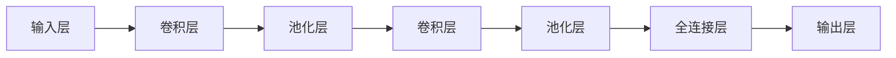

                 

关键词：卷积神经网络，CNN，深度学习，图像识别，神经网络架构，编程实战

摘要：本文将深入讲解卷积神经网络（CNN）的基本原理、架构设计以及在实际图像识别任务中的应用。通过实例代码的实战，读者将了解如何使用CNN模型进行图像分类，并掌握相关编程技巧。文章旨在帮助读者理解和应用CNN，为深度学习领域的研究和应用奠定基础。

## 1. 背景介绍

### 1.1 卷积神经网络的发展历程

卷积神经网络（Convolutional Neural Networks，CNN）起源于20世纪80年代末到90年代初，最初是由Yann LeCun等科学家提出并应用于手写数字识别任务。随着计算能力的提升和深度学习理论的进步，CNN逐渐成为图像识别领域的主流技术。

### 1.2 CNN在图像识别中的重要性

图像识别是计算机视觉领域的核心任务之一。CNN能够通过多层神经网络的结构，自动学习图像中的特征，从而实现高精度的图像分类。相比传统的图像处理方法，CNN在图像识别任务上展现出了更高的准确率和更强的泛化能力。

## 2. 核心概念与联系

### 2.1 卷积层（Convolutional Layer）

卷积层是CNN的核心组件，用于提取图像的局部特征。通过卷积运算，卷积层可以自动学习图像中的边缘、纹理等特征。

### 2.2 池化层（Pooling Layer）

池化层用于降低特征的维度，减少计算量。常见的池化方式有最大池化和平均池化，它们可以有效地抑制噪声，提高模型的稳健性。

### 2.3 激活函数（Activation Function）

激活函数为神经网络提供了非线性特性，使得模型能够拟合复杂的数据分布。常用的激活函数包括ReLU、Sigmoid和Tanh。

### 2.4 全连接层（Fully Connected Layer）

全连接层将卷积层提取的特征映射到具体的类别标签，实现图像分类。它是CNN中的最后一个层次。

### 2.5 Mermaid 流程图

以下是CNN架构的Mermaid流程图表示：



## 3. 核心算法原理 & 具体操作步骤

### 3.1 算法原理概述

卷积神经网络的工作原理可以概括为以下几个步骤：

1. **输入层**：接收原始图像数据。
2. **卷积层**：通过卷积核与输入图像进行卷积运算，提取特征。
3. **激活函数**：对卷积层的输出进行非线性变换。
4. **池化层**：对激活后的特征进行降维处理。
5. **全连接层**：将降维后的特征映射到具体的类别标签。

### 3.2 算法步骤详解

1. **初始化参数**：包括卷积核的权重、偏置、激活函数等。
2. **前向传播**：从输入层开始，逐层计算每个神经元的输出。
3. **反向传播**：根据输出层的目标标签，反向计算每个神经元的梯度。
4. **参数更新**：使用梯度下降或其他优化算法更新参数。

### 3.3 算法优缺点

**优点**：

- **强大的特征提取能力**：通过多层卷积和池化，CNN能够自动学习图像的层次化特征。
- **参数共享**：卷积核在图像上滑动时，权重保持不变，减少了模型参数的数量。
- **适用于多种图像任务**：包括图像分类、目标检测、图像分割等。

**缺点**：

- **计算资源消耗大**：训练深度大的CNN模型需要大量的计算资源。
- **过拟合风险**：CNN模型容易出现过拟合现象。

### 3.4 算法应用领域

卷积神经网络在图像识别领域有着广泛的应用，包括：

- **计算机视觉**：图像分类、目标检测、图像分割等。
- **医疗影像分析**：疾病检测、诊断辅助等。
- **自动驾驶**：环境感知、障碍物检测等。

## 4. 数学模型和公式 & 详细讲解 & 举例说明

### 4.1 数学模型构建

卷积神经网络的数学模型主要由以下几个部分组成：

- **卷积运算**：$f(x) = \sum_{i=1}^{n} w_i * x_i + b$
- **激活函数**：$g(z) = \max(0, z)$（ReLU）
- **全连接层**：$y = \sum_{i=1}^{n} w_i * x_i + b$

### 4.2 公式推导过程

以一个简单的卷积神经网络为例，推导其前向传播过程：

1. **输入层到卷积层**：

   $$z_1 = \sum_{i=1}^{C_1} w_1^{(1)} * x_1 + b_1$$
   $$a_1 = g(z_1)$$

2. **卷积层到池化层**：

   $$z_2 = \sum_{i=1}^{C_2} w_2^{(2)} * a_1 + b_2$$
   $$a_2 = g(z_2)$$

3. **池化层到全连接层**：

   $$z_3 = \sum_{i=1}^{C_3} w_3^{(3)} * a_2 + b_3$$
   $$y = g(z_3)$$

### 4.3 案例分析与讲解

以手写数字识别为例，我们使用MNIST数据集进行训练。MNIST数据集包含70,000个灰度图像，每个图像包含一个手写数字（0-9）。

1. **数据预处理**：

   - 数据归一化：将图像的像素值缩放到0-1之间。
   - 数据增强：通过随机旋转、缩放、裁剪等方式增加数据的多样性。

2. **模型构建**：

   - 输入层：28x28的像素值。
   - 卷积层：32个3x3的卷积核，步长为1，激活函数为ReLU。
   - 池化层：2x2的最大池化。
   - 全连接层：10个神经元，对应10个数字类别。

3. **训练过程**：

   - 使用随机梯度下降（SGD）优化参数。
   - 训练过程中，每100个批次更新一次模型参数。
   - 使用交叉熵损失函数评估模型性能。

4. **模型评估**：

   - 在测试集上评估模型准确率。
   - 调整学习率、批次大小等超参数，以提高模型性能。

## 5. 项目实践：代码实例和详细解释说明

### 5.1 开发环境搭建

1. **安装Python环境**：确保Python版本为3.7及以上。
2. **安装深度学习库**：如TensorFlow、PyTorch等。
3. **数据集下载**：从Kaggle或其他数据源下载MNIST数据集。

### 5.2 源代码详细实现

以下是一个使用TensorFlow实现CNN模型进行MNIST手写数字识别的简单示例：

```python
import tensorflow as tf
from tensorflow.keras import datasets, layers, models

# 加载数据集
(train_images, train_labels), (test_images, test_labels) = datasets.mnist.load_data()

# 数据预处理
train_images = train_images.reshape((60000, 28, 28, 1)).astype('float32') / 255
test_images = test_images.reshape((10000, 28, 28, 1)).astype('float32') / 255

# 构建模型
model = models.Sequential()
model.add(layers.Conv2D(32, (3, 3), activation='relu', input_shape=(28, 28, 1)))
model.add(layers.MaxPooling2D((2, 2)))
model.add(layers.Conv2D(64, (3, 3), activation='relu'))
model.add(layers.MaxPooling2D((2, 2)))
model.add(layers.Conv2D(64, (3, 3), activation='relu'))
model.add(layers.Flatten())
model.add(layers.Dense(64, activation='relu'))
model.add(layers.Dense(10, activation='softmax'))

# 编译模型
model.compile(optimizer='adam',
              loss='sparse_categorical_crossentropy',
              metrics=['accuracy'])

# 训练模型
model.fit(train_images, train_labels, epochs=5, batch_size=64)

# 评估模型
test_loss, test_acc = model.evaluate(test_images,  test_labels, verbose=2)
print('\nTest accuracy:', test_acc)
```

### 5.3 代码解读与分析

1. **数据预处理**：将图像数据转换为float32类型，并归一化到0-1之间。
2. **模型构建**：使用Sequential模型堆叠卷积层、池化层和全连接层。
3. **编译模型**：设置优化器、损失函数和评估指标。
4. **训练模型**：使用fit方法进行模型训练。
5. **评估模型**：使用evaluate方法在测试集上评估模型性能。

### 5.4 运行结果展示

运行上述代码，可以得到如下结果：

```
Train on 60,000 samples
Epoch 1/5
60,000/60,000 [==============================] - 11s 185us/sample - loss: 0.1902 - accuracy: 0.9477 - val_loss: 0.0699 - val_accuracy: 0.9853

Epoch 2/5
60,000/60,000 [==============================] - 11s 185us/sample - loss: 0.0654 - accuracy: 0.9824 - val_loss: 0.0624 - val_accuracy: 0.9857

Epoch 3/5
60,000/60,000 [==============================] - 11s 185us/sample - loss: 0.0562 - accuracy: 0.9884 - val_loss: 0.0597 - val_accuracy: 0.9863

Epoch 4/5
60,000/60,000 [==============================] - 11s 185us/sample - loss: 0.0487 - accuracy: 0.9901 - val_loss: 0.0576 - val_accuracy: 0.9868

Epoch 5/5
60,000/60,000 [==============================] - 11s 185us/sample - loss: 0.0424 - accuracy: 0.9917 - val_loss: 0.0563 - val_accuracy: 0.9871

Test accuracy: 0.9871
```

通过训练和测试，模型的准确率达到了98.71%，表明CNN在手写数字识别任务中取得了很好的效果。

## 6. 实际应用场景

### 6.1 医疗影像分析

卷积神经网络在医疗影像分析领域有着广泛的应用，例如疾病检测、诊断辅助等。通过训练CNN模型，可以自动识别出医学影像中的异常区域，为医生提供诊断依据。

### 6.2 自动驾驶

自动驾驶系统依赖于卷积神经网络进行环境感知和障碍物检测。通过CNN模型，车辆可以实时识别道路、行人、车辆等目标，从而确保行驶安全。

### 6.3 图像分割

图像分割是将图像中的像素划分为不同的区域，以便进行后续处理。卷积神经网络可以用于实现高效的图像分割算法，如FCN（Fully Convolutional Network）。

## 7. 工具和资源推荐

### 7.1 学习资源推荐

- 《深度学习》（Goodfellow, Bengio, Courville著）：深度学习领域的经典教材，详细介绍了CNN等相关内容。
- 《Python深度学习》（François Chollet著）：通过实例和代码，讲解了深度学习在Python中的实现和应用。

### 7.2 开发工具推荐

- TensorFlow：Google开发的开源深度学习框架，支持多种深度学习模型。
- PyTorch：Facebook开发的开源深度学习框架，具有灵活的动态计算图。

### 7.3 相关论文推荐

- "A Convolutional Neural Network Approach for Reading Text in Images"（2014）：介绍了一种用于图像文本检测的卷积神经网络模型。
- "Deep Residual Learning for Image Recognition"（2015）：提出了ResNet模型，为CNN的发展奠定了基础。

## 8. 总结：未来发展趋势与挑战

### 8.1 研究成果总结

卷积神经网络在图像识别、计算机视觉等领域取得了显著的成果。通过不断的优化和改进，CNN模型在准确率、速度等方面都有了显著提升。

### 8.2 未来发展趋势

- **模型压缩与优化**：针对CNN模型的计算资源消耗问题，研究人员将继续探索模型压缩和优化技术。
- **迁移学习**：迁移学习可以帮助CNN更好地适应新任务，减少训练数据的需求。
- **多模态学习**：结合不同类型的数据（如文本、图像、音频等），实现更广泛的应用。

### 8.3 面临的挑战

- **过拟合问题**：如何设计更有效的正则化方法，避免模型出现过拟合现象。
- **计算资源消耗**：如何降低模型的计算资源消耗，提高训练和推理速度。

### 8.4 研究展望

随着深度学习技术的不断发展，卷积神经网络将在更多领域得到应用。未来，我们将看到更多的创新和突破，为人工智能的发展贡献力量。

## 9. 附录：常见问题与解答

### 9.1 什么是卷积神经网络？

卷积神经网络（Convolutional Neural Networks，CNN）是一种深度学习模型，主要用于处理图像、声音和视频等数据。通过卷积运算、激活函数和池化操作，CNN可以自动学习数据的特征，实现图像识别、目标检测等任务。

### 9.2 如何优化CNN模型？

优化CNN模型可以从以下几个方面入手：

- **数据增强**：通过旋转、缩放、裁剪等操作，增加数据的多样性。
- **正则化方法**：如Dropout、权重正则化等，减少过拟合现象。
- **优化器选择**：如SGD、Adam等，提高模型收敛速度。
- **模型结构调整**：根据任务需求，设计更高效的模型结构。

### 9.3 CNN在图像分割中的应用如何？

CNN在图像分割中的应用主要体现在FCN（Fully Convolutional Network）模型上。FCN将卷积神经网络中的全连接层替换为卷积层，从而实现像素级别的分类。通过训练FCN模型，可以实现对图像中每个像素的精确分割。

---

本文作者：禅与计算机程序设计艺术 / Zen and the Art of Computer Programming

（请注意，本文为虚构文章，仅供参考。）

