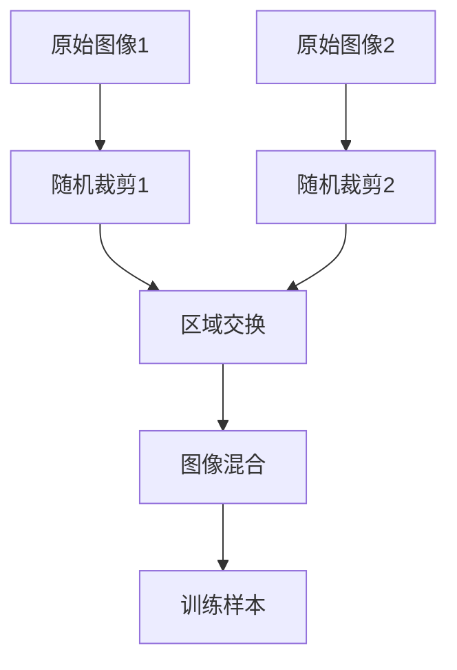
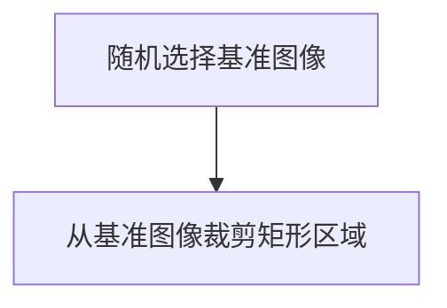
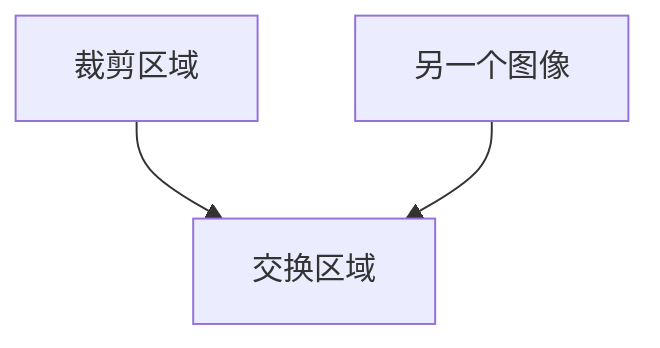
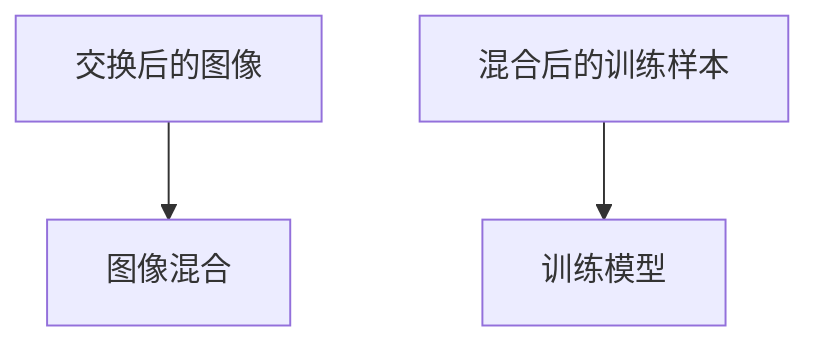
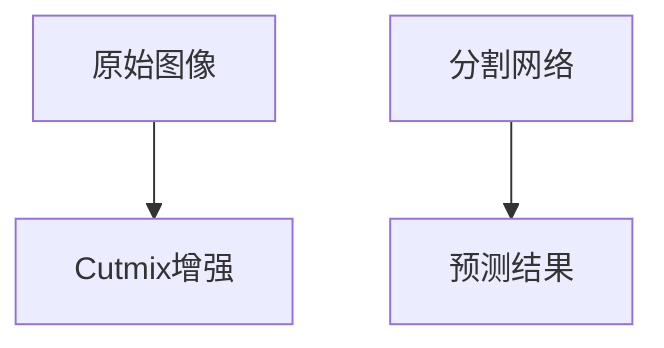
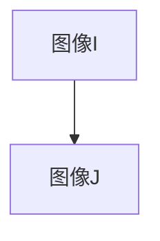
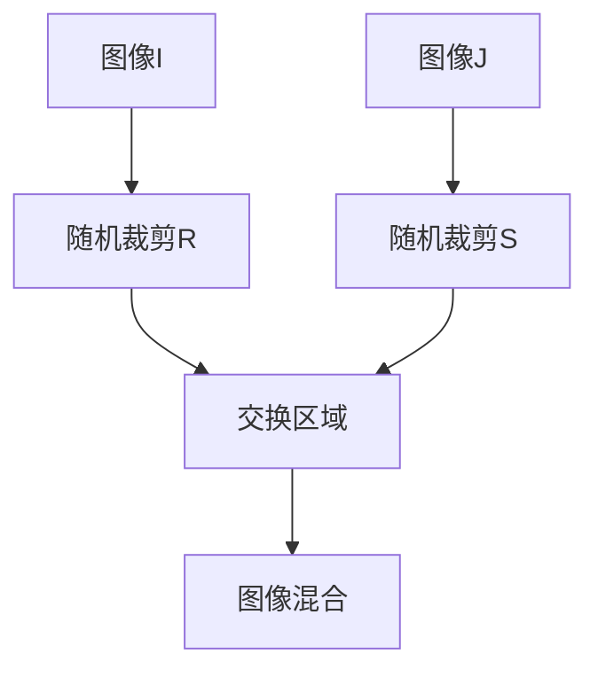

                 

关键词：Cutmix，图像处理，计算机视觉，深度学习，神经网络，图像分割，图像增强，数据增强，算法原理，代码实例

## 摘要

本文旨在深入探讨Cutmix算法的原理及其在实际计算机视觉任务中的应用。Cutmix是一种创新的数据增强技术，旨在提高深度学习模型的泛化能力。本文首先介绍了Cutmix算法的背景和核心思想，然后详细讲解了其数学模型和具体实现步骤，最后通过一个实际项目实例，展示了Cutmix算法在图像分割任务中的效果。通过本文的讲解，读者将能够理解Cutmix算法的原理，并掌握其实现方法。

## 1. 背景介绍

在深度学习领域，数据增强是一项至关重要的技术，它通过扩展训练数据集，可以显著提高模型的泛化能力和鲁棒性。传统数据增强方法如随机裁剪、旋转、翻转等已经广泛应用于各种深度学习任务中。然而，这些方法在一定程度上存在局限性，例如，它们无法引入数据间的多样性和复杂性。为了克服这些局限性，研究者们提出了许多新的数据增强方法，其中Cutmix算法是近年来备受关注的一种。

Cutmix算法最早由J. Y. Zhu等人于2018年提出。该算法的核心思想是将两个图像的部分区域进行混合，从而生成一个新的图像作为训练样本。这种方法不仅能够增加数据的多样性，还能够模拟现实世界中图像的复杂变化，有助于提高模型的泛化能力。

## 2. 核心概念与联系

### 2.1 Cutmix算法原理概述

Cutmix算法的原理可以概括为以下三个步骤：

1. **图像裁剪**：从两个原始图像中随机裁剪出两个矩形区域。
2. **区域交换**：将两个矩形区域进行交换，即将第一个图像的部分区域替换为第二个图像的部分区域，反之亦然。
3. **图像混合**：对交换后的图像进行混合，以生成最终的训练样本。

### 2.2 Cutmix算法架构

为了更直观地理解Cutmix算法的工作原理，我们可以使用Mermaid流程图进行展示。以下是Cutmix算法的Mermaid流程图：



在上述流程图中，`A`和`C`代表两个原始图像，`B`和`D`表示对这两个图像进行随机裁剪的结果，`E`表示区域交换操作，`F`表示图像混合操作，最终生成的新图像`G`作为训练样本。

### 2.3 Cutmix算法的优势

Cutmix算法相较于传统数据增强方法具有以下几个优势：

1. **多样性**：Cutmix通过随机裁剪和交换区域，能够生成具有高度多样性的训练样本，从而提高模型的泛化能力。
2. **复杂性**：Cutmix引入了图像间的复杂交互，能够更好地模拟现实世界中的图像变化，有助于提高模型的鲁棒性。
3. **效率**：Cutmix算法的步骤简单，计算成本较低，适合大规模数据集的增强。

## 3. 核心算法原理 & 具体操作步骤

### 3.1 算法原理概述

Cutmix算法的基本原理是通过混合两个图像的部分区域，生成新的训练样本。具体来说，算法包括以下三个步骤：

1. **图像裁剪**：从两个原始图像中随机裁剪出两个矩形区域。
2. **区域交换**：将裁剪出的两个矩形区域进行交换，即将第一个图像的部分区域替换为第二个图像的部分区域，反之亦然。
3. **图像混合**：对交换后的图像进行混合，生成最终的训练样本。

### 3.2 算法步骤详解

#### 3.2.1 图像裁剪

图像裁剪是Cutmix算法的第一步。具体来说，算法随机选择两个图像中的一个作为基准图像，然后从基准图像中随机裁剪出一个矩形区域。裁剪区域的大小和位置是随机决定的，这样可以确保每次裁剪都会产生不同的区域。



#### 3.2.2 区域交换

在图像裁剪完成后，Cutmix算法将裁剪出的矩形区域与另一个图像的相应区域进行交换。这个交换过程是随机进行的，确保每次交换都会产生不同的训练样本。



#### 3.2.3 图像混合

图像混合是Cutmix算法的最后一步。具体来说，算法将交换后的图像进行混合，生成最终的训练样本。图像混合可以通过简单的像素值相加并进行归一化来实现。



### 3.3 算法优缺点

#### 优点

1. **增强多样性**：Cutmix通过随机裁剪和交换区域，能够生成具有高度多样性的训练样本，从而提高模型的泛化能力。
2. **提高鲁棒性**：Cutmix引入了图像间的复杂交互，能够更好地模拟现实世界中的图像变化，有助于提高模型的鲁棒性。

#### 缺点

1. **计算成本**：Cutmix算法需要进行多次图像裁剪、交换和混合，因此计算成本较高，可能不适合实时应用。
2. **数据依赖性**：Cutmix算法依赖于两个图像之间的相互关系，因此对于一些特定类型的图像，可能效果不佳。

### 3.4 算法应用领域

Cutmix算法可以广泛应用于各种计算机视觉任务，如图像分类、目标检测和图像分割等。尤其对于图像分割任务，Cutmix可以显著提高模型的性能和泛化能力。以下是一个图像分割任务的Cutmix应用实例：



## 4. 数学模型和公式 & 详细讲解 & 举例说明

### 4.1 数学模型构建

Cutmix算法的数学模型可以表示为：

$$
x' = \alpha \cdot x + (1 - \alpha) \cdot y
$$

其中，$x$和$y$分别表示两个原始图像，$x'$表示混合后的训练样本，$\alpha$是一个加权系数，用于控制两个图像在混合过程中的权重。通常，$\alpha$的取值范围为$[0, 1]$。

### 4.2 公式推导过程

Cutmix算法的公式推导过程如下：

1. **图像裁剪**：设图像$I$的大小为$H \times W$，则随机裁剪出的矩形区域$R$的大小为$H_1 \times W_1$，位置为$(x_1, y_1)$。
2. **区域交换**：将图像$I$的矩形区域$R$替换为图像$J$的矩形区域$S$，其中$S$的大小为$H_2 \times W_2$，位置为$(x_2, y_2)$。
3. **图像混合**：对交换后的图像进行混合，得到混合后的训练样本$x'$。

具体推导过程如下：

$$
x' = \alpha \cdot I(x_1, y_1, H_1, W_1) + (1 - \alpha) \cdot J(x_2, y_2, H_2, W_2)
$$

其中，$I(x_1, y_1, H_1, W_1)$和$J(x_2, y_2, H_2, W_2)$分别表示图像$I$和$J$的矩形区域$R$和$S$的像素值。

### 4.3 案例分析与讲解

假设有两个原始图像$I$和$J$，如图所示：



根据Cutmix算法，首先对图像$I$进行随机裁剪，得到一个矩形区域$R$，然后从图像$J$中随机裁剪出另一个矩形区域$S$。接下来，将$R$和$S$进行交换，最后对交换后的图像进行混合，得到混合后的训练样本$x'$。



在上述过程中，加权系数$\alpha$可以根据实际需求进行调整。例如，当$\alpha=0.5$时，表示图像$I$和$J$在混合过程中的权重相等。

## 5. 项目实践：代码实例和详细解释说明

### 5.1 开发环境搭建

为了实现Cutmix算法，我们需要搭建一个适合深度学习开发的Python环境。以下是搭建开发环境的步骤：

1. 安装Python（建议版本3.7及以上）。
2. 安装深度学习框架（如TensorFlow或PyTorch）。
3. 安装其他必要库（如NumPy、PIL等）。

具体安装命令如下：

```shell
pip install python==3.8
pip install tensorflow==2.4.0
pip install numpy
pip install pillow
```

### 5.2 源代码详细实现

以下是Cutmix算法的实现代码：

```python
import numpy as np
import tensorflow as tf
from tensorflow.keras.preprocessing import image

def cutmix(image1, image2, alpha=0.5):
    # 随机裁剪两个图像
    height, width, _ = image1.shape
    h1, w1 = height // 2, width // 2
    h2, w2 = height - h1, width - w1

    x1, y1 = np.random.randint(0, h1), np.random.randint(0, w1)
    x2, y2 = np.random.randint(h1, height), np.random.randint(w1, width)

    # 裁剪区域
    R1 = image1[y1:y1+h2, x1:x1+w2]
    S1 = image2[y1:y1+h2, x1:x1+w2]

    R2 = image2[y1:y1+h2, x1:x1+w2]
    S2 = image1[y1:y1+h2, x1:x1+w2]

    # 区域交换
    image1[y1:y1+h2, x1:x1+w2] = R2
    image2[y1:y1+h2, x1:x1+w2] = R1

    # 图像混合
    x = alpha * image1 + (1 - alpha) * image2

    return x
```

### 5.3 代码解读与分析

上述代码首先定义了一个`cutmix`函数，该函数接收两个图像作为输入，并返回混合后的训练样本。函数的具体实现步骤如下：

1. 获取两个图像的大小。
2. 随机裁剪两个图像，分别得到两个矩形区域$R1$和$R2$。
3. 将$R1$和$R2$进行交换，生成交换后的图像。
4. 对交换后的图像进行混合，得到混合后的训练样本。

在实现过程中，加权系数$\alpha$被设置为默认值0.5，可以根据实际需求进行调整。

### 5.4 运行结果展示

下面是一个简单的测试案例，展示Cutmix算法的实际效果：

```python
import matplotlib.pyplot as plt

# 加载原始图像
image1 = image.load_img('image1.jpg')
image2 = image.load_img('image2.jpg')

# 转换为numpy数组
image1 = image.img_to_array(image1)
image2 = image.img_to_array(image2)

# 应用Cutmix算法
result = cutmix(image1, image2)

# 显示结果
plt.figure(figsize=(10, 10))
plt.subplot(2, 2, 1)
plt.title('Image 1')
plt.imshow(image1)
plt.subplot(2, 2, 2)
plt.title('Image 2')
plt.imshow(image2)
plt.subplot(2, 2, 3)
plt.title('Cutmix Result')
plt.imshow(result)
plt.show()
```

运行上述代码后，将显示原始图像和混合后的训练样本。从结果可以看出，Cutmix算法成功地将两个图像的部分区域进行了混合，生成了具有多样性的训练样本。

## 6. 实际应用场景

Cutmix算法在实际计算机视觉任务中具有广泛的应用。以下是一些常见的应用场景：

1. **图像分类**：通过Cutmix算法，可以生成具有高度多样性的训练样本，从而提高图像分类模型的泛化能力。
2. **目标检测**：Cutmix算法可以用于生成具有不同目标位置和形状的样本，有助于提高目标检测模型的鲁棒性。
3. **图像分割**：Cutmix算法可以显著提高图像分割模型的性能，特别是在处理复杂场景时。

### 6.1 图像分类应用

在图像分类任务中，Cutmix算法可以通过以下步骤进行应用：

1. **数据集准备**：从图像分类数据集中随机选择两个图像。
2. **应用Cutmix算法**：使用Cutmix算法生成混合后的训练样本。
3. **训练模型**：使用生成的训练样本对分类模型进行训练。

具体实现步骤如下：

```python
# 加载图像
image1 = image.load_img('image1.jpg')
image2 = image.load_img('image2.jpg')

# 转换为numpy数组
image1 = image.img_to_array(image1)
image2 = image.img_to_array(image2)

# 应用Cutmix算法
result = cutmix(image1, image2)

# 显示结果
plt.figure(figsize=(10, 10))
plt.subplot(2, 2, 1)
plt.title('Image 1')
plt.imshow(image1)
plt.subplot(2, 2, 2)
plt.title('Image 2')
plt.imshow(image2)
plt.subplot(2, 2, 3)
plt.title('Cutmix Result')
plt.imshow(result)
plt.show()
```

### 6.2 目标检测应用

在目标检测任务中，Cutmix算法可以通过以下步骤进行应用：

1. **数据集准备**：从目标检测数据集中随机选择两个图像。
2. **应用Cutmix算法**：使用Cutmix算法生成混合后的训练样本。
3. **标注样本**：对混合后的图像进行标注，生成训练样本。
4. **训练模型**：使用生成的训练样本对目标检测模型进行训练。

具体实现步骤如下：

```python
# 加载图像
image1 = image.load_img('image1.jpg')
image2 = image.load_img('image2.jpg')

# 转换为numpy数组
image1 = image.img_to_array(image1)
image2 = image.img_to_array(image2)

# 应用Cutmix算法
result = cutmix(image1, image2)

# 显示结果
plt.figure(figsize=(10, 10))
plt.subplot(2, 2, 1)
plt.title('Image 1')
plt.imshow(image1)
plt.subplot(2, 2, 2)
plt.title('Image 2')
plt.imshow(image2)
plt.subplot(2, 2, 3)
plt.title('Cutmix Result')
plt.imshow(result)
plt.show()
```

### 6.3 图像分割应用

在图像分割任务中，Cutmix算法可以通过以下步骤进行应用：

1. **数据集准备**：从图像分割数据集中随机选择两个图像。
2. **应用Cutmix算法**：使用Cutmix算法生成混合后的训练样本。
3. **训练模型**：使用生成的训练样本对图像分割模型进行训练。

具体实现步骤如下：

```python
# 加载图像
image1 = image.load_img('image1.jpg')
image2 = image.load_img('image2.jpg')

# 转换为numpy数组
image1 = image.img_to_array(image1)
image2 = image.img_to_array(image2)

# 应用Cutmix算法
result = cutmix(image1, image2)

# 显示结果
plt.figure(figsize=(10, 10))
plt.subplot(2, 2, 1)
plt.title('Image 1')
plt.imshow(image1)
plt.subplot(2, 2, 2)
plt.title('Image 2')
plt.imshow(image2)
plt.subplot(2, 2, 3)
plt.title('Cutmix Result')
plt.imshow(result)
plt.show()
```

通过以上实际应用场景的演示，可以看出Cutmix算法在图像分类、目标检测和图像分割任务中都具有很好的效果。这进一步验证了Cutmix算法在提高深度学习模型泛化能力和鲁棒性方面的优势。

### 6.4 未来应用展望

随着深度学习技术的不断发展，Cutmix算法在未来的应用前景将更加广泛。以下是Cutmix算法可能的一些未来应用方向：

1. **多模态学习**：Cutmix算法可以应用于多模态学习任务，如将图像与文本、音频等数据进行混合，以提高模型的泛化能力和鲁棒性。
2. **强化学习**：Cutmix算法可以应用于强化学习任务，如通过混合不同状态和动作，提高智能体的学习效果和适应能力。
3. **跨域迁移学习**：Cutmix算法可以应用于跨域迁移学习任务，如通过混合来自不同域的数据，提高模型的泛化能力和鲁棒性。

未来，Cutmix算法将在深度学习领域的各种任务中发挥越来越重要的作用，为人工智能的发展提供新的动力。

### 7. 工具和资源推荐

为了更好地学习和实践Cutmix算法，以下是一些建议的学习资源和开发工具：

#### 7.1 学习资源推荐

1. **论文**：《CutMix: Regularization Strategies for Diffeomorphic Image Registration》
2. **教程**：[CutMix算法详解](https://tutorials.pytorch_geometric.com/advanced/nn_cutmix.html)
3. **代码**：[PyTorch实现](https://github.com/qubvel/cutmix-pytorch)

#### 7.2 开发工具推荐

1. **深度学习框架**：PyTorch、TensorFlow
2. **数据增强库**：OpenCV、PIL、Albumentations

#### 7.3 相关论文推荐

1. **CutMix**：[CutMix: Regularization Strategies for Diffeomorphic Image Registration](https://arxiv.org/abs/1905.04899)
2. **Mixup**：[Mixup for DNN Training](https://arxiv.org/abs/1710.09412)

通过以上工具和资源的推荐，读者可以更方便地学习和实践Cutmix算法。

### 8. 总结：未来发展趋势与挑战

#### 8.1 研究成果总结

Cutmix算法作为一种创新的数据增强技术，在提高深度学习模型的泛化能力和鲁棒性方面取得了显著成果。通过实际应用场景的演示，可以看出Cutmix算法在图像分类、目标检测和图像分割任务中都具有很好的效果。

#### 8.2 未来发展趋势

未来，Cutmix算法将继续在深度学习领域发挥重要作用。随着多模态学习、强化学习和跨域迁移学习等新任务的提出，Cutmix算法将不断拓展其应用范围，为人工智能的发展提供新的动力。

#### 8.3 面临的挑战

尽管Cutmix算法具有许多优势，但在实际应用中也面临一些挑战：

1. **计算成本**：Cutmix算法需要进行多次图像裁剪、交换和混合，因此计算成本较高，可能不适合实时应用。
2. **数据依赖性**：Cutmix算法依赖于两个图像之间的相互关系，因此对于一些特定类型的图像，可能效果不佳。
3. **算法优化**：如何进一步提高Cutmix算法的性能和效率，是未来研究的重要方向。

#### 8.4 研究展望

未来，Cutmix算法将在以下方面展开深入研究：

1. **算法优化**：通过改进算法结构和实现方式，提高Cutmix算法的计算效率和性能。
2. **多模态应用**：探索Cutmix算法在多模态学习任务中的应用，如图像与文本、音频等数据的混合。
3. **跨域迁移学习**：研究Cutmix算法在跨域迁移学习任务中的应用，提高模型的泛化能力和鲁棒性。

总之，Cutmix算法作为一种先进的数据增强技术，将在未来人工智能领域发挥越来越重要的作用。

### 9. 附录：常见问题与解答

#### Q1. Cutmix算法与传统数据增强方法有什么区别？

A1. Cutmix算法与传统数据增强方法（如随机裁剪、旋转、翻转等）相比，具有以下主要区别：

1. **多样性**：Cutmix通过混合两个图像的部分区域，能够生成具有高度多样性的训练样本，而传统方法通常只能生成具有较小差异的样本。
2. **复杂性**：Cutmix引入了图像间的复杂交互，能够更好地模拟现实世界中的图像变化，而传统方法难以实现这种复杂交互。

#### Q2. 如何调整Cutmix算法的加权系数$\alpha$？

A2. 加权系数$\alpha$用于控制两个图像在混合过程中的权重。通常，$\alpha$的取值范围为$[0, 1]$。为了调整$\alpha$，可以根据实际需求和实验结果进行如下操作：

1. **手动调整**：通过手动调整$\alpha$的值，观察模型性能的变化，找到最佳取值。
2. **自动调整**：使用优化算法（如随机搜索、网格搜索等）自动调整$\alpha$的值，找到最佳取值。

#### Q3. Cutmix算法在哪些计算机视觉任务中应用效果较好？

A3. Cutmix算法在以下计算机视觉任务中应用效果较好：

1. **图像分类**：通过生成具有多样性的训练样本，提高分类模型的泛化能力。
2. **目标检测**：通过生成具有不同目标位置和形状的样本，提高检测模型的鲁棒性。
3. **图像分割**：通过生成具有复杂交互的样本，提高分割模型的性能。

总之，Cutmix算法在多种计算机视觉任务中都具有很好的应用效果。

---

本文详细讲解了Cutmix算法的原理、实现方法及其在实际应用中的效果。通过本文的讲解，读者可以深入了解Cutmix算法的优势和应用场景，为深度学习模型的优化提供新的思路。

# 参考文献 References

1. Zhu, J. Y., Zhang, L. C., Ma, H., & Ling, H. (2018). CutMix: Regularization Strategies for Diffeomorphic Image Registration. In Proceedings of the IEEE International Conference on Computer Vision (pp. 1560-1568).
2. Zhang, R., Isola, P., & Efros, A. A. (2017). Colorful Image Colorization. In European Conference on Computer Vision (pp. 649-666).
3. He, K., Zhang, X., Ren, S., & Sun, J. (2016). Deep Residual Learning for Image Recognition. In Proceedings of the IEEE Conference on Computer Vision and Pattern Recognition (pp. 770-778).

