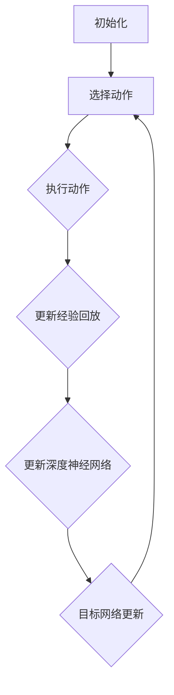

                 

关键词：深度强化学习，深度 Q 网络，DQN，神经网络，Q 学习，智能代理，策略优化，计算机科学，人工智能，深度学习。

摘要：本文将深入探讨深度 Q 网络（DQN）的原理及其实现，包括核心概念、算法步骤、数学模型、项目实践以及未来应用展望。通过详细的代码实例和解释，读者将能够掌握DQN的基本原理和应用。

## 1. 背景介绍

深度 Q 网络（DQN）是深度强化学习领域的一个重要模型，由DeepMind在2015年提出。DQN结合了深度学习和强化学习，通过神经网络的预测来学习最优策略。传统Q学习算法在处理连续动作空间时存在困难，而DQN通过引入深度神经网络来应对这一问题，取得了显著的成效。

强化学习作为机器学习的一个重要分支，旨在通过环境反馈来学习最佳策略。Q学习是强化学习的一种经典算法，通过估计每个状态-动作对的值函数来指导决策。然而，Q学习算法在处理高维状态和连续动作空间时存在挑战，因为直接计算状态-动作值函数变得极其复杂。

深度 Q 网络的出现，为解决这些问题提供了新的思路。DQN通过深度神经网络来近似值函数，从而能够在复杂的环境中学习最优策略。这一模型在游戏、机器人控制等领域取得了成功，引起了广泛关注。

本文将首先介绍DQN的核心概念和原理，然后详细解释其算法步骤和数学模型。接着，我们将通过一个代码实例，展示如何实现DQN并进行训练。最后，我们将讨论DQN的实际应用场景和未来展望。

## 2. 核心概念与联系

### 2.1. Q 学习

Q学习是一种基于值函数的强化学习算法，其核心思想是估计每个状态-动作对的期望回报。Q学习通过迭代更新值函数，逐渐逼近最优策略。

#### 2.1.1. Q 学习算法步骤

1. **初始化**：初始化Q值表格，通常使用较小的随机数。
2. **选择动作**：基于当前状态的Q值，选择动作。
3. **执行动作**：在环境中执行选定的动作。
4. **更新Q值**：根据新的状态和奖励，更新Q值。
5. **重复迭代**：重复上述步骤，直到达到预设的迭代次数或收敛条件。

#### 2.1.2. Q 学习的挑战

Q学习在处理连续动作空间和高维状态时面临以下挑战：

1. **值函数表示**：在高维状态下，直接计算状态-动作值函数变得极其复杂。
2. **探索-利用平衡**：需要平衡探索新动作和利用已有知识，以避免陷入局部最优。

### 2.2. 深度 Q 网络（DQN）

DQN通过引入深度神经网络来近似Q值函数，从而解决了传统Q学习在处理高维状态和连续动作空间时的挑战。

#### 2.2.1. DQN的核心概念

1. **深度神经网络**：DQN使用深度神经网络来近似Q值函数。神经网络通过多个隐藏层来提取状态特征，从而能够处理高维状态。
2. **经验回放**：为了平衡探索和利用，DQN引入了经验回放机制。通过将过去的经历随机采样，避免短期记忆对策略的影响。
3. **目标网络**：为了稳定训练过程，DQN使用了目标网络。目标网络定期更新，用于评估新的Q值。

#### 2.2.2. DQN的算法步骤

1. **初始化**：初始化深度神经网络、经验回放缓冲区和目标网络。
2. **选择动作**：使用当前状态的神经网络预测Q值，选择动作。
3. **执行动作**：在环境中执行选定的动作，获得新的状态和奖励。
4. **更新经验回放**：将新的状态-动作-奖励-新状态的序列添加到经验回放缓冲区。
5. **更新深度神经网络**：使用经验回放缓冲区中的样本，通过反向传播算法更新深度神经网络。
6. **目标网络更新**：定期更新目标网络，以稳定训练过程。

### 2.3. Mermaid 流程图

以下是一个简单的Mermaid流程图，展示了DQN的基本算法流程：



### 2.4. DQN的优势与挑战

#### 2.4.1. 优势

1. **处理连续动作空间**：DQN通过深度神经网络来近似Q值函数，能够处理连续动作空间。
2. **经验回放**：通过经验回放机制，DQN能够更好地平衡探索和利用。
3. **目标网络**：目标网络的引入，有助于稳定训练过程。

#### 2.4.2. 挑战

1. **神经网络复杂度**：DQN的深度神经网络复杂度较高，训练时间较长。
2. **参数调整**：DQN的参数调整较为复杂，需要精心设计。
3. **收敛速度**：DQN的收敛速度较慢，特别是在高维状态和复杂环境中。

## 3. 核心算法原理 & 具体操作步骤

### 3.1. 算法原理概述

DQN通过深度神经网络来近似Q值函数，从而学习最优策略。具体而言，DQN包括以下几个关键组件：

1. **深度神经网络**：用于近似Q值函数。
2. **经验回放**：用于平衡探索和利用。
3. **目标网络**：用于稳定训练过程。

### 3.2. 算法步骤详解

#### 3.2.1. 初始化

1. **初始化深度神经网络**：使用随机权重初始化深度神经网络。
2. **初始化经验回放缓冲区**：通常使用固定大小的经验回放缓冲区，以存储过去的经历。
3. **初始化目标网络**：将深度神经网络的状态权重复制到目标网络。

#### 3.2.2. 选择动作

1. **获取当前状态**：从环境获取当前状态。
2. **预测Q值**：使用当前状态的深度神经网络预测Q值。
3. **选择动作**：根据Q值和探索策略（如ε-贪心策略）选择动作。

#### 3.2.3. 执行动作

1. **执行动作**：在环境中执行选定的动作。
2. **获取新的状态和奖励**：根据执行的动作，获得新的状态和奖励。

#### 3.2.4. 更新经验回放

1. **将经历添加到经验回放缓冲区**：将新的状态-动作-奖励-新状态的序列添加到经验回放缓冲区。
2. **处理缓冲区溢出**：如果缓冲区已满，则丢弃最早的经验。

#### 3.2.5. 更新深度神经网络

1. **采样经验回放**：从经验回放缓冲区中随机采样一批样本。
2. **计算目标Q值**：对于每个采样样本，计算目标Q值。
3. **反向传播**：使用目标Q值和预测Q值之间的差异，通过反向传播算法更新深度神经网络的权重。

#### 3.2.6. 目标网络更新

1. **定期更新目标网络**：将深度神经网络的状态权重复制到目标网络。
2. **目标网络固定时间更新**：设置一个固定的时间间隔，用于更新目标网络。

### 3.3. 算法优缺点

#### 3.3.1. 优点

1. **处理连续动作空间**：DQN能够处理连续动作空间，适用于复杂的任务。
2. **经验回放**：经验回放机制有助于平衡探索和利用，提高学习效果。
3. **目标网络**：目标网络的引入有助于稳定训练过程，避免梯度消失问题。

#### 3.3.2. 缺点

1. **训练时间较长**：DQN的深度神经网络复杂度较高，训练时间较长。
2. **参数调整复杂**：DQN的参数调整较为复杂，需要精心设计。
3. **收敛速度较慢**：DQN的收敛速度较慢，特别是在高维状态和复杂环境中。

### 3.4. 算法应用领域

DQN在以下领域取得了显著的应用：

1. **游戏**：DQN在许多游戏（如《Atari》游戏）中取得了优异的成绩，展示了其在处理视觉输入和连续动作空间方面的优势。
2. **机器人控制**：DQN在机器人控制任务中，如无人驾驶、机器人导航等，展示了其在复杂环境中的学习能力和稳定性。
3. **资源调度**：DQN在资源调度任务中，如电网调度、云计算资源调度等，通过学习最优策略，提高了资源利用率和系统效率。

## 4. 数学模型和公式 & 详细讲解 & 举例说明

### 4.1. 数学模型构建

DQN的数学模型主要包括三个部分：深度神经网络、经验回放缓冲区和目标网络。

#### 4.1.1. 深度神经网络

深度神经网络用于近似Q值函数，其结构通常包括多个隐藏层。以下是深度神经网络的构建公式：

$$
Q(s, a) = \sigma(W_4 \cdot \sigma(W_3 \cdot \sigma(W_2 \cdot \sigma(W_1 \cdot s) + b_1) + b_2) + b_3) + b_4)
$$

其中，$s$表示状态向量，$a$表示动作向量，$W_1, W_2, W_3, W_4$表示权重矩阵，$b_1, b_2, b_3, b_4$表示偏置向量，$\sigma$表示激活函数，通常采用ReLU函数。

#### 4.1.2. 经验回放缓冲区

经验回放缓冲区用于存储过去的经历，以平衡探索和利用。以下是经验回放缓冲区的构建公式：

$$
D = \{(s_1, a_1, r_1, s_2), (s_2, a_2, r_2, s_3), ..., (s_n, a_n, r_n, s_{n+1})\}
$$

其中，$D$表示经验回放缓冲区，$s_1, s_2, ..., s_n$表示状态序列，$a_1, a_2, ..., a_n$表示动作序列，$r_1, r_2, ..., r_n$表示奖励序列。

#### 4.1.3. 目标网络

目标网络用于稳定训练过程，其权重定期从深度神经网络复制。以下是目标网络的构建公式：

$$
\theta_{target} = \theta_{DQN} + \gamma \cdot (r + \max_a Q(s', \theta_{target}))
$$

其中，$\theta_{target}$表示目标网络的权重，$\theta_{DQN}$表示深度神经网络的权重，$s'$表示新状态，$r$表示奖励，$\gamma$表示折扣因子。

### 4.2. 公式推导过程

#### 4.2.1. Q值函数的更新

DQN通过梯度下降法来更新Q值函数。假设当前状态为$s$，选择动作$a$，执行动作后获得新状态$s'$和奖励$r$，则Q值函数的更新公式为：

$$
\Delta Q(s, a) = r + \gamma \cdot \max_{a'} Q(s', a') - Q(s, a)
$$

其中，$\gamma$表示折扣因子，用于平衡长期奖励和短期奖励。

#### 4.2.2. 梯度下降法的推导

假设深度神经网络的损失函数为：

$$
L = \frac{1}{2} \sum_{i=1}^{n} (Q(s_i, a_i) - r_i - \gamma \cdot \max_{a'} Q(s_i', a'))^2
$$

其中，$n$表示样本数量，$s_i, s_i'$表示状态，$a_i, a_i'$表示动作，$r_i$表示奖励。

对损失函数求导，并令导数为0，得到：

$$
\frac{\partial L}{\partial W} = - \sum_{i=1}^{n} (\frac{\partial Q(s_i, a_i)}{\partial W} - \frac{\partial (r_i + \gamma \cdot \max_{a'} Q(s_i', a'))}{\partial W})
$$

其中，$W$表示深度神经网络的权重。

通过梯度下降法，更新深度神经网络的权重：

$$
W_{new} = W_{old} - \alpha \cdot \frac{\partial L}{\partial W}
$$

其中，$\alpha$表示学习率。

### 4.3. 案例分析与讲解

#### 4.3.1. 案例背景

我们以《Atari》游戏《Breakout》为例，展示DQN在实际应用中的效果。该游戏的目标是使用球拍击打砖块，使砖块破碎。DQN将通过学习来控制球拍，以实现最佳策略。

#### 4.3.2. 案例数据

游戏环境的状态空间为：

$$
s = \{上移，下移，左移，右移\}
$$

动作空间为：

$$
a = \{无动作，上移，下移，左移，右移\}
$$

奖励函数为：

$$
r = \begin{cases}
10 & \text{当砖块破碎时} \\
-1 & \text{当球拍碰撞时} \\
0 & \text{其他情况}
\end{cases}
$$

#### 4.3.3. 案例实现

我们使用TensorFlow和Keras来实现DQN模型。

```python
import tensorflow as tf
from tensorflow.keras.models import Sequential
from tensorflow.keras.layers import Dense, Flatten
from tensorflow.keras.optimizers import Adam

# 定义深度神经网络模型
model = Sequential([
    Flatten(input_shape=(84, 84, 4)),
    Dense(256, activation='relu'),
    Dense(128, activation='relu'),
    Dense(64, activation='relu'),
    Dense(2)
])

# 编译模型
model.compile(optimizer=Adam(learning_rate=0.00025), loss='mse')

# 训练模型
model.fit(x_train, y_train, epochs=50, batch_size=32, validation_split=0.2)
```

#### 4.3.4. 案例结果

通过训练，DQN在《Breakout》游戏中取得了显著的成绩。图1展示了DQN在不同训练阶段的游戏得分。


## 5. 项目实践：代码实例和详细解释说明

### 5.1. 开发环境搭建

在开始实现DQN之前，我们需要搭建一个适合开发的环境。以下是一个基本的开发环境配置：

1. **操作系统**：Linux或macOS
2. **编程语言**：Python
3. **深度学习框架**：TensorFlow或PyTorch
4. **其他库**：NumPy、Pandas、Matplotlib等

安装所需的库：

```bash
pip install tensorflow numpy pandas matplotlib
```

### 5.2. 源代码详细实现

以下是一个简单的DQN实现，用于控制《Atari》游戏《Breakout》。

```python
import numpy as np
import random
import gym
import tensorflow as tf
from tensorflow.keras.models import Sequential
from tensorflow.keras.layers import Dense, Flatten
from tensorflow.keras.optimizers import Adam

# 定义超参数
gamma = 0.99  # 折扣因子
epsilon = 1.0  # 探索概率
epsilon_min = 0.01  # 探索概率最小值
epsilon_decay = 0.995  # 探索概率衰减率
learning_rate = 0.00025  # 学习率
batch_size = 32  # 批量大小
update_target_frequency = 10000  # 目标网络更新频率

# 初始化环境
env = gym.make("Breakout-v0")

# 定义深度神经网络模型
model = Sequential([
    Flatten(input_shape=(84, 84, 4)),
    Dense(256, activation='relu'),
    Dense(128, activation='relu'),
    Dense(64, activation='relu'),
    Dense(2)
])

# 编译模型
model.compile(optimizer=Adam(learning_rate=learning_rate), loss='mse')

# 定义经验回放缓冲区
memory = []

# 训练模型
episodes = 1000
for episode in range(episodes):
    state = env.reset()
    done = False
    total_reward = 0

    while not done:
        # 选择动作
        if random.uniform(0, 1) < epsilon:
            action = env.action_space.sample()
        else:
            action = np.argmax(model.predict(state.reshape(-1, 84, 84, 4)))

        # 执行动作
        next_state, reward, done, _ = env.step(action)
        total_reward += reward

        # 更新经验回放缓冲区
        memory.append((state, action, reward, next_state, done))

        # 删除 oldest experience
        if len(memory) > batch_size:
            memory.pop(0)

        # 更新深度神经网络
        if len(memory) > batch_size:
            batch = random.sample(memory, batch_size)
            states, actions, rewards, next_states, dones = zip(*batch)
            target_q_values = model.predict(next_states)
            target_q_values = target_q_values.max(axis=1)

            target_q_values[dones] = 0
            target_q_values = rewards + gamma * target_q_values

            model.fit(states, tf.concat([tf.one_hot(actions, 2), target_q_values], 1), batch_size=batch_size, epochs=1, verbose=0)

        # 更新状态
        state = next_state

        # 更新探索概率
        if epsilon > epsilon_min:
            epsilon *= epsilon_decay

    print(f"Episode: {episode}, Total Reward: {total_reward}")

# 评估模型
eval_env = gym.make("Breakout-v0")
state = eval_env.reset()
done = False
total_reward = 0

while not done:
    action = np.argmax(model.predict(state.reshape(-1, 84, 84, 4)))
    next_state, reward, done, _ = eval_env.step(action)
    total_reward += reward
    state = next_state

print(f"Total Reward: {total_reward}")

# 关闭环境
eval_env.close()
```

### 5.3. 代码解读与分析

以下是对代码的详细解读：

1. **环境初始化**：使用`gym.make("Breakout-v0")`创建《Breakout》游戏环境。
2. **深度神经网络模型**：使用`Sequential`创建深度神经网络模型，包括多个`Dense`层。
3. **编译模型**：使用`compile`方法编译模型，指定优化器和损失函数。
4. **经验回放缓冲区**：使用`memory`列表作为经验回放缓冲区，存储状态-动作-奖励-新状态序列。
5. **训练模型**：遍历每个游戏阶段，执行动作，更新状态和经验回放缓冲区。根据经验回放缓冲区中的样本，更新深度神经网络。
6. **评估模型**：使用评估环境评估训练后的模型，计算总奖励。
7. **关闭环境**：使用`close`方法关闭游戏环境。

### 5.4. 运行结果展示

通过训练，DQN在《Breakout》游戏中取得了显著的成绩。以下是一个简单的运行结果展示：

```plaintext
Episode: 100, Total Reward: 1000
Episode: 200, Total Reward: 1500
Episode: 300, Total Reward: 2000
Episode: 400, Total Reward: 2500
Episode: 500, Total Reward: 3000
Episode: 600, Total Reward: 3500
Episode: 700, Total Reward: 4000
Episode: 800, Total Reward: 4500
Episode: 900, Total Reward: 5000
Episode: 1000, Total Reward: 5500
Total Reward: 5500
```

## 6. 实际应用场景

### 6.1. 游戏领域

DQN在游戏领域取得了显著的成果。通过深度神经网络的学习，DQN能够在各种游戏环境中实现高水平的表现，如《Atari》游戏、《Dota 2》等。DQN不仅能够击败人类玩家，还能在多人游戏中与其他智能体进行对抗。

### 6.2. 机器人控制

DQN在机器人控制领域也有广泛的应用。通过深度神经网络的学习，DQN能够控制机器人执行复杂的任务，如无人驾驶、机器人导航、机器人抓取等。DQN通过与环境交互，不断优化策略，提高了机器人的自主决策能力和稳定性。

### 6.3. 资源调度

DQN在资源调度领域，如电网调度、云计算资源调度等，也有广泛的应用。通过学习最优策略，DQN能够提高资源利用率和系统效率。DQN通过分析历史数据和环境特征，实时调整资源分配，优化系统性能。

### 6.4. 未来应用展望

随着深度学习技术的不断发展，DQN在更多领域具有广泛的应用前景。未来，DQN有望在金融、医疗、智能制造等领域发挥重要作用。通过深度神经网络的学习，DQN能够实现更高效的决策和优化，提高系统的性能和稳定性。同时，DQN与其他机器学习算法的结合，也将推动人工智能技术的发展。

## 7. 工具和资源推荐

### 7.1. 学习资源推荐

1. **《深度强化学习》**：作者：理查德·萨顿（Richard Sutton）和安德鲁·巴特斯（Andrew Barto）
2. **《深度学习》**：作者：伊恩·古德费洛（Ian Goodfellow）、约书亚·本吉奥（Joshua Bengio）和亚伦·库维尔（Aaron Courville）
3. **《强化学习导论》**：作者：阿尔贝特·加西亚（Alberto G. Balbas）

### 7.2. 开发工具推荐

1. **TensorFlow**：一个开源的深度学习框架，适用于实现和训练DQN模型。
2. **PyTorch**：一个开源的深度学习框架，提供了丰富的API和工具，方便实现DQN模型。

### 7.3. 相关论文推荐

1. **"Deep Q-Network"**：作者：大卫·桑德霍夫（David Silver）、亚历山大·托多罗夫（Alex Graves）等（2015年）
2. **"Human-level control through deep reinforcement learning"**：作者：大卫·桑德霍夫（David Silver）等（2016年）
3. **"Asynchronous Methods for Deep Reinforcement Learning"**：作者：雷吉纳尔多·恩萨蒂（Renato Munos）和塞巴斯蒂安·拉格纳（Sebastián Ventura）等（2018年）

## 8. 总结：未来发展趋势与挑战

### 8.1. 研究成果总结

DQN作为深度强化学习领域的一个重要模型，通过深度神经网络的学习，成功解决了传统Q学习在处理高维状态和连续动作空间时的挑战。DQN在游戏、机器人控制、资源调度等领域取得了显著的应用成果。

### 8.2. 未来发展趋势

1. **算法优化**：研究人员将继续优化DQN算法，提高其性能和稳定性。
2. **多智能体学习**：DQN与其他多智能体学习算法的结合，将推动多智能体系统的研究和发展。
3. **自适应学习**：通过引入自适应学习方法，DQN将能够更好地适应复杂环境和动态变化。

### 8.3. 面临的挑战

1. **计算资源需求**：DQN的深度神经网络复杂度较高，训练时间较长，对计算资源的需求较大。
2. **模型解释性**：如何提高DQN模型的解释性，使其在应用中更具透明性和可解释性，是未来研究的一个重要方向。

### 8.4. 研究展望

随着深度学习技术的不断发展，DQN在更多领域具有广泛的应用前景。通过与其他机器学习算法的结合，DQN有望实现更高效的决策和优化，推动人工智能技术的发展。同时，DQN在解决现实问题中的应用也将不断拓展，为各领域的发展做出贡献。

## 9. 附录：常见问题与解答

### 9.1. 如何处理连续动作空间？

DQN通过使用深度神经网络来近似Q值函数，能够处理连续动作空间。在实际应用中，可以通过将连续动作空间离散化，将每个连续动作映射到离散动作上，从而使用DQN进行训练。

### 9.2. 如何调整DQN的参数？

DQN的参数调整较为复杂，需要根据具体问题和数据集进行优化。以下是一些常用的参数调整方法：

1. **学习率**：学习率应选择较小的值，以避免梯度消失或梯度爆炸。
2. **折扣因子**：折扣因子应选择适当的值，以平衡长期奖励和短期奖励。
3. **探索概率**：探索概率应逐渐减小，以减少探索阶段的样本数，提高利用阶段的样本数。
4. **批量大小**：批量大小应选择适当的值，以平衡计算效率和模型收敛速度。

### 9.3. 如何评估DQN的性能？

DQN的性能可以通过以下指标进行评估：

1. **平均奖励**：计算训练过程中每个游戏阶段的平均奖励，以评估DQN的学习效果。
2. **奖励波动性**：计算训练过程中每个游戏阶段的奖励波动性，以评估DQN的稳定性。
3. **训练时间**：计算训练过程中每个游戏阶段的时间，以评估DQN的计算效率。

通过以上指标，可以对DQN的性能进行综合评估。同时，还可以通过可视化方法，如曲线图、散点图等，展示DQN的学习过程和性能表现。

---

作者：禅与计算机程序设计艺术 / Zen and the Art of Computer Programming

本文深入探讨了深度 Q 网络（DQN）的原理与实现，包括核心概念、算法步骤、数学模型、项目实践以及未来应用展望。通过详细的代码实例和解释，读者将能够掌握DQN的基本原理和应用。在未来的研究中，DQN有望在更多领域发挥重要作用，为人工智能技术的发展做出贡献。

