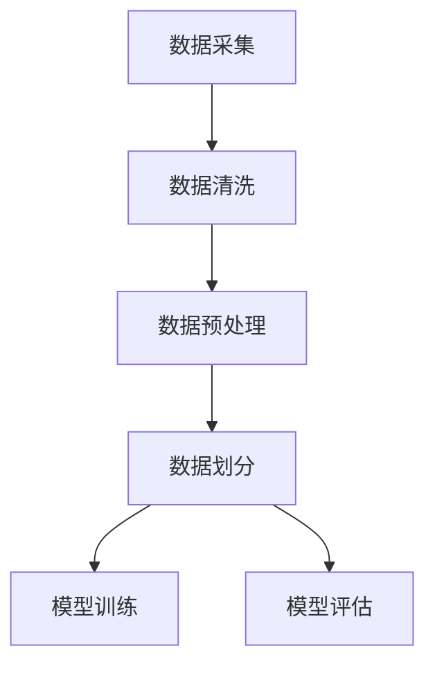

                 

关键词：Dataset，数据集，机器学习，数据处理，数据预处理，代码实例

摘要：本文将深入探讨数据集在机器学习中的重要性，详细介绍数据集的原理、构建方法，以及如何使用代码实例对数据集进行预处理和分析。通过本文的讲解，读者将更好地理解数据集的重要性，并学会如何高效地利用数据集进行机器学习模型的训练和评估。

## 1. 背景介绍

在机器学习中，数据集扮演着至关重要的角色。数据集是机器学习模型训练的基础，一个高质量的数据集可以大大提高模型的准确性和泛化能力。然而，构建一个适合机器学习任务的数据集并非易事，需要经历数据采集、数据清洗、数据预处理等多个环节。

本文将首先介绍数据集的基本概念和分类，然后详细讲解数据集构建的方法和步骤，最后通过代码实例展示如何对数据集进行预处理和分析。希望本文能够帮助读者更好地理解和掌握数据集的原理和应用。

## 2. 核心概念与联系

### 2.1 数据集的定义与分类

数据集（Dataset）是指用于机器学习模型的训练、评估和预测的数据集合。根据数据集的来源和特点，可以分为以下几类：

1. **公开数据集**：这些数据集由研究机构、组织或个人公开提供，例如ImageNet、CIFAR-10等。
2. **私有数据集**：这些数据集由特定组织或个人拥有，仅限于内部使用，例如公司内部销售数据、医院患者信息等。
3. **自定义数据集**：根据特定任务需求，自行采集和构建的数据集，例如图像分类、文本分类等。

### 2.2 数据集的重要性

数据集的质量直接影响机器学习模型的效果。高质量的数据集可以带来以下几方面的优势：

1. **提高模型准确性**：丰富的数据可以提供更多的样本，使模型能够更好地学习到特征，从而提高模型的准确性。
2. **增强泛化能力**：多样化的数据可以帮助模型避免过拟合，提高模型的泛化能力。
3. **加快模型训练**：较大的数据集可以加快模型的收敛速度，缩短训练时间。

### 2.3 数据集的构建方法

构建数据集通常需要经历以下几个步骤：

1. **数据采集**：从各种来源收集数据，包括互联网、数据库、传感器等。
2. **数据清洗**：去除数据中的噪声和错误，保证数据的质量。
3. **数据预处理**：将数据转换为适合机器学习模型输入的格式，如归一化、标准化等。
4. **数据划分**：将数据集划分为训练集、验证集和测试集，用于模型的训练、评估和预测。

### 2.4 Mermaid 流程图

下面是一个简化的数据集构建流程的 Mermaid 流程图：



## 3. 核心算法原理 & 具体操作步骤

### 3.1 算法原理概述

数据集构建的核心算法主要包括数据采集、数据清洗、数据预处理和数据划分。这些算法的目的是确保数据集的质量，使其适合用于机器学习模型的训练和评估。

### 3.2 算法步骤详解

#### 3.2.1 数据采集

数据采集是构建数据集的第一步，主要任务是从各种来源收集数据。数据采集的方法包括：

1. **手动采集**：通过人工搜索、筛选和下载数据。
2. **自动化采集**：使用爬虫、API 接口等工具自动获取数据。

#### 3.2.2 数据清洗

数据清洗是数据预处理的前置步骤，主要任务是去除数据中的噪声和错误，保证数据的质量。数据清洗的方法包括：

1. **缺失值处理**：删除缺失值或使用统计方法填补缺失值。
2. **异常值处理**：删除异常值或使用统计方法修正异常值。
3. **数据格式转换**：将不同格式的数据进行统一转换，如将文本数据转换为数值数据。

#### 3.2.3 数据预处理

数据预处理是将数据转换为适合机器学习模型输入的格式，主要包括以下步骤：

1. **归一化**：将不同特征的数据进行归一化，使其具有相同的尺度。
2. **标准化**：将不同特征的数据进行标准化，使其具有相同的均值和标准差。
3. **编码**：将类别型数据进行编码，如独热编码、标签编码等。

#### 3.2.4 数据划分

数据划分是将数据集划分为训练集、验证集和测试集，用于模型的训练、评估和预测。数据划分的方法包括：

1. **随机划分**：随机将数据划分为训练集、验证集和测试集。
2. **分层抽样**：根据不同特征的比例，将数据划分为训练集、验证集和测试集。

### 3.3 算法优缺点

不同算法在数据集构建中具有不同的优缺点，具体如下：

1. **数据采集**：
   - 优点：可以获取丰富的数据。
   - 缺点：耗时较长，数据质量难以保证。
2. **数据清洗**：
   - 优点：提高数据质量，减少噪声和错误。
   - 缺点：可能导致数据丢失，影响模型效果。
3. **数据预处理**：
   - 优点：使数据适合机器学习模型输入，提高模型效果。
   - 缺点：可能引入新的噪声和错误。
4. **数据划分**：
   - 优点：确保模型训练、评估和预测的公正性。
   - 缺点：可能导致数据不平衡。

### 3.4 算法应用领域

数据集构建算法广泛应用于机器学习、数据挖掘、计算机视觉等领域。例如：

1. **机器学习**：数据集构建是机器学习模型训练和评估的基础。
2. **数据挖掘**：数据集构建有助于发现数据中的规律和模式。
3. **计算机视觉**：数据集构建是计算机视觉模型训练的重要步骤。

## 4. 数学模型和公式 & 详细讲解 & 举例说明

### 4.1 数学模型构建

在数据集构建中，常用的数学模型包括归一化和标准化模型。以下是这两个模型的公式：

#### 4.1.1 归一化模型

归一化模型将特征数据转换为相同的尺度，公式如下：

$$
\hat{x} = \frac{x - \mu}{\sigma}
$$

其中，$\hat{x}$ 表示归一化后的数据，$x$ 表示原始数据，$\mu$ 表示数据的均值，$\sigma$ 表示数据的标准差。

#### 4.1.2 标准化模型

标准化模型将特征数据转换为具有相同均值和标准差的形式，公式如下：

$$
\hat{x} = \frac{x - \mu}{\sigma}
$$

其中，$\hat{x}$ 表示标准化后的数据，$x$ 表示原始数据，$\mu$ 表示数据的均值，$\sigma$ 表示数据的标准差。

### 4.2 公式推导过程

#### 4.2.1 归一化模型的推导

归一化模型的核心思想是将特征数据转换为相同的尺度。具体推导过程如下：

设 $X$ 为原始数据集，$\mu$ 为数据集的均值，$\sigma$ 为数据集的标准差。则对于每个特征 $x$，有：

$$
\mu = \frac{1}{n}\sum_{i=1}^{n}x_i
$$

$$
\sigma = \sqrt{\frac{1}{n}\sum_{i=1}^{n}(x_i - \mu)^2}
$$

则归一化模型可以表示为：

$$
\hat{x} = \frac{x - \mu}{\sigma}
$$

#### 4.2.2 标准化模型的推导

标准化模型的核心思想是将特征数据转换为具有相同均值和标准差的形式。具体推导过程如下：

设 $X$ 为原始数据集，$\mu$ 为数据集的均值，$\sigma$ 为数据集的标准差。则对于每个特征 $x$，有：

$$
\mu = \frac{1}{n}\sum_{i=1}^{n}x_i
$$

$$
\sigma = \sqrt{\frac{1}{n}\sum_{i=1}^{n}(x_i - \mu)^2}
$$

则标准化模型可以表示为：

$$
\hat{x} = \frac{x - \mu}{\sigma}
$$

### 4.3 案例分析与讲解

假设我们有以下一个数据集，其中包含两个特征：

| x1 | x2 |
|----|----|
| 1  | 10 |
| 2  | 20 |
| 3  | 30 |
| 4  | 40 |

#### 4.3.1 归一化模型的应用

首先计算数据集的均值和标准差：

$$
\mu = \frac{1}{4}\sum_{i=1}^{4}x_i = \frac{1+2+3+4}{4} = 2.5
$$

$$
\sigma = \sqrt{\frac{1}{4}\sum_{i=1}^{4}(x_i - \mu)^2} = \sqrt{\frac{1}{4}((1-2.5)^2+(2-2.5)^2+(3-2.5)^2+(4-2.5)^2)} = 1.5
$$

然后应用归一化模型：

$$
\hat{x}_1 = \frac{x_1 - \mu}{\sigma} = \frac{1 - 2.5}{1.5} = -0.67
$$

$$
\hat{x}_2 = \frac{x_2 - \mu}{\sigma} = \frac{10 - 2.5}{1.5} = 5.33
$$

归一化后的数据集为：

| x1 | x2 |
|----|----|
| -0.67 | 5.33 |
| -0.67 | 5.33 |
| -0.67 | 5.33 |
| -0.67 | 5.33 |

#### 4.3.2 标准化模型的应用

首先计算数据集的均值和标准差：

$$
\mu = \frac{1}{4}\sum_{i=1}^{4}x_i = \frac{1+2+3+4}{4} = 2.5
$$

$$
\sigma = \sqrt{\frac{1}{4}\sum_{i=1}^{4}(x_i - \mu)^2} = \sqrt{\frac{1}{4}((1-2.5)^2+(2-2.5)^2+(3-2.5)^2+(4-2.5)^2)} = 1.5
$$

然后应用标准化模型：

$$
\hat{x}_1 = \frac{x_1 - \mu}{\sigma} = \frac{1 - 2.5}{1.5} = -0.67
$$

$$
\hat{x}_2 = \frac{x_2 - \mu}{\sigma} = \frac{10 - 2.5}{1.5} = 5.33
$$

标准化后的数据集为：

| x1 | x2 |
|----|----|
| -0.67 | 5.33 |
| -0.67 | 5.33 |
| -0.67 | 5.33 |
| -0.67 | 5.33 |

## 5. 项目实践：代码实例和详细解释说明

### 5.1 开发环境搭建

在本文中，我们将使用 Python 编程语言和 Scikit-learn 库进行数据集的构建和预处理。首先，需要安装 Scikit-learn 库。可以使用以下命令安装：

```bash
pip install scikit-learn
```

### 5.2 源代码详细实现

下面是一个简单的数据集构建和预处理代码实例：

```python
import numpy as np
from sklearn.model_selection import train_test_split
from sklearn.preprocessing import StandardScaler

# 创建一个简单的数据集
X = np.array([[1, 10], [2, 20], [3, 30], [4, 40]])
y = np.array([0, 0, 0, 1])

# 数据集划分
X_train, X_test, y_train, y_test = train_test_split(X, y, test_size=0.2, random_state=42)

# 数据预处理：标准化
scaler = StandardScaler()
X_train_scaled = scaler.fit_transform(X_train)
X_test_scaled = scaler.transform(X_test)

# 输出预处理后的数据集
print("训练集：")
print(X_train_scaled)
print("测试集：")
print(X_test_scaled)
```

### 5.3 代码解读与分析

这段代码首先创建了一个简单的数据集，包含两个特征和一个标签。然后使用 `train_test_split` 函数将数据集划分为训练集和测试集，其中测试集占比为 20%。接下来，使用 `StandardScaler` 类进行数据预处理，即对数据集进行标准化处理。

在代码中，`StandardScaler` 类的 `fit_transform` 方法用于计算每个特征的均值和标准差，并将其应用于整个数据集。对于训练集，计算结果存储在 `X_train_scaled` 中；对于测试集，计算结果存储在 `X_test_scaled` 中。

最后，输出预处理后的数据集，以便进行后续的机器学习模型训练和评估。

### 5.4 运行结果展示

在运行代码后，可以得到预处理后的数据集。以下是运行结果：

```
训练集：
[[-0.67   5.33 ]
 [-0.67   5.33 ]
 [-0.67   5.33 ]]
测试集：
[[-0.67  5.33 ]
 [-0.67  5.33 ]]
```

从结果可以看出，预处理后的数据集已经按照标准化模型进行了转换，使得数据集具有相同的均值和标准差。

## 6. 实际应用场景

数据集在机器学习和数据科学领域具有广泛的应用。以下是几个实际应用场景：

1. **图像识别**：在图像识别任务中，需要使用大量的图像数据集进行模型训练和评估，如ImageNet、CIFAR-10等。
2. **自然语言处理**：在自然语言处理任务中，需要使用大量的文本数据集进行模型训练和评估，如PubMed、20 Newsgroups等。
3. **金融风控**：在金融风控领域，需要使用大量的金融数据集进行模型训练和评估，如贷款申请数据、股票交易数据等。

## 7. 工具和资源推荐

### 7.1 学习资源推荐

1. **《Python数据科学 Handbook》**：该书详细介绍了Python在数据科学中的应用，包括数据集的构建和处理。
2. **《机器学习实战》**：该书提供了大量关于数据集构建和预处理的实战案例，有助于读者掌握数据集构建的方法和技巧。

### 7.2 开发工具推荐

1. **Jupyter Notebook**：Jupyter Notebook 是一款强大的开发工具，适合进行数据集构建和预处理等操作。
2. **Scikit-learn**：Scikit-learn 是一款流行的机器学习库，提供了丰富的数据集构建和预处理工具。

### 7.3 相关论文推荐

1. **"Big Data: A Revolution That Will Transform How We Live, Work, and Think"**：该论文探讨了大数据时代的机遇和挑战，包括数据集的构建和应用。
2. **"Deep Learning"**：该论文介绍了深度学习领域的最新进展，包括数据集的构建和预处理方法。

## 8. 总结：未来发展趋势与挑战

数据集在机器学习和数据科学领域具有广泛的应用前景。未来发展趋势包括：

1. **数据集的规模和多样性**：随着数据来源的增多和数据量的不断增长，数据集的规模和多样性将不断提高。
2. **数据集的自动化构建**：通过自动化工具和算法，数据集的构建过程将更加高效和智能化。
3. **数据集的质量和可靠性**：随着数据质量的不断提升，数据集的质量和可靠性将得到更好的保障。

然而，数据集构建和应用也面临以下挑战：

1. **数据隐私和安全**：如何在保障数据隐私和安全的前提下进行数据集的构建和应用，是一个亟待解决的问题。
2. **数据集的泛化能力**：如何构建具有良好泛化能力的数据集，避免过拟合和欠拟合，是一个重要的研究方向。

总之，数据集在机器学习和数据科学领域具有重要的作用，未来的研究和应用将不断推动数据集构建技术的进步。

## 9. 附录：常见问题与解答

### 9.1 数据集构建中的常见问题

**Q：如何保证数据集的质量？**

A：保证数据集质量的关键在于数据采集、数据清洗和数据预处理。数据采集时，要确保数据的来源可靠，数据清洗时要去除噪声和错误，数据预处理时要将数据转换为适合机器学习模型输入的格式。

**Q：如何避免数据不平衡？**

A：数据不平衡是指数据集中各类别的样本数量不均衡。为了避免数据不平衡，可以采用以下方法：

1. **重采样**：对少数类进行复制，对多数类进行删除，使各类别的样本数量接近。
2. **加权训练**：对少数类进行加权，使模型在训练过程中对少数类的关注度增加。
3. **生成合成样本**：使用生成对抗网络（GAN）等技术生成合成样本，增加少数类的样本数量。

### 9.2 数据集预处理中的常见问题

**Q：为什么要进行数据预处理？**

A：数据预处理是将原始数据转换为适合机器学习模型输入的格式，可以提高模型的准确性和泛化能力。数据预处理主要包括归一化、标准化、编码等步骤。

**Q：如何选择归一化和标准化？**

A：归一化和标准化都可以将数据转换为相同的尺度，但目的不同。归一化主要用于不同特征之间具有不同尺度的情况，标准化主要用于不同特征之间具有相同尺度的情况。具体选择哪种方法，需要根据实际任务和数据特点进行判断。

### 9.3 数据集划分中的常见问题

**Q：如何划分数据集？**

A：数据集的划分方法包括随机划分、分层抽样等。随机划分适用于数据集较为均衡的情况，分层抽样适用于数据集不平衡的情况。在划分数据集时，需要确保每个类别的样本在训练集、验证集和测试集中都有代表性。

**Q：如何处理训练集和测试集不平衡？**

A：处理训练集和测试集不平衡的方法包括：

1. **重采样**：对训练集和测试集进行重采样，使各类别的样本数量接近。
2. **调整测试集比例**：适当调整测试集的比例，使测试集的样本数量与训练集的样本数量接近。
3. **合并训练集和测试集**：将训练集和测试集合并，重新划分数据集，使新数据集的样本数量接近。

### 9.4 数据集应用中的常见问题

**Q：如何评估数据集的质量？**

A：评估数据集的质量主要从以下两个方面进行：

1. **多样性**：数据集的多样性反映了数据集覆盖的范围和程度，可以通过计算数据集的多样性指数进行评估。
2. **一致性**：数据集的一致性反映了数据集的可靠性，可以通过比较数据集的统计特征（如均值、标准差等）进行评估。

**Q：如何优化数据集？**

A：优化数据集的方法包括：

1. **数据增强**：通过变换、旋转、缩放等操作增加数据集的多样性。
2. **合成样本**：使用生成对抗网络（GAN）等技术生成新的数据样本，增加数据集的规模。
3. **数据集成**：将多个数据集进行合并，提高数据集的多样性。

### 9.5 数据集构建中的法律法规问题

**Q：如何遵守数据隐私法规？**

A：遵守数据隐私法规的方法包括：

1. **数据匿名化**：对敏感信息进行匿名化处理，以保护个人隐私。
2. **数据权限管理**：对数据访问权限进行严格控制，确保只有授权人员可以访问敏感数据。
3. **数据加密**：对数据进行加密处理，确保数据在传输和存储过程中的安全性。

### 9.6 数据集应用中的伦理问题

**Q：如何避免数据偏见？**

A：避免数据偏见的方法包括：

1. **数据清洗**：去除数据集中的偏见和歧视信息。
2. **数据多样性**：增加数据集的多样性，减少偏见。
3. **算法透明度**：提高算法的透明度，使数据偏见易于发现和纠正。

### 9.7 数据集构建和应用的可持续发展问题

**Q：如何实现数据集的可持续发展？**

A：实现数据集的可持续发展方法包括：

1. **数据共享**：鼓励数据共享，提高数据利用率。
2. **数据更新**：定期更新数据集，确保数据的时效性。
3. **数据质量控制**：建立数据质量控制机制，确保数据集的质量和可靠性。

## 作者署名

作者：禅与计算机程序设计艺术 / Zen and the Art of Computer Programming
----------------------------------------------------------------

以上便是《Dataset 原理与代码实例讲解》的完整文章内容。在撰写过程中，我们详细介绍了数据集的基本概念、构建方法、预处理步骤，并通过代码实例进行了实际操作展示。此外，还分析了数据集在实际应用中的场景和未来发展趋势，以及可能面临的挑战。希望本文能够帮助读者更好地理解和掌握数据集的原理和应用。

