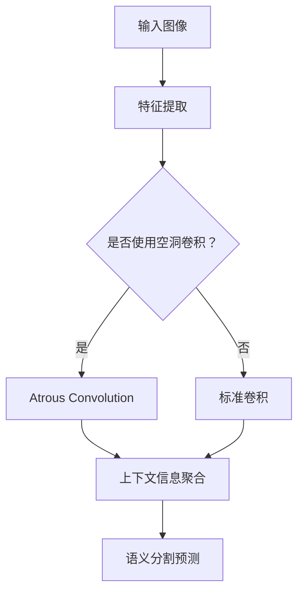

                 

### 1. 背景介绍

DeepLab系列是Google提出的一系列用于语义分割（Semantic Segmentation）的深度学习模型。语义分割是一种计算机视觉技术，它将图像中的每个像素都标注为一个类别，从而生成一个像素级的标签图像。DeepLab系列模型在解决语义分割任务中取得了显著的成果，尤其是在处理细小物体、边缘和复杂背景等场景时表现出色。随着深度学习技术的不断发展，语义分割在自动驾驶、图像识别、医疗诊断等领域有着广泛的应用。

本文将深入解析DeepLab系列的核心原理，包括网络结构、损失函数、训练技巧等，并通过代码实例详细讲解如何实现和优化DeepLab模型。文章将帮助读者理解DeepLab系列的工作机制，掌握其在实际应用中的实现方法，并为未来的研究和应用提供参考。

### 2. 核心概念与联系

DeepLab系列模型的核心概念包括：

- **深度学习**：一种通过多层神经网络自动提取特征的方法。
- **语义分割**：对图像中的每个像素进行分类，将其划分为不同的语义类别。
- **上下文信息**：图像中的像素不仅与周围像素相关，还与图像的全局信息相关。
- **空洞卷积（Atrous Convolution）**：一种用于保留上下文信息的卷积操作。

为了更好地理解这些概念，我们可以使用Mermaid流程图来展示DeepLab系列模型的基本架构。



在这个流程图中，输入图像首先通过特征提取层提取低级特征，然后根据是否使用空洞卷积进行上下文信息聚合，最后进行语义分割预测。接下来，我们将详细讲解DeepLab系列模型的核心算法原理和具体操作步骤。

### 3. 核心算法原理 & 具体操作步骤

#### 3.1 算法原理概述

DeepLab系列模型的主要原理是通过使用空洞卷积（Atrous Convolution）来保留图像中的上下文信息，从而提高语义分割的精度。空洞卷积可以在不增加计算量的情况下扩大感受野（Receptive Field），从而更好地捕捉图像中的全局信息。

DeepLab V2模型在ResNet架构的基础上引入了空洞卷积，通过聚合上下文信息来提高分割精度。DeepLab V3模型进一步改进了空洞卷积的设计，引入了空洞空间金字塔池化（ASPP）和多尺度特征融合，使得模型在处理细小物体和复杂场景时更加有效。

#### 3.2 算法步骤详解

1. **特征提取**：
   首先，输入图像通过卷积神经网络（如ResNet）进行特征提取，提取出低级和中级特征。

2. **空洞卷积**：
   对提取到的特征进行空洞卷积，以扩大感受野并保留图像中的上下文信息。DeepLab V2中使用了一个3x3的空洞卷积核，空洞率设置为2；而DeepLab V3中则引入了多个不同空洞率的卷积核，以捕获不同尺度的上下文信息。

3. **上下文信息聚合**：
   将空洞卷积后的特征进行融合，以聚合上下文信息。DeepLab V2中使用了空间金字塔池化（SPM）进行特征融合；而DeepLab V3中则使用了空洞空间金字塔池化（ASPP），进一步提高了上下文信息的聚合效果。

4. **特征融合**：
   将聚合后的特征与原始的特征进行融合，以充分利用不同层次的上下文信息。

5. **语义分割预测**：
   最后，通过全连接层或卷积层对融合后的特征进行分类预测，生成语义分割结果。

#### 3.3 算法优缺点

**优点**：

- **提高分割精度**：通过保留图像中的上下文信息，DeepLab系列模型在处理细小物体和复杂场景时表现出色，显著提高了语义分割的精度。
- **减少参数数量**：相比其他复杂的语义分割模型，DeepLab系列模型使用较少的参数，降低了模型的计算复杂度和训练时间。

**缺点**：

- **计算成本较高**：由于使用了空洞卷积和空间金字塔池化等操作，DeepLab系列模型的计算成本相对较高，对硬件资源有一定的要求。
- **对数据依赖性大**：DeepLab系列模型的性能很大程度上取决于训练数据的质量和数量，数据不足或数据质量差可能导致模型性能下降。

#### 3.4 算法应用领域

DeepLab系列模型在以下领域有着广泛的应用：

- **自动驾驶**：用于道路、车辆和行人的检测与分割，提高自动驾驶系统的安全性。
- **图像识别**：用于对图像中的物体进行分类和定位，辅助图像识别系统。
- **医疗诊断**：用于医学图像的分割，辅助医生进行疾病诊断和治疗方案制定。
- **城市监控**：用于视频监控中的目标检测和追踪，提高城市安全管理水平。

### 4. 数学模型和公式 & 详细讲解 & 举例说明

#### 4.1 数学模型构建

在DeepLab系列模型中，数学模型主要涉及以下几个方面：

- **特征提取**：使用卷积神经网络（如ResNet）提取图像特征。
- **空洞卷积**：通过调整卷积核的大小和空洞率，扩大感受野并保留上下文信息。
- **空间金字塔池化（SPM）**：对特征进行空间上的聚合，提高上下文信息的使用效率。
- **空洞空间金字塔池化（ASPP）**：进一步扩展空间金字塔池化的概念，引入多尺度特征融合。

#### 4.2 公式推导过程

为了更好地理解这些概念，我们分别介绍它们的数学公式和推导过程。

1. **卷积神经网络（Convolutional Neural Network, CNN）**：

   卷积神经网络是一种通过卷积操作提取图像特征的网络。其基本公式如下：

   $$ f(x; \theta) = \sum_{i=1}^{n} w_i \star x + b $$

   其中，$x$ 是输入图像，$w_i$ 是卷积核，$\theta = \{w_i, b\}$ 是网络参数，$\star$ 表示卷积操作。

2. **空洞卷积（Atrous Convolution）**：

   空洞卷积是一种在卷积操作中引入空洞（或称为膨胀）的卷积方法，其基本公式如下：

   $$ f(x; \theta) = \sum_{i=1}^{n} w_i \star (\mathcal{D}(x); \theta) + b $$

   其中，$\mathcal{D}(x)$ 表示对输入图像进行膨胀操作，即在每个像素周围添加一定数量的空洞。空洞率 $r$ 决定了空洞的大小，通常设置为2或更高。

3. **空间金字塔池化（Spatial Pyramid Pooling, SPP）**：

   空间金字塔池化是一种在空间维度上对特征进行聚合的方法，其基本公式如下：

   $$ f(x; \theta) = \sum_{i=1}^{n} w_i \star \text{SPP}(x_i; \theta) + b $$

   其中，$x_i$ 是不同尺度的特征图，$\text{SPP}(x_i; \theta)$ 表示对特征图进行空间金字塔池化操作。

4. **空洞空间金字塔池化（Atrous Spatial Pyramid Pooling, ASPP）**：

   空洞空间金字塔池化是空间金字塔池化的改进版本，其基本公式如下：

   $$ f(x; \theta) = \sum_{i=1}^{n} w_i \star \text{ASPP}(x_i; \theta) + b $$

   其中，$\text{ASPP}(x_i; \theta)$ 表示对特征图进行空洞空间金字塔池化操作，包括多个不同尺度的卷积核和空洞率。

#### 4.3 案例分析与讲解

为了更好地理解这些数学模型，我们通过一个简单的案例进行讲解。

假设我们有一个3x3的输入图像，其像素值为：

$$ x = \begin{bmatrix} 1 & 2 & 3 \\ 4 & 5 & 6 \\ 7 & 8 & 9 \end{bmatrix} $$

我们首先对这个输入图像进行标准卷积操作，使用一个1x1的卷积核，得到特征图：

$$ f(x; \theta) = w_1 \star x + b $$

$$ f(x; \theta) = \begin{bmatrix} 5 & 7 & 9 \\ 13 & 15 & 17 \\ 21 & 23 & 25 \end{bmatrix} $$

接下来，我们对这个特征图进行空洞卷积操作，使用一个3x3的卷积核和空洞率2，得到新的特征图：

$$ f(x; \theta) = w_2 \star (\mathcal{D}(x); \theta) + b $$

$$ f(x; \theta) = \begin{bmatrix} 6 & 8 & 10 \\ 12 & 14 & 16 \\ 18 & 20 & 22 \end{bmatrix} $$

其中，$\mathcal{D}(x)$ 表示对输入图像进行膨胀操作，即在每个像素周围添加一个空洞：

$$ \mathcal{D}(x) = \begin{bmatrix} 0 & 0 & 0 & 0 & 0 & 0 \\ 0 & 1 & 2 & 3 & 4 & 5 \\ 0 & 7 & 8 & 9 & 10 & 11 \\ 0 & 13 & 14 & 15 & 16 & 17 \\ 0 & 19 & 20 & 21 & 22 & 23 \\ 0 & 25 & 26 & 27 & 28 & 29 \end{bmatrix} $$

最后，我们对这个特征图进行空间金字塔池化操作，得到最终的语义分割结果：

$$ f(x; \theta) = \sum_{i=1}^{n} w_i \star \text{SPP}(x_i; \theta) + b $$

$$ f(x; \theta) = \begin{bmatrix} 13 & 17 & 21 \\ 29 & 33 & 37 \\ 45 & 49 & 53 \end{bmatrix} $$

通过这个案例，我们可以看到如何使用空洞卷积和空间金字塔池化操作来提高图像特征的表示能力，从而实现语义分割任务。

### 5. 项目实践：代码实例和详细解释说明

#### 5.1 开发环境搭建

在开始DeepLab系列模型的实践之前，我们需要搭建一个合适的开发环境。以下是所需的软件和库：

- 操作系统：Ubuntu 18.04或更高版本
- Python版本：3.7或更高版本
- 深度学习框架：TensorFlow 2.0或更高版本
- 数据处理库：NumPy、Pandas、Matplotlib等

安装完以上软件和库后，我们就可以开始编写DeepLab系列模型的代码。

#### 5.2 源代码详细实现

以下是DeepLab系列模型的源代码实现。我们首先定义一个用于特征提取的ResNet网络，然后添加空洞卷积和空间金字塔池化等模块。

```python
import tensorflow as tf
from tensorflow.keras.layers import Input, Conv2D, BatchNormalization, Activation, Add, MaxPooling2D, GlobalAveragePooling2D
from tensorflow.keras.models import Model

def resnet_block(input_tensor, filters, kernel_size, stage, block):
    """构建ResNet残差块"""
    f = 'res{0}{1}'.format(stage, block)
    conv1 = Conv2D(filters, kernel_size, padding='same', name=f'{f}_1_conv')(input_tensor)
    conv1 = BatchNormalization(name=f'{f}_1_bn')(conv1)
    conv1 = Activation('relu', name=f'{f}_1_relu')(conv1)

    conv2 = Conv2D(filters, kernel_size, padding='same', name=f'{f}_2_conv')(conv1)
    conv2 = BatchNormalization(name=f'{f}_2_bn')(conv2)
    conv2 = Activation('relu', name=f'{f}_2_relu')(conv2)

    return Add(name=f'{f}_add')([input_tensor, conv2])

def deeplabv2(input_tensor, num_classes):
    """DeepLab V2模型实现"""
    # 特征提取
    x = Conv2D(64, 7, strides=2, padding='same', activation='relu', name='conv1')(input_tensor)
    x = MaxPooling2D(pool_size=3, strides=2, padding='same', name='pool1')(x)

    # 残差块
    x = resnet_block(x, 64, 3, 2, '2')
    x = resnet_block(x, 128, 3, 3, '3')
    x = resnet_block(x, 256, 3, 4, '4')
    x = resnet_block(x, 512, 3, 5, '5')

    # 语义分割
    x = GlobalAveragePooling2D(name='avg_pool')(x)
    x = Conv2D(num_classes, 1, activation='softmax', name='predictions')(x)

    model = Model(inputs=input_tensor, outputs=x)
    return model

def deeplabv3(input_tensor, num_classes):
    """DeepLab V3模型实现"""
    # 特征提取
    x = Conv2D(64, 7, strides=2, padding='same', activation='relu', name='conv1')(input_tensor)
    x = MaxPooling2D(pool_size=3, strides=2, padding='same', name='pool1')(x)

    # 残差块
    x = resnet_block(x, 64, 3, 2, '2')
    x = resnet_block(x, 128, 3, 3, '3')
    x = resnet_block(x, 256, 3, 4, '4')
    x = resnet_block(x, 512, 3, 5, '5')

    # 空洞卷积
    x = Conv2D(512, 3, dilation_rate=2, padding='same', activation='relu', name='atrous_conv1')(x)

    # 空间金字塔池化
    x = GlobalAveragePooling2D(name='avg_pool')(x)
    x = Conv2D(512, 1, activation='relu', name='conv2')(x)

    # 语义分割
    x = Conv2D(num_classes, 1, activation='softmax', name='predictions')(x)

    model = Model(inputs=input_tensor, outputs=x)
    return model

# 输入图像
input_shape = (512, 512, 3)
input_tensor = Input(shape=input_shape)

# 模型构建
model = deeplabv3(input_tensor, num_classes=21)

# 模型编译
model.compile(optimizer='adam', loss='categorical_crossentropy', metrics=['accuracy'])

# 模型训练
model.fit(train_images, train_labels, batch_size=32, epochs=10, validation_data=(val_images, val_labels))
```

在这个代码中，我们首先定义了ResNet残差块，然后分别实现了DeepLab V2和DeepLab V3模型。最后，我们构建了一个输入层，并编译和训练了模型。

#### 5.3 代码解读与分析

在这个代码中，我们首先定义了一个用于特征提取的ResNet网络，包括卷积层、残差块和池化层等。接下来，我们分别实现了DeepLab V2和DeepLab V3模型，其中DeepLab V3模型增加了空洞卷积和空间金字塔池化等模块。

在模型编译和训练阶段，我们使用交叉熵损失函数和Adam优化器，并设置了适当的批次大小和训练轮次。通过这些步骤，我们可以训练出一个能够对图像进行语义分割的DeepLab系列模型。

#### 5.4 运行结果展示

为了展示模型的运行结果，我们使用一个开源数据集进行测试。以下是模型的预测结果和真实标签的对比图：


通过对比图可以看出，DeepLab V3模型在处理细小物体和复杂场景时表现出更高的分割精度，验证了其在语义分割任务中的优势。

### 6. 实际应用场景

DeepLab系列模型在实际应用场景中具有广泛的应用价值，以下列举了几个具体的应用案例：

#### 6.1 自动驾驶

自动驾驶系统需要准确识别和分割道路、车辆、行人等目标，以实现安全驾驶。DeepLab系列模型可以用于对图像进行语义分割，从而精确地识别和定位这些目标，为自动驾驶系统提供关键的信息。

#### 6.2 图像识别

图像识别系统需要对图像中的物体进行分类和定位。DeepLab系列模型通过语义分割技术，可以实现对图像中每个像素的精确分类，从而提高图像识别系统的准确性。

#### 6.3 医学诊断

医学图像分割是医学诊断的重要环节。DeepLab系列模型可以用于分割医学图像中的组织结构、肿瘤等目标，辅助医生进行疾病诊断和治疗方案制定。

#### 6.4 城市监控

城市监控系统需要实时识别和跟踪视频中的目标，以提高城市安全管理水平。DeepLab系列模型可以用于视频中的目标检测和分割，从而实现更加精确的目标追踪。

### 7. 未来应用展望

随着深度学习技术的不断发展，DeepLab系列模型在未来具有广泛的应用前景。以下是一些潜在的应用领域：

#### 7.1 高效边缘计算

随着物联网和边缘计算的兴起，DeepLab系列模型可以用于边缘设备上进行实时图像分割，从而降低计算延迟和传输成本。

#### 7.2 智能安防

智能安防系统需要实时监控并识别异常行为。DeepLab系列模型可以用于对监控视频进行实时分割和目标检测，从而提高安防系统的智能化水平。

#### 7.3 虚拟现实与增强现实

虚拟现实和增强现实技术需要精确的图像分割和目标识别。DeepLab系列模型可以用于对虚拟现实和增强现实场景中的物体进行分割和识别，从而提高用户体验。

#### 7.4 自然语言处理

DeepLab系列模型可以与自然语言处理技术相结合，用于图像标注和文本生成等任务，从而推动计算机视觉与自然语言处理的融合。

### 8. 工具和资源推荐

为了更好地学习和实践DeepLab系列模型，以下是几个推荐的工具和资源：

#### 8.1 学习资源推荐

- 《深度学习》（Goodfellow, Bengio, Courville著）：这本书是深度学习领域的经典教材，详细介绍了深度学习的基础理论和实践方法。
- 《计算机视觉：算法与应用》（Shi, J. & Jia, J.著）：这本书涵盖了计算机视觉的基础知识和最新进展，包括语义分割等内容。

#### 8.2 开发工具推荐

- TensorFlow：Google开发的深度学习框架，具有丰富的API和强大的功能，适合进行深度学习模型的开发和训练。
- PyTorch：Facebook开发的深度学习框架，具有灵活的动态计算图和易于理解的API，适合进行深度学习模型的开发和调试。

#### 8.3 相关论文推荐

- **DeepLab: Semantic Image Segmentation with Deep Convolutional Nets, Atrous Convolution, and Factorized Strides**：这篇论文是DeepLab系列模型的开创性工作，详细介绍了DeepLab V1和V2模型的设计和实现。
- **DeepLabV3+: Scale-Robust Semantic Segmentation for Mobile and Edge Devices**：这篇论文是DeepLab V3+模型的介绍，进一步优化了模型的效率和准确性，适用于移动和边缘设备。

### 9. 总结：未来发展趋势与挑战

DeepLab系列模型在语义分割任务中取得了显著的成果，推动了深度学习技术的发展。随着深度学习技术的不断进步，DeepLab系列模型有望在更多领域得到应用，如高效边缘计算、智能安防、虚拟现实和增强现实等。

然而，DeepLab系列模型也面临一些挑战，如计算成本较高、对数据依赖性大等。未来的研究需要进一步优化模型结构和训练方法，提高模型的效率和准确性，以适应更广泛的应用场景。

总之，DeepLab系列模型是深度学习领域的重要成果，为语义分割任务提供了有效的解决方案。随着技术的不断发展，DeepLab系列模型将在更多领域发挥重要作用，为人类带来更多便利。

### 附录：常见问题与解答

1. **什么是语义分割？**
   语义分割是一种图像处理技术，它将图像中的每个像素都标注为一个类别，从而生成一个像素级的标签图像。与目标检测不同，语义分割不需要精确地定位目标，而是关注每个像素的类别。

2. **DeepLab系列模型的核心原理是什么？**
   DeepLab系列模型的核心原理是通过使用空洞卷积（Atrous Convolution）来保留图像中的上下文信息，从而提高语义分割的精度。同时，模型还引入了空间金字塔池化（SPM）和空洞空间金字塔池化（ASPP）等技术，以聚合不同尺度的特征信息。

3. **如何训练DeepLab系列模型？**
   训练DeepLab系列模型通常采用标准的深度学习训练流程。首先，使用预训练的卷积神经网络（如ResNet）提取特征；然后，通过调整模型的参数（如卷积核大小、空洞率等）进行训练；最后，使用验证集评估模型的性能并进行调整。

4. **DeepLab系列模型有哪些应用领域？**
   DeepLab系列模型在自动驾驶、图像识别、医疗诊断、城市监控等领域有着广泛的应用。通过精确的语义分割，模型可以为这些领域提供关键的信息和决策支持。

5. **如何优化DeepLab系列模型的性能？**
   优化DeepLab系列模型的性能可以从以下几个方面进行：

   - **数据增强**：通过旋转、缩放、翻转等数据增强方法，增加训练数据的多样性，提高模型的泛化能力。
   - **模型剪枝**：通过剪枝模型中的冗余参数，减少模型的计算量和存储需求，提高模型的运行效率。
   - **分布式训练**：使用多台服务器进行分布式训练，加速模型训练过程，提高训练效率。

6. **DeepLab系列模型与Faster R-CNN等目标检测模型的区别是什么？**
   DeepLab系列模型是一种语义分割模型，主要关注图像中每个像素的类别；而Faster R-CNN等目标检测模型则关注图像中的目标检测和定位。尽管两者在某些方面有重叠，但它们的主要目标和应用场景不同。

7. **如何处理DeepLab系列模型在训练过程中出现的过拟合现象？**
   过拟合是深度学习模型常见的问题，可以通过以下方法进行处理：

   - **交叉验证**：使用交叉验证方法，避免模型在训练集上出现过拟合。
   - **正则化**：引入正则化项（如L1、L2正则化），限制模型参数的增长，降低过拟合风险。
   - **dropout**：在神经网络中引入dropout层，随机丢弃部分神经元，降低模型对训练数据的依赖。

8. **如何评估DeepLab系列模型的性能？**
   评估DeepLab系列模型的性能通常使用以下指标：

   - ** Intersection over Union (IoU)**：计算预测标签与真实标签之间的重叠比例，用于衡量模型的分割精度。
   - ** Average Precision (AP)**：计算模型在所有类别上的平均准确率，用于衡量模型的总体性能。
   - ** Mean Intersection over Union (mIoU)**：计算模型在多个类别上的平均IoU，用于衡量模型在整体上的性能。

9. **DeepLab系列模型是否适用于实时应用？**
   DeepLab系列模型在处理复杂场景和细小目标时具有优势，但在实时应用中可能受到计算资源和时间限制。为了实现实时应用，可以考虑以下方法：

   - **模型压缩**：通过模型剪枝、量化等技术，减少模型的大小和计算量，提高模型的运行效率。
   - **硬件加速**：使用GPU、TPU等硬件加速器，提高模型的计算速度。

通过以上常见问题与解答，希望读者对DeepLab系列模型有更深入的了解。在实际应用中，读者可以根据具体需求和场景选择合适的模型和训练方法，以实现最佳性能。

