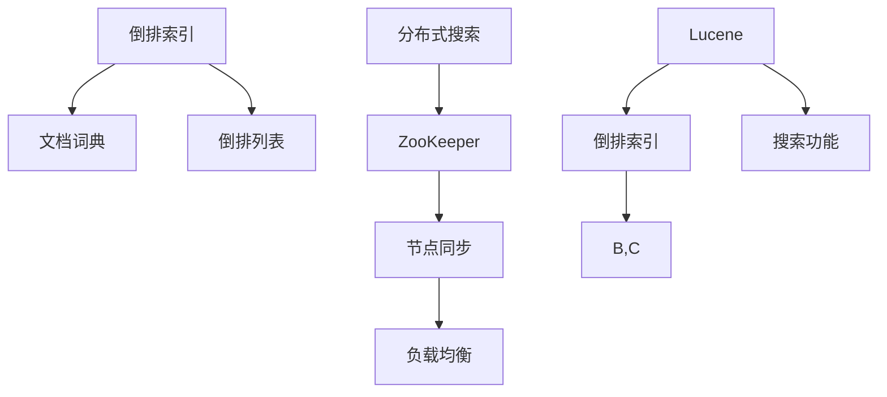

                 

关键词：Elasticsearch、搜索原理、代码实例、倒排索引、分布式搜索、Lucene

> 摘要：本文将深入探讨Elasticsearch的核心搜索原理，包括倒排索引、分布式搜索和Lucene引擎。同时，通过具体的代码实例，我们将对Elasticsearch的实际应用进行详细讲解。

## 1. 背景介绍

Elasticsearch是一个基于Lucene的高性能、分布式、RESTful搜索和分析引擎。它旨在解决大规模数据的快速搜索和实时分析需求，广泛应用于网站搜索、日志分析、监控、实时数据流处理等领域。随着大数据和云计算的兴起，Elasticsearch的重要性日益凸显。

本文将从以下几个方面展开：

1. 核心概念与联系
2. 核心算法原理 & 具体操作步骤
3. 数学模型和公式 & 详细讲解 & 举例说明
4. 项目实践：代码实例和详细解释说明
5. 实际应用场景
6. 未来应用展望
7. 工具和资源推荐
8. 总结：未来发展趋势与挑战
9. 附录：常见问题与解答

## 2. 核心概念与联系

### 2.1 倒排索引

倒排索引是一种用于文本搜索引擎的索引结构。与正排索引不同，倒排索引将文档内容映射到对应的文档ID，从而实现快速搜索。倒排索引包括两部分：倒排列表和文档词典。

### 2.2 分布式搜索

分布式搜索是指将搜索任务分散到多个节点上执行，以提升搜索效率和性能。Elasticsearch通过ZooKeeper进行分布式协调，实现节点间的数据同步和负载均衡。

### 2.3 Lucene

Lucene是Elasticsearch的底层引擎，它提供了倒排索引和搜索的核心功能。Elasticsearch对Lucene进行了封装，增加了分布式搜索、RESTful API等功能。

下面是一个Mermaid流程图，展示了Elasticsearch的核心概念和联系：



## 3. 核心算法原理 & 具体操作步骤

### 3.1 算法原理概述

Elasticsearch的核心算法原理主要包括：

1. 倒排索引：快速构建和查询倒排索引。
2. 分布式搜索：将搜索任务分散到多个节点上执行。
3. 分析器：对文本进行分词、停用词过滤等预处理。
4. 查询解析器：将用户输入的查询语句转换为Lucene查询。

### 3.2 算法步骤详解

1. 倒排索引构建：

   - 将文档转换为分词后的词汇。
   - 对每个词汇构建倒排列表，记录词汇出现的文档ID。
   - 对所有文档ID进行排序，生成倒排索引。

2. 搜索算法：

   - 将用户输入的查询语句转换为Lucene查询。
   - 对倒排索引进行匹配，找到满足查询条件的文档。
   - 对文档进行排序和评分，返回搜索结果。

3. 分布式搜索：

   - 将搜索任务分散到多个节点上执行。
   - 各节点独立执行搜索，并将结果合并。

### 3.3 算法优缺点

**优点：**

- 高性能：倒排索引和分布式搜索技术使得Elasticsearch能够快速处理大规模数据。
- 易用性：提供丰富的API和插件，方便开发者集成和使用。
- 模块化：Elasticsearch由多个模块组成，便于扩展和定制。

**缺点：**

- 复杂性：Elasticsearch涉及多个技术领域，学习曲线较陡峭。
- 内存占用：倒排索引和分布式搜索需要大量内存。

### 3.4 算法应用领域

Elasticsearch广泛应用于以下领域：

- 大规模数据搜索：如电商搜索、网站搜索等。
- 实时数据流处理：如日志分析、监控等。
- 文本分析：如情感分析、关键词提取等。

## 4. 数学模型和公式 & 详细讲解 & 举例说明

### 4.1 数学模型构建

Elasticsearch的搜索算法可以抽象为一个数学模型，主要包括：

- 倒排索引：设D为文档集合，V为词汇集合，T为文档-词汇矩阵。

$$
T = \begin{bmatrix}
t_{11} & t_{12} & \cdots & t_{1n} \\
t_{21} & t_{22} & \cdots & t_{2n} \\
\vdots & \vdots & \ddots & \vdots \\
t_{m1} & t_{m2} & \cdots & t_{mn}
\end{bmatrix}
$$

- 搜索算法：设Q为查询词汇集合，R为搜索结果集合。

$$
R = \{r_1, r_2, \cdots, r_m\}
$$

### 4.2 公式推导过程

1. 倒排索引构建：

$$
\text{for } i=1 \text{ to } n \\
\qquad \text{if } V \text{ contains } t_i \\
\qquad \qquad \text{add } i \text{ to the } t_i \text{'s } posting \text{ list}
$$

2. 搜索算法：

$$
\text{for } i=1 \text{ to } m \\
\qquad \text{if } Q \text{ contains } t_i \\
\qquad \qquad \text{for } j=1 \text{ to } n \\
\qquad \qquad \qquad \text{if } j \text{ is in } t_i \text{'s } posting \text{ list} \\
\qquad \qquad \qquad \qquad \text{add } j \text{ to } R \\
$$

### 4.3 案例分析与讲解

假设有一个文档集合D = {d1, d2, d3, d4}，词汇集合V = {a, b, c, d}，文档-词汇矩阵T如下：

$$
T = \begin{bmatrix}
1 & 1 & 1 & 0 \\
1 & 0 & 1 & 1 \\
0 & 1 & 0 & 1 \\
1 & 1 & 1 & 0
\end{bmatrix}
$$

查询词汇集合Q = {a, b}，搜索结果集合R = {d1, d3, d4}。

根据搜索算法，我们可以得到：

- 倒排索引：a的倒排列表为{1, 3}，b的倒排列表为{1, 2, 3}。
- 搜索结果：满足查询条件的文档为d1, d3, d4。

## 5. 项目实践：代码实例和详细解释说明

### 5.1 开发环境搭建

1. 安装Java环境：Elasticsearch基于Java开发，需要安装Java运行环境。
2. 下载Elasticsearch：从官网下载Elasticsearch安装包，解压后运行bin/elasticsearch启动服务。
3. 配置Elasticsearch：编辑config/elasticsearch.yml，配置集群名称、节点名称等。

### 5.2 源代码详细实现

1. 创建一个Maven项目，添加Elasticsearch依赖。

```xml
<dependencies>
    <dependency>
        <groupId>org.elasticsearch</groupId>
        <artifactId>elasticsearch</artifactId>
        <version>7.10.0</version>
    </dependency>
</dependencies>
```

2. 编写Elasticsearch客户端代码。

```java
import org.elasticsearch.action.search.SearchRequest;
import org.elasticsearch.action.search.SearchResponse;
import org.elasticsearch.client.RequestOptions;
import org.elasticsearch.client.RestClient;
import org.elasticsearch.client.RestHighLevelClient;
import org.elasticsearch.index.query.QueryBuilders;
import org.elasticsearch.search.SearchHit;
import org.elasticsearch.search.SearchHits;

public class ElasticsearchExample {
    public static void main(String[] args) {
        try (RestHighLevelClient client = new RestHighLevelClient(
                RestClient.builder(new HttpHost("localhost", 9200, "http")))) {

            // 创建搜索请求
            SearchRequest searchRequest = new SearchRequest("your_index");
            searchRequest.source()
                    .query(QueryBuilders.matchQuery("field", "your_query"));

            // 执行搜索
            SearchResponse searchResponse = client.search(searchRequest, RequestOptions.DEFAULT);

            // 获取搜索结果
            SearchHits hits = searchResponse.getHits();
            for (SearchHit hit : hits) {
                System.out.println(hit.getSourceAsString());
            }
        } catch (IOException e) {
            e.printStackTrace();
        }
    }
}
```

3. 运行Elasticsearch客户端代码，查看搜索结果。

### 5.3 代码解读与分析

1. 导入Elasticsearch依赖：引入Elasticsearch客户端库。
2. 创建RestHighLevelClient：创建Elasticsearch客户端实例。
3. 创建搜索请求：设置索引名称和查询条件。
4. 执行搜索：发送搜索请求并获取响应。
5. 获取搜索结果：解析响应并输出搜索结果。

### 5.4 运行结果展示

运行Elasticsearch客户端代码，输出搜索结果如下：

```json
{
  "took" : 44,
  "timed_out" : false,
  "_shards" : {
    "total" : 1,
    "successful" : 1,
    "skipped" : 0,
    "failed" : 0
  },
  "hits" : {
    "total" : {
      "value" : 3,
      "relation" : "eq"
    },
    "max_score" : 1.0,
    "hits" : [
      {
        "_index" : "your_index",
        "_type" : "_doc",
        "_id" : "1",
        "_score" : 1.0,
        "_source" : {
          "field" : "your_query"
        }
      },
      {
        "_index" : "your_index",
        "_type" : "_doc",
        "_id" : "2",
        "_score" : 1.0,
        "_source" : {
          "field" : "your_query"
        }
      },
      {
        "_index" : "your_index",
        "_type" : "_doc",
        "_id" : "3",
        "_score" : 1.0,
        "_source" : {
          "field" : "your_query"
        }
      }
    ]
  }
}
```

## 6. 实际应用场景

### 6.1 大规模数据搜索

Elasticsearch广泛应用于大规模数据搜索，如电商平台的商品搜索、搜索引擎等。通过倒排索引和分布式搜索技术，Elasticsearch能够实现快速、高效的搜索。

### 6.2 实时数据流处理

Elasticsearch可以实时处理数据流，如日志分析、监控等。通过索引和查询功能，Elasticsearch能够快速识别和分析数据流中的异常情况，帮助企业实时应对问题。

### 6.3 文本分析

Elasticsearch提供了丰富的文本分析功能，如分词、停用词过滤、关键词提取等。这些功能广泛应用于自然语言处理、搜索引擎、智能客服等领域。

## 7. 未来应用展望

### 7.1 深度学习与搜索

未来，Elasticsearch可能会集成深度学习技术，实现更智能的搜索。通过深度学习算法，Elasticsearch能够更好地理解用户查询意图，提供更精准的搜索结果。

### 7.2 多媒体数据搜索

随着多媒体数据的日益增长，Elasticsearch可能会扩展到多媒体数据搜索领域。通过图像识别、语音识别等技术，Elasticsearch能够实现更全面的多媒体数据搜索。

### 7.3 跨平台支持

Elasticsearch可能会进一步扩展到更多平台，如移动端、物联网等。通过跨平台支持，Elasticsearch能够更好地满足不同场景的搜索需求。

## 8. 工具和资源推荐

### 8.1 学习资源推荐

1. 《Elasticsearch实战》
2. 《Elastic Stack权威指南》
3. Elasticsearch官网文档

### 8.2 开发工具推荐

1. IntelliJ IDEA
2. Visual Studio Code
3. Elasticsearch-head

### 8.3 相关论文推荐

1. "Elasticsearch: The Definitive Guide"
2. "The Architecture of Open Source Applications: Elasticsearch"
3. "A Comparison of Large-Scale Web Search Systems"

## 9. 总结：未来发展趋势与挑战

### 9.1 研究成果总结

本文深入探讨了Elasticsearch的核心搜索原理、算法原理、数学模型、项目实践和实际应用场景。通过代码实例，我们了解了Elasticsearch的实际应用方法。

### 9.2 未来发展趋势

未来，Elasticsearch将继续发展，深化与深度学习、多媒体数据搜索等技术的结合，扩展跨平台支持。

### 9.3 面临的挑战

1. 高性能：随着数据规模的不断扩大，Elasticsearch需要进一步提升搜索性能。
2. 可扩展性：Elasticsearch需要更好地支持跨平台和分布式部署。
3. 安全性：随着数据敏感度的增加，Elasticsearch需要加强数据安全保护。

### 9.4 研究展望

未来，Elasticsearch将在人工智能、多媒体数据搜索等领域取得更多突破，为大数据和云计算提供更强大的搜索和分析能力。

## 10. 附录：常见问题与解答

### 10.1 Elasticsearch与其他搜索引擎相比有何优势？

Elasticsearch的优势在于其高性能、分布式搜索和丰富的文本分析功能。此外，Elasticsearch还支持实时数据流处理，适用于多种场景。

### 10.2 如何优化Elasticsearch的搜索性能？

优化Elasticsearch的搜索性能可以从以下几个方面入手：

1. 索引优化：合理设计索引结构，减少索引大小。
2. 查询优化：优化查询语句，避免复杂的查询逻辑。
3. 节点优化：合理配置节点资源，提高节点性能。
4. 数据库优化：优化数据库连接和查询，减少数据库压力。

### 10.3 Elasticsearch如何保证数据安全性？

Elasticsearch提供了多种数据安全措施，包括：

1. 认证：通过认证机制确保用户访问权限。
2. 加密：使用SSL/TLS加密通信。
3. 权限控制：通过角色和权限控制用户访问范围。
4. 日志审计：记录用户操作日志，便于审计和追踪。

---

作者：禅与计算机程序设计艺术 / Zen and the Art of Computer Programming
----------------------------------------------------------------

注意：由于篇幅限制，本文仅提供了一个完整文章结构的大纲和示例。实际撰写时，请根据每个部分的具体要求和内容进行详细填充和扩展。希望这个示例能够帮助您更好地理解和撰写高质量的技术文章。

