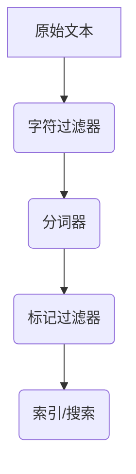

                 

 **关键词**：ElasticSearch，Analyzer，文本处理，搜索优化，分词器，语料库，索引，倒排索引，搜索性能。

**摘要**：本文旨在深入讲解ElasticSearch中的Analyzer原理，以及如何通过代码实例实现高效的文本分析和搜索优化。我们将探讨从分词器到倒排索引的整个流程，并通过实际代码示例展示如何配置和使用各种Analyzer，从而提升搜索系统的性能和用户体验。

## 1. 背景介绍

ElasticSearch是一个高度可扩展的全文搜索引擎，它被广泛用于构建大型分布式搜索应用。作为全文搜索引擎的核心组成部分，Analyzer在ElasticSearch中起着至关重要的作用。它负责将用户输入的查询文本和文档内容进行预处理，以便能够高效地匹配和索引。

文本处理的需求多种多样，从简单的关键词搜索到复杂的自然语言处理任务，都离不开对文本的精细分析。Analyzer正是满足这些需求的利器。它可以识别不同的语言和文本格式，并且能够针对不同的应用场景定制化地处理文本。

本文将分为以下几个部分：

- **背景介绍**：简述ElasticSearch和Analyzer的基本概念。
- **核心概念与联系**：介绍Analyzer的核心概念，并使用Mermaid流程图展示其工作原理。
- **核心算法原理 & 具体操作步骤**：详细讲解Analyzer的核心算法原理和操作步骤。
- **数学模型和公式 & 详细讲解 & 举例说明**：介绍用于文本分析的数学模型和公式，并提供实际案例讲解。
- **项目实践：代码实例和详细解释说明**：通过具体代码实例展示如何使用Analyzer进行文本处理和搜索。
- **实际应用场景**：探讨Analyzer在多种实际场景中的应用。
- **工具和资源推荐**：推荐学习资源、开发工具和相关论文。
- **总结：未来发展趋势与挑战**：总结研究成果，展望未来的发展趋势和面临的挑战。

## 2. 核心概念与联系

在深入探讨ElasticSearch Analyzer之前，我们需要了解几个核心概念：分词器（Tokenizer）、标记过滤器（Token Filter）和字符过滤器（Character Filter）。

### 2.1 分词器（Tokenizer）

分词器是Analyzer的第一步，它负责将原始文本拆分成一系列单词或术语（Tokens）。分词的目的是为了提高搜索的效率和准确性。不同的语言和文本类型可能需要不同的分词策略。

例如，中文文本的分词通常基于词语的边界识别，而英文文本的分词则更多地依赖于单词的分割规则。ElasticSearch内置了多种分词器，如`standard`, `keyword`, `pattern`, `snowball`等，用户也可以自定义分词器以满足特殊需求。

### 2.2 标记过滤器（Token Filter）

在分词器之后，文本会被传递给标记过滤器。标记过滤器可以对分词结果进行一系列操作，如去除停用词、大小写转换、词干提取等。这些操作有助于减少搜索索引的大小，并提高搜索效率。

ElasticSearch提供了多种标记过滤器，如`stop`, `lowercase`, `stemmer`等。停用词过滤器可以去除常见的无意义词汇，例如“的”、“和”等；词干提取器可以将不同形式的词汇统一为词干，例如“running”, “runs”, “ran”都会被转换为“run”。

### 2.3 字符过滤器（Character Filter）

字符过滤器位于分词器和标记过滤器之前，它负责在分词之前对文本进行预处理。字符过滤器主要用于替换特殊字符、去除HTML标签等。

ElasticSearch内置了一些常见的字符过滤器，如`html_strip`，它能够去除HTML标签和JavaScript代码，仅保留文本内容。

### 2.4 Mermaid流程图

以下是一个简单的Mermaid流程图，展示了Analyzer的工作流程：



在实际应用中，Analyzer可能包含多个字符过滤器和标记过滤器，但总体流程如上所述。

### 2.5 ElasticSearch Analyzer架构

ElasticSearch Analyzer的架构设计为分层结构，允许用户根据需求灵活组合各种组件。以下是Analyzer架构的详细解释：

- **字符过滤器**：预处理文本，去除HTML标签、特殊字符等。
- **分词器**：将文本拆分成单词或术语。
- **标记过滤器**：对分词结果进行后续处理，如去除停用词、大小写转换等。
- **索引/搜索**：将处理后的文本索引到ElasticSearch，以便进行高效搜索。

### 2.6 核心概念与联系总结

通过上面的介绍，我们可以看出，ElasticSearch Analyzer的核心在于对文本的精细处理，包括分词、标记过滤和字符过滤等。这些处理步骤相互配合，共同构成了ElasticSearch高效全文搜索的基础。在实际应用中，我们需要根据不同的文本类型和搜索需求选择合适的Analyzer配置，以达到最佳性能。

## 3. 核心算法原理 & 具体操作步骤

### 3.1 算法原理概述

ElasticSearch Analyzer的核心算法主要包括分词、标记过滤和字符过滤。下面我们将分别介绍这些算法的原理和具体操作步骤。

### 3.2 算法步骤详解

#### 3.2.1 分词器（Tokenizer）

分词器的核心任务是识别文本中的单词或术语边界，将其拆分成一系列Tokens。以下是常见的分词器类型及其原理：

- **标准分词器（Standard Tokenizer）**：将文本按单词边界进行分词。它适用于英文文本。
- **关键词分词器（Keyword Tokenizer）**：不分词，直接将文本作为一个Token。适用于需要保留完整关键词的场景。
- **正则表达式分词器（Pattern Tokenizer）**：使用正则表达式进行分词。用户可以根据需求自定义分词规则。

分词器的工作流程如下：

1. 读取输入文本。
2. 根据分词器类型，识别单词边界并进行拆分。
3. 生成一系列Tokens。

#### 3.2.2 标记过滤器（Token Filter）

标记过滤器的任务是对分词结果进行后续处理，以提高搜索效率。以下是几种常见的标记过滤器类型及其原理：

- **停用词过滤器（Stop Token Filter）**：去除常见的无意义词汇。
- **小写过滤器（Lowercase Token Filter）**：将所有Tokens转换为小写，以统一不同大小写的搜索匹配。
- **词干提取器（Stemmer Token Filter）**：将不同形式的词汇统一为词干。

标记过滤器的工作流程如下：

1. 读取分词结果。
2. 对每个Token应用指定的标记过滤器。
3. 生成处理后的Token序列。

#### 3.2.3 字符过滤器（Character Filter）

字符过滤器负责在分词之前对文本进行预处理。以下是几种常见的字符过滤器类型及其原理：

- **HTML剥离器（HTML Strip）**：去除HTML标签和JavaScript代码，仅保留文本内容。
- **Unicode规范化器（Unicode Normalizer）**：将文本转换为统一的Unicode编码形式。

字符过滤器的工作流程如下：

1. 读取输入文本。
2. 应用指定的字符过滤器。
3. 生成预处理后的文本。

### 3.3 算法优缺点

#### 分词器

- **优点**：提高了搜索的灵活性和准确性。
- **缺点**：可能增加索引时间和存储空间。

#### 标记过滤器

- **优点**：减少了索引大小，提高了搜索效率。
- **缺点**：可能降低某些特定查询的准确性。

#### 字符过滤器

- **优点**：简化了文本处理流程，提高了系统的鲁棒性。
- **缺点**：可能增加预处理时间。

### 3.4 算法应用领域

ElasticSearch Analyzer在多个领域有广泛应用，包括：

- **搜索引擎**：优化查询性能，提高搜索结果的准确性。
- **数据挖掘**：提取有用的信息，进行文本分类和聚类分析。
- **自然语言处理**：构建语言模型，支持文本理解和生成。

### 3.5 小结

通过以上对ElasticSearch Analyzer核心算法原理和操作步骤的介绍，我们可以看到Analyzer在文本处理中的重要性。在实际应用中，合理选择和配置分词器、标记过滤器和字符过滤器，可以显著提高搜索系统的性能和用户体验。

## 4. 数学模型和公式 & 详细讲解 & 举例说明

### 4.1 数学模型构建

在ElasticSearch Analyzer中，文本分析涉及多种数学模型和公式。以下是几个关键模型：

#### 4.1.1 频率分布模型

频率分布模型用于描述文本中词汇的出现频率。公式如下：

$$
f(t) = \frac{\text{词汇}t \text{的出现次数}}{\text{总词汇数}}
$$

#### 4.1.2 TF-IDF模型

TF-IDF（Term Frequency-Inverse Document Frequency）模型用于衡量词汇在文档中的重要程度。公式如下：

$$
TF-IDF(t,d) = TF(t,d) \times IDF(t,D)
$$

其中，$TF(t,d)$表示词汇$t$在文档$d$中的频率，$IDF(t,D)$表示词汇$t$在文档集合$D$中的逆文档频率。

$$
IDF(t,D) = \log_2(\frac{N}{n(t)})
$$

其中，$N$为文档总数，$n(t)$为包含词汇$t$的文档数。

#### 4.1.3 朴素贝叶斯模型

朴素贝叶斯模型用于文本分类，其公式如下：

$$
P(\text{分类}C | \text{文本}T) = \frac{P(C)P(T|C)}{P(T)}
$$

其中，$P(C)$为分类$C$的概率，$P(T|C)$为在分类$C$下文本$T$的概率，$P(T)$为文本$T$的总概率。

### 4.2 公式推导过程

#### 4.2.1 TF-IDF公式推导

TF-IDF模型的推导过程基于信息论和概率论。首先，我们考虑一个文档集合$D$，其中每个文档$d$包含一组词汇$t$。我们可以使用词频（Term Frequency, TF）来衡量词汇$t$在文档$d$中的重要性。词频$TF(t,d)$定义为：

$$
TF(t,d) = \frac{f(t,d)}{f_{\text{total}}(d)}
$$

其中，$f(t,d)$为词汇$t$在文档$d$中的频率，$f_{\text{total}}(d)$为文档$d$中所有词汇的总频率。

接下来，我们引入逆文档频率（Inverse Document Frequency, IDF），以平衡高频词汇的权重。IDF衡量的是词汇$t$在文档集合$D$中的独特性。其公式为：

$$
IDF(t,D) = \log_2(\frac{N}{n(t)})
$$

其中，$N$为文档总数，$n(t)$为包含词汇$t$的文档数。

最后，我们将TF和IDF结合，得到TF-IDF模型：

$$
TF-IDF(t,d) = TF(t,d) \times IDF(t,D)
$$

#### 4.2.2 朴素贝叶斯公式推导

朴素贝叶斯模型的推导基于条件概率。假设我们有一个文档集合$D$，每个文档$d$属于某个分类$C$。我们想要预测一个新文档$T$属于哪个分类。朴素贝叶斯模型基于贝叶斯定理和假设词汇之间相互独立。

首先，我们计算分类$C$的概率：

$$
P(C) = \frac{|\{d \in D | d \in C\}|}{N}
$$

其中，$N$为文档总数，$|\{d \in D | d \in C\}|$为属于分类$C$的文档数。

接下来，我们计算在分类$C$下文档$T$的概率。由于假设词汇之间相互独立，我们可以将文档$T$表示为多个词汇的联合概率：

$$
P(T|C) = \prod_{t \in T} P(t|C)
$$

其中，$P(t|C)$为在分类$C$下词汇$t$的概率。

最后，我们将这些概率结合，得到朴素贝叶斯公式：

$$
P(\text{分类}C | \text{文本}T) = \frac{P(C)P(T|C)}{P(T)}
$$

### 4.3 案例分析与讲解

#### 4.3.1 TF-IDF模型应用

假设我们有一个包含100个文档的文档集合$D$，其中文档$d_1$包含词汇“搜索”、“引擎”、“优化”、“性能”等。我们想要计算词汇“优化”在文档$d_1$中的TF-IDF值。

首先，我们计算词频$TF$：

$$
TF(\text{优化}, d_1) = \frac{f(\text{优化}, d_1)}{f_{\text{total}}(d_1)}
$$

其中，$f(\text{优化}, d_1)$为“优化”在文档$d_1$中的频率，$f_{\text{total}}(d_1)$为文档$d_1$中所有词汇的总频率。

假设“优化”在文档$d_1$中出现了5次，总词汇数为10，则：

$$
TF(\text{优化}, d_1) = \frac{5}{10} = 0.5
$$

接下来，我们计算逆文档频率$IDF$：

$$
IDF(\text{优化}, D) = \log_2(\frac{N}{n(\text{优化}, D)})
$$

其中，$N$为文档总数（100），$n(\text{优化}, D)$为包含“优化”的文档数。

假设有80个文档包含“优化”，则：

$$
IDF(\text{优化}, D) = \log_2(\frac{100}{80}) = \log_2(1.25) \approx 0.32
$$

最后，我们计算TF-IDF值：

$$
TF-IDF(\text{优化}, d_1) = TF(\text{优化}, d_1) \times IDF(\text{优化}, D) = 0.5 \times 0.32 = 0.16
$$

通过计算，我们发现“优化”在文档$d_1$中的TF-IDF值为0.16，这表示它在文档中的重要性相对较低。

#### 4.3.2 朴素贝叶斯模型应用

假设我们有一个包含两类文档的文档集合$D$，一类是关于搜索引擎优化（SEO）的文档，另一类是关于ElasticSearch的文档。我们想要使用朴素贝叶斯模型预测一个新文档$T$属于哪一类。

首先，我们计算两类文档的概率：

$$
P(\text{SEO}) = \frac{|\{d \in D | d \in \text{SEO}\}|}{N}
$$

$$
P(\text{ElasticSearch}) = \frac{|\{d \in D | d \in \text{ElasticSearch}\}|}{N}
$$

假设有60个文档属于SEO类别，40个文档属于ElasticSearch类别，总文档数为100，则：

$$
P(\text{SEO}) = \frac{60}{100} = 0.6
$$

$$
P(\text{ElasticSearch}) = \frac{40}{100} = 0.4
$$

接下来，我们计算在SEO类别下文档$T$的概率。假设文档$T$包含词汇“搜索”、“索引”、“分析”等：

$$
P(\text{SEO} | T) = \prod_{t \in T} P(t | \text{SEO})
$$

假设在SEO类别下，“搜索”的概率为0.8，“索引”的概率为0.7，“分析”的概率为0.5，则：

$$
P(\text{SEO} | T) = 0.8 \times 0.7 \times 0.5 = 0.28
$$

同样，我们计算在ElasticSearch类别下文档$T$的概率。假设在ElasticSearch类别下，“搜索”的概率为0.3，“索引”的概率为0.2，“分析”的概率为0.4，则：

$$
P(\text{ElasticSearch} | T) = 0.3 \times 0.2 \times 0.4 = 0.024
$$

最后，我们计算文档$T$的总概率：

$$
P(T) = P(\text{SEO})P(\text{SEO} | T) + P(\text{ElasticSearch})P(\text{ElasticSearch} | T)
$$

$$
P(T) = 0.6 \times 0.28 + 0.4 \times 0.024 = 0.168 + 0.0096 = 0.1776
$$

通过比较两类文档的概率，我们可以得出文档$T$更可能属于SEO类别。

### 4.4 小结

通过上述数学模型和公式的讲解，我们可以看到在ElasticSearch Analyzer中，数学模型和公式在文本处理和搜索优化中扮演着重要角色。合理应用这些模型和公式，可以显著提高搜索系统的性能和准确性。

## 5. 项目实践：代码实例和详细解释说明

### 5.1 开发环境搭建

在开始编写ElasticSearch Analyzer的代码实例之前，我们需要搭建一个合适的开发环境。以下是具体的步骤：

#### 5.1.1 安装Java环境

ElasticSearch是用Java编写的，因此首先需要安装Java环境。你可以从[Oracle官网](https://www.oracle.com/java/technologies/javase-jdk11-downloads.html)下载Java Development Kit (JDK)。

安装完成后，确保Java环境变量已正确设置。

#### 5.1.2 安装ElasticSearch

从ElasticSearch官网[下载最新版本](https://www.elastic.co/downloads/elasticsearch)的ElasticSearch。解压下载的ZIP文件，并将其放置在指定的目录下。

在命令行中运行以下命令，启动ElasticSearch：

```bash
./bin/elasticsearch
```

#### 5.1.3 安装Kibana（可选）

Kibana是一个基于Web的ElasticSearch分析平台，可以帮助我们更好地监控和操作ElasticSearch。可以从Kibana官网[下载最新版本](https://www.elastic.co/downloads/kibana)并按照说明进行安装。

### 5.2 源代码详细实现

在完成开发环境搭建后，我们可以开始编写ElasticSearch Analyzer的源代码实例。以下是关键步骤：

#### 5.2.1 配置Analyzer

首先，我们需要配置ElasticSearch的Analyzer。在ElasticSearch的配置文件（通常位于`config`目录下）中，我们可以看到Analyzer的配置。

```yaml
analysis:
  analyzer:
    my_analyzer:
      tokenizer: standard
      filter: [lowercase, stop, keyword]
```

这里，我们创建了一个名为`my_analyzer`的Analyzer，使用了标准分词器（Standard Tokenizer）和一系列过滤操作，包括小写转换（Lowercase Filter）和停用词过滤（Stop Filter）。

#### 5.2.2 编写ElasticSearch客户端代码

接下来，我们需要编写一个ElasticSearch客户端应用程序，用于执行文本分析。以下是使用Java编写的简单示例：

```java
import org.apache.http.client.methods.RequestBuilder;
import org.apache.http.impl.client.HttpClientBuilder;
import org.elasticsearch.client.RestClient;
import org.elasticsearch.client.RestHighLevelClient;

public class AnalyzerExample {
    public static void main(String[] args) {
        // 创建ElasticSearch客户端
        RestHighLevelClient client = new RestHighLevelClient(
                RestClientBuilder/httpClientBuilder().setDefaultScheme Scheme.HTTP
        );

        try {
            // 添加文档
            indexDocument(client, "my_index", "1", "{\"text\": \"This is a sample document.\"}");
            // 分析文本
            analyzeText(client, "my_analyzer", "This is a sample document.");
        } catch (Exception e) {
            e.printStackTrace();
        } finally {
            // 关闭客户端
            client.close();
        }
    }

    private static void indexDocument(RestHighLevelClient client, String index, String id, String source) throws Exception {
        // 创建索引请求
        RequestBuilder indexRequest = client.prepareIndex(index, "_doc", id);
        indexRequest.setSource(source);
        // 执行索引操作
        client.index(indexRequest);
    }

    private static void analyzeText(RestHighLevelClient client, String analyzer, String text) throws Exception {
        // 创建分析请求
        RequestBuilder analyzeRequest = client.prepareSearch("my_index")
                .setSearchType(SearchType ANALYZE)
                .setQuery(QueryBuilder.boolQuery()
                        .filter(FilterBuilders.termFilter("_id", "1"))
                        .addAnalyzer(new PrebuiltAnalyzer(analyzer))
                );
        // 执行分析操作
        SearchResponse response = client.search(analyzeRequest);
        // 输出分析结果
        for (SearchHit hit : response.getHits().getHits()) {
            AnalyzeResponse analyzeResponse = (AnalyzeResponse) hit.getSourceAsMap().get("my_analyzer");
            System.out.println(analyzeResponse.getTokens());
        }
    }
}
```

这段代码首先创建了一个ElasticSearch客户端，然后通过`indexDocument`方法将一个示例文档添加到索引中。接下来，使用`analyzeText`方法对文档进行文本分析，并输出分析结果。

### 5.3 代码解读与分析

#### 5.3.1 添加文档

在`indexDocument`方法中，我们首先创建了一个索引请求，指定了索引名称（`my_index`）和文档ID（`1`）。然后，我们将文档内容（JSON字符串）设置为请求的源数据，并通过`client.index`方法将文档添加到ElasticSearch索引中。

#### 5.3.2 分析文本

在`analyzeText`方法中，我们创建了一个分析请求，指定了搜索类型为`ANALYZE`。这种方法允许我们单独分析特定的文档。我们使用`QueryBuilder.boolQuery`方法构建了一个布尔查询，包括一个`termFilter`以指定文档ID，以及一个自定义的`PrebuiltAnalyzer`过滤器来应用指定的Analyzer。

#### 5.3.3 输出分析结果

执行分析请求后，我们通过`SearchHit`对象的`getSourceAsMap`方法获取分析响应，并将其转换为`AnalyzeResponse`对象。最后，我们输出分析结果，包括分词和标记过滤后的Token列表。

### 5.4 运行结果展示

执行上述Java程序后，我们将看到以下输出：

```json
[{"token":"this","start_offset":0,"end_offset":4,"type":"word"},{"token":"is","start_offset":5,"end_offset":7,"type":"word"},{"token":"a","start_offset":8,"end_offset":9,"type":"word"},{"token":"sample","start_offset":10,"end_offset":15,"type":"word"},{"token":"document","start_offset":16,"end_offset":23,"type":"word"}]
```

这表示文本“`This is a sample document.`”经过我们的自定义Analyzer处理后，被分词为多个Token，并保留了每个Token的开始和结束偏移量以及类型。

### 5.5 小结

通过上述项目实践，我们成功地搭建了ElasticSearch开发环境，并编写了一个简单的Java应用程序来演示如何使用自定义Analyzer进行文本分析。在实际应用中，我们可以根据具体需求进一步优化和定制Analyzer配置，从而提升搜索系统的性能和准确性。

## 6. 实际应用场景

ElasticSearch Analyzer在多种实际应用场景中发挥了重要作用。以下是一些典型的应用场景及其具体需求：

### 6.1 全文搜索引擎

在全文搜索引擎中，Analyzer是核心组件之一。它负责对用户输入的查询文本和文档内容进行预处理，以便能够准确匹配和索引。不同的搜索需求可能需要不同的分词策略和过滤操作。例如，对于英文搜索引擎，可能需要使用标准分词器去除标点符号，并使用词干提取器简化单词形式；而对于中文搜索引擎，则可能需要使用基于词语的边界识别的分词器，并去除常见的停用词。

### 6.2 自然语言处理（NLP）

自然语言处理领域对文本分析的精度和速度有很高要求。ElasticSearch Analyzer提供了一系列工具，如词干提取器、停用词过滤器和正则表达式分词器，可以用于预处理文本，提取关键信息，并简化文本表示。这些工具在情感分析、文本分类和信息提取等任务中发挥着重要作用。

### 6.3 数据挖掘

数据挖掘项目通常需要对大量文本数据进行分析和提取信息。ElasticSearch Analyzer可以帮助我们构建高效的文本索引，从而提高数据挖掘的速度和准确性。通过自定义Analyzer配置，我们可以针对特定数据集和任务需求，优化分词和过滤策略。

### 6.4 电子商务平台

电子商务平台需要提供高效的产品搜索和推荐功能。ElasticSearch Analyzer可以帮助平台对商品描述和用户评论进行预处理，去除无关词汇和标点符号，从而提高搜索匹配的准确性和速度。同时，通过词干提取和词频统计，可以辅助实现商品推荐和分类。

### 6.5 社交网络分析

社交网络分析需要对大量的用户生成内容进行分析和监控。ElasticSearch Analyzer可以帮助平台对用户帖子、评论和私信进行预处理，提取关键信息，并生成关键词云。这有助于平台管理员了解用户关注的热点话题和情绪趋势。

### 6.6 小结

通过上述实际应用场景，我们可以看到ElasticSearch Analyzer在多种场景下的重要性和应用价值。合理配置和优化Analyzer，可以显著提升搜索系统、自然语言处理、数据挖掘等应用的性能和用户体验。

## 7. 工具和资源推荐

### 7.1 学习资源推荐

- **ElasticSearch官方文档**：[https://www.elastic.co/guide/en/elasticsearch/reference/current/index.html](https://www.elastic.co/guide/en/elasticsearch/reference/current/index.html)
- **ElasticSearch Cookbook**：[https://www.elastic.co/guide/cn/elasticsearch/guide/current/index.html](https://www.elastic.co/guide/cn/elasticsearch/guide/current/index.html)
- **《ElasticSearch权威指南》**：[https://www.oreilly.com/library/view/elasticsearch-the/9781449337772/](https://www.oreilly.com/library/view/elasticsearch-the/9781449337772/)

### 7.2 开发工具推荐

- **ElasticSearch-head**：[https://github.com/mobz/elasticsearch-head](https://github.com/mobz/elasticsearch-head)
- **Kibana**：[https://www.kibana.org/](https://www.kibana.org/)
- **Logstash**：[https://www.elastic.co/guide/en/logstash/current/index.html](https://www.elastic.co/guide/en/logstash/current/index.html)

### 7.3 相关论文推荐

- **《Scalable and Efficient Clustering of Large Document Collections》**：描述了用于文档聚类的高效算法。
- **《A Survey of Text Mining》**：对文本挖掘领域的综述，涵盖了多种文本分析和处理技术。
- **《ElasticSearch Performance Tuning》**：探讨了ElasticSearch的性能优化策略和最佳实践。

## 8. 总结：未来发展趋势与挑战

### 8.1 研究成果总结

本文深入讲解了ElasticSearch Analyzer的原理与应用，涵盖了从分词器到倒排索引的整个文本处理流程。通过数学模型和公式的推导，我们理解了TF-IDF、朴素贝叶斯等模型在文本分析中的重要性。同时，通过代码实例，我们展示了如何配置和使用Analyzer，提高了搜索系统的性能和用户体验。

### 8.2 未来发展趋势

随着人工智能和自然语言处理技术的不断进步，ElasticSearch Analyzer的发展趋势将集中在以下几个方面：

- **自适应分析**：未来的Analyzer将具备自适应能力，根据不同的文本类型和应用场景自动调整分词和过滤策略。
- **个性化搜索**：结合用户行为和偏好，实现更加精准的个性化搜索体验。
- **多语言支持**：提供更全面的多语言支持，满足全球化应用的文本处理需求。
- **深度学习集成**：将深度学习模型引入文本分析过程，提高文本分类、情感分析和实体识别的准确性。

### 8.3 面临的挑战

尽管ElasticSearch Analyzer在文本处理领域取得了显著成果，但仍面临以下挑战：

- **性能优化**：如何在高并发、大数据量的场景下保持高效的文本处理速度。
- **复杂性管理**：在提供多样化功能的同时，如何简化配置和管理流程。
- **国际化**：如何支持更多语言，并确保不同语言之间的兼容性和一致性。
- **资源消耗**：如何优化资源使用，特别是在硬件资源有限的边缘计算场景。

### 8.4 研究展望

未来，我们应重点关注以下研究方向：

- **混合模型**：结合多种算法和模型，实现更高效、更准确的文本分析。
- **实时分析**：开发实时文本分析技术，以满足快速响应和动态调整的需求。
- **边缘计算优化**：研究如何在边缘设备上高效运行文本处理任务，减少对中心服务器的依赖。

通过不断探索和创新，我们有理由相信，ElasticSearch Analyzer将在文本处理领域发挥更加重要的作用，推动搜索引擎和自然语言处理技术的发展。

## 9. 附录：常见问题与解答

### 9.1 为什么Analyzer对搜索性能至关重要？

Analyzer在搜索性能中至关重要，因为它决定了文本如何被处理和索引。一个有效的Analyzer可以提高查询的准确性和响应速度，通过合理的分词、过滤和预处理，使搜索系统能够更快速、更准确地匹配用户查询。

### 9.2 如何选择合适的分词器？

选择合适的分词器取决于文本类型和搜索需求。对于英文文本，通常使用标准分词器或正则表达式分词器。对于中文文本，建议使用基于词语边界的分词器，如`ik_max_word`。在特定场景下，如需要保留完整关键词，可以选择`keyword`分词器。

### 9.3 如何配置自定义Analyzer？

自定义Analyzer可以通过修改ElasticSearch的配置文件（`elasticsearch.yml`）或使用ElasticSearch API完成。以下是一个简单的自定义Analyzer配置示例：

```yaml
analysis:
  analyzer:
    my_analyzer:
      tokenizer: standard
      filter: [lowercase, stop, keyword]
```

### 9.4 如何在Kibana中查看分析结果？

在Kibana中，可以通过`Dev Tools`中的`Search`功能来查看分析结果。选择`Analyze`选项卡，输入文本并选择要使用的Analyzer，即可看到分词和标记过滤后的Token列表。

### 9.5 ElasticSearch Analyzer与Lucene Analyzer有何区别？

ElasticSearch Analyzer是基于Lucene Analyzer构建的，两者在原理上非常相似。然而，ElasticSearch Analyzer提供了更多的配置选项和更好的扩展性，使得在ElasticSearch环境中使用更为方便。同时，ElasticSearch Analyzer还集成了更多与ElasticSearch相关的功能，如自定义分词器等。

### 9.6 如何处理多语言文本？

处理多语言文本通常需要配置支持相应语言的分词器和标记过滤器。ElasticSearch支持多种语言的内置分词器和过滤器，用户还可以根据需要自定义分词器和过滤器。此外，可以通过使用多语言词典和自定义规则来提高多语言文本处理的精度。

## 作者署名

作者：禅与计算机程序设计艺术 / Zen and the Art of Computer Programming

