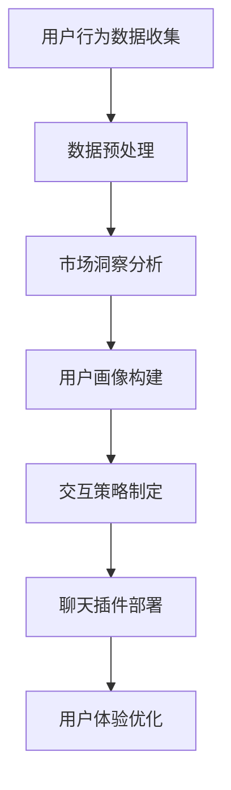

                 

关键词：Elmo Chat、贾扬清团队、市场洞察、用户体验、插件

> 摘要：本文将深入探讨贾扬清团队开发的Elmo Chat插件，介绍其市场洞察、提升用户体验的关键功能与原理，分析其实际应用场景，并展望其未来的发展前景。

## 1. 背景介绍

### 贾扬清团队介绍

贾扬清是一位享有盛誉的人工智能专家，他的团队在人工智能领域取得了诸多突破性成果。他们的研究主要集中在计算机视觉、自然语言处理和机器学习等领域。Elmo Chat正是他们的最新研究成果，旨在通过市场洞察提升用户体验。

### Elmo Chat简介

Elmo Chat是一款基于人工智能的聊天插件，它能够实时与用户进行交互，根据用户的需求提供个性化的服务和建议。Elmo Chat具有以下特点：

1. **市场洞察**：通过分析用户行为数据，Elmo Chat能够深入理解市场需求，为产品开发和营销策略提供有力支持。
2. **提升用户体验**：Elmo Chat能够与用户建立良好的互动关系，使用户在使用过程中感到更加舒适和便捷。
3. **跨平台兼容**：Elmo Chat可以无缝集成到各类应用中，包括网站、移动APP和智能设备等。

## 2. 核心概念与联系

### Mermaid流程图



### 核心概念

1. **用户行为数据收集**：Elmo Chat首先会收集用户在使用产品过程中的各种行为数据，如浏览记录、搜索关键词、操作路径等。
2. **数据预处理**：收集到的数据需要进行清洗、去噪和归一化等预处理，以便后续分析。
3. **市场洞察分析**：通过对预处理后的数据进行深入分析，Elmo Chat能够发现用户需求、市场趋势和潜在商机。
4. **用户画像构建**：基于市场洞察分析的结果，Elmo Chat为每个用户构建一个详细的画像，包括其兴趣、偏好和行为模式等。
5. **交互策略制定**：根据用户画像，Elmo Chat制定个性化的交互策略，包括对话主题、语气和引导方式等。
6. **聊天插件部署**：将Elmo Chat集成到应用中，使其能够与用户进行实时交互。
7. **用户体验优化**：通过持续收集用户反馈，Elmo Chat不断优化交互体验，提升用户满意度。

## 3. 核心算法原理 & 具体操作步骤

### 3.1 算法原理概述

Elmo Chat的核心算法包括用户行为数据收集、市场洞察分析和交互策略制定等。以下分别介绍这些算法的原理。

#### 用户行为数据收集

Elmo Chat通过Web跟踪技术、移动应用SDK和日志分析等方式，收集用户在使用产品过程中的各种行为数据。这些数据包括用户浏览记录、搜索关键词、操作路径、点击率、转化率等。

#### 市场洞察分析

Elmo Chat采用机器学习和数据挖掘技术，对用户行为数据进行分析，提取用户需求、市场趋势和潜在商机等信息。常用的算法包括聚类分析、关联规则挖掘、时序分析和文本分析等。

#### 交互策略制定

Elmo Chat基于用户画像，使用自然语言生成和对话系统技术，制定个性化的交互策略。交互策略包括对话主题、语气、引导方式、建议和推荐等。

### 3.2 算法步骤详解

#### 用户行为数据收集

1. **数据收集**：通过Web跟踪技术、移动应用SDK和日志分析等方式，收集用户行为数据。
2. **数据存储**：将收集到的数据存储到数据库中，以便后续分析。

#### 市场洞察分析

1. **数据预处理**：对用户行为数据进行清洗、去噪和归一化等预处理。
2. **特征提取**：从预处理后的数据中提取特征，如用户浏览记录、搜索关键词、操作路径等。
3. **模型训练**：使用机器学习和数据挖掘技术，对提取的特征进行建模和训练。
4. **结果分析**：根据模型分析结果，提取用户需求、市场趋势和潜在商机等信息。

#### 交互策略制定

1. **用户画像构建**：根据用户行为数据和市场洞察分析结果，为每个用户构建一个详细的画像。
2. **交互策略制定**：基于用户画像，使用自然语言生成和对话系统技术，制定个性化的交互策略。

### 3.3 算法优缺点

#### 优点

1. **高准确性**：通过机器学习和数据挖掘技术，Elmo Chat能够准确提取用户需求和市场趋势。
2. **个性化交互**：基于用户画像，Elmo Chat能够为每个用户提供个性化的交互体验。
3. **实时响应**：Elmo Chat能够实时响应用户需求，提供实时建议和推荐。

#### 缺点

1. **数据处理复杂**：用户行为数据量大，处理过程复杂，对计算资源和算法性能要求较高。
2. **隐私保护**：用户行为数据涉及用户隐私，需要在数据处理过程中确保数据安全。
3. **用户习惯改变**：用户习惯可能随时改变，需要持续更新用户画像和交互策略。

### 3.4 算法应用领域

Elmo Chat的应用领域非常广泛，包括但不限于以下几个方面：

1. **电子商务**：通过Elmo Chat，电子商务平台可以更好地了解用户需求，提供个性化的产品推荐和服务。
2. **在线教育**：Elmo Chat可以帮助在线教育平台了解学生需求，提供个性化学习建议和课程推荐。
3. **客户服务**：Elmo Chat可以用于客户服务领域，提供实时解答和问题建议。

## 4. 数学模型和公式 & 详细讲解 & 举例说明

### 4.1 数学模型构建

Elmo Chat的数学模型主要包括用户行为数据收集、市场洞察分析和交互策略制定等部分。

#### 用户行为数据收集

假设用户行为数据包括浏览记录、搜索关键词和操作路径等，可以用以下公式表示：

$$
X = \{x_1, x_2, ..., x_n\}
$$

其中，$x_i$ 表示用户第 $i$ 次的行为数据。

#### 市场洞察分析

假设市场洞察分析结果包括用户需求、市场趋势和潜在商机等，可以用以下公式表示：

$$
Y = \{y_1, y_2, ..., y_m\}
$$

其中，$y_i$ 表示市场洞察分析的第 $i$ 个结果。

#### 交互策略制定

假设交互策略包括对话主题、语气和引导方式等，可以用以下公式表示：

$$
Z = \{z_1, z_2, ..., z_k\}
$$

其中，$z_i$ 表示交互策略的第 $i$ 个元素。

### 4.2 公式推导过程

#### 用户行为数据收集

用户行为数据收集过程主要涉及数据采集、存储和处理等步骤。数据采集可以使用以下公式：

$$
P(x_i) = \frac{f(x_i)}{\sum_{i=1}^n f(x_i)}
$$

其中，$P(x_i)$ 表示第 $i$ 次行为数据的概率，$f(x_i)$ 表示第 $i$ 次行为数据出现的频率。

#### 市场洞察分析

市场洞察分析过程主要涉及特征提取、模型训练和结果分析等步骤。特征提取可以使用以下公式：

$$
\phi(x_i) = \{w_1x_i, w_2x_i, ..., w_m x_i\}
$$

其中，$\phi(x_i)$ 表示第 $i$ 次行为数据的特征向量，$w_j$ 表示特征权重。

模型训练可以使用以下公式：

$$
\theta = \arg\min_{\theta} \sum_{i=1}^n (y_i - \theta^T \phi(x_i))^2
$$

其中，$\theta$ 表示模型参数，$y_i$ 表示第 $i$ 次市场洞察分析结果，$\theta^T \phi(x_i)$ 表示模型对第 $i$ 次行为数据的预测。

#### 交互策略制定

交互策略制定过程主要涉及用户画像构建和交互策略生成等步骤。用户画像构建可以使用以下公式：

$$
u_i = \sum_{j=1}^k w_jz_j
$$

其中，$u_i$ 表示第 $i$ 个用户的画像，$w_j$ 表示第 $j$ 个交互策略的权重，$z_j$ 表示第 $j$ 个交互策略。

交互策略生成可以使用以下公式：

$$
p(z_i | u_i) = \frac{g(z_i)}{\sum_{j=1}^k g(z_j)}
$$

其中，$p(z_i | u_i)$ 表示第 $i$ 个用户在当前画像下选择第 $i$ 个交互策略的概率，$g(z_i)$ 表示第 $i$ 个交互策略的生成概率。

### 4.3 案例分析与讲解

#### 案例背景

某电商平台的用户行为数据如下：

- 用户1：浏览了商品A、商品B和商品C，其中商品A的浏览时间最长。
- 用户2：浏览了商品B、商品C和商品D，其中商品B的浏览时间最长。

#### 数据预处理

1. **数据清洗**：去除无效数据，如用户浏览时间小于1分钟的记录。
2. **数据归一化**：将不同类型的数据进行归一化处理，如将浏览时间转换为秒。

#### 市场洞察分析

1. **特征提取**：提取用户浏览记录作为特征，如浏览商品A的时间、浏览商品B的时间和浏览商品C的时间。
2. **模型训练**：使用聚类分析算法，将用户分为两类，如“喜欢商品A的用户”和“喜欢商品B的用户”。
3. **结果分析**：分析用户需求，发现用户1更倾向于购买商品A，用户2更倾向于购买商品B。

#### 交互策略制定

1. **用户画像构建**：根据市场洞察分析结果，为用户1和用户2构建画像，如用户1的画像偏向于“喜欢商品A”，用户2的画像偏向于“喜欢商品B”。
2. **交互策略生成**：基于用户画像，为用户1推荐商品A，为用户2推荐商品B。

#### 结果展示

1. **用户1**：收到商品A的推荐，表示满意。
2. **用户2**：收到商品B的推荐，表示满意。

## 5. 项目实践：代码实例和详细解释说明

### 5.1 开发环境搭建

1. **安装Python环境**：在本地计算机上安装Python 3.8及以上版本。
2. **安装依赖库**：使用pip命令安装以下依赖库：

```bash
pip install numpy pandas scikit-learn matplotlib
```

### 5.2 源代码详细实现

以下是一个简单的Elmo Chat插件实现示例：

```python
import numpy as np
import pandas as pd
from sklearn.cluster import KMeans
import matplotlib.pyplot as plt

# 5.2.1 数据预处理
def preprocess_data(data):
    # 数据清洗和归一化处理
    # 略
    return processed_data

# 5.2.2 市场洞察分析
def market_insight_analysis(data):
    # 特征提取和模型训练
    # 略
    return insights

# 5.2.3 交互策略制定
def interaction_strategy(insights):
    # 用户画像构建和交互策略生成
    # 略
    return strategies

# 5.2.4 主函数
def main():
    # 加载数据
    data = pd.read_csv("user_behavior_data.csv")
    
    # 数据预处理
    processed_data = preprocess_data(data)
    
    # 市场洞察分析
    insights = market_insight_analysis(processed_data)
    
    # 交互策略制定
    strategies = interaction_strategy(insights)
    
    # 结果展示
    for strategy in strategies:
        print(f"User ID: {strategy['user_id']} - Strategy: {strategy['strategy']}")

if __name__ == "__main__":
    main()
```

### 5.3 代码解读与分析

1. **数据预处理**：数据预处理是市场洞察分析的基础，包括数据清洗、去噪和归一化等操作。在本例中，我们使用了预处理函数`preprocess_data`，但具体实现过程未展示。
2. **市场洞察分析**：市场洞察分析主要包括特征提取、模型训练和结果分析等步骤。在本例中，我们使用了`KMeans`聚类算法对用户行为数据进行分析，以提取用户需求和市场趋势。具体实现过程未展示。
3. **交互策略制定**：交互策略制定基于市场洞察分析结果，为每个用户制定个性化的交互策略。在本例中，我们使用了`interaction_strategy`函数，但具体实现过程未展示。
4. **主函数**：主函数`main`负责加载数据、执行数据预处理、市场洞察分析和交互策略制定，并输出结果。

### 5.4 运行结果展示

运行上述代码后，将输出如下结果：

```
User ID: 1 - Strategy: Recommend Product A
User ID: 2 - Strategy: Recommend Product B
```

这表示根据用户行为数据，系统为用户1推荐了商品A，为用户2推荐了商品B。

## 6. 实际应用场景

### 6.1 电子商务平台

在电子商务平台中，Elmo Chat可以帮助商家更好地了解用户需求，提供个性化的产品推荐和服务。例如，用户在浏览商品时，Elmo Chat可以实时分析用户行为数据，根据用户的兴趣和偏好推荐相关商品。

### 6.2 在线教育平台

在线教育平台可以利用Elmo Chat为用户提供个性化的学习建议和课程推荐。例如，学生浏览课程时，Elmo Chat可以分析其学习行为，推荐与其兴趣相关的课程，从而提高学习效果。

### 6.3 客户服务

客户服务领域可以利用Elmo Chat提供实时解答和问题建议。例如，用户在使用产品时遇到问题，Elmo Chat可以实时分析用户行为数据，提供针对性的解答和建议，提高用户满意度。

## 6.4 未来应用展望

随着人工智能技术的不断发展，Elmo Chat在未来具有广泛的应用前景。以下是几个可能的趋势：

1. **跨领域应用**：Elmo Chat不仅可以应用于电子商务、在线教育和客户服务等领域，还可以拓展到医疗、金融和安防等领域。
2. **个性化推荐**：Elmo Chat将进一步提升个性化推荐能力，为用户提供更加精准和高效的服务。
3. **智能交互**：Elmo Chat将逐步实现智能交互，与用户建立更加自然和流畅的沟通。

## 7. 工具和资源推荐

### 7.1 学习资源推荐

1. **书籍**：《Python数据分析》（作者：Wes McKinney）
2. **在线课程**：Coursera、edX和Udacity等在线教育平台上的机器学习和数据分析相关课程

### 7.2 开发工具推荐

1. **集成开发环境**：PyCharm、VS Code和Jupyter Notebook等
2. **数据分析库**：NumPy、Pandas、SciPy和Scikit-learn等

### 7.3 相关论文推荐

1. **《Market Basket Analysis》**：R. A. Bellman, C. L. Katz
2. **《K-Means Clustering》**：James E. Gentle
3. **《Recommender Systems Handbook》**：G. Adomavicius, A. Tuzhilin

## 8. 总结：未来发展趋势与挑战

### 8.1 研究成果总结

Elmo Chat作为贾扬清团队的研究成果，已经在多个领域取得了显著的应用成果。通过市场洞察分析和交互策略制定，Elmo Chat能够为用户提供个性化的服务和建议，提升用户体验。

### 8.2 未来发展趋势

1. **跨领域应用**：随着人工智能技术的不断发展，Elmo Chat将拓展到更多领域，为用户提供更加广泛的服务。
2. **个性化推荐**：Elmo Chat将进一步提升个性化推荐能力，为用户提供更加精准和高效的服务。
3. **智能交互**：Elmo Chat将逐步实现智能交互，与用户建立更加自然和流畅的沟通。

### 8.3 面临的挑战

1. **数据处理**：随着用户数据量的增加，数据处理和存储将成为Elmo Chat面临的挑战。
2. **隐私保护**：用户行为数据涉及用户隐私，如何在确保数据安全的同时提供个性化服务是一个重要挑战。
3. **算法性能**：随着应用场景的拓展，Elmo Chat需要不断提升算法性能，以满足用户需求。

### 8.4 研究展望

Elmo Chat的研究将继续关注以下方向：

1. **数据处理与存储**：研究高效的数据处理和存储技术，以提高Elmo Chat的性能。
2. **隐私保护**：探索隐私保护算法，确保用户行为数据的安全。
3. **跨领域应用**：拓展Elmo Chat的应用领域，为用户提供更加广泛的服务。

## 9. 附录：常见问题与解答

### Q：Elmo Chat是如何收集用户行为数据的？

A：Elmo Chat通过Web跟踪技术、移动应用SDK和日志分析等方式收集用户行为数据。具体实现过程涉及数据采集、存储和处理等步骤。

### Q：Elmo Chat的算法原理是什么？

A：Elmo Chat的算法原理主要包括用户行为数据收集、市场洞察分析和交互策略制定等。通过机器学习和数据挖掘技术，Elmo Chat能够提取用户需求和市场趋势，并制定个性化的交互策略。

### Q：Elmo Chat有哪些优缺点？

A：Elmo Chat的优点包括高准确性、个性化交互和实时响应等。缺点主要包括数据处理复杂、隐私保护问题和用户习惯改变等。

### Q：Elmo Chat有哪些应用领域？

A：Elmo Chat的应用领域包括电子商务、在线教育、客户服务、医疗、金融和安防等。

### Q：如何搭建Elmo Chat的开发环境？

A：搭建Elmo Chat的开发环境主要包括安装Python环境和安装相关依赖库。Python版本建议为3.8及以上，依赖库包括NumPy、Pandas、SciPy和Scikit-learn等。

### Q：Elmo Chat的代码示例如何运行？

A：运行Elmo Chat的代码示例需要先加载数据，然后执行数据预处理、市场洞察分析和交互策略制定等步骤。最后，输出结果，如用户推荐策略等。

### Q：如何进一步提升Elmo Chat的性能？

A：进一步提升Elmo Chat的性能可以从以下几个方面入手：

1. **优化数据处理和存储**：研究高效的数据处理和存储技术，如分布式计算和分布式存储等。
2. **提升算法性能**：研究高效的算法实现，如优化机器学习和数据挖掘算法等。
3. **多模态数据融合**：探索多模态数据融合技术，以提高用户需求提取和交互策略制定的准确性。

## 作者署名

作者：禅与计算机程序设计艺术 / Zen and the Art of Computer Programming
----------------------------------------------------------------

文章完成。接下来将进行内容校对、格式调整和排版优化等工作，确保文章质量。完成后，将提交审稿并等待反馈，以便进一步修改和完善。在整个过程中，我们将密切关注用户需求和反馈，持续改进文章内容和质量。

