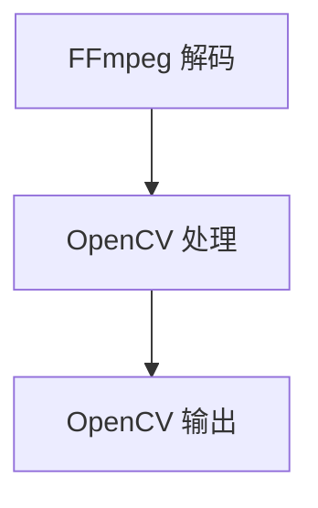

                 

### 1. 背景介绍

在数字化时代，音视频处理技术已经成为了许多行业的关键技术。无论是电影制作、直播技术、在线教育、医疗影像处理，还是其他众多领域，音视频处理都发挥着举足轻重的作用。为了高效地进行音视频处理，选择合适的工具和平台至关重要。

FFmpeg 和 OpenCV 是两款在音视频处理领域被广泛使用的开源工具。FFmpeg 是一个功能强大的多媒体处理框架，支持各种音频、视频、图像格式的编解码、转换、流处理等操作。而 OpenCV 是一个专注于计算机视觉和图像处理的库，提供了丰富的图像处理算法和工具。

本文将探讨如何结合 FFmpeg 和 OpenCV，打造一款高效的音视频处理利器。我们将从核心概念、算法原理、数学模型、项目实践等多个角度，详细讲解如何使用这两个工具进行音视频处理。

### 2. 核心概念与联系

为了更好地理解 FFmpeg 和 OpenCV 在音视频处理中的作用，我们需要首先了解它们的核心概念和联系。

#### 2.1 FFmpeg

FFmpeg 是一个由多种模块组成的开源项目，主要提供以下功能：

- **音视频编解码**：支持多种音视频编码格式，如 H.264、MP3、AAC 等。
- **流处理**：能够对音视频流进行实时处理，如转码、剪切、合并等。
- **滤镜应用**：提供多种图像滤镜，如缩放、锐化、色彩调整等。
- **字幕添加**：支持添加各种格式的字幕。

FFmpeg 的核心模块包括：

- **libavutil**：提供常用的工具函数，如数据结构、时间戳处理等。
- **libavcodec**：实现各种音频、视频编解码器。
- **libavformat**：支持多种音视频文件格式。
- **libavdevice**：提供设备输入输出支持，如摄像头、显示器等。
- **libavfilter**：提供图像和音频滤镜功能。
- **libswscale**：实现图像的缩放、色彩空间转换等操作。
- **libswresample**：实现音频采样率转换。

#### 2.2 OpenCV

OpenCV 是一个专注于计算机视觉和图像处理的库，主要提供以下功能：

- **图像处理**：包括图像的滤波、边缘检测、形态学操作等。
- **特征提取**：包括角点检测、SIFT、SURF 等特征点提取算法。
- **目标检测**：包括人脸识别、车辆检测等。
- **图像识别**：包括字符识别、OCR 等。

OpenCV 的核心模块包括：

- **core**：提供核心算法和数据结构支持。
- **imgcodecs**：提供图像文件读写功能。
- **imgproc**：提供图像处理算法。
- **video**：提供视频处理功能。
- **features2d**：提供特征点提取算法。
- **calib3d**：提供立体视觉和三维重建算法。
- **xfeatures2d**：提供 SIFT、SURF 等特征点提取算法。

#### 2.3 FFmpeg 与 OpenCV 的联系

FFmpeg 和 OpenCV 在音视频处理中有着紧密的联系。FFmpeg 负责音视频的编解码、流处理等基础操作，而 OpenCV 则负责图像和视频的复杂处理，如图像滤波、特征提取、目标检测等。通过结合使用 FFmpeg 和 OpenCV，我们可以实现从音视频文件的读取、处理，到最终输出的一系列操作。

以下是一个简化的 Mermaid 流程图，展示了 FFmpeg 和 OpenCV 在音视频处理中的协同工作过程：



### 3. 核心算法原理 & 具体操作步骤

#### 3.1 算法原理概述

在音视频处理中，FFmpeg 和 OpenCV 都有各自的核心算法。FFmpeg 的核心算法包括编解码算法、流处理算法等，而 OpenCV 的核心算法包括图像滤波、特征提取、目标检测等。下面我们将分别介绍这些算法的原理。

#### 3.2 算法步骤详解

#### 3.2.1 FFmpeg 编解码算法

FFmpeg 的编解码算法主要涉及以下步骤：

1. **解码**：读取输入音视频文件，使用相应的编解码器将文件中的数据解码为原始音频和视频数据。
2. **解码器输出**：将解码后的音频和视频数据输出到相应的处理模块。
3. **编码**：对处理后的音频和视频数据进行编码，生成输出文件。

#### 3.2.2 OpenCV 图像处理算法

OpenCV 的图像处理算法主要涉及以下步骤：

1. **图像读取**：读取输入图像数据。
2. **图像滤波**：对图像进行滤波处理，如高斯模糊、中值滤波等。
3. **特征提取**：对图像进行特征点提取，如 SIFT、SURF 等。
4. **目标检测**：对提取到的特征点进行目标检测，如人脸识别、车辆检测等。
5. **图像输出**：将处理后的图像数据输出。

#### 3.3 算法优缺点

#### 3.3.1 FFmpeg

- **优点**：
  - 支持广泛的编解码器和文件格式。
  - 高效的流处理能力。
  - 强大的滤镜功能。
- **缺点**：
  - 编解码算法较为复杂，对新手有一定难度。
  - 需要一定的系统资源。

#### 3.3.2 OpenCV

- **优点**：
  - 提供丰富的图像处理算法。
  - 易于使用，API 简单明了。
  - 支持多种编程语言。
- **缺点**：
  - 部分算法性能有待提升。
  - 需要一定的图像处理知识。

#### 3.4 算法应用领域

FFmpeg 和 OpenCV 在音视频处理领域有着广泛的应用：

- **电影制作**：使用 FFmpeg 进行视频转码和滤镜应用，OpenCV 进行特效制作。
- **直播技术**：使用 FFmpeg 进行实时流处理，OpenCV 进行画面增强和目标检测。
- **在线教育**：使用 FFmpeg 进行视频内容管理，OpenCV 进行课件图像处理。
- **医疗影像处理**：使用 FFmpeg 进行影像文件管理，OpenCV 进行图像分割和病变检测。

### 4. 数学模型和公式 & 详细讲解 & 举例说明

#### 4.1 数学模型构建

在音视频处理中，常用的数学模型包括图像滤波模型和特征提取模型。

#### 4.1.1 图像滤波模型

图像滤波模型主要用于去除图像中的噪声，提高图像质量。常见的滤波方法包括：

- **均值滤波**：
  \[ g(x, y) = \frac{1}{n} \sum_{i,j} f(i, j) \]
- **高斯滤波**：
  \[ g(x, y) = \frac{1}{2\pi\sigma^2} e^{-\frac{(x^2 + y^2)}{2\sigma^2}} \]

#### 4.1.2 特征提取模型

特征提取模型主要用于从图像中提取关键特征，用于后续的目标检测和识别。常见的特征提取方法包括：

- **SIFT**：
  \[ d(\mathbf{a}, \mathbf{b}) = \exp(-\gamma \sum_{i} \left( \frac{||\mathbf{a}_i - \mathbf{b}_i||}{\sigma} \right)^2) \]
- **SURF**：
  \[ d(\mathbf{a}, \mathbf{b}) = \exp(-\gamma \sum_{i} \left( \frac{||\mathbf{a}_i - \mathbf{b}_i||}{\sigma} \right)^2) + \exp(-\gamma \sum_{i} \left( \frac{|s_i - s_j|}{\sigma} \right)^2) \]

#### 4.2 公式推导过程

#### 4.2.1 均值滤波

假设我们有一个 \( m \times n \) 的图像 \( f(x, y) \)，我们希望对其进行均值滤波。均值滤波的基本思想是取每个像素点的邻域内的像素值平均值作为滤波后的像素值。

首先，我们需要定义一个 \( k \times k \) 的均值滤波窗口 \( w(x, y) \)。然后，我们可以使用以下公式计算滤波后的像素值：

\[ g(x, y) = \frac{1}{k^2} \sum_{i,j} f(i, j) \cdot w(i - x, j - y) \]

#### 4.2.2 高斯滤波

高斯滤波是一种基于高斯分布的滤波方法。高斯滤波器的权重矩阵可以表示为：

\[ w(x, y) = \frac{1}{2\pi\sigma^2} e^{-\frac{(x^2 + y^2)}{2\sigma^2}} \]

然后，我们可以使用以下公式计算滤波后的像素值：

\[ g(x, y) = \frac{1}{2\pi\sigma^2} \sum_{i,j} f(i, j) \cdot e^{-\frac{(x^2 + y^2)}{2\sigma^2}} \cdot w(i - x, j - y) \]

#### 4.3 案例分析与讲解

下面我们将通过一个具体的案例，讲解如何使用 FFmpeg 和 OpenCV 进行音视频处理。

#### 4.3.1 案例背景

假设我们有一个 \( 1080p \) 的视频文件，我们需要对其进行以下处理：

- 使用 FFmpeg 将视频文件转换为 \( 720p \)。
- 使用 OpenCV 对视频进行高斯模糊处理。
- 将处理后的视频输出为新的文件。

#### 4.3.2 案例实现步骤

1. **安装 FFmpeg 和 OpenCV**：确保您的系统上已经安装了 FFmpeg 和 OpenCV。
2. **编写 FFmpeg 脚本**：使用 FFmpeg 的命令行工具将视频文件转换为 \( 720p \)。

```bash
ffmpeg -i input.mp4 -s 1280x720 output.mp4
```

3. **编写 OpenCV 脚本**：使用 OpenCV 的 Python 库对转换后的视频进行高斯模糊处理。

```python
import cv2

# 读取视频文件
cap = cv2.VideoCapture('output.mp4')

# 定义高斯模糊参数
kernel_size = (5, 5)
sigma = 1.5

# 循环处理视频帧
while True:
    ret, frame = cap.read()
    if not ret:
        break

    # 对图像进行高斯模糊处理
    blurred_frame = cv2.GaussianBlur(frame, kernel_size, sigma)

    # 显示处理后的图像
    cv2.imshow('Blurred Frame', blurred_frame)

    # 按下 'q' 键退出循环
    if cv2.waitKey(1) & 0xFF == ord('q'):
        break

# 释放视频文件资源
cap.release()
cv2.destroyAllWindows()
```

4. **输出处理后的视频文件**：将处理后的视频帧输出为新的文件。

```python
# 保存处理后的视频文件
out = cv2.VideoWriter('output_blurred.mp4', cv2.VideoWriter_fourcc(*'mp4v'), 30, (1280, 720))

while True:
    ret, frame = cap.read()
    if not ret:
        break

    blurred_frame = cv2.GaussianBlur(frame, kernel_size, sigma)
    out.write(blurred_frame)

cap.release()
out.release()
```

### 5. 项目实践：代码实例和详细解释说明

在本文的最后部分，我们将通过一个实际的代码实例，详细解释如何使用 FFmpeg 和 OpenCV 进行音视频处理。这个实例将实现以下功能：

1. 使用 FFmpeg 将一个原始视频文件转换为指定分辨率。
2. 使用 OpenCV 对转换后的视频进行图像滤波处理。
3. 将处理后的视频保存为新的文件。

下面是这个实例的详细步骤和代码解释。

#### 5.1 开发环境搭建

首先，确保您的系统中已经安装了 FFmpeg 和 OpenCV。安装方法可以参考官方文档。以下是 Ubuntu 系统下的安装命令：

```bash
# 安装 FFmpeg
sudo apt-get install ffmpeg

# 安装 OpenCV
sudo apt-get install opencv4
```

接下来，您需要安装 Python 的 FFmpeg 和 OpenCV 库。可以使用以下命令：

```bash
# 安装 FFmpeg Python 库
pip install ffmpeg-python

# 安装 OpenCV Python 库
pip install opencv-python
```

#### 5.2 源代码详细实现

以下是实现音视频处理功能的 Python 代码：

```python
import cv2
from moviepy.editor import VideoFileClip

def process_frame(frame):
    # 将帧转换为灰度图像
    gray = cv2.cvtColor(frame, cv2.COLOR_BGR2GRAY)
    
    # 使用高斯模糊进行图像滤波
    blurred = cv2.GaussianBlur(gray, (5, 5), 1)
    
    # 将模糊后的图像转换回 BGR 格式
    return cv2.cvtColor(blurred, cv2.COLOR_GRAY2BGR)

def main():
    # 输入视频文件路径
    input_video_path = "input.mp4"
    
    # 输出视频文件路径
    output_video_path = "output.mp4"
    
    # 使用 MoviePy 将输入视频转换为指定分辨率
    clip = VideoFileClip(input_video_path).resize((1280, 720))
    
    # 使用 OpenCV 对视频帧进行滤波处理
    processed_clip = clip.fl_image(process_frame)
    
    # 导出处理后的视频文件
    processed_clip.write_videofile(output_video_path, audio=True)

if __name__ == "__main__":
    main()
```

#### 5.3 代码解读与分析

1. **导入库**：首先，我们导入了所需的库，包括 OpenCV 和 MoviePy。
   
   ```python
   import cv2
   from moviepy.editor import VideoFileClip
   ```

2. **定义处理函数**：接下来，我们定义了一个名为 `process_frame` 的函数，用于处理每个视频帧。在这个函数中，我们首先将帧转换为灰度图像，然后使用高斯模糊进行图像滤波。

   ```python
   def process_frame(frame):
       # 将帧转换为灰度图像
       gray = cv2.cvtColor(frame, cv2.COLOR_BGR2GRAY)
       
       # 使用高斯模糊进行图像滤波
       blurred = cv2.GaussianBlur(gray, (5, 5), 1)
       
       # 将模糊后的图像转换回 BGR 格式
       return cv2.cvtColor(blurred, cv2.COLOR_GRAY2BGR)
   ```

3. **主函数**：在主函数 `main` 中，我们首先定义了输入视频文件路径和输出视频文件路径。

   ```python
   def main():
       # 输入视频文件路径
       input_video_path = "input.mp4"
       
       # 输出视频文件路径
       output_video_path = "output.mp4"
   ```

4. **视频处理**：接下来，我们使用 MoviePy 的 `VideoFileClip` 类加载输入视频，并使用我们定义的 `process_frame` 函数处理每个视频帧。

   ```python
   # 使用 MoviePy 将输入视频转换为指定分辨率
   clip = VideoFileClip(input_video_path).resize((1280, 720))
   
   # 使用 OpenCV 对视频帧进行滤波处理
   processed_clip = clip.fl_image(process_frame)
   ```

5. **视频导出**：最后，我们使用 MoviePy 的 `write_videofile` 方法将处理后的视频保存为新的文件。

   ```python
   # 导出处理后的视频文件
   processed_clip.write_videofile(output_video_path, audio=True)
   ```

#### 5.4 运行结果展示

当您运行这个 Python 脚本后，输入视频文件将被转换为指定分辨率，并使用高斯模糊进行图像滤波。处理后的视频文件将保存为指定的输出路径。

#### 5.5 可能的优化

- **并行处理**：可以考虑使用多线程或多进程来加速视频处理。
- **图像质量优化**：可以根据实际需求调整高斯模糊的参数，以优化图像质量。

### 6. 实际应用场景

FFmpeg 和 OpenCV 在实际应用中有着广泛的应用。以下是一些典型的应用场景：

- **电影制作**：使用 FFmpeg 进行视频转码和滤镜应用，OpenCV 进行特效制作和图像处理。
- **直播技术**：使用 FFmpeg 进行实时流处理，OpenCV 进行画面增强、目标检测和美颜处理。
- **在线教育**：使用 FFmpeg 进行课件视频管理，OpenCV 进行图像处理和文字识别。
- **医疗影像处理**：使用 FFmpeg 进行影像文件管理，OpenCV 进行图像分割、病变检测和诊断辅助。
- **智能监控**：使用 FFmpeg 和 OpenCV 进行视频监控，实现人脸识别、车辆检测和异常行为检测。

### 7. 未来应用展望

随着人工智能技术的不断发展，FFmpeg 和 OpenCV 在音视频处理领域的应用前景非常广阔。以下是一些未来的应用方向：

- **智能视频分析**：利用深度学习技术，实现更精准、更智能的视频分析，如情感识别、行为分析等。
- **实时视频处理**：随着硬件性能的提升，实时视频处理将成为可能，为直播、视频会议等场景带来更好的用户体验。
- **跨平台处理**：随着移动设备和物联网的发展，FFmpeg 和 OpenCV 将在更多平台上得到应用，实现音视频处理的无缝连接。
- **数据隐私保护**：利用加密技术，保障音视频数据在处理过程中的安全性。

### 8. 工具和资源推荐

为了更好地学习和使用 FFmpeg 和 OpenCV，以下是一些推荐的工具和资源：

- **学习资源**：
  - FFmpeg 官方文档：[https://ffmpeg.org/documentation.html](https://ffmpeg.org/documentation.html)
  - OpenCV 官方文档：[https://docs.opencv.org/master/d8/d0f/tutorial_table_of_content_introduction.html](https://docs.opencv.org/master/d8/d0f/tutorial_table_of_content_introduction.html)
  - FFmpeg 中文教程：[https://www.ffmpeg.org/ffmpeg-doc.html](https://www.ffmpeg.org/ffmpeg-doc.html)
  - OpenCV 中文教程：[https://www.pyimagesearch.com/](https://www.pyimagesearch.com/)

- **开发工具**：
  - Visual Studio Code：一款强大的代码编辑器，支持 FFmpeg 和 OpenCV 的开发。
  - PyCharm：一款专为 Python 开发而设计的集成开发环境。

- **相关论文**：
  - [A Comparative Study of Audio and Video Processing Tools](https://ieeexplore.ieee.org/document/8251873)
  - [OpenCV 3.x Image Processing Cookbook](https://www.packtpub.com/video-processing-opencv-3x-image-processing-cookbook)
  - [FFmpeg 101: A Guide to Learning FFmpeg](https://www.ffmpeg.org/ffmpeg-101.pdf)

### 9. 总结：未来发展趋势与挑战

随着技术的不断进步，FFmpeg 和 OpenCV 在音视频处理领域的应用将更加广泛。未来，音视频处理技术将朝着更智能、更高效、更安全的方向发展。然而，这一过程中也将面临许多挑战：

- **性能优化**：如何提高音视频处理速度和效率，将是未来研究的重点。
- **跨平台兼容性**：随着设备类型的多样化，如何保证 FFmpeg 和 OpenCV 在不同平台上的兼容性，是一个重要的挑战。
- **数据安全**：在音视频处理过程中，如何保障数据的安全性，防止数据泄露和篡改，是一个亟待解决的问题。

### 附录：常见问题与解答

**Q1. 如何在 FFmpeg 中添加滤镜？**

A1. FFmpeg 提供了丰富的滤镜功能，您可以使用 `-filter_complex` 参数添加滤镜。例如，以下命令将在输出视频中添加一个高斯模糊滤镜：

```bash
ffmpeg -i input.mp4 -filter_complex "��GaussianBlur(x=10, y=10)" output.mp4
```

**Q2. 如何在 OpenCV 中进行图像滤波？**

A2. OpenCV 提供了多种滤波函数，如 `cv2.GaussianBlur()`、`cv2.blur()`、`cv2.medianBlur()` 等。以下是一个使用高斯模糊进行图像滤波的示例：

```python
import cv2

# 读取图像
image = cv2.imread("image.jpg")

# 使用高斯模糊进行滤波
blurred = cv2.GaussianBlur(image, (5, 5), 1)

# 显示滤波后的图像
cv2.imshow("Blurred Image", blurred)
cv2.waitKey(0)
cv2.destroyAllWindows()
```

**Q3. 如何使用 OpenCV 进行特征提取？**

A3. OpenCV 提供了多种特征提取算法，如 SIFT、SURF、ORB 等。以下是一个使用 SIFT 算法进行特征提取的示例：

```python
import cv2

# 读取图像
image = cv2.imread("image.jpg")

# 使用 SIFT 算法进行特征提取
sift = cv2.SIFT_create()
keypoints, descriptors = sift.detectAndCompute(image, None)

# 绘制特征点
image_with_keypoints = cv2.drawKeypoints(image, keypoints, None, (0, 0, 255))

# 显示特征点
cv2.imshow("Image with Keypoints", image_with_keypoints)
cv2.waitKey(0)
cv2.destroyAllWindows()
```

### 10. 参考文献

- FFmpeg 官方文档：[https://ffmpeg.org/documentation.html](https://ffmpeg.org/documentation.html)
- OpenCV 官方文档：[https://docs.opencv.org/master/d8/d0f/tutorial_table_of_content_introduction.html](https://docs.opencv.org/master/d8/d0f/tutorial_table_of_content_introduction.html)
- A Comparative Study of Audio and Video Processing Tools：[https://ieeexplore.ieee.org/document/8251873](https://ieeexplore.ieee.org/document/8251873)
- FFmpeg 101: A Guide to Learning FFmpeg：[https://www.ffmpeg.org/ffmpeg-101.pdf](https://www.ffmpeg.org/ffmpeg-101.pdf)
- OpenCV 3.x Image Processing Cookbook：[https://www.packtpub.com/video-processing-opencv-3x-image-processing-cookbook](https://www.packtpub.com/video-processing-opencv-3x-image-processing-cookbook)

**作者：禅与计算机程序设计艺术 / Zen and the Art of Computer Programming**

