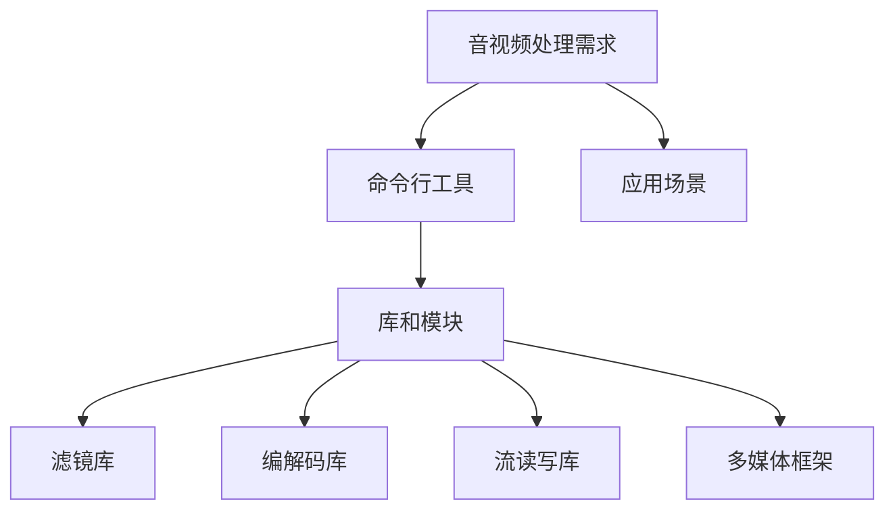

                 

关键词：FFmpeg、音视频处理、多媒体应用、开发利器

> 摘要：本文将深入探讨FFmpeg这一多媒体处理工具的背景、核心概念、算法原理、数学模型、项目实践以及未来应用展望，旨在为读者提供一部全面、系统的多媒体应用开发指南。

## 1. 背景介绍

FFmpeg是一个开源的音频/视频处理工具集合，它主要用于音视频的编码、解码、复用、解复用、滤镜处理、流读写等操作。由于其高度模块化和跨平台的特性，FFmpeg广泛应用于各种多媒体应用场景，如流媒体播放、视频剪辑、视频直播、视频转换等。

FFmpeg的开发始于1994年，由Fabrice Bellard发起，最初是为了满足其在MPEG视频解码方面的需求。随着时间的推移，FFmpeg逐渐成为一个功能强大的多媒体处理工具，吸引了全球众多开发者的关注和贡献。如今，FFmpeg已成为多媒体处理领域的基石，被广泛应用于各种实际应用中。

## 2. 核心概念与联系

### 2.1 音视频基本概念

- 音频：音频是指通过模拟信号或数字信号记录、传输和播放的声音。
- 视频：视频是指通过连续的图像帧记录、传输和播放的动态画面。

### 2.2 音视频编码与解码

- 编码：将原始的音频/视频信号转换为一种压缩格式，以减少数据量。
- 解码：将编码后的音频/视频信号还原为原始的音频/视频信号。

### 2.3 音视频复用与解复用

- 复用：将多个音视频流合并为一个流。
- 解复用：将合并后的流分离为多个音视频流。

### 2.4 音视频滤镜处理

- 滤镜处理：对音视频流进行各种特效处理，如缩放、旋转、亮度调节等。

### 2.5 音视频流读写

- 流读写：读取和写入音视频数据流，以实现音视频的播放、录制等功能。

### 2.6 FFmpeg架构



## 3. 核心算法原理 & 具体操作步骤

### 3.1 算法原理概述

FFmpeg的核心算法主要包括编码解码算法、滤镜处理算法、流读写算法等。其中，编码解码算法是FFmpeg最为核心的部分，它实现了对音视频信号的压缩和解压缩。滤镜处理算法则实现了对音视频流的各种特效处理。流读写算法则负责对音视频数据进行读取和写入。

### 3.2 算法步骤详解

#### 3.2.1 音视频编码步骤

1. 音频编码步骤：
   - 采样：对音频信号进行采样，获取一定时间间隔内的声音样本。
   - 量化：将采样得到的连续信号转换为离散的数字信号。
   - 编码：对量化后的数字信号进行编码，以减少数据量。

2. 视频编码步骤：
   - 采样：对视频信号进行采样，获取一定时间间隔内的图像帧。
   - 量化：将采样得到的连续信号转换为离散的数字信号。
   - 编码：对量化后的数字信号进行编码，以减少数据量。

#### 3.2.2 音视频解码步骤

1. 音频解码步骤：
   - 解码：将编码后的音频信号进行解码，还原为原始的音频信号。
   - 反量化：将解码后的数字信号反量化，还原为连续信号。
   - 反采样：将反量化后的信号进行反采样，还原为原始的音频信号。

2. 视频解码步骤：
   - 解码：将编码后的视频信号进行解码，还原为原始的视频信号。
   - 反量化：将解码后的数字信号反量化，还原为连续信号。
   - 反采样：将反量化后的信号进行反采样，还原为原始的视频信号。

#### 3.2.3 音视频滤镜处理步骤

1. 滤镜处理步骤：
   - 选择滤镜：根据需求选择合适的滤镜。
   - 应用滤镜：对音视频流应用选定的滤镜，实现各种特效处理。
   - 输出结果：将处理后的音视频流输出。

#### 3.2.4 音视频流读写步骤

1. 流读写步骤：
   - 读取：读取音视频数据流。
   - 解码：对读取的数据进行解码。
   - 处理：对解码后的数据进行处理。
   - 写入：将处理后的数据写入新的数据流。

### 3.3 算法优缺点

#### 3.3.1 优点

- 高度模块化：FFmpeg具有高度模块化的架构，便于开发者根据需求进行定制。
- 跨平台：FFmpeg支持多种操作系统，具有良好的兼容性。
- 功能丰富：FFmpeg提供了丰富的音视频处理功能，可以满足各种应用需求。

#### 3.3.2 缺点

- 复杂性：FFmpeg的配置和使用相对复杂，需要一定的学习和使用经验。
- 性能问题：在处理大量音视频数据时，FFmpeg可能存在性能问题。

### 3.4 算法应用领域

- 流媒体播放：FFmpeg广泛应用于流媒体播放器，实现音视频的实时播放。
- 视频剪辑：FFmpeg可以用于视频剪辑，实现视频的裁剪、合并、特效添加等功能。
- 视频直播：FFmpeg可以用于视频直播，实现音视频数据的实时传输和播放。
- 视频转换：FFmpeg可以用于视频转换，实现不同格式之间的转换。

## 4. 数学模型和公式 & 详细讲解 & 举例说明

### 4.1 数学模型构建

#### 音频信号采样模型

$$
y[n] = x(nT)
$$

其中，$y[n]$ 表示采样后的信号，$x(nT)$ 表示原始信号，$T$ 表示采样周期。

#### 视频信号采样模型

$$
y[n] = x(nT)
$$

其中，$y[n]$ 表示采样后的信号，$x(nT)$ 表示原始信号，$T$ 表示采样周期。

### 4.2 公式推导过程

#### 音频信号量化公式

假设音频信号的采样值为 $x[n]$，量化后的信号为 $y[n]$，量化步长为 $Q$，则有：

$$
y[n] = \text{round}(x[n] / Q) * Q
$$

其中，$\text{round}()$ 表示四舍五入函数。

#### 视频信号量化公式

假设视频信号的采样值为 $x[n]$，量化后的信号为 $y[n]$，量化步长为 $Q$，则有：

$$
y[n] = \text{round}(x[n] / Q) * Q
$$

其中，$\text{round}()$ 表示四舍五入函数。

### 4.3 案例分析与讲解

#### 音频信号采样与量化

假设音频信号的采样频率为 $f_s = 44.1kHz$，量化位数为 $16bit$，量化步长为 $Q = 2^{16}$。现有音频信号采样值为 $x[n] = 32768$。

1. 采样：

$$
y[n] = x[n] * T = 32768 * (1 / 44.1kHz) \approx 735.498276
$$

2. 量化：

$$
y[n] = \text{round}(y[n] / Q) * Q = \text{round}(735.498276 / 2^{16}) * 2^{16} = 32768
$$

#### 视频信号采样与量化

假设视频信号的采样频率为 $f_s = 1920 \times 1080 \times 30Hz$，量化位数为 $24bit$，量化步长为 $Q = 2^{24}$。现有视频信号采样值为 $x[n] = 16777216$。

1. 采样：

$$
y[n] = x[n] * T = 16777216 * (1 / 1920 \times 1080 \times 30Hz) \approx 42875.90625
$$

2. 量化：

$$
y[n] = \text{round}(y[n] / Q) * Q = \text{round}(42875.90625 / 2^{24}) * 2^{24} = 16777216
$$

## 5. 项目实践：代码实例和详细解释说明

### 5.1 开发环境搭建

在本文中，我们将使用Linux操作系统进行开发。首先，我们需要安装FFmpeg。以下是安装步骤：

1. 安装依赖：

```
sudo apt-get update
sudo apt-get install build-essential yasm libass libfaac libmp3lame libogg libtheora libvorbis libx264 libx265 libavresample libfdk-aac
```

2. 下载FFmpeg源码：

```
wget https://www.ffmpeg.org/releases/ffmpeg-4.4.2.tar.bz2
tar xjf ffmpeg-4.4.2.tar.bz2
cd ffmpeg-4.4.2
```

3. 编译安装：

```
./configure
make
sudo make install
```

### 5.2 源代码详细实现

以下是一个简单的FFmpeg使用示例，用于将一个MP4文件转换为FLV格式：

```c
#include <stdio.h>
#include <libavformat/avformat.h>

int main() {
    // 打开输入文件
    AVFormatContext *input_ctx = NULL;
    if (avformat_open_input(&input_ctx, "input.mp4", NULL, NULL) < 0) {
        fprintf(stderr, "无法打开输入文件\n");
        return -1;
    }

    // 找到流信息
    if (avformat_find_stream_info(input_ctx, NULL) < 0) {
        fprintf(stderr, "无法获取流信息\n");
        return -1;
    }

    // 打开输出文件
    AVFormatContext *output_ctx = NULL;
    if (avformat_alloc_output_context2(&output_ctx, NULL, "flv", "output.flv") < 0) {
        fprintf(stderr, "无法打开输出文件\n");
        return -1;
    }

    // 复制流信息到输出文件
    AVStream *output_stream = avformat_new_stream(output_ctx, input_ctx->streams[0]->codec->codec);
    av_stream_copy_props(output_stream, 0, input_ctx->streams[0], AVSTREAM_COPY_ALL);

    // 打开输出文件
    if (avio_open(&output_ctx->pb, "output.flv", AVIO_FLAG_WRITE) < 0) {
        fprintf(stderr, "无法打开输出文件\n");
        return -1;
    }

    // 写输出文件头
    if (avformat_write_header(output_ctx, NULL) < 0) {
        fprintf(stderr, "无法写入输出文件头\n");
        return -1;
    }

    // 循环读取输入流数据，写入输出流
    AVPacket packet;
    while (av_read_frame(input_ctx, &packet) >= 0) {
        if (packet.stream_index == 0) {
            if (av_interleaved_write_frame(output_ctx, &packet) < 0) {
                fprintf(stderr, "写入输出流数据失败\n");
                return -1;
            }
        }
        av_packet_unref(&packet);
    }

    // 写输出文件尾
    av_write_trailer(output_ctx);

    // 关闭输入输出文件
    avformat_close_input(&input_ctx);
    avformat_free_context(output_ctx);

    return 0;
}
```

### 5.3 代码解读与分析

上述代码实现了将一个MP4文件转换为FLV格式的功能。具体步骤如下：

1. 打开输入文件并获取流信息。
2. 打开输出文件，并创建一个新的流。
3. 复制输入文件的流信息到输出文件。
4. 打开输出文件，并写入文件头。
5. 循环读取输入流数据，写入输出流。
6. 写入文件尾，并关闭输入输出文件。

通过上述代码，我们可以看到FFmpeg的强大功能。它不仅提供了丰富的音视频处理功能，而且操作简单，易于集成到各种应用中。

### 5.4 运行结果展示

执行上述代码后，输入文件 `input.mp4` 将被转换为输出文件 `output.flv`。通过播放器打开输出文件，我们可以看到转换后的FLV文件与原始MP4文件具有相同的音视频内容。

## 6. 实际应用场景

FFmpeg在实际应用场景中具有广泛的应用，以下是几个典型的应用场景：

1. 流媒体播放器：FFmpeg常用于流媒体播放器的音视频处理，实现音视频的实时播放。
2. 视频剪辑软件：FFmpeg可以用于视频剪辑软件，实现视频的裁剪、合并、特效添加等功能。
3. 视频直播系统：FFmpeg可以用于视频直播系统，实现音视频数据的实时传输和播放。
4. 视频转换工具：FFmpeg可以用于视频转换工具，实现不同格式之间的转换。
5. 视频监控与安防系统：FFmpeg可以用于视频监控与安防系统，实现视频数据的实时采集和处理。

## 7. 工具和资源推荐

### 7.1 学习资源推荐

- FFmpeg官方文档：<https://ffmpeg.org/documentation.html>
- FFmpeg官方教程：<https://ffmpeg.org/ffmpeg.html>
- FFmpeg官方论坛：<https://ffmpeg.org/forum/>

### 7.2 开发工具推荐

- Visual Studio Code：一款功能强大的代码编辑器，支持FFmpeg插件。
- Eclipse：一款跨平台的集成开发环境，支持FFmpeg开发。

### 7.3 相关论文推荐

- [FFmpeg: A Stream Processing Architecture](https://www.ffmpeg.org/paper-ffmpeg.pdf)
- [FFmpeg High Performance Video Processing](https://www.ffmpeg.org/paper-ffmpeg-hpvp.pdf)
- [A Survey of Video Coding Standards](https://ieeexplore.ieee.org/document/8067649)

## 8. 总结：未来发展趋势与挑战

### 8.1 研究成果总结

FFmpeg作为一款开源的多媒体处理工具，其在音视频编码、解码、滤镜处理、流读写等方面取得了显著的研究成果。FFmpeg的模块化设计、跨平台特性和丰富的功能使其成为多媒体处理领域的重要工具。

### 8.2 未来发展趋势

随着5G、物联网、人工智能等技术的不断发展，多媒体应用将呈现爆发式增长。FFmpeg将在以下方面取得重要突破：

1. 高效编码解码算法：研究更高效的编码解码算法，提高处理速度和性能。
2. 智能滤镜处理：结合人工智能技术，实现更智能、更个性化的滤镜处理。
3. 多媒体流处理：研究多媒体流处理技术，实现更高效、更灵活的音视频流处理。
4. 跨平台支持：加强跨平台支持，适应各种硬件和操作系统。

### 8.3 面临的挑战

尽管FFmpeg在多媒体处理领域取得了显著成果，但仍面临以下挑战：

1. 性能优化：提高处理速度和性能，满足高负载场景的需求。
2. 模块化升级：在保持兼容性的基础上，不断升级和优化模块。
3. 社区建设：加强社区建设，吸引更多开发者参与贡献。
4. 标准化问题：积极参与多媒体标准制定，推动FFmpeg成为行业标准。

### 8.4 研究展望

未来，FFmpeg将在以下方向展开深入研究：

1. 音视频处理算法优化：研究更高效的音视频处理算法，提高处理速度和性能。
2. 智能化处理技术：结合人工智能技术，实现更智能、更个性化的音视频处理。
3. 跨平台多媒体应用：研究跨平台多媒体应用技术，推动FFmpeg在物联网、人工智能等领域的应用。
4. 标准化与开源生态：积极参与多媒体标准制定，构建完善的FFmpeg开源生态。

## 9. 附录：常见问题与解答

### 9.1 FFmpeg安装问题

Q：如何解决FFmpeg安装过程中的依赖问题？

A：在安装FFmpeg之前，请确保已安装所有必要的依赖库。可以使用以下命令检查依赖库是否已安装：

```
sudo apt-get install build-essential yasm libass libfaac libmp3lame libogg libtheora libvorbis libx264 libx265 libavresample libfdk-aac
```

如果某些依赖库未安装，请根据提示安装。

### 9.2 FFmpeg使用问题

Q：如何使用FFmpeg将一个MP4文件转换为FLV格式？

A：可以使用以下命令：

```
ffmpeg -i input.mp4 -c:v flv output.flv
```

其中，`input.mp4` 是输入文件，`output.flv` 是输出文件。此命令将输入文件的音视频流转换为FLV格式，并保存到输出文件。

### 9.3 FFmpeg性能问题

Q：如何优化FFmpeg的性能？

A：以下是一些优化FFmpeg性能的方法：

1. 使用多线程：FFmpeg支持多线程处理，可以在配置文件中启用多线程。

2. 使用硬件加速：某些硬件（如GPU）支持音视频处理，可以使用硬件加速功能。

3. 使用高效编解码器：选择高效、性能较好的编解码器。

4. 优化代码：在开发过程中，优化FFmpeg的代码，提高处理速度和性能。

## 结语

FFmpeg作为一款开源的多媒体处理工具，其在音视频处理领域具有广泛的应用。本文从背景介绍、核心概念、算法原理、数学模型、项目实践、实际应用场景等方面对FFmpeg进行了详细探讨。随着多媒体应用的不断发展，FFmpeg将在未来取得更多突破，为多媒体应用开发带来更多可能性。希望本文能为读者提供有益的参考和启示。

### 作者署名

作者：禅与计算机程序设计艺术 / Zen and the Art of Computer Programming

