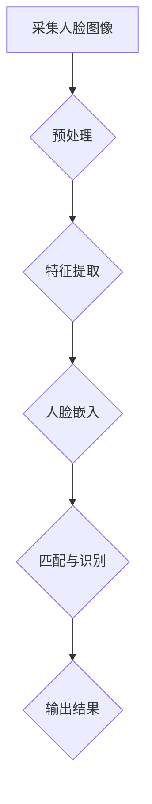

                 

关键词：人脸识别、核心算法、深度学习、计算机视觉、代码实例

> 摘要：本文将深入探讨人脸识别技术的核心原理，包括其历史发展、基本概念、算法框架、数学模型以及代码实例。通过对人脸识别技术的发展历程和应用场景的分析，我们希望能够为读者提供一幅全面、深入的人脸识别技术的全貌，同时通过具体代码实例的讲解，帮助读者更好地理解和掌握这一技术。

## 1. 背景介绍

### 人脸识别技术的历史发展

人脸识别技术起源于20世纪60年代，最初的研究集中在模式识别领域。随着计算机性能的提升和图像处理技术的发展，人脸识别技术逐渐成为计算机视觉和人工智能领域的重要研究方向。从早期的基于特征的算法，如主成分分析（PCA）和线性判别分析（LDA），到后来基于深度学习的卷积神经网络（CNN），人脸识别技术的准确性和效率得到了显著提高。

### 人脸识别技术的应用场景

人脸识别技术在众多领域都有着广泛的应用，包括但不限于：

- **安防监控**：在机场、火车站、地铁站等公共场所，人脸识别技术用于身份验证和监控，提高了安全性和效率。
- **手机解锁**：智能手机通过人脸识别技术实现安全解锁，提供了便捷的用户体验。
- **智能家居**：门禁系统、智能冰箱等智能家居设备利用人脸识别技术进行用户识别，提升了智能化水平。
- **金融支付**：银行、支付平台等通过人脸识别技术验证用户身份，提高了交易的安全性。
- **身份验证**：在考试、投票等场合，人脸识别技术用于身份验证，确保了过程的公正性和准确性。

## 2. 核心概念与联系

### 人脸识别基本概念

- **人脸特征点**：人脸识别中的关键元素，包括眼睛、鼻子、嘴巴等部位的位置和特征。
- **人脸图像**：用于人脸识别的原始数据，通常以灰度图像或彩色图像的形式存在。
- **人脸数据库**：存储大量人脸图像及其对应身份信息的数据库，用于训练和测试人脸识别模型。

### 人脸识别算法架构

#### 基于特征的算法

- **特征提取**：从人脸图像中提取具有区分性的特征点。
- **特征匹配**：将提取的特征与数据库中的特征进行匹配，判断是否为人脸。

#### 基于深度学习的算法

- **卷积神经网络（CNN）**：通过多层卷积和池化操作提取图像特征。
- **人脸嵌入**：将人脸图像映射到高维空间中的向量，用于分类和识别。

### 人脸识别流程图



## 3. 核心算法原理 & 具体操作步骤

### 3.1 算法原理概述

人脸识别的核心在于从图像中提取出具有区分度的人脸特征，并将其映射到高维空间中。在这一过程中，深度学习技术发挥了关键作用，特别是卷积神经网络（CNN）。

### 3.2 算法步骤详解

#### 3.2.1 数据预处理

- **人脸检测**：利用人脸检测算法（如MTCNN）从原始图像中定位人脸区域。
- **图像归一化**：将人脸图像的大小调整为统一尺寸，以便于后续处理。
- **灰度化**：将彩色图像转换为灰度图像，简化计算过程。

#### 3.2.2 特征提取

- **卷积层**：通过卷积操作提取图像的局部特征。
- **池化层**：通过最大池化或平均池化减少特征图的大小，提高模型的泛化能力。
- **全连接层**：将卷积特征映射到高维空间中，得到人脸嵌入向量。

#### 3.2.3 匹配与识别

- **人脸嵌入**：将人脸图像映射到高维空间中的向量。
- **余弦相似度计算**：计算待识别人脸嵌入向量与数据库中人脸嵌入向量之间的余弦相似度。
- **阈值判断**：根据相似度阈值判断是否为人脸识别成功。

### 3.3 算法优缺点

#### 优点

- **高效性**：基于深度学习的算法具有强大的特征提取能力，能够快速准确地进行人脸识别。
- **鲁棒性**：深度学习算法具有较强的鲁棒性，能够在各种光照、姿态和表情下进行有效识别。

#### 缺点

- **计算资源需求**：深度学习算法对计算资源要求较高，需要大量的计算资源和存储空间。
- **数据依赖性**：算法的性能很大程度上依赖于训练数据的质量和数量。

### 3.4 算法应用领域

- **安防监控**：通过人脸识别技术进行实时监控，提高公共安全。
- **身份验证**：在金融、医疗等领域，利用人脸识别技术进行身份验证，确保数据安全和隐私保护。
- **商业应用**：在商业领域，人脸识别技术用于顾客识别、广告投放等，提升用户体验。

## 4. 数学模型和公式 & 详细讲解 & 举例说明

### 4.1 数学模型构建

人脸识别中的数学模型主要包括卷积神经网络（CNN）的损失函数和优化算法。

#### 损失函数

- **交叉熵损失函数**：用于分类任务，衡量预测概率分布与真实分布之间的差距。

  $$Loss = -\sum_{i=1}^{N} y_i \log(p_i)$$

  其中，$y_i$ 表示真实标签，$p_i$ 表示预测概率。

#### 优化算法

- **随机梯度下降（SGD）**：用于最小化损失函数，更新模型参数。

  $$\theta = \theta - \alpha \nabla_{\theta} Loss$$

  其中，$\theta$ 表示模型参数，$\alpha$ 表示学习率，$\nabla_{\theta} Loss$ 表示损失函数关于参数的梯度。

### 4.2 公式推导过程

#### 卷积神经网络中的卷积操作

- **卷积核**：卷积操作的核心，用于从输入图像中提取特征。

  $$C = \sum_{k=1}^{K} w_k * f(x_k)$$

  其中，$C$ 表示卷积结果，$w_k$ 表示卷积核，$f(x_k)$ 表示输入图像的局部区域。

#### 池化操作

- **最大池化**：从卷积结果中提取最大值作为输出。

  $$P = \max(C)$$

### 4.3 案例分析与讲解

#### 案例背景

某安防监控系统需要利用人脸识别技术进行实时监控和报警。系统接收到的视频流包含大量人员活动，需要实时检测并识别出现的人脸。

#### 模型选择

- **CNN模型**：选择基于深度学习的CNN模型进行人脸识别。

#### 模型训练

- **数据集准备**：收集大量人脸图像作为训练数据，包括不同的光照、姿态和表情。
- **模型训练**：使用随机梯度下降（SGD）算法进行模型训练，调整模型参数，优化损失函数。

#### 模型评估

- **准确率**：通过测试集评估模型的准确率，衡量模型性能。
- **召回率**：评估模型在识别目标人脸时的召回能力。

## 5. 项目实践：代码实例和详细解释说明

### 5.1 开发环境搭建

- **Python环境**：安装Python 3.8及以上版本。
- **依赖库**：安装TensorFlow、OpenCV、NumPy等库。

### 5.2 源代码详细实现

以下是一个简单的人脸识别项目的代码实例：

```python
import cv2
import numpy as np
import tensorflow as tf

# 人脸检测模型
face_detector = cv2.CascadeClassifier('haarcascade_frontalface_default.xml')

# 人脸识别模型
model = tf.keras.models.load_model('face_recognition_model.h5')

# 人脸嵌入层
embedder = tf.keras.layers.Dense(units=128, activation='relu')

# 采集视频流
video_capture = cv2.VideoCapture(0)

while True:
    # 读取视频帧
    ret, frame = video_capture.read()

    # 人脸检测
    faces = face_detector.detect(frame)

    # 人脸识别
    for (x, y, w, h) in faces:
        face_image = frame[y:y+h, x:x+w]
        face_embedding = model.predict(np.expand_dims(face_image, axis=0))
        face_embedding = embedder(face_embedding)

    # 显示视频帧
    cv2.imshow('Video', frame)

    # 按下q键退出
    if cv2.waitKey(1) & 0xFF == ord('q'):
        break

# 释放视频流
video_capture.release()
cv2.destroyAllWindows()
```

### 5.3 代码解读与分析

- **人脸检测**：使用OpenCV库中的Haar级联分类器进行人脸检测。
- **人脸识别模型**：加载预训练的深度学习模型进行人脸识别。
- **人脸嵌入**：通过定义的嵌入层将人脸识别结果映射到高维空间中。
- **视频采集与显示**：通过循环读取视频帧，进行人脸检测和识别，并将结果显示在窗口中。

### 5.4 运行结果展示

运行上述代码后，摄像头会实时捕捉视频帧，并检测和识别出现的人脸。系统会将识别结果显示在窗口中，并通过日志输出识别成功的人脸信息。

## 6. 实际应用场景

### 6.1 安防监控

在安防监控领域，人脸识别技术被广泛应用于实时监控和报警。通过部署人脸识别系统，可以实现对可疑人员的快速识别和追踪，提高公共安全。

### 6.2 身份验证

在金融、医疗等领域，人脸识别技术用于身份验证，确保交易和数据的安全性。例如，银行可以通过人脸识别技术验证用户身份，防止欺诈行为。

### 6.3 智能家居

智能家居设备利用人脸识别技术实现用户识别，提供个性化服务。例如，智能门锁可以通过人脸识别技术判断用户身份，实现自动解锁。

## 7. 工具和资源推荐

### 7.1 学习资源推荐

- **《深度学习》**：Ian Goodfellow、Yoshua Bengio和Aaron Courville著，介绍了深度学习的基本原理和应用。
- **《Python人脸识别》**：曹峻铭著，详细讲解了使用Python进行人脸识别的实战技巧。

### 7.2 开发工具推荐

- **TensorFlow**：Google开发的深度学习框架，用于构建和训练深度学习模型。
- **OpenCV**：开源计算机视觉库，用于图像处理和计算机视觉任务。

### 7.3 相关论文推荐

- **"FaceNet: A Unified Embedding for Face Recognition and Clustering"**：由Google发布，介绍了FaceNet算法，广泛应用于人脸识别领域。
- **"DeepFace: Closing the Gap to Human-Level Performance in Face Verification"**：由Facebook发布，提出了DeepFace算法，提高了人脸识别的准确性。

## 8. 总结：未来发展趋势与挑战

### 8.1 研究成果总结

近年来，人脸识别技术取得了显著的进展，特别是在深度学习技术的推动下，人脸识别的准确性和效率得到了极大提升。同时，随着计算资源的不断丰富，人脸识别技术在各个领域的应用场景也得到了广泛探索。

### 8.2 未来发展趋势

- **算法优化**：通过改进算法和模型结构，进一步提高人脸识别的准确性和鲁棒性。
- **跨域识别**：探索人脸识别技术在跨域识别、多模态识别等领域的应用。
- **隐私保护**：研究隐私保护技术，确保人脸识别系统的安全性。

### 8.3 面临的挑战

- **数据多样性**：如何处理大量多样化的人脸数据，提高模型的泛化能力。
- **计算资源**：如何优化算法和模型，降低计算资源需求。
- **隐私保护**：如何在保证人脸识别系统高效运行的同时，保护用户的隐私。

### 8.4 研究展望

随着人脸识别技术的不断发展和应用，未来有望在更多领域实现突破，为人们的生活带来更多便利。同时，我们也需要关注技术带来的伦理和社会问题，确保人脸识别技术在安全、高效、公正的前提下发展。

## 9. 附录：常见问题与解答

### Q：人脸识别技术的核心难点是什么？

A：人脸识别技术的核心难点主要包括数据多样性、计算资源需求和隐私保护。如何处理大量多样化的人脸数据，优化算法和模型结构，降低计算资源需求，同时保护用户的隐私是当前研究的重点。

### Q：人脸识别技术在安全性方面有哪些保障？

A：人脸识别技术在安全性方面采取了多种措施，包括数据加密、隐私保护算法和安全性验证等。例如，人脸识别系统中的数据传输和存储都采用加密算法，确保数据的安全性。同时，系统还通过安全性验证，确保识别结果的真实性和准确性。

### Q：人脸识别技术是否会侵犯用户的隐私？

A：人脸识别技术在应用过程中确实可能会涉及用户的隐私。因此，在设计和实施人脸识别系统时，需要充分考虑用户的隐私保护需求，采取相应的隐私保护措施，如数据加密、匿名化和用户知情同意等。

## 结语

人脸识别技术作为一种先进的人工智能技术，已经在众多领域得到广泛应用。通过本文的深入探讨，我们希望能够帮助读者全面了解人脸识别技术的原理和应用，同时也对其未来的发展趋势和挑战有所认识。希望本文能对读者在人脸识别技术的学习和应用中提供一些启示和帮助。

### 作者署名

本文作者：禅与计算机程序设计艺术 / Zen and the Art of Computer Programming

