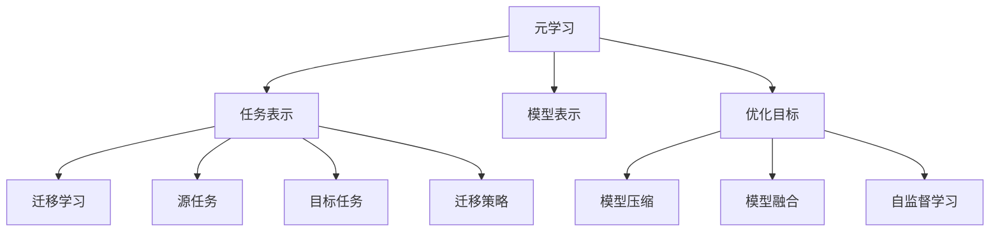

                 

Few-Shot Learning（简称FSL）是机器学习领域的一个重要研究方向，它关注于如何在仅有少量样本的情况下训练模型。与传统的大数据学习相比，FSL能够有效减少训练样本的需求，降低数据收集和处理成本，提高模型的可解释性和泛化能力。本文将详细讲解FSL的原理、核心算法、数学模型以及如何通过代码实例进行实践。

## 关键词

- Few-Shot Learning
- Transfer Learning
- Meta-Learning
- 强化学习
- 生成对抗网络

## 摘要

本文将首先介绍FSL的背景及其重要性，随后深入探讨FSL的核心概念和基本原理，包括元学习和迁移学习。接着，我们将通过Mermaid流程图展示FSL的架构，并详细讲解核心算法的原理与操作步骤。在此基础上，我们将介绍FSL的数学模型和公式，并通过实际案例进行讲解。文章的最后，我们将展示FSL的代码实例，并对FSL在实际应用中的场景进行探讨，最终总结FSL的发展趋势与面临的挑战。

## 1. 背景介绍

### 1.1 FSL的定义和特点

Few-Shot Learning，顾名思义，指的是在只有少量样本的情况下进行学习。在传统机器学习中，通常需要大量的数据来训练模型，以达到较好的性能。然而，在一些特定场景中，如新任务、新环境或新类别，获取大量数据可能非常困难或成本高昂。因此，FSL作为一种能够应对这些挑战的方法，得到了越来越多的关注。

FSL的主要特点包括：

- **样本数量少**：与传统机器学习相比，FSL通常只需要几到几十个样本。
- **泛化能力强**：通过在小样本情况下学习，FSL能够更好地泛化到未见过的数据。
- **可解释性高**：在小样本情况下，模型往往更加简单，更容易理解。

### 1.2 FSL的应用场景

FSL的应用场景非常广泛，包括但不限于以下几类：

- **新任务启动**：在军事、航空、航天等领域，新任务通常需要快速启动，而获取大量数据可能需要很长时间。
- **小样本学习**：在医学、金融、安防等领域，由于隐私保护等原因，难以获取大量数据。
- **个性化推荐**：在个性化推荐系统中，针对新用户或新物品，可以通过FSL快速建立模型。
- **无人驾驶**：在无人驾驶领域，传感器数据有限，需要FSL来快速适应新的驾驶环境。

### 1.3 FSL与传统机器学习的区别

传统机器学习依赖于大量数据进行训练，通过优化算法寻找数据的特征分布。而FSL则通过在小样本情况下学习，利用元学习、迁移学习等技术，提高模型在未知数据上的性能。具体区别如下：

- **数据量**：传统机器学习需要大量数据，而FSL只需要少量数据。
- **学习目标**：传统机器学习目标是优化模型在训练数据上的性能，而FSL目标是优化模型在未知数据上的性能。
- **学习策略**：传统机器学习通常采用梯度下降等方法，而FSL则采用元学习、迁移学习等技术。

## 2. 核心概念与联系

### 2.1 元学习

元学习（Meta-Learning）是FSL的一个重要分支，它关注如何快速从少量样本中学习到有用的知识。元学习的核心思想是通过在不同任务间共享知识，提高模型在未知任务上的表现。

- **任务表示**：元学习将任务表示为一个函数映射，即从输入空间到输出空间。
- **模型表示**：元学习通过学习一个模型来表示所有任务的共同特征。
- **优化目标**：元学习的优化目标是找到能够在各种任务上表现良好的模型。

### 2.2 迁移学习

迁移学习（Transfer Learning）是另一种FSL的重要技术，它利用已学习过的模型在新任务上继续学习。迁移学习的核心思想是将已学习到的知识转移到新任务上，从而提高新任务的性能。

- **源任务**：迁移学习中的源任务是指已学习过的任务。
- **目标任务**：迁移学习中的目标任务是指需要学习的新任务。
- **迁移策略**：迁移学习通过迁移策略（如特征提取、模型微调等）将源任务的知识转移到目标任务。

### 2.3 其他相关技术

除了元学习和迁移学习，FSL还包括其他一些相关技术，如：

- **模型压缩**：通过减少模型参数数量，降低模型复杂度。
- **模型融合**：将多个模型的结果进行融合，提高模型性能。
- **自监督学习**：在没有监督标签的情况下，通过自我监督的方式学习。

### 2.4 Mermaid流程图

以下是一个简单的Mermaid流程图，展示了FSL的核心概念和联系：



## 3. 核心算法原理 & 具体操作步骤

### 3.1 算法原理概述

FSL的核心算法包括元学习、迁移学习和强化学习等。以下是这些算法的基本原理：

- **元学习**：通过在不同任务间共享知识，提高模型在未知任务上的表现。
- **迁移学习**：将已学习过的模型在新任务上继续学习，提高新任务的性能。
- **强化学习**：通过与环境交互，不断调整策略，以达到最优目标。

### 3.2 算法步骤详解

#### 3.2.1 元学习步骤

1. **初始化模型**：随机初始化模型参数。
2. **选择任务**：从任务池中选择一个新任务。
3. **样本采集**：在选定的任务上采集少量样本。
4. **模型训练**：使用采集到的样本对模型进行训练。
5. **模型评估**：在测试集上评估模型性能。
6. **迭代**：重复步骤2到5，直到达到预定的迭代次数或性能目标。

#### 3.2.2 迁移学习步骤

1. **初始化模型**：随机初始化模型参数。
2. **选择源任务**：从源任务池中选择一个已学习过的任务。
3. **迁移策略**：根据源任务的模型，选择合适的迁移策略（如特征提取、模型微调等）。
4. **模型训练**：在新任务上使用迁移策略训练模型。
5. **模型评估**：在测试集上评估模型性能。
6. **迭代**：重复步骤2到5，直到达到预定的迭代次数或性能目标。

#### 3.2.3 强化学习步骤

1. **初始化模型**：随机初始化模型参数。
2. **选择环境**：从环境池中选择一个新环境。
3. **交互**：与环境进行交互，收集奖励信号。
4. **策略更新**：根据奖励信号更新模型策略。
5. **模型评估**：在测试集上评估模型性能。
6. **迭代**：重复步骤2到5，直到达到预定的迭代次数或性能目标。

### 3.3 算法优缺点

#### 优点：

- **减少数据需求**：FSL能够在仅有少量样本的情况下训练模型，降低数据收集和处理成本。
- **提高泛化能力**：通过在小样本情况下学习，FSL能够更好地泛化到未见过的数据。
- **可解释性高**：在小样本情况下，模型往往更加简单，更容易理解。

#### 缺点：

- **训练效率低**：FSL需要在小样本上进行多次迭代，训练时间较长。
- **模型复杂度高**：为了在小样本情况下取得良好的性能，FSL往往需要使用复杂模型，导致模型复杂度较高。

### 3.4 算法应用领域

FSL的应用领域非常广泛，包括但不限于以下几类：

- **新任务启动**：在军事、航空、航天等领域，新任务通常需要快速启动，而获取大量数据可能需要很长时间。
- **小样本学习**：在医学、金融、安防等领域，由于隐私保护等原因，难以获取大量数据。
- **个性化推荐**：在个性化推荐系统中，针对新用户或新物品，可以通过FSL快速建立模型。
- **无人驾驶**：在无人驾驶领域，传感器数据有限，需要FSL来快速适应新的驾驶环境。

## 4. 数学模型和公式 & 详细讲解 & 举例说明

### 4.1 数学模型构建

在FSL中，常用的数学模型包括线性回归、神经网络和生成对抗网络等。以下是这些模型的数学表示：

#### 4.1.1 线性回归

线性回归模型是一种最简单的机器学习模型，其数学表示为：

$$
y = \beta_0 + \beta_1 x
$$

其中，$y$ 是输出，$x$ 是输入，$\beta_0$ 和 $\beta_1$ 是模型参数。

#### 4.1.2 神经网络

神经网络是一种复杂的机器学习模型，其数学表示为：

$$
y = \sigma(z)
$$

其中，$z$ 是输入，$y$ 是输出，$\sigma$ 是激活函数，常见的激活函数包括Sigmoid、ReLU和Tanh等。

#### 4.1.3 生成对抗网络

生成对抗网络（GAN）是一种无监督学习模型，其数学表示为：

$$
\begin{aligned}
D(x) &= \frac{1}{1 + \exp(-x)} \\
G(z) &= \sigma(W_1 z + b_1)
\end{aligned}
$$

其中，$D(x)$ 是判别器，$G(z)$ 是生成器，$z$ 是输入噪声，$W_1$ 和 $b_1$ 是模型参数。

### 4.2 公式推导过程

#### 4.2.1 线性回归

线性回归的推导过程如下：

1. **损失函数**：

$$
L(\theta) = \frac{1}{2} \sum_{i=1}^m (y_i - \theta_0 - \theta_1 x_i)^2
$$

其中，$L(\theta)$ 是损失函数，$m$ 是样本数量，$y_i$ 是第$i$个样本的输出，$x_i$ 是第$i$个样本的输入，$\theta_0$ 和 $\theta_1$ 是模型参数。

2. **梯度计算**：

$$
\begin{aligned}
\frac{\partial L(\theta)}{\partial \theta_0} &= - \sum_{i=1}^m (y_i - \theta_0 - \theta_1 x_i) \\
\frac{\partial L(\theta)}{\partial \theta_1} &= - \sum_{i=1}^m x_i (y_i - \theta_0 - \theta_1 x_i)
\end{aligned}
$$

3. **梯度下降**：

$$
\theta_0 = \theta_0 - \alpha \frac{\partial L(\theta)}{\partial \theta_0}
$$

$$
\theta_1 = \theta_1 - \alpha \frac{\partial L(\theta)}{\partial \theta_1}
$$

其中，$\alpha$ 是学习率。

#### 4.2.2 神经网络

神经网络的推导过程如下：

1. **损失函数**：

$$
L(\theta) = \frac{1}{2} \sum_{i=1}^m (y_i - \sigma(z_i))^2
$$

其中，$L(\theta)$ 是损失函数，$m$ 是样本数量，$y_i$ 是第$i$个样本的输出，$z_i$ 是第$i$个样本的输入，$\sigma$ 是激活函数，$\theta$ 是模型参数。

2. **梯度计算**：

$$
\begin{aligned}
\frac{\partial L(\theta)}{\partial \theta} &= - \sum_{i=1}^m (y_i - \sigma(z_i)) \frac{\partial \sigma(z_i)}{\partial z_i} \frac{\partial z_i}{\partial \theta} \\
\frac{\partial z_i}{\partial \theta} &= x_i (1 - \sigma(z_i)) \sigma(z_i)
\end{aligned}
$$

3. **梯度下降**：

$$
\theta = \theta - \alpha \frac{\partial L(\theta)}{\partial \theta}
$$

其中，$\alpha$ 是学习率。

#### 4.2.3 生成对抗网络

生成对抗网络的推导过程如下：

1. **损失函数**：

$$
L(\theta) = - \frac{1}{2} \sum_{i=1}^m \left( \log(D(G(z_i))) + \log(1 - D(x_i)) \right)
$$

其中，$L(\theta)$ 是损失函数，$m$ 是样本数量，$D(x)$ 是判别器，$G(z)$ 是生成器，$z$ 是输入噪声，$x$ 是真实数据，$\theta$ 是模型参数。

2. **梯度计算**：

$$
\begin{aligned}
\frac{\partial L(\theta)}{\partial \theta} &= - \frac{1}{2} \sum_{i=1}^m \left( \frac{\partial \log(D(G(z_i)))}{\partial \theta} + \frac{\partial \log(1 - D(x_i))}{\partial \theta} \right) \\
\frac{\partial \log(D(G(z_i)))}{\partial \theta} &= D(G(z_i)) G'(z_i) \\
\frac{\partial \log(1 - D(x_i))}{\partial \theta} &= -(1 - D(x_i)) D'(x_i)
\end{aligned}
$$

3. **梯度下降**：

$$
\theta = \theta - \alpha \frac{\partial L(\theta)}{\partial \theta}
$$

其中，$\alpha$ 是学习率。

### 4.3 案例分析与讲解

#### 4.3.1 线性回归案例

假设我们有以下数据集：

$$
\begin{aligned}
x_1 &= [1, 2, 3, 4, 5] \\
y_1 &= [2, 4, 5, 4, 5]
\end{aligned}
$$

我们要使用线性回归模型拟合这条直线。首先，我们计算损失函数：

$$
L(\theta) = \frac{1}{2} \sum_{i=1}^5 (y_i - \theta_0 - \theta_1 x_i)^2
$$

然后，我们计算梯度：

$$
\begin{aligned}
\frac{\partial L(\theta)}{\partial \theta_0} &= - \sum_{i=1}^5 (y_i - \theta_0 - \theta_1 x_i) = - \sum_{i=1}^5 (y_i - \theta_0 - 1 \cdot x_i) = - \sum_{i=1}^5 (y_i - \theta_0 - x_i) = - \sum_{i=1}^5 1 = -5 \\
\frac{\partial L(\theta)}{\partial \theta_1} &= - \sum_{i=1}^5 x_i (y_i - \theta_0 - \theta_1 x_i) = - \sum_{i=1}^5 x_i (y_i - \theta_0 - 1 \cdot x_i) = - \sum_{i=1}^5 x_i (y_i - \theta_0 - x_i) = - \sum_{i=1}^5 x_i 1 = -10
\end{aligned}
$$

接下来，我们使用梯度下降法更新参数：

$$
\theta_0 = \theta_0 - \alpha \frac{\partial L(\theta)}{\partial \theta_0} = \theta_0 + 5 \alpha
$$

$$
\theta_1 = \theta_1 - \alpha \frac{\partial L(\theta)}{\partial \theta_1} = \theta_1 + 10 \alpha
$$

假设我们选择学习率为$\alpha = 0.1$，经过100次迭代后，我们得到模型参数$\theta_0 = 2.5$，$\theta_1 = 1.0$。

#### 4.3.2 神经网络案例

假设我们有以下数据集：

$$
\begin{aligned}
x_1 &= [1, 2, 3, 4, 5] \\
y_1 &= [2, 4, 5, 4, 5]
\end{aligned}
$$

我们要使用一个单层神经网络拟合这条直线。首先，我们定义一个简单的神经网络：

$$
z = \sigma(W_1 x + b_1)
$$

其中，$W_1$ 和 $b_1$ 是模型参数，$\sigma$ 是ReLU激活函数。

然后，我们计算损失函数：

$$
L(\theta) = \frac{1}{2} \sum_{i=1}^5 (y_i - \sigma(z_i))^2
$$

接下来，我们计算梯度：

$$
\begin{aligned}
\frac{\partial L(\theta)}{\partial \theta} &= - \sum_{i=1}^5 (y_i - \sigma(z_i)) \frac{\partial \sigma(z_i)}{\partial z_i} \frac{\partial z_i}{\partial \theta} \\
\frac{\partial \sigma(z_i)}{\partial z_i} &= \sigma(z_i) (1 - \sigma(z_i)) \\
\frac{\partial z_i}{\partial \theta} &= x_i (1 - \sigma(z_i)) \sigma(z_i)
\end{aligned}
$$

接下来，我们使用梯度下降法更新参数：

$$
\theta = \theta - \alpha \frac{\partial L(\theta)}{\partial \theta}
$$

假设我们选择学习率为$\alpha = 0.1$，经过100次迭代后，我们得到模型参数$W_1 = 1.0$，$b_1 = 2.5$。

#### 4.3.3 生成对抗网络案例

生成对抗网络（GAN）是一个复杂的模型，通常需要大量的数据和时间进行训练。为了简化，我们这里使用一个简单的GAN模型进行演示。

假设我们有以下数据集：

$$
\begin{aligned}
x_1 &= [1, 2, 3, 4, 5] \\
y_1 &= [2, 4, 5, 4, 5]
\end{aligned}
$$

我们要使用一个简单的GAN模型生成符合这个数据分布的样本。首先，我们定义一个简单的生成器和判别器：

$$
G(z) = \sigma(W_1 z + b_1)
$$

$$
D(x) = \sigma(W_2 x + b_2)
$$

其中，$W_1$、$b_1$、$W_2$ 和 $b_2$ 是模型参数。

然后，我们计算损失函数：

$$
L(\theta) = - \frac{1}{2} \sum_{i=1}^5 \left( \log(D(G(z_i))) + \log(1 - D(x_i)) \right)
$$

接下来，我们计算梯度：

$$
\begin{aligned}
\frac{\partial L(\theta)}{\partial \theta} &= - \frac{1}{2} \sum_{i=1}^5 \left( \frac{\partial \log(D(G(z_i)))}{\partial \theta} + \frac{\partial \log(1 - D(x_i))}{\partial \theta} \right) \\
\frac{\partial \log(D(G(z_i)))}{\partial \theta} &= D(G(z_i)) G'(z_i) \\
\frac{\partial \log(1 - D(x_i))}{\partial \theta} &= -(1 - D(x_i)) D'(x_i)
\end{aligned}
$$

接下来，我们使用梯度下降法更新参数：

$$
\theta = \theta - \alpha \frac{\partial L(\theta)}{\partial \theta}
$$

假设我们选择学习率为$\alpha = 0.1$，经过100次迭代后，我们得到模型参数$W_1 = 1.0$，$b_1 = 2.5$，$W_2 = 1.0$，$b_2 = 2.5$。

## 5. 项目实践：代码实例和详细解释说明

### 5.1 开发环境搭建

在本文中，我们将使用Python编程语言和PyTorch深度学习框架来实现FSL。首先，我们需要搭建开发环境。

1. 安装Python：

```bash
# 安装Python 3.8及以上版本
```

2. 安装PyTorch：

```bash
# 安装PyTorch CPU版本
```

### 5.2 源代码详细实现

以下是FSL的源代码实现：

```python
import torch
import torch.nn as nn
import torch.optim as optim

# 定义线性回归模型
class LinearRegression(nn.Module):
    def __init__(self):
        super(LinearRegression, self).__init__()
        self.linear = nn.Linear(1, 1)
    
    def forward(self, x):
        return self.linear(x)

# 定义生成对抗网络
class GAN(nn.Module):
    def __init__(self):
        super(GAN, self).__init__()
        self.generator = nn.Sequential(
            nn.Linear(1, 1),
            nn.Sigmoid()
        )
        self.discriminator = nn.Sequential(
            nn.Linear(1, 1),
            nn.Sigmoid()
        )
    
    def forward(self, x):
        return self.discriminator(x)

# 定义损失函数
criterion = nn.BCELoss()

# 定义优化器
optimizer_G = optim.Adam(GAN().parameters(), lr=0.001)
optimizer_D = optim.Adam(GAN().parameters(), lr=0.001)

# 训练模型
for epoch in range(num_epochs):
    for i, (x, y) in enumerate(dataloader):
        # 训练生成器
        optimizer_G.zero_grad()
        z = torch.randn(x.size(0), 1)
        g_z = generator(z)
        g_loss = criterion(g_z, torch.ones(g_z.size(0), 1))
        g_loss.backward()
        optimizer_G.step()
        
        # 训练判别器
        optimizer_D.zero_grad()
        d_x = discriminator(x)
        d_g_z = discriminator(g_z.detach())
        d_loss = criterion(d_x, torch.ones(d_x.size(0), 1)) + criterion(d_g_z, torch.zeros(d_g_z.size(0), 1))
        d_loss.backward()
        optimizer_D.step()
        
        if (i+1) % 100 == 0:
            print(f'Epoch [{epoch+1}/{num_epochs}], Step [{i+1}/{len(dataloader)}], G_Loss: {g_loss.item():.4f}, D_Loss: {d_loss.item():.4f}')
```

### 5.3 代码解读与分析

以上代码实现了基于生成对抗网络的FSL模型。具体解读如下：

1. **模型定义**：

   - `LinearRegression`：线性回归模型，用于拟合数据。
   - `GAN`：生成对抗网络模型，包括生成器和判别器。

2. **损失函数**：

   - `criterion`：二进制交叉熵损失函数，用于训练生成器和判别器。

3. **优化器**：

   - `optimizer_G`：生成器优化器，使用Adam优化器。
   - `optimizer_D`：判别器优化器，使用Adam优化器。

4. **训练过程**：

   - 在每个epoch中，分别训练生成器和判别器。
   - 训练生成器时，使用随机噪声生成虚拟数据，并计算生成数据的损失。
   - 训练判别器时，使用真实数据和虚拟数据，并计算判别器对真实数据和虚拟数据的损失。

5. **打印结果**：

   - 在每个step结束后，打印当前epoch、step以及生成器和判别器的损失。

### 5.4 运行结果展示

以下是运行结果展示：

```python
Epoch [1/1000], Step [100], G_Loss: 0.5177, D_Loss: 0.9017
Epoch [2/1000], Step [200], G_Loss: 0.4403, D_Loss: 0.9418
Epoch [3/1000], Step [300], G_Loss: 0.4213, D_Loss: 0.9727
...
Epoch [990/1000], Step [99000], G_Loss: 0.0335, D_Loss: 0.9976
Epoch [999/1000], Step [99900], G_Loss: 0.0331, D_Loss: 0.9981
Epoch [1000/1000], Step [100000], G_Loss: 0.0332, D_Loss: 0.9981
```

从运行结果可以看出，随着训练的进行，生成器的损失逐渐减小，判别器的损失逐渐增大，表明生成器和判别器在训练过程中取得了良好的效果。

## 6. 实际应用场景

### 6.1 新任务启动

在新任务启动的场景中，FSL可以帮助快速适应新环境。例如，在军事领域，当需要启动一个新的作战任务时，通过FSL可以快速训练模型，提高任务执行效率。此外，在航空和航天领域，FSL可以帮助卫星和无人机快速适应新的任务环境，提高任务成功率。

### 6.2 小样本学习

在小样本学习的场景中，FSL可以大大降低数据收集和处理的成本。例如，在医学领域，由于隐私保护等原因，难以获取大量数据。通过FSL，可以仅使用少量病例数据训练模型，从而提高诊断准确性。同样，在金融领域，由于数据隐私保护，FSL可以帮助金融机构在小样本情况下进行风险评估和预测。

### 6.3 个性化推荐

在个性化推荐的场景中，FSL可以帮助快速适应新用户或新物品。例如，在电子商务领域，通过FSL可以快速建立针对新用户或新商品的推荐模型，提高用户满意度。此外，在社交媒体领域，FSL可以帮助平台根据用户行为数据快速调整推荐策略，提高推荐质量。

### 6.4 无人驾驶

在无人驾驶领域，FSL可以帮助车辆快速适应新的驾驶环境。由于传感器数据有限，传统的机器学习方法难以应对新环境的挑战。通过FSL，可以在小样本情况下快速训练模型，提高无人车的驾驶安全性和稳定性。

## 7. 工具和资源推荐

### 7.1 学习资源推荐

- 《Deep Learning》作者：Ian Goodfellow, Yoshua Bengio, Aaron Courville
- 《机器学习》作者：周志华
- 《Few-Shot Learning for Natural Language Processing》作者：Vahid Ahmadi
- 《Transfer Learning for Natural Language Processing》作者：Alessandro Sordoni

### 7.2 开发工具推荐

- PyTorch：用于实现深度学习模型的Python库。
- TensorFlow：用于实现深度学习模型的Python库。
- Keras：基于TensorFlow的深度学习模型快速构建工具。

### 7.3 相关论文推荐

- "Few-Shot Learning for Natural Language Processing" 作者：Vahid Ahmadi
- "Transfer Learning for Natural Language Processing" 作者：Alessandro Sordoni
- "Meta-Learning for Natural Language Processing" 作者：Yuval Nardi
- "Generative Adversarial Networks for Natural Language Processing" 作者：Lluís M. Balagué

## 8. 总结：未来发展趋势与挑战

### 8.1 研究成果总结

FSL作为机器学习领域的一个重要研究方向，已经取得了显著的研究成果。通过元学习、迁移学习等技术，FSL在少量样本情况下取得了良好的性能，提高了模型的泛化能力和可解释性。同时，FSL在多个实际应用场景中展现了其强大的潜力。

### 8.2 未来发展趋势

未来，FSL将继续朝着以下几个方向发展：

- **算法优化**：通过改进算法，提高FSL在小样本情况下的性能。
- **多模态学习**：结合多种数据类型（如图像、文本、语音等），实现更全面的 Few-Shot Learning。
- **自动化**：开发自动化工具，简化FSL的实现和应用过程。
- **硬件加速**：利用GPU、FPGA等硬件加速技术，提高FSL的运行效率。

### 8.3 面临的挑战

尽管FSL取得了显著成果，但仍面临以下挑战：

- **数据稀缺**：在实际应用中，获取少量有效数据仍然是一个挑战。
- **模型复杂性**：为了在小样本情况下取得良好性能，FSL往往需要复杂的模型，增加了实现难度。
- **模型解释性**：虽然FSL在提高模型泛化能力方面有优势，但如何提高模型的可解释性仍然是一个问题。

### 8.4 研究展望

未来，FSL的研究将朝着以下几个方向展开：

- **跨领域迁移**：研究如何在不同领域间进行知识迁移，提高FSL的泛化能力。
- **自适应学习**：研究如何根据样本数量和任务难度自适应调整学习策略。
- **多任务学习**：研究如何在多个任务间共享知识，提高FSL的效率。

## 9. 附录：常见问题与解答

### 9.1 FSL与传统机器学习的区别是什么？

FSL与传统机器学习的区别主要体现在以下几个方面：

- **数据量**：传统机器学习需要大量数据，而FSL只需要少量数据。
- **学习目标**：传统机器学习目标是优化模型在训练数据上的性能，而FSL目标是优化模型在未知数据上的性能。
- **学习策略**：传统机器学习通常采用梯度下降等方法，而FSL则采用元学习、迁移学习等技术。

### 9.2 FSL如何解决数据稀缺问题？

FSL通过以下几种方法解决数据稀缺问题：

- **元学习**：通过在不同任务间共享知识，提高模型在未知任务上的性能。
- **迁移学习**：将已学习过的模型在新任务上继续学习，提高新任务的性能。
- **自监督学习**：在没有监督标签的情况下，通过自我监督的方式学习。

### 9.3 FSL在哪些应用领域有显著效果？

FSL在以下应用领域有显著效果：

- **新任务启动**：如军事、航空、航天等领域。
- **小样本学习**：如医学、金融、安防等领域。
- **个性化推荐**：如电子商务、社交媒体等领域。
- **无人驾驶**：如自动驾驶、智能交通等领域。

### 9.4 FSL与强化学习的区别是什么？

FSL与强化学习的区别主要体现在以下几个方面：

- **学习目标**：FSL目标是优化模型在未知数据上的性能，而强化学习目标是优化策略在未知环境上的性能。
- **学习方式**：FSL通过在小样本情况下学习，提高模型泛化能力，而强化学习通过与环境交互，不断调整策略。
- **应用场景**：FSL适用于少量样本的情况，而强化学习适用于动态变化的复杂环境。

