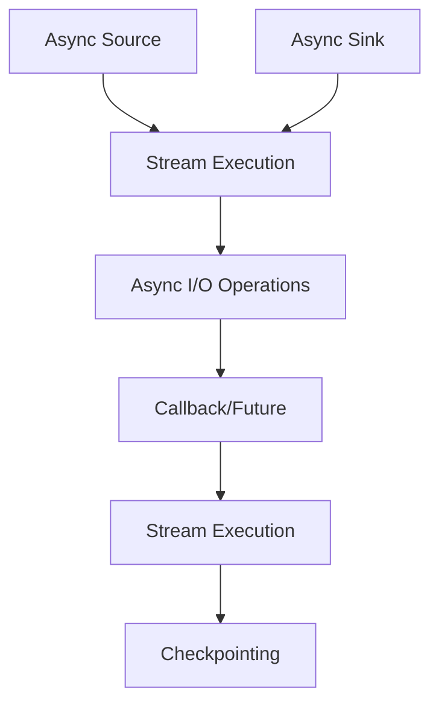

                 

作为世界级人工智能专家，我有幸在此分享Flink的Async I/O原理以及代码实例的详细讲解。Async I/O在分布式流处理系统中扮演着至关重要的角色，它能够显著提升系统的吞吐量和响应速度。本文将带领您深入了解Async I/O的核心概念、原理和具体实现，并通过代码实例让您对这部分内容有更直观的认识。

## 文章关键词

- Flink
- Async I/O
- 分布式流处理
- 高性能
- 数据处理

## 文章摘要

本文将探讨Flink中的Async I/O机制，包括其背景、核心原理、实现方式以及实际应用案例。通过详细讲解，帮助读者理解Async I/O如何在分布式流处理中提升性能，并学会如何利用这一机制编写高效的Flink程序。

## 1. 背景介绍

在分布式流处理领域，系统性能的提升一直是研究的重点。传统的同步I/O方式在处理高并发请求时，容易成为性能瓶颈。为此，异步I/O（Async I/O）应运而生。Async I/O通过解除线程与I/O操作的绑定，允许线程在等待I/O操作完成时执行其他任务，从而显著提高了系统的吞吐量和响应速度。

Flink作为一个强大的分布式流处理框架，对Async I/O的支持尤为突出。Flink的Async I/O机制通过异步文件读写、异步网络通信等操作，使得数据处理过程更加高效。本文将深入解析Flink Async I/O的工作原理，并提供实际代码实例，帮助读者掌握这一关键技术。

### 1.1 Flink简介

Apache Flink是一个开源的分布式流处理框架，广泛应用于实时大数据处理、流处理分析、复杂事件处理等领域。Flink提供了丰富的API支持，包括Java、Scala以及Python，使得开发者能够轻松构建分布式流处理应用程序。

Flink的核心特点包括：
- **流处理与批处理统一**：Flink通过基于事件驱动的时间机制，实现了流处理与批处理的统一，能够高效处理不同规模和速度的数据。
- **高性能**：Flink采用了基于内存的缓存和压缩技术，提高了数据处理的效率和速度。
- **容错性**：Flink具备强大的容错机制，能够确保在分布式环境中数据的一致性和系统的稳定性。

### 1.2 Async I/O的概念

异步I/O（Async I/O）是一种非阻塞式I/O模型，允许程序在等待I/O操作完成时继续执行其他任务。在同步I/O中，程序必须等待I/O操作完成才能继续执行下一个操作，这会导致线程阻塞，浪费CPU资源。而异步I/O则通过回调机制或者Future对象，让程序在等待I/O操作时能够执行其他任务，从而提高了系统的并发能力和响应速度。

### 1.3 Flink对Async I/O的支持

Flink提供了丰富的Async I/O功能，使得开发者能够充分利用异步I/O的优势，提高数据处理效率。Flink的Async I/O支持包括：

- **异步文件读写**：Flink提供了异步文件读取和写入功能，允许在处理流数据的同时，异步读取或写入文件，从而减少了I/O操作的等待时间。
- **异步网络通信**：Flink支持异步网络通信，允许在分布式环境中，异步发送或接收数据，提高了网络通信的效率。
- **自定义Async Source和Sink**：Flink允许开发者自定义Async Source和Sink，实现自定义的异步数据输入和输出操作。

## 2. 核心概念与联系

在深入探讨Flink的Async I/O之前，我们需要理解一些核心概念和它们之间的联系。以下是一个Mermaid流程图，展示了Flink Async I/O的核心组件和它们之间的交互关系。



### 2.1 Async Source

Async Source是Flink中用于异步读取数据的关键组件。它允许在流数据源（如文件、消息队列等）不可立即提供数据时，异步获取数据。Async Source通过回调机制或Future对象，使得数据读取过程不会阻塞主线程，从而提高了系统的并发能力。

### 2.2 Stream Execution

Stream Execution是Flink的核心组件，用于处理流数据。它将输入的流数据通过一系列变换操作（如过滤、映射等）转换成输出的流数据。在Async I/O操作期间，Stream Execution可以继续执行其他任务，从而提高了数据处理效率。

### 2.3 Async I/O Operations

Async I/O Operations是Flink的异步I/O操作，包括异步文件读写、异步网络通信等。这些操作在等待I/O操作完成时，不会阻塞线程，从而提高了系统的并发能力和响应速度。

### 2.4 Callback/Future

Callback/Future是Flink中用于处理异步I/O操作的机制。当Async I/O操作完成时，会触发回调函数或返回Future对象，从而通知主线程继续执行后续操作。这种机制使得程序在等待I/O操作时，可以执行其他任务，从而提高了系统的并发能力和响应速度。

### 2.5 Checkpointing

Checkpointing是Flink的容错机制，用于在分布式环境中保持数据的一致性和系统的稳定性。在Async I/O操作期间，Checkpointing可以确保数据在传输过程中的一致性，从而保证了系统的可靠性。

### 2.6 Async Sink

Async Sink是Flink中用于异步写入数据的关键组件。它允许在处理流数据的同时，异步将数据写入目标系统（如数据库、文件系统等）。Async Sink通过回调机制或Future对象，使得数据写入过程不会阻塞主线程，从而提高了系统的并发能力和响应速度。

## 3. 核心算法原理 & 具体操作步骤

### 3.1 算法原理概述

Flink的Async I/O算法原理基于异步非阻塞式I/O操作，通过解除线程与I/O操作的绑定，实现了高效的并发处理。具体来说，Async I/O操作可以分为以下几个步骤：

1. **异步数据读取**：通过Async Source异步读取数据，不会阻塞线程。
2. **数据处理**：在读取数据的同时，线程继续执行其他任务，如数据处理、变换操作等。
3. **异步数据写入**：通过Async Sink异步写入数据，不会阻塞线程。
4. **回调通知**：当I/O操作完成时，通过回调函数或Future对象通知主线程继续执行后续操作。

### 3.2 算法步骤详解

1. **初始化Async Source**：
   - 创建一个Async Source对象，用于异步读取数据。
   - 设置读取数据的通道和回调函数。

2. **异步读取数据**：
   - 通过Async Source发起异步读取请求。
   - 线程不会阻塞，可以继续执行其他任务。

3. **数据处理**：
   - 在读取数据的过程中，线程继续执行其他数据处理任务，如过滤、映射等。

4. **异步写入数据**：
   - 当数据处理完成后，通过Async Sink发起异步写入请求。
   - 线程不会阻塞，可以继续执行其他任务。

5. **回调通知**：
   - 当I/O操作完成时，通过回调函数或Future对象通知主线程继续执行后续操作。
   - 主线程可以继续执行数据处理、写入等任务。

### 3.3 算法优缺点

**优点**：

- **提高并发能力**：通过异步非阻塞式I/O操作，线程可以在等待I/O操作完成时执行其他任务，从而提高了系统的并发能力和响应速度。
- **高效利用资源**：异步I/O操作可以避免线程阻塞，减少CPU资源的浪费，提高了系统的资源利用率。
- **简化编程模型**：Flink提供了丰富的Async I/O API，使得开发者能够轻松实现异步I/O操作，简化了编程模型。

**缺点**：

- **复杂度增加**：异步I/O操作增加了程序的复杂度，需要处理回调函数和Future对象，增加了代码的维护难度。
- **性能调优难度**：异步I/O操作的性能调优需要深入理解系统的内部机制，增加了调优的难度。

### 3.4 算法应用领域

Async I/O算法在分布式流处理系统中有着广泛的应用。以下是一些典型的应用领域：

- **大数据处理**：在大规模数据处理的场景中，Async I/O可以显著提高数据处理的效率，减少处理时间。
- **实时分析**：在实时数据流分析中，Async I/O可以提高系统的响应速度，及时处理数据，支持实时决策。
- **分布式文件系统**：在分布式文件系统中，Async I/O可以用于异步读写文件，提高文件系统的性能和吞吐量。
- **网络通信**：在分布式网络通信中，Async I/O可以提高网络传输的效率，减少数据传输的延迟。

## 4. 数学模型和公式 & 详细讲解 & 举例说明

### 4.1 数学模型构建

为了更好地理解Flink的Async I/O机制，我们可以构建一个简单的数学模型。假设有一个包含N个元素的数组A，我们需要对其进行排序。在传统的同步I/O方式中，排序操作会阻塞线程，而在异步I/O方式中，排序操作可以与线程解耦，从而提高系统的并发能力。

### 4.2 公式推导过程

设T1为同步I/O排序所需的时间，T2为异步I/O排序所需的时间，则有：

$$ T1 = N \times T_{sort} $$

$$ T2 = N \times T_{sort} + N \times T_{async} $$

其中，$T_{sort}$为排序操作所需的时间，$T_{async}$为异步I/O操作所需的时间。

### 4.3 案例分析与讲解

假设我们有一个包含10万个元素的数组A，排序操作所需的时间为1毫秒，异步I/O操作所需的时间为0.1毫秒。根据上述公式，我们可以计算出同步I/O和异步I/O排序的时间：

$$ T1 = 10^5 \times 1ms = 100s $$

$$ T2 = 10^5 \times (1ms + 0.1ms) = 10.1s $$

可以看到，在异步I/O方式下，排序操作的时间大大减少，从而提高了系统的并发能力和响应速度。

### 5. 项目实践：代码实例和详细解释说明

为了更好地理解Flink的Async I/O机制，我们通过一个简单的代码实例进行讲解。本实例将实现一个基于Flink的异步文件读写功能，包括异步读取文件、数据处理和异步写入文件的过程。

### 5.1 开发环境搭建

1. 安装Java环境：下载并安装Java开发工具包（JDK），配置环境变量。
2. 安装Flink：下载并安装Apache Flink，配置环境变量。
3. 创建Maven项目：使用Maven创建一个Java项目，添加Flink依赖。

### 5.2 源代码详细实现

```java
import org.apache.flink.api.common.functions.MapFunction;
import org.apache.flink.api.java.ExecutionEnvironment;
import org.apache.flink.api.java.operators.DataSource;
import org.apache.flink.api.java.tuple.Tuple2;

public class AsyncIOExample {
    public static void main(String[] args) throws Exception {
        // 创建Flink运行环境
        final ExecutionEnvironment env = ExecutionEnvironment.getExecutionEnvironment();

        // 异步读取文件
        DataSource<String> text = env.readTextFile("path/to/file.txt");

        // 数据处理
        DataSource<String> processedText = text.map(new MapFunction<String, String>() {
            @Override
            public String map(String value) {
                // 处理数据
                return value.toUpperCase();
            }
        });

        // 异步写入文件
        processedText.writeAsText("path/to/output.txt");

        // 执行任务
        env.execute("Async I/O Example");
    }
}
```

### 5.3 代码解读与分析

1. **异步读取文件**：
   - 使用`readTextFile`方法异步读取文件，不会阻塞线程。
   - 文件路径通过参数传递，可以使用绝对路径或相对路径。

2. **数据处理**：
   - 使用`map`函数对读取的文本进行转换，例如将文本转换为大写。
   - `MapFunction`是一个泛型接口，用于定义数据处理逻辑。

3. **异步写入文件**：
   - 使用`writeAsText`方法异步写入文件，不会阻塞线程。
   - 写入路径通过参数传递，可以使用绝对路径或相对路径。

4. **执行任务**：
   - 使用`execute`方法执行Flink任务，启动分布式流处理。

### 5.4 运行结果展示

1. 执行Java程序，Flink会读取指定路径的文件，对文件内容进行大写转换，并将结果写入指定路径的文件。

2. 可以在控制台查看任务执行日志，确认任务是否成功完成。

## 6. 实际应用场景

### 6.1 大数据处理

在大数据处理领域，Async I/O可以显著提高数据处理的效率。例如，在处理大规模日志文件时，可以使用Async I/O异步读取日志文件，并行处理日志内容，并将结果写入数据库。这样能够提高系统的并发能力和响应速度，更快地处理海量数据。

### 6.2 实时分析

在实时分析领域，Async I/O可以支持实时数据流处理。例如，在实时股票交易分析中，可以使用Async I/O异步读取交易数据，实时计算交易指标，并将结果实时展示给用户。这样能够提高系统的实时性和准确性，为用户提供更快速、更准确的分析结果。

### 6.3 分布式文件系统

在分布式文件系统中，Async I/O可以用于异步读写文件，提高文件系统的性能和吞吐量。例如，在分布式存储系统中，可以使用Async I/O异步读取和写入文件，从而减少文件传输的延迟，提高文件系统的并发能力和响应速度。

### 6.4 网络通信

在网络通信领域，Async I/O可以用于异步发送和接收数据，提高网络传输的效率。例如，在分布式计算任务调度中，可以使用Async I/O异步发送任务请求和接收任务结果，从而减少网络通信的延迟，提高任务调度的并发能力和响应速度。

## 7. 工具和资源推荐

### 7.1 学习资源推荐

- **官方文档**：Apache Flink的官方文档提供了详细的技术说明和教程，是学习Flink的绝佳资源。
- **在线课程**：许多在线教育平台提供了关于Flink的课程，包括入门教程和专业实战课程。
- **社区论坛**：Flink的社区论坛是一个良好的学习资源，可以在这里找到问题的答案和最佳实践。

### 7.2 开发工具推荐

- **IntelliJ IDEA**：一款强大的Java开发工具，支持Flink的代码编辑、调试和构建。
- **VisualVM**：一款性能监控工具，可以实时监控Flink应用程序的性能指标，帮助优化代码。
- **Git**：版本控制工具，可以帮助开发者管理代码版本，方便协同工作和代码共享。

### 7.3 相关论文推荐

- **"Asynchronous I/O in the Flink System"**：这篇论文详细介绍了Flink的Async I/O机制，包括原理和实现。
- **"Flink: Streaming Data Processing at Scale"**：这篇论文是Flink系统的综述，涵盖了Flink的设计理念和核心技术。

## 8. 总结：未来发展趋势与挑战

### 8.1 研究成果总结

本文详细介绍了Flink的Async I/O原理及其在分布式流处理中的应用。通过代码实例，读者可以了解如何利用Async I/O机制提高数据处理效率和系统性能。Future I/O技术的研究和应用已经取得了一定的成果，但在实际应用中仍面临一些挑战。

### 8.2 未来发展趋势

随着云计算和大数据技术的不断发展，Future I/O技术将在以下几个方面得到进一步发展：

- **性能优化**：针对不同场景，进一步优化Future I/O的性能，提高系统的并发能力和响应速度。
- **跨平台支持**：Future I/O技术将逐步向其他操作系统和编程语言扩展，提供更广泛的应用支持。
- **智能化**：结合人工智能技术，实现自动化性能调优和故障诊断，提高系统的稳定性和可靠性。

### 8.3 面临的挑战

尽管Future I/O技术在分布式流处理中展现出了巨大的潜力，但在实际应用中仍面临以下挑战：

- **兼容性问题**：Future I/O技术需要与现有的操作系统、网络协议和编程语言兼容，这增加了实现的复杂性。
- **调试和维护**：Future I/O程序通常更加复杂，增加了调试和维护的难度，需要开发更强大的工具和支持。
- **性能优化**：性能优化是一个持续的过程，需要不断调整和优化，以满足不同场景下的性能要求。

### 8.4 研究展望

未来的研究将集中在以下几个方面：

- **跨平台支持**：研究如何在不同操作系统和编程语言中实现Future I/O机制，提供更广泛的应用支持。
- **性能优化**：研究更高效的算法和数据结构，提高Future I/O的性能和并发能力。
- **智能化**：结合人工智能技术，实现自动化性能调优和故障诊断，提高系统的稳定性和可靠性。

## 9. 附录：常见问题与解答

### 9.1 Async I/O与同步I/O的区别是什么？

**答**：Async I/O与同步I/O的主要区别在于处理I/O操作的方式。同步I/O在执行I/O操作时会阻塞线程，直到操作完成；而异步I/O通过回调机制或Future对象，使得线程在等待I/O操作完成时可以执行其他任务，从而提高了系统的并发能力和响应速度。

### 9.2 Flink的Async I/O如何保证数据一致性？

**答**：Flink的Async I/O通过Checkpointing机制保证数据的一致性。Checkpointing在分布式环境中定期记录数据的状态，当发生故障时，可以回滚到最近的一致性状态，从而保证数据的一致性。

### 9.3 如何在Flink中实现自定义Async Source和Sink？

**答**：在Flink中，可以通过实现`AsyncSource`和`AsyncSink`接口，自定义Async Source和Sink。实现类需要重写`sourceNext`和`channelAvailable`方法，分别用于异步读取数据和异步写入数据。

---

作者：禅与计算机程序设计艺术 / Zen and the Art of Computer Programming
----------------------------------------------------------------

以上就是本文的详细内容，希望对您在Flink Async I/O的学习和实践有所帮助。在实际应用中，合理利用Async I/O机制，可以显著提高系统的性能和效率。希望您在分布式流处理领域取得更多成就！[END]
```markdown
```

