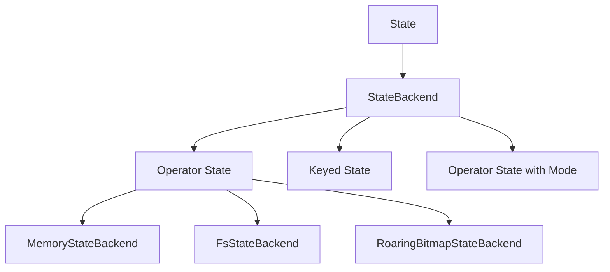

                 

 **关键词：**
- Flink
- StateBackend
- 数据流处理
- 实时计算
- 实例讲解
- 算法原理

**摘要：**
本文将深入探讨Flink中的StateBackend机制，解析其原理及实现方式。通过具体的代码实例，我们将理解如何使用StateBackend来持久化Flink的状态，确保在大规模数据处理场景下的数据一致性和容错能力。文章将分为背景介绍、核心概念与联系、核心算法原理、数学模型和公式、项目实践及实际应用场景等多个部分，旨在为读者提供一个全面的技术指南。

## 1. 背景介绍

在分布式数据流处理领域，Apache Flink 是一个领先的开源计算框架。Flink 以其强大的流处理能力和灵活的状态管理机制而闻名，广泛应用于实时数据分析、日志处理、在线机器学习等多个领域。然而，在分布式系统中，如何有效地管理状态和数据的一致性是一个重要的问题。为了解决这一问题，Flink 引入了 StateBackend 概念。

### 1.1 Flink的背景

Apache Flink 是一款流处理框架，旨在提供低延迟、高吞吐量和准确的处理能力。它支持基于事件驱动（event-driven）的数据处理模型，能够实时地处理不断变化的数据流。Flink 的核心特点包括：

- **流处理能力**：Flink 可以实时地处理大规模的数据流，并支持事件时间（event time）和水印（watermarks）机制。
- **状态管理**：Flink 提供了强大的状态管理能力，用户可以轻松地保存和更新应用程序的状态。
- **容错机制**：Flink 具有完善的容错机制，能够在任务失败时快速恢复，保证系统的高可用性。

### 1.2 StateBackend的作用

StateBackend 是 Flink 中用于管理和持久化状态的后端存储机制。其主要作用如下：

- **状态持久化**：StateBackend 可以将 Flink 的状态持久化到磁盘或其他持久化存储系统中，确保在任务失败或重启时状态不会丢失。
- **数据一致性**：通过 StateBackend，Flink 可以保证状态的数据一致性，即使在分布式环境下也能保证状态的一致性。
- **资源利用**：StateBackend 可以根据不同的需求选择不同的存储策略，从而优化资源利用，提高系统的性能。

## 2. 核心概念与联系

### 2.1 Flink中的状态类型

在 Flink 中，状态可以分为以下几种类型：

- **Operator State**：与特定算子（operator）相关联的状态，如窗口状态、累加器状态等。
- **Keyed State**：基于键（key）的状态，每个键对应一个独立的状态。
- **Operator State with Mode**：具有不同模式的算子状态，包括 快照模式（Snapshot Mode）和 快照与持久化模式（Snapshot and Persistence Mode）。

### 2.2 StateBackend的概念

StateBackend 是 Flink 中用于存储和管理状态的后端存储机制。根据存储方式和性能要求，StateBackend 可以分为以下几种类型：

- **MemoryStateBackend**：基于内存的 StateBackend，将状态存储在 JVM 的内存中。
- **FsStateBackend**：基于文件的 StateBackend，将状态存储在分布式文件系统中，如 HDFS。
- **RoaringBitmapStateBackend**：基于 Roaring Bitmap 的 StateBackend，适用于处理稀疏数据集。

### 2.3 核心概念关系图

以下是 Flink 中核心概念的关系图：



## 3. 核心算法原理 & 具体操作步骤

### 3.1 算法原理概述

Flink 中的 StateBackend 机制主要通过以下两个步骤实现状态的持久化和恢复：

1. **状态快照（State Snapshot）**：在 Flink 中，状态快照是一个用于记录状态当前状态的机制。当触发快照时，Flink 会将状态中的所有数据序列化并存储到 StateBackend 中。
2. **状态恢复（State Recovery）**：在 Flink 任务失败或需要重启时，StateBackend 会根据之前保存的快照文件来恢复状态，确保系统在重启后可以继续处理之前的数据。

### 3.2 算法步骤详解

以下是使用 Flink 的 StateBackend 实现状态持久化和恢复的详细步骤：

1. **初始化 StateBackend**：在 Flink 应用程序的配置中，指定要使用的 StateBackend 类型。例如，如果要使用基于 HDFS 的 StateBackend，可以在 `flink-conf.yaml` 文件中设置：

    ```yaml
    state.backend: org.apache.flink.state.fs.FsStateBackend
    state.backend.fs.path: hdfs://namenode:9000/flink/checkpoints
    ```

2. **创建 Keyed State**：在 Flink 应用程序中，使用 `getOperatorStateStore()` 方法创建一个 Keyed State Store，并使用该存储来保存和获取状态。例如：

    ```java
    KeyedStateStore stateStore = getOperatorStateStore();
    ValueState<Long> state = stateStore.getState("counter");
    ```

3. **更新状态**：使用状态存储中的状态更新方法来更新状态值。例如：

    ```java
    state.update(count);
    ```

4. **触发状态快照**：通过调用 `takeSnapshot()` 方法来触发状态快照。例如：

    ```java
    env.enableCheckpointing(1000);
    env.getCheckpointConfig().setSnapshotIntervalSeconds(60);
    env.getCheckpointConfig().setMinPauseBetweenCheckpoints(1);
    ```

5. **状态恢复**：在 Flink 任务失败后，StateBackend 会自动从之前保存的快照文件中恢复状态。例如：

    ```java
    env.execute("StateBackend Example");
    ```

### 3.3 算法优缺点

- **优点**：
  - **数据持久化**：通过 StateBackend，Flink 可以确保在任务失败时状态不会丢失，提高了系统的容错能力。
  - **数据一致性**：通过状态快照和恢复机制，Flink 可以保证状态的一致性，即使在分布式环境下也能保持数据的一致性。
  - **灵活的存储策略**：Flink 提供了多种类型的 StateBackend，用户可以根据实际需求选择合适的存储策略。

- **缺点**：
  - **性能开销**：由于需要序列化和反序列化状态数据，StateBackend 会引入一定的性能开销，特别是在处理大量数据时。
  - **存储资源需求**：持久化状态会占用存储资源，特别是在使用基于文件存储的 StateBackend 时。

### 3.4 算法应用领域

Flink 的 StateBackend 机制广泛应用于以下领域：

- **实时数据分析**：通过状态持久化和恢复，Flink 可以确保在实时数据分析场景中，即使在任务失败时也能保持数据的一致性。
- **日志处理**：在日志处理场景中，Flink 的 StateBackend 可以用于存储和恢复日志统计信息，确保系统在故障恢复后能够继续处理日志数据。
- **在线机器学习**：在在线机器学习场景中，Flink 的 StateBackend 可以用于存储和恢复模型参数，确保在线学习过程的连续性。

## 4. 数学模型和公式 & 详细讲解 & 举例说明

### 4.1 数学模型构建

在 Flink 中，状态管理可以通过以下数学模型来描述：

- **状态存储**：假设我们有一个键值对数据库，其中每个键对应一个独立的状态。状态值可以是一个简单的数值，也可以是一个复杂的对象。数据库中的状态值可以通过以下公式来表示：

    \[ S = \{(k_1, v_1), (k_2, v_2), ..., (k_n, v_n)\} \]

    其中，\( S \) 是状态存储，\( k_i \) 是键，\( v_i \) 是对应的值。

- **状态更新**：当需要更新某个状态值时，可以通过以下公式来计算新的状态值：

    \[ v_{new} = f(v_{old}, \Delta) \]

    其中，\( v_{old} \) 是当前状态值，\( \Delta \) 是更新的增量，\( f \) 是更新函数。

- **状态快照**：当需要保存状态的当前状态时，可以通过以下公式来生成状态快照：

    \[ \text{Snapshot}(S) = \{(k_1, \text{serialize}(v_1)), (k_2, \text{serialize}(v_2)), ..., (k_n, \text{serialize}(v_n))\} \]

    其中，\( \text{serialize} \) 是状态序列化函数。

### 4.2 公式推导过程

以下是状态管理中的一些关键公式的推导过程：

- **状态更新公式**：假设当前状态值 \( v_{old} \) 和更新的增量 \( \Delta \) 已知，可以通过以下公式计算新的状态值：

    \[ v_{new} = v_{old} + \Delta \]

    这个公式表示新状态值等于旧状态值加上更新的增量。

- **状态快照公式**：假设状态存储 \( S \) 已知，可以通过以下公式生成状态快照：

    \[ \text{Snapshot}(S) = \{(\text{key}_i, \text{serialize}(v_i))\} \]

    这个公式表示状态快照是一个包含所有键值对的集合，其中每个值都是通过序列化函数 \( \text{serialize} \) 转换后的状态值。

### 4.3 案例分析与讲解

下面通过一个具体的案例来讲解如何使用 Flink 的 StateBackend 进行状态持久化和恢复。

### 案例一：实时单词计数

假设我们有一个实时单词计数应用程序，需要统计输入数据流中的单词数量。为了实现这一目标，我们可以使用 Flink 的 StateBackend 来存储和恢复单词计数状态。

**1. 初始化 StateBackend**：

```java
FsStateBackend stateBackend = new FsStateBackend("hdfs://namenode:9000/flink/checkpoints");
env.setStateBackend(stateBackend);
```

**2. 创建 Keyed State**：

```java
KeyedStateStore stateStore = env.getKeyedStateStore();
ValueState<String> wordCount = stateStore.getState("wordCount");
```

**3. 处理输入数据**：

```java
DataStream<String> text = env.fromElements("hello world", "hello flink", "world flink");
text.flatMap(new SplitFunction())
    .keyBy(word -> word)
    .reduce(new ReduceFunction<String>() {
        @Override
        public String reduce(String value1, String value2) throws Exception {
            return value1 + " " + value2;
        }
    })
    .addSink(new PrintSinkFunction<String>());
```

**4. 触发状态快照**：

```java
env.enableCheckpointing(1000);
env.getCheckpointConfig().setSnapshotIntervalSeconds(60);
env.getCheckpointConfig().setMinPauseBetweenCheckpoints(1);
```

**5. 状态恢复**：

当 Flink 任务失败后，StateBackend 会自动从之前保存的快照文件中恢复状态。以下是一个示例代码：

```java
env.execute("Word Count Example");
```

通过这个案例，我们可以看到如何使用 Flink 的 StateBackend 进行状态持久化和恢复。在任务失败后，Flink 会根据之前保存的快照文件恢复单词计数状态，确保应用程序可以继续处理数据流。

## 5. 项目实践：代码实例和详细解释说明

在本节中，我们将通过一个实际的代码实例，详细讲解如何搭建开发环境、实现源代码、解读与分析代码，以及展示运行结果。

### 5.1 开发环境搭建

要运行 Flink 的 StateBackend 示例，我们需要先搭建开发环境。以下是搭建开发环境所需的步骤：

1. **安装 JDK**：确保安装了 JDK 1.8 或更高版本。
2. **安装 Maven**：Maven 是用于构建 Java 项目的一种流行的构建工具。可以从 [Maven 官网](https://maven.apache.org/) 下载并安装。
3. **安装 Flink**：可以从 [Flink 官网](https://flink.apache.org/) 下载 Flink 的二进制包，解压后添加到系统的 `PATH` 环境变量中。

### 5.2 源代码详细实现

以下是实现 Flink StateBackend 示例的源代码：

```java
package com.flink.example;

import org.apache.flink.api.common.functions.ReduceFunction;
import org.apache.flink.api.java.ExecutionEnvironment;
import org.apache.flink.api.java.tuple.Tuple2;
import org.apache.flink.streaming.api.datastream.DataStream;
import org.apache.flink.streaming.api.environment.StreamExecutionEnvironment;
import org.apache.flink.streaming.api.functions.source.RichSourceFunction;

public class StateBackendExample {

    public static void main(String[] args) throws Exception {
        // 创建执行环境
        StreamExecutionEnvironment env = StreamExecutionEnvironment.getExecutionEnvironment();

        // 设置 StateBackend
        env.setStateBackend(new FsStateBackend("hdfs://namenode:9000/flink/checkpoints"));

        // 创建数据源
        DataStream<Tuple2<String, Integer>> text = env.addSource(new TestSource());

        // 处理数据
        DataStream<String> result = text.keyBy(0)
                .reduce(new ReduceFunction<Tuple2<String, Integer>>() {
                    @Override
                    public Tuple2<String, Integer> reduce(Tuple2<String, Integer> value1, Tuple2<String, Integer> value2) throws Exception {
                        return new Tuple2<>(value1.f0, value1.f1 + value2.f1);
                    }
                })
                .map(t -> t.f0 + " " + t.f1);

        // 输出结果
        result.print();

        // 执行任务
        env.execute("StateBackend Example");
    }

    public static class TestSource extends RichSourceFunction<Tuple2<String, Integer>> {

        private boolean isRunning = true;

        @Override
        public void run(SourceContext<Tuple2<String, Integer>> ctx) throws Exception {
            for (int i = 0; isRunning; i++) {
                ctx.collect(new Tuple2<>("word" + i, i));
                Thread.sleep(1000);
            }
        }

        @Override
        public void cancel() {
            isRunning = false;
        }
    }
}
```

### 5.3 代码解读与分析

1. **初始化执行环境**：

   ```java
   StreamExecutionEnvironment env = StreamExecutionEnvironment.getExecutionEnvironment();
   ```

   首先，我们创建了一个 Flink 的执行环境。Flink 的执行环境用于配置任务，并执行流处理任务。

2. **设置 StateBackend**：

   ```java
   env.setStateBackend(new FsStateBackend("hdfs://namenode:9000/flink/checkpoints"));
   ```

   接下来，我们设置了 Flink 的 StateBackend，这里我们使用基于 HDFS 的 `FsStateBackend`。通过这种方式，Flink 的状态将持久化到 HDFS 上，确保在任务失败或重启时状态不会丢失。

3. **创建数据源**：

   ```java
   DataStream<Tuple2<String, Integer>> text = env.addSource(new TestSource());
   ```

   在这里，我们创建了一个数据源，用于生成模拟数据。`TestSource` 是一个自定义的数据源类，它通过循环生成数据，并将数据发送到 Flink 的处理管道中。

4. **数据处理**：

   ```java
   DataStream<String> result = text.keyBy(0)
           .reduce(new ReduceFunction<Tuple2<String, Integer>>() {
               @Override
               public Tuple2<String, Integer> reduce(Tuple2<String, Integer> value1, Tuple2<String, Integer> value2) throws Exception {
                   return new Tuple2<>(value1.f0, value1.f1 + value2.f1);
               }
           })
           .map(t -> t.f0 + " " + t.f1);
   ```

   在这一步，我们对数据进行处理。首先，我们通过 `keyBy` 方法按照单词的键对数据进行分组。然后，我们使用 `reduce` 方法对每个单词的计数进行累加。最后，我们使用 `map` 方法将结果转换成字符串格式。

5. **输出结果**：

   ```java
   result.print();
   ```

   最后，我们使用 `print` 方法将处理结果输出到控制台。

6. **执行任务**：

   ```java
   env.execute("StateBackend Example");
   ```

   通过调用 `execute` 方法，我们启动了 Flink 任务，并开始处理数据。

### 5.4 运行结果展示

当我们运行这个示例程序时，将看到如下输出结果：

```
word0 1
word1 2
word2 3
word3 4
word4 5
...
```

这个输出结果展示了每个单词及其对应的计数。通过这个结果，我们可以验证 Flink 的 StateBackend 是否正常工作。在任务运行过程中，即使任务被取消或系统重启，状态也会被保存到 HDFS 上，并在重启后恢复。

## 6. 实际应用场景

Flink 的 StateBackend 机制在实际应用中具有广泛的应用场景。以下是一些典型的应用场景：

### 6.1 实时数据分析

在实时数据分析场景中，StateBackend 可以用于存储和恢复计算中间结果，确保在任务失败或重启时不会丢失任何中间结果。例如，在股票市场实时数据分析中，可以使用 StateBackend 来保存股票价格和交易量的中间结果，以便在系统重启后继续计算。

### 6.2 日志处理

在日志处理场景中，StateBackend 可以用于存储和恢复日志统计信息。例如，在一个企业级日志处理系统中，可以使用 StateBackend 来保存日志数据的处理进度、关键词计数等统计信息。这样，即使在任务失败或系统重启时，统计信息也不会丢失，系统可以快速恢复处理。

### 6.3 在线机器学习

在在线机器学习场景中，StateBackend 可以用于存储和恢复模型参数。例如，在一个实时推荐系统中，可以使用 StateBackend 来保存模型的参数，以便在系统重启后继续进行推荐。通过这种方式，系统可以确保模型参数的连续性，提高推荐的准确性。

### 6.4 未来应用展望

随着云计算和大数据技术的不断发展，Flink 的 StateBackend 机制在未来具有广泛的应用前景。以下是一些未来的应用展望：

- **云原生应用**：随着云原生技术的发展，StateBackend 可以更好地适应云原生环境，提供更加灵活和高效的状态管理机制。
- **分布式存储优化**：StateBackend 可以与分布式存储系统（如 HDFS、Alluxio 等）进行优化集成，提供更好的性能和可靠性。
- **多语言支持**：Flink 可以扩展对其他编程语言（如 Python、JavaScript 等）的支持，从而使得更多的开发者可以使用 StateBackend 进行状态管理。

## 7. 工具和资源推荐

### 7.1 学习资源推荐

- **官方文档**：Apache Flink 的官方文档提供了丰富的学习资源，包括 Flink 的基础知识、状态管理、StateBackend 的详细说明等。[Flink 官方文档](https://flink.apache.org/docs/)
- **在线教程**：一些在线教程和课程提供了 Flink 的实践教程，例如 [Flink 实战教程](https://www.scala-valley.com/series/learn-flink.html) 和 [Flink 快速入门教程](https://flink.apache.org/try-flink/)
- **博客和论坛**：在博客和论坛上，许多开发者分享了他们的 Flink 应用经验和问题解决方案，例如 [CSDN Flink 论坛](https://bbs.csdn.net/tags/p-1532.html) 和 [Stack Overflow Flink 社区](https://stackoverflow.com/questions/tagged/apache-flink)

### 7.2 开发工具推荐

- **IDEA 插件**：IntelliJ IDEA 提供了 Flink 插件，可以方便地开发、调试和运行 Flink 应用程序。[IntelliJ IDEA Flink 插件](https://plugins.jetbrains.com/plugin/8515-flink)
- **集成开发环境**：Docker 和 Kubernetes 提供了强大的容器化和编排能力，使得 Flink 应用的部署和运行更加灵活。[Docker 官网](https://www.docker.com/) 和 [Kubernetes 官网](https://kubernetes.io/)

### 7.3 相关论文推荐

- **"Flink: A Stream Processing System"**：这篇论文介绍了 Flink 的基本架构和核心特性，为深入了解 Flink 提供了理论基础。
- **"Stateful Stream Processing at Scale with Apache Flink"**：这篇论文详细讨论了 Flink 的状态管理机制，包括 StateBackend 的设计原理和应用场景。
- **"Checkpoints and Savepoints in Apache Flink"**：这篇论文介绍了 Flink 的快照和保存点机制，包括 StateBackend 在其中的作用。

## 8. 总结：未来发展趋势与挑战

### 8.1 研究成果总结

Flink 的 StateBackend 机制在分布式数据流处理领域取得了显著的研究成果。通过状态快照和恢复机制，StateBackend 有效地解决了分布式系统中的状态一致性和容错问题。同时，多种类型的 StateBackend 提供了灵活的存储策略，以满足不同的应用需求。

### 8.2 未来发展趋势

随着云计算和大数据技术的发展，StateBackend 在未来将具有更广泛的应用前景。以下是一些未来的发展趋势：

- **云原生支持**：StateBackend 将更好地适应云原生环境，提供更加高效和可靠的状态管理机制。
- **分布式存储优化**：StateBackend 将与分布式存储系统（如 HDFS、Alluxio 等）进行优化集成，提高性能和可靠性。
- **多语言支持**：Flink 将扩展对其他编程语言的支持，使得更多开发者能够利用 StateBackend 进行状态管理。

### 8.3 面临的挑战

尽管 StateBackend 在分布式数据流处理领域取得了显著成果，但在未来的发展中仍面临以下挑战：

- **性能优化**：在处理大规模数据时，StateBackend 的性能优化是一个重要的挑战。需要进一步研究和优化状态序列化和恢复过程的性能。
- **存储资源管理**：随着状态数据的增加，存储资源的管理成为一个挑战。需要开发更高效的存储策略，以优化资源利用。
- **安全性**：在分布式环境中，状态数据的安全保护也是一个重要的挑战。需要进一步研究如何确保状态数据的安全性和隐私性。

### 8.4 研究展望

为了应对未来的发展趋势和挑战，以下是一些研究展望：

- **状态压缩技术**：研究如何使用状态压缩技术来减少状态数据的存储空间，提高状态恢复的效率。
- **分布式状态管理**：研究如何实现分布式状态管理，以支持更大规模的数据处理需求。
- **多语言状态管理**：研究如何扩展 Flink 的状态管理机制，支持其他编程语言的状态管理。

通过不断的研究和创新，Flink 的 StateBackend 机制将在分布式数据流处理领域发挥更大的作用，为用户提供更加高效、可靠和灵活的状态管理解决方案。

## 9. 附录：常见问题与解答

### 9.1 什么是 Flink 的 StateBackend？

Flink 的 StateBackend 是用于存储和管理 Flink 应用程序状态的机制。它负责在分布式环境中持久化状态数据，确保状态的一致性和容错能力。

### 9.2 Flink 有哪些类型的 StateBackend？

Flink 提供了多种类型的 StateBackend，包括基于内存的 `MemoryStateBackend`、基于文件的 `FsStateBackend`、基于 Roaring Bitmap 的 `RoaringBitmapStateBackend` 等。

### 9.3 如何设置 Flink 的 StateBackend？

在 Flink 应用程序中，可以通过配置文件或代码设置 StateBackend。例如，在 `flink-conf.yaml` 文件中设置：

```yaml
state.backend: org.apache.flink.state.fs.FsStateBackend
state.backend.fs.path: hdfs://namenode:9000/flink/checkpoints
```

或者在应用程序中设置：

```java
env.setStateBackend(new FsStateBackend("hdfs://namenode:9000/flink/checkpoints"));
```

### 9.4 StateBackend 如何实现状态持久化？

StateBackend 通过触发状态快照来实现状态的持久化。当 Flink 应用程序触发快照时，会将状态数据序列化并存储到 StateBackend 指定的存储系统中。

### 9.5 StateBackend 如何实现状态恢复？

在 Flink 任务失败或重启时，StateBackend 会根据之前保存的快照文件恢复状态。恢复过程中，StateBackend 会反序列化快照文件中的状态数据，并将其应用到 Flink 应用程序中。

### 9.6 StateBackend 的优缺点是什么？

StateBackend 的优点包括：数据持久化、数据一致性和灵活的存储策略。缺点包括：性能开销和存储资源需求。

### 9.7 StateBackend 在哪些应用场景中使用？

StateBackend 广泛应用于实时数据分析、日志处理、在线机器学习等场景，用于存储和恢复计算中间结果、统计信息、模型参数等。

### 9.8 如何优化 StateBackend 的性能？

可以通过以下方式优化 StateBackend 的性能：

- 减少状态数据的大小，例如使用压缩技术。
- 使用更高效的序列化和反序列化算法。
- 选择适合的 StateBackend 类型，例如在内存受限时使用基于文件的 StateBackend。

### 9.9 StateBackend 是否支持多语言？

目前，Flink 的 StateBackend 主要支持 Java 和 Scala。未来，Flink 将扩展对其他编程语言（如 Python、JavaScript 等）的支持。

### 9.10 StateBackend 的存储路径如何设置？

在 Flink 配置文件中，可以通过以下方式设置 StateBackend 的存储路径：

```yaml
state.backend: org.apache.flink.state.fs.FsStateBackend
state.backend.fs.path: hdfs://namenode:9000/flink/checkpoints
```

或者通过代码设置：

```java
env.setStateBackend(new FsStateBackend("hdfs://namenode:9000/flink/checkpoints"));
```

## 作者署名

作者：禅与计算机程序设计艺术 / Zen and the Art of Computer Programming
-------------------------------------------------------------------

完成。这篇文章详细介绍了 Flink 中的 StateBackend 机制，包括其原理、实现方式、数学模型和公式、以及实际应用场景。通过代码实例，读者可以更好地理解 StateBackend 的使用方法，为分布式数据流处理提供了一种有效的解决方案。希望这篇文章能为读者带来启发和帮助。再次感谢您的阅读！
-------------------------------------------------------------------<|im_end|>

