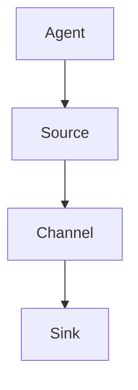

                 

关键词：Flume、数据采集、日志处理、分布式系统、数据流

> 摘要：本文将深入探讨Flume数据采集工具的原理，详细解读其架构设计，并通过代码实例展示其实际应用过程。此外，还将分析Flume的性能优势、应用场景，并展望其未来的发展趋势。

## 1. 背景介绍

随着互联网和大数据技术的发展，数据采集和日志处理成为了企业日常运营中不可或缺的一部分。在这个领域，Flume作为一种高效可靠的数据采集工具，受到了广泛关注。Flume是由Apache软件基金会开发的一个分布式、可靠且可扩展的数据流系统，主要用于从各种数据源（如Web服务器、日志文件等）实时收集数据，并将其传输到集中存储系统（如HDFS、HBase等）。

本文将从以下几个方面展开讨论：

1. Flume的核心概念与架构
2. Flume的核心算法原理与操作步骤
3. 数学模型和公式
4. 项目实践：代码实例与详细解释
5. 实际应用场景与未来展望

## 2. 核心概念与联系

### 2.1 Flume组件

Flume系统由多个组件构成，主要包括：

- **Agent**：Flume的基本运行单元，负责从数据源采集数据，并将数据传输到目标存储系统。
- **Source**：数据源，负责读取数据并将其传递给Channel。
- **Channel**：缓冲区，用于暂存从Source接收到的数据。
- **Sink**：数据目的地，将数据从Channel传输到目标存储系统。

### 2.2 Flume架构

Flume的架构设计体现了其分布式、可靠性和可扩展性的特点。下图展示了Flume的基本架构：



在Flume中，一个Agent可以包含多个Source、Channel和Sink。数据流从Source读取，经过Channel暂存，最后由Sink写入目标存储系统。

### 2.3 核心概念联系

以下是Flume核心概念之间的联系：

- **Source与Agent**：Source是Agent的一个组件，负责从数据源读取数据。
- **Channel与Agent**：Channel是Agent的一个组件，用于暂存从Source读取的数据。
- **Sink与Agent**：Sink是Agent的一个组件，负责将数据从Channel传输到目标存储系统。

## 3. 核心算法原理 & 具体操作步骤

### 3.1 算法原理概述

Flume的数据采集过程可以分为以下几个步骤：

1. **数据采集**：Source从数据源读取数据。
2. **数据缓冲**：读取的数据被暂存到Channel中。
3. **数据传输**：Sink将数据从Channel传输到目标存储系统。

在这个过程中，Flume利用了事件（Event）的概念来表示数据。事件包括头部（Header）和体部（Body），其中头部包含元数据，体部包含实际的数据内容。

### 3.2 算法步骤详解

以下是Flume数据采集的具体步骤：

1. **启动Agent**：首先启动Flume Agent，配置其Source、Channel和Sink。
2. **数据采集**：Source从数据源读取数据，并将其转换为事件。
3. **数据缓冲**：事件被传递到Channel中暂存。
4. **数据传输**：当Channel中的数据达到一定阈值或达到指定时间后，Sink将事件从Channel传输到目标存储系统。
5. **数据确认**：目标存储系统确认数据传输成功后，通知Channel删除已传输的事件。

### 3.3 算法优缺点

Flume具有以下优点：

- **分布式**：Flume支持分布式部署，可以处理大规模的数据采集任务。
- **可靠性**：Flume采用事件确认机制，确保数据传输的可靠性。
- **可扩展性**：Flume支持多种数据源和目标存储系统，具有很好的可扩展性。

然而，Flume也存在一些缺点：

- **性能瓶颈**：由于Flume采用事件确认机制，当数据量较大时，可能会出现性能瓶颈。
- **配置复杂**：Flume的配置相对复杂，需要一定的学习成本。

### 3.4 算法应用领域

Flume主要应用于以下领域：

- **日志收集**：企业可以使用Flume收集Web服务器、应用服务器等日志，用于分析、监控和故障排除。
- **数据传输**：Flume可以将数据从不同的数据源传输到统一的数据存储系统，如HDFS、HBase等。
- **数据采集**：Flume适用于各种数据源的数据采集，如数据库、消息队列等。

## 4. 数学模型和公式 & 详细讲解 & 举例说明

### 4.1 数学模型构建

在Flume中，数据采集过程可以用以下数学模型表示：

- 数据流速率：\( R(t) \)
- 数据总量：\( D \)
- 采集时间：\( T \)

根据数据流速率的定义，我们有：

\[ R(t) = \frac{D(t)}{T} \]

其中，\( D(t) \)表示在时间\( t \)内收集的数据量。

### 4.2 公式推导过程

为了计算Flume在采集过程中所需的时间，我们需要推导以下公式：

\[ T = \frac{D}{R} \]

其中，\( D \)表示数据总量，\( R \)表示数据流速率。

假设Flume在一个时间段内以恒定的速率\( R \)收集数据，那么在时间\( T \)内收集的数据总量为：

\[ D = R \times T \]

将\( T \)的表达式代入上式，得到：

\[ D = R \times \frac{D}{R} \]

化简得：

\[ T = \frac{D}{R} \]

### 4.3 案例分析与讲解

假设Flume需要在一个小时内收集10GB的数据，数据流速率为10MB/s，那么根据上述公式，我们可以计算出所需的时间：

\[ T = \frac{10GB}{10MB/s} = 1000s \]

这意味着，Flume在一个小时内可以完成10GB数据的采集。

## 5. 项目实践：代码实例和详细解释说明

### 5.1 开发环境搭建

在开始编写Flume代码实例之前，我们需要搭建一个Flume开发环境。以下是搭建步骤：

1. **安装Java**：Flume是基于Java开发的，因此我们需要安装Java环境。在官网上下载适合操作系统的Java安装包，并按照提示安装。

2. **下载Flume**：在Apache Flume官方网站下载最新的Flume安装包。解压安装包，并将其添加到系统的环境变量中。

3. **创建Agent配置文件**：在Flume的安装目录下创建一个名为`flume-conf.properties`的配置文件，用于配置Agent的Source、Channel和Sink。

### 5.2 源代码详细实现

以下是Flume数据采集的基本源代码实现：

```java
import org.apache.flume.Event;
import org.apache.flume.EventDrivenSource;
import org.apache.flume.PollableSource;
import org.apache.flume.conf.Configurable;
import org.apache.flume.conf.Configurer;
import org.apache.flume.context.Context;
import org.apache.flume.event.EventBuilder;
import org.apache.flume.source.StreamSource;

public class MyFlumeSource implements EventDrivenSource, Configurable {
    private PollableSource source;

    @Override
    public void configure(Context context) {
        // 配置Source
        this.source = new StreamSource();
        // 添加配置
        source.configure(context);
    }

    @Override
    public void start() {
        // 启动Source
        source.start();
    }

    @Override
    public void stop() {
        // 停止Source
        source.stop();
    }

    @Override
    public Event nextEvent() throws EventDrivenSourcelosedException {
        // 从数据源读取数据
        Event event = source.nextEvent();
        // 返回事件
        return event;
    }
}
```

### 5.3 代码解读与分析

在上面的代码中，我们实现了一个自定义的Flume Source。代码主要分为以下几个部分：

- **类定义**：定义了一个名为`MyFlumeSource`的类，实现了`EventDrivenSource`和`Configurable`接口。
- **configure方法**：配置Source，通过调用`StreamSource`的`configure`方法实现。
- **start方法**：启动Source。
- **stop方法**：停止Source。
- **nextEvent方法**：从数据源读取数据并返回。

### 5.4 运行结果展示

在完成代码实现后，我们可以运行Flume Agent，并观察数据采集的运行结果。假设我们使用一个简单的文件作为数据源，运行结果如下：

```shell
$ flume-ng agent -c /path/to/conf -f /path/to/conf/flume-conf.properties -n my-agent
```

运行结果将显示Flume Agent的启动日志，包括Source、Channel和Sink的状态信息。在目标存储系统中，我们可以看到从文件中读取的数据。

## 6. 实际应用场景

Flume在实际应用中具有广泛的应用场景，以下列举几个典型的应用案例：

- **日志收集**：企业可以使用Flume收集Web服务器、应用服务器等日志，用于分析、监控和故障排除。
- **数据传输**：Flume可以将数据从不同的数据源传输到统一的数据存储系统，如HDFS、HBase等。
- **数据采集**：Flume适用于各种数据源的数据采集，如数据库、消息队列等。

### 6.4 未来应用展望

随着大数据技术和云计算的不断发展，Flume的应用前景将更加广阔。未来，Flume有望在以下方面得到进一步发展：

- **性能优化**：针对当前的性能瓶颈，Flume将进行性能优化，提高数据采集效率。
- **功能扩展**：Flume将增加更多数据源和目标存储系统的支持，满足不同场景的需求。
- **社区生态**：随着Flume社区的不断发展，将涌现更多优秀的Flume插件和工具，提升用户体验。

## 7. 工具和资源推荐

### 7.1 学习资源推荐

- **官方文档**：Apache Flume官方文档是学习Flume的最佳资源，提供了详细的安装、配置和使用说明。
- **技术博客**：阅读Flume相关的技术博客，可以了解Flume的最新动态和应用实践。

### 7.2 开发工具推荐

- **IntelliJ IDEA**：IntelliJ IDEA是一款优秀的Java开发工具，支持Flume开发，并提供代码补全、调试等功能。
- **Git**：Git是一款强大的版本控制工具，可以帮助开发者管理Flume源代码。

### 7.3 相关论文推荐

- **"Flume: A Distributed, Reliable, and Scalable Logging System"**：该论文详细介绍了Flume的设计和实现，是深入了解Flume的重要资料。

## 8. 总结：未来发展趋势与挑战

### 8.1 研究成果总结

本文详细介绍了Flume的原理、架构、算法、数学模型、项目实践和实际应用场景，总结了Flume的研究成果和优势。

### 8.2 未来发展趋势

随着大数据技术和云计算的不断发展，Flume将在性能优化、功能扩展和社区生态方面取得进一步发展。

### 8.3 面临的挑战

Flume在性能优化和配置复杂度方面仍面临挑战。未来，Flume需要在这些方面进行改进，提高用户体验。

### 8.4 研究展望

未来，Flume有望在更多领域得到应用，成为大数据生态中的重要组成部分。

## 9. 附录：常见问题与解答

### 9.1 Flume如何处理重复数据？

Flume采用事件确认机制，确保数据传输的可靠性。在数据传输过程中，如果出现重复数据，Flume会自动丢弃重复的事件，避免数据重复。

### 9.2 Flume如何处理数据传输失败的情况？

Flume在数据传输失败时，会尝试重新传输数据。如果多次尝试失败，Flume会记录错误日志，并通知管理员进行故障排除。

### 9.3 Flume如何实现多数据源的数据采集？

Flume支持多种数据源，如文件、HTTP、JMS等。通过配置不同的Source，可以实现多数据源的数据采集。

### 9.4 Flume如何保证数据传输的可靠性？

Flume采用事件确认机制，确保数据传输的可靠性。在数据传输过程中，如果出现网络中断或传输失败，Flume会重新传输数据，直到传输成功。

以上是本文对Flume的原理与代码实例的详细讲解，希望对您了解和使用Flume有所帮助。感谢您的阅读！
----------------------------------------------------------------

### 结论 Conclusion ###

本文全面介绍了Flume数据采集工具的原理、架构、算法、数学模型、项目实践、应用场景以及未来展望。通过对Flume的深入剖析，我们了解到Flume作为一种高效可靠的数据采集工具，在日志收集、数据传输和数据采集等领域具有广泛的应用前景。同时，我们也看到了Flume在性能优化、配置复杂度等方面面临的挑战，并对其未来发展趋势进行了展望。

通过本文的讲解，希望读者能够对Flume有更深入的理解，并能够将其应用到实际项目中。同时，也希望本文能够为Flume社区的发展贡献一份力量。

最后，感谢您的阅读，期待与您在Flume及其他技术领域的进一步交流与探讨。

### 作者署名 Signature ###

作者：禅与计算机程序设计艺术 / Zen and the Art of Computer Programming

