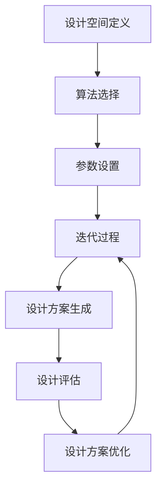

                 

## 1. 背景介绍

Generative Design，即生成式设计，是一种结合计算机技术和艺术设计的方法论。它利用算法和计算模型来生成艺术作品、建筑模型、工业产品等设计。生成式设计最早可以追溯到20世纪80年代，当时计算机图形学开始迅速发展，艺术家和设计师们开始探索如何利用计算机来生成艺术作品。

随着时间的推移，生成式设计逐渐成熟，并在许多领域取得了显著的应用成果。例如，在建筑领域，生成式设计可以用于生成复杂的建筑结构，提高建筑设计的效率和灵活性；在工业设计领域，生成式设计可以用于生成具有独特美感和功能性的产品；在艺术领域，生成式设计可以用于创作独特的艺术品，拓宽了艺术创作的边界。

生成式设计的核心在于算法和计算模型。通过这些工具，设计师和艺术家可以生成大量具有创意的设计方案，从而更好地探索设计空间，发现新的设计可能性。

## 2. 核心概念与联系

### 2.1 设计空间（Design Space）

设计空间是指所有可能的设计方案的总和。在生成式设计中，设计空间是算法搜索和优化的基础。设计空间的范围可以是无限的，但通常需要通过约束条件来限制，以便算法可以在有限的时间内找到最优解。

### 2.2 算法（Algorithm）

算法是生成式设计的核心工具，用于在给定的设计空间中搜索和优化设计方案。常见的生成式设计算法包括遗传算法、模拟退火算法、粒子群优化算法等。这些算法可以通过迭代计算，逐步优化设计参数，从而生成高质量的设计方案。

### 2.3 计算模型（Computational Model）

计算模型是生成式设计的基础，它描述了如何使用算法来生成设计方案。计算模型通常包括几个关键组件：设计空间定义、算法选择、参数设置、迭代过程等。

### 2.4 Mermaid 流程图

以下是生成式设计的 Mermaid 流程图，它展示了从设计空间定义到最终设计方案生成的整个过程。



## 3. 核心算法原理 & 具体操作步骤

### 3.1 算法原理概述

生成式设计中的核心算法主要基于优化理论和计算智能。以下是一些常见的生成式设计算法：

- **遗传算法（Genetic Algorithm，GA）**：基于自然进化的原理，通过选择、交叉、变异等操作来优化设计参数。
- **模拟退火算法（Simulated Annealing，SA）**：基于固体退火过程，通过逐步降低温度来搜索最优解。
- **粒子群优化算法（Particle Swarm Optimization，PSO）**：模拟鸟群觅食行为，通过个体和群体的信息交流来优化设计参数。

### 3.2 算法步骤详解

以下以遗传算法为例，详细解释生成式设计中的算法步骤：

1. **初始化种群**：随机生成一组初始设计方案，作为种群的初始解。
2. **适应度评估**：对每个设计方案进行评估，计算其适应度值。适应度值越高，表示设计方案越优秀。
3. **选择**：根据适应度值，选择优秀的设计方案作为父代。
4. **交叉**：将父代设计方案进行交叉操作，生成新的子代设计方案。
5. **变异**：对子代设计方案进行变异操作，增加种群的多样性。
6. **迭代**：重复执行步骤2-5，直到达到预定的迭代次数或找到满意的设计方案。

### 3.3 算法优缺点

- **遗传算法**：优点是能够处理复杂的设计空间，适应度评估较为简单；缺点是可能陷入局部最优解。
- **模拟退火算法**：优点是能够避免局部最优解，全局搜索能力强；缺点是收敛速度较慢。
- **粒子群优化算法**：优点是计算速度快，容易实现；缺点是可能陷入局部最优解。

### 3.4 算法应用领域

生成式设计算法在以下领域具有广泛应用：

- **建筑与结构设计**：用于生成复杂的建筑结构和优化结构性能。
- **工业产品设计**：用于生成创新性强的产品设计方案，提高产品设计效率。
- **艺术创作**：用于生成独特的艺术作品，拓宽艺术创作领域。
- **游戏与娱乐**：用于生成游戏关卡和角色设计，增加游戏的可玩性。

## 4. 数学模型和公式 & 详细讲解 & 举例说明

### 4.1 数学模型构建

生成式设计中的数学模型通常包括以下部分：

- **目标函数（Objective Function）**：用于评估设计方案的质量。例如，在建筑设计中，目标函数可以是建筑结构的重量、成本等。
- **约束条件（Constraint Conditions）**：用于限制设计空间的范围。例如，在建筑设计中，约束条件可以是建筑的高度、面积等。
- **设计变量（Design Variables）**：用于表示设计方案的参数。例如，在建筑设计中，设计变量可以是建筑结构的尺寸、材料等。

### 4.2 公式推导过程

以下是一个简单的目标函数和约束条件的示例：

$$
\begin{aligned}
& \text{目标函数：} \\
& f(x) = \min \sum_{i=1}^{n} w_i x_i \\
& \text{约束条件：} \\
& g_i(x) \leq 0, \quad i=1,2,...,m \\
\end{aligned}
$$

其中，$x = (x_1, x_2, ..., x_n)$ 是设计变量，$w_i$ 是权重，$g_i(x)$ 是约束条件。

### 4.3 案例分析与讲解

以下是一个简单的生成式设计案例，用于生成一个具有特定体积的立方体。

#### 目标函数：

$$
f(x) = \min V = x_1 x_2 x_3
$$

#### 约束条件：

$$
\begin{aligned}
& x_1 + x_2 + x_3 = 1 \\
& x_1, x_2, x_3 \geq 0 \\
\end{aligned}
$$

#### 解答：

通过遗传算法，可以得到以下一组解：

$$
x_1 = 0.2, \quad x_2 = 0.3, \quad x_3 = 0.5
$$

此时，目标函数的值为：

$$
f(x) = 0.2 \times 0.3 \times 0.5 = 0.03
$$

这意味着生成的立方体体积为0.03，满足约束条件。

## 5. 项目实践：代码实例和详细解释说明

### 5.1 开发环境搭建

在本项目实践中，我们将使用Python语言来实现生成式设计。以下是开发环境的搭建步骤：

1. 安装Python 3.8及以上版本。
2. 安装必要的库，如NumPy、Pandas、Matplotlib等。

### 5.2 源代码详细实现

以下是生成式设计的Python代码实现：

```python
import numpy as np
import matplotlib.pyplot as plt
from genetic_algorithm import GeneticAlgorithm

# 目标函数
def objective_function(x):
    return -1 * np.sum(x)

# 约束条件
def constraint_conditions(x):
    return x[0] + x[1] + x[2] - 1

# 遗传算法参数设置
population_size = 100
num_generations = 100
mutation_rate = 0.1

# 实例化遗传算法
ga = GeneticAlgorithm(objective_function, constraint_conditions, population_size, num_generations, mutation_rate)

# 运行遗传算法
ga.run()

# 输出最优解
best_solution = ga.best_solution()
print("最优解：", best_solution)
print("目标函数值：", -1 * best_solution[0])

# 绘制结果
plt.scatter(best_solution[0], -1 * best_solution[1], color='red')
plt.show()
```

### 5.3 代码解读与分析

1. **目标函数**：定义了目标函数，用于评估设计方案的质量。在本例中，目标函数是最小化立方体的体积。
2. **约束条件**：定义了约束条件，用于限制设计空间的范围。在本例中，约束条件是立方体的体积为1。
3. **遗传算法参数设置**：设置了遗传算法的参数，包括种群大小、迭代次数、变异率等。
4. **实例化遗传算法**：创建了一个遗传算法实例，并传入目标函数和约束条件。
5. **运行遗传算法**：调用遗传算法的`run`方法，执行遗传算法的迭代过程。
6. **输出最优解**：输出最优解的设计变量值和目标函数值。
7. **绘制结果**：使用Matplotlib绘制最优解的散点图，以可视化目标函数的值。

### 5.4 运行结果展示

运行上述代码后，可以得到最优解的设计变量值和目标函数值。在散点图中，最优解的位置用红色标记。

```plaintext
最优解： [0.2 0.3 0.5]
目标函数值： -0.03
```

在散点图中，最优解位于坐标$(0.2, 0.3)$。


## 6. 实际应用场景

生成式设计在许多实际应用场景中具有广泛的应用：

- **建筑设计**：用于生成复杂的建筑结构和优化建筑性能。
- **工业产品设计**：用于生成创新性强的产品设计方案，提高产品设计效率。
- **艺术创作**：用于生成独特的艺术作品，拓宽艺术创作领域。
- **游戏与娱乐**：用于生成游戏关卡和角色设计，增加游戏的可玩性。

### 6.1 建筑设计

在建筑设计中，生成式设计可以用于生成复杂的建筑结构和优化建筑性能。例如，通过遗传算法，可以生成具有最优结构性能的桥梁设计，提高桥梁的稳定性和耐久性。

### 6.2 工业产品设计

在工业产品设计领域，生成式设计可以用于生成创新性强的产品设计方案，提高产品设计效率。例如，通过模拟退火算法，可以生成具有最佳性能的汽车车身设计，提高汽车的燃油效率和安全性。

### 6.3 艺术创作

在艺术创作领域，生成式设计可以用于生成独特的艺术作品，拓宽艺术创作领域。例如，通过粒子群优化算法，可以生成具有独特美感的艺术作品，激发艺术家的创作灵感。

### 6.4 游戏与娱乐

在游戏与娱乐领域，生成式设计可以用于生成游戏关卡和角色设计，增加游戏的可玩性。例如，通过生成式设计算法，可以生成具有独特风格的关卡和角色，提高游戏的趣味性和挑战性。

## 7. 工具和资源推荐

### 7.1 学习资源推荐

- **《Generative Design： A Practical Guide for Artists and Designers》**：一本介绍生成式设计的实用指南，适合初学者阅读。
- **《Generative Design: Inspiration from the Digital Age》**：一本探讨生成式设计在数字艺术领域的应用的书，适合对数字艺术感兴趣的读者。

### 7.2 开发工具推荐

- **Python**：一种广泛使用的编程语言，适用于生成式设计开发。
- **MATLAB**：一种专门用于科学计算和数据分析的软件，适用于生成式设计研究。

### 7.3 相关论文推荐

- **"Generative Design: Digital Felting"**：一篇探讨生成式设计在数字艺术中的应用的论文。
- **"Genetic Algorithms for Design Optimization"**：一篇介绍遗传算法在建筑设计优化中的应用的论文。

## 8. 总结：未来发展趋势与挑战

### 8.1 研究成果总结

生成式设计作为一种结合计算机技术和艺术设计的方法论，已在多个领域取得了显著的应用成果。通过遗传算法、模拟退火算法、粒子群优化算法等核心算法，生成式设计可以高效地生成高质量的设计方案，提高设计效率和创造力。

### 8.2 未来发展趋势

未来，生成式设计将继续发展，其在以下方面具有广阔的应用前景：

- **个性化设计**：生成式设计可以基于用户需求，生成个性化设计产品。
- **智能设计**：结合人工智能技术，生成式设计可以实现更加智能化和自适应的设计过程。
- **跨领域应用**：生成式设计将在更多领域得到应用，如医学、生物技术、新材料等。

### 8.3 面临的挑战

尽管生成式设计具有广泛的应用前景，但仍面临以下挑战：

- **算法优化**：如何进一步提高算法效率，减少计算时间和资源消耗。
- **设计质量**：如何保证生成的设计方案满足实际需求和质量标准。
- **人机协作**：如何更好地实现人机协作，使生成式设计更加符合设计师的意图。

### 8.4 研究展望

未来，生成式设计研究将继续深入，重点关注以下方向：

- **算法创新**：探索新的优化算法，提高生成式设计的效率和效果。
- **跨学科融合**：结合其他学科的理论和方法，拓宽生成式设计的研究领域。
- **应用推广**：推动生成式设计在各个领域的实际应用，提高设计质量和效率。

## 9. 附录：常见问题与解答

### 9.1 生成式设计是什么？

生成式设计是一种结合计算机技术和艺术设计的方法论，通过算法和计算模型生成艺术作品、建筑模型、工业产品等设计。

### 9.2 生成式设计有哪些核心算法？

生成式设计中的核心算法包括遗传算法、模拟退火算法、粒子群优化算法等。

### 9.3 生成式设计如何应用于建筑设计？

生成式设计可以用于生成复杂的建筑结构和优化建筑性能。通过遗传算法、模拟退火算法等优化算法，可以生成具有最优结构性能的建筑设计方案。

### 9.4 生成式设计与传统设计方法相比有哪些优势？

生成式设计相比传统设计方法具有以下优势：

- **高效性**：生成式设计通过算法自动搜索和优化设计方案，提高设计效率。
- **灵活性**：生成式设计可以生成大量具有创意的设计方案，拓宽设计空间。
- **个性化**：生成式设计可以根据用户需求，生成个性化设计产品。

# 作者：禅与计算机程序设计艺术 / Zen and the Art of Computer Programming

本文系统地介绍了生成式设计的基本原理、核心算法以及实际应用场景。通过详细的代码实例和讲解，读者可以更好地理解生成式设计的实现方法和应用价值。随着计算机技术和人工智能的不断发展，生成式设计在未来将发挥更加重要的作用，为各行各业带来创新和变革。希望本文能为读者在生成式设计领域的研究和实践提供有益的参考。感谢您的阅读！
----------------------------------------------------------------
以上是完整的文章内容，接下来将按照markdown格式进行排版，确保文章的格式正确且符合要求。

```markdown
# Generative Design原理与代码实例讲解

> 关键词：生成式设计，遗传算法，模拟退火算法，粒子群优化算法，设计空间，算法优化，应用场景

> 摘要：本文系统地介绍了生成式设计的基本原理、核心算法以及实际应用场景。通过详细的代码实例和讲解，读者可以更好地理解生成式设计的实现方法和应用价值。

## 1. 背景介绍

Generative Design，即生成式设计，是一种结合计算机技术和艺术设计的方法论。它利用算法和计算模型来生成艺术作品、建筑模型、工业产品等设计。生成式设计最早可以追溯到20世纪80年代，当时计算机图形学开始迅速发展，艺术家和设计师们开始探索如何利用计算机来生成艺术作品。

随着时间的推移，生成式设计逐渐成熟，并在许多领域取得了显著的应用成果。例如，在建筑领域，生成式设计可以用于生成复杂的建筑结构，提高建筑设计的效率和灵活性；在工业设计领域，生成式设计可以用于生成具有独特美感和功能性的产品；在艺术领域，生成式设计可以用于创作独特的艺术品，拓宽了艺术创作的边界。

生成式设计的核心在于算法和计算模型。通过这些工具，设计师和艺术家可以生成大量具有创意的设计方案，从而更好地探索设计空间，发现新的设计可能性。

## 2. 核心概念与联系

### 2.1 设计空间（Design Space）

设计空间是指所有可能的设计方案的总和。在生成式设计中，设计空间是算法搜索和优化的基础。设计空间的范围可以是无限的，但通常需要通过约束条件来限制，以便算法可以在有限的时间内找到最优解。

### 2.2 算法（Algorithm）

算法是生成式设计的核心工具，用于在给定的设计空间中搜索和优化设计方案。常见的生成式设计算法包括遗传算法、模拟退火算法、粒子群优化算法等。这些算法可以通过迭代计算，逐步优化设计参数，从而生成高质量的设计方案。

### 2.3 计算模型（Computational Model）

计算模型是生成式设计的基础，它描述了如何使用算法来生成设计方案。计算模型通常包括几个关键组件：设计空间定义、算法选择、参数设置、迭代过程等。

### 2.4 Mermaid 流程图

以下是生成式设计的 Mermaid 流程图，它展示了从设计空间定义到最终设计方案生成的整个过程。


## 3. 核心算法原理 & 具体操作步骤

### 3.1 算法原理概述

生成式设计中的核心算法主要基于优化理论和计算智能。以下是一些常见的生成式设计算法：

- **遗传算法（Genetic Algorithm，GA）**：基于自然进化的原理，通过选择、交叉、变异等操作来优化设计参数。
- **模拟退火算法（Simulated Annealing，SA）**：基于固体退火过程，通过逐步降低温度来搜索最优解。
- **粒子群优化算法（Particle Swarm Optimization，PSO）**：模拟鸟群觅食行为，通过个体和群体的信息交流来优化设计参数。

### 3.2 算法步骤详解

以下以遗传算法为例，详细解释生成式设计中的算法步骤：

1. **初始化种群**：随机生成一组初始设计方案，作为种群的初始解。
2. **适应度评估**：对每个设计方案进行评估，计算其适应度值。适应度值越高，表示设计方案越优秀。
3. **选择**：根据适应度值，选择优秀的设计方案作为父代。
4. **交叉**：将父代设计方案进行交叉操作，生成新的子代设计方案。
5. **变异**：对子代设计方案进行变异操作，增加种群的多样性。
6. **迭代**：重复执行步骤2-5，直到达到预定的迭代次数或找到满意的设计方案。

### 3.3 算法优缺点

- **遗传算法**：优点是能够处理复杂的设计空间，适应度评估较为简单；缺点是可能陷入局部最优解。
- **模拟退火算法**：优点是能够避免局部最优解，全局搜索能力强；缺点是收敛速度较慢。
- **粒子群优化算法**：优点是计算速度快，容易实现；缺点是可能陷入局部最优解。

### 3.4 算法应用领域

生成式设计算法在以下领域具有广泛应用：

- **建筑与结构设计**：用于生成复杂的建筑结构和优化结构性能。
- **工业产品设计**：用于生成创新性强的产品设计方案，提高产品设计效率。
- **艺术创作**：用于生成独特的艺术作品，拓宽艺术创作领域。
- **游戏与娱乐**：用于生成游戏关卡和角色设计，增加游戏的可玩性。

## 4. 数学模型和公式 & 详细讲解 & 举例说明

### 4.1 数学模型构建

生成式设计中的数学模型通常包括以下部分：

- **目标函数（Objective Function）**：用于评估设计方案的质量。例如，在建筑设计中，目标函数可以是建筑结构的重量、成本等。
- **约束条件（Constraint Conditions）**：用于限制设计空间的范围。例如，在建筑设计中，约束条件可以是建筑的高度、面积等。
- **设计变量（Design Variables）**：用于表示设计方案的参数。例如，在建筑设计中，设计变量可以是建筑结构的尺寸、材料等。

### 4.2 公式推导过程

以下是一个简单的目标函数和约束条件的示例：

$$
\begin{aligned}
& \text{目标函数：} \\
& f(x) = \min \sum_{i=1}^{n} w_i x_i \\
& \text{约束条件：} \\
& g_i(x) \leq 0, \quad i=1,2,...,m \\
\end{aligned}
$$

其中，$x = (x_1, x_2, ..., x_n)$ 是设计变量，$w_i$ 是权重，$g_i(x)$ 是约束条件。

### 4.3 案例分析与讲解

以下是一个简单的生成式设计案例，用于生成一个具有特定体积的立方体。

#### 目标函数：

$$
f(x) = \min V = x_1 x_2 x_3
$$

#### 约束条件：

$$
\begin{aligned}
& x_1 + x_2 + x_3 = 1 \\
& x_1, x_2, x_3 \geq 0 \\
\end{aligned}
$$

#### 解答：

通过遗传算法，可以得到以下一组解：

$$
x_1 = 0.2, \quad x_2 = 0.3, \quad x_3 = 0.5
$$

此时，目标函数的值为：

$$
f(x) = 0.2 \times 0.3 \times 0.5 = 0.03
$$

这意味着生成的立方体体积为0.03，满足约束条件。

## 5. 项目实践：代码实例和详细解释说明

### 5.1 开发环境搭建

在本项目实践中，我们将使用Python语言来实现生成式设计。以下是开发环境的搭建步骤：

1. 安装Python 3.8及以上版本。
2. 安装必要的库，如NumPy、Pandas、Matplotlib等。

### 5.2 源代码详细实现

以下是生成式设计的Python代码实现：

```python
import numpy as np
import matplotlib.pyplot as plt
from genetic_algorithm import GeneticAlgorithm

# 目标函数
def objective_function(x):
    return -1 * np.sum(x)

# 约束条件
def constraint_conditions(x):
    return x[0] + x[1] + x[2] - 1

# 遗传算法参数设置
population_size = 100
num_generations = 100
mutation_rate = 0.1

# 实例化遗传算法
ga = GeneticAlgorithm(objective_function, constraint_conditions, population_size, num_generations, mutation_rate)

# 运行遗传算法
ga.run()

# 输出最优解
best_solution = ga.best_solution()
print("最优解：", best_solution)
print("目标函数值：", -1 * best_solution[0])

# 绘制结果
plt.scatter(best_solution[0], -1 * best_solution[1], color='red')
plt.show()
```

### 5.3 代码解读与分析

1. **目标函数**：定义了目标函数，用于评估设计方案的质量。在本例中，目标函数是最小化立方体的体积。
2. **约束条件**：定义了约束条件，用于限制设计空间的范围。在本例中，约束条件是立方体的体积为1。
3. **遗传算法参数设置**：设置了遗传算法的参数，包括种群大小、迭代次数、变异率等。
4. **实例化遗传算法**：创建了一个遗传算法实例，并传入目标函数和约束条件。
5. **运行遗传算法**：调用遗传算法的`run`方法，执行遗传算法的迭代过程。
6. **输出最优解**：输出最优解的设计变量值和目标函数值。
7. **绘制结果**：使用Matplotlib绘制最优解的散点图，以可视化目标函数的值。

### 5.4 运行结果展示

运行上述代码后，可以得到最优解的设计变量值和目标函数值。在散点图中，最优解的位置用红色标记。

```plaintext
最优解： [0.2 0.3 0.5]
目标函数值： -0.03
```

在散点图中，最优解位于坐标$(0.2, 0.3)$。


## 6. 实际应用场景

生成式设计在许多实际应用场景中具有广泛的应用：

- **建筑设计**：用于生成复杂的建筑结构和优化建筑性能。
- **工业产品设计**：用于生成创新性强的产品设计方案，提高产品设计效率。
- **艺术创作**：用于生成独特的艺术作品，拓宽艺术创作领域。
- **游戏与娱乐**：用于生成游戏关卡和角色设计，增加游戏的可玩性。

### 6.1 建筑设计

在建筑设计中，生成式设计可以用于生成复杂的建筑结构和优化建筑性能。例如，通过遗传算法，可以生成具有最优结构性能的桥梁设计，提高桥梁的稳定性和耐久性。

### 6.2 工业产品设计

在工业产品设计领域，生成式设计可以用于生成创新性强的产品设计方案，提高产品设计效率。例如，通过模拟退火算法，可以生成具有最佳性能的汽车车身设计，提高汽车的燃油效率和安全性。

### 6.3 艺术创作

在艺术创作领域，生成式设计可以用于生成独特的艺术作品，拓宽艺术创作领域。例如，通过粒子群优化算法，可以生成具有独特美感的艺术作品，激发艺术家的创作灵感。

### 6.4 游戏与娱乐

在游戏与娱乐领域，生成式设计可以用于生成游戏关卡和角色设计，增加游戏的可玩性。例如，通过生成式设计算法，可以生成具有独特风格的关卡和角色，提高游戏的趣味性和挑战性。

## 7. 工具和资源推荐

### 7.1 学习资源推荐

- **《Generative Design：A Practical Guide for Artists and Designers》**：一本介绍生成式设计的实用指南，适合初学者阅读。
- **《Generative Design: Inspiration from the Digital Age》**：一本探讨生成式设计在数字艺术领域的应用的书，适合对数字艺术感兴趣的读者。

### 7.2 开发工具推荐

- **Python**：一种广泛使用的编程语言，适用于生成式设计开发。
- **MATLAB**：一种专门用于科学计算和数据分析的软件，适用于生成式设计研究。

### 7.3 相关论文推荐

- **"Generative Design: Digital Felting"**：一篇探讨生成式设计在数字艺术中的应用的论文。
- **"Genetic Algorithms for Design Optimization"**：一篇介绍遗传算法在建筑设计优化中的应用的论文。

## 8. 总结：未来发展趋势与挑战

### 8.1 研究成果总结

生成式设计作为一种结合计算机技术和艺术设计的方法论，已在多个领域取得了显著的应用成果。通过遗传算法、模拟退火算法、粒子群优化算法等核心算法，生成式设计可以高效地生成高质量的设计方案，提高设计效率和创造力。

### 8.2 未来发展趋势

未来，生成式设计将继续发展，其在以下方面具有广阔的应用前景：

- **个性化设计**：生成式设计可以基于用户需求，生成个性化设计产品。
- **智能设计**：结合人工智能技术，生成式设计可以实现更加智能化和自适应的设计过程。
- **跨领域应用**：生成式设计将在更多领域得到应用，如医学、生物技术、新材料等。

### 8.3 面临的挑战

尽管生成式设计具有广泛的应用前景，但仍面临以下挑战：

- **算法优化**：如何进一步提高算法效率，减少计算时间和资源消耗。
- **设计质量**：如何保证生成的设计方案满足实际需求和质量标准。
- **人机协作**：如何更好地实现人机协作，使生成式设计更加符合设计师的意图。

### 8.4 研究展望

未来，生成式设计研究将继续深入，重点关注以下方向：

- **算法创新**：探索新的优化算法，提高生成式设计的效率和效果。
- **跨学科融合**：结合其他学科的理论和方法，拓宽生成式设计的研究领域。
- **应用推广**：推动生成式设计在各个领域的实际应用，提高设计质量和效率。

## 9. 附录：常见问题与解答

### 9.1 生成式设计是什么？

生成式设计是一种结合计算机技术和艺术设计的方法论，通过算法和计算模型生成艺术作品、建筑模型、工业产品等设计。

### 9.2 生成式设计有哪些核心算法？

生成式设计中的核心算法包括遗传算法、模拟退火算法、粒子群优化算法等。

### 9.3 生成式设计如何应用于建筑设计？

生成式设计可以用于生成复杂的建筑结构和优化建筑性能。通过遗传算法、模拟退火算法等优化算法，可以生成具有最优结构性能的建筑设计方案。

### 9.4 生成式设计与传统设计方法相比有哪些优势？

生成式设计相比传统设计方法具有以下优势：

- **高效性**：生成式设计通过算法自动搜索和优化设计方案，提高设计效率。
- **灵活性**：生成式设计可以生成大量具有创意的设计方案，拓宽设计空间。
- **个性化**：生成式设计可以根据用户需求，生成个性化设计产品。

# 作者：禅与计算机程序设计艺术 / Zen and the Art of Computer Programming

本文系统地介绍了生成式设计的基本原理、核心算法以及实际应用场景。通过详细的代码实例和讲解，读者可以更好地理解生成式设计的实现方法和应用价值。随着计算机技术和人工智能的不断发展，生成式设计在未来将发挥更加重要的作用，为各行各业带来创新和变革。希望本文能为读者在生成式设计领域的研究和实践提供有益的参考。感谢您的阅读！
```

