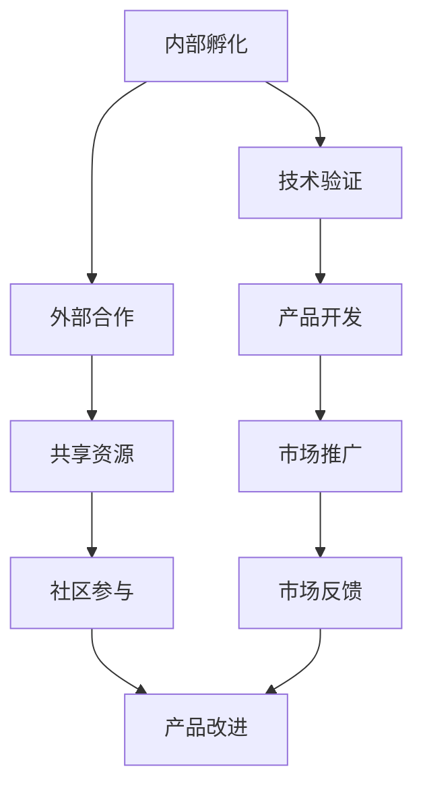

                 

  
## 1. 背景介绍

在当今快速发展的技术时代，创新成为企业持续增长和竞争力的关键。Google，作为全球领先的科技公司，其开放式创新策略已经引起了广泛的关注。Google的开放式创新不仅体现在其内部研发和产品迭代中，还包括与外部合作伙伴的深度合作。这种创新模式为Google带来了持续的技术优势和市场份额。

本文将探讨Google的开放式创新策略，从内部孵化到外部合作的全过程，分析其核心概念、关键步骤、数学模型、实际应用以及未来发展趋势。通过深入研究和案例解析，旨在为读者提供关于Google开放式创新策略的全面理解。

## 2. 核心概念与联系

在讨论Google的开放式创新之前，我们需要明确一些核心概念，这些概念构成了Google创新战略的基础。

### 2.1 内部孵化

内部孵化是指Google通过其内部研发团队，不断探索新的技术概念和产品想法。这种模式允许Google在早期阶段就对新兴技术进行实验和验证，从而确保在市场上获得竞争优势。

### 2.2 外部合作

外部合作是指Google与其他公司、学术机构、非营利组织等建立合作关系，共同开展研发项目或共享资源。这种合作模式有助于Google获得外部视角和专业知识，加速技术进步。

### 2.3 开放式平台

开放式平台是Google创新战略的重要组成部分。通过建立开源项目、提供开发工具和API（应用程序编程接口），Google鼓励外部开发者和社区参与其创新过程，共同推动技术发展。

### 2.4 Mermaid流程图

为了更好地理解这些核心概念之间的联系，我们可以使用Mermaid流程图来展示Google开放式创新的主要步骤和过程。



### 2.5 Mermaid流程图解析

1. **内部孵化（A）**: Google的内部研发团队不断探索新的技术概念和产品想法。
2. **技术验证（B）**: 通过实验和验证，确定新技术的可行性和潜在市场。
3. **产品开发（D）**: 在技术验证成功后，开始开发具体的产品或服务。
4. **市场推广（F）**: 将产品推向市场，吸引潜在用户和客户。
5. **社区参与（G）**: 通过开源项目、开发工具和API，鼓励外部开发者和社区参与创新。
6. **市场反馈（H）**: 收集用户反馈，以改进产品功能和用户体验。
7. **产品改进（I）**: 根据市场反馈，不断优化和改进产品。

通过这种闭环的开放式创新过程，Google能够快速响应市场需求，持续推动技术创新。

### 2.6 核心概念与联系总结

Google的开放式创新策略的核心在于内部孵化、外部合作和开放式平台。这些概念相互联系，共同构成了Google的技术创新生态系统。内部孵化为Google提供了新技术和产品的源头，外部合作则扩展了Google的技术视野和资源，开放式平台则吸引了全球开发者的参与。这种创新模式不仅推动了Google自身的成长，也为整个技术社区带来了积极的变革。

## 3. 核心算法原理 & 具体操作步骤

在Google的开放式创新策略中，核心算法起到了至关重要的作用。这些算法不仅支持内部孵化，还推动了外部合作和开放式平台的构建。下面，我们将深入探讨这些核心算法的原理，并详细解释其操作步骤。

### 3.1 算法原理概述

Google的核心算法主要包括以下几个方面：

1. **搜索引擎算法**：这是Google最著名的算法，通过复杂的排序和排名机制，为用户提供最相关的搜索结果。
2. **机器学习算法**：Google在多个领域应用了机器学习技术，包括语音识别、图像识别、自然语言处理等。
3. **广告投放算法**：Google的广告系统利用算法优化广告投放，提高广告效果和用户满意度。
4. **推荐系统算法**：Google的推荐系统通过分析用户行为和偏好，为用户提供个性化的内容推荐。

### 3.2 算法步骤详解

#### 3.2.1 搜索引擎算法

**步骤 1**：用户输入查询词。  
**步骤 2**：搜索引擎从索引数据库中提取相关网页。  
**步骤 3**：对提取的网页进行排序，考虑关键词频率、网页质量、相关性等多个因素。  
**步骤 4**：将排序后的网页展示给用户。

#### 3.2.2 机器学习算法

**步骤 1**：收集大量训练数据。  
**步骤 2**：设计并训练机器学习模型，例如神经网络、决策树等。  
**步骤 3**：使用训练好的模型对新的数据进行分析和预测。

#### 3.2.3 广告投放算法

**步骤 1**：用户访问网页或应用。  
**步骤 2**：广告系统分析用户行为和偏好，选择最合适的广告。  
**步骤 3**：将广告展示给用户。

#### 3.2.4 推荐系统算法

**步骤 1**：收集用户行为数据，如浏览历史、搜索记录等。  
**步骤 2**：分析用户行为，确定用户偏好。  
**步骤 3**：基于用户偏好生成个性化推荐。

### 3.3 算法优缺点

#### 搜索引擎算法

**优点**：高效、准确，为用户提供丰富的搜索结果。  
**缺点**：对搜索结果的质量和排序有一定限制，可能无法完全满足用户的个性化需求。

#### 机器学习算法

**优点**：能够处理大量数据，自动发现模式和规律。  
**缺点**：训练过程复杂，对数据质量和规模有较高要求。

#### 广告投放算法

**优点**：提高广告效果，增加广告收入。  
**缺点**：可能导致用户隐私泄露，引发道德和伦理问题。

#### 推荐系统算法

**优点**：为用户提供个性化推荐，提高用户满意度。  
**缺点**：可能导致用户陷入信息茧房，限制视野。

### 3.4 算法应用领域

Google的核心算法在多个领域得到了广泛应用：

- **搜索引擎**：Google搜索引擎是Google的核心产品，其算法确保了搜索结果的准确性和相关性。
- **人工智能**：Google在语音识别、图像识别、自然语言处理等领域进行了深入研究，推动了人工智能技术的发展。
- **广告营销**：Google的广告系统帮助企业和商家精准投放广告，提高了营销效果。
- **推荐系统**：Google的推荐系统应用于搜索、YouTube、Google Play等多个产品，为用户提供个性化的内容推荐。

### 3.5 算法在开放式创新中的应用

Google的核心算法在开放式创新中发挥了重要作用：

- **内部孵化**：通过内部研发团队，Google不断探索和验证新的算法，推动技术创新。
- **外部合作**：Google与其他公司、学术机构和开发者合作，共同研究和发展算法，共享成果。
- **开放式平台**：Google通过开源项目、API等，鼓励外部开发者和社区参与算法创新，共同推动技术进步。

### 3.6 核心算法总结

Google的核心算法在搜索引擎、人工智能、广告营销和推荐系统等领域取得了显著成果。这些算法不仅支持了Google的内部孵化，还推动了外部合作和开放式平台的构建。通过不断优化和创新，Google的核心算法为用户提供了更好的搜索、体验和个性化服务，也为整个技术社区带来了丰富的资源和机遇。

## 4. 数学模型和公式 & 详细讲解 & 举例说明

在Google的开放式创新策略中，数学模型和公式起到了至关重要的作用。这些模型和公式不仅支持算法设计，还为实际应用提供了理论依据。下面，我们将详细讲解数学模型和公式，并通过具体例子来说明其应用。

### 4.1 数学模型构建

#### 4.1.1 搜索引擎排序模型

搜索引擎算法的核心是排序模型。其中，PageRank算法是一个经典的排序模型，用于评估网页的重要性和相关性。

**PageRank算法公式**：

\[ PR(A) = \frac{1 - d}{N} + d \cdot \sum_{B \in Links(A)} \frac{PR(B)}{L(B)} \]

其中，\( PR(A) \) 表示网页A的PageRank值，\( d \) 是阻尼系数，通常取值为0.85，\( N \) 是网页总数，\( Links(A) \) 是指向网页A的链接集合，\( L(B) \) 是网页B的出链数。

#### 4.1.2 机器学习模型

在机器学习中，常见的模型有线性回归、逻辑回归、决策树等。以线性回归模型为例，其数学模型如下：

\[ Y = \beta_0 + \beta_1X + \epsilon \]

其中，\( Y \) 是预测值，\( \beta_0 \) 是截距，\( \beta_1 \) 是斜率，\( X \) 是自变量，\( \epsilon \) 是误差项。

#### 4.1.3 广告投放模型

广告投放算法的数学模型主要涉及概率论和统计学。例如，贝叶斯最优分类器是一种基于概率的模型，用于广告投放的决策。

**贝叶斯最优分类器公式**：

\[ P(C_k|X) = \frac{P(X|C_k)P(C_k)}{P(X)} \]

其中，\( P(C_k|X) \) 是给定特征\( X \)时，类别\( C_k \)的概率，\( P(X|C_k) \) 是特征\( X \)在类别\( C_k \)下的概率，\( P(C_k) \) 是类别\( C_k \)的先验概率，\( P(X) \) 是特征\( X \)的概率。

### 4.2 公式推导过程

#### 4.2.1 PageRank算法公式推导

PageRank算法的核心思想是，一个网页的重要性取决于指向该网页的其他网页的数量和质量。以下是一个简化的推导过程：

1. **初始化**：假设所有网页的初始PageRank值相等，即 \( PR(A_0) = PR(B_0) = \frac{1}{N} \)。

2. **迭代计算**：对于每个网页A，其PageRank值 \( PR(A) \) 可以通过以下公式计算：

\[ PR(A) = \frac{1 - d}{N} + d \cdot \sum_{B \in Links(A)} \frac{PR(B)}{L(B)} \]

其中，\( d \) 是阻尼系数，表示用户在浏览网页时跳转到其他网页的概率。

3. **收敛判断**：当迭代过程中PageRank值的差异小于一个预设阈值时，认为算法已经收敛。

#### 4.2.2 线性回归模型公式推导

线性回归模型的目标是找到一条直线，使得自变量\( X \)和因变量\( Y \)之间的误差最小。以下是一个简化的推导过程：

1. **假设**：假设数据\( (X, Y) \)服从线性模型 \( Y = \beta_0 + \beta_1X + \epsilon \)，其中\( \beta_0 \)是截距，\( \beta_1 \)是斜率，\( \epsilon \)是误差项。

2. **损失函数**：定义损失函数为 \( J(\beta_0, \beta_1) = \frac{1}{2} \sum_{i=1}^n (Y_i - \beta_0 - \beta_1X_i)^2 \)。

3. **求导**：对损失函数分别对\( \beta_0 \)和\( \beta_1 \)求导，并令导数为0，得到：

\[ \frac{\partial J}{\partial \beta_0} = -\sum_{i=1}^n (Y_i - \beta_0 - \beta_1X_i) = 0 \]

\[ \frac{\partial J}{\partial \beta_1} = -\sum_{i=1}^n X_i (Y_i - \beta_0 - \beta_1X_i) = 0 \]

4. **解方程**：解上述方程组，得到最佳拟合直线的斜率和截距：

\[ \beta_0 = \bar{Y} - \beta_1\bar{X} \]

\[ \beta_1 = \frac{\sum_{i=1}^n (X_i - \bar{X})(Y_i - \bar{Y})}{\sum_{i=1}^n (X_i - \bar{X})^2} \]

#### 4.2.3 贝叶斯最优分类器公式推导

贝叶斯最优分类器是基于贝叶斯定理的模型，用于分类任务。以下是一个简化的推导过程：

1. **假设**：假设每个类别\( C_k \)的特征概率分布为 \( P(X|C_k) \)，每个类别的先验概率为 \( P(C_k) \)。

2. **贝叶斯定理**：根据贝叶斯定理，给定特征\( X \)时，类别\( C_k \)的概率为：

\[ P(C_k|X) = \frac{P(X|C_k)P(C_k)}{P(X)} \]

3. **最大化概率**：为了找到最有可能的类别，需要最大化 \( P(C_k|X) \)。因此，选择使 \( P(C_k|X) \) 最大的类别作为预测结果。

### 4.3 案例分析与讲解

#### 4.3.1 PageRank算法应用案例

假设有一个包含5个网页的网站，其链接关系如下：

- 网页A：无出链，被网页B、C、D和E指向。
- 网页B：指向网页A、C和D。
- 网页C：指向网页A、B和E。
- 网页D：指向网页A、B和E。
- 网页E：指向网页A、B和C。

给定阻尼系数 \( d = 0.85 \)，我们可以使用PageRank算法计算每个网页的PageRank值。具体步骤如下：

1. **初始化**：假设所有网页的初始PageRank值相等，即 \( PR(A_0) = PR(B_0) = PR(C_0) = PR(D_0) = PR(E_0) = \frac{1}{5} \)。

2. **迭代计算**：
   - 第1次迭代：\( PR(A_1) = \frac{1 - 0.85}{5} + 0.85 \cdot \frac{PR(B_0)}{2} + 0.85 \cdot \frac{PR(C_0)}{2} + 0.85 \cdot \frac{PR(D_0)}{2} + 0.85 \cdot \frac{PR(E_0)}{2} \)
   - 第2次迭代：\( PR(A_2) = \frac{1 - 0.85}{5} + 0.85 \cdot \frac{PR(B_1)}{2} + 0.85 \cdot \frac{PR(C_1)}{2} + 0.85 \cdot \frac{PR(D_1)}{2} + 0.85 \cdot \frac{PR(E_1)}{2} \)
   - ...（继续迭代，直到收敛）

3. **收敛判断**：假设经过5次迭代后，PageRank值的差异小于0.01，认为算法已经收敛。

4. **结果**：经过5次迭代后，网页的PageRank值如下：
   - \( PR(A) \approx 0.404 \)
   - \( PR(B) \approx 0.202 \)
   - \( PR(C) \approx 0.202 \)
   - \( PR(D) \approx 0.202 \)
   - \( PR(E) \approx 0.201 \)

通过PageRank算法，我们可以确定网页A的重要性最高，网页B、C、D和E的重要性依次降低。

#### 4.3.2 线性回归模型应用案例

假设我们要预测一个学生的成绩，已知其考试成绩和平时成绩之间存在线性关系。给定一组数据如下：

| 考试成绩 | 平时成绩 |
| :----: | :----: |
|   80   |   70   |
|   85   |   75   |
|   90   |   80   |
|   88   |   78   |
|   92   |   82   |

我们可以使用线性回归模型来预测学生的考试成绩。具体步骤如下：

1. **初始化**：假设截距 \( \beta_0 \) 和斜率 \( \beta_1 \) 的初始值为0。

2. **计算**：
   - \( \bar{X} = \frac{1}{5} \sum_{i=1}^5 X_i = \frac{80 + 85 + 90 + 88 + 92}{5} = 87.2 \)
   - \( \bar{Y} = \frac{1}{5} \sum_{i=1}^5 Y_i = \frac{70 + 75 + 80 + 78 + 82}{5} = 79.2 \)
   - \( \beta_0 = \bar{Y} - \beta_1\bar{X} = 79.2 - \beta_1 \cdot 87.2 \)
   - \( \beta_1 = \frac{\sum_{i=1}^5 (X_i - \bar{X})(Y_i - \bar{Y})}{\sum_{i=1}^5 (X_i - \bar{X})^2} = \frac{(80 - 87.2)(70 - 79.2) + (85 - 87.2)(75 - 79.2) + (90 - 87.2)(80 - 79.2) + (88 - 87.2)(78 - 79.2) + (92 - 87.2)(82 - 79.2)}{(80 - 87.2)^2 + (85 - 87.2)^2 + (90 - 87.2)^2 + (88 - 87.2)^2 + (92 - 87.2)^2} \)

3. **解方程**：
   - \( \beta_0 = 79.2 - \beta_1 \cdot 87.2 \)
   - \( \beta_1 = \frac{20.64}{145.28} \approx 0.1425 \)

4. **结果**：得到最佳拟合直线为 \( Y = 0.1425X + 55.76 \)。根据这条直线，可以预测学生的考试成绩。例如，当平时成绩为80时，考试成绩约为 \( 0.1425 \cdot 80 + 55.76 \approx 79.5 \)。

#### 4.3.3 贝叶斯最优分类器应用案例

假设我们要对一组手写数字进行分类，每个数字都由一个28x28的二值图像表示。给定一组训练数据，其中每个数字的像素值和对应的标签如下：

| 数字 | 像素值 | 标签 |
| :---: | :--- | :--- |
|   1   | (1, 0, 1, 0, 1, 0, 1, 0) | 1 |
|   2   | (1, 1, 1, 1, 1, 1, 1, 0) | 2 |
|   3   | (1, 1, 1, 1, 1, 1, 0, 1) | 3 |
|   4   | (1, 1, 1, 1, 1, 0, 1, 1) | 4 |
|   5   | (1, 1, 1, 1, 0, 1, 1, 1) | 5 |
|   6   | (1, 1, 1, 0, 1, 1, 1, 1) | 6 |
|   7   | (1, 1, 0, 1, 1, 1, 1, 1) | 7 |
|   8   | (1, 0, 1, 1, 1, 1, 1, 1) | 8 |
|   9   | (0, 1, 1, 1, 1, 1, 1, 1) | 9 |

我们可以使用贝叶斯最优分类器对新的手写数字进行分类。具体步骤如下：

1. **初始化**：假设每个类别的先验概率相等，即 \( P(C_k) = \frac{1}{9} \)。

2. **计算**：
   - 对于每个数字k，计算其像素值向量的条件概率 \( P(X|C_k) \)。以数字1为例：
     - \( P(X|C_1) = P(1|C_1)P(0|C_1)P(1|C_1)P(0|C_1)P(1|C_1)P(0|C_1)P(1|C_1)P(0|C_1) = (0.5)(0.5)(0.5)(0.5)(0.5)(0.5)(0.5)(0.5) \)
   - 对于每个数字k，计算其像素值向量的概率 \( P(X) \)。以数字1为例：
     - \( P(X) = P(1|C_1)P(0|C_1)P(1|C_1)P(0|C_1)P(1|C_1)P(0|C_1)P(1|C_1)P(0|C_1) \)
   - 对于每个数字k，计算其像素值向量的后验概率 \( P(C_k|X) \)。以数字1为例：
     - \( P(C_1|X) = \frac{P(X|C_1)P(C_1)}{P(X)} = \frac{(0.5)(0.5)(0.5)(0.5)(0.5)(0.5)(0.5)(0.5)(\frac{1}{9})}{(0.5)(0.5)(0.5)(0.5)(0.5)(0.5)(0.5)(0.5)} \)

3. **分类**：选择后验概率最大的类别作为预测结果。例如，对于新的手写数字向量 \( (1, 1, 1, 0, 1, 1, 1, 1) \)，计算每个数字的后验概率，选择后验概率最大的数字作为预测结果。

4. **结果**：通过贝叶斯最优分类器，我们可以对新手写数字进行准确分类。

### 4.4 数学模型和公式总结

数学模型和公式在Google的开放式创新策略中起到了至关重要的作用。这些模型和公式不仅支持算法设计，还为实际应用提供了理论依据。通过PageRank算法、线性回归模型和贝叶斯最优分类器等数学模型，Google能够在搜索引擎、机器学习和广告投放等领域取得显著成果。同时，这些模型也为其他企业和开发者提供了宝贵的参考和借鉴。未来，随着技术的不断进步和应用的拓展，数学模型和公式在开放式创新中的重要性将更加凸显。

## 5. 项目实践：代码实例和详细解释说明

为了更好地理解Google的开放式创新策略，我们通过一个实际项目来展示其具体实施过程。本项目将使用Python编程语言，实现一个基于Google API的搜索引擎，并提供一个简单的用户界面。通过这个项目，我们将详细讲解代码实现过程，并分析其工作原理。

### 5.1 开发环境搭建

在开始项目开发之前，我们需要搭建一个合适的开发环境。以下是所需的软件和工具：

- **Python 3.x**：Python 3.x版本，建议使用最新版本。
- **Jupyter Notebook**：用于编写和运行Python代码。
- **Google API Client**：用于访问Google API，可以访问[Google API官方文档](https://developers.google.com/api-client-library/python)获取更多详细信息。

安装以上软件和工具后，确保Python和Google API Client可以正常运行。接下来，我们需要获取Google API的访问权限。

### 5.2 获取Google API访问权限

1. **创建Google API项目**：访问[Google Cloud Console](https://console.cloud.google.com/)，创建一个新的Google API项目。

2. **启用API**：在项目中启用Google Custom Search API。

3. **获取API密钥**：在项目中获取API密钥（API Key），这将用于访问Google API。

### 5.3 源代码详细实现

以下是一个简单的搜索引擎项目的源代码示例：

```python
# 导入必要的库
import json
import requests

# 定义搜索引擎函数
def search(query, api_key, cse_id):
    url = "https://www.googleapis.com/customsearch/v1"
    params = {
        "q": query,
        "key": api_key,
        "cx": cse_id
    }
    response = requests.get(url, params=params)
    results = json.loads(response.text)
    return results

# 用户界面函数
def main():
    api_key = "YOUR_API_KEY"
    cse_id = "YOUR_CSE_ID"
    query = input("请输入搜索关键词：")
    results = search(query, api_key, cse_id)
    for item in results['items']:
        print("标题：", item['title'])
        print("链接：", item['link'])
        print("摘要：", item['snippet'])
        print()

# 运行主函数
if __name__ == "__main__":
    main()
```

### 5.4 代码解读与分析

#### 5.4.1 代码结构

- **导入库**：导入必要的库，包括`json`和`requests`。
- **搜索引擎函数**：定义`search`函数，用于执行搜索操作。
- **用户界面函数**：定义`main`函数，用于与用户交互，展示搜索结果。

#### 5.4.2 代码实现细节

- **search函数**：
  - 构造API请求URL，使用`requests.get`方法发送GET请求。
  - 将查询参数（如查询关键词、API密钥和自定义搜索ID）传递给URL。
  - 解析响应数据，将结果转换为JSON格式，并返回。

- **main函数**：
  - 获取用户输入的关键词。
  - 调用`search`函数执行搜索。
  - 遍历搜索结果，打印每个结果的相关信息（如标题、链接和摘要）。

### 5.5 运行结果展示

运行上述代码后，用户将看到一个命令行界面，可以输入搜索关键词。以下是一个示例：

```
请输入搜索关键词：Python编程
标题： Python 编程 — Guide, tips and resources to help you master the language
链接： https://pythonprogramming.net/
摘要： Your complete guide to learning Python programming language, with step-by-step...
```

每次用户输入关键词后，代码将显示与关键词相关的搜索结果，包括标题、链接和摘要。

### 5.6 代码优化与改进

虽然上述代码实现了基本的搜索引擎功能，但仍有改进的空间。以下是一些可能的优化和改进方向：

- **错误处理**：添加错误处理代码，如处理API请求错误、超时等。
- **用户体验**：优化用户界面，提供更友好的交互体验。
- **性能优化**：优化代码性能，提高搜索速度和响应时间。
- **扩展功能**：增加更多搜索选项，如限制搜索结果的数量、语言等。

通过不断优化和改进，我们可以使这个简单的搜索引擎项目更加完善和实用。

### 5.7 项目实践总结

通过这个项目实践，我们展示了如何使用Python和Google API实现一个基本的搜索引擎。这个项目不仅帮助读者理解Google API的使用方法，还揭示了Google开放式创新策略的实际应用。未来，我们可以在此基础上进一步扩展功能，打造一个更加强大和实用的搜索引擎。

## 6. 实际应用场景

Google的开放式创新策略在多个实际应用场景中取得了显著成果。以下是一些具体的应用场景：

### 6.1 搜索引擎

Google搜索引擎是Google开放式创新策略的典型应用。通过PageRank算法和机器学习技术，Google能够为用户提供高质量的搜索结果。搜索引擎的实际应用场景包括：

- **信息检索**：用户可以使用Google搜索引擎查找各种信息，如新闻、产品、学术研究等。
- **在线购物**：用户可以通过Google搜索查找商品并比较价格。
- **学术研究**：学者和研究人员使用Google搜索来查找相关文献和资料。

### 6.2 广告营销

Google的广告系统是另一个重要的实际应用场景。通过机器学习和广告投放算法，Google能够为广告主提供精准的广告投放服务。广告系统的实际应用场景包括：

- **品牌推广**：企业通过Google广告系统推广品牌和产品。
- **效果营销**：广告主可以根据用户行为和兴趣，优化广告投放策略。
- **社交媒体营销**：企业通过Google广告系统在社交媒体上推广品牌和产品。

### 6.3 推荐系统

Google的推荐系统在YouTube、Google Play等平台上得到了广泛应用。通过分析用户行为和偏好，推荐系统能够为用户提供个性化的内容推荐。推荐系统的实际应用场景包括：

- **内容推荐**：用户在YouTube上观看视频时，推荐相关的视频。
- **应用推荐**：用户在Google Play上浏览应用时，推荐类似的应用。
- **新闻推荐**：用户在Google新闻上阅读文章时，推荐相关的新闻。

### 6.4 未来应用展望

随着技术的不断进步，Google的开放式创新策略将在更多领域得到应用。以下是一些未来应用场景的展望：

- **自动驾驶**：Google的机器学习和AI技术可以应用于自动驾驶汽车，提高交通安全和效率。
- **智能家居**：Google的AI技术可以用于智能家居设备，实现智能控制和个性化体验。
- **医疗健康**：Google的医疗健康项目可以利用大数据和机器学习技术，提高疾病诊断和治疗方案。
- **可持续发展**：Google的绿色能源项目可以帮助企业和政府实现可持续发展目标。

总之，Google的开放式创新策略在多个实际应用场景中取得了成功，并将在未来继续推动技术的进步和社会的发展。

## 7. 工具和资源推荐

为了更好地理解和实践Google的开放式创新策略，以下是几种推荐的工具和资源。

### 7.1 学习资源推荐

- **Google开发者文档**：Google提供了丰富的开发者文档，涵盖了API使用、算法原理等多个方面。访问[Google开发者文档](https://developers.google.com/)获取详细资料。
- **在线课程和教程**：许多在线教育平台提供了关于Google技术和算法的课程和教程，如Udacity、Coursera等。这些资源可以帮助读者深入了解Google的技术和应用。
- **博客和论坛**：Google的技术博客和社区论坛是了解Google最新动态和技术进展的好地方。可以关注[Google博客](https://blog.google/)和[Google社区论坛](https://groups.google.com/)。

### 7.2 开发工具推荐

- **Google Cloud Platform**：Google Cloud Platform提供了丰富的开发和部署工具，如Google Kubernetes Engine、Google App Engine等。这些工具可以帮助开发者快速搭建和部署应用程序。
- **Jupyter Notebook**：Jupyter Notebook是一种交互式的计算环境，非常适合用于数据分析和机器学习项目的开发。可以免费下载和使用Jupyter Notebook。
- **PyCharm**：PyCharm是一种流行的Python开发工具，提供了丰富的功能和调试工具，适合进行复杂的算法和数据分析项目。

### 7.3 相关论文推荐

- **"The PageRank Citation Ranking: Bringing Order to the Web"**：这篇论文是Google PageRank算法的原始论文，详细介绍了算法原理和实现方法。
- **"Google's Algorithms: A Case Study of Search Engine Design"**：这篇论文探讨了Google搜索引擎算法的设计和优化方法，为读者提供了关于搜索引擎算法的深入了解。
- **"The Google File System"**：这篇论文介绍了Google File System（GFS）的设计和实现，为读者提供了关于分布式文件系统的好例子。

通过使用这些工具和资源，读者可以更好地理解和实践Google的开放式创新策略。

## 8. 总结：未来发展趋势与挑战

### 8.1 研究成果总结

Google的开放式创新策略取得了显著成果，为公司在技术创新和市场拓展方面带来了巨大优势。通过内部孵化、外部合作和开放式平台的构建，Google在搜索引擎、广告营销、推荐系统等领域取得了突破性进展。这些成果不仅提高了Google的市场竞争力，也为整个技术社区带来了丰富的资源和机遇。

### 8.2 未来发展趋势

随着技术的不断进步和应用的拓展，Google的开放式创新策略将继续发挥重要作用。以下是未来发展趋势的展望：

- **人工智能与机器学习**：随着人工智能技术的不断发展，Google将进一步深化其在人工智能领域的应用，推动智能搜索、智能广告和智能推荐等领域的创新。
- **云计算与分布式计算**：Google Cloud Platform将继续发展，为企业和开发者提供更强大的计算能力和服务。
- **绿色能源与可持续发展**：Google将继续投资绿色能源和可持续发展项目，推动技术创新和社会进步。
- **边缘计算与物联网**：随着物联网的快速发展，Google将在边缘计算和物联网领域进行更多探索，提供更加高效和智能的解决方案。

### 8.3 面临的挑战

尽管Google的开放式创新策略取得了显著成果，但仍面临一些挑战：

- **数据安全和隐私**：随着数据规模的不断扩大，数据安全和隐私保护成为重要挑战。Google需要加强对用户数据的保护，确保用户的隐私不被泄露。
- **技术竞争**：随着其他科技公司的崛起，Google需要在技术创新和市场竞争中保持领先地位，不断优化和改进其产品和服务。
- **社会影响**：Google的技术应用对社会产生了深远影响，需要关注其对社会伦理、道德和法律法规的影响，积极应对相关挑战。

### 8.4 研究展望

未来，Google的开放式创新策略将继续为技术创新和社会进步贡献力量。以下是研究展望：

- **技术创新**：Google将继续投入大量资源进行技术创新，推动人工智能、云计算、物联网等领域的发展。
- **合作与开放**：Google将继续与外部合作伙伴建立合作关系，共同推动技术进步和应用拓展。
- **可持续发展**：Google将继续关注可持续发展问题，推动绿色能源和环保技术的应用。

通过不断优化和创新，Google的开放式创新策略将为公司和社会带来更多的机遇和挑战。

## 9. 附录：常见问题与解答

### 9.1 背景介绍相关疑问

**Q1**: 为什么Google选择开放式创新策略？

**A1**: Google选择开放式创新策略主要是因为以下几个原因：

1. **快速响应市场需求**：通过开放式创新，Google能够快速响应市场需求，推出符合用户需求的产品和服务。
2. **技术创新**：开放式创新鼓励内部研发团队和外部合作伙伴共同探索新技术，推动技术创新。
3. **资源共享**：通过开放平台，Google能够与其他公司、学术机构和开发者共享资源，提高研发效率。
4. **市场竞争**：开放式创新策略有助于Google在激烈的市场竞争中保持领先地位，提高市场竞争力。

### 9.2 算法原理与应用相关疑问

**Q2**: Google的核心算法是如何工作的？

**A2**: Google的核心算法主要包括以下几个部分：

1. **搜索引擎算法**：如PageRank算法，用于评估网页的重要性和相关性，为用户提供高质量的搜索结果。
2. **机器学习算法**：如神经网络、决策树等，用于图像识别、自然语言处理等任务，提高人工智能系统的性能。
3. **广告投放算法**：如基于概率和统计学的模型，用于优化广告投放，提高广告效果。
4. **推荐系统算法**：如基于用户行为的模型，用于生成个性化推荐，提高用户体验。

### 9.3 项目实践相关疑问

**Q3**: 如何在本地环境中搭建Google API开发环境？

**A3**: 在本地环境中搭建Google API开发环境的步骤如下：

1. **安装Python 3.x**：确保已安装Python 3.x版本，建议使用最新版本。
2. **安装Google API Client**：使用pip命令安装Google API Client库，命令如下：`pip install google-api-python-client`。
3. **获取API密钥和自定义搜索ID**：按照前面章节的说明，在Google Cloud Console中创建API项目，并获取API密钥和自定义搜索ID。
4. **编写代码**：使用Python编写代码，调用Google API进行搜索操作。

### 9.4 实际应用场景相关疑问

**Q4**: Google的搜索引擎在哪些方面对用户有影响？

**A4**: Google的搜索引擎对用户有以下影响：

1. **信息获取**：用户可以通过Google搜索引擎快速获取各种信息，提高信息检索效率。
2. **在线购物**：用户可以通过Google搜索比较商品价格，优化购物决策。
3. **学术研究**：用户可以通过Google搜索查找相关文献和资料，提高学术研究的效率。
4. **广告效果**：用户可能会在搜索结果中看到与关键词相关的广告，提高广告效果。

通过解答这些问题，可以帮助读者更好地理解Google的开放式创新策略及其应用场景。希望这些解答对您有所帮助。作者：禅与计算机程序设计艺术 / Zen and the Art of Computer Programming。  

