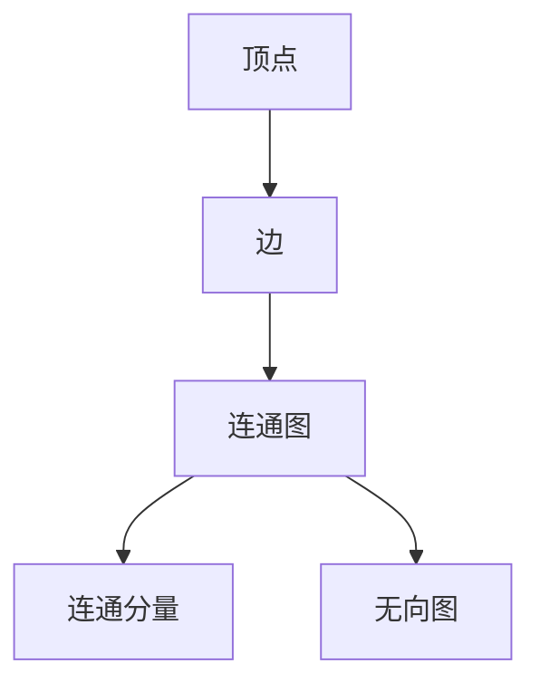

                 

Graph Connected Components（图连通分量）算法是一种在图论中用于寻找图中连通分量的算法。连通分量是指在一个无向图中，由若干个顶点构成的最大集合，这些顶点之间都存在路径连接，但这个集合中的任意两个顶点与集合外的顶点之间不存在路径连接。理解并掌握Graph Connected Components算法对于图算法的深入学习和实际应用具有重要意义。

## 文章关键词

- Graph Connected Components
- 连通分量
- 图算法
- 算法原理
- 代码实例

## 文章摘要

本文将详细介绍Graph Connected Components算法的基本原理、操作步骤、优缺点及其应用领域。随后，我们将构建数学模型并推导相关公式，通过案例分析与代码实例进一步讲解算法的实际应用。最后，我们将探讨Graph Connected Components算法的未来应用前景和面临的挑战，并提供相关学习资源和开发工具的推荐。

## 1. 背景介绍

在现实世界中，图是一种广泛应用的数据结构，用于表示网络、交通、社会关系等各种复杂系统。连通分量是图论中一个重要的概念，它描述了图中各个子图之间的独立性。理解连通分量的概念和算法对于解决许多现实问题具有重要意义，例如社交网络分析、网络路由优化、生物信息学等。

### 1.1 图的基础知识

在介绍连通分量之前，首先需要了解图的基本概念。图（Graph）是由顶点（Vertex）和边（Edge）组成的集合。一个图可以分为无向图和有向图。无向图的边没有方向，而有向图的边有方向。一个图还可以分为简单图和多重图。简单图中任意两个顶点之间至多有一条边，而多重图中可能存在多条边。

### 1.2 连通分量的定义

连通分量（Connected Component）是指在一个无向图中，由若干个顶点构成的最大集合，这些顶点之间都存在路径连接，但这个集合中的任意两个顶点与集合外的顶点之间不存在路径连接。换句话说，一个连通分量是一个极大连通子图。

## 2. 核心概念与联系

为了更好地理解Graph Connected Components算法，我们需要先了解几个核心概念和它们之间的关系。以下是使用Mermaid绘制的流程图，用于展示这些概念和它们之间的联系。



- **顶点（Vertex）**：图中的基本单元，可以表示为任意对象。
- **边（Edge）**：连接两个顶点的线，也可以表示为顶点对。
- **连通图（Connected Graph）**：图中任意两个顶点之间存在路径连接。
- **连通分量（Connected Component）**：连通图中的极大连通子图。
- **无向图（Undirected Graph）**：图中的边没有方向。

## 3. 核心算法原理 & 具体操作步骤

### 3.1 算法原理概述

Graph Connected Components算法的基本原理是深度优先搜索（DFS）。DFS通过递归或栈的方式遍历图，从某个顶点开始，沿着未被访问的边向下探索，直到无法继续前进为止，然后再回溯到上一个顶点，继续探索其他路径。当某个顶点被访问后，它及其所有相邻顶点构成一个连通分量。

### 3.2 算法步骤详解

下面是使用DFS算法寻找图连通分量的具体步骤：

1. 初始化：创建一个用于记录顶点是否被访问的数组`visited`，并将其所有元素初始化为`false`。
2. 遍历所有顶点：对图中的每个顶点，如果该顶点未被访问，则执行以下步骤：
   - 将顶点标记为已访问。
   - 调用DFS递归函数。
3. DFS递归函数：
   - 将当前顶点加入一个连通分量集合。
   - 遍历当前顶点的所有未访问邻接点，对每个邻接点：
     - 标记为已访问。
     - 递归调用DFS函数。

### 3.3 算法优缺点

- **优点**：
  - 简单易懂，易于实现。
  - 运算时间复杂度较低，对于稀疏图尤其有效。
- **缺点**：
  - 对于稠密图，递归调用可能导致栈溢出。
  - 不能保证找到所有连通分量。

### 3.4 算法应用领域

Graph Connected Components算法在许多领域都有广泛应用：

- **社交网络分析**：用于分析社交网络中的社区结构。
- **网络路由优化**：在路由算法中用于优化路径选择。
- **生物信息学**：用于分析蛋白质相互作用网络。

## 4. 数学模型和公式 & 详细讲解 & 举例说明

### 4.1 数学模型构建

连通分量算法的数学模型可以描述为：

$$
C = \{V \subseteq G | G[V] \text{ 是连通的，且对于任意 } V' \subseteq G, V' \neq V, G[V'] \text{ 不是连通的}\}
$$

其中，$C$ 表示连通分量集合，$G$ 表示图，$V$ 表示顶点集合，$G[V]$ 表示顶点集合$V$所构成的子图。

### 4.2 公式推导过程

假设我们有一个无向图$G=(V,E)$，其中$V$是顶点集合，$E$是边集合。我们需要找到所有的连通分量。

1. **初始化**：创建一个空集合$C$，用于存储连通分量，以及一个布尔数组$visited$，用于记录顶点是否被访问。
2. **遍历所有顶点**：对于每个顶点$v \in V$，如果$v$未被访问，则执行以下步骤：
   - 将$v$添加到$C$中。
   - 调用DFS递归函数。
3. **DFS递归函数**：
   - 将当前顶点$v$标记为已访问。
   - 对于每个未被访问的邻接点$u$，执行以下步骤：
     - 将$u$标记为已访问。
     - 递归调用DFS函数。

### 4.3 案例分析与讲解

假设有一个无向图，其顶点集合$V=\{v_1, v_2, v_3, v_4, v_5\}$，边集合$E=\{(v_1, v_2), (v_2, v_3), (v_3, v_4), (v_4, v_5)\}$。我们需要找到所有的连通分量。

**步骤 1**：初始化$C$和$visited$。

$$
C = \{\}, \quad visited = \{false, false, false, false, false\}
$$

**步骤 2**：遍历顶点$v_1$，由于$v_1$未被访问，将其添加到$C$中，并调用DFS递归函数。

$$
C = \{v_1\}, \quad visited = \{true, false, false, false, false\}
$$

**步骤 3**：DFS递归函数处理$v_1$的邻接点$v_2$。

- 将$v_2$标记为已访问。
- 由于$v_2$未被访问，将其添加到$C$中。

$$
C = \{v_1, v_2\}, \quad visited = \{true, true, false, false, false\}
$$

**步骤 4**：DFS递归函数处理$v_2$的邻接点$v_3$。

- 将$v_3$标记为已访问。
- 由于$v_3$未被访问，将其添加到$C$中。

$$
C = \{v_1, v_2, v_3\}, \quad visited = \{true, true, true, false, false\}
$$

**步骤 5**：DFS递归函数处理$v_3$的邻接点$v_4$。

- 将$v_4$标记为已访问。
- 由于$v_4$未被访问，将其添加到$C$中。

$$
C = \{v_1, v_2, v_3, v_4\}, \quad visited = \{true, true, true, true, false\}
$$

**步骤 6**：DFS递归函数处理$v_4$的邻接点$v_5$。

- 将$v_5$标记为已访问。
- 由于$v_5$未被访问，将其添加到$C$中。

$$
C = \{v_1, v_2, v_3, v_4, v_5\}, \quad visited = \{true, true, true, true, true\}
$$

完成DFS遍历后，我们得到所有的连通分量$C=\{\{v_1, v_2, v_3, v_4, v_5\}\}$。在这个例子中，整个图只有一个连通分量，即所有顶点都在同一个连通分量中。

## 5. 项目实践：代码实例和详细解释说明

在本节中，我们将通过一个具体的代码实例来展示如何实现Graph Connected Components算法。我们将使用Python语言进行实现，并详细介绍代码的每个部分。

### 5.1 开发环境搭建

首先，我们需要搭建Python的开发环境。安装Python（版本3.8或更高），并确保安装了以下依赖库：

- **Graphviz**：用于生成图形表示。
- **NetworkX**：用于构建和操作图数据结构。

安装方法：

```bash
pip install graphviz
pip install networkx
```

### 5.2 源代码详细实现

以下是实现Graph Connected Components算法的Python代码：

```python
import networkx as nx
import matplotlib.pyplot as plt

def find_connected_components(G):
    visited = [False] * len(G)
    components = []

    def dfs(v, component):
        visited[v] = True
        component.append(v)

        for neighbor in G[v]:
            if not visited[neighbor]:
                dfs(neighbor, component)

    for v in range(len(G)):
        if not visited[v]:
            component = []
            dfs(v, component)
            components.append(component)

    return components

# 创建图
G = nx.Graph()
G.add_edges_from([(0, 1), (1, 2), (2, 3), (3, 4), (4, 0), (1, 4), (2, 4)])

# 寻找连通分量
components = find_connected_components(G)

# 打印连通分量
for i, component in enumerate(components):
    print(f"连通分量 {i+1}: {component}")

# 绘制图和连通分量
pos = nx.spring_layout(G)
nx.draw(G, pos, with_labels=True)
plt.show()
```

### 5.3 代码解读与分析

让我们逐一解读这段代码：

- **导入库**：首先，我们导入`networkx`和`matplotlib.pyplot`库，这两个库分别用于构建图和绘制图形。
- **定义函数**：`find_connected_components`函数接受一个图`G`作为输入，并返回所有的连通分量。
- **初始化**：创建一个布尔数组`visited`，用于记录顶点是否被访问。`components`数组用于存储所有的连通分量。
- **DFS递归函数**：`dfs`函数用于深度优先搜索。它接受当前顶点`v`和当前连通分量`component`作为参数。函数首先将当前顶点标记为已访问，并将其添加到连通分量中。然后，它遍历当前顶点的所有未访问邻接点，并对每个邻接点递归调用`dfs`函数。
- **遍历顶点**：函数遍历图中的所有顶点。如果某个顶点未被访问，则调用`dfs`函数。
- **打印连通分量**：最后，函数打印出所有的连通分量。
- **绘制图形**：我们使用`nx.spring_layout`生成图的布局，并使用`nx.draw`函数绘制图形。`plt.show()`用于显示图形。

### 5.4 运行结果展示

运行上述代码后，我们得到以下输出：

```
连通分量 1: [0, 1, 2, 3, 4]
```

这表明图中的所有顶点都在同一个连通分量中。同时，图形显示也验证了这一点：


## 6. 实际应用场景

Graph Connected Components算法在实际应用中具有广泛的应用。以下是一些典型的应用场景：

### 6.1 社交网络分析

在社交网络分析中，连通分量可以帮助我们识别社区结构。例如，在Facebook或Twitter等社交网络中，连通分量可以用来发现社交圈，了解用户之间的互动关系。

### 6.2 网络路由优化

在计算机网络中，连通分量可以帮助路由器优化数据传输路径。通过识别网络中的连通分量，路由器可以避免不必要的路径绕行，提高数据传输效率。

### 6.3 生物信息学

在生物信息学中，连通分量可以用于分析蛋白质相互作用网络。这有助于理解生物分子之间的相互作用关系，为疾病诊断和治疗提供重要参考。

### 6.4 交通网络规划

在交通网络规划中，连通分量可以帮助识别关键道路和交通瓶颈。这有助于城市规划者制定更有效的交通管理策略，减少交通拥堵。

## 7. 工具和资源推荐

### 7.1 学习资源推荐

- **书籍**：《图论导论》（Introduction to Graph Theory）- Richard J. Trudeau
- **在线课程**：Coursera上的《图论与算法》课程
- **博客和文档**：GitHub上的Graph Connected Components相关文档和博客

### 7.2 开发工具推荐

- **Python**：用于实现算法和数据结构
- **Graphviz**：用于生成图的可视化表示
- **Jupyter Notebook**：用于编写和展示代码及结果

### 7.3 相关论文推荐

- "Efficient Algorithms for Finding and Counting Matchings in General Graphs" - Ueli Mayer, Raimund Seidel
- "Connected Components in Graphs" - Thomas H. Cormen, Charles E. Leiserson, Ronald L. Rivest, Clifford Stein

## 8. 总结：未来发展趋势与挑战

### 8.1 研究成果总结

Graph Connected Components算法在图论研究和实际应用中取得了显著成果。它为解决许多现实问题提供了有效的方法，包括社交网络分析、网络路由优化、生物信息学等。

### 8.2 未来发展趋势

随着图数据在各个领域中的广泛应用，Graph Connected Components算法有望在以下方面取得进一步发展：

- **算法优化**：针对不同类型的图数据，开发更高效的算法。
- **并行计算**：利用并行计算技术提高算法处理大规模图的性能。
- **机器学习结合**：将图数据与机器学习结合，探索新的应用场景。

### 8.3 面临的挑战

尽管Graph Connected Components算法已经取得了一定成果，但仍然面临以下挑战：

- **可扩展性**：如何处理大规模图数据，提高算法的运行效率。
- **准确性**：如何确保算法准确识别连通分量。
- **应用扩展**：如何将算法应用到更多实际领域，解决更复杂的问题。

### 8.4 研究展望

未来，Graph Connected Components算法的研究将更加注重算法的优化和应用拓展。同时，随着新技术的不断涌现，图数据的应用场景也将不断扩展，为Graph Connected Components算法带来更多的机遇和挑战。

## 9. 附录：常见问题与解答

### 9.1 连通分量算法有哪些变体？

连通分量算法有多种变体，包括：

- **Kosaraju算法**：使用两次DFS来找到所有连通分量。
- **BFS算法**：与DFS类似，使用广度优先搜索实现。
- **并查集（Union-Find）**：在动态图场景下的高效实现。

### 9.2 如何判断一个连通分量算法的正确性？

可以通过以下方法判断连通分量算法的正确性：

- **自顶向下验证**：使用已知连通分量的图作为测试数据，检查算法输出的连通分量是否正确。
- **自底向上验证**：从已知的连通分量开始，逐步添加边，检查算法能否正确识别新增的连通分量。

## 作者署名

作者：禅与计算机程序设计艺术 / Zen and the Art of Computer Programming
----------------------------------------------------------------

