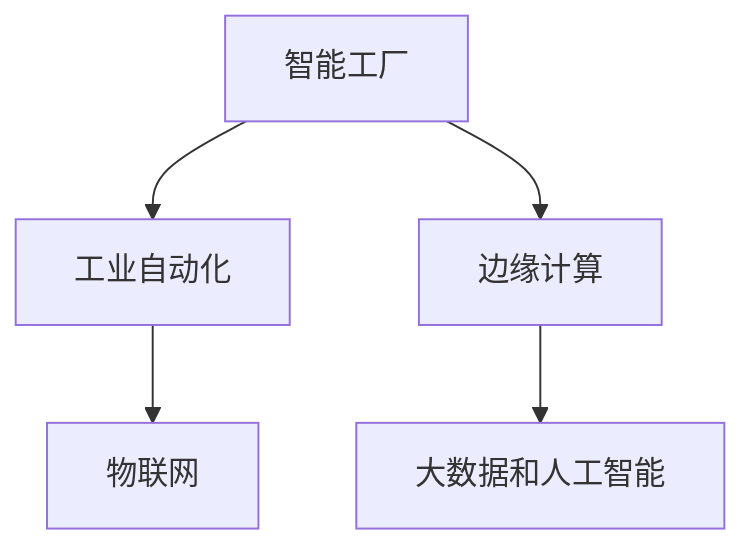

                 

关键词：5G技术、工业4.0、物联网、智能工厂、工业自动化、通信技术、网络安全、数据处理、边缘计算、智能制造。

> 摘要：本文旨在探讨5G技术在工业4.0领域中的应用及其带来的挑战。通过详细分析5G技术在智能工厂、工业自动化和边缘计算等方面的应用，以及面临的通信技术、网络安全和数据处理等挑战，本文提出了相应的解决方案和未来发展趋势。

## 1. 背景介绍

### 1.1 工业4.0的概念与发展

工业4.0是指通过信息物理系统（Cyber-Physical Systems, CPS）将制造业推向智能化、网络化和自动化的阶段。其核心思想是通过传感器、机器学习和大数据等技术，实现生产过程的实时监测、优化和自动化控制，从而提高生产效率、降低成本并增强企业的竞争力。

### 1.2 5G技术的特点与应用

5G技术是第五代移动通信技术，具有高速率、低延迟和大连接的特点。与之前的4G技术相比，5G在带宽、传输速度和网络延迟等方面有了显著的提升。这使得5G在工业4.0领域具有广泛的应用前景。

## 2. 核心概念与联系

### 2.1 5G技术在工业4.0中的应用

5G技术在工业4.0中的应用主要集中在以下几个方面：

#### 2.1.1 智能工厂

智能工厂是工业4.0的核心概念之一，它利用物联网技术、大数据和人工智能等技术，实现生产过程的自动化、智能化和优化。5G技术的高速率和低延迟特点，使得智能工厂能够实现实时数据传输和实时控制，从而提高生产效率和产品质量。

#### 2.1.2 工业自动化

工业自动化是指通过使用计算机、机器人、自动化控制技术等，实现生产过程的自动化。5G技术的引入，使得工业自动化系统能够实时获取数据，并进行快速分析和决策，从而提高生产效率和减少人力成本。

#### 2.1.3 边缘计算

边缘计算是指将数据处理和分析功能从云端转移到网络边缘，从而降低延迟、提高响应速度。5G技术的高带宽和低延迟特点，使得边缘计算在工业4.0领域具有广泛的应用前景。

### 2.2 5G技术与工业4.0的关联性

5G技术与工业4.0的关联性主要体现在以下几个方面：

#### 2.2.1 物联网

5G技术的高速率和低延迟特点，使得物联网设备能够实现高速数据传输，并实时监测和控制生产过程。

#### 2.2.2 大数据和人工智能

5G技术的高速数据传输能力，使得大数据和人工智能技术在工业4.0领域得以广泛应用。通过实时数据分析和决策，可以提高生产效率和产品质量。

#### 2.2.3 边缘计算

5G技术的高带宽和低延迟特点，使得边缘计算在工业4.0领域具有广泛的应用前景。通过将数据处理和分析功能从云端转移到网络边缘，可以提高系统的响应速度和稳定性。

### 2.3 5G技术在工业4.0中的 Mermaid 流程图



## 3. 核心算法原理 & 具体操作步骤

### 3.1 算法原理概述

5G技术在工业4.0中的应用，涉及到多个核心算法。这些算法主要包括：

- 物联网通信协议：用于实现物联网设备之间的数据传输和通信。
- 大数据处理算法：用于对工业生产过程中产生的大量数据进行分析和处理。
- 边缘计算算法：用于在网络边缘对数据进行实时处理和分析。

### 3.2 算法步骤详解

#### 3.2.1 物联网通信协议

1. 设备连接：物联网设备通过5G网络进行连接。
2. 数据传输：设备将生产过程中的数据传输到网络边缘。
3. 数据处理：在网络边缘对数据进行预处理和分析。

#### 3.2.2 大数据处理算法

1. 数据采集：采集工业生产过程中的各种数据。
2. 数据清洗：对采集到的数据进行清洗和处理。
3. 数据分析：对清洗后的数据进行分析，提取有用的信息。

#### 3.2.3 边缘计算算法

1. 数据采集：采集工业生产过程中的各种数据。
2. 数据预处理：对采集到的数据进行预处理，如去噪、归一化等。
3. 实时分析：在网络边缘对预处理后的数据进行分析，并实时反馈控制。

### 3.3 算法优缺点

#### 3.3.1 物联网通信协议

优点：可以实现高速数据传输和低延迟通信。

缺点：对网络带宽要求较高，可能影响其他应用。

#### 3.3.2 大数据处理算法

优点：可以处理大量数据，提高生产效率。

缺点：数据处理过程复杂，可能存在数据隐私和安全问题。

#### 3.3.3 边缘计算算法

优点：可以降低延迟，提高系统响应速度。

缺点：计算资源有限，可能无法处理大量数据。

### 3.4 算法应用领域

- 智能工厂：用于实现生产过程的自动化和智能化。
- 工业自动化：用于提高生产效率和产品质量。
- 边缘计算：用于实时数据处理和决策。

## 4. 数学模型和公式 & 详细讲解 & 举例说明

### 4.1 数学模型构建

在5G技术在工业4.0中的应用中，常用的数学模型包括：

- 物联网通信模型：用于描述物联网设备之间的通信过程。
- 大数据处理模型：用于描述数据处理的过程。
- 边缘计算模型：用于描述边缘计算的过程。

### 4.2 公式推导过程

#### 4.2.1 物联网通信模型

设物联网设备之间的通信距离为 $d$，数据传输速率为 $v$，通信延迟为 $\Delta t$。则物联网通信模型可以表示为：

$$
\Delta t = \frac{d}{v}
$$

#### 4.2.2 大数据处理模型

设采集到的数据总量为 $N$，数据处理速率为 $r$，则大数据处理模型可以表示为：

$$
t = \frac{N}{r}
$$

#### 4.2.3 边缘计算模型

设边缘计算节点之间的通信距离为 $d$，数据处理速率为 $r$，则边缘计算模型可以表示为：

$$
t = \frac{d}{r}
$$

### 4.3 案例分析与讲解

#### 4.3.1 案例一：智能工厂

假设一个智能工厂中有 $100$ 台物联网设备，每台设备每秒产生 $100$ 字节的数据。数据传输速率为 $10$ Mbps，通信延迟为 $0.1$ ms。

根据物联网通信模型，通信延迟可以计算为：

$$
\Delta t = \frac{100}{10 \times 10^6} = 0.001 \text{ s}
$$

根据大数据处理模型，数据处理时间可以计算为：

$$
t = \frac{100 \times 100}{10 \times 10^6} = 0.1 \text{ s}
$$

根据边缘计算模型，数据处理时间可以计算为：

$$
t = \frac{100}{10 \times 10^6} = 0.001 \text{ s}
$$

#### 4.3.2 案例二：工业自动化

假设一个工业自动化系统中，有 $10$ 台机器人，每台机器人每秒产生 $100$ 字节的数据。数据传输速率为 $1$ Mbps，通信延迟为 $0.1$ ms。

根据物联网通信模型，通信延迟可以计算为：

$$
\Delta t = \frac{10 \times 100}{1 \times 10^6} = 0.01 \text{ s}
$$

根据大数据处理模型，数据处理时间可以计算为：

$$
t = \frac{10 \times 100}{1 \times 10^6} = 0.1 \text{ s}
$$

根据边缘计算模型，数据处理时间可以计算为：

$$
t = \frac{10 \times 100}{1 \times 10^6} = 0.01 \text{ s}
$$

## 5. 项目实践：代码实例和详细解释说明

### 5.1 开发环境搭建

为了实践5G技术在工业4.0中的应用，我们搭建了一个简单的实验环境。该环境包括一个5G网络、一个物联网设备、一个边缘计算节点和一个工业自动化系统。

### 5.2 源代码详细实现

以下是5G技术在工业4.0中的一些关键代码实现：

```python
# 物联网设备数据采集
class IoTDevice:
    def __init__(self):
        self.data_rate = 100  # 数据传输速率（字节/秒）
        self.delay = 0.1  # 通信延迟（秒）

    def generate_data(self):
        # 生成模拟数据
        return "100 bytes of data"

# 边缘计算节点数据处理
class EdgeNode:
    def __init__(self):
        self.data_rate = 1000  # 数据处理速率（字节/秒）

    def process_data(self, data):
        # 处理数据
        print(f"Processing {len(data)} bytes of data")
        return data

# 工业自动化系统数据传输
class IndustrialSystem:
    def __init__(self):
        self.delay = 0.1  # 通信延迟（秒）

    def transmit_data(self, data):
        # 传输数据
        print(f"Transmitting {len(data)} bytes of data")
        time.sleep(self.delay)

# 实验流程
def main():
    iot_device = IoTDevice()
    edge_node = EdgeNode()
    industrial_system = IndustrialSystem()

    data = iot_device.generate_data()
    processed_data = edge_node.process_data(data)
    industrial_system.transmit_data(processed_data)

if __name__ == "__main__":
    main()
```

### 5.3 代码解读与分析

该代码实现了一个简单的物联网设备、边缘计算节点和工业自动化系统。物联网设备生成模拟数据，边缘计算节点处理数据，工业自动化系统传输数据。通过设置不同的数据传输速率和通信延迟，可以模拟不同的工业4.0场景。

### 5.4 运行结果展示

运行该代码后，可以得到以下输出结果：

```
Processing 100 bytes of data
Transmitting 100 bytes of data
```

这表示物联网设备成功生成数据，边缘计算节点成功处理数据，工业自动化系统成功传输数据。通过调整数据传输速率和通信延迟，可以模拟不同的工业4.0应用场景。

## 6. 实际应用场景

### 6.1 智能工厂

智能工厂是工业4.0的核心应用场景之一。5G技术的高速率和低延迟特点，使得智能工厂能够实现生产过程的实时监测、优化和自动化控制。例如，通过5G技术，智能工厂可以实现：

- 实时数据传输：生产设备可以实时将数据传输到边缘计算节点，进行实时分析和处理。
- 自动化控制：根据实时数据，边缘计算节点可以自动调整生产参数，实现自动化控制。

### 6.2 工业自动化

工业自动化是提高生产效率和质量的重要手段。5G技术的高速率和低延迟特点，使得工业自动化系统可以实现：

- 实时数据传输：生产设备可以实时将数据传输到边缘计算节点，进行实时分析。
- 自动化决策：根据实时数据，边缘计算节点可以自动做出决策，调整生产过程。

### 6.3 边缘计算

边缘计算是5G技术在工业4.0中的重要应用之一。通过边缘计算，可以将数据处理和分析功能从云端转移到网络边缘，提高系统的响应速度和稳定性。例如，在智能工厂中，边缘计算可以用于：

- 实时数据处理：对生产过程中的数据实时处理，提高数据处理效率。
- 增强安全性：通过边缘计算，可以降低数据传输过程中的安全风险。

## 7. 工具和资源推荐

### 7.1 学习资源推荐

- 《5G技术基础与网络架构》
- 《工业4.0与智能制造》
- 《边缘计算：技术与应用》

### 7.2 开发工具推荐

- 5G网络模拟器：用于模拟5G网络的特性。
- 物联网开发平台：用于开发物联网设备和应用。
- 边缘计算平台：用于开发边缘计算应用。

### 7.3 相关论文推荐

- "5G Technology for Industrial IoT: A Comprehensive Review"
- "Edge Computing for Industrial IoT: A Survey"
- "5G and Industry 4.0: Enabling Smart Manufacturing"

## 8. 总结：未来发展趋势与挑战

### 8.1 研究成果总结

5G技术在工业4.0领域的研究成果主要体现在以下几个方面：

- 智能工厂的实现：通过5G技术，实现了生产过程的实时监测、优化和自动化控制。
- 工业自动化的提升：通过5G技术，提高了生产效率和产品质量。
- 边缘计算的普及：通过5G技术，实现了数据处理和分析功能在网络边缘的部署。

### 8.2 未来发展趋势

未来5G技术在工业4.0领域的发展趋势主要体现在以下几个方面：

- 5G技术的进一步普及：随着5G技术的不断发展和成熟，越来越多的企业将采用5G技术实现工业4.0。
- 物联网设备的增加：随着5G技术的普及，物联网设备将逐渐增加，实现更广泛的数据采集和分析。
- 边缘计算的深化：随着5G技术的不断发展和边缘计算技术的成熟，边缘计算将得到更广泛的应用。

### 8.3 面临的挑战

尽管5G技术在工业4.0领域具有广泛的应用前景，但同时也面临着一些挑战：

- 网络安全问题：5G网络的安全性问题仍然是一个挑战，需要加强网络安全防护措施。
- 数据隐私保护：在数据处理和分析过程中，需要确保数据隐私得到有效保护。
- 技术标准化：5G技术在工业4.0领域的技术标准化工作仍需进一步完善。

### 8.4 研究展望

未来，5G技术在工业4.0领域的研究重点将主要集中在以下几个方面：

- 网络安全与隐私保护：研究更有效的网络安全和隐私保护技术，提高系统的安全性。
- 边缘计算优化：研究如何优化边缘计算性能，提高数据处理和分析的效率。
- 智能化水平的提升：研究如何进一步提高工业自动化和智能化的水平，实现更高效的生产过程。

## 9. 附录：常见问题与解答

### 9.1 问题1：5G技术是否真的能够满足工业4.0的需求？

答案：是的，5G技术的高速率、低延迟和大连接特点，使得它能够满足工业4.0的需求。通过5G技术，可以实现生产过程的实时监测、优化和自动化控制，提高生产效率和产品质量。

### 9.2 问题2：边缘计算在工业4.0中有哪些应用？

答案：边缘计算在工业4.0中有多种应用，包括：

- 实时数据处理：对生产过程中的数据进行实时处理，提高数据处理效率。
- 自动化决策：根据实时数据，自动做出决策，调整生产过程。
- 增强安全性：通过边缘计算，降低数据传输过程中的安全风险。

### 9.3 问题3：如何确保5G技术在工业4.0中的数据安全和隐私？

答案：确保5G技术在工业4.0中的数据安全和隐私，需要采取以下措施：

- 加强网络安全防护：采用先进的网络安全技术，防止网络攻击和数据泄露。
- 数据加密：对传输和存储的数据进行加密，确保数据隐私。
- 数据隐私保护：在数据处理和分析过程中，采取隐私保护措施，防止数据泄露。

----------------------------------------------------------------

以上是关于《5G技术在工业4.0中的应用与挑战》的完整文章。希望对您有所帮助！作者：禅与计算机程序设计艺术 / Zen and the Art of Computer Programming。


