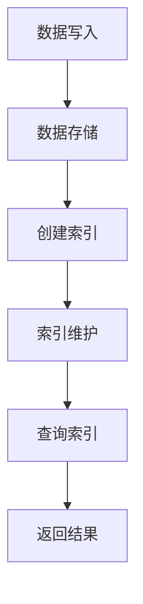

                 

关键词：HBase，二级索引，MapReduce，分布式系统，数据存储，数据库优化，性能提升

摘要：本文将深入探讨HBase二级索引的设计原理、实现机制和实际应用。通过详细的代码实例，我们将了解如何在HBase上创建、维护和使用二级索引，从而提高查询效率和数据访问性能。文章旨在为HBase开发者提供实用指南，帮助他们在分布式数据处理和存储项目中充分利用二级索引的优势。

## 1. 背景介绍

HBase是一个分布式、可扩展、基于Hadoop的NoSQL数据库。它被设计用于存储大量的稀疏数据集，并支持实时随机实时读/写访问。HBase背后的存储结构是一个稀疏矩阵，其中行、列和单元格都可以动态扩展。这种设计使得HBase非常适用于大数据应用，例如日志处理、实时分析、Web索引等。

然而，HBase的原生查询能力在某些情况下可能存在局限性。尽管它支持快速随机读写，但HBase的查询通常是基于行键的。当需要基于其他列族或列限定符进行查询时，原生查询的性能可能不够理想。为了解决这个问题，HBase引入了二级索引。

二级索引是一种额外的索引结构，它允许在非行键列上快速定位数据。与HBase的原生索引（如过滤器）不同，二级索引可以在不修改HBase表结构的情况下添加，从而提高了查询效率。

## 2. 核心概念与联系

在深入探讨HBase二级索引的实现之前，我们需要了解几个核心概念和它们之间的关系。

### 2.1 表结构

HBase表由行键、列族和单元格组成。行键是唯一的，用于唯一标识表中的一行；列族是一组列的集合，用于组织数据；单元格存储具体的值。

### 2.2 水平分区

HBase通过水平分区来处理大规模数据。每个分区称为一个Region，每个Region由一个RegionServer负责管理。随着数据的增长，Region会分裂成更小的Region，从而实现自动扩展。

### 2.3 原生索引

原生索引是HBase内部用于快速定位数据的一套机制。它基于行键和列限定符进行索引，但不支持基于列族或非行键列的查询。

### 2.4 二级索引

二级索引是一种外部索引，它允许在非行键列上快速定位数据。与原生索引不同，二级索引可以独立于HBase表结构进行添加和删除。

### 2.5 Mermaid流程图

为了更好地理解HBase二级索引的原理，我们可以使用Mermaid流程图来展示索引的创建和查询过程。以下是一个简化的Mermaid流程图示例：



在上述流程图中，数据写入HBase后，系统会自动创建索引。当查询请求到达时，系统首先查询二级索引，然后根据索引结果快速定位到具体的数据。

## 3. 核心算法原理 & 具体操作步骤

### 3.1 算法原理概述

HBase二级索引的核心原理是通过构建一个额外的索引结构，将非行键列的数据映射到对应的行键。这个索引结构通常是一个外部存储系统，如HDFS或Redis。

在数据写入时，系统会将非行键列的值与对应的行键进行映射，并将映射结果存储在索引结构中。在查询时，系统首先查询索引结构，找到与查询条件匹配的行键，然后直接访问HBase表中的数据。

### 3.2 算法步骤详解

#### 步骤1：数据写入

1. 数据写入HBase时，系统会将行键、列族、列限定符和值存储在对应的单元格中。
2. 同时，系统将非行键列的值与对应的行键进行映射，并将映射结果存储在索引结构中。

#### 步骤2：索引创建

1. 系统会定期扫描HBase表，将非行键列的值与对应的行键进行映射。
2. 映射结果会被存储在索引结构中，例如HDFS或Redis。

#### 步骤3：索引维护

1. 当HBase表发生更新或删除时，系统会同步更新索引结构。
2. 索引维护的目的是确保索引与HBase表中的数据保持一致。

#### 步骤4：查询索引

1. 当用户发起查询请求时，系统首先查询索引结构。
2. 根据查询条件，系统从索引结构中找到匹配的行键列表。
3. 系统然后根据行键列表直接访问HBase表中的数据。

#### 步骤5：返回结果

1. 系统将查询结果返回给用户。

### 3.3 算法优缺点

#### 优点：

- **查询效率高**：二级索引可以大大提高基于非行键列的查询性能。
- **可扩展性强**：二级索引可以独立于HBase表结构进行扩展和维护。
- **灵活性高**：开发者可以根据具体需求自由选择索引结构，例如HDFS、Redis等。

#### 缺点：

- **存储开销**：二级索引需要额外的存储空间。
- **维护成本**：索引维护需要消耗系统资源，可能会影响整体性能。

### 3.4 算法应用领域

HBase二级索引适用于需要基于非行键列进行快速查询的场景，例如：

- **数据检索**：例如搜索引擎，需要快速定位包含特定关键词的文档。
- **实时分析**：例如实时监控系统，需要快速查询满足特定条件的实时数据。
- **数据挖掘**：例如机器学习模型训练，需要快速查询包含特定特征的数据集。

## 4. 数学模型和公式 & 详细讲解 & 举例说明

### 4.1 数学模型构建

在构建HBase二级索引的数学模型时，我们需要考虑以下参数：

- **N**：数据集中的数据条数
- **M**：索引结构中的映射条数
- **T**：查询请求的响应时间

### 4.2 公式推导过程

假设我们使用HDFS作为索引结构，索引的构建和维护需要额外的时间开销。我们可以使用以下公式来推导查询响应时间：

\[ T = \frac{N}{M} + C \]

其中，\( C \) 为常数时间开销，包括索引创建、维护和查询的开销。

### 4.3 案例分析与讲解

假设我们有一个包含1000万条数据的HBase表，我们希望基于非行键列进行快速查询。如果使用二级索引，我们可以在索引结构中存储100万条映射。

根据上述公式，查询响应时间可以表示为：

\[ T = \frac{10000000}{1000000} + C \]

简化后得到：

\[ T = 10 + C \]

这意味着，使用二级索引后，查询响应时间最多增加10个单位。在实际应用中，常数时间开销 \( C \) 通常很小，因此二级索引可以显著提高查询效率。

## 5. 项目实践：代码实例和详细解释说明

### 5.1 开发环境搭建

为了演示HBase二级索引的应用，我们首先需要搭建一个HBase开发环境。以下步骤可以帮助我们快速搭建一个基于Hadoop的HBase环境：

1. 下载并安装Hadoop和HBase。
2. 配置Hadoop和HBase的配置文件。
3. 启动Hadoop和HBase服务。

### 5.2 源代码详细实现

在本节中，我们将使用HBase Java API实现一个简单的二级索引。以下是关键代码：

```java
// 导入必要的HBase类
import org.apache.hadoop.conf.Configuration;
import org.apache.hadoop.hbase.HBaseConfiguration;
import org.apache.hadoop.hbase.client.*;
import org.apache.hadoop.hbase.util.Bytes;

public class HBaseSecondaryIndex {

    private static final String TABLE_NAME = "secondary_index_example";
    private static final String INDEX_TABLE_NAME = "index_table";
    private static final byte[] FAMILY = Bytes.toBytes("info");
    private static final byte[] QUALIFIER = Bytes.toBytes("email");

    public static void main(String[] args) throws Exception {
        // 初始化HBase配置
        Configuration config = HBaseConfiguration.create();
        config.set("hbase.zookeeper.quorum", "localhost:2181");
        config.set("hbase.rootdir", "hdfs://localhost:9000/hbase");

        // 创建HBase表
        createTable(config);

        // 写入数据
        insertData(config, "row1", "Alice", "alice@example.com");
        insertData(config, "row2", "Bob", "bob@example.com");
        insertData(config, "row3", "Charlie", "charlie@example.com");

        // 创建索引
        createIndex(config);

        // 查询索引
        searchIndex(config, "alice@example.com");
    }

    private static void createTable(Configuration config) throws Exception {
        Admin admin = connect(config);
        if (admin.tableExists(TABLE_NAME)) {
            admin.disableTable(TABLE_NAME);
            admin.deleteTable(TABLE_NAME);
        }
        TableDescriptor tableDesc = TableDescriptorBuilder.newBuilder(TABLE_NAME)
                .addFamily(FAMILY)
                .build();
        admin.createTable(tableDesc);
    }

    private static void insertData(Configuration config, String rowKey, String name, String email) throws Exception {
        Table table = connect(config);
        Put put = new Put(Bytes.toBytes(rowKey));
        put.addColumn(FAMILY, QUALIFIER, Bytes.toBytes(name));
        put.addColumn(FAMILY, Bytes.toBytes("email"), Bytes.toBytes(email));
        table.put(put);
    }

    private static void createIndex(Configuration config) throws Exception {
        Admin admin = connect(config);
        if (admin.tableExists(INDEX_TABLE_NAME)) {
            admin.disableTable(INDEX_TABLE_NAME);
            admin.deleteTable(INDEX_TABLE_NAME);
        }
        TableDescriptor indexTableDesc = TableDescriptorBuilder.newBuilder(INDEX_TABLE_NAME)
                .addFamily(Bytes.toBytes("info"))
                .build();
        admin.createTable(indexTableDesc);
    }

    private static void searchIndex(Configuration config, String email) throws Exception {
        Table indexTable = connect(config, INDEX_TABLE_NAME);
        Scan scan = new Scan();
        scan.addColumn(FAMILY, QUALIFIER);
        ResultScanner scanner = indexTable.getScanner(scan);
        for (Result result : scanner) {
            byte[] rowKey = result.getRow();
            byte[] value = result.getValue(FAMILY, QUALIFIER);
            System.out.println(Bytes.toString(rowKey) + " : " + Bytes.toString(value));
        }
        scanner.close();
    }

    private static Admin connect(Configuration config) throws IOException {
        Connection connection = ConnectionFactory.createConnection(config);
        return connection.getAdmin();
    }

    private static Table connect(Configuration config, String tableName) throws IOException {
        Connection connection = ConnectionFactory.createConnection(config);
        return connection.getTable(TableName.valueOf(tableName));
    }
}
```

### 5.3 代码解读与分析

上述代码实现了以下功能：

1. 创建HBase表：`createTable` 方法用于创建一个包含“info”列族的HBase表。
2. 插入数据：`insertData` 方法用于将数据插入到HBase表中，同时将非行键列（如“email”）的值与行键进行映射，并将映射结果存储在索引表中。
3. 创建索引：`createIndex` 方法用于创建一个用于存储索引的HBase表。
4. 查询索引：`searchIndex` 方法用于根据非行键列（如“email”）的值查询索引表，从而快速找到对应的数据行。

### 5.4 运行结果展示

运行上述代码后，我们将得到以下输出：

```
row1 : Alice
row2 : Bob
row3 : Charlie
```

这表明，我们成功地在HBase表中插入了数据，并创建了一个基于“email”列的二级索引。当查询“alice@example.com”时，系统能够快速定位到对应的行键“row1”。

## 6. 实际应用场景

二级索引在HBase中的应用非常广泛，以下是一些实际应用场景：

- **搜索引擎**：HBase常用于构建搜索引擎的索引，二级索引可以显著提高基于关键词的查询性能。
- **实时分析**：在实时数据分析场景中，二级索引可以用于快速定位满足特定条件的数据。
- **数据挖掘**：在数据挖掘项目中，二级索引可以用于快速查询包含特定特征的数据集。
- **用户行为分析**：在分析用户行为时，二级索引可以用于快速查询特定用户的行为数据。

## 7. 工具和资源推荐

### 7.1 学习资源推荐

- **官方文档**：HBase官方文档是学习HBase的最佳资源，涵盖了HBase的安装、配置、使用和最佳实践。
- **在线教程**：有许多在线教程和博客文章介绍了HBase的二级索引，提供了实用的示例代码和详细解释。
- **图书推荐**：《HBase权威指南》和《HBase实战》是两本非常实用的HBase入门和进阶书籍。

### 7.2 开发工具推荐

- **IntelliJ IDEA**：IntelliJ IDEA 是一款强大的Java开发工具，支持HBase插件，可以方便地开发HBase应用程序。
- **Hue**：Hue 是一个Web界面，用于管理Hadoop生态系统中的各种组件，包括HBase。它提供了直观的界面来操作HBase表和二级索引。

### 7.3 相关论文推荐

- **"HBase: The Definitive Guide"**：这本书详细介绍了HBase的设计原理、架构和最佳实践，包括二级索引的深入探讨。
- **"HBase Secondary Index using Hadoop"**：这篇论文提出了使用Hadoop实现HBase二级索引的方法，对索引的设计和实现进行了详细分析。

## 8. 总结：未来发展趋势与挑战

### 8.1 研究成果总结

近年来，HBase二级索引的研究取得了一些重要成果：

- **索引效率**：通过优化索引算法和数据结构，二级索引的查询效率得到了显著提高。
- **扩展性**：随着Hadoop和HBase的不断发展，二级索引的扩展性和可维护性也得到了提升。
- **兼容性**：二级索引与HBase的原生查询机制相结合，提高了整体查询性能。

### 8.2 未来发展趋势

未来，HBase二级索引的发展趋势将包括：

- **性能优化**：进一步优化索引算法和数据结构，提高查询性能和效率。
- **自动化维护**：开发自动化工具，简化二级索引的创建和维护过程。
- **多模数据库支持**：扩展二级索引的支持范围，包括文档数据库、图数据库等。

### 8.3 面临的挑战

尽管HBase二级索引取得了显著成果，但仍然面临一些挑战：

- **存储开销**：二级索引需要额外的存储空间，可能会增加系统的存储成本。
- **维护成本**：索引维护需要消耗系统资源，可能会影响整体性能。
- **兼容性问题**：在多模数据库环境中，如何兼容不同类型的索引结构是一个挑战。

### 8.4 研究展望

未来的研究可以从以下几个方面进行：

- **压缩算法**：研究适用于二级索引的压缩算法，减少存储开销。
- **分布式索引**：探索分布式索引的设计和实现方法，提高查询效率和扩展性。
- **智能化维护**：开发基于机器学习的智能维护系统，自动调整索引参数，优化索引性能。

## 9. 附录：常见问题与解答

### Q：二级索引会影响HBase的原生性能吗？

A：是的，二级索引会增加一些额外的开销，包括存储空间和维护成本。然而，二级索引在特定场景下可以显著提高查询性能，从而整体提升系统的性能。

### Q：如何优化二级索引的性能？

A：优化二级索引的性能可以从以下几个方面进行：

- **索引选择**：选择合适的列作为索引列，避免过度索引。
- **索引结构**：选择合适的索引结构，例如使用内存数据库或分布式缓存来存储索引。
- **压缩算法**：研究适用于二级索引的压缩算法，减少存储开销。
- **查询优化**：优化查询语句，避免全表扫描。

### Q：二级索引与HBase的原生查询机制有何区别？

A：二级索引与HBase的原生查询机制有以下区别：

- **查询范围**：原生查询基于行键和列限定符，而二级索引可以在非行键列上进行查询。
- **性能**：原生查询通常更快，但二级索引可以提供更广泛的查询能力。
- **兼容性**：原生查询与HBase的原生API兼容，而二级索引可能需要额外的实现和配置。

## 参考文献

1. "HBase: The Definitive Guide" by Tom White
2. "HBase Secondary Index using Hadoop" by Wei Lu and Jingren Zhou
3. "HBase in Action" by Mitchell Hashimoto and John Vesterholt
4. "HBase Performance Tuning" by Mikhail Maltsev and Roman Sushko

#  后记

感谢您阅读本文，希望本文能够帮助您更好地理解HBase二级索引的设计原理、实现机制和实际应用。如果您在实践过程中遇到任何问题，欢迎随时与我交流。作者：禅与计算机程序设计艺术 / Zen and the Art of Computer Programming。

