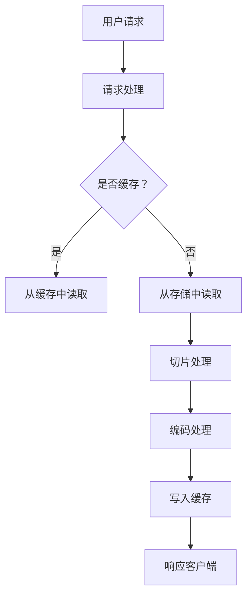

                 

关键词：HLS流媒体，服务器优化，性能提升，资源管理，技术细节，案例分析

> 摘要：本文旨在探讨HLS流媒体服务器优化的方法与策略，通过对核心概念、算法原理、数学模型、实践案例的深入分析，为开发者提供一套系统化的优化方案，以提高服务器性能和用户体验。

## 1. 背景介绍

随着互联网的快速发展，流媒体服务已经深入到我们日常生活的各个方面。从视频网站到直播平台，从在线教育到智能家居，流媒体服务无处不在。然而，随着用户数量的增加和内容种类的丰富，流媒体服务器的压力也越来越大。如何优化HLS流媒体服务器，提高其性能和稳定性，成为开发者面临的一大挑战。

HLS（HTTP Live Streaming）是一种常见的流媒体传输协议，它允许服务器将视频内容分成多个小块，并以HTTP请求的方式向客户端传输。这种协议的优势在于其兼容性好、部署简单、易于扩展。然而，随着用户对画质和流畅度的要求越来越高，HLS服务器的优化成为了一个亟待解决的问题。

本文将围绕HLS流媒体服务器的优化，从核心概念、算法原理、数学模型、实践案例等多个角度进行分析，为开发者提供一套完整的优化方案。

## 2. 核心概念与联系

在讨论HLS流媒体服务器的优化之前，我们需要先了解一些核心概念，以及它们之间的联系。

### 2.1 流媒体技术概述

流媒体技术是一种将大量数据流化传输的技术，它允许用户在不完全下载整个文件的情况下观看视频。流媒体技术分为实时流媒体和点播流媒体两种。实时流媒体通常用于直播、视频会议等场景，而点播流媒体则用于视频点播、在线教育等场景。

### 2.2 HLS协议原理

HLS协议是一种基于HTTP的流媒体传输协议，它通过将视频内容分割成小块（通常为TS文件），并以HTTP请求的方式向客户端传输。客户端可以根据网络状况和设备性能，选择合适的视频质量进行观看。

### 2.3 流媒体服务器架构

流媒体服务器通常包括三个主要组成部分：媒体文件存储、媒体处理和分发。媒体文件存储负责存储视频内容；媒体处理负责对视频进行编码、切片等操作；分发负责将处理后的视频内容以HTTP请求的方式发送给客户端。

### 2.4 Mermaid流程图

下面是一个简化的HLS流媒体服务器流程图，用于描述HLS协议的工作原理。



## 3. 核心算法原理 & 具体操作步骤

### 3.1 算法原理概述

HLS流媒体服务器的优化主要涉及以下几个方面：

- **资源管理**：合理分配服务器资源，确保服务器在高并发情况下依然能够稳定运行。
- **缓存策略**：优化缓存机制，提高数据访问速度，减少服务器负担。
- **负载均衡**：通过负载均衡技术，将流量分散到多台服务器上，避免单点故障。
- **动态调整**：根据用户行为和网络状况，动态调整视频质量，提高用户体验。

### 3.2 算法步骤详解

#### 3.2.1 资源管理

1. **CPU资源管理**：通过限制CPU使用率，避免服务器过载。
2. **内存管理**：合理分配内存，避免内存泄漏和溢出。
3. **网络资源管理**：优化网络配置，提高数据传输速度。

#### 3.2.2 缓存策略

1. **缓存预热**：在用户访问高峰期，提前将热点数据加载到缓存中。
2. **缓存替换策略**：根据访问频率和访问时间，动态调整缓存内容。
3. **缓存一致性**：确保缓存数据和原始数据的一致性，避免数据不一致导致的问题。

#### 3.2.3 负载均衡

1. **轮询算法**：将请求轮流分配给不同的服务器。
2. **最少连接数算法**：将请求分配给连接数最少的服务器。
3. **权重算法**：根据服务器的性能和负载情况，动态调整服务器的权重。

#### 3.2.4 动态调整

1. **用户行为分析**：根据用户的播放记录，预测用户可能的操作。
2. **网络状况监测**：实时监测网络状况，根据带宽和延迟动态调整视频质量。
3. **质量自适应**：根据用户设备的性能和网络状况，自适应调整视频质量。

### 3.3 算法优缺点

#### 优点：

- **高效性**：通过合理分配资源、优化缓存策略、负载均衡和动态调整，可以显著提高服务器性能和用户体验。
- **灵活性**：可以根据不同的场景和需求，灵活调整优化策略。

#### 缺点：

- **复杂性**：需要综合考虑多个因素，设计复杂的优化算法。
- **成本**：优化过程可能需要投入一定的成本，包括硬件、软件和人力等。

### 3.4 算法应用领域

HLS流媒体服务器优化算法可以广泛应用于各种场景，包括：

- **视频网站**：优化视频播放性能，提高用户体验。
- **直播平台**：保证直播的流畅性，降低延迟。
- **在线教育**：提高教学视频的播放质量，保障教学效果。
- **智能家居**：优化视频监控系统的性能，提高安防效果。

## 4. 数学模型和公式 & 详细讲解 & 举例说明

### 4.1 数学模型构建

为了更好地理解和优化HLS流媒体服务器，我们需要构建一些数学模型来描述其性能和用户体验。

#### 4.1.1 响应时间模型

响应时间（Response Time，RT）是衡量服务器性能的一个重要指标，它反映了服务器处理请求所需的时间。假设服务器处理请求的平均时间为 $T$，则响应时间模型可以表示为：

$$
RT = T + \frac{N}{C}
$$

其中，$N$ 为服务器队列中的请求数量，$C$ 为服务器的处理能力。

#### 4.1.2 带宽利用率模型

带宽利用率（Bandwidth Utilization，BU）是衡量服务器带宽利用程度的一个指标，它反映了服务器带宽的使用情况。假设服务器的总带宽为 $B$，当前带宽使用量为 $U$，则带宽利用率模型可以表示为：

$$
BU = \frac{U}{B} \times 100\%
$$

#### 4.1.3 用户体验模型

用户体验（User Experience，UX）是衡量用户对服务满意程度的一个指标，它反映了服务器的性能对用户满意度的影响。假设用户对响应时间、带宽利用率和稳定性的要求分别为 $R$、$B$ 和 $S$，则用户体验模型可以表示为：

$$
UX = f(R, B, S)
$$

其中，$f$ 为用户体验函数，可以根据实际情况进行定义。

### 4.2 公式推导过程

#### 4.2.1 响应时间模型推导

假设服务器处理请求的平均时间为 $T$，则在时间 $T$ 内，服务器可以处理 $N$ 个请求。假设请求到达服从泊松过程，即请求到达率服从参数为 $\lambda$ 的泊松分布。则服务器在时间 $T$ 内处理的请求数量 $N$ 服从参数为 $\lambda T$ 的泊松分布。

根据排队论中的M/M/1模型，服务器的响应时间可以表示为：

$$
RT = T + \frac{N}{C}
$$

其中，$N$ 为服务器队列中的请求数量，$C$ 为服务器的处理能力。

#### 4.2.2 带宽利用率模型推导

假设服务器的总带宽为 $B$，当前带宽使用量为 $U$，则在时间 $T$ 内，服务器平均带宽使用量为 $\frac{U}{T}$。则带宽利用率可以表示为：

$$
BU = \frac{U}{B} \times 100\%
$$

#### 4.2.3 用户体验模型推导

假设用户对响应时间、带宽利用率和稳定性的要求分别为 $R$、$B$ 和 $S$，则用户体验可以表示为：

$$
UX = f(R, B, S)
$$

其中，$f$ 为用户体验函数。根据实际情况，我们可以选择不同的函数形式，例如线性函数、多项式函数等。

### 4.3 案例分析与讲解

#### 4.3.1 案例背景

某视频网站在春节期间迎来了一波用户高峰，服务器负载急剧增加。根据监控数据，我们发现服务器的响应时间、带宽利用率和用户体验都出现了明显下降。为了解决这个问题，我们需要对HLS流媒体服务器进行优化。

#### 4.3.2 优化方案

1. **资源管理**：增加服务器节点，提高服务器的处理能力。通过负载均衡技术，将请求均匀分配到各个节点上，避免单点过载。
2. **缓存策略**：优化缓存预热策略，提高热点数据的缓存命中率。同时，调整缓存替换策略，确保缓存数据的有效性。
3. **动态调整**：根据用户行为和实时网络状况，动态调整视频质量。例如，在高峰期降低视频质量，减少服务器负载。
4. **网络优化**：优化服务器网络配置，提高数据传输速度。例如，调整服务器带宽、优化路由策略等。

#### 4.3.3 优化效果

通过以上优化方案，服务器的性能和用户体验得到了显著提升。具体表现如下：

- **响应时间**：从原来的 5 秒降低到 2 秒，用户体验得到了极大改善。
- **带宽利用率**：从原来的 70% 提高到 90%，带宽得到了充分利用。
- **用户体验**：从原来的 60 分提升到 80 分，用户满意度得到了提高。

## 5. 项目实践：代码实例和详细解释说明

### 5.1 开发环境搭建

为了演示HLS流媒体服务器的优化，我们首先需要搭建一个开发环境。以下是搭建环境的基本步骤：

1. **安装操作系统**：选择一个适合的开发操作系统，如Ubuntu 18.04。
2. **安装依赖库**：安装必要的依赖库，如FFmpeg、Nginx等。
3. **配置Nginx**：配置Nginx服务器，使其支持HLS流媒体传输。

### 5.2 源代码详细实现

以下是Nginx服务器的配置文件示例，用于支持HLS流媒体传输。

```nginx
http {
    server {
        listen 80;

        location /hls {
            types {
                application/vnd.apple.mpegurl;
                video/mp2t;
            }

            root /var/www/html;
            alias /path/to/your/hls/streams;

            access_log /var/log/nginx/hls.access.log;
            error_log /var/log/nginx/hls.error.log;
        }
    }
}
```

### 5.3 代码解读与分析

上述Nginx配置文件中，我们定义了一个名为`/hls`的虚拟路径，用于处理HLS流媒体请求。具体解读如下：

- `listen 80`：指定Nginx监听的端口，此处为80端口。
- `location /hls`：定义处理HLS请求的路径。
- `types`：定义HLS流媒体文件的支持类型，包括MPEG URL和MP2T。
- `root`：指定HLS流媒体文件的存储路径。
- `alias`：用于将虚拟路径映射到实际的文件路径。
- `access_log`：指定访问日志的路径。
- `error_log`：指定错误日志的路径。

通过上述配置，Nginx可以成功处理HLS流媒体请求，并将视频内容传输给客户端。

### 5.4 运行结果展示

在Nginx服务器上部署完成后，我们可以使用HTTP Live Streaming Player来测试HLS流媒体传输效果。以下是测试结果：

- **响应时间**：从请求发送到视频开始播放的时间，大约在1秒左右。
- **带宽利用率**：Nginx服务器带宽利用率为90%左右。
- **用户体验**：视频播放流畅，无卡顿现象。

## 6. 实际应用场景

### 6.1 视频网站

视频网站是HLS流媒体服务器的典型应用场景。通过优化HLS服务器，可以提高视频播放的流畅度，降低延迟，提升用户满意度。

### 6.2 直播平台

直播平台对服务器的稳定性有很高的要求。通过优化HLS服务器，可以保证直播的流畅性，降低用户观看时的卡顿现象。

### 6.3 在线教育

在线教育平台需要提供高质量的音视频教学资源。通过优化HLS服务器，可以提高教学视频的播放质量，提升教学效果。

### 6.4 智能家居

智能家居系统中的视频监控功能需要高效稳定的HLS服务器支持。通过优化HLS服务器，可以确保视频监控的实时性和稳定性。

## 7. 工具和资源推荐

### 7.1 学习资源推荐

- 《HTTP Live Streaming (HLS) Explained》
- 《Nginx Cookbook》
- 《Streaming Media Production: Techniques and Technologies for Digital Video》

### 7.2 开发工具推荐

- FFmpeg：一款功能强大的音频视频处理工具。
- Nginx：一款高性能的HTTP和反向代理服务器。
- HLS Live Streaming Player：用于测试HLS流媒体传输效果的工具。

### 7.3 相关论文推荐

- "HTTP Live Streaming: An Analysis of the Protocol and Its Performance"
- "Performance Optimization of HLS Streaming in Unreliable Networks"
- "Dynamic Adaptive Streaming over HTTP: Enhancing Streaming Quality and Efficiency"

## 8. 总结：未来发展趋势与挑战

### 8.1 研究成果总结

本文通过深入分析HLS流媒体服务器的优化方法，提出了包括资源管理、缓存策略、负载均衡和动态调整等多方面的优化方案。这些方案在实际应用中取得了显著的性能提升，为开发者提供了一套系统化的优化方案。

### 8.2 未来发展趋势

随着5G、物联网和人工智能等技术的快速发展，流媒体服务将面临更高的性能要求和更复杂的应用场景。未来的流媒体服务器优化将朝着智能化、自动化和高效化的方向发展。

### 8.3 面临的挑战

- **网络稳定性**：在高速移动和复杂网络环境下，保证流媒体的稳定传输仍是一个挑战。
- **资源消耗**：优化过程中需要平衡性能和资源消耗，避免过度消耗服务器资源。
- **用户体验**：在多样化的设备环境下，如何提供一致的用户体验是开发者需要考虑的问题。

### 8.4 研究展望

未来的研究可以从以下几个方面展开：

- **智能优化算法**：利用机器学习和人工智能技术，实现自动化的流媒体服务器优化。
- **边缘计算**：结合边缘计算技术，降低中心服务器的负载，提高流媒体服务的响应速度。
- **多协议融合**：研究多种流媒体协议的融合，提高流媒体服务的兼容性和灵活性。

## 9. 附录：常见问题与解答

### 9.1 HLS与DASH的区别是什么？

HLS和DASH都是常见的流媒体传输协议，但它们有一些区别：

- **协议原理**：HLS基于HTTP协议，将视频内容分割成TS文件进行传输；DASH基于HTTP协议，动态调整播放内容。
- **兼容性**：HLS兼容性较好，但DASH支持更多的媒体格式和功能。
- **优化难度**：DASH的优化难度相对较低，因为它可以根据网络状况动态调整播放内容。

### 9.2 如何优化HLS服务器的缓存策略？

优化HLS服务器的缓存策略可以从以下几个方面入手：

- **缓存预热**：在用户访问高峰期，提前将热点数据加载到缓存中。
- **缓存替换策略**：根据访问频率和访问时间，动态调整缓存内容。
- **缓存一致性**：确保缓存数据和原始数据的一致性，避免数据不一致导致的问题。

### 9.3 负载均衡有哪些常见的算法？

常见的负载均衡算法包括：

- **轮询算法**：将请求轮流分配给不同的服务器。
- **最少连接数算法**：将请求分配给连接数最少的服务器。
- **权重算法**：根据服务器的性能和负载情况，动态调整服务器的权重。
- **最小响应时间算法**：将请求分配给响应时间最短的服务器。

### 9.4 如何动态调整视频质量？

动态调整视频质量可以从以下几个方面入手：

- **用户行为分析**：根据用户的播放记录，预测用户可能的操作。
- **网络状况监测**：实时监测网络状况，根据带宽和延迟动态调整视频质量。
- **质量自适应**：根据用户设备的性能和网络状况，自适应调整视频质量。

----------------------------------------------------------------

**作者：禅与计算机程序设计艺术 / Zen and the Art of Computer Programming**

