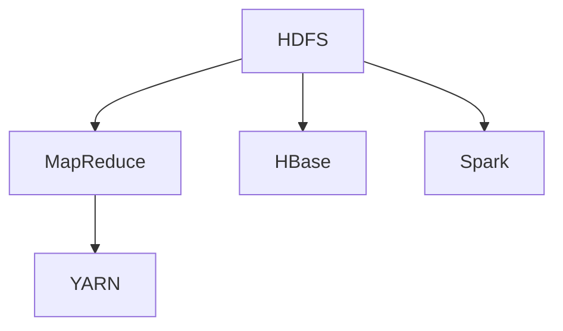

                 

关键词：Hadoop、大数据处理、分布式系统、MapReduce、HDFS、YARN、HBase、Spark、生态圈

> 摘要：本文将深入探讨Hadoop大数据处理生态系统，包括其背景、核心概念、算法原理、数学模型、实际应用案例以及未来发展趋势。Hadoop作为大数据处理领域的基石，其生态系统中的各个组件和工具如何协同工作，将为我们展示出一个强大且灵活的数据处理平台。

## 1. 背景介绍

大数据（Big Data）是指无法使用常规软件工具在合理时间内捕捉、管理和处理的大量数据。随着互联网、物联网、社交媒体和智能设备的迅猛发展，数据量呈爆炸性增长，传统的数据处理方式已经无法满足需求。为了解决这个问题，Hadoop应运而生。

Hadoop是一个开源的大数据处理框架，由Apache软件基金会维护。它基于Google的MapReduce论文，提供了分布式存储和分布式处理的能力。Hadoop生态系统包含了多个组件，如HDFS、YARN、MapReduce、HBase、Spark等，每个组件都有其特定的功能和作用。

## 2. 核心概念与联系

### 2.1 核心概念

- **HDFS（Hadoop Distributed File System）**：一个分布式文件系统，用于存储大数据。
- **MapReduce**：一个分布式数据处理框架，用于处理海量数据。
- **YARN**：资源管理平台，负责管理集群资源和作业调度。
- **HBase**：一个分布式、可扩展的大数据存储系统，基于Google的Bigtable。
- **Spark**：一个快速且通用的分布式计算引擎，用于大数据处理。

### 2.2 架构联系

下面是一个Hadoop生态系统的Mermaid流程图：



### 2.3 工作原理

- **HDFS**：将大文件分成小块存储在分布式节点上，提供了高吞吐量的数据访问。
- **MapReduce**：将数据处理任务分解为“Map”和“Reduce”两个阶段，分别处理数据并汇总结果。
- **YARN**：负责资源管理和任务调度，确保各个组件高效运行。
- **HBase**：提供了随机读写的能力，适用于实时数据查询。
- **Spark**：提供了快速且灵活的数据处理能力，适用于迭代计算和实时处理。

## 3. 核心算法原理 & 具体操作步骤

### 3.1 算法原理概述

Hadoop生态系统中的核心算法是MapReduce。MapReduce将数据处理任务划分为两个阶段：

- **Map阶段**：将输入数据映射为中间键值对。
- **Reduce阶段**：将中间键值对聚合为最终结果。

### 3.2 算法步骤详解

1. **输入**：MapReduce接收一个输入数据集和一个MapReduce程序。
2. **Map阶段**：
   - **Shuffle**：将输入数据分配到多个Map任务上。
   - **Map**：每个Map任务处理一部分输入数据，输出中间键值对。
3. **中间键值对**：这些中间键值对被写入临时文件。
4. **Reduce阶段**：
   - **Shuffle**：将中间键值对按照键分类，分发到不同的Reduce任务上。
   - **Reduce**：每个Reduce任务处理一组中间键值对，输出最终结果。

### 3.3 算法优缺点

- **优点**：高扩展性、高容错性、适合处理海量数据。
- **缺点**：不适合迭代计算、实时处理速度较慢。

### 3.4 算法应用领域

MapReduce广泛应用于日志处理、数据仓库、机器学习等领域。

## 4. 数学模型和公式 & 详细讲解 & 举例说明

### 4.1 数学模型构建

在MapReduce中，核心的数学模型是键值对的映射和聚合。

### 4.2 公式推导过程

$$
Map(\text{输入数据}) = \{(\text{键}_1, \text{值}_1), (\text{键}_2, \text{值}_2), ..., (\text{键}_n, \text{值}_n)\}
$$

$$
Reduce(\text{中间键值对}) = \{(\text{键}_1, \sum_{\text{值}_i \in \text{值}_1}^n \text{值}_i), ..., (\text{键}_n, \sum_{\text{值}_i \in \text{值}_n}^n \text{值}_i)\}
$$

### 4.3 案例分析与讲解

假设我们有一个文本数据集，包含单词及其出现次数。我们使用MapReduce计算每个单词的词频。

1. **Map阶段**：
   - **输入**：文本数据。
   - **输出**：中间键值对（单词，出现次数）。

2. **Reduce阶段**：
   - **输入**：中间键值对（单词，出现次数）。
   - **输出**：最终结果（单词，总出现次数）。

## 5. 项目实践：代码实例和详细解释说明

### 5.1 开发环境搭建

安装Java环境和Hadoop。

### 5.2 源代码详细实现

以下是简单的MapReduce程序，用于计算文本数据中每个单词的出现次数。

```java
public class WordCount {
  public static class TokenizerMapper
      extends Mapper<Object, Text, Text, IntWritable>{

    private final static IntWritable one = new IntWritable(1);
    private Text word = new Text();

    public void map(Object key, Text value, Context context) 
          throws IOException, InterruptedException {
      String[] words = value.toString().split("\\s+");
      for (String word : words) {
        context.write(new Text(word), one);
      }
    }
  }

  public static class IntSumReducer
      extends Reducer<Text,IntWritable,Text,IntWritable> {
    private IntWritable result = new IntWritable();

    public void reduce(Text key, Iterable<IntWritable> values, 
                        Context context) 
          throws IOException, InterruptedException {
      int sum = 0;
      for (IntWritable val : values) {
        sum += val.get();
      }
      result.set(sum);
      context.write(key, result);
    }
  }

  public static void main(String[] args) throws Exception {
    Configuration conf = new Configuration();
    Job job = Job.getInstance(conf, "word count");
    job.setJarByClass(WordCount.class);
    job.setMapperClass(TokenizerMapper.class);
    job.setCombinerClass(IntSumReducer.class);
    job.setReducerClass(IntSumReducer.class);
    job.setOutputKeyClass(Text.class);
    job.setOutputValueClass(IntWritable.class);
    FileInputFormat.addInputPath(job, new Path(args[0]));
    FileOutputFormat.setOutputPath(job, new Path(args[1]));
    System.exit(job.waitForCompletion(true) ? 0 : 1);
  }
}
```

### 5.3 代码解读与分析

这段代码实现了经典的WordCount程序，用于计算文本数据中的每个单词的出现次数。

### 5.4 运行结果展示

运行结果将输出每个单词及其出现次数。

## 6. 实际应用场景

Hadoop生态系统在多个领域有广泛的应用，包括搜索引擎、电子商务、金融分析、社交媒体等。

## 7. 工具和资源推荐

- **学习资源**：Apache Hadoop官网、大数据处理书籍、在线课程。
- **开发工具**：Eclipse、IntelliJ IDEA、Hadoop分布式文件系统。
- **相关论文**：Google的MapReduce、Bigtable、GFS。

## 8. 总结：未来发展趋势与挑战

Hadoop生态系统将继续发展，但同时也面临新的挑战，如数据隐私、安全性和实时处理能力。

### 8.1 研究成果总结

Hadoop在分布式存储和处理大数据方面取得了显著成果。

### 8.2 未来发展趋势

Hadoop将向实时处理、机器学习等方面发展。

### 8.3 面临的挑战

数据隐私和安全性问题将是主要挑战。

### 8.4 研究展望

Hadoop将继续改进，为大数据处理提供更好的解决方案。

## 9. 附录：常见问题与解答

### 9.1 什么是Hadoop？

Hadoop是一个开源的大数据处理框架，用于分布式存储和分布式处理。

### 9.2 Hadoop的生态系统包括哪些组件？

Hadoop的生态系统包括HDFS、MapReduce、YARN、HBase、Spark等。

### 9.3 Hadoop适合处理哪些类型的数据？

Hadoop适合处理大规模的structured和unstructured数据。

### 9.4 如何学习Hadoop？

可以通过阅读相关书籍、参加在线课程、实际项目实践来学习Hadoop。

----------------------------------------------------------------

---

作者：禅与计算机程序设计艺术 / Zen and the Art of Computer Programming

