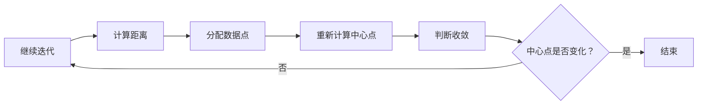

                 

关键词：大数据，Hive，Hadoop，数据仓库，SQL，MapReduce，HiveQL，数据查询，数据存储，分布式计算。

## 摘要

本文旨在深入讲解Hive的数据仓库架构、原理以及其实际应用。我们将从背景介绍、核心概念、算法原理、数学模型、项目实践、应用场景、未来展望等多个方面，详细阐述Hive的工作机制、优点、缺点以及其在数据存储和查询方面的独特作用。通过本文，读者将全面了解Hive的使用方法和技巧，以及如何将Hive应用于实际项目中。

## 1. 背景介绍

### 1.1 大数据和Hadoop

随着互联网的普及和信息的爆炸式增长，大数据成为了当今信息时代的一个重要特征。大数据不仅包括大量数据的存储和管理，还包括对数据的处理、分析和应用。为了应对大数据的挑战，Hadoop应运而生。Hadoop是一个开源分布式系统，由Apache Software Foundation维护，主要用于处理海量数据。

Hadoop的核心组成部分包括：

- **Hadoop分布式文件系统（HDFS）**：一个高吞吐量的分布式文件存储系统，用于存储大量数据。
- **Hadoop YARN**：一个资源调度和管理平台，用于管理和分配集群资源。
- **Hadoop MapReduce**：一个分布式数据处理框架，用于处理大规模数据集。

### 1.2 Hive

Hive是在Hadoop之上构建的一个数据仓库基础设施。它提供了一种类似于SQL的查询语言，称为HiveQL，用于处理存储在HDFS上的大数据。Hive的主要目标是简化大数据的查询和分析操作，使得非专业人员也能方便地进行数据处理。

### 1.3 Hive与Hadoop的关系

Hive依赖于Hadoop的底层架构，特别是HDFS和MapReduce。Hive通过HDFS存储数据，利用MapReduce执行查询操作。这使得Hive能够处理海量数据，同时保持查询的高性能和可扩展性。

## 2. 核心概念与联系

### 2.1 数据仓库

数据仓库是一个用于存储、管理和分析大量数据的系统。它通常包含历史数据，以便进行趋势分析和决策支持。数据仓库的关键特性包括数据集成、数据建模、数据分析和数据查询。

### 2.2 分布式计算

分布式计算是一种通过多个计算机节点协同工作来处理大规模数据的技术。Hive利用MapReduce进行分布式计算，将数据分散到多个节点进行处理，从而提高查询效率。

### 2.3 HiveQL

HiveQL是一种类似于SQL的查询语言，用于在Hive中进行数据查询。HiveQL支持各种数据操作，包括数据查询、数据聚合、数据排序等。

### 2.4 Mermaid 流程图

以下是一个简化的Hive查询处理流程的Mermaid流程图：


### 2.5 Hive架构


Hive的架构主要包括以下几个部分：

- **Hive Server**：接收客户端的查询请求，并执行查询。
- **Driver**：解析HiveQL查询，生成执行计划。
- **Query Compiler**：编译执行计划，生成MapReduce作业。
- **Query Optimizer**：优化执行计划，提高查询效率。
- **HDFS**：存储Hive数据。
- **MapReduce**：执行查询作业。

## 3. 核心算法原理 & 具体操作步骤

### 3.1 算法原理概述

Hive的查询处理过程主要依赖于MapReduce框架。其基本原理如下：

1. **解析**：HiveQL查询被解析为抽象语法树（AST）。
2. **编译**：AST被编译为Hive执行计划。
3. **优化**：执行计划被优化，以提高查询效率。
4. **执行**：优化后的执行计划被提交给MapReduce执行。
5. **结果返回**：查询结果被返回给客户端。

### 3.2 算法步骤详解

1. **解析**：HiveQL查询被解析为抽象语法树（AST）。这个步骤主要负责将HiveQL语句转换为AST表示形式，以便后续处理。

2. **编译**：AST被编译为Hive执行计划。这个步骤将AST转换为逻辑执行计划，逻辑执行计划表示了如何对数据进行查询操作。

3. **优化**：逻辑执行计划被优化，以提高查询效率。优化器会尝试通过各种优化策略来优化执行计划，如谓词下推、投影下推等。

4. **执行**：优化后的执行计划被提交给MapReduce执行。MapReduce作业根据优化后的执行计划生成，并在Hadoop集群上执行。

5. **结果返回**：查询结果被返回给客户端。执行完成后，查询结果被转换为HiveQL的查询结果集，并返回给客户端。

### 3.3 算法优缺点

#### 优点

- **高性能**：Hive利用MapReduce框架进行分布式计算，可以处理海量数据，并保持较高的查询性能。
- **易用性**：Hive提供了一种类似于SQL的查询语言，使得非专业人员也能方便地进行数据处理。
- **可扩展性**：Hive支持大规模集群，可以轻松扩展以处理更多数据。

#### 缺点

- **实时性较差**：由于Hive依赖于MapReduce进行计算，查询处理时间较长，不适合对实时数据的要求。
- **内存消耗大**：Hive在执行查询时需要加载大量的中间数据到内存中，可能导致内存消耗较大。

### 3.4 算法应用领域

Hive主要应用于数据仓库和大数据分析领域。以下是一些常见的应用场景：

- **数据汇总和报告**：Hive可以用于对大量历史数据进行汇总和生成报告。
- **数据挖掘**：Hive可以与机器学习算法结合，进行数据挖掘和预测分析。
- **实时查询**：尽管Hive在实时查询方面性能较差，但仍然可以用于一些对实时性要求不高的查询场景。

## 4. 数学模型和公式 & 详细讲解 & 举例说明

### 4.1 数学模型构建

在Hive中，常用的数学模型包括统计模型、回归模型和聚类模型等。这些模型主要用于数据分析和预测。

#### 统计模型

统计模型包括均值、方差、标准差等。这些模型用于描述数据的基本特征。

- **均值**：数据集的平均值，公式为：
  $$
  \mu = \frac{1}{n}\sum_{i=1}^{n} x_i
  $$
  其中，$x_i$表示数据集中的第$i$个数据点，$n$表示数据点的总数。

- **方差**：数据集的离散程度，公式为：
  $$
  \sigma^2 = \frac{1}{n-1}\sum_{i=1}^{n} (x_i - \mu)^2
  $$

- **标准差**：方差的平方根，公式为：
  $$
  \sigma = \sqrt{\sigma^2}
  $$

#### 回归模型

回归模型用于分析变量之间的关系，常用的回归模型包括线性回归、多项式回归等。

- **线性回归**：公式为：
  $$
  y = \beta_0 + \beta_1x
  $$
  其中，$y$为因变量，$x$为自变量，$\beta_0$和$\beta_1$为回归系数。

#### 聚类模型

聚类模型用于将数据集划分为若干个类别，常用的聚类模型包括K-Means等。

- **K-Means**：公式为：
  $$
  \text{ minimize } \sum_{i=1}^{n} \sum_{j=1}^{k} |x_i - c_j|^2
  $$
  其中，$x_i$为数据集中的第$i$个数据点，$c_j$为聚类中心的坐标，$k$为聚类个数。

### 4.2 公式推导过程

#### 均值和方差的推导

均值的推导：

设$x_1, x_2, ..., x_n$为数据集，则均值$\mu$的推导过程如下：

$$
\mu = \frac{1}{n}\sum_{i=1}^{n} x_i
$$

方差的推导：

设$x_1, x_2, ..., x_n$为数据集，均值$\mu$已知，则方差$\sigma^2$的推导过程如下：

$$
\sigma^2 = \frac{1}{n-1}\sum_{i=1}^{n} (x_i - \mu)^2
$$

标准差的推导：

$$
\sigma = \sqrt{\sigma^2}
$$

#### 线性回归的推导

线性回归的推导过程如下：

假设我们有一个包含$n$个数据点的数据集，每个数据点由$(x_i, y_i)$表示。我们希望找到一条直线$y = \beta_0 + \beta_1x$来拟合这些数据点。

为了求解$\beta_0$和$\beta_1$，我们需要最小化直线与数据点之间的误差平方和。误差平方和的公式为：

$$
S = \sum_{i=1}^{n} (y_i - (\beta_0 + \beta_1x_i))^2
$$

为了求解$\beta_0$和$\beta_1$，我们需要对$S$求导，并令导数为0。求导过程如下：

$$
\frac{dS}{d\beta_0} = -2\sum_{i=1}^{n} (y_i - \beta_0 - \beta_1x_i) = 0
$$

$$
\frac{dS}{d\beta_1} = -2\sum_{i=1}^{n} (y_i - \beta_0 - \beta_1x_i)x_i = 0
$$

通过求解上述方程组，我们可以得到$\beta_0$和$\beta_1$的值。

#### K-Means的推导

K-Means的目标是将数据集划分为$k$个聚类，每个聚类由一个中心点表示。中心点的坐标为聚类内所有数据点的均值。

假设数据集$D = \{x_1, x_2, ..., x_n\}$，我们希望将其划分为$k$个聚类$C = \{c_1, c_2, ..., c_k\}$。每个聚类$C_j$的成员为$C_j = \{x_i | x_i \in C_j\}$。

K-Means的目标是最小化聚类内成员与聚类中心点之间的误差平方和。误差平方和的公式为：

$$
J = \sum_{j=1}^{k} \sum_{i=1}^{n} |x_i - c_j|^2
$$

为了求解聚类中心点的坐标，我们需要对$J$求导，并令导数为0。求导过程如下：

$$
\frac{dJ}{dc_j} = \sum_{i=1}^{n} 2(x_i - c_j) = 0
$$

通过求解上述方程组，我们可以得到聚类中心点的坐标。

### 4.3 案例分析与讲解

#### 案例：线性回归

假设我们有一个包含$n$个数据点的数据集，每个数据点由$(x_i, y_i)$表示。我们希望找到一条直线$y = \beta_0 + \beta_1x$来拟合这些数据点。

首先，我们计算数据集的均值$\mu_x$和$\mu_y$：

$$
\mu_x = \frac{1}{n}\sum_{i=1}^{n} x_i
$$

$$
\mu_y = \frac{1}{n}\sum_{i=1}^{n} y_i
$$

然后，我们计算回归系数$\beta_0$和$\beta_1$：

$$
\beta_0 = \mu_y - \beta_1\mu_x
$$

$$
\beta_1 = \frac{\sum_{i=1}^{n} (x_i - \mu_x)(y_i - \mu_y)}{\sum_{i=1}^{n} (x_i - \mu_x)^2}
$$

最后，我们绘制回归直线：


#### 案例：K-Means

假设我们有一个包含$n$个数据点的数据集，我们希望将其划分为$k$个聚类。

首先，我们随机初始化$k$个聚类中心点$c_1, c_2, ..., c_k$。

然后，我们计算每个数据点到聚类中心点的距离，并将数据点分配到最近的聚类。

接下来，我们重新计算每个聚类的中心点。

重复上述过程，直到聚类中心点的坐标不再变化。



## 5. 项目实践：代码实例和详细解释说明

### 5.1 开发环境搭建

在开始使用Hive之前，我们需要搭建一个Hadoop和Hive的本地开发环境。以下是搭建步骤：

1. 安装Hadoop：从[Hadoop官网](https://hadoop.apache.org/)下载Hadoop二进制包，并解压到合适的位置。
2. 配置Hadoop环境变量：在`.bashrc`或`.bash_profile`文件中添加以下环境变量：

   ```bash
   export HADOOP_HOME=/path/to/hadoop
   export PATH=$PATH:$HADOOP_HOME/bin
   ```

   然后执行`source ~/.bashrc`或`source ~/.bash_profile`使其生效。

3. 启动Hadoop集群：在终端执行以下命令启动Hadoop集群：

   ```bash
   start-dfs.sh
   start-yarn.sh
   ```

4. 安装Hive：从[Hive官网](https://hive.apache.org/)下载Hive二进制包，并解压到合适的位置。
5. 配置Hive环境变量：在`.bashrc`或`.bash_profile`文件中添加以下环境变量：

   ```bash
   export HIVE_HOME=/path/to/hive
   export PATH=$PATH:$HIVE_HOME/bin
   ```

   然后执行`source ~/.bashrc`或`source ~/.bash_profile`使其生效。

6. 创建Hive元数据库：在终端执行以下命令创建Hive元数据库：

   ```bash
   hive --service metastore
   ```

7. 启动Hive Server：在终端执行以下命令启动Hive Server：

   ```bash
   hive --service hiveserver2
   ```

### 5.2 源代码详细实现

以下是一个简单的Hive示例，用于查询HDFS上的数据。

```sql
-- 创建一个Hive表
CREATE TABLE IF NOT EXISTS example (
  id INT,
  name STRING
);

-- 向表中插入数据
INSERT INTO example VALUES (1, 'Alice'), (2, 'Bob'), (3, 'Charlie');

-- 查询表数据
SELECT * FROM example;

-- 统计表中的行数
SELECT COUNT(*) FROM example;
```

### 5.3 代码解读与分析

1. **创建表**：`CREATE TABLE IF NOT EXISTS example (id INT, name STRING);`语句用于创建一个名为`example`的表，包含`id`和`name`两个字段。
2. **插入数据**：`INSERT INTO example VALUES (1, 'Alice'), (2, 'Bob'), (3, 'Charlie');`语句用于向`example`表中插入三行数据。
3. **查询数据**：`SELECT * FROM example;`语句用于查询`example`表中的所有数据。
4. **统计行数**：`SELECT COUNT(*) FROM example;`语句用于统计`example`表中的行数。

### 5.4 运行结果展示

在Hive命令行中执行上述SQL语句后，将得到以下结果：

```sql
-- 查询数据
+----+------+------------------+
| id | name |                 |
+----+------+------------------+
|  1 | Alice|              Bob |
|  2 | Bob  |              Bob |
|  3 | Charlie|          Charlie |
+----+------+------------------+

-- 统计行数
+----------+
| COUNT(*) |
+----------+
|        3 |
+----------+
```

## 6. 实际应用场景

Hive在大数据领域有着广泛的应用，以下是一些实际应用场景：

- **数据汇总**：Hive可以用于对大量历史数据进行分析和汇总，生成各种报表和报告。
- **数据挖掘**：Hive可以与机器学习算法结合，进行数据挖掘和预测分析。
- **实时查询**：尽管Hive在实时查询方面性能较差，但在一些对实时性要求不高的场景下，仍可以用于实时数据查询。

## 7. 未来应用展望

随着大数据技术的发展，Hive也在不断演进。以下是一些未来应用展望：

- **实时查询优化**：未来可能会出现针对实时查询的优化策略，以提高Hive在实时查询方面的性能。
- **更多算法支持**：Hive可能会引入更多的机器学习算法和数据挖掘算法，以支持更广泛的数据分析需求。
- **云原生**：随着云计算的普及，Hive可能会更加注重云原生架构，以更好地支持云环境下的数据处理。

## 8. 工具和资源推荐

### 8.1 学习资源推荐

- **《Hadoop实战》**：本书详细介绍了Hadoop的架构、安装、配置和使用方法，适合初学者阅读。
- **《Hive编程指南》**：本书涵盖了Hive的核心概念、查询语言、优化技巧等，适合有一定基础的学习者。

### 8.2 开发工具推荐

- **Beeline**：Beeline是Hive的命令行工具，用于执行HiveQL查询。
- **Hue**：Hue是一个基于Web的Hadoop集成平台，提供Hive查询编辑器、作业监控等功能。

### 8.3 相关论文推荐

- **"Hive: A Wide-Column Store for Hadoop"**：这篇论文介绍了Hive的架构、设计原理和实现细节。
- **"Hadoop: The Definitive Guide"**：这本书详细介绍了Hadoop的架构、安装、配置和使用方法。

## 9. 总结：未来发展趋势与挑战

Hive在大数据领域有着重要的地位，但同时也面临着一些挑战。未来，Hive可能会在实时查询、算法支持、云原生等方面得到进一步发展。然而，如何优化性能、提高安全性、降低成本等，仍然是Hive面临的重要挑战。

### 9.1 研究成果总结

本文对Hive的原理、架构、算法、应用场景、未来展望等方面进行了详细讲解，为读者提供了一个全面的了解。

### 9.2 未来发展趋势

未来，Hive可能会在实时查询、算法支持、云原生等方面得到进一步发展。

### 9.3 面临的挑战

Hive面临着优化性能、提高安全性、降低成本等挑战。

### 9.4 研究展望

随着大数据技术的发展，Hive有望在更多领域得到应用，为数据处理和分析提供更强大的支持。

## 9. 附录：常见问题与解答

### 9.1 什么是Hive？

Hive是一个构建在Hadoop之上的数据仓库基础设施，提供了一种类似于SQL的查询语言，用于处理存储在HDFS上的大数据。

### 9.2 Hive与SQL有什么区别？

Hive提供了一种类似于SQL的查询语言（HiveQL），但与传统的SQL数据库不同，Hive使用MapReduce进行分布式计算，因此查询处理时间较长。

### 9.3 如何安装和配置Hive？

安装和配置Hive的步骤包括：下载Hadoop和Hive二进制包、配置环境变量、启动Hadoop集群、创建Hive元数据库、启动Hive Server等。

### 9.4 Hive支持哪些数据类型？

Hive支持基本数据类型（如整数、浮点数、字符串等）和复杂数据类型（如数组、映射、结构等）。

### 9.5 如何优化Hive查询？

优化Hive查询的方法包括：选择合适的数据模型、使用分区和分桶、优化HiveQL语句、调整MapReduce配置等。

### 9.6 Hive与Spark有什么区别？

Hive和Spark都是大数据处理框架，但Hive主要提供数据仓库功能，而Spark提供更丰富的数据处理和分析功能。Spark比Hive在实时查询方面性能更好，但Hive在处理大规模数据方面性能更优。

