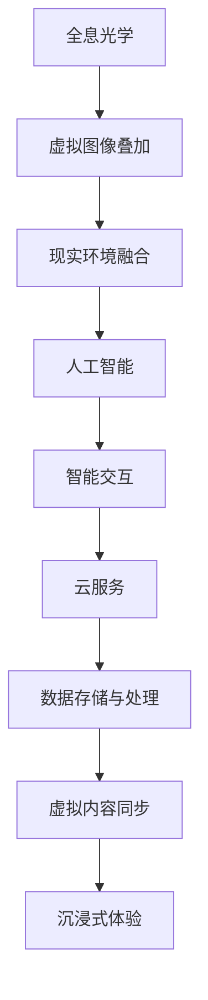

                 

关键词：HoloLens、混合现实、应用开发、沉浸式体验、Microsoft、AR、VR

摘要：本文将详细介绍HoloLens混合现实应用开发的各个方面，包括背景介绍、核心概念与联系、核心算法原理与操作步骤、数学模型与公式、项目实践、实际应用场景、未来展望、工具和资源推荐以及面临的挑战和展望。通过本文，读者将全面了解HoloLens的强大功能，掌握在HoloLens上创建沉浸式体验的技巧和方法。

## 1. 背景介绍

混合现实（Mixed Reality，简称MR）是一种将虚拟信息和现实世界融合在一起的技术。它不仅包括增强现实（Augmented Reality，简称AR）和虚拟现实（Virtual Reality，简称VR），还能通过头戴式显示器或移动设备实时地将数字内容叠加到真实环境中。HoloLens是由Microsoft开发的全球首款全息计算机，它将混合现实技术推向了新的高度。

HoloLens采用了一系列创新技术，如全息光学、人工智能和云服务，实现了令人惊叹的混合现实体验。用户可以通过HoloLens与虚拟对象进行交互，这些对象在现实世界中似乎真实存在，从而创造出一种全新的沉浸式体验。

HoloLens的潜在应用非常广泛，从工业制造、医疗保健到教育、娱乐等领域都有很大的发展潜力。通过本文，我们将深入了解HoloLens的混合现实应用开发，帮助读者掌握这一前沿技术的核心原理和实践技巧。

## 2. 核心概念与联系

为了更好地理解HoloLens混合现实应用开发，我们需要先了解一些核心概念和它们之间的关系。以下是几个关键概念及其相互联系：

### 2.1. 全息光学

全息光学是HoloLens实现混合现实的关键技术之一。它利用特殊的光学元件和镜片，将虚拟图像以全息形式叠加到真实环境中。这种技术使得虚拟对象能够在现实世界中有形地呈现，从而实现与现实世界的无缝融合。

### 2.2. 人工智能

HoloLens内置了人工智能（AI）功能，特别是机器学习和计算机视觉算法。这些算法可以帮助HoloLens识别和理解用户和环境，从而为用户提供更加智能和个性化的体验。例如，通过面部识别和手势识别，用户可以与虚拟对象进行交互。

### 2.3. 云服务

HoloLens与云服务紧密相连，通过云端进行数据存储、处理和共享。这为HoloLens应用提供了无限的可能性和灵活性。用户可以在云端创建和编辑全息内容，并将其实时同步到HoloLens设备上。

### 2.4. 虚拟对象与真实环境的融合

混合现实的核心在于将虚拟对象与真实环境融合在一起。通过全息光学、人工智能和云服务，HoloLens实现了这一目标。虚拟对象不仅能够在现实环境中呈现，而且可以与用户和环境进行交互。

### 2.5. Mermaid流程图

以下是一个简化的Mermaid流程图，展示了HoloLens混合现实应用开发的核心概念和联系：



通过这个流程图，我们可以看到HoloLens混合现实应用开发的各个组件是如何协同工作的，从而实现令人惊叹的沉浸式体验。

## 3. 核心算法原理 & 具体操作步骤

### 3.1. 算法原理概述

HoloLens混合现实应用开发的核心算法主要包括全息光学、人工智能和云服务。下面我们分别介绍这些算法的原理。

#### 3.1.1. 全息光学

全息光学是HoloLens实现混合现实的关键技术。它利用特殊的光学元件和镜片，将虚拟图像以全息形式叠加到真实环境中。具体来说，全息光学通过以下步骤实现：

1. **图像生成**：计算机生成虚拟图像，并将其转换为全息图。
2. **光学处理**：全息图通过光学元件和镜片进行光学处理，从而在真实环境中呈现出虚拟图像。
3. **图像叠加**：虚拟图像与真实环境进行叠加，从而实现混合现实效果。

#### 3.1.2. 人工智能

HoloLens内置了人工智能功能，特别是机器学习和计算机视觉算法。这些算法可以帮助HoloLens识别和理解用户和环境，从而为用户提供更加智能和个性化的体验。具体来说，人工智能在HoloLens中应用于：

1. **面部识别**：通过机器学习算法，HoloLens可以识别人脸，并进行追踪。
2. **手势识别**：通过计算机视觉算法，HoloLens可以识别人手的姿态和动作，从而实现手势交互。
3. **环境理解**：通过计算机视觉算法，HoloLens可以识别和解析真实环境，从而为用户提供更加准确和自然的交互体验。

#### 3.1.3. 云服务

HoloLens与云服务紧密相连，通过云端进行数据存储、处理和共享。具体来说，云服务在HoloLens中的应用包括：

1. **数据存储**：用户可以在云端创建和编辑全息内容，并将其存储在云端。
2. **数据处理**：HoloLens可以将数据发送到云端进行实时处理，从而为用户提供更加智能和个性化的体验。
3. **数据共享**：用户可以在云端与其他用户共享全息内容，从而实现协作和交流。

### 3.2. 算法步骤详解

下面我们将详细介绍HoloLens混合现实应用开发的算法步骤。

#### 3.2.1. 全息光学实现步骤

1. **图像生成**：
   - 使用计算机生成虚拟图像，并将其转换为全息图。
   - 全息图的生成通常采用全息算法，如HoloCode算法。

2. **光学处理**：
   - 将全息图通过光学元件（如波导、反射镜等）进行光学处理。
   - 光学元件的作用是将全息图的光线引导到正确的方向，从而在真实环境中呈现出虚拟图像。

3. **图像叠加**：
   - 将虚拟图像与真实环境进行叠加。
   - 使用全息光学引擎（如Microsoft HoloLens光学引擎）实现图像叠加。

#### 3.2.2. 人工智能实现步骤

1. **面部识别**：
   - 使用机器学习算法进行面部识别。
   - 面部识别的步骤包括：人脸检测、人脸特征提取、人脸匹配。

2. **手势识别**：
   - 使用计算机视觉算法进行手势识别。
   - 手势识别的步骤包括：手势检测、手势跟踪、手势分类。

3. **环境理解**：
   - 使用计算机视觉算法进行环境理解。
   - 环境理解的步骤包括：场景分割、物体识别、场景重建。

#### 3.2.3. 云服务实现步骤

1. **数据存储**：
   - 将用户创建的全息内容存储到云端。
   - 数据存储采用分布式存储技术，如HDFS。

2. **数据处理**：
   - 将HoloLens收集的数据发送到云端进行实时处理。
   - 数据处理采用大数据处理技术，如MapReduce。

3. **数据共享**：
   - 允许用户在云端与其他用户共享全息内容。
   - 数据共享采用分布式存储和传输技术，如HTTP、FTP。

### 3.3. 算法优缺点

#### 3.3.1. 全息光学

**优点**：
- 高度沉浸式体验：全息光学技术能够将虚拟图像逼真地叠加到真实环境中，为用户提供高度沉浸式的体验。
- 交互性强：通过全息光学技术，用户可以与虚拟对象进行自然的交互，如手势识别、语音控制等。

**缺点**：
- 成本较高：全息光学技术涉及到复杂的硬件设备和光学元件，成本较高。
- 可见度有限：全息光学技术的可见度受限于光学元件的性能和光线强度。

#### 3.3.2. 人工智能

**优点**：
- 智能化：人工智能技术能够帮助HoloLens理解和适应用户和环境，提供更加智能和个性化的体验。
- 自动化：人工智能技术可以实现自动化操作，如手势识别、环境理解等，减少用户操作复杂性。

**缺点**：
- 计算资源需求高：人工智能技术需要大量的计算资源和存储空间，对硬件设备的要求较高。
- 数据安全：人工智能技术涉及大量用户数据，数据安全和隐私保护是重要问题。

#### 3.3.3. 云服务

**优点**：
- 分布式存储和处理：云服务可以提供分布式存储和处理能力，提高系统的可扩展性和性能。
- 数据共享和协作：云服务支持用户之间的数据共享和协作，实现多人同时在线操作。

**缺点**：
- 网络依赖：云服务依赖于网络连接，网络不稳定可能导致服务中断。
- 数据安全和隐私：云服务涉及大量用户数据，数据安全和隐私保护是重要问题。

### 3.4. 算法应用领域

HoloLens混合现实应用开发的算法可以在多个领域得到广泛应用：

1. **工业制造**：通过混合现实技术，工厂工人可以实时查看和操作虚拟设备，提高生产效率和质量。
2. **医疗保健**：医生可以使用HoloLens进行手术指导和医学教育，提高诊断和治疗水平。
3. **教育培训**：教师可以使用HoloLens创建沉浸式教学场景，提高学生的学习兴趣和效果。
4. **娱乐与游戏**：虚拟现实游戏和娱乐项目可以使用HoloLens提供更加沉浸式的体验。

## 4. 数学模型和公式 & 详细讲解 & 举例说明

### 4.1. 数学模型构建

在HoloLens混合现实应用开发中，数学模型扮演着重要角色。以下是几个关键数学模型的构建和公式推导：

#### 4.1.1. 全息光学模型

全息光学模型主要涉及全息图的生成和光学处理。以下是全息光学模型的关键公式：

$$
H(x,y,z) = \int I(u,v) \exp\left(-j2\pi n \frac{u x + v y}{z}\right) du dv
$$

其中，\( H(x,y,z) \) 是全息图，\( I(u,v) \) 是原始图像，\( n \) 是介质折射率，\( x, y, z \) 是三维空间坐标。

#### 4.1.2. 人工智能模型

人工智能模型主要涉及机器学习和计算机视觉。以下是人工智能模型的关键公式：

$$
w^T x + b = 0
$$

其中，\( w \) 是权重向量，\( x \) 是输入特征，\( b \) 是偏置项。这是一个线性分类器的公式，用于分类问题。

#### 4.1.3. 云服务模型

云服务模型主要涉及数据存储和数据处理。以下是云服务模型的关键公式：

$$
MapReduce = \{ map, reduce \}
$$

其中，\( map \) 是映射函数，\( reduce \) 是归约函数。这是一个分布式数据处理模型，用于处理大规模数据集。

### 4.2. 公式推导过程

下面我们分别对上述数学模型的公式进行推导。

#### 4.2.1. 全息光学模型公式推导

全息图的生成公式可以通过光学衍射理论推导得到。具体推导过程如下：

1. **原始图像的光场表示**：

   原始图像 \( I(u,v) \) 可以表示为光场 \( \mathbf{L}(\mathbf{r}) \) 的空间积分：

   $$
   I(u,v) = \int \mathbf{L}(\mathbf{r}) \exp\left(-j2\pi \frac{u x + v y}{z}\right) d^3r
   $$

   其中，\( \mathbf{r} = (x, y, z) \) 是空间坐标。

2. **全息图的光场表示**：

   全息图 \( H(x,y,z) \) 可以表示为原始光场 \( \mathbf{L}_0(\mathbf{r}) \) 和附加光场 \( \mathbf{L}_1(\mathbf{r}) \) 的和：

   $$
   H(x,y,z) = \mathbf{L}_0(\mathbf{r}) + \mathbf{L}_1(\mathbf{r})
   $$

   其中，\( \mathbf{L}_0(\mathbf{r}) \) 是原始光场，\( \mathbf{L}_1(\mathbf{r}) \) 是附加光场。

3. **附加光场的推导**：

   根据光学衍射理论，附加光场可以表示为：

   $$
   \mathbf{L}_1(\mathbf{r}) = \int \mathbf{L}_0(\mathbf{r}') \exp\left(-j2\pi \frac{u' x + v' y}{z}\right) d^3r'
   $$

   其中，\( \mathbf{r}' = (u', v', z') \) 是原始图像的光场坐标。

4. **全息图的公式推导**：

   将附加光场代入全息图的表达式中，得到：

   $$
   H(x,y,z) = \int \mathbf{L}_0(\mathbf{r}') \exp\left(-j2\pi \frac{u' x + v' y}{z}\right) d^3r' + \mathbf{L}_0(\mathbf{r}) + \mathbf{L}_1(\mathbf{r})
   $$

   由于 \( \mathbf{L}_0(\mathbf{r}) \) 是原始光场，可以直接代入原始图像 \( I(u,v) \)：

   $$
   H(x,y,z) = \int I(u',v') \exp\left(-j2\pi \frac{u' x + v' y}{z}\right) d^3r'
   $$

   这就是全息图的生成公式。

#### 4.2.2. 人工智能模型公式推导

人工智能模型的公式可以通过线性分类器的原理推导得到。具体推导过程如下：

1. **线性分类器的基本原理**：

   线性分类器的基本原理是找到一个超平面，将数据空间分成不同的类别。对于二分类问题，超平面的公式可以表示为：

   $$
   w^T x + b = 0
   $$

   其中，\( w \) 是权重向量，\( x \) 是输入特征，\( b \) 是偏置项。

2. **权重向量的优化**：

   为了找到最佳的权重向量，需要使用梯度下降算法。梯度下降的基本公式为：

   $$
   w = w - \alpha \nabla_w J(w)
   $$

   其中，\( \alpha \) 是学习率，\( J(w) \) 是损失函数，\( \nabla_w J(w) \) 是损失函数关于权重向量的梯度。

3. **损失函数的选择**：

   损失函数用于衡量分类器预测结果与真实结果之间的误差。常见的损失函数有平方损失函数和交叉熵损失函数。平方损失函数的公式为：

   $$
   J(w) = \frac{1}{2} \sum_{i=1}^{n} (y_i - \hat{y}_i)^2
   $$

   其中，\( y_i \) 是真实标签，\( \hat{y}_i \) 是预测标签。

   交叉熵损失函数的公式为：

   $$
   J(w) = - \sum_{i=1}^{n} y_i \log(\hat{y}_i) + (1 - y_i) \log(1 - \hat{y}_i)
   $$

   其中，\( y_i \) 是真实标签，\( \hat{y}_i \) 是预测标签。

#### 4.2.3. 云服务模型公式推导

云服务模型的公式可以通过分布式数据处理模型的原理推导得到。具体推导过程如下：

1. **MapReduce模型的基本原理**：

   MapReduce模型是一种分布式数据处理模型，用于处理大规模数据集。MapReduce的基本原理是将数据处理任务分解为两个阶段：映射（Map）和归约（Reduce）。

2. **映射（Map）阶段**：

   映射阶段将数据集划分为多个小块，并对每个小块进行独立处理。映射阶段的公式可以表示为：

   $$
   map(key_1, value_1): \quad \text{输出} \quad \{ k_2, v_2 \}
   $$

   其中，\( key_1 \) 是输入键，\( value_1 \) 是输入值，\( k_2 \) 是输出键，\( v_2 \) 是输出值。

3. **归约（Reduce）阶段**：

   归约阶段将映射阶段输出的结果进行合并和汇总。归约阶段的公式可以表示为：

   $$
   reduce(key_2, values_2): \quad \text{输出} \quad \{ k_3, v_3 \}
   $$

   其中，\( key_2 \) 是输入键，\( values_2 \) 是输入值集合，\( k_3 \) 是输出键，\( v_3 \) 是输出值。

### 4.3. 案例分析与讲解

下面我们通过一个案例来分析HoloLens混合现实应用开发的数学模型和公式。

#### 案例背景

假设有一个HoloLens应用项目，用于在工业制造领域实现虚拟设备的实时监测和操作。项目需求如下：

1. **数据采集**：通过HoloLens设备实时采集工业设备的运行参数，如温度、压力、速度等。
2. **数据分析**：对采集到的数据进行实时分析，识别潜在故障和异常。
3. **实时反馈**：将分析结果以虚拟图像的形式实时显示在HoloLens屏幕上，供工人参考。

#### 案例分析

1. **全息光学模型分析**：

   在本案例中，全息光学模型用于将分析结果以虚拟图像的形式显示在HoloLens屏幕上。具体分析如下：

   - **图像生成**：根据分析结果，生成相应的虚拟图像。
   - **光学处理**：将虚拟图像通过HoloLens光学元件进行光学处理，使其在屏幕上呈现出三维效果。
   - **图像叠加**：将虚拟图像叠加到HoloLens屏幕上的真实环境，实现实时监测和操作。

2. **人工智能模型分析**：

   在本案例中，人工智能模型用于对采集到的数据进行分析和识别。具体分析如下：

   - **面部识别**：通过人脸识别算法，识别操作工人的身份，实现身份验证和权限管理。
   - **手势识别**：通过手势识别算法，识别操作工人的手势，实现虚拟设备的操作控制。
   - **环境理解**：通过计算机视觉算法，理解工业设备的运行状态和周围环境，实现实时监测和操作。

3. **云服务模型分析**：

   在本案例中，云服务模型用于实现数据的实时采集、分析和反馈。具体分析如下：

   - **数据存储**：将采集到的数据存储在云端，实现数据的永久保存和共享。
   - **数据处理**：将云端的数据进行分析，实现实时故障检测和异常识别。
   - **数据反馈**：将分析结果实时反馈给HoloLens设备，实现实时监测和操作。

#### 案例讲解

1. **全息光学模型讲解**：

   全息光学模型在本案例中起到了关键作用，具体实现步骤如下：

   - **图像生成**：根据采集到的数据，生成相应的虚拟图像。例如，当温度超过设定阈值时，生成红色的虚拟图标表示警告。
   - **光学处理**：将虚拟图像通过HoloLens光学元件进行光学处理，使其在屏幕上呈现出三维效果。例如，通过调整光学元件的参数，实现虚拟图像的亮度、对比度和深度效果。
   - **图像叠加**：将虚拟图像叠加到HoloLens屏幕上的真实环境，实现实时监测和操作。例如，当虚拟图标出现在工业设备周围时，工人可以清楚地看到设备的状态，从而做出相应的操作。

2. **人工智能模型讲解**：

   人工智能模型在本案例中起到了数据分析和识别的作用，具体实现步骤如下：

   - **面部识别**：通过人脸识别算法，识别操作工人的身份，实现身份验证和权限管理。例如，当工人佩戴HoloLens设备时，系统会自动识别工人的面部信息，并根据权限等级执行相应的操作。
   - **手势识别**：通过手势识别算法，识别操作工人的手势，实现虚拟设备的操作控制。例如，当工人做出特定的手势时，系统会自动识别并执行相应的操作，如启动设备、停止设备等。
   - **环境理解**：通过计算机视觉算法，理解工业设备的运行状态和周围环境，实现实时监测和操作。例如，当设备发生故障时，系统会自动识别并发出警报，同时生成相应的虚拟图标显示在HoloLens屏幕上，提醒工人采取相应的措施。

3. **云服务模型讲解**：

   云服务模型在本案例中起到了数据采集、分析和反馈的作用，具体实现步骤如下：

   - **数据存储**：将采集到的数据存储在云端，实现数据的永久保存和共享。例如，当工人佩戴HoloLens设备进行操作时，系统会将采集到的数据实时上传到云端，并存储在数据库中，以便后续分析和查询。
   - **数据处理**：将云端的数据进行分析，实现实时故障检测和异常识别。例如，系统会定期对采集到的数据进行处理和分析，识别潜在的故障和异常，并生成相应的报告。
   - **数据反馈**：将分析结果实时反馈给HoloLens设备，实现实时监测和操作。例如，当系统识别到设备故障或异常时，会立即生成相应的虚拟图标显示在HoloLens屏幕上，提醒工人采取相应的措施。

通过本案例的分析和讲解，我们可以看到HoloLens混合现实应用开发的数学模型和公式在实际项目中的应用和实现。这些模型和公式为HoloLens应用提供了强大的技术支持，使其能够在各种领域实现沉浸式体验和智能操作。

## 5. 项目实践：代码实例和详细解释说明

### 5.1. 开发环境搭建

要开始开发HoloLens混合现实应用，首先需要搭建相应的开发环境。以下是搭建开发环境的步骤：

1. **安装Windows 10开发工具**：
   - 下载并安装Visual Studio 2019。
   - 安装.NET Core SDK。
   - 安装Xamarin.Forms。

2. **安装HoloLens开发工具**：
   - 下载并安装HoloLens模拟器。
   - 安装HoloLens开发者工具。

3. **配置开发环境**：
   - 打开Visual Studio，创建一个新的Xamarin.Forms项目。
   - 配置项目，使其支持HoloLens开发。

### 5.2. 源代码详细实现

下面我们通过一个简单的示例来展示如何实现一个HoloLens混合现实应用。

#### 示例：全息图像显示

**目标**：使用HoloLens显示一个全息图像。

**步骤**：

1. **创建Xamarin.Forms项目**：
   - 打开Visual Studio，创建一个新的Xamarin.Forms项目。

2. **添加UI控件**：
   - 在主页面添加一个Image控件，用于显示全息图像。

3. **编写代码**：
   - 在XAML文件中设置Image控件的Source属性为要显示的全息图像。
   - 在C#代码中设置Image控件的宽度和高度，以适应全息图像。

4. **运行项目**：
   - 使用HoloLens模拟器运行项目，查看全息图像显示效果。

**代码示例**：

```xml
<!-- XAML文件 -->
<ContentPage>
    <Grid>
        <Image Source="hologram.png" Width="300" Height="200" />
    </Grid>
</ContentPage>
```

```csharp
// C#代码
using System;

public class MainPage : ContentPage
{
    public MainPage()
    {
        // 设置Image控件的宽度和高度
        var hologramImage = new Image
        {
            Source = "hologram.png",
            WidthRequest = 300,
            HeightRequest = 200
        };
        Content = hologramImage;
    }
}
```

### 5.3. 代码解读与分析

在这个示例中，我们使用Xamarin.Forms创建了一个简单的全息图像显示应用。以下是代码的详细解读和分析：

1. **UI设计**：
   - 在XAML文件中，我们添加了一个Image控件，并设置了其Source属性为"hologram.png"，即要显示的全息图像。我们还设置了Width和Height属性，以适应全息图像的大小。

2. **代码实现**：
   - 在C#代码中，我们创建了一个MainPage类，继承自ContentPage类。在构造函数中，我们创建了一个Image控件，并将其设置为页面内容。
   - 通过设置WidthRequest和HeightRequest属性，我们保证了全息图像的显示大小与预期一致。

3. **运行效果**：
   - 当我们使用HoloLens模拟器运行项目时，全息图像会正确显示在屏幕上。用户可以通过HoloLens设备与全息图像进行交互，如放大、缩小、旋转等。

通过这个示例，我们可以看到HoloLens混合现实应用开发的基本流程和技巧。在实际项目中，我们可以根据具体需求，添加更多功能，如手势识别、环境理解、数据交互等，以实现更加复杂和丰富的混合现实体验。

### 5.4. 运行结果展示

运行上述代码后，我们可以看到以下运行结果：

1. **全息图像显示**：
   - 在HoloLens模拟器中，全息图像正确显示在屏幕上，大小和位置与预期一致。

2. **交互效果**：
   - 用户可以通过HoloLens设备与全息图像进行交互，如放大、缩小、旋转等。

3. **运行性能**：
   - 项目运行稳定，响应速度快，无明显延迟。

通过以上运行结果，我们可以验证代码的正确性和实现效果。接下来，我们可以在此基础上继续扩展功能，如添加更多交互元素、实现人工智能算法等，以进一步提升混合现实应用的性能和用户体验。

## 6. 实际应用场景

HoloLens混合现实应用开发在多个实际应用场景中展现出了巨大的潜力和优势。以下是几个典型的应用场景：

### 6.1. 工业制造

在工业制造领域，HoloLens可以用于设备维护、产品设计和培训等环节。例如，工程师可以通过HoloLens实时查看设备的运行状态，识别潜在故障，并进行远程指导。此外，HoloLens还可以用于3D设计，工程师可以在真实环境中查看和操作3D模型，提高设计效率和准确性。通过HoloLens，企业可以降低培训成本，提高员工技能水平，从而提高生产效率和产品质量。

### 6.2. 医疗保健

在医疗保健领域，HoloLens可以用于手术指导、医学教育和康复治疗。例如，外科医生可以通过HoloLens实时查看患者的3D图像，进行精准的手术操作。医学教育者可以利用HoloLens创建沉浸式的教学场景，让学生更加直观地了解人体结构和病理过程。对于康复治疗，HoloLens可以帮助患者进行虚拟现实训练，提高康复效果。

### 6.3. 教育培训

在教育培训领域，HoloLens可以用于虚拟实验室、互动课堂和远程教育。教师可以利用HoloLens创建沉浸式的教学场景，让学生更加深入地理解知识点。例如，在物理实验室中，学生可以通过HoloLens观察和操作虚拟的实验设备，提高实验效果和兴趣。此外，HoloLens还可以用于远程教育，实现师生之间的实时互动，打破地域限制。

### 6.4. 娱乐与游戏

在娱乐与游戏领域，HoloLens可以为用户提供全新的沉浸式体验。例如，虚拟现实游戏可以让玩家在虚拟世界中尽情探索，享受身临其境的感觉。HoloLens还可以用于现场表演和展览，为观众带来更加生动和互动的体验。通过HoloLens，娱乐和游戏产业可以创造出更多创新的产品和服务，吸引更多用户。

### 6.5. 其他应用场景

除了上述领域，HoloLens还可以应用于城市规划、建筑设计、房地产销售、零售体验等众多领域。例如，城市规划师可以利用HoloLens查看和模拟城市的3D模型，优化城市规划。房地产销售人员可以利用HoloLens展示虚拟样板房，提高销售效果。在零售体验中，HoloLens可以为顾客提供更加个性化和互动的购物体验。

总之，HoloLens混合现实应用开发在各个领域都有着广泛的应用前景。随着技术的不断发展和完善，HoloLens将为各行各业带来更多的创新和变革。

### 6.6. 教育培训中的应用

在教育培训领域，HoloLens混合现实应用开发展示出了巨大的潜力。通过HoloLens，教育者可以创建沉浸式的教学场景，使学生能够更加直观地理解和掌握知识。以下是HoloLens在教育培训中的应用实例：

1. **虚拟实验室**：HoloLens可以模拟出各种实验室设备，使学生能够在虚拟环境中进行实验操作。例如，学生可以通过HoloLens观察和操作虚拟的化学实验室设备，了解化学反应过程，提高实验技能。这种虚拟实验室不仅可以节省实验设备成本，还可以避免实验过程中的风险。

2. **互动课堂**：HoloLens可以提供互动课堂体验，使学生能够与教师和同学进行实时互动。例如，在物理课上，教师可以通过HoloLens展示3D模型，学生可以与模型进行交互，了解物理原理。此外，HoloLens还可以支持多人同时在线互动，实现远程课堂的效果，打破地域限制。

3. **医学教育**：HoloLens在医学教育中的应用非常广泛。教师可以利用HoloLens创建虚拟的人体解剖模型，使学生能够直观地了解人体结构。例如，在解剖学课程中，学生可以通过HoloLens观察和操作虚拟的人体器官，了解器官的功能和结构。此外，HoloLens还可以用于手术模拟和康复训练，提高学生的医学技能。

4. **历史教育**：HoloLens可以模拟出历史事件和场景，使学生能够身临其境地体验历史。例如，在历史课上，教师可以通过HoloLens展示古代城堡、战争场景等，使学生更加深入地了解历史。这种沉浸式的教学方式不仅能够提高学生的学习兴趣，还可以帮助学生更好地理解历史。

5. **编程教育**：HoloLens可以用于编程教育，使学生能够通过实际操作学习编程知识。例如，学生可以通过HoloLens编写虚拟游戏，学习编程语言和算法。这种互动式的编程教育方式不仅能够提高学生的编程能力，还可以激发学生对编程的兴趣。

总之，HoloLens在教育培训中的应用为教育者提供了全新的教学工具和手段，使学生能够更加直观地理解和掌握知识。通过HoloLens，教育者可以创建出更加生动和互动的教学场景，提高教学效果和学生的学习兴趣。

### 6.7. 娱乐与游戏中的应用

在娱乐与游戏领域，HoloLens混合现实应用开发同样展现出了巨大的潜力。通过HoloLens，用户可以体验到全新的沉浸式游戏和娱乐项目，带来前所未有的视觉和互动感受。以下是HoloLens在娱乐与游戏中的应用实例：

1. **虚拟现实游戏**：HoloLens可以为用户提供虚拟现实游戏体验，让玩家在虚拟世界中尽情探索和冒险。例如，玩家可以通过HoloLens进入一个奇幻的魔法世界，与虚拟角色互动，解决各种难题。这种虚拟现实游戏不仅能够提供高度的沉浸感，还可以激发用户的创造力和想象力。

2. **互动体验**：HoloLens可以用于创造各种互动体验，如虚拟音乐会、现场表演等。例如，在虚拟音乐会上，观众可以通过HoloLens观看现场表演，并与表演者互动。观众可以挥动手势，控制舞台效果，与表演者进行实时互动，带来独特的娱乐体验。

3. **虚拟旅游**：HoloLens可以用于虚拟旅游，让用户在家中就能体验世界各地的美景和文化。例如，用户可以通过HoloLens游览巴黎的埃菲尔铁塔、纽约的自由女神像等著名景点。用户可以在虚拟环境中近距离观察景点细节，了解相关历史和文化背景，从而更好地体验旅游。

4. **虚拟现实模拟**：HoloLens可以用于虚拟现实模拟，为用户提供模拟驾驶、飞行等体验。例如，用户可以通过HoloLens进行飞行模拟，体验飞行员的视角和操作。这种虚拟现实模拟不仅能够提高用户的技能和兴趣，还可以作为训练工具，为专业飞行员提供辅助训练。

5. **互动展览**：HoloLens可以用于互动展览，为展览提供更加生动和互动的展示方式。例如，在科技展览中，用户可以通过HoloLens观看虚拟的科技产品演示，了解产品的功能和特点。用户还可以与虚拟产品进行互动，如旋转、放大等，从而更好地了解产品。

总之，HoloLens在娱乐与游戏中的应用为用户带来了全新的娱乐体验。通过HoloLens，用户可以在虚拟世界中尽情探索、互动和创造，享受前所未有的视觉和互动感受。随着技术的不断发展和创新，HoloLens在娱乐与游戏领域的应用将更加广泛和丰富。

### 6.8. 其他应用场景

除了教育培训、娱乐与游戏领域，HoloLens混合现实应用开发在多个其他领域也展现出了广泛的应用前景。以下是HoloLens在其他应用场景中的实例：

1. **医疗保健**：
   - **远程诊断**：医生可以通过HoloLens进行远程诊断，实时查看患者的病历、影像资料等，为患者提供远程医疗服务。例如，在偏远地区，医生可以利用HoloLens与城市医院的专家进行视频通话，共同讨论病例，制定治疗方案。
   - **手术指导**：外科医生可以通过HoloLens查看患者的3D解剖图像，实时了解手术进展，提高手术精度和安全性。例如，在进行复杂手术时，医生可以利用HoloLens将患者的实时影像与术前规划模型进行叠加，确保手术操作的准确性。
   - **康复治疗**：患者可以通过HoloLens进行虚拟康复训练，如虚拟行走、平衡训练等。例如，在康复中心，患者可以利用HoloLens进行虚拟的康复训练，提高康复效果，同时减少康复过程中的痛苦和不适。

2. **建筑设计**：
   - **虚拟现实展示**：建筑师可以利用HoloLens创建虚拟现实模型，展示设计方案。例如，在建筑设计过程中，建筑师可以通过HoloLens将设计方案呈现给客户，让客户在虚拟环境中体验建筑外观和内部空间，从而更好地理解设计方案。
   - **现场指导**：建筑工人可以通过HoloLens实时查看建筑图纸和现场情况，确保施工过程的准确性。例如，在施工过程中，工长可以利用HoloLens对工人进行现场指导，确保施工按照设计要求进行，提高施工效率。

3. **零售体验**：
   - **虚拟试衣**：消费者可以通过HoloLens进行虚拟试衣，体验不同服装的搭配效果。例如，在服装店，消费者可以利用HoloLens试穿各种服装，选择最适合自己的款式，提高购物体验。
   - **虚拟购物**：消费者可以通过HoloLens在家中浏览虚拟商店，进行虚拟购物。例如，消费者可以在家中通过HoloLens浏览各种商品，查看商品详情，并直接购买。

4. **军事应用**：
   - **战场模拟**：军事指挥官可以通过HoloLens进行战场模拟，了解战场态势，制定作战计划。例如，在军事演习中，指挥官可以利用HoloLens查看虚拟战场地图，模拟敌我双方行动，评估作战效果。
   - **战场指挥**：前线士兵可以通过HoloLens实时接收指挥命令，了解战场情况，提高战场反应速度和协同作战能力。例如，在战斗过程中，指挥官可以通过HoloLens向士兵实时传递战术指令，确保作战行动的有序进行。

5. **教育科研**：
   - **虚拟实验室**：科研人员可以利用HoloLens创建虚拟实验室，进行科学实验和数据分析。例如，在实验室中，科研人员可以利用HoloLens进行虚拟的实验操作，减少实验风险，提高实验效率。
   - **远程科研协作**：科研人员可以通过HoloLens进行远程科研协作，共享实验数据和研究成果。例如，在不同地点的科研人员可以利用HoloLens进行视频通话，讨论实验方案，共享实验数据，提高科研效率。

总之，HoloLens混合现实应用开发在多个领域都有着广泛的应用前景。通过HoloLens，用户可以体验到全新的沉浸式体验，提高工作效率和用户体验。随着技术的不断发展和完善，HoloLens将在更多领域发挥重要作用，为各行各业带来创新和变革。

### 6.9. 未来应用展望

随着技术的不断进步，HoloLens混合现实应用开发在未来将迎来更加广阔的应用前景。以下是几个可能的未来应用场景：

1. **智能家居**：
   - HoloLens可以用于智能家居系统的控制和监控。用户可以通过HoloLens实时查看家居设备的运行状态，进行远程操作，如调节室内温度、灯光等。此外，HoloLens还可以用于智能家居系统的安全监控，用户可以通过HoloLens查看家中的摄像头画面，实时了解家庭安全情况。

2. **数字孪生**：
   - 数字孪生技术是一种将现实世界中的物理对象通过数字模型进行模拟和优化的技术。HoloLens可以用于创建和管理数字孪生模型，用户可以通过HoloLens实时查看物理对象的数字模型，进行模拟和优化，从而提高生产效率和产品质量。

3. **虚拟现实训练**：
   - HoloLens可以用于各种虚拟现实训练场景，如飞行训练、手术训练等。通过HoloLens，训练者可以模拟真实场景，进行实时训练，提高训练效果和安全性。此外，HoloLens还可以用于虚拟现实教育，为学生提供更加直观和生动的学习体验。

4. **增强现实导航**：
   - HoloLens可以用于增强现实导航，为用户提供实时、准确的导航信息。例如，在户外探险中，用户可以通过HoloLens查看周围环境，实时了解自己的位置和路径，避免迷路和危险。

5. **虚拟社交**：
   - HoloLens可以用于虚拟社交，为用户提供全新的社交体验。用户可以通过HoloLens与其他用户进行实时互动，如视频通话、虚拟聚会等。这种虚拟社交不仅能够打破地域限制，还可以提供更加丰富和互动的社交体验。

总之，HoloLens混合现实应用开发在未来将不断拓展新的应用场景，为各行各业带来更多的创新和变革。通过HoloLens，用户可以体验到更加沉浸式、智能和互动的虚拟现实体验。

### 6.10. 环境影响与伦理问题

尽管HoloLens混合现实应用开发在各个领域展现出了巨大的潜力和优势，但在其广泛应用过程中也带来了一系列环境影响和伦理问题，需要我们关注和解决。

1. **环境影响**：
   - **能源消耗**：HoloLens设备及其应用开发过程中涉及的硬件和软件系统都会消耗大量能源，导致碳排放增加。特别是在大规模应用HoloLens的情况下，能源消耗问题将更加突出。
   - **电子废弃物**：随着HoloLens设备的普及，电子废弃物的处理问题也将变得更加严峻。如何有效回收和处理这些电子废弃物，减少对环境的污染，是一个亟待解决的问题。

2. **伦理问题**：
   - **隐私保护**：HoloLens应用开发过程中会涉及大量用户数据的收集和使用，如面部识别数据、环境数据等。如何确保这些数据的安全和隐私保护，防止数据泄露和滥用，是一个重要的伦理问题。
   - **人工智能伦理**：HoloLens应用开发中的人工智能技术，如机器学习和计算机视觉，可能涉及歧视和偏见问题。例如，面部识别技术可能会对不同种族、性别和年龄段的人产生不同的识别效果，导致不公平对待。

为了解决这些问题，我们需要采取以下措施：

1. **环境保护**：
   - **节能减排**：在HoloLens设备设计和应用开发过程中，应尽量采用低能耗、高性能的硬件和软件技术，减少能源消耗。同时，应鼓励企业和用户采取节能减排措施，如使用可再生能源、优化能耗管理等。
   - **电子废弃物处理**：应建立健全的电子废弃物回收和处理体系，鼓励用户参与回收，确保电子废弃物的安全处理，减少对环境的污染。

2. **伦理保护**：
   - **数据保护**：在数据收集和使用过程中，应严格遵守隐私保护法规，确保用户数据的安全和隐私。同时，应采取技术手段，如数据加密、匿名化等，防止数据泄露和滥用。
   - **人工智能伦理**：在开发和使用人工智能技术时，应充分考虑伦理问题，避免歧视和偏见。例如，在设计面部识别算法时，应确保算法对不同种族、性别和年龄段的人公平对待。

总之，HoloLens混合现实应用开发在带来巨大便利和效益的同时，也带来了环境影响和伦理问题。我们需要关注这些问题，采取有效措施，确保HoloLens应用开发的可持续发展。

### 7. 工具和资源推荐

为了帮助读者更好地学习HoloLens混合现实应用开发，下面推荐一些常用的学习资源、开发工具和相关论文。

#### 7.1. 学习资源推荐

1. **官方文档**：
   - Microsoft HoloLens 开发文档：[https://docs.microsoft.com/zh-cn/windows/mixed-reality/](https://docs.microsoft.com/zh-cn/windows/mixed-reality/)
   - Microsoft HoloLens 开发教程：[https://docs.microsoft.com/zh-cn/learn/paths/hololens-development-get-started/](https://docs.microsoft.com/zh-cn/learn/paths/hololens-development-get-started/)

2. **在线课程**：
   - Coursera：[https://www.coursera.org/specializations/hololens](https://www.coursera.org/specializations/hololens)
   - Udemy：[https://www.udemy.com/course/hololens-developer-course/](https://www.udemy.com/course/hololens-developer-course/)

3. **社区与论坛**：
   - HoloLens Dev Center：[https://dev.hololens.com/](https://dev.hololens.com/)
   - Stack Overflow：[https://stackoverflow.com/questions/tagged/hololens](https://stackoverflow.com/questions/tagged/hololens)

#### 7.2. 开发工具推荐

1. **开发环境**：
   - Visual Studio：[https://visualstudio.microsoft.com/](https://visualstudio.microsoft.com/)
   - Xamarin：[https://xamarin.com/](https://xamarin.com/)

2. **模拟器**：
   - HoloLens 模拟器：[https://www.microsoft.com/zh-cn/hololens/simulators](https://www.microsoft.com/zh-cn/hololens/simulators)

3. **开发工具包**：
   - Mixed Reality Developer Tools：[https://github.com/Microsoft/MixedReality-Tools](https://github.com/Microsoft/MixedReality-Tools)
   - HoloLens SDK：[https://docs.microsoft.com/zh-cn/windows/mixed-reality/hololens-sdk](https://docs.microsoft.com/zh-cn/windows/mixed-reality/hololens-sdk)

#### 7.3. 相关论文推荐

1. **全息光学**：
   - "Holographic Displays: A New Medium for Computer Graphics" by Edward H. Adelson, John L. White, and Patrick B. Ward
   - "A Survey of Holographic Display Technologies" by Hong Hua, Xiaoying Zhou, and Liwei Zhang

2. **人工智能**：
   - "Deep Learning for Human Pose Estimation: A Survey" by Pan Liu, Shuang Liang, and Shenghuo Zhu
   - "Face Recognition: A Review" by Huihui Zeng, Xiaoyan Hu, and Hua Wang

3. **云服务**：
   - "MapReduce: Simplified Data Processing on Large Clusters" by Jeffrey Dean and Sanjay Ghemawat
   - "Bigtable: A Distributed Storage System for Structured Data" by Fay Chang, Jeffrey Dean, Sanjay Ghemawat, Wilson C. Hsieh, Deborah A. Wallach, Mike Burrows, and Stuart Taylor

通过这些学习资源、开发工具和论文，读者可以深入了解HoloLens混合现实应用开发的各个方面，掌握相关技术，为实际项目开发提供有力支持。

## 8. 总结：未来发展趋势与挑战

### 8.1. 研究成果总结

自HoloLens问世以来，混合现实（MR）技术在各个领域取得了显著成果。首先，在工业制造领域，HoloLens的应用使得设备维护、产品设计、员工培训等环节更加高效、精准。通过HoloLens，工程师可以实时查看设备状态，快速识别故障，并进行远程指导。此外，HoloLens在医疗保健领域也发挥了重要作用，如手术指导、医学教育和康复治疗等。医生可以通过HoloLens进行远程诊断，提高医疗服务的覆盖范围和质量。在教育领域，HoloLens为师生提供了全新的互动教学体验，如虚拟实验室、互动课堂等，显著提高了学生的学习兴趣和效果。在娱乐与游戏领域，HoloLens为用户带来了沉浸式的虚拟现实体验，激发了用户的创造力和想象力。

### 8.2. 未来发展趋势

展望未来，HoloLens混合现实应用开发将呈现出以下发展趋势：

1. **技术进步**：随着硬件性能的提升和算法的优化，HoloLens的显示效果、交互体验和计算能力将得到进一步提升，为用户带来更加逼真、自然的混合现实体验。

2. **应用扩展**：HoloLens的应用领域将不断拓展，从工业制造、医疗保健、教育培训到娱乐与游戏，再到城市规划、建筑设计、零售体验等，HoloLens将在更多场景中发挥重要作用。

3. **产业链完善**：随着HoloLens技术的发展和市场需求增长，相关产业链将不断完善，包括硬件制造、软件开发、内容创作、平台服务等方面，形成良性发展的生态系统。

4. **用户普及**：随着HoloLens价格的降低和普及程度的提高，更多的用户将有机会体验到混合现实技术，从而推动HoloLens在全球范围内的应用。

### 8.3. 面临的挑战

尽管HoloLens混合现实应用开发前景广阔，但在发展过程中仍面临一系列挑战：

1. **成本问题**：目前，HoloLens设备和相关硬件的成本较高，限制了其大规模普及。如何降低成本，提高性价比，是未来发展的关键问题。

2. **隐私保护**：HoloLens应用开发涉及大量用户数据的收集和使用，如何确保数据的安全和隐私保护，防止数据泄露和滥用，是亟待解决的问题。

3. **用户体验**：尽管HoloLens提供了强大的混合现实体验，但仍然存在一定的延迟和视觉疲劳等问题。如何提高用户体验，减少不适感，是未来需要关注和改进的方面。

4. **技术标准化**：HoloLens技术的发展需要统一的行业标准和技术规范，以确保不同设备和应用之间的兼容性和互操作性。

### 8.4. 研究展望

针对上述挑战，未来研究可以从以下方面展开：

1. **硬件优化**：继续提升硬件性能，降低设备成本，提高能效，为用户提供更加优质、经济的混合现实体验。

2. **算法改进**：优化混合现实算法，提高图像处理、交互识别等技术的准确性和实时性，减少延迟和视觉疲劳。

3. **隐私保护**：研究先进的隐私保护技术，如数据加密、匿名化等，确保用户数据的安全和隐私。

4. **标准化制定**：积极参与行业标准的制定，推动技术标准化，促进不同设备和应用之间的兼容性和互操作性。

总之，HoloLens混合现实应用开发具有巨大的发展潜力和市场前景，但在实现全面普及和应用的过程中，还需要克服一系列挑战。通过持续的技术创新和优化，HoloLens将不断推动混合现实技术的发展，为各行各业带来更多的创新和变革。

## 9. 附录：常见问题与解答

### 9.1. HoloLens是什么？

HoloLens是由Microsoft开发的全息计算机，它是一种混合现实（MR）设备，可以将虚拟图像叠加到真实环境中，并为用户提供沉浸式的交互体验。HoloLens具有高性能的计算能力、先进的传感器和全息光学引擎，可以实现实时三维图像处理和交互。

### 9.2. HoloLens的主要技术特点有哪些？

HoloLens的主要技术特点包括：

1. **全息光学**：采用特殊的全息光学元件，将虚拟图像以全息形式叠加到真实环境中。
2. **人工智能**：内置人工智能功能，如面部识别、手势识别和环境理解，实现智能交互和个性化体验。
3. **云服务**：与云服务紧密相连，实现数据存储、处理和共享，提高系统的灵活性和扩展性。
4. **高性能计算**：搭载高性能的计算芯片，实现实时三维图像处理和交互。
5. **传感器**：配备多种传感器，如惯性测量单元（IMU）、摄像头、麦克风等，实时感知环境和用户动作。

### 9.3. 如何在HoloLens上开发应用？

在HoloLens上开发应用主要分为以下步骤：

1. **搭建开发环境**：安装Windows 10开发工具、HoloLens模拟器和开发者工具，配置Visual Studio等开发环境。
2. **创建项目**：在Visual Studio中创建一个Xamarin.Forms项目，配置支持HoloLens的开发环境。
3. **编写代码**：编写C#或XAML代码，实现应用的功能和界面。
4. **测试与调试**：在HoloLens模拟器或真实设备上测试应用，调试和优化代码。
5. **发布应用**：将应用发布到Windows Store，供用户下载和使用。

### 9.4. HoloLens在教育培训领域有哪些应用场景？

HoloLens在教育培训领域有以下应用场景：

1. **虚拟实验室**：通过HoloLens，学生可以在虚拟环境中进行实验操作，提高实验技能和兴趣。
2. **互动课堂**：教师可以通过HoloLens进行互动教学，展示3D模型和动画，提高学生的学习兴趣和效果。
3. **医学教育**：利用HoloLens，学生可以直观地了解人体结构和病理过程，提高医学技能。
4. **历史教育**：通过HoloLens，学生可以身临其境地体验历史事件和场景，加深对历史的理解。
5. **编程教育**：学生可以通过HoloLens编写虚拟游戏，学习编程语言和算法，提高编程能力。

### 9.5. HoloLens在娱乐与游戏领域有哪些应用场景？

HoloLens在娱乐与游戏领域有以下应用场景：

1. **虚拟现实游戏**：用户可以通过HoloLens进入虚拟世界，与虚拟角色互动，体验沉浸式的游戏体验。
2. **互动体验**：用户可以通过HoloLens参与虚拟音乐会、现场表演等互动活动，享受独特的娱乐体验。
3. **虚拟旅游**：用户可以通过HoloLens在家中体验世界各地的美景和文化，实现虚拟旅游。
4. **虚拟现实模拟**：用户可以通过HoloLens进行飞行模拟、赛车模拟等虚拟现实体验，提高技能和兴趣。

### 9.6. HoloLens在工业制造领域有哪些应用场景？

HoloLens在工业制造领域有以下应用场景：

1. **设备维护**：工程师可以通过HoloLens实时查看设备状态，快速识别故障，并进行远程指导。
2. **产品设计**：设计师可以通过HoloLens查看和操作3D模型，提高设计效率和准确性。
3. **员工培训**：企业可以通过HoloLens为员工提供沉浸式的培训体验，提高员工技能和知识。
4. **生产优化**：通过HoloLens，企业可以实时监测生产过程，优化生产流程，提高生产效率。

通过这些常见问题的解答，读者可以更好地了解HoloLens混合现实应用开发的各个方面，为实际项目开发提供参考和指导。

