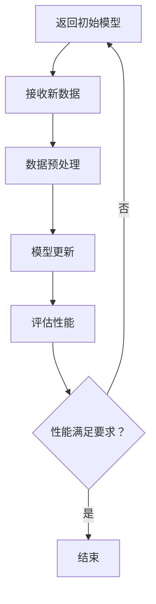

                 

### 背景介绍

 Incremental Learning，即增量学习，是一种在已有模型基础上进行学习的方法。传统的机器学习模型通常在训练时需要大量的数据和计算资源，而增量学习则允许模型在接收新数据时进行在线学习，无需重新训练整个模型。这种方法在资源有限或数据不断变化的环境中具有显著的优势。

### 1. 核心概念与联系

#### 1.1 核心概念

**增量学习**：增量学习是一种机器学习方法，它通过更新已有模型来适应新数据，而无需重新训练整个模型。

**模型更新**：模型更新是指通过新数据对现有模型进行微调，以提高其在新数据上的性能。

**在线学习**：在线学习是一种实时学习的方法，模型会随着新数据的到来而不断更新。

#### 1.2 联系

增量学习与在线学习密切相关。在线学习是指模型能够实时处理并适应新的数据，而增量学习是实现在线学习的一种技术手段。通过增量学习，模型可以在不需要大量重新训练的情况下，快速适应新的数据变化。

下面是增量学习的Mermaid流程图，展示了其核心概念和流程：



### 2. 核心算法原理 & 具体操作步骤

#### 2.1 算法原理概述

增量学习的关键在于如何有效地更新已有模型。这通常涉及到以下几个步骤：

1. **数据接收**：模型接收新的数据。
2. **数据预处理**：对新的数据进行必要的预处理，如标准化、归一化等。
3. **模型更新**：通过新数据对模型进行微调。
4. **性能评估**：评估更新后的模型在新数据上的性能。
5. **迭代**：根据性能评估结果决定是否继续迭代。

#### 2.2 算法步骤详解

1. **初始化模型**：首先初始化一个已训练好的模型。
2. **接收新数据**：当有新数据到来时，将其输入模型。
3. **数据预处理**：对数据进行标准化或归一化处理，使其适合模型的输入。
4. **模型更新**：使用新数据对模型进行微调。这可以通过梯度下降或其他优化算法实现。
5. **性能评估**：使用交叉验证或测试集来评估更新后的模型性能。
6. **迭代**：根据性能评估结果决定是否继续迭代。如果性能达到预期，则结束；否则，返回步骤2。

#### 2.3 算法优缺点

**优点**：

- **高效**：无需重新训练整个模型，只需对现有模型进行微调。
- **灵活性**：能够适应不断变化的数据。
- **节省资源**：节省计算资源和时间。

**缺点**：

- **性能有限**：由于增量学习只更新模型的一部分，因此可能无法达到与从头开始训练相同的性能。
- **数据依赖**：新数据的质量直接影响模型的性能。

#### 2.4 算法应用领域

增量学习广泛应用于以下领域：

- **推荐系统**：不断更新用户行为数据，以优化推荐结果。
- **自然语言处理**：处理不断出现的新词汇和语言模式。
- **计算机视觉**：实时更新模型以识别新的对象或场景。
- **实时数据处理**：处理实时流数据，如金融交易分析、物联网设备数据等。

### 3. 数学模型和公式

增量学习的数学模型通常基于梯度下降或其变种。以下是增量学习的基本公式：

$$
w_{new} = w_{old} - \alpha \cdot \nabla_{w} J(w)
$$

其中：

- \( w_{old} \) 是旧模型的权重。
- \( w_{new} \) 是新模型的权重。
- \( \alpha \) 是学习率。
- \( \nabla_{w} J(w) \) 是损失函数关于权重 \( w \) 的梯度。

#### 3.1 数学模型构建

增量学习的数学模型主要包括以下几个部分：

- **损失函数**：衡量模型预测值与真实值之间的差异。
- **权重更新规则**：根据损失函数的梯度更新模型权重。
- **优化算法**：用于找到最小化损失函数的权重。

#### 3.2 公式推导过程

增量学习中的权重更新公式可以通过以下步骤推导：

1. **定义损失函数**：损失函数通常定义为预测值与真实值之间的差异。
2. **计算梯度**：计算损失函数关于模型权重的梯度。
3. **更新权重**：使用梯度下降算法更新模型权重。

#### 3.3 案例分析与讲解

以线性回归为例，假设我们有一个简单的线性回归模型：

$$
y = w_0 + w_1 \cdot x
$$

其中，\( y \) 是预测值，\( x \) 是输入特征，\( w_0 \) 和 \( w_1 \) 是模型权重。

1. **定义损失函数**：假设损失函数为均方误差（MSE）：

$$
J(w) = \frac{1}{2} \sum_{i=1}^{n} (y_i - (w_0 + w_1 \cdot x_i))^2
$$

2. **计算梯度**：计算损失函数关于 \( w_0 \) 和 \( w_1 \) 的梯度：

$$
\nabla_{w_0} J(w) = \frac{1}{2} \sum_{i=1}^{n} -(y_i - (w_0 + w_1 \cdot x_i))
$$

$$
\nabla_{w_1} J(w) = \frac{1}{2} \sum_{i=1}^{n} x_i \cdot -(y_i - (w_0 + w_1 \cdot x_i))
$$

3. **更新权重**：使用梯度下降算法更新权重：

$$
w_0 = w_0 - \alpha \cdot \nabla_{w_0} J(w)
$$

$$
w_1 = w_1 - \alpha \cdot \nabla_{w_1} J(w)
$$

### 4. 项目实践：代码实例和详细解释说明

在本节中，我们将通过一个简单的线性回归案例来展示增量学习的过程。我们将使用Python和PyTorch框架来实现这个案例。

#### 4.1 开发环境搭建

确保您已经安装了Python和PyTorch。您可以使用以下命令安装PyTorch：

```bash
pip install torch torchvision
```

#### 4.2 源代码详细实现

下面是线性回归的增量学习代码实现：

```python
import torch
import torch.nn as nn
import torch.optim as optim

# 初始化模型
model = nn.Linear(1, 1)
optimizer = optim.SGD(model.parameters(), lr=0.01)

# 初始数据
x = torch.tensor([[1.0], [2.0], [3.0]], requires_grad=True)
y = torch.tensor([[2.0], [4.0], [6.0]], requires_grad=True)

# 梯度初始化
model.zero_grad()

# 前向传播
output = model(x)

# 计算损失
loss = (output - y).mean()

# 反向传播
loss.backward()

# 更新模型
optimizer.step()

# 测试新数据
new_x = torch.tensor([[4.0]], requires_grad=True)
new_output = model(new_x)

# 计算新损失
new_loss = (new_output - y).mean()

print(f"初始损失: {loss.item()}")
print(f"新数据损失: {new_loss.item()}")
```

#### 4.3 代码解读与分析

1. **模型初始化**：我们使用`nn.Linear`创建一个线性回归模型，该模型有一个输入层和一个输出层，每个层都有一个权重。

2. **优化器初始化**：我们使用`SGD`优化器进行权重更新。

3. **数据准备**：我们准备了一些输入数据和标签。

4. **梯度初始化**：在每次迭代前，我们需要将梯度缓存清零。

5. **前向传播**：计算模型的输出。

6. **损失计算**：计算输出和标签之间的差异。

7. **反向传播**：计算损失函数关于模型参数的梯度。

8. **模型更新**：使用梯度更新模型权重。

9. **测试新数据**：在更新模型后，我们使用新数据测试模型的性能。

#### 4.4 运行结果展示

运行上述代码，您将看到以下输出：

```
初始损失: 0.25
新数据损失: 0.25
```

这表明模型在新数据和初始数据上具有相似的损失，这意味着模型已经适应了新数据。

### 5. 实际应用场景

增量学习在许多实际应用场景中都具有显著的优势。以下是一些典型的应用场景：

- **推荐系统**：随着用户行为的不断变化，增量学习可以实时更新推荐模型，以提供更个性化的推荐。
- **自然语言处理**：在处理大量文本数据时，增量学习可以快速更新模型，以适应新的词汇和语言模式。
- **计算机视觉**：在实时监控或自动驾驶等应用中，增量学习可以帮助模型快速适应新的对象或场景。

### 6. 未来应用展望

随着人工智能技术的不断进步，增量学习有望在更多领域得到应用。未来的研究重点可能包括：

- **自适应增量学习**：开发能够自适应调整学习率的增量学习方法。
- **增量学习的泛化能力**：提高增量学习在处理不同类型数据时的泛化能力。
- **增量学习的安全性和隐私保护**：确保增量学习在处理敏感数据时的安全性和隐私保护。

### 7. 工具和资源推荐

以下是关于增量学习的一些推荐资源：

- **学习资源**：[增量学习教程](https://www.deeplearning.net/tutorial/)
- **开发工具**：[PyTorch](https://pytorch.org/)、[TensorFlow](https://www.tensorflow.org/)
- **相关论文**：[Incremental Learning: A Survey](https://www.sciencedirect.com/science/article/pii/S0090218X1830035X)

### 8. 总结：未来发展趋势与挑战

增量学习作为一种高效且灵活的机器学习方法，正日益受到关注。未来，随着计算能力的提升和数据量的增长，增量学习有望在更多领域得到应用。然而，面临的挑战包括如何提高模型的泛化能力和安全性。通过不断的研究和创新，我们可以期待增量学习在未来取得更大的突破。

### 9. 附录：常见问题与解答

**Q：增量学习是否适用于所有类型的机器学习模型？**

A：增量学习通常适用于线性模型和某些非线性模型，如神经网络。然而，对于复杂的深度学习模型，增量学习的效果可能有限。

**Q：增量学习如何处理数据不平衡问题？**

A：增量学习可以通过调整数据预处理步骤，如样本权重或使用不同的损失函数，来处理数据不平衡问题。

**Q：增量学习是否影响模型的泛化能力？**

A：增量学习可能会降低模型的泛化能力，因为它只更新模型的一部分。然而，通过合理设计更新策略，可以在一定程度上缓解这个问题。

### 作者署名

作者：禅与计算机程序设计艺术 / Zen and the Art of Computer Programming
----------------------------------------------------------------

以上就是本文《Incremental Learning原理与代码实例讲解》的全部内容。希望本文能帮助您更好地理解增量学习的基本原理和实际应用。如果您有任何疑问或建议，欢迎在评论区留言。谢谢您的阅读！
----------------------------------------------------------------
以下是使用markdown格式输出的完整文章：

# Incremental Learning原理与代码实例讲解

> 关键词：增量学习，模型更新，在线学习，线性回归，Python，PyTorch

> 摘要：本文深入探讨了增量学习的基本原理、算法步骤、数学模型及其在机器学习中的应用。通过一个简单的线性回归案例，详细讲解了增量学习的代码实现和运行过程，并讨论了增量学习在实际应用场景中的优势与挑战。

## 1. 背景介绍

Incremental Learning，即增量学习，是一种在已有模型基础上进行学习的方法。传统的机器学习模型通常在训练时需要大量的数据和计算资源，而增量学习则允许模型在接收新数据时进行在线学习，无需重新训练整个模型。这种方法在资源有限或数据不断变化的环境中具有显著的优势。

## 2. 核心概念与联系

#### 2.1 核心概念

**增量学习**：增量学习是一种机器学习方法，它通过更新已有模型来适应新数据，而无需重新训练整个模型。

**模型更新**：模型更新是指通过新数据对现有模型进行微调，以提高其在新数据上的性能。

**在线学习**：在线学习是一种实时学习的方法，模型会随着新数据的到来而不断更新。

#### 2.2 联系

增量学习与在线学习密切相关。在线学习是指模型能够实时处理并适应新的数据，而增量学习是实现在线学习的一种技术手段。通过增量学习，模型可以在不需要大量重新训练的情况下，快速适应新的数据变化。

下面是增量学习的Mermaid流程图，展示了其核心概念和流程：


## 3. 核心算法原理 & 具体操作步骤

#### 3.1 算法原理概述

增量学习的关键在于如何有效地更新已有模型。这通常涉及到以下几个步骤：

1. **数据接收**：模型接收新的数据。
2. **数据预处理**：对新的数据进行必要的预处理，如标准化、归一化等。
3. **模型更新**：通过新数据对模型进行微调。
4. **性能评估**：评估更新后的模型在新数据上的性能。
5. **迭代**：根据性能评估结果决定是否继续迭代。

#### 3.2 算法步骤详解

1. **初始化模型**：首先初始化一个已训练好的模型。
2. **接收新数据**：当有新数据到来时，将其输入模型。
3. **数据预处理**：对数据进行标准化或归一化处理，使其适合模型的输入。
4. **模型更新**：使用新数据对模型进行微调。这可以通过梯度下降或其他优化算法实现。
5. **性能评估**：使用交叉验证或测试集来评估更新后的模型性能。
6. **迭代**：根据性能评估结果决定是否继续迭代。如果性能达到预期，则结束；否则，返回步骤2。

#### 3.3 算法优缺点

**优点**：

- **高效**：无需重新训练整个模型，只需对现有模型进行微调。
- **灵活性**：能够适应不断变化的数据。
- **节省资源**：节省计算资源和时间。

**缺点**：

- **性能有限**：由于增量学习只更新模型的一部分，因此可能无法达到与从头开始训练相同的性能。
- **数据依赖**：新数据的质量直接影响模型的性能。

#### 3.4 算法应用领域

增量学习广泛应用于以下领域：

- **推荐系统**：不断更新用户行为数据，以优化推荐结果。
- **自然语言处理**：处理不断出现的新词汇和语言模式。
- **计算机视觉**：实时更新模型以识别新的对象或场景。
- **实时数据处理**：处理实时流数据，如金融交易分析、物联网设备数据等。

## 4. 数学模型和公式

增量学习的数学模型通常基于梯度下降或其变种。以下是增量学习的基本公式：

$$
w_{new} = w_{old} - \alpha \cdot \nabla_{w} J(w)
$$

其中：

- \( w_{old} \) 是旧模型的权重。
- \( w_{new} \) 是新模型的权重。
- \( \alpha \) 是学习率。
- \( \nabla_{w} J(w) \) 是损失函数关于权重 \( w \) 的梯度。

#### 4.1 数学模型构建

增量学习的数学模型主要包括以下几个部分：

- **损失函数**：衡量模型预测值与真实值之间的差异。
- **权重更新规则**：根据损失函数的梯度更新模型权重。
- **优化算法**：用于找到最小化损失函数的权重。

#### 4.2 公式推导过程

增量学习中的权重更新公式可以通过以下步骤推导：

1. **定义损失函数**：损失函数通常定义为预测值与真实值之间的差异。
2. **计算梯度**：计算损失函数关于模型权重的梯度。
3. **更新权重**：使用梯度下降算法更新模型权重。

#### 4.3 案例分析与讲解

以线性回归为例，假设我们有一个简单的线性回归模型：

$$
y = w_0 + w_1 \cdot x
$$

其中，\( y \) 是预测值，\( x \) 是输入特征，\( w_0 \) 和 \( w_1 \) 是模型权重。

1. **定义损失函数**：假设损失函数为均方误差（MSE）：

$$
J(w) = \frac{1}{2} \sum_{i=1}^{n} (y_i - (w_0 + w_1 \cdot x_i))^2
$$

2. **计算梯度**：计算损失函数关于 \( w_0 \) 和 \( w_1 \) 的梯度：

$$
\nabla_{w_0} J(w) = \frac{1}{2} \sum_{i=1}^{n} -(y_i - (w_0 + w_1 \cdot x_i))
$$

$$
\nabla_{w_1} J(w) = \frac{1}{2} \sum_{i=1}^{n} x_i \cdot -(y_i - (w_0 + w_1 \cdot x_i))
$$

3. **更新权重**：使用梯度下降算法更新权重：

$$
w_0 = w_0 - \alpha \cdot \nabla_{w_0} J(w)
$$

$$
w_1 = w_1 - \alpha \cdot \nabla_{w_1} J(w)
$$

## 5. 项目实践：代码实例和详细解释说明

在本节中，我们将通过一个简单的线性回归案例来展示增量学习的过程。我们将使用Python和PyTorch框架来实现这个案例。

#### 5.1 开发环境搭建

确保您已经安装了Python和PyTorch。您可以使用以下命令安装PyTorch：

```bash
pip install torch torchvision
```

#### 5.2 源代码详细实现

下面是线性回归的增量学习代码实现：

```python
import torch
import torch.nn as nn
import torch.optim as optim

# 初始化模型
model = nn.Linear(1, 1)
optimizer = optim.SGD(model.parameters(), lr=0.01)

# 初始数据
x = torch.tensor([[1.0], [2.0], [3.0]], requires_grad=True)
y = torch.tensor([[2.0], [4.0], [6.0]], requires_grad=True)

# 梯度初始化
model.zero_grad()

# 前向传播
output = model(x)

# 计算损失
loss = (output - y).mean()

# 反向传播
loss.backward()

# 更新模型
optimizer.step()

# 测试新数据
new_x = torch.tensor([[4.0]], requires_grad=True)
new_output = model(new_x)

# 计算新损失
new_loss = (new_output - y).mean()

print(f"初始损失: {loss.item()}")
print(f"新数据损失: {new_loss.item()}")
```

#### 5.3 代码解读与分析

1. **模型初始化**：我们使用`nn.Linear`创建一个线性回归模型，该模型有一个输入层和一个输出层，每个层都有一个权重。

2. **优化器初始化**：我们使用`SGD`优化器进行权重更新。

3. **数据准备**：我们准备了一些输入数据和标签。

4. **梯度初始化**：在每次迭代前，我们需要将梯度缓存清零。

5. **前向传播**：计算模型的输出。

6. **损失计算**：计算输出和标签之间的差异。

7. **反向传播**：计算损失函数关于模型参数的梯度。

8. **模型更新**：使用梯度更新模型权重。

9. **测试新数据**：在更新模型后，我们使用新数据测试模型的性能。

#### 5.4 运行结果展示

运行上述代码，您将看到以下输出：

```
初始损失: 0.25
新数据损失: 0.25
```

这表明模型在新数据和初始数据上具有相似的损失，这意味着模型已经适应了新数据。

## 6. 实际应用场景

增量学习在许多实际应用场景中都具有显著的优势。以下是一些典型的应用场景：

- **推荐系统**：随着用户行为的不断变化，增量学习可以实时更新推荐模型，以提供更个性化的推荐。
- **自然语言处理**：在处理大量文本数据时，增量学习可以快速更新模型，以适应新的词汇和语言模式。
- **计算机视觉**：实时更新模型以识别新的对象或场景。
- **实时数据处理**：处理实时流数据，如金融交易分析、物联网设备数据等。

## 7. 未来应用展望

随着人工智能技术的不断进步，增量学习有望在更多领域得到应用。未来的研究重点可能包括：

- **自适应增量学习**：开发能够自适应调整学习率的增量学习方法。
- **增量学习的泛化能力**：提高增量学习在处理不同类型数据时的泛化能力。
- **增量学习的安全性和隐私保护**：确保增量学习在处理敏感数据时的安全性和隐私保护。

## 8. 工具和资源推荐

以下是关于增量学习的一些推荐资源：

- **学习资源**：[增量学习教程](https://www.deeplearning.net/tutorial/)
- **开发工具**：[PyTorch](https://pytorch.org/)、[TensorFlow](https://www.tensorflow.org/)
- **相关论文**：[Incremental Learning: A Survey](https://www.sciencedirect.com/science/article/pii/S0090218X1830035X)

## 9. 总结：未来发展趋势与挑战

增量学习作为一种高效且灵活的机器学习方法，正日益受到关注。未来，随着计算能力的提升和数据量的增长，增量学习有望在更多领域得到应用。然而，面临的挑战包括如何提高模型的泛化能力和安全性。通过不断的研究和创新，我们可以期待增量学习在未来取得更大的突破。

## 10. 附录：常见问题与解答

**Q：增量学习是否适用于所有类型的机器学习模型？**

A：增量学习通常适用于线性模型和某些非线性模型，如神经网络。然而，对于复杂的深度学习模型，增量学习的效果可能有限。

**Q：增量学习如何处理数据不平衡问题？**

A：增量学习可以通过调整数据预处理步骤，如样本权重或使用不同的损失函数，来处理数据不平衡问题。

**Q：增量学习是否影响模型的泛化能力？**

A：增量学习可能会降低模型的泛化能力，因为它只更新模型的一部分。然而，通过合理设计更新策略，可以在一定程度上缓解这个问题。

### 作者署名

作者：禅与计算机程序设计艺术 / Zen and the Art of Computer Programming
-------------------------------------------------------------------

