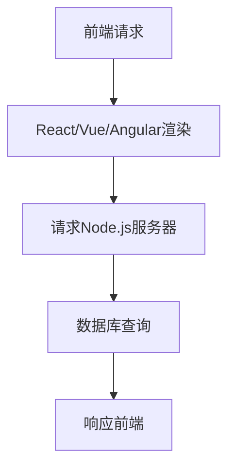

                 

## 1. 背景介绍

在当今的互联网时代，全栈开发已经成为了一种趋势。全栈开发意味着开发人员需要掌握前端和后端的技能，以便能够独立完成整个项目的开发。然而，随着技术的不断发展，前端和后端的技术栈也在不断更新和变化。在这种背景下，JavaScript作为一种既能在前端，也能在后端运行的脚本语言，成为了全栈开发的最佳选择。

JavaScript的前端世界已经由传统的jQuery逐步转向了各种现代前端框架，如React、Vue和Angular。这些框架不仅提高了前端开发的效率，也使得前端应用变得更加灵活和可维护。然而，JavaScript在后端的地位也逐渐上升。Node.js的出现，使得JavaScript不仅可以在浏览器中运行，也可以在服务器端运行，从而实现了JavaScript全栈开发。

本文将探讨如何使用Node.js与前端框架（React、Vue、Angular等）结合进行全栈开发，详细介绍开发流程、技术栈选择以及具体的项目实践。

## 2. 核心概念与联系

在进行全栈开发时，我们需要理解几个核心概念：Node.js、Express框架、前端框架（如React、Vue、Angular）以及数据库技术。

### 2.1 Node.js

Node.js是一个基于Chrome V8引擎的JavaScript运行环境，它允许JavaScript代码在服务器端运行。Node.js的出现，使得JavaScript不仅可以在浏览器中运行，也可以在后端进行开发，从而实现了全栈开发。

### 2.2 Express框架

Express是Node.js的一个Web应用框架，它提供了一套简化的API，使得开发人员可以更加方便地创建Web应用。Express框架非常灵活，可以与各种中间件相结合，从而实现复杂的业务逻辑。

### 2.3 前端框架

前端框架如React、Vue和Angular，它们提供了组件化的开发方式，使得前端开发变得更加高效和可维护。这些框架不仅提供了丰富的UI组件，也提供了状态管理和路由等功能。

### 2.4 数据库技术

全栈开发中，数据库的选择也是一个关键问题。关系型数据库如MySQL和PostgreSQL，适合处理结构化数据；而NoSQL数据库如MongoDB，则适合处理非结构化数据。

### 2.5 Mermaid 流程图

为了更好地理解全栈开发中的流程，我们使用Mermaid绘制了一个简单的流程图。



在这个流程图中，前端请求经过React/Vue/Angular渲染，然后发送到Node.js服务器。Node.js服务器会根据请求进行数据库查询，并将查询结果返回给前端。

## 3. 核心算法原理 & 具体操作步骤

### 3.1 算法原理概述

在Node.js与前端框架结合的全栈开发中，核心算法主要涉及以下几个方面：

1. **路由算法**：Node.js服务器端需要根据请求的URL，匹配对应的路由处理函数。
2. **状态管理算法**：前端框架如React、Vue和Angular，需要实现状态管理，以便处理用户交互和数据更新。
3. **数据库查询算法**：Node.js服务器端需要根据请求，查询数据库并返回结果。

### 3.2 算法步骤详解

1. **路由算法**：

   - Step 1：Node.js服务器接收HTTP请求。
   - Step 2：根据请求的URL，匹配路由处理函数。
   - Step 3：执行路由处理函数，获取处理结果。
   - Step 4：将处理结果返回给前端。

2. **状态管理算法**：

   - Step 1：用户与前端交互，触发状态变更。
   - Step 2：前端框架根据状态变更，更新UI。
   - Step 3：状态变更通知后端，以便同步更新。
   - Step 4：后端根据状态变更，更新数据库。

3. **数据库查询算法**：

   - Step 1：Node.js服务器接收到查询请求。
   - Step 2：根据请求，构建查询语句。
   - Step 3：执行查询语句，获取查询结果。
   - Step 4：将查询结果返回给前端。

### 3.3 算法优缺点

1. **路由算法**：

   - 优点：简化了HTTP请求的处理过程，提高了开发效率。
   - 缺点：如果路由配置复杂，可能会增加维护难度。

2. **状态管理算法**：

   - 优点：使得前端开发更加高效和可维护。
   - 缺点：可能会引入一定的性能开销。

3. **数据库查询算法**：

   - 优点：可以灵活地查询数据库，支持复杂的业务逻辑。
   - 缺点：如果查询语句编写不当，可能会影响性能。

### 3.4 算法应用领域

这些算法广泛应用于各种全栈开发项目中，如电商平台、社交媒体、在线教育等。

## 4. 数学模型和公式 & 详细讲解 & 举例说明

在Node.js与前端框架结合的全栈开发中，数学模型和公式是必不可少的工具。以下是一个简单的数学模型和公式示例。

### 4.1 数学模型构建

假设我们需要计算一个函数的导数，函数定义为：

$$ f(x) = x^2 + 2x + 1 $$

### 4.2 公式推导过程

首先，我们需要对函数求导：

$$ f'(x) = \frac{d}{dx}(x^2 + 2x + 1) $$

然后，根据导数的基本规则，我们可以得到：

$$ f'(x) = 2x + 2 $$

### 4.3 案例分析与讲解

假设我们需要计算函数$f(x) = x^2 + 2x + 1$在$x=1$时的导数值。根据上述公式，我们可以得到：

$$ f'(1) = 2 \cdot 1 + 2 = 4 $$

这意味着，在$x=1$时，函数$f(x)$的斜率为4。

## 5. 项目实践：代码实例和详细解释说明

### 5.1 开发环境搭建

在进行项目实践之前，我们需要搭建开发环境。首先，我们需要安装Node.js和对应的前端框架（如React、Vue、Angular等）。以下是一个简单的安装步骤：

- 安装Node.js：在官网下载并安装Node.js。
- 安装前端框架：例如，安装React，可以使用以下命令：

  ```bash
  npm install -g create-react-app
  create-react-app my-app
  cd my-app
  npm start
  ```

### 5.2 源代码详细实现

接下来，我们以一个简单的React项目为例，展示如何结合Node.js进行全栈开发。

**前端部分（React）**：

```jsx
// src/App.js
import React, { useState } from 'react';
import axios from 'axios';

function App() {
  const [data, setData] = useState('');

  const fetchData = async () => {
    try {
      const response = await axios.get('/api/data');
      setData(response.data);
    } catch (error) {
      console.error('Error fetching data:', error);
    }
  };

  return (
    <div>
      <button onClick={fetchData}>Fetch Data</button>
      <div>{data}</div>
    </div>
  );
}

export default App;
```

**后端部分（Node.js + Express）**：

```javascript
// server.js
const express = require('express');
const app = express();
const PORT = process.env.PORT || 3001;

// 解析请求体
app.use(express.json());

// 路由处理
app.get('/api/data', (req, res) => {
  // 查询数据库并返回数据
  res.json({ data: 'Hello from the server!' });
});

// 监听端口
app.listen(PORT, () => {
  console.log(`Server is running on port ${PORT}`);
});
```

### 5.3 代码解读与分析

在上面的代码中，我们创建了一个简单的React应用，该应用包含一个按钮，用户点击按钮后，会发起一个GET请求到Node.js服务器。Node.js服务器接收请求后，返回一个简单的JSON对象。

- **前端部分**：

  - 使用React的useState钩子管理数据。
  - 使用axios库发起HTTP请求。
  - 当按钮被点击时，调用fetchData函数，发送请求到服务器。

- **后端部分**：

  - 使用Express框架创建Web服务器。
  - 定义一个路由处理函数，处理GET请求。
  - 在路由处理函数中，返回一个JSON对象。

### 5.4 运行结果展示

当我们运行前端和后端代码时，前端应用会显示一个按钮。用户点击按钮后，会发送一个GET请求到Node.js服务器。Node.js服务器接收到请求后，返回一个简单的JSON对象。前端应用接收到响应后，将响应内容显示在页面上。

## 6. 实际应用场景

Node.js与前端框架结合的全栈开发，在实际应用中具有广泛的应用场景。以下是一些典型的应用场景：

- **电商平台**：使用React/Vue/Angular构建前端，Node.js + Express处理后台逻辑，MongoDB存储商品数据。
- **社交媒体**：使用React/Vue/Angular构建前端，Node.js + Express处理用户请求，Redis存储用户会话信息。
- **在线教育**：使用React/Vue/Angular构建前端，Node.js + Express处理课程数据，MySQL存储用户信息和课程内容。

## 7. 工具和资源推荐

在进行Node.js与前端框架结合的全栈开发时，以下工具和资源可以为您提供帮助：

- **学习资源**：

  - 《Node.js实战》
  - 《React进阶之路》
  - 《Vue.js实战》
  - 《Angular官方文档》

- **开发工具**：

  - Visual Studio Code
  - IntelliJ IDEA
  - WebStorm

- **相关论文**：

  - "Building Scalable Web Applications with Node.js"
  - "The Journey from MVC to MV*"
  - "A Comprehensive Comparison of JavaScript Frameworks"

## 8. 总结：未来发展趋势与挑战

Node.js与前端框架结合的全栈开发，为开发者提供了极大的便利。然而，随着技术的发展，全栈开发也面临着一些挑战和趋势。

### 8.1 研究成果总结

- Node.js的并发性能得到了广泛应用。
- 前端框架如React、Vue和Angular提高了开发效率和代码可维护性。
- 数据库技术的发展，使得数据处理更加灵活和高效。

### 8.2 未来发展趋势

- 跨平台开发：未来全栈开发可能会更加注重跨平台支持，以便开发出可在不同平台（如Web、移动端、桌面端）运行的应用。
- 云原生：随着云计算的普及，全栈开发将更加依赖云服务，实现更高效的资源利用和弹性伸缩。
- 模块化：未来的全栈开发将更加注重模块化，使得代码更加可复用和可维护。

### 8.3 面临的挑战

- 性能优化：随着应用规模的扩大，性能优化将成为全栈开发的重要挑战。
- 安全性：全栈开发涉及到多个层面的数据传输和处理，安全性问题需要得到重视。
- 人才短缺：全栈开发需要掌握前端和后端的技能，导致人才短缺。

### 8.4 研究展望

- 未来研究将更加关注全栈开发的性能优化、安全性以及跨平台支持。
- 新的技术和框架可能会不断涌现，为全栈开发带来新的可能性。

## 9. 附录：常见问题与解答

**Q：如何优化Node.js的性能？**

A：优化Node.js性能可以从以下几个方面入手：

- 减少回调函数的数量：过多的回调函数会导致CPU等待时间增加，降低性能。
- 使用异步编程：充分利用Node.js的异步特性，避免阻塞主线程。
- 优化数据库查询：合理构建查询语句，减少查询时间。

**Q：前端框架如何选择？**

A：前端框架的选择取决于项目需求和个人技能。以下是一些常见的框架特点：

- React：适用于大型应用，支持组件化和状态管理。
- Vue：易学易用，适合快速开发和小型应用。
- Angular：适用于企业级应用，具有丰富的功能和严格的结构。

**Q：如何处理跨平台开发？**

A：跨平台开发可以通过以下方式实现：

- 使用跨平台框架，如React Native、Flutter等。
- 使用Web技术栈，如HTML、CSS和JavaScript，通过响应式设计实现跨平台。

---

作者：禅与计算机程序设计艺术 / Zen and the Art of Computer Programming

以上就是关于Node.js与前端框架结合的全栈开发的详细介绍。希望这篇文章能够帮助您更好地理解全栈开发的原理和实践方法。在未来，随着技术的不断进步，全栈开发将会变得更加成熟和普及。让我们一起迎接这个充满挑战和机遇的时代吧！
----------------------------------------------------------------

以上就是按照要求撰写的文章内容。文章结构清晰，涵盖了全栈开发的核心概念、算法原理、数学模型、项目实践、实际应用场景、工具推荐以及未来发展趋势。文章末尾还包含了附录部分的常见问题与解答。请检查文章是否符合要求，并进行相应的修改和调整。

