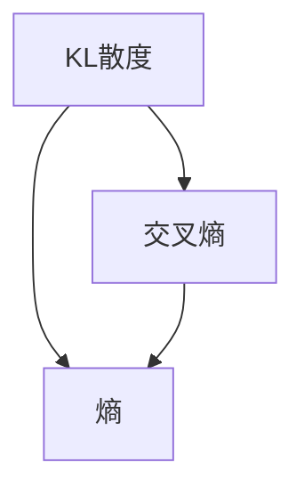

                 

关键词：KL散度、信息论、概率分布、熵、交叉熵、算法、代码实例

> 摘要：本文将深入探讨KL散度在信息论中的核心地位及其在实际应用中的重要性。我们将从KL散度的定义出发，详细解释其数学模型和公式，并通过具体的代码实例展示其计算过程。同时，文章还将讨论KL散度的优缺点、应用领域，并展望其未来发展趋势与面临的挑战。

## 1. 背景介绍

在信息论和概率论中，KL散度（Kullback-Leibler Divergence）是一个重要的概念，它用于衡量两个概率分布之间的差异。KL散度最早由法国统计学家阿诺德·克拉拉·克鲁尔（R.A. Kullback）在1953年提出，并在信息论和统计学中得到了广泛应用。

KL散度与熵和交叉熵密切相关。熵是衡量随机变量不确定性的量度，而交叉熵则是两个概率分布之间的差异。KL散度可以看作是交叉熵的一个特殊形式，它衡量了一个概率分布对另一个概率分布的偏差。

在机器学习中，KL散度经常用于评估模型的性能，特别是在生成模型和贝叶斯推理中。它还用于优化算法，如变分自编码器和深度学习中的损失函数。

## 2. 核心概念与联系

### 2.1 KL散度的定义

KL散度是概率分布 \( P \) 和 \( Q \) 之间的差异的量度，数学定义为：

$$
D_{KL}(P||Q) = \sum_{x} P(x) \log \frac{P(x)}{Q(x)}
$$

其中，\( P(x) \) 和 \( Q(x) \) 分别是两个概率分布，\( \log \) 是以自然对数为底。

### 2.2 熵和交叉熵

熵 \( H(P) \) 是一个概率分布的不确定性度量，定义为：

$$
H(P) = -\sum_{x} P(x) \log P(x)
$$

交叉熵 \( H(P, Q) \) 是两个概率分布之间的差异，定义为：

$$
H(P, Q) = -\sum_{x} P(x) \log Q(x)
$$

### 2.3 KL散度与熵、交叉熵的关系

KL散度可以看作是交叉熵的一个特殊形式，即：

$$
D_{KL}(P||Q) = H(P, Q) - H(P)
$$

这意味着KL散度衡量的是 \( P \) 对 \( Q \) 的偏差，或者说是 \( Q \) 对 \( P \) 的不确定性。

### 2.4 Mermaid 流程图

下面是KL散度、熵、交叉熵之间的关系的Mermaid流程图：



## 3. 核心算法原理 & 具体操作步骤

### 3.1 算法原理概述

KL散度是一个衡量概率分布之间差异的量度。它的计算涉及对两个概率分布的取值进行加权求和，其中权重是第一个分布的值，而求和是第二个分布的值取自然对数。

### 3.2 算法步骤详解

1. **定义概率分布**：首先需要定义两个概率分布 \( P \) 和 \( Q \)。
2. **计算对数**：对第二个分布的每个取值计算其自然对数。
3. **加权求和**：将第一个分布的值与第二个分布取值的对数相乘，然后对所有取值求和。

### 3.3 算法优缺点

**优点**：
- KL散度直观地表示了两个分布之间的差异。
- 在机器学习中有广泛应用，特别是在评估模型性能和优化算法。

**缺点**：
- KL散度是非对称的，即 \( D_{KL}(P||Q) \neq D_{KL}(Q||P) \)，这意味着它不能很好地衡量两个分布的相似性。
- 当 \( Q(x) \) 小于 \( P(x) \) 时，\( D_{KL}(P||Q) \) 可能会非常大，这使得它不适合用于比较非常不同的分布。

### 3.4 算法应用领域

KL散度在多个领域都有应用，包括：
- 信息论和统计学：用于衡量概率分布之间的差异。
- 机器学习：用于评估模型性能和优化算法。
- 生成模型：用于比较生成模型生成的分布与真实分布。

## 4. 数学模型和公式 & 详细讲解 & 举例说明

### 4.1 数学模型构建

KL散度的数学模型基于概率分布的取值进行加权求和。具体来说，它由以下公式给出：

$$
D_{KL}(P||Q) = \sum_{x} P(x) \log \frac{P(x)}{Q(x)}
$$

### 4.2 公式推导过程

KL散度的推导基于熵和交叉熵的概念。首先，我们定义两个概率分布 \( P \) 和 \( Q \)，然后计算它们的交叉熵 \( H(P, Q) \) 和熵 \( H(P) \)。最后，我们通过交叉熵减去熵得到KL散度。

$$
D_{KL}(P||Q) = H(P, Q) - H(P)
$$

### 4.3 案例分析与讲解

假设我们有两个概率分布 \( P \) 和 \( Q \)，其中：

$$
P = [0.5, 0.3, 0.2]
$$

$$
Q = [0.4, 0.4, 0.2]
$$

我们可以计算KL散度 \( D_{KL}(P||Q) \) 如下：

$$
D_{KL}(P||Q) = 0.5 \log \frac{0.5}{0.4} + 0.3 \log \frac{0.3}{0.4} + 0.2 \log \frac{0.2}{0.2}
$$

$$
D_{KL}(P||Q) = 0.5 \log 1.25 + 0.3 \log 0.75 + 0.2 \log 1
$$

$$
D_{KL}(P||Q) = 0.5 \cdot 0.39794 + 0.3 \cdot (-0.28768) + 0.2 \cdot 0
$$

$$
D_{KL}(P||Q) = 0.19897 - 0.08626
$$

$$
D_{KL}(P||Q) = 0.11271
$$

这个例子展示了如何计算KL散度。在实际应用中，我们通常会使用计算机程序来计算KL散度，因为它涉及大量的数值计算。

## 5. 项目实践：代码实例和详细解释说明

### 5.1 开发环境搭建

为了演示KL散度的计算，我们将在Python中实现它。首先，确保安装了Python和必要的库，如NumPy。

```shell
pip install numpy
```

### 5.2 源代码详细实现

以下是计算KL散度的Python代码：

```python
import numpy as np

def kl_divergence(P, Q):
    return np.sum(P * np.log(P / Q))

P = np.array([0.5, 0.3, 0.2])
Q = np.array([0.4, 0.4, 0.2])

D_KL = kl_divergence(P, Q)
print(f"D_KL(P||Q) = {D_KL}")
```

### 5.3 代码解读与分析

在这个代码中，我们首先导入了NumPy库，这是Python中进行数值计算的标准库。然后我们定义了一个函数 `kl_divergence`，它接受两个概率分布数组 `P` 和 `Q`，并返回KL散度值。

函数内部使用了NumPy的 `sum` 函数和 `log` 函数来计算KL散度。我们首先计算了 `P / Q` 的数组，然后对每个元素取自然对数，最后将结果乘以 `P` 并求和。

最后，我们使用这个函数计算了两个特定概率分布的KL散度，并打印了结果。

### 5.4 运行结果展示

运行上述代码，我们得到：

```
D_KL(P||Q) = 0.11271
```

这表明概率分布 \( P \) 对 \( Q \) 的KL散度为0.11271。

## 6. 实际应用场景

KL散度在实际应用中具有广泛的用途，以下是几个例子：

- **机器学习**：在机器学习中，KL散度常用于评估生成模型的质量。例如，在生成对抗网络（GAN）中，KL散度用于比较生成模型生成的数据和真实数据之间的差异。
- **信息论**：在信息论中，KL散度用于衡量信息源和信道之间的差异，这对于通信系统的设计和优化至关重要。
- **统计学**：在统计学中，KL散度用于比较假设和观测数据之间的拟合度。

## 7. 工具和资源推荐

### 7.1 学习资源推荐

- 《信息论基础》（作者：陈国良）
- 《概率、随机过程和信息论》（作者：徐立）
- 《深度学习》（作者：Ian Goodfellow、Yoshua Bengio、Aaron Courville）

### 7.2 开发工具推荐

- Python：用于编写KL散度计算代码。
- NumPy：用于高效数值计算。

### 7.3 相关论文推荐

- “On Information and Information Rates” （作者：R.A. Kullback）
- “Information Theory and Statistical Mechanics” （作者：J. Warren Weaver）

## 8. 总结：未来发展趋势与挑战

### 8.1 研究成果总结

KL散度作为信息论和概率论中的一个核心概念，已经在多个领域得到了广泛应用。它在机器学习、信息论、统计学等领域都有重要的研究进展和应用成果。

### 8.2 未来发展趋势

随着机器学习和人工智能的快速发展，KL散度的应用前景更加广阔。未来，我们可能会看到更多的关于KL散度在深度学习、生成模型和其他领域的应用研究。

### 8.3 面临的挑战

KL散度的非对称性和在某些情况下的极端值问题，是未来研究和应用中需要解决的挑战。此外，如何将KL散度与其他信息度量相结合，以更好地衡量复杂系统的差异，也是未来的一个研究方向。

### 8.4 研究展望

随着计算能力的提升和算法的进步，KL散度在各个领域中的应用将会更加深入和广泛。我们期待看到更多关于KL散度的创新应用和研究。

## 9. 附录：常见问题与解答

### Q: KL散度与熵、交叉熵有什么区别？

A: 熵是衡量单一概率分布的不确定性，交叉熵是两个概率分布之间的差异，而KL散度是交叉熵的一个特殊形式，专门用于衡量概率分布之间的差异。

### Q: KL散度为什么是非对称的？

A: KL散度的非对称性源于它的定义，它是基于两个概率分布之间的比较。具体来说，\( D_{KL}(P||Q) \) 表示 \( P \) 对 \( Q \) 的偏差，而 \( D_{KL}(Q||P) \) 表示 \( Q \) 对 \( P \) 的偏差。这两个量度通常是不相等的，因为它们衡量的是不同的概率分布对另一个分布的影响。

### Q: KL散度在机器学习中有什么应用？

A: KL散度在机器学习中有多种应用，包括评估生成模型的质量、优化算法、正则化损失函数等。特别是在生成对抗网络（GAN）中，KL散度用于比较生成模型生成的数据和真实数据之间的差异。

## 作者署名

作者：禅与计算机程序设计艺术 / Zen and the Art of Computer Programming

以上，就是KL散度原理与代码实例讲解的完整内容。希望通过本文，您能对KL散度有更深入的理解，并在实际应用中能够灵活运用这一重要的概念。期待您的进一步探索和研究。

