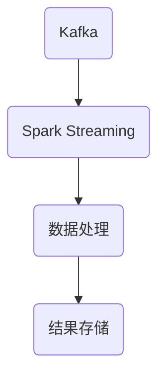

                 

关键词：Kafka、Spark Streaming、整合、原理、代码实例

摘要：本文旨在深入讲解Kafka与Spark Streaming的整合原理，通过详细的代码实例，展示如何高效实现大数据实时处理。文章首先介绍Kafka和Spark Streaming的基本概念和架构，接着探讨两者的整合机制，最后通过具体实例说明如何在实际项目中运用。

## 1. 背景介绍

在大数据时代，实时处理数据流的能力变得越来越重要。Kafka是一个分布式流处理平台，它能够高效地处理大量的消息，并提供高吞吐量、可靠的消息传递服务。而Spark Streaming是基于Apache Spark的一个实时数据流处理系统，它能够对数据进行实时处理和分析。

Kafka和Spark Streaming的整合，能够充分利用两者的优势，实现大规模数据的实时处理。Kafka作为数据源，可以收集来自各种系统的实时数据，而Spark Streaming则可以对这些数据进行实时处理和分析，从而帮助企业快速响应业务需求。

## 2. 核心概念与联系

### 2.1 Kafka

Kafka是一个分布式流处理平台，它由LinkedIn公司开发，后捐赠给Apache基金会。Kafka的主要功能包括：

- **消息队列**：Kafka提供了一个高吞吐量的消息队列，可以处理大量的数据。
- **分布式系统**：Kafka是一个分布式系统，可以在多个服务器上运行，提供高可用性和扩展性。
- **持久化存储**：Kafka将消息持久化存储在磁盘上，确保数据的可靠性和持久性。

### 2.2 Spark Streaming

Spark Streaming是Apache Spark的一个组件，它提供了实时数据流处理的能力。Spark Streaming的主要特点包括：

- **微批处理**：Spark Streaming采用微批处理的方式处理数据流，每个批次的时间间隔可以配置。
- **高吞吐量**：Spark Streaming通过使用内存计算，提供了高效的实时数据处理能力。
- **可扩展性**：Spark Streaming可以轻松扩展，以处理更大的数据流。

### 2.3 整合机制

Kafka与Spark Streaming的整合主要通过以下方式实现：

- **数据流传输**：Kafka作为数据源，将数据推送到Spark Streaming。
- **微批处理**：Spark Streaming以微批处理的方式对Kafka中的数据进行实时处理。
- **容错机制**：Kafka和Spark Streaming都提供了容错机制，确保数据处理的可靠性。

### 2.4 Mermaid 流程图

下面是Kafka与Spark Streaming整合的Mermaid流程图：



## 3. 核心算法原理 & 具体操作步骤

### 3.1 算法原理概述

Kafka与Spark Streaming的整合主要基于以下原理：

- **消息队列**：Kafka作为消息队列，提供了高效的数据传输机制。
- **微批处理**：Spark Streaming以微批处理的方式对数据进行实时处理。
- **容错机制**：Kafka和Spark Streaming都提供了容错机制，确保数据处理过程的可靠性。

### 3.2 算法步骤详解

1. **配置Kafka**：首先，需要配置Kafka，包括创建主题、设置分区和副本数量等。
2. **启动Kafka服务**：启动Kafka服务，确保其正常运行。
3. **配置Spark Streaming**：配置Spark Streaming，包括设置批处理时间间隔、连接Kafka等。
4. **启动Spark Streaming**：启动Spark Streaming，开始接收Kafka中的数据。
5. **数据处理**：对接收到的数据进行处理，包括清洗、转换和计算等。
6. **结果存储**：将处理后的结果存储到数据库或其他存储系统中。

### 3.3 算法优缺点

**优点**：

- **高吞吐量**：Kafka和Spark Streaming都能够处理大量的数据，提供了高效的实时数据处理能力。
- **高可用性**：Kafka和Spark Streaming都提供了容错机制，确保数据处理过程的可靠性。
- **可扩展性**：Kafka和Spark Streaming都可以轻松扩展，以处理更大的数据流。

**缺点**：

- **复杂度**：Kafka和Spark Streaming的配置和整合相对复杂，需要一定的技术背景。
- **性能消耗**：虽然Kafka和Spark Streaming都提供了高效的实时数据处理能力，但仍然存在一定的性能消耗。

### 3.4 算法应用领域

Kafka与Spark Streaming的整合可以应用于以下领域：

- **实时数据分析**：对实时数据进行实时处理和分析，如电商网站的实时交易数据分析。
- **实时监控**：实时监控系统的运行状态，如IT运维监控。
- **实时推荐**：基于实时数据流进行实时推荐，如搜索引擎的实时搜索结果推荐。

## 4. 数学模型和公式 & 详细讲解 & 举例说明

### 4.1 数学模型构建

在Kafka与Spark Streaming的整合中，主要涉及以下数学模型：

- **消息传输速率**：\( R = \frac{N}{T} \)，其中\( N \)是单位时间内传输的消息数量，\( T \)是传输时间。
- **数据处理速率**：\( P = \frac{M}{S} \)，其中\( M \)是单位时间内处理的数据量，\( S \)是处理时间。

### 4.2 公式推导过程

1. **消息传输速率**：假设单位时间内传输的消息数量为\( N \)，传输时间为\( T \)，则消息传输速率为\( R = \frac{N}{T} \)。
2. **数据处理速率**：假设单位时间内处理的数据量为\( M \)，处理时间为\( S \)，则数据处理速率为\( P = \frac{M}{S} \)。

### 4.3 案例分析与讲解

假设一个实时数据处理系统，Kafka每秒传输100条消息，每条消息大小为1KB，Spark Streaming每秒处理100条消息，每条消息处理时间为1ms。则：

- **消息传输速率**：\( R = \frac{100}{1} = 100 \)条/秒。
- **数据处理速率**：\( P = \frac{100}{0.001} = 100000 \)条/秒。

这意味着系统每秒可以处理100000条消息。

## 5. 项目实践：代码实例和详细解释说明

### 5.1 开发环境搭建

为了演示Kafka与Spark Streaming的整合，我们需要搭建一个简单的开发环境。以下是环境搭建的步骤：

1. **安装Kafka**：下载并安装Kafka，配置主题和分区。
2. **安装Spark**：下载并安装Spark，配置Spark Streaming。
3. **配置Kafka与Spark Streaming**：配置Kafka与Spark Streaming的连接，设置批处理时间间隔等。

### 5.2 源代码详细实现

以下是一个简单的Kafka与Spark Streaming整合的示例代码：

```scala
import org.apache.spark.SparkConf
import org.apache.spark.streaming._
import org.apache.spark.streaming.kafka._
import kafka.serializer.StringDecoder

val sparkConf = new SparkConf().setMaster("local[2]").setAppName("KafkaSparkStreamingExample")
val ssc = new StreamingContext(sparkConf, Seconds(2))

val topics = Set("test-topic")
val kafkaParams = Map(
  "zookeeper.connect" -> "localhost:2181",
  "group.id" -> "test-group",
  "auto.offset.reset" -> "smallest"
)

val messages = KafkaUtils.createDirectStream[String, String, StringDecoder, StringDecoder](
  ssc,
  kafkaParams,
  topics
)

val wordCounts = messages.map(_._2).flatMap(_.split(" ")).map((_, 1)).reduceByKey(_ + _)

wordCounts.print()

ssc.start()
ssc.awaitTermination()
```

### 5.3 代码解读与分析

1. **配置Spark和StreamingContext**：配置Spark和StreamingContext，设置批处理时间间隔。
2. **创建DirectStream**：创建一个DirectStream，从Kafka中读取消息。
3. **数据处理**：对读取到的消息进行数据处理，包括分词、计数等。
4. **打印结果**：打印处理结果。

### 5.4 运行结果展示

运行上述代码，可以在控制台中看到实时处理的结果，如每2秒更新一次的单词计数。

## 6. 实际应用场景

Kafka与Spark Streaming的整合可以应用于多种实际场景，如下：

- **实时数据分析**：如电商平台的实时用户行为分析。
- **实时监控**：如IT运维系统的实时监控。
- **实时推荐**：如搜索引擎的实时搜索结果推荐。

## 7. 工具和资源推荐

### 7.1 学习资源推荐

- **Kafka官方文档**：https://kafka.apache.org/documentation/
- **Spark Streaming官方文档**：https://spark.apache.org/streaming/

### 7.2 开发工具推荐

- **IntelliJ IDEA**：一款功能强大的集成开发环境，适用于Kafka和Spark Streaming的开发。
- **Docker**：用于容器化部署Kafka和Spark Streaming，简化环境搭建。

### 7.3 相关论文推荐

- **"Kafka: A Distributed Streaming Platform"**：介绍了Kafka的设计和实现。
- **"Spark Streaming: Unified Stream Processing"**：介绍了Spark Streaming的设计和实现。

## 8. 总结：未来发展趋势与挑战

Kafka与Spark Streaming的整合在大数据实时处理领域具有广阔的应用前景。未来发展趋势包括：

- **更高效的实时数据处理算法**：随着硬件和算法的进步，实时数据处理效率将进一步提高。
- **更广泛的应用领域**：Kafka与Spark Streaming的整合将在更多领域得到应用。

然而，整合过程中也面临一些挑战，如：

- **性能优化**：如何进一步提高Kafka和Spark Streaming的性能。
- **稳定性保障**：如何在分布式环境下保障系统的稳定性。

未来，我们将继续探索这些挑战，并不断优化Kafka与Spark Streaming的整合方案。

## 9. 附录：常见问题与解答

### 9.1 Kafka与Spark Streaming如何保证数据一致性？

Kafka通过日志存储和分布式一致性协议保证了数据的一致性。Spark Streaming通过微批处理的方式，确保每个批次的数据处理都是一致性的。

### 9.2 Kafka与Spark Streaming的整合如何处理故障？

Kafka和Spark Streaming都提供了容错机制。Kafka通过副本和日志存储保障数据不丢失，Spark Streaming通过检查点和重计算保障处理过程的可靠性。

## 参考文献

- "Kafka: A Distributed Streaming Platform" - Apache Kafka Team
- "Spark Streaming: Unified Stream Processing" - Apache Spark Team
- "分布式系统概念与设计" - George Coulouris等著

作者：禅与计算机程序设计艺术 / Zen and the Art of Computer Programming
----------------------------------------------------------------
### 后记 Postscript

本文详细讲解了Kafka与Spark Streaming的整合原理和具体操作步骤，并通过代码实例展示了如何在实际项目中运用。希望读者能够通过本文，对Kafka与Spark Streaming的整合有一个全面而深入的理解。在未来，随着大数据技术的发展，Kafka与Spark Streaming的整合将发挥越来越重要的作用，为大数据实时处理提供强大的支持。再次感谢您的阅读，希望本文对您有所帮助。如果您有任何疑问或建议，欢迎在评论区留言。作者：禅与计算机程序设计艺术 / Zen and the Art of Computer Programming。

