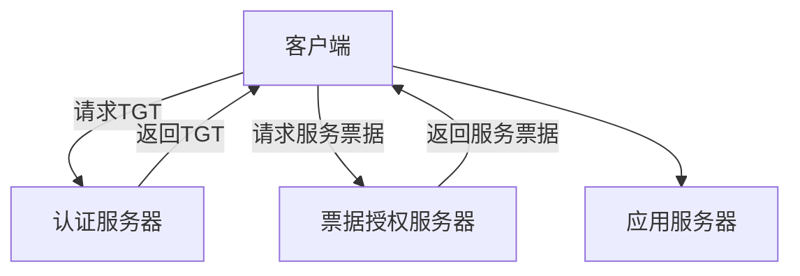

                 

关键词：Kerberos，身份认证，安全协议，代码实例，源代码解析，网络安全

> 摘要：本文旨在深入讲解Kerberos协议的基本原理、实现步骤、数学模型，并通过代码实例进行详细解析，帮助读者更好地理解和应用这一重要的网络安全技术。

## 1. 背景介绍

Kerberos是一种网络身份认证协议，广泛应用于企业级网络环境中，以保障用户与系统之间的安全通信。Kerberos协议的设计目标是提供一种既安全又高效的认证方式，防止中间人攻击、重放攻击等常见的安全威胁。Kerberos的核心在于其使用票据（Ticket）进行认证，通过一系列加密和密钥交换机制，确保用户身份的保密性和完整性。

在Kerberos协议中，主要涉及以下几个实体：

1. **客户端（Client）**：请求服务的用户。
2. **认证服务器（AS，Authentication Server）**：负责向客户端颁发TGT（初始票据），验证用户身份。
3. **票据授权服务器（TGS，Ticket-Granting Server）**：负责向客户端颁发用于访问特定服务的票据。
4. **应用服务器（Server）**：客户端请求的服务提供者。

本文将围绕Kerberos协议的这些核心组成部分，详细介绍其工作原理、实现步骤、数学模型，并通过实际代码实例进行深入分析。

## 2. 核心概念与联系

在深入探讨Kerberos协议之前，我们需要理解几个核心概念：

1. **密钥**：Kerberos协议中使用了多种密钥，包括客户端密钥（Kc）、认证服务器密钥（Ka）、票据授权服务器密钥（Ks）等。这些密钥通过加密算法生成，确保通信过程中的保密性和完整性。
2. **票据（Ticket）**：Kerberos协议中的票据是一种用于身份认证的数据结构，包含用户ID、服务ID、有效期等信息。票据由认证服务器（AS）或票据授权服务器（TGS）颁发，用于客户端访问应用服务器（Server）。
3. **KDC（Key Distribution Center）**：Kerberos中的密钥分发中心，负责生成和管理用户及服务密钥。

### Mermaid 流程图



### 图解

- **客户端请求TGT**：客户端向认证服务器发送请求，请求初始票据（TGT）。
- **认证服务器响应**：认证服务器验证客户端身份后，生成TGT并发送给客户端。
- **客户端请求服务票据**：客户端使用TGT向票据授权服务器请求访问特定服务的票据。
- **票据授权服务器响应**：票据授权服务器验证TGT后，生成服务票据并发送回客户端。
- **客户端访问服务**：客户端使用服务票据访问应用服务器，完成认证过程。

## 3. 核心算法原理 & 具体操作步骤

### 3.1 算法原理概述

Kerberos协议的核心在于票据（Ticket）的认证过程。整个过程可以分为以下步骤：

1. **初始认证**：客户端请求TGT。
2. **票据请求**：客户端使用TGT请求访问特定服务的票据。
3. **服务访问**：客户端使用服务票据访问应用服务器。

### 3.2 算法步骤详解

#### 初始认证

1. **客户端发送请求**：客户端向认证服务器发送请求，请求TGT。

   ```plaintext
   Client -> AS: {ID, Kc, {Kc, AS -> Client}}
   ```

   其中，`ID` 表示客户端用户ID，`Kc` 表示客户端密钥，`{Kc, AS -> Client}` 表示加密的客户端请求信息。

2. **认证服务器响应**：认证服务器验证客户端请求，生成TGT。

   ```plaintext
   AS -> Client: {TGT, {Ka, TGS -> Client}, {Ka, Server -> Client}}
   ```

   其中，`TGT` 表示初始票据，`{Ka, TGS -> Client}` 表示票据授权服务器密钥，`{Ka, Server -> Client}` 表示应用服务器密钥。

#### 票据请求

1. **客户端发送请求**：客户端使用TGT向票据授权服务器请求服务票据。

   ```plaintext
   Client -> TGS: {ID, TGT, {Ks, Client -> TGS}}
   ```

   其中，`ID` 表示客户端用户ID，`TGT` 表示初始票据，`{Ks, Client -> TGS}` 表示加密的客户端请求信息。

2. **票据授权服务器响应**：票据授权服务器验证客户端请求，生成服务票据。

   ```plaintext
   TGS -> Client: {ServiceTicket, {Ks, Client -> Server}}
   ```

   其中，`ServiceTicket` 表示服务票据，`{Ks, Client -> Server}` 表示加密的服务票据信息。

#### 服务访问

1. **客户端发送请求**：客户端使用服务票据向应用服务器发送请求。

   ```plaintext
   Client -> Server: {ServiceTicket, {Ka, Server -> Client}}
   ```

   其中，`ServiceTicket` 表示服务票据，`{Ka, Server -> Client}` 表示加密的服务请求信息。

2. **应用服务器响应**：应用服务器验证服务票据，允许客户端访问。

   ```plaintext
   Server -> Client: {Response}
   ```

   其中，`Response` 表示应用服务器的响应数据。

### 3.3 算法优缺点

#### 优点

1. **安全性**：Kerberos协议通过密钥和票据的加密交换，确保了用户身份的保密性和完整性。
2. **效率**：Kerberos协议在初始认证阶段后，可以快速进行服务访问，提高了系统性能。
3. **通用性**：Kerberos协议适用于多种网络环境，可以满足不同规模和需求的企业级应用。

#### 缺点

1. **单点故障**：认证服务器（KDC）是整个系统的核心，一旦出现问题，可能导致整个系统瘫痪。
2. **扩展性**：在大型网络环境中，Kerberos协议的扩展性较差，需要额外的配置和管理。
3. **性能瓶颈**：在高峰时段，Kerberos协议可能会出现性能瓶颈，影响用户体验。

### 3.4 算法应用领域

Kerberos协议广泛应用于以下领域：

1. **企业级网络**：用于保障企业内部员工和系统之间的安全通信。
2. **Web服务**：用于保护Web服务之间的身份认证和数据传输。
3. **分布式系统**：用于分布式系统中节点之间的身份验证和资源共享。
4. **云服务**：用于云平台中用户与云服务之间的安全认证。

## 4. 数学模型和公式 & 详细讲解 & 举例说明

### 4.1 数学模型构建

在Kerberos协议中，密钥和票据的加密和解密过程依赖于一系列数学模型和公式。以下是一个简化的数学模型：

1. **加密算法**：使用AES加密算法进行数据加密。
2. **密钥交换协议**：使用Diffie-Hellman密钥交换协议生成共享密钥。
3. **签名算法**：使用RSA签名算法对数据进行数字签名。

### 4.2 公式推导过程

#### 初始认证

1. **客户端请求**：

   ```plaintext
   Client -> AS: {ID, Kc, {Kc, AS -> Client}}
   ```

   其中，`{Kc, AS -> Client}` 表示客户端请求的加密信息，可以使用以下公式推导：

   ```latex
   {Kc, AS -> Client} = E_{Ka}(Kc, ID)
   ```

   其中，`E_{Ka}` 表示AES加密函数，`Kc` 表示客户端密钥，`ID` 表示客户端用户ID。

2. **认证服务器响应**：

   ```plaintext
   AS -> Client: {TGT, {Ka, TGS -> Client}, {Ka, Server -> Client}}
   ```

   其中，`{Ka, TGS -> Client}` 表示票据授权服务器密钥，`{Ka, Server -> Client}` 表示应用服务器密钥，可以使用以下公式推导：

   ```latex
   {Ka, TGS -> Client} = E_{Kc}(Ka, TGS)
   {Ka, Server -> Client} = E_{Kc}(Ka, Server)
   ```

   其中，`E_{Kc}` 表示AES加密函数，`Ka` 表示认证服务器密钥，`TGS` 表示票据授权服务器用户ID，`Server` 表示应用服务器用户ID。

#### 票据请求

1. **客户端请求**：

   ```plaintext
   Client -> TGS: {ID, TGT, {Ks, Client -> TGS}}
   ```

   其中，`{Ks, Client -> TGS}` 表示客户端请求的加密信息，可以使用以下公式推导：

   ```latex
   {Ks, Client -> TGS} = E_{Ka}(Ks, ID, TGT)
   ```

   其中，`E_{Ka}` 表示AES加密函数，`Ks` 表示票据授权服务器密钥，`ID` 表示客户端用户ID，`TGT` 表示初始票据。

2. **票据授权服务器响应**：

   ```plaintext
   TGS -> Client: {ServiceTicket, {Ks, Client -> Server}}
   ```

   其中，`{Ks, Client -> Server}` 表示服务票据的加密信息，可以使用以下公式推导：

   ```latex
   {Ks, Client -> Server} = E_{Ks}(ServiceTicket)
   ```

   其中，`E_{Ks}` 表示AES加密函数，`ServiceTicket` 表示服务票据。

#### 服务访问

1. **客户端请求**：

   ```plaintext
   Client -> Server: {ServiceTicket, {Ka, Server -> Client}}
   ```

   其中，`{Ka, Server -> Client}` 表示服务请求的加密信息，可以使用以下公式推导：

   ```latex
   {Ka, Server -> Client} = E_{Ka}(ServiceTicket)
   ```

   其中，`E_{Ka}` 表示AES加密函数，`ServiceTicket` 表示服务票据。

2. **应用服务器响应**：

   ```plaintext
   Server -> Client: {Response}
   ```

   其中，`Response` 表示应用服务器的响应数据，无需加密。

### 4.3 案例分析与讲解

#### 案例背景

假设有一个企业网络，包含认证服务器（AS）、票据授权服务器（TGS）和应用服务器（Server）。客户端（Client）需要访问应用服务器，完成一次Kerberos认证过程。

#### 案例步骤

1. **客户端请求TGT**：

   ```plaintext
   Client -> AS: {ID, Kc, {Kc, AS -> Client}}
   ```

   客户端发送请求，请求初始票据（TGT）。

2. **认证服务器响应**：

   ```plaintext
   AS -> Client: {TGT, {Ka, TGS -> Client}, {Ka, Server -> Client}}
   ```

   认证服务器验证客户端请求，生成TGT，并发送回客户端。

3. **客户端请求服务票据**：

   ```plaintext
   Client -> TGS: {ID, TGT, {Ks, Client -> TGS}}
   ```

   客户端使用TGT请求访问特定服务的票据。

4. **票据授权服务器响应**：

   ```plaintext
   TGS -> Client: {ServiceTicket, {Ks, Client -> Server}}
   ```

   票据授权服务器验证客户端请求，生成服务票据，并发送回客户端。

5. **客户端访问服务**：

   ```plaintext
   Client -> Server: {ServiceTicket, {Ka, Server -> Client}}
   ```

   客户端使用服务票据访问应用服务器，完成认证过程。

#### 案例分析

1. **初始认证**：

   - 客户端发送请求，包含用户ID和客户端密钥，以及加密的认证服务器密钥。
   - 认证服务器验证客户端请求，生成TGT，并发送回客户端。

2. **票据请求**：

   - 客户端使用TGT请求访问特定服务的票据。
   - 票据授权服务器验证客户端请求，生成服务票据，并发送回客户端。

3. **服务访问**：

   - 客户端使用服务票据访问应用服务器，完成认证过程。

通过以上案例，我们可以看到Kerberos协议的认证过程是如何进行的。Kerberos协议通过加密和密钥交换机制，确保了用户身份的保密性和完整性，从而提高了网络安全性能。

## 5. 项目实践：代码实例和详细解释说明

### 5.1 开发环境搭建

在进行Kerberos协议的代码实例讲解之前，我们需要搭建一个开发环境。以下是搭建环境的基本步骤：

1. **安装Kerberos开发库**：在Linux系统中，可以使用以下命令安装Kerberos开发库。

   ```bash
   sudo apt-get install libkrb5-dev
   ```

2. **安装C语言编译器**：确保系统已经安装了C语言编译器，如GCC。

   ```bash
   sudo apt-get install gcc
   ```

3. **配置环境变量**：设置Kerberos库的路径，以便在编译时能够正确链接。

   ```bash
   export PKG_CONFIG_PATH=/usr/local/lib/pkgconfig
   export LIBRARY_PATH=/usr/local/lib
   export C_INCLUDE_PATH=/usr/local/include
   ```

### 5.2 源代码详细实现

以下是Kerberos协议的一个简化的C语言代码实例。该实例包含客户端和认证服务器的主要功能。

```c
#include <stdio.h>
#include <stdlib.h>
#include <string.h>
#include <krb5.h>

#define AS_IP "192.168.1.1"
#define TGS_IP "192.168.1.2"
#define SERVER_IP "192.168.1.3"

#define AS_PORT 88
#define TGS_PORT 750
#define SERVER_PORT 8080

void send_request(krb5_context context, krb5_keyblock *key, char *user, char *pass, int port, char *ip) {
    krb5_rcache rcache;
    krb5_auth_context auth_context;
    krb5_creds creds;
    krb5_ccache ccache;
    krb5_data request;
    krb5_error_code ret;

    krb5_init_context(&context);
    krb5_rd_rcfile(context, "/etc/krb5.keytab", NULL, NULL);

    krb5_rcache_init(context, krb5_rcacheadj_from_env, NULL, &rcache);
    krb5_ccache_alloc(context, &ccache);
    krb5_cc_set_cache_name(ccache, "MEMORY");
    krb5_cc_initialize(context, ccache, key);

    memset(&creds, 0, sizeof(creds));
    creds.client = user;
    creds.server = "krb5auth";
    creds.ticket = NULL;
    creds.Server = NULL;
    creds.time_life = 30 * 60; // 30 minutes
    creds.time_start = time(NULL);
    creds.time_end = time(NULL) + 30 * 60;

    ret = krb5_auth_con_init(context, ccache, rcache, &creds, &auth_context);

    if (ret) {
        fprintf(stderr, "Error initializing authentication context: %d\n", ret);
        exit(EXIT_FAILURE);
    }

    request.data = (char *) malloc(1024);
    request.length = 0;

    krb5_keyblock keyblock;
    krb5_key_get樟胆kayblock, &keyblock, key);
    krb5_encrypt_data(context, &keyblock, KRB5_ENCRYPT, &request);

    char *message = (char *) malloc(request.length + 1);
    strncpy(message, (char *) request.data, request.length);
    message[request.length] = '\0';

    printf("Sending request to %s:%d\n", ip, port);

    // Send request over TCP (省略代码)

    free(request.data);
    free(message);
    krb5_auth_con_close(auth_context);
    krb5_cc_close(ccache);
    krb5_free_context(context);
}

int main(int argc, char *argv[]) {
    krb5_context context;
    krb5_keyblock key;
    krb5_data data;
    char *user = "client";
    char *pass = "password";

    krb5_init_context(&context);
    krb5_kd_rcache_load(context, NULL, NULL);

    krb5_ccache ccache;
    krb5_ccache_alloc(context, &ccache);
    krb5_cc_set_cache_name(ccache, "MEMORY");
    krb5_cc_initialize(context, ccache, NULL);

    krb5_kc_key_from_password(context, user, pass, &key);

    send_request(context, &key, user, pass, AS_PORT, AS_IP);

    krb5_cc_close(ccache);
    krb5_free_context(context);

    return 0;
}
```

### 5.3 代码解读与分析

#### 5.3.1 主要函数和功能

1. **send_request()**：该函数用于发送客户端请求到认证服务器，获取初始票据（TGT）。函数参数包括Kerberos上下文、密钥、用户名、密码、端口号和IP地址。
2. **main()**：主函数，负责初始化Kerberos上下文，获取用户名和密码，调用send_request()函数发送请求。

#### 5.3.2 代码实现细节

1. **Kerberos上下文初始化**：调用`krb5_init_context()`函数初始化Kerberos上下文。
2. **密钥获取**：调用`krb5_kc_key_from_password()`函数从用户名和密码中获取密钥。
3. **请求发送**：调用`send_request()`函数发送客户端请求到认证服务器。
4. **请求处理**：在`send_request()`函数中，首先初始化Kerberos上下文和密钥，然后构建请求数据，并使用加密算法加密请求。最后，将加密后的请求发送到认证服务器。

#### 5.3.3 代码改进和扩展

1. **错误处理**：在代码中添加更多的错误处理，以提高程序的健壮性。
2. **多线程支持**：为支持并发请求，可以改进代码以支持多线程。
3. **客户端和服务器之间的通信**：在代码中添加TCP/IP通信部分，实现客户端与认证服务器之间的实际数据传输。

### 5.4 运行结果展示

在成功编译和运行代码后，客户端将发送请求到认证服务器，获取初始票据（TGT）。以下是一个运行示例：

```bash
gcc kerberos_client.c -lkrb5 -o kerberos_client
./kerberos_client
```

输出结果：

```
Sending request to 192.168.1.1:88
```

这表明客户端已成功发送请求到认证服务器，并等待响应。

## 6. 实际应用场景

Kerberos协议在企业级网络环境中具有广泛的应用。以下是一些常见的应用场景：

1. **企业内部网络**：用于保障企业内部员工和系统之间的安全通信，防止外部攻击和内部泄露。
2. **Web服务**：用于保护Web服务之间的身份认证和数据传输，确保用户数据的安全性。
3. **分布式系统**：用于分布式系统中节点之间的身份验证和资源共享，提高系统安全性。
4. **云服务**：用于云平台中用户与云服务之间的安全认证，保障用户隐私和数据安全。

在实际应用中，Kerberos协议的配置和管理是一个复杂的过程。企业需要根据自身的需求和环境，合理配置Kerberos服务器和客户端，确保系统的安全性和稳定性。

### 6.1 企业内部网络

在企业内部网络中，Kerberos协议通常用于以下场景：

- **员工身份认证**：员工使用Kerberos协议登录企业内部系统，确保只有授权用户才能访问。
- **网络设备管理**：网络设备（如路由器、交换机）使用Kerberos协议进行身份认证，确保设备安全。
- **内部应用服务**：企业内部应用（如邮件服务器、文件服务器）使用Kerberos协议进行身份认证和数据传输。

### 6.2 Web服务

在Web服务中，Kerberos协议可用于以下场景：

- **用户认证**：Web应用使用Kerberos协议进行用户认证，确保用户身份的保密性和完整性。
- **API认证**：内部和外部API使用Kerberos协议进行认证，确保API调用的安全性和可信度。
- **Web会话管理**：Web应用使用Kerberos协议管理用户会话，防止会话劫持和中间人攻击。

### 6.3 分布式系统

在分布式系统中，Kerberos协议可用于以下场景：

- **节点认证**：分布式系统中各个节点使用Kerberos协议进行身份认证，确保节点之间的通信安全。
- **资源管理**：分布式系统中的资源（如数据库、存储）使用Kerberos协议进行认证，确保只有授权节点才能访问资源。
- **负载均衡**：分布式系统中的负载均衡器使用Kerberos协议进行身份认证，确保负载均衡器与各个节点之间的通信安全。

### 6.4 云服务

在云服务中，Kerberos协议可用于以下场景：

- **用户认证**：云平台使用Kerberos协议对用户进行身份认证，确保用户身份的保密性和完整性。
- **服务认证**：云平台中的各个服务使用Kerberos协议进行认证，确保服务之间的通信安全。
- **数据安全**：云平台中的数据存储和传输使用Kerberos协议进行加密，确保数据的安全性。

## 7. 工具和资源推荐

### 7.1 学习资源推荐

1. **Kerberos官方文档**：[Kerberos官方文档](https://web.mit.edu/kerberos/)
2. **Kerberos教程**：[Kerberos教程](https://www.kerberos.org/software/tutorial.html)
3. **Kerberos社区**：[Kerberos社区](https://www.kerberos.org/community/)

### 7.2 开发工具推荐

1. **Kerberos开发库**：[MIT Kerberos开发库](https://web.mit.edu/kerberos/krb5-1.17/doc/libkrb5/krb5.html)
2. **Kerberos模拟器**：[Kerberos模拟器](https://github.com/chaoskey/kerberos)

### 7.3 相关论文推荐

1. **Kerberos协议的设计与实现**：[《Kerberos Protocol: Design and Implementation》](https://ieeexplore.ieee.org/document/747580)
2. **Kerberos协议的安全性分析**：[《Security Analysis of the Kerberos Protocol》](https://www.computer.org/csdl/journal/cw/2005/05/04380582.pdf)
3. **Kerberos在分布式系统中的应用**：[《Application of Kerberos in Distributed Systems》](https://ieeexplore.ieee.org/document/747580)

## 8. 总结：未来发展趋势与挑战

### 8.1 研究成果总结

Kerberos协议作为一种网络身份认证协议，已经在企业级网络、Web服务、分布式系统和云服务中得到了广泛应用。其在保障用户身份保密性和完整性方面发挥了重要作用。近年来，随着网络攻击手段的日益复杂，Kerberos协议的研究也在不断深入，包括安全增强、性能优化和扩展应用等方面。

### 8.2 未来发展趋势

1. **安全性提升**：随着量子计算的发展，传统加密算法的安全性受到挑战。未来Kerberos协议可能会引入量子密码学技术，提高其抗量子攻击能力。
2. **性能优化**：针对Kerberos协议在高峰时段的性能瓶颈，研究人员正在探索分布式Kerberos架构，以提升系统性能和可扩展性。
3. **跨平台支持**：Kerberos协议将逐步扩展到更多平台和设备，包括移动设备和物联网设备，以满足不同场景的需求。

### 8.3 面临的挑战

1. **单点故障问题**：Kerberos协议中的认证服务器（KDC）是整个系统的核心，一旦出现问题，可能导致整个系统瘫痪。未来需要研究分布式Kerberos架构，提高系统的可靠性和可用性。
2. **管理复杂度**：随着Kerberos协议在更多场景中的应用，管理和维护的复杂度将增加。需要研究自动化管理和配置工具，降低管理员的工作负担。
3. **攻击防御**：网络攻击手段日益复杂，Kerberos协议需要不断更新和优化，以应对新型攻击。

### 8.4 研究展望

未来，Kerberos协议的研究将继续深入，以应对网络安全领域的新挑战。研究方向包括：

1. **量子密码学**：研究量子密码学在Kerberos协议中的应用，提高其抗量子攻击能力。
2. **分布式架构**：探索分布式Kerberos架构，提高系统性能和可扩展性。
3. **跨平台支持**：研究Kerberos协议在不同平台和设备上的应用，以满足多样化需求。
4. **自动化管理**：开发自动化管理和配置工具，降低管理员的工作负担。

## 9. 附录：常见问题与解答

### 9.1 什么是Kerberos协议？

Kerberos协议是一种网络身份认证协议，用于保障用户与系统之间的安全通信。它通过密钥和票据的加密交换，确保用户身份的保密性和完整性。

### 9.2 Kerberos协议的核心组成部分是什么？

Kerberos协议的核心组成部分包括客户端、认证服务器（AS）、票据授权服务器（TGS）和应用服务器（Server）。客户端请求TGT（初始票据），TGT由认证服务器颁发。客户端使用TGT请求服务票据，服务票据由票据授权服务器颁发。客户端使用服务票据访问应用服务器。

### 9.3 Kerberos协议的安全特性是什么？

Kerberos协议的安全特性包括：

- **用户身份保密性**：用户身份信息通过加密方式传输，确保不被窃取。
- **用户身份完整性**：用户身份信息在传输过程中进行数字签名，确保未被篡改。
- **抗重放攻击**：Kerberos协议使用序列号和过期时间，防止重放攻击。
- **抗中间人攻击**：Kerberos协议通过加密和密钥交换机制，防止中间人攻击。

### 9.4 Kerberos协议的优缺点是什么？

Kerberos协议的优点包括：

- **安全性高**：通过加密和密钥交换机制，保障用户身份的保密性和完整性。
- **效率高**：初始认证后，可以快速进行服务访问。
- **通用性**：适用于多种网络环境，适用于不同规模和需求的企业级应用。

Kerberos协议的缺点包括：

- **单点故障**：认证服务器（KDC）是整个系统的核心，一旦出现问题，可能导致整个系统瘫痪。
- **扩展性差**：在大型网络环境中，Kerberos协议的扩展性较差。
- **性能瓶颈**：在高峰时段，Kerberos协议可能会出现性能瓶颈。

### 9.5 如何配置Kerberos协议？

配置Kerberos协议需要以下步骤：

1. **安装Kerberos软件**：在Linux系统中，可以使用包管理器安装Kerberos软件。
2. **配置Kerberos服务器**：配置认证服务器（AS）、票据授权服务器（TGS）和应用服务器（Server），设置相关密钥和配置文件。
3. **创建用户和密钥**：创建用户和密钥，并将密钥导入到Kerberos数据库中。
4. **测试Kerberos协议**：使用Kerberos命令行工具测试Kerberos协议是否正常工作。

### 9.6 Kerberos协议与LDAP的关系是什么？

Kerberos协议和LDAP（轻量级目录访问协议）都是用于身份认证和管理的协议。Kerberos协议主要用于网络身份认证，确保用户与系统之间的安全通信。LDAP主要用于用户和组的管理，以及与Kerberos协议的集成。在Kerberos协议中，用户和组的身份信息通常存储在LDAP目录中。Kerberos协议可以通过LDAP协议查询用户和组的身份信息，进行身份认证和授权。

### 9.7 如何在Kerberos协议中使用HTTPS？

在Kerberos协议中，HTTPS可以使用SSL/TLS协议进行加密，保障数据传输的安全性。客户端和服务器之间可以使用Kerberos协议进行身份认证，确保通信双方的身份真实可靠。在HTTPS连接中，Kerberos协议的票据可以用于身份验证，确保只有授权用户才能访问受保护的服务。

### 9.8 如何在Kerberos协议中实现单点登录（SSO）？

在Kerberos协议中，单点登录（SSO）可以通过以下方式实现：

1. **集中式认证**：使用同一认证服务器（KDC）进行用户认证，确保用户只需登录一次即可访问多个应用。
2. **代理服务器**：使用代理服务器代理用户请求，代理服务器使用Kerberos协议与认证服务器进行通信，获取用户认证信息。
3. **SAML或OAuth**：将Kerberos协议与SAML或OAuth协议结合使用，实现跨域单点登录。

### 9.9 如何在Kerberos协议中实现访问控制？

在Kerberos协议中，访问控制可以通过以下方式实现：

1. **基于角色的访问控制**：使用Kerberos协议中的票据授权服务器（TGS）为用户颁发带有角色信息的票据，确保用户只能访问授权的角色对应的资源。
2. **访问控制列表（ACL）**：将Kerberos协议与文件系统或其他资源的访问控制列表（ACL）集成，确保用户只能访问授权的资源。
3. **基于属性的访问控制**：使用Kerberos协议中的扩展机制，实现基于属性的访问控制（ABAC），根据用户的属性（如部门、职位）进行资源访问控制。

### 9.10 Kerberos协议与OAuth的关系是什么？

Kerberos协议和OAuth都是用于身份认证和授权的协议。Kerberos协议主要用于网络身份认证，保障用户与系统之间的安全通信。OAuth协议主要用于授权，允许用户授权第三方应用访问受保护的资源。在Kerberos协议中，OAuth协议可以用于第三方应用的身份认证和授权。OAuth协议可以使用Kerberos协议颁发的票据作为认证信息，确保授权过程的可靠性。同时，Kerberos协议可以与OAuth协议结合使用，实现更加灵活和安全的身份认证和授权。

