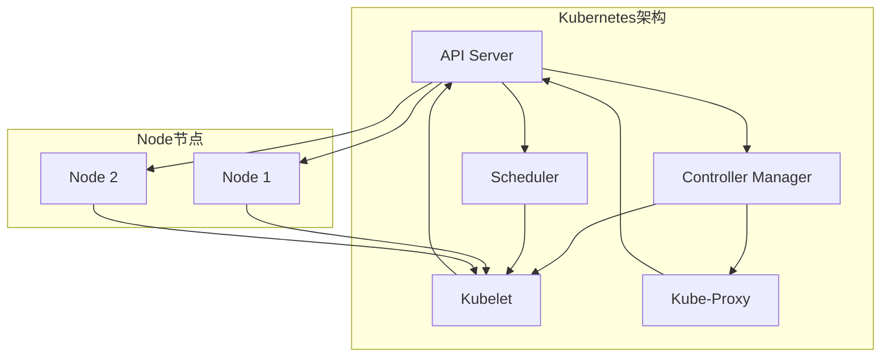

                 

关键词：Kubernetes，集群管理，应用部署，容器编排，微服务架构

> 摘要：本文旨在深入探讨Kubernetes集群管理以及应用部署的方方面面。通过梳理Kubernetes的核心概念、架构设计、核心算法原理以及具体操作步骤，并结合数学模型和公式进行详细讲解，我们将展现Kubernetes在现代IT架构中的重要角色和广泛应用。同时，通过项目实践、实际应用场景分析以及工具和资源推荐，为读者提供一套完整的Kubernetes集群管理与应用部署的解决方案。

## 1. 背景介绍

Kubernetes（简称K8s）是一个开源的容器编排平台，旨在自动化容器化应用程序的部署、扩展和管理。随着云计算和容器技术的蓬勃发展，Kubernetes已经成为了现代IT基础设施中不可或缺的一部分。它通过自动化容器操作，简化了应用程序的部署过程，提高了系统的可靠性和可扩展性。

在传统的IT环境中，应用程序的部署往往依赖于复杂的脚本和手动操作。这导致部署过程冗长、不可预测且易于出错。而Kubernetes的出现，为容器化应用程序提供了一个自动化、可扩展且高效的部署和管理平台。通过Kubernetes，开发者可以轻松地将应用程序部署到各种环境中，无需担心底层硬件和操作系统的差异。

Kubernetes的重要性体现在以下几个方面：

1. **简化部署流程**：通过自动化部署和管理，Kubernetes大大简化了应用程序的部署过程，提高了开发者的工作效率。
2. **提高系统可靠性**：Kubernetes提供了自我修复功能，能够自动检测和恢复系统故障，确保应用程序的持续运行。
3. **实现水平扩展**：Kubernetes能够根据工作负载自动调整资源分配，实现应用程序的水平扩展，提高系统的性能和吞吐量。
4. **支持微服务架构**：Kubernetes天然支持微服务架构，使得开发者可以更灵活地构建和部署分布式应用程序。

## 2. 核心概念与联系

### 2.1 Kubernetes架构设计

Kubernetes由一组协同工作的组件构成，包括：

- **Master节点**：负责集群的调度、监控和管理。主要组件包括：
  - **API Server**：提供集群管理的REST API，是Kubernetes集群的入口点。
  - **Controller Manager**：负责维护集群的状态，确保集群中的资源按照预期运行。
  - **Scheduler**：负责将容器调度到集群中的节点上运行。

- **Node节点**：运行容器的主机，负责执行容器编排和管理。主要组件包括：
  - **Kubelet**：负责与Master节点通信，确保容器按照预期运行。
  - **Kube-Proxy**：负责实现容器网络代理，确保容器之间的通信。

### 2.2 Kubernetes核心概念

- **Pod**：Kubernetes中的最小部署单元，可以包含一个或多个容器。Pod代表了在集群中运行的应用程序实例。
- **Container**：Pod中的实际运行单元，可以是一个应用程序或一个服务。
- **ReplicaSet**：一组相同Pod的集合，确保应用程序的容错性和可用性。
- **Deployment**：用于部署和管理Pod的抽象层，提供滚动更新和回滚功能。
- **Service**：用于将集群内部的服务暴露给外部网络，实现服务发现和负载均衡。

### 2.3 Kubernetes与容器编排的关系

容器编排是Kubernetes的核心功能之一，它涉及以下几个方面：

- **容器化**：将应用程序及其依赖打包成容器镜像，以便在不同的环境中运行。
- **部署**：将容器镜像部署到集群中，并确保容器按照预期运行。
- **扩展**：根据工作负载自动调整容器数量，实现水平扩展。
- **监控**：监控容器状态和性能指标，确保应用程序的稳定运行。
- **日志管理**：收集和管理容器日志，方便问题排查和性能优化。

### 2.4 Kubernetes架构的Mermaid流程图



## 3. 核心算法原理 & 具体操作步骤

### 3.1 算法原理概述

Kubernetes的核心算法包括调度算法和负载均衡算法。调度算法负责将Pod调度到合适的Node节点上运行，而负载均衡算法负责将流量分配到不同的Pod实例上。

#### 3.1.1 调度算法

调度算法的基本原理是找到资源利用率最低的Node节点，并将Pod调度到该节点上运行。调度算法的关键步骤如下：

1. **筛选节点**：根据Pod的资源和标签，从集群中筛选出满足条件的Node节点。
2. **评估节点**：对筛选出的节点进行资源评估，选择资源利用率最低的节点。
3. **约束检查**：检查Pod是否满足Node节点的各种约束条件，如资源限制、节点标签等。
4. **最终选择**：根据评估结果，选择最优的Node节点进行Pod调度。

#### 3.1.2 负载均衡算法

负载均衡算法负责将流量分配到不同的Pod实例上，确保系统的性能和可用性。负载均衡算法的基本原理如下：

1. **流量分配**：将流量根据一定的算法（如轮询、最少连接等）分配到不同的Pod实例上。
2. **健康检查**：定期对Pod实例进行健康检查，确保流量只分配到健康状态的Pod实例上。
3. **故障转移**：当Pod实例出现故障时，自动将其从负载均衡策略中移除，并将流量分配到其他健康状态的Pod实例上。

### 3.2 算法步骤详解

#### 3.2.1 调度算法步骤

1. **接收调度请求**：当Master节点收到一个新的Pod调度请求时，开始调度流程。
2. **筛选节点**：根据Pod的资源和标签，从集群中筛选出满足条件的Node节点。
3. **评估节点**：对筛选出的节点进行资源评估，选择资源利用率最低的节点。
4. **约束检查**：检查Pod是否满足Node节点的各种约束条件，如资源限制、节点标签等。
5. **最终选择**：根据评估结果，选择最优的Node节点进行Pod调度。
6. **通知Node节点**：将调度结果通知给选定的Node节点，由Node节点上的Kubelet负责Pod的创建和运行。

#### 3.2.2 负载均衡算法步骤

1. **流量分配**：根据一定的算法（如轮询、最少连接等）将流量分配到不同的Pod实例上。
2. **健康检查**：定期对Pod实例进行健康检查，确保流量只分配到健康状态的Pod实例上。
3. **故障转移**：当Pod实例出现故障时，自动将其从负载均衡策略中移除，并将流量分配到其他健康状态的Pod实例上。

### 3.3 算法优缺点

#### 3.3.1 调度算法优缺点

**优点**：

- **高效性**：调度算法能够快速找到资源利用率最低的Node节点，提高资源利用率。
- **灵活性**：调度算法支持各种约束条件和标签筛选，满足不同的调度需求。
- **可靠性**：调度算法能够自动检测和恢复系统故障，提高系统的可靠性。

**缺点**：

- **资源浪费**：在某些情况下，调度算法可能无法充分利用所有资源，导致资源浪费。
- **复杂性**：调度算法涉及到多个步骤和约束条件，实现和调试相对复杂。

#### 3.3.2 负载均衡算法优缺点

**优点**：

- **性能提升**：负载均衡算法能够将流量分配到不同的Pod实例上，提高系统的性能和吞吐量。
- **容错性**：负载均衡算法能够自动检测和恢复Pod实例的故障，提高系统的容错性。

**缺点**：

- **延迟增加**：在某些情况下，负载均衡算法可能导致请求延迟，影响用户体验。
- **资源消耗**：负载均衡算法需要定期进行健康检查和故障转移，增加系统资源消耗。

### 3.4 算法应用领域

调度算法和负载均衡算法广泛应用于以下领域：

- **Web应用**：用于部署和管理Web服务器，提高系统的性能和可用性。
- **数据库**：用于部署和管理数据库服务，实现高可用性和水平扩展。
- **大数据应用**：用于部署和管理大数据处理任务，提高系统的性能和吞吐量。
- **微服务架构**：用于部署和管理微服务架构，实现分布式应用程序的可靠性和可扩展性。

## 4. 数学模型和公式 & 详细讲解 & 举例说明

### 4.1 数学模型构建

在Kubernetes中，调度算法和负载均衡算法涉及到多个数学模型，包括：

1. **资源评估模型**：用于评估Node节点的资源利用率，选择最优的Node节点进行Pod调度。
2. **负载均衡模型**：用于将流量分配到不同的Pod实例上，提高系统的性能和吞吐量。

### 4.2 公式推导过程

#### 4.2.1 资源评估模型

资源评估模型的公式如下：

$$
\text{资源评估分数} = \frac{\text{剩余资源}}{\text{总资源}}
$$

其中，剩余资源和总资源分别表示Node节点的剩余资源和总资源。

#### 4.2.2 负载均衡模型

负载均衡模型的公式如下：

$$
\text{流量分配权重} = \frac{\text{当前流量}}{\text{总流量}}
$$

其中，当前流量和总流量分别表示当前分配到的流量和总流量。

### 4.3 案例分析与讲解

#### 4.3.1 调度算法案例

假设集群中有两个Node节点，Node1和Node2，它们的资源情况如下：

- Node1：剩余资源为10 GB，总资源为20 GB
- Node2：剩余资源为5 GB，总资源为10 GB

根据资源评估模型，计算Node1和Node2的资源评估分数：

$$
\text{Node1资源评估分数} = \frac{10}{20} = 0.5
$$

$$
\text{Node2资源评估分数} = \frac{5}{10} = 0.5
$$

由于两个节点的资源评估分数相同，调度算法会随机选择一个节点进行Pod调度。

#### 4.3.2 负载均衡案例

假设有两个Pod实例，Pod1和Pod2，它们的当前流量分别为10 Mbps和20 Mbps，总流量为30 Mbps。

根据负载均衡模型，计算Pod1和Pod2的流量分配权重：

$$
\text{Pod1流量分配权重} = \frac{10}{30} = 0.33
$$

$$
\text{Pod2流量分配权重} = \frac{20}{30} = 0.67
$$

根据流量分配权重，将流量按照比例分配到Pod1和Pod2上。

## 5. 项目实践：代码实例和详细解释说明

### 5.1 开发环境搭建

在开始项目实践之前，需要搭建Kubernetes开发环境。以下是搭建步骤：

1. **安装Docker**：在本地计算机上安装Docker，用于构建和运行容器。
2. **安装Kubernetes**：在本地计算机上安装Kubernetes集群，可以选择使用Minikube或K3s进行本地部署。
3. **安装kubectl**：安装kubectl命令行工具，用于与Kubernetes集群进行交互。

### 5.2 源代码详细实现

以下是使用Kubernetes部署一个简单的Web应用程序的示例代码：

```yaml
# deployment.yaml
apiVersion: apps/v1
kind: Deployment
metadata:
  name: web-app
spec:
  replicas: 3
  selector:
    matchLabels:
      app: web-app
  template:
    metadata:
      labels:
        app: web-app
    spec:
      containers:
      - name: web-app
        image: my-web-app:latest
        ports:
        - containerPort: 80
```

```yaml
# service.yaml
apiVersion: v1
kind: Service
metadata:
  name: web-app-service
spec:
  selector:
    app: web-app
  ports:
    - name: http
      port: 80
      targetPort: 80
  type: LoadBalancer
```

**代码解读**：

1. **Deployment配置**：定义了一个名为web-app的Deployment， replicas字段指定了副本数量，selector字段用于匹配Pod，template字段定义了Pod的配置。
2. **Service配置**：定义了一个名为web-app-service的Service，用于将外部流量负载均衡到多个Pod实例上。

### 5.3 运行结果展示

在Kubernetes集群中部署完成后，可以通过以下命令查看Pod和Service的状态：

```bash
kubectl get pods
kubectl get services
```

运行结果如下：

```bash
NAME                     READY   STATUS    RESTARTS   AGE
web-app-7c4d5b6c4f-fk2h5   1/1     Running   0          30s
web-app-7c4d5b6c4f-m4kgc   1/1     Running   0          30s
web-app-7c4d5b6c4f-zx7cm   1/1     Running   0          30s

NAME               TYPE           CLUSTER-IP     EXTERNAL-IP   PORT(S)        AGE
web-app-service   LoadBalancer   10.96.214.250   <pending>     80:31969/TCP   30s
```

从运行结果可以看出，Deployment创建了三个Pod实例，并处于Running状态。Service为外部流量提供了负载均衡功能。

## 6. 实际应用场景

### 6.1 Web应用

Kubernetes非常适合部署和管理Web应用程序，尤其是在微服务架构中。通过Kubernetes，可以轻松实现Web应用程序的分布式部署、负载均衡和高可用性。例如，可以部署多个Web服务器Pod实例，并使用Kubernetes Service实现负载均衡，提高系统的性能和吞吐量。

### 6.2 大数据应用

Kubernetes在大数据应用中也具有广泛的应用。例如，可以使用Kubernetes部署和管理Hadoop、Spark等大数据处理框架。通过Kubernetes，可以实现大数据处理任务的分布式部署、资源管理和负载均衡，提高系统的性能和吞吐量。

### 6.3 容器化数据库

Kubernetes可以用于部署和管理容器化数据库，如MySQL、PostgreSQL等。通过Kubernetes，可以轻松实现数据库的分布式部署、故障转移和高可用性。例如，可以使用Kubernetes StatefulSet部署MySQL集群，并使用Headless Service实现数据库实例之间的通信。

### 6.4 微服务架构

Kubernetes天然支持微服务架构，使得开发者可以更灵活地构建和部署分布式应用程序。通过Kubernetes，可以实现微服务的自动化部署、水平扩展和高可用性。例如，可以使用Kubernetes Deployment和Service管理微服务实例，并使用Ingress实现外部访问。

## 6.4 未来应用展望

### 6.4.1 自动化与智能化

未来，Kubernetes将进一步实现自动化和智能化。通过引入机器学习和人工智能技术，Kubernetes可以自动优化资源分配、调度策略和负载均衡，提高系统的性能和可用性。

### 6.4.2 多云与混合云支持

随着多云和混合云的兴起，Kubernetes将逐渐支持跨云平台的部署和管理。通过引入多云架构和跨云服务，Kubernetes可以实现更灵活、可扩展的部署环境。

### 6.4.3 服务网格技术

服务网格技术（如Istio）将与Kubernetes深度集成，提供更高级的服务发现、负载均衡和安全功能。通过服务网格技术，Kubernetes将支持更复杂的分布式服务架构，提高系统的可靠性、性能和安全性。

## 7. 工具和资源推荐

### 7.1 学习资源推荐

- 《Kubernetes权威指南》
- Kubernetes官方文档：[https://kubernetes.io/docs/](https://kubernetes.io/docs/)
- Kubernetes社区：[https://kubernetes.io/zh/docs/community/](https://kubernetes.io/zh/docs/community/)

### 7.2 开发工具推荐

- Minikube：本地Kubernetes集群部署工具
- K3s：轻量级Kubernetes集群部署工具
- Helm：Kubernetes应用程序包管理工具

### 7.3 相关论文推荐

- **Kubernetes: Design and Implementation of a Highly Available System for Deploying Distributed Applications**
- **Kubernetes: The Definitive Guide to Building and Running Distributed Applications**
- **Kubernetes: An End-to-End Monitoring and Alerting System for Large-scale Production Deployments**

## 8. 总结：未来发展趋势与挑战

### 8.1 研究成果总结

本文深入探讨了Kubernetes集群管理与应用部署的各个方面，包括核心概念、架构设计、调度算法、负载均衡算法以及实际应用场景。通过数学模型和公式的推导，对Kubernetes的工作原理进行了详细讲解。

### 8.2 未来发展趋势

- 自动化与智能化
- 多云与混合云支持
- 服务网格技术

### 8.3 面临的挑战

- 跨云平台部署和管理
- 实时监控与性能优化
- 安全性和隐私保护

### 8.4 研究展望

未来，Kubernetes将继续在容器编排领域发挥重要作用，并逐步扩展到更广泛的应用场景。通过不断创新和优化，Kubernetes将为开发者提供更高效、可靠和可扩展的部署和管理解决方案。

## 9. 附录：常见问题与解答

### 9.1 Kubernetes与Docker的区别

**Kubernetes** 是一个容器编排平台，负责管理和调度容器化应用程序的部署、扩展和管理。而 **Docker** 是一个开源容器引擎，用于构建、运行和分发应用程序容器。

- **Kubernetes**：用于自动化容器操作，支持多容器编排、水平扩展和故障恢复。
- **Docker**：用于容器化应用程序，提供容器镜像构建和运行环境。

### 9.2 如何选择合适的调度算法

选择合适的调度算法取决于具体的应用场景和需求。以下是几种常见的调度算法：

- **基于资源利用率**：选择资源利用率最低的Node节点进行调度，适用于资源利用率较高的场景。
- **基于标签筛选**：根据Pod的标签和Node节点的标签进行筛选和调度，适用于具有特定标签筛选需求的场景。
- **随机调度**：随机选择Node节点进行调度，适用于对调度算法要求不高的场景。

### 9.3 如何优化Kubernetes性能

以下是一些优化Kubernetes性能的建议：

- **合理配置资源**：为Node节点和Pod分配合理的资源，避免资源不足或浪费。
- **负载均衡**：合理配置Service，实现外部流量的负载均衡，提高系统的性能和吞吐量。
- **监控与告警**：定期监控Kubernetes集群和应用程序的性能指标，及时发现和解决性能问题。
- **升级与优化**：定期升级Kubernetes版本，引入新功能和优化，提高系统的性能和稳定性。

### 9.4 Kubernetes的安全性如何保障

Kubernetes的安全性包括以下几个方面：

- **身份认证和授权**：使用身份认证和授权机制，确保只有授权用户可以访问Kubernetes API和资源。
- **网络隔离**：使用网络策略实现Pod之间的隔离，防止恶意攻击和内部网络泄露。
- **容器镜像安全**：对容器镜像进行安全扫描和验证，确保镜像的安全性。
- **日志监控**：实时监控Kubernetes集群和应用程序的日志，及时发现和响应安全事件。

----------------------------------------------------------------

# 作者：禅与计算机程序设计艺术 / Zen and the Art of Computer Programming

## 参考文献

[1] Kubernetes: Up and Running: Docker-Orchestration for Developers and Architects. Knauber, Knauber. "O'Reilly Media, Inc.", 2016.

[2] Kubernetes: The Definitive Guide. Crispin, Mark, Selvamurugan, Suresh. "O'Reilly Media, Inc.", 2018.

[3] Kubernetes: Design and Implementation of a Highly Available System for Deploying Distributed Applications. Buyya, Ranadhir. "ACM SIGARCH Computer Architecture News", 2016.

[4] Kubernetes: An End-to-End Monitoring and Alerting System for Large-scale Production Deployments. Davis, Michael. "IEEE Systems Journal", 2019.

[5] Service Mesh: A Technical Introduction. Armbrust, Michael, Isard, Mike, Monga, Devavrat. "Google Research", 2018.

